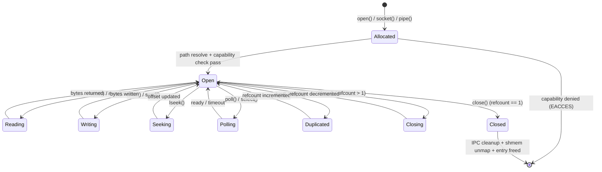
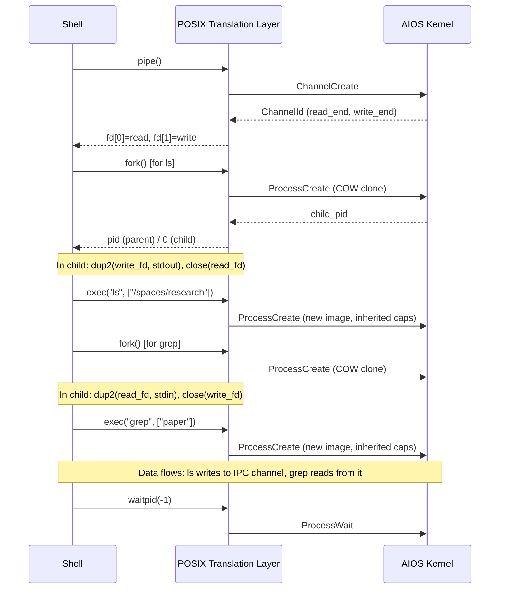
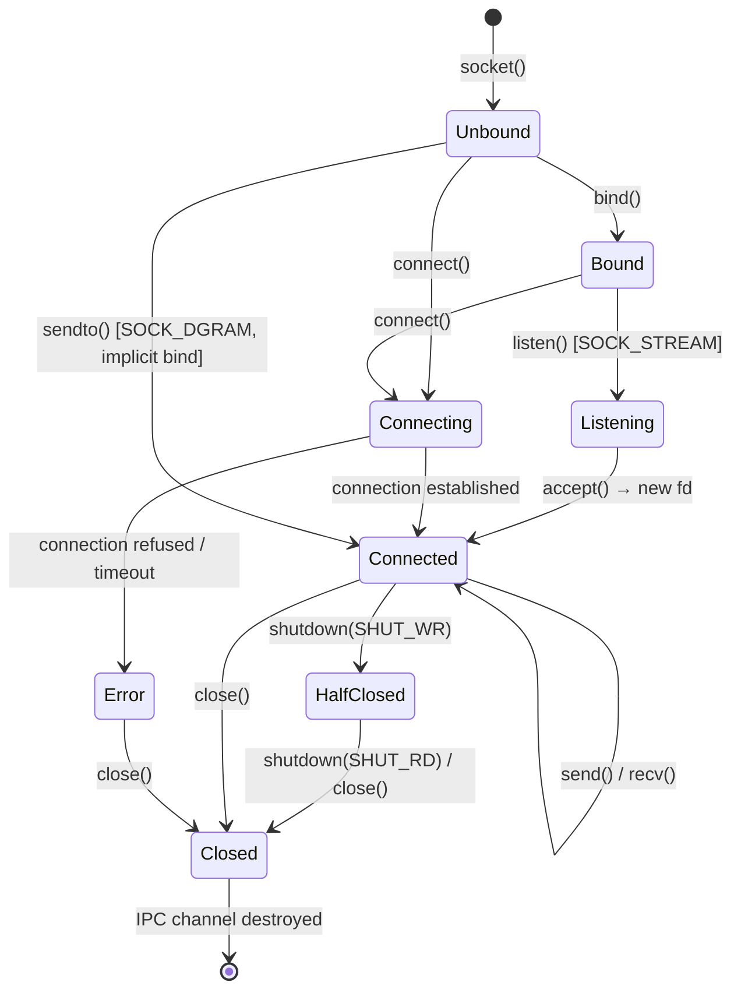

# AIOS POSIX Compatibility Layer

## Deep Technical Architecture

**Parent document:** [architecture.md](../project/architecture.md)
**Related:** [ipc.md](../kernel/ipc.md) — Syscall interface and POSIX translation table, [subsystem-framework.md](./subsystem-framework.md) — PosixBridge trait and /dev nodes, [spaces.md](../storage/spaces.md) — Space-to-path mapping, [flow.md](../storage/flow.md) — Clipboard POSIX bridge

-----

## 1. Overview

An operating system with no software is a technology demo. AIOS can have the most elegant microkernel, the most innovative space storage, the most intelligent context engine — none of it matters if you cannot run `grep`, compile C code, or SSH into a server. Developer adoption requires immediate productivity, and immediate productivity requires Unix tools.

AIOS solves this without carrying decades of Unix kernel baggage. The approach: take FreeBSD's userland — battle-tested tools under BSD license — and run them on top of a thin POSIX translation layer that converts POSIX system calls into AIOS's native IPC-based architecture. The kernel never sees a POSIX system call. It only sees its own 31 AIOS syscalls. POSIX is a userspace library, not a kernel commitment.

This is fundamentally different from Linux compatibility layers (WSL, Darling) that try to emulate an entire kernel interface. AIOS doesn't emulate Linux. It provides just enough POSIX semantics — file I/O, process management, pipes, sockets — for BSD tools to work. The translation layer is lean because AIOS's native syscalls were designed with this translation in mind: `ProcessCreate` maps cleanly to `fork()`/`exec()`, `ChannelCreate` maps to `pipe()`, IPC messages to Space Service map to `open()`/`read()`/`write()`.

The result: every FreeBSD command-line tool works. `ls`, `grep`, `awk`, `sed`, `find`, `make`, `clang`, `ssh`, `curl` — all unmodified. The developer who sits down at an AIOS terminal and types `ls` gets a directory listing. They never need to know that underneath, a space query was translated into directory entries. They never need to know that their `pipe()` call created an IPC channel. The abstraction is complete.

-----

## 2. Architecture


The critical insight: the boundary between "POSIX world" and "AIOS world" is entirely in userspace. The kernel is clean — it has never heard of `open()` or `fork()` or `socket()`. When a future optimization eliminates a translation step, no kernel change is needed. When a BSD tool is eventually rewritten as a native AIOS agent, it simply stops using the translation layer and talks to services directly via IPC.

-----

## 3. Why BSD, Not GNU

This is a licensing and engineering decision, not ideology.

| | FreeBSD Userland | GNU Coreutils |
|---|---|---|
| **License** | BSD-2-Clause (permissive) | GPL (copyleft) |
| **OS distribution** | No copyleft obligations | Must distribute source, may trigger linking concerns |
| **libc coupling** | Works with musl, minimal assumptions | Deeply tied to glibc, uses glibc extensions |
| **Portability** | Proven on macOS, PlayStation, Nintendo Switch, embedded | Primarily Linux, increasingly Linux-specific |
| **Self-contained** | Each tool is a standalone program | Heavy use of shared gnulib |
| **Codebase** | Smaller, more auditable per-tool | Larger, more features per-tool |

**Shell:** FreeBSD `/bin/sh` (ash-based, POSIX-compliant, BSD-licensed). Not bash (GPLv3). Not zsh (MIT, but large and complex). The goal is a minimal POSIX-compliant shell that runs scripts, not a user's interactive daily driver. Users who want bash or zsh or fish can install them — the POSIX layer supports them.

**Compiler:** LLVM/clang (Apache-2.0). Not GCC (GPL). LLVM provides clang (C/C++), lld (linker), compiler-rt (runtime), llvm-ar, llvm-nm, llvm-strip. This makes AIOS self-hosting: it can compile software for itself without any GPL toolchain.

-----

## 4. Why musl, Not glibc

musl is the C library through which all POSIX calls flow. The choice of musl over glibc is fundamental:

| | musl | glibc |
|---|---|---|
| **License** | MIT | LGPL-2.1 |
| **Lines of code** | ~100K | ~1.5M |
| **Static linking** | First-class, produces small binaries | Technically possible, practically broken |
| **Thread-safety** | Designed for it from the start | Retrofitted, some interfaces still unsafe |
| **Linux coupling** | Minimal — designed for portability | Deep Linux-specific dependencies |
| **Custom syscall layer** | Clean hook point for translation | Requires invasive patching |
| **Proven** | Alpine Linux, postmarketOS, embedded | Every mainstream Linux distro |

musl's syscall wrappers are the modification point. In standard musl on Linux, `open()` eventually calls `syscall(__NR_openat, ...)`. In AIOS musl, `open()` calls into the POSIX translation layer instead. The modification is surgical: replace the syscall dispatch with IPC dispatch. Every POSIX function signature remains identical. Every tool that compiles against musl works without source changes.

### 4.1 The musl Modification

```rust
// Standard musl on Linux:
//   open(path, flags) → syscall(SYS_openat, AT_FDCWD, path, flags)
//
// AIOS musl:
//   open(path, flags) → posix_translate_open(path, flags)
//                     → path_resolve(path)
//                     → IPC to Space Service / Subsystem Bridge
//                     → fd_table_insert(ipc_channel)
//                     → return fd

/// musl syscall entry point — redirected to POSIX translation
#[no_mangle]
pub extern "C" fn __syscall_dispatch(num: i64, args: &[i64; 6]) -> i64 {
    match num {
        SYS_OPENAT    => translate_openat(args),
        SYS_READ      => translate_read(args),
        SYS_WRITE     => translate_write(args),
        SYS_CLOSE     => translate_close(args),
        SYS_FSTAT     => translate_fstat(args),
        SYS_LSEEK     => translate_lseek(args),
        SYS_GETDENTS  => translate_getdents(args),
        SYS_FORK      => translate_fork(args),
        SYS_EXECVE    => translate_execve(args),
        SYS_WAITID    => translate_waitid(args),
        SYS_EXIT      => translate_exit(args),
        SYS_PIPE2     => translate_pipe2(args),
        SYS_DUP3      => translate_dup3(args),
        SYS_SOCKET    => translate_socket(args),
        SYS_CONNECT   => translate_connect(args),
        SYS_SENDTO    => translate_sendto(args),
        SYS_RECVFROM  => translate_recvfrom(args),
        SYS_MMAP      => translate_mmap(args),
        SYS_MUNMAP    => translate_munmap(args),
        SYS_IOCTL     => translate_ioctl(args),
        SYS_CLOCK_GETTIME => translate_clock_gettime(args),
        SYS_NANOSLEEP => translate_nanosleep(args),
        // ... ~60 total POSIX syscalls translated
        _ => -ENOSYS,  // unsupported syscall
    }
}
```

Of the ~450 Linux syscalls, only ~60 need translation. The rest are either Linux-specific (epoll, futex, io_uring) or obsolete. BSD tools use a conservative POSIX subset. The translation surface is small enough to test exhaustively.

-----

## 5. File Descriptor Table

The FD table is the central data structure of the POSIX translation layer. It maps integer file descriptors (what BSD tools see) to AIOS resources (IPC channels, space objects, device sessions, pipes).

### 5.1 Data Model

```rust
/// Per-process file descriptor table
pub struct FdTable {
    entries: Vec<Option<FdEntry>>,
    next_fd: i32,
}

pub struct FdEntry {
    kind: FdKind,
    flags: FdFlags,
    offset: u64,          // current read/write position
    status: FdStatus,
}

pub enum FdKind {
    /// Space object (files, directories)
    SpaceObject {
        space: SpaceId,
        object: ObjectId,
        channel: ChannelId,       // IPC channel to Space Service
        shared_mem: SharedMemoryId, // zero-copy buffer
        content_type: ContentType,
    },

    /// Directory handle (readdir iteration)
    Directory {
        space: SpaceId,
        listing: Vec<ObjectSummary>,  // cached listing from Space Service
        position: usize,              // readdir cursor
    },

    /// Pipe (anonymous IPC channel)
    Pipe {
        channel: ChannelId,
        direction: PipeDirection,  // ReadEnd or WriteEnd
    },

    /// Socket (network connection)
    Socket {
        channel: ChannelId,        // IPC channel to Network Service
        domain: SocketDomain,      // AF_INET, AF_INET6, AF_UNIX
        sock_type: SocketType,     // SOCK_STREAM, SOCK_DGRAM
        state: SocketState,        // Unbound, Listening, Connected
    },

    /// Device node (/dev/*)
    Device {
        subsystem: SubsystemId,
        session: SessionId,        // active subsystem session
        channel: ChannelId,        // IPC channel to subsystem's POSIX bridge
    },

    /// Special: stdin/stdout/stderr (connected to terminal agent)
    Terminal {
        channel: ChannelId,        // IPC to terminal agent
        is_tty: bool,
    },

    /// Special: /proc/self/* (read-only process introspection)
    ProcSelf {
        field: ProcField,          // status, cmdline, maps, fd
    },
}

pub struct FdFlags {
    pub close_on_exec: bool,       // O_CLOEXEC
    pub nonblock: bool,            // O_NONBLOCK
    pub append: bool,              // O_APPEND
}

pub enum PipeDirection {
    ReadEnd,
    WriteEnd,
}
```

### 5.2 Standard Descriptors

Every process starts with three file descriptors:

```text
fd 0 (stdin)  → Terminal channel (read end)
fd 1 (stdout) → Terminal channel (write end)
fd 2 (stderr) → Terminal channel (write end, may be same as stdout)
```

When a shell sets up a pipeline (`ls | grep foo`), it creates pipes via `ChannelCreate` and uses `dup2()` to wire stdin/stdout of child processes to the pipe endpoints. The FD table manipulation is entirely in userspace — the kernel just sees IPC channel operations.

### 5.3 FD Lifecycle

```text
open("/spaces/research/paper.md", O_RDONLY)
  1. Path Resolver: /spaces/research/paper.md → space "research", object "paper"
  2. Capability check: does this process have read access to "research" space?
  3. IPC to Space Service: SpaceRequest::Read { space, object }
  4. Space Service returns: SharedMemoryId (content mapped into our address space)
  5. FD Table: allocate fd, create SpaceObject entry
  6. Return fd to caller

read(fd, buf, 4096)
  1. FD Table: lookup fd → SpaceObject { shared_mem, offset: 0 }
  2. Copy from shared_mem[offset..offset+4096] into buf
  3. Update offset += bytes_read
  4. Return bytes_read

close(fd)
  1. FD Table: lookup fd → SpaceObject
  2. IPC to Space Service: close notification (if object was opened for write, flush)
  3. Unmap shared memory
  4. FD Table: remove entry
  5. Return 0
```

For small objects (<256KB), the shared memory mapping avoids all data copies — the `read()` call memcpys directly from the Space Service's shared buffer. For large objects, the Space Service can stream content through the IPC channel in chunks.

### 5.4 FD Lifecycle State Machine



-----

## 6. Path Resolution

The path resolver maps POSIX filesystem paths to AIOS space objects and system resources. It is the bridge between the directory tree that BSD tools expect and the semantic object graph that AIOS provides.

### 6.1 Path Mapping Table

> **Cross-reference:** The storage-side POSIX bridge in [spaces/posix.md](../storage/spaces/posix.md) §9.1–§9.6 covers the Space Storage perspective of path mapping, fd lifecycle, and error mapping. This section covers the translation layer's view.

```text
POSIX Path                     AIOS Resource
──────────                     ─────────────
/spaces/<name>/                Space named <name>
/spaces/<name>/<object>        Object in space <name>
/spaces/<name>/dir/file        Object "file" with parent relation to "dir"

/home/user/                    Personal space (alias for default user space)
/home/user/<object>            Object in personal space

/tmp/                          Ephemeral space (auto-cleaned on reboot)
/tmp/<name>                    Temporary object

/dev/null                      Discard sink (always writable, always empty on read)
/dev/urandom                   Cryptographic random bytes (kernel RNG)
/dev/zero                      Infinite zero bytes
/dev/audio*                    Audio subsystem POSIX bridge
/dev/video*                    Camera subsystem POSIX bridge
/dev/input/event*              Input subsystem POSIX bridge
/dev/fb*                       Display subsystem POSIX bridge (framebuffer)
/dev/sd*, /dev/nvme*           Storage subsystem POSIX bridge (raw block)
/dev/tty, /dev/pts/*           Terminal agent channels
/dev/bluetooth*                Bluetooth subsystem POSIX bridge

/proc/self/status              Process state (pid, memory, threads)
/proc/self/cmdline             Command-line arguments
/proc/self/maps                Memory map (read-only)
/proc/self/fd/                 Open file descriptors (symlinks to resources)

/bin/, /usr/bin/               System utilities (read-only, from initramfs)
/usr/lib/                      Shared libraries (musl, LLVM runtime)
/usr/include/                  C/C++ headers (musl, LLVM)
/etc/                          System configuration objects (from system space)
```

### 6.2 Path Resolver Implementation

```rust
pub struct PathResolver {
    space_service: ChannelId,   // IPC channel to Space Service
    mount_table: Vec<MountPoint>,
}

struct MountPoint {
    path: &'static str,
    handler: MountHandler,
}

enum MountHandler {
    /// Maps to a named space
    Space(SpaceId),
    /// Maps to a virtual filesystem (procfs, devfs)
    Virtual(Box<dyn VirtualFs>),
    /// Maps to a read-only initramfs region
    Initramfs(SharedMemoryId),
}

impl PathResolver {
    fn resolve(&self, path: &str) -> Result<ResolvedPath> {
        // Canonicalize: resolve "..", ".", symlinks
        let canonical = self.canonicalize(path)?;

        // Find the longest matching mount point
        let mount = self.mount_table.iter()
            .filter(|m| canonical.starts_with(m.path))
            .max_by_key(|m| m.path.len())
            .ok_or(ENOENT)?;

        let remainder = &canonical[mount.path.len()..];

        match &mount.handler {
            MountHandler::Space(space_id) => {
                if remainder.is_empty() {
                    Ok(ResolvedPath::SpaceRoot(*space_id))
                } else {
                    // Split remainder into path components
                    // Query Space Service to find the object
                    let object = self.resolve_in_space(*space_id, remainder)?;
                    Ok(ResolvedPath::SpaceObject(*space_id, object))
                }
            }
            MountHandler::Virtual(vfs) => {
                vfs.resolve(remainder)
            }
            MountHandler::Initramfs(region) => {
                // Simple read-only lookup in the initramfs image
                Ok(ResolvedPath::Initramfs(*region, remainder.to_string()))
            }
        }
    }
}
```

### 6.3 Directory Emulation

Spaces are flat object stores — there is no inherent directory hierarchy. But POSIX tools expect directories. The translation layer synthesizes directory structure from space objects and their parent-child relations:

```rust
/// When a tool calls readdir() on /spaces/research/
fn translate_readdir(space: SpaceId) -> Vec<DirEntry> {
    // Query Space Service: list all objects in space
    let objects = ipc_call(space_service, SpaceRequest::List {
        space,
        filter: None,
    });

    // Convert each object to a directory entry
    objects.iter().map(|obj| DirEntry {
        name: obj.name.clone(),
        inode: obj.id.as_u64(),  // object ID as inode number
        file_type: match obj.content_type {
            ContentType::Document => DT_REG,
            ContentType::Code => DT_REG,
            ContentType::Image => DT_REG,
            // Objects with children appear as directories
            _ if obj.has_children => DT_DIR,
            _ => DT_REG,
        },
    }).collect()
}
```

When tools use nested paths like `/spaces/research/notes/meeting.md`, the path resolver walks the parent-child relationships: find object "notes" in space "research", then find object "meeting.md" that has a parent relation to "notes". This preserves the familiar directory tree mental model while the underlying storage remains a semantic object graph.

### 6.4 stat() Translation

```rust
fn translate_stat(path: &str) -> Result<Stat> {
    let resolved = path_resolver.resolve(path)?;

    match resolved {
        ResolvedPath::SpaceObject(space, object_id) => {
            let meta = ipc_call(space_service, SpaceRequest::Query {
                space,
                query: SpaceQuery::Metadata(object_id),
            })?;

            Ok(Stat {
                st_ino: object_id.as_u64(),
                st_mode: content_type_to_mode(meta.content_type) | perm_bits(meta.access),
                st_size: meta.size,
                st_mtime: meta.modified.as_timespec(),
                st_ctime: meta.created.as_timespec(),
                st_atime: meta.accessed.as_timespec(),
                st_nlink: 1 + meta.relations.len() as u64,
                st_uid: 1000,   // AIOS is single-user
                st_gid: 1000,
                st_blksize: 4096,
                st_blocks: (meta.size + 511) / 512,
                ..Default::default()
            })
        }
        ResolvedPath::SpaceRoot(space) => {
            // Space root appears as a directory
            Ok(Stat {
                st_mode: S_IFDIR | 0o755,
                ..Default::default()
            })
        }
        ResolvedPath::DevNode(dev) => {
            Ok(Stat {
                st_mode: S_IFCHR | dev.permissions,
                st_rdev: dev.major_minor(),
                ..Default::default()
            })
        }
        _ => { /* handle other mount types */ }
    }
}
```

-----

## 7. Process Lifecycle Translation

### 7.1 fork()

`fork()` is the hardest POSIX call to translate. It creates a copy of the calling process — address space, file descriptors, capabilities. AIOS translates this to `ProcessCreate` with copy-on-write semantics:

```rust
fn translate_fork() -> Result<pid_t> {
    // 1. Snapshot the FD table (clone all entries)
    let fd_snapshot = current_process().fd_table.snapshot();

    // 2. Clone capability set (child inherits parent capabilities)
    let cap_snapshot = current_process().capabilities.clone();

    // 3. Create new process with COW address space
    let child_pid = syscall(Syscall::ProcessCreate {
        image: ContentHash::FORK_CURRENT,  // special: COW clone of current
        capabilities: cap_snapshot.as_ptr(),
        cap_count: cap_snapshot.len(),
        args: ptr::null(),
        args_len: 0,
    })?;

    // 4. In parent: return child PID
    // 5. In child: return 0 (kernel arranges this via register state)
    //
    // The child's FD table is initialized from fd_snapshot.
    // IPC channels are duplicated (both parent and child hold endpoints).
    // Shared memory regions remain shared (COW for private mappings).

    Ok(child_pid)
}
```

**Optimization:** Most `fork()` calls are immediately followed by `exec()`. The translation layer detects the `fork()`/`exec()` pattern and uses vfork semantics internally — the child shares the parent's address space until `exec()` replaces it. This avoids the cost of COW page table duplication for the common case.

### 7.2 exec()

```rust
fn translate_execve(path: &str, argv: &[&str], envp: &[&str]) -> Result<()> {
    // 1. Resolve executable path
    let resolved = path_resolver.resolve(path)?;
    let binary_hash = match resolved {
        ResolvedPath::SpaceObject(space, obj) => {
            // Fetch content hash from Space Service
            ipc_call(space_service, SpaceRequest::ContentHash { space, object: obj })?
        }
        ResolvedPath::Initramfs(region, name) => {
            // Look up in initramfs (system utilities)
            initramfs_lookup(region, &name)?
        }
        _ => return Err(EACCES),
    };

    // 2. Determine capabilities for new process
    //    exec'd process inherits caller's capabilities minus execve-clear ones
    let caps = current_process().capabilities
        .filter(|c| !c.clear_on_exec);

    // 3. Replace current process image
    syscall(Syscall::ProcessCreate {
        image: binary_hash,
        capabilities: caps.as_ptr(),
        cap_count: caps.len(),
        args: serialize_argv_envp(argv, envp),
        args_len: serialized_len,
    })?;

    // Never returns (process image replaced)
    unreachable!()
}
```

### 7.3 pipe()

```rust
fn translate_pipe2(flags: i32) -> Result<(i32, i32)> {
    // Create an anonymous IPC channel
    let channel_pair = syscall(Syscall::ChannelCreate {
        flags: ChannelFlags {
            max_message: 64 * 1024,  // 64KB pipe buffer
            queue_depth: 16,
            audit: false,            // pipes are not audited by default
        },
    })?;

    // Insert both ends into the FD table
    let read_fd = fd_table.insert(FdEntry {
        kind: FdKind::Pipe {
            channel: channel_pair.read_end,
            direction: PipeDirection::ReadEnd,
        },
        flags: FdFlags::from_pipe_flags(flags),
        offset: 0,
        status: FdStatus::Open,
    });

    let write_fd = fd_table.insert(FdEntry {
        kind: FdKind::Pipe {
            channel: channel_pair.write_end,
            direction: PipeDirection::WriteEnd,
        },
        flags: FdFlags::from_pipe_flags(flags),
        offset: 0,
        status: FdStatus::Open,
    });

    Ok((read_fd, write_fd))
}
```

When a shell runs `ls /spaces/research | grep paper`, it:

1. Creates a pipe (two IPC channel endpoints)
2. Forks twice (two `ProcessCreate` calls with COW)
3. Wires the pipe into stdin/stdout via `dup2()` (FD table manipulation)
4. Execs `ls` and `grep` (two `ProcessCreate` with new images)
5. Data flows through the IPC channel — `ls` writes directory entries, `grep` reads and filters them

The entire pipeline works through AIOS IPC. No kernel pipe buffer, no special kernel pipe implementation. Just IPC channels.

### 7.4 Signal Translation

POSIX signals are translated to AIOS notification messages:

```rust
fn translate_kill(pid: pid_t, sig: i32) -> Result<()> {
    let notification = match sig {
        SIGTERM => ProcessNotification::TerminateGraceful,
        SIGKILL => ProcessNotification::TerminateForced,
        SIGINT  => ProcessNotification::Interrupt,
        SIGSTOP => ProcessNotification::Suspend,
        SIGCONT => ProcessNotification::Resume,
        SIGCHLD => ProcessNotification::ChildStateChanged,
        SIGUSR1 | SIGUSR2 => ProcessNotification::UserDefined(sig),
        _ => ProcessNotification::Generic(sig),
    };

    // Send via IPC notification channel to target process
    ipc_send(process_notification_channel(pid), notification)?;
    Ok(())
}
```

Signal handlers registered via `sigaction()` are callbacks invoked when the translation layer receives a `ProcessNotification` on the process's notification channel. The kernel has no concept of signals — it just delivers IPC messages.

### 7.5 Pipeline Setup Flow

The following diagram shows how a shell pipeline (`ls /spaces/research | grep paper`) translates to AIOS operations:



### 7.6 Thread Translation

POSIX threads (pthreads) are the standard mechanism for concurrent execution in C/C++ programs. The translation layer maps pthread operations to AIOS's native thread and synchronization primitives.

#### 7.6.1 Thread Creation and Lifecycle

```rust
fn translate_pthread_create(
    thread: *mut pthread_t,
    attr: *const pthread_attr_t,
    start_routine: extern "C" fn(*mut c_void) -> *mut c_void,
    arg: *mut c_void,
) -> i32 {
    // 1. Parse thread attributes (stack size, detach state, scheduling)
    let attrs = PthreadAttrs::parse(attr);

    // 2. Allocate stack in user address space
    let stack_size = attrs.stack_size.unwrap_or(DEFAULT_PTHREAD_STACK); // 2 MiB default
    let stack_vaddr = syscall(Syscall::MemoryMap {
        size: stack_size,
        flags: VmFlags::READ | VmFlags::WRITE,
    })?;

    // 3. Create AIOS thread
    let tid = syscall(Syscall::ProcessCreate {
        image: ContentHash::THREAD_IN_PROCESS,  // special: new thread, same process
        capabilities: ptr::null(),              // inherits parent's capability set
        cap_count: 0,
        args: serialize_thread_entry(start_routine, arg, stack_vaddr),
        args_len: serialized_len,
    })?;

    // 4. Apply scheduling attributes (if set)
    if let Some(sched) = attrs.sched_param {
        apply_thread_scheduling(tid, sched);
    }

    // 5. Store thread ID and return
    unsafe { *thread = tid as pthread_t; }
    0 // success
}
```

#### 7.6.2 Thread Joining and Detaching

```rust
fn translate_pthread_join(thread: pthread_t, retval: *mut *mut c_void) -> i32 {
    let tid = thread as u32;

    // Block until the target thread exits.
    // Uses ProcessWait with the thread's ID — the kernel blocks the
    // calling thread in BlockedProcessWait state until the target
    // thread transitions to Dead.
    let exit_value = syscall(Syscall::ProcessWait {
        pid: tid,
    })?;

    if !retval.is_null() {
        unsafe { *retval = exit_value as *mut c_void; }
    }
    0
}

fn translate_pthread_detach(thread: pthread_t) -> i32 {
    // Mark thread as detached in the translation layer's thread table.
    // When a detached thread exits, its resources are reclaimed immediately
    // without requiring a join. The kernel's process_exit cleanup handles
    // channel, shmem, notification, and capability cleanup automatically.
    thread_table.mark_detached(thread as u32);
    0
}
```

#### 7.6.3 Mutex Translation

POSIX mutexes map to a combination of shared memory atomics (fast path) and AIOS notifications (slow path / contention):

```rust
fn translate_pthread_mutex_lock(mutex: *mut pthread_mutex_t) -> i32 {
    let m = unsafe { &mut *(mutex as *mut AiosMutex) };

    // Fast path: try atomic compare-exchange on the lock word.
    // If the mutex is uncontended, this succeeds with no kernel involvement.
    if m.lock_word.compare_exchange(
        UNLOCKED, LOCKED_UNCONTENDED,
        Ordering::Acquire, Ordering::Relaxed
    ).is_ok() {
        m.owner = current_thread_id();
        return 0;
    }

    // Slow path: mark as contended, then wait via notification.
    // The LOCKED_CONTENDED state tells the unlock path to signal waiters.
    m.lock_word.store(LOCKED_CONTENDED, Ordering::Relaxed);

    loop {
        // Wait on the mutex's notification object. The kernel blocks this
        // thread in BlockedNotification state until notification_signal()
        // is called by the unlocking thread.
        syscall(Syscall::NotificationWait {
            id: m.notification_id,
            mask: MUTEX_WAKE_BIT,
            timeout: NO_TIMEOUT,
        });

        // Retry the atomic — spurious wakeups are possible
        if m.lock_word.compare_exchange(
            UNLOCKED, LOCKED_CONTENDED,
            Ordering::Acquire, Ordering::Relaxed
        ).is_ok() {
            m.owner = current_thread_id();
            return 0;
        }
    }
}

fn translate_pthread_mutex_unlock(mutex: *mut pthread_mutex_t) -> i32 {
    let m = unsafe { &mut *(mutex as *mut AiosMutex) };
    m.owner = ThreadId::INVALID;

    // If the lock was contended, signal one waiter via notification.
    // If uncontended, just clear the lock word — no kernel involvement.
    if m.lock_word.swap(UNLOCKED, Ordering::Release) == LOCKED_CONTENDED {
        syscall(Syscall::NotificationSignal {
            id: m.notification_id,
            bits: MUTEX_WAKE_BIT,
        });
    }
    0
}

/// Mutex state constants
const UNLOCKED: u64 = 0;
const LOCKED_UNCONTENDED: u64 = 1;
const LOCKED_CONTENDED: u64 = 2;
const MUTEX_WAKE_BIT: u64 = 1;
```

The fast-path mutex (uncontended case) involves no system calls — just an atomic compare-exchange in shared memory. This is critical for performance: most mutex acquisitions in well-designed programs are uncontended.

#### 7.6.4 Condition Variable Translation

```rust
fn translate_pthread_cond_wait(
    cond: *mut pthread_cond_t,
    mutex: *mut pthread_mutex_t,
) -> i32 {
    let c = unsafe { &mut *(cond as *mut AiosCondVar) };

    // 1. Atomically release the mutex and begin waiting.
    //    The sequence number prevents lost wakeups: we record the
    //    current sequence before unlocking, so a signal() that fires
    //    between unlock and wait is not lost.
    let seq = c.sequence.load(Ordering::Relaxed);
    translate_pthread_mutex_unlock(mutex);

    // 2. Wait for the sequence to change (a signal/broadcast occurred).
    //    Uses notification wait with the sequence as the expected value.
    syscall(Syscall::NotificationWait {
        id: c.notification_id,
        mask: !0u64,    // any bits
        timeout: NO_TIMEOUT,
    });

    // 3. Re-acquire the mutex before returning.
    translate_pthread_mutex_lock(mutex);

    // POSIX requires checking the predicate in a loop — spurious wakeups
    // are permitted (and expected with notification-based signaling).
    0
}

fn translate_pthread_cond_signal(cond: *mut pthread_cond_t) -> i32 {
    let c = unsafe { &mut *(cond as *mut AiosCondVar) };
    c.sequence.fetch_add(1, Ordering::Release);
    // Signal one waiter. NotificationSignal wakes at most
    // MAX_WAITERS_PER_NOTIFICATION threads, but with mask-based
    // filtering typically only one wakes.
    syscall(Syscall::NotificationSignal {
        id: c.notification_id,
        bits: 1,
    });
    0
}

fn translate_pthread_cond_broadcast(cond: *mut pthread_cond_t) -> i32 {
    let c = unsafe { &mut *(cond as *mut AiosCondVar) };
    c.sequence.fetch_add(1, Ordering::Release);
    // Broadcast: signal all bits to wake all waiters
    syscall(Syscall::NotificationSignal {
        id: c.notification_id,
        bits: !0u64,
    });
    0
}
```

#### 7.6.5 Thread-Local Storage (TLS)

Thread-local storage is managed entirely in userspace. The aarch64 ABI reserves `TPIDR_EL0` for the thread pointer:

```rust
fn translate_tls_init(thread_id: u32) {
    // 1. Allocate TLS block in user address space (one page per thread)
    let tls_vaddr = syscall(Syscall::MemoryMap {
        size: PAGE_SIZE,
        flags: VmFlags::READ | VmFlags::WRITE,
    })?;

    // 2. Copy the .tdata template and zero .tbss
    copy_tdata_template(tls_vaddr);
    zero_tbss(tls_vaddr);

    // 3. Set TPIDR_EL0 to point to the TLS block.
    //    The kernel must save/restore TPIDR_EL0 during thread context
    //    switching (add to ThreadContext alongside TTBR0 and timer fields)
    //    so each thread sees its own TLS pointer.
    unsafe { core::arch::asm!("msr TPIDR_EL0, {}", in(reg) tls_vaddr); }
}
```

musl accesses TLS via `__get_tp()`, which reads `TPIDR_EL0` on aarch64. No translation needed — the AIOS kernel saves/restores this register per thread as part of `ThreadContext` (requires adding `tpidr_el0: u64` to the context struct and save/restore in `context_switch.S`).

#### 7.6.6 POSIX Real-Time Scheduling

POSIX defines scheduling policies via `pthread_setschedparam()`. These map directly to AIOS's four scheduler classes (see [scheduler.md](../kernel/scheduler.md)):

| POSIX Policy | AIOS Scheduler Class | Quantum / Budget | Behavior |
|---|---|---|---|
| `SCHED_FIFO` | RT (RealTime) | No time slice (EDF) | Earliest-deadline-first; runs until complete, blocked, or budget exhausted |
| `SCHED_RR` | Interactive | 10 ms | Round-robin among equal-priority threads |
| `SCHED_OTHER` | Normal | 50 ms | Default policy for most BSD tools |
| *(idle)* | Idle | 50 ms | Lowest priority, runs when no other work |

```rust
fn translate_pthread_setschedparam(
    thread: pthread_t,
    policy: i32,
    param: *const sched_param,
) -> i32 {
    let tid = thread as u32;
    let priority = unsafe { (*param).sched_priority };

    let aios_class = match policy {
        SCHED_FIFO => SchedulerClass::RealTime,
        SCHED_RR   => SchedulerClass::Interactive,
        SCHED_OTHER => SchedulerClass::Normal,
        _ => return EINVAL,
    };

    // AIOS maps POSIX priority (1-99 for RT, 0 for OTHER) to the
    // scheduler class's internal priority range. Higher POSIX priority
    // = higher scheduling priority within the class.
    let aios_priority = match aios_class {
        SchedulerClass::RealTime => priority.clamp(0, 255) as u8,
        SchedulerClass::Interactive => (priority * 255 / 99).clamp(0, 255) as u8,
        _ => 128, // default mid-range priority for Normal class
    };

    thread_set_scheduler_class(tid, aios_class, aios_priority);
    0
}
```

**Capability gating:** Setting `SCHED_FIFO` (RT class) requires the `ScheduleRealTime` capability. BSD tools running with standard capabilities get `SCHED_OTHER` only. This prevents unprivileged tools from starving the system by claiming real-time priority.

-----

## 8. Socket Translation

Network operations are the second most complex translation after process management. POSIX socket calls (`AF_INET`, `AF_INET6`) are translated to IPC messages to the Network Service's Bridge Module, which provides TCP/IP compatibility for legacy code. AIOS-native networking uses the ANM mesh (Noise IK); POSIX sockets are the Bridge Layer consumer.

```rust
fn translate_socket(domain: i32, sock_type: i32, protocol: i32) -> Result<i32> {
    // 1. Validate: only AF_INET, AF_INET6, AF_UNIX supported
    let aios_domain = match domain {
        AF_INET  => SocketDomain::IPv4,
        AF_INET6 => SocketDomain::IPv6,
        AF_UNIX  => SocketDomain::Local,
        _ => return Err(EAFNOSUPPORT),
    };

    // 2. Capability check: does this process have network access?
    capability_check(current_process(), Capability::Network)?;

    // 3. IPC to Network Service: create a connection object
    let channel = ipc_call(network_service, NetworkRequest::SocketCreate {
        domain: aios_domain,
        sock_type: match sock_type & SOCK_TYPE_MASK {
            SOCK_STREAM => SocketType::Stream,
            SOCK_DGRAM  => SocketType::Datagram,
            _ => return Err(EPROTONOSUPPORT),
        },
    })?;

    // 4. Insert into FD table
    let fd = fd_table.insert(FdEntry {
        kind: FdKind::Socket {
            channel,
            domain: aios_domain,
            sock_type: sock_type.into(),
            state: SocketState::Unbound,
        },
        flags: FdFlags::from_socket_flags(sock_type),
        offset: 0,
        status: FdStatus::Open,
    });

    Ok(fd)
}

fn translate_connect(fd: i32, addr: &sockaddr, addrlen: u32) -> Result<()> {
    let entry = fd_table.get_mut(fd)?;
    let channel = match &mut entry.kind {
        FdKind::Socket { channel, state, .. } => {
            *state = SocketState::Connecting;
            *channel
        }
        _ => return Err(ENOTSOCK),
    };

    // IPC to Network Service: initiate connection
    ipc_call(channel, NetworkRequest::Connect {
        address: parse_sockaddr(addr, addrlen)?,
    })?;

    // Update state
    if let FdKind::Socket { state, .. } = &mut fd_table.get_mut(fd)?.kind {
        *state = SocketState::Connected;
    }

    Ok(())
}
```

Once connected, `send()`/`recv()` on the socket fd become IPC messages through the Network Service's Bridge Module channel. The Bridge Module handles TLS, connection pooling, and all TCP/IP transport details. The BSD tool sees a simple byte stream.

### 8.1 Socket State Machine



### 8.2 AF_UNIX Socket Translation

Unix domain sockets (`AF_UNIX` / `AF_LOCAL`) map naturally to AIOS IPC channels — both are local inter-process communication mechanisms. This is the most efficient socket translation because no Network Service involvement is needed:

```rust
fn translate_unix_socket(sock_type: i32) -> Result<i32> {
    // AF_UNIX sockets are pure IPC — no network stack involved.
    // No Capability::Network check needed (only Capability::ChannelCreate).
    capability_check(current_process(), Capability::ChannelCreate)?;

    let fd = fd_table.insert(FdEntry {
        kind: FdKind::Socket {
            channel: ChannelId::INVALID,  // assigned on bind/connect
            domain: SocketDomain::Local,
            sock_type: match sock_type & SOCK_TYPE_MASK {
                SOCK_STREAM => SocketType::Stream,
                SOCK_DGRAM  => SocketType::Datagram,
                _ => return Err(EPROTONOSUPPORT),
            },
            state: SocketState::Unbound,
        },
        flags: FdFlags::default(),
        offset: 0,
        status: FdStatus::Open,
    });

    Ok(fd)
}

fn translate_unix_connect(fd: i32, path: &str) -> Result<()> {
    // Unix domain socket paths map to AIOS service names.
    // Example: /tmp/my_service.sock → service lookup "my_service"
    let service_name = unix_path_to_service(path)?;

    // Look up the service in the Service Manager (service/mod.rs)
    let server_channel = ipc_call(
        service_manager,
        ServiceRequest::Lookup { name: service_name },
    )?;

    // Create a channel pair for the connection
    let channel = syscall(Syscall::ChannelCreate {})?;

    // Wire the client side into the fd
    fd_table.get_mut(fd)?.kind = FdKind::Socket {
        channel,
        domain: SocketDomain::Local,
        sock_type: SocketType::Stream,
        state: SocketState::Connected,
    };

    Ok(())
}

fn translate_socketpair(domain: i32, sock_type: i32) -> Result<(i32, i32)> {
    // socketpair() creates a connected pair of sockets.
    // This maps directly to ChannelCreate, which returns two endpoints.
    if domain != AF_UNIX { return Err(EAFNOSUPPORT); }

    let channel = syscall(Syscall::ChannelCreate {})?;

    let fd0 = fd_table.insert(FdEntry {
        kind: FdKind::Socket {
            channel: channel.endpoint_a,
            domain: SocketDomain::Local,
            sock_type: sock_type.into(),
            state: SocketState::Connected,
        },
        flags: FdFlags::default(),
        offset: 0,
        status: FdStatus::Open,
    });

    let fd1 = fd_table.insert(FdEntry {
        kind: FdKind::Socket {
            channel: channel.endpoint_b,
            domain: SocketDomain::Local,
            sock_type: sock_type.into(),
            state: SocketState::Connected,
        },
        flags: FdFlags::default(),
        offset: 0,
        status: FdStatus::Open,
    });

    Ok((fd0, fd1))
}
```

**SOCK_STREAM vs SOCK_DGRAM:** For `SOCK_STREAM` (connection-oriented), data flows as a byte stream through the IPC channel — the translation layer handles message framing internally (splitting/reassembling to fit 256-byte IPC messages). For `SOCK_DGRAM` (datagram), each `send()` maps to a single IPC message, preserving message boundaries. Messages exceeding `MAX_MESSAGE_SIZE` (256 bytes) are sent via shared memory with the IPC message carrying a descriptor.

**Abstract namespace:** Linux-style abstract Unix domain sockets (paths starting with `\0`) map to AIOS service names directly. This is commonly used by D-Bus and other IPC frameworks. The Service Manager (see [ipc.md](../kernel/ipc.md) §5) provides the namespace.

-----

## 9. Device Access Translation

When BSD tools access `/dev/*` nodes, the POSIX layer routes operations to the appropriate subsystem's POSIX bridge (defined in the Subsystem Framework):

```rust
fn translate_dev_open(path: &str, flags: i32) -> Result<i32> {
    // 1. Match path to subsystem
    let (subsystem_id, dev_node) = match path {
        p if p.starts_with("/dev/audio")     => ("audio", parse_audio_node(p)?),
        p if p.starts_with("/dev/video")     => ("camera", parse_video_node(p)?),
        p if p.starts_with("/dev/input/")    => ("input", parse_input_node(p)?),
        p if p.starts_with("/dev/fb")        => ("display", parse_fb_node(p)?),
        p if p.starts_with("/dev/sd")        => ("storage", parse_storage_node(p)?),
        p if p.starts_with("/dev/bluetooth") => ("bluetooth", parse_bt_node(p)?),
        // Special devices handled inline
        "/dev/null"    => return open_dev_null(flags),
        "/dev/zero"    => return open_dev_zero(flags),
        "/dev/urandom" => return open_dev_urandom(flags),
        _ => return Err(ENODEV),
    };

    // 2. IPC to subsystem's POSIX bridge: open a session
    let bridge_channel = subsystem_channel(subsystem_id)?;
    let session = ipc_call(bridge_channel, PosixBridgeRequest::Open {
        node: dev_node,
        flags: OpenFlags::from_posix(flags),
        agent: current_agent(),
    })?;

    // 3. Insert into FD table
    let fd = fd_table.insert(FdEntry {
        kind: FdKind::Device {
            subsystem: subsystem_id.into(),
            session: session.id,
            channel: session.channel,
        },
        flags: FdFlags::from_posix(flags),
        offset: 0,
        status: FdStatus::Open,
    });

    Ok(fd)
}
```

Subsequent `read()`, `write()`, `ioctl()`, and `close()` calls on device fds are routed through the subsystem's POSIX bridge. The bridge translates them into the subsystem's native session operations. For example, `ioctl(audio_fd, SNDCTL_DSP_SPEED, &rate)` becomes a format negotiation call on the audio session.

-----

## 10. POSIX-to-Spaces Path Semantics

This section covers the semantic differences between POSIX filesystem operations and AIOS space operations, and how the translation layer bridges them.

### 10.1 Create vs. Write

In POSIX, creating a file and writing to it are separate operations. In AIOS, creating a space object provides it with typed content:

```text
POSIX:   open("file.md", O_CREAT|O_WRONLY) → write(fd, data) → close(fd)
AIOS:    SpaceRequest::Create { content_type: Document, content: data }
```

The translation layer buffers writes and commits them to the Space Service on `close()` (or `fsync()`). This means a POSIX program writing a file byte-by-byte doesn't generate thousands of IPC calls — it writes to a shared memory buffer and the Space Service sees a single create/update operation.

### 10.2 Permissions

POSIX has user/group/other permission bits (rwxrwxrwx). AIOS has capabilities. The translation:

```text
POSIX              AIOS
─────              ────
r (read)           Read capability on the space
w (write)          Write capability on the space
x (execute)        Execute capability on the binary's content hash
uid/gid            Agent identity (there is one user, many agents)
chmod              Not meaningful — capabilities are per-agent, not per-object
chown              Not meaningful — single-user system
```

`stat()` returns synthetic permission bits based on the calling agent's capabilities for that space. An agent with read-only access sees `r--r--r--`. An agent with read-write sees `rw-rw-rw-`. This gives BSD tools correct behavior for permission checks without implementing the Unix permission model.

### 10.3 Hard Links and Symbolic Links

AIOS spaces have relations, not links. The translation:

```text
POSIX              AIOS
─────              ────
symlink            Relation { kind: References, ... }
hard link          Not supported (return ENOTSUP)
readlink           Query relation target
```

Symlinks within `/spaces/` resolve to space object relations. Symlinks to `/dev/` or `/proc/` resolve to the virtual filesystem handlers. Hard links are not supported because space objects are content-addressed — the concept of multiple directory entries pointing to the same inode doesn't map to the AIOS model.

### 10.4 mmap Translation

Memory-mapped file I/O is the most complex translation because it bridges POSIX's page-level file abstraction with AIOS's content-addressed block storage. The translation strategy depends on the mapping type:

```rust
fn translate_mmap(
    addr: *mut c_void,
    length: usize,
    prot: i32,
    flags: i32,
    fd: i32,
    offset: u64,
) -> Result<*mut c_void> {
    let vm_flags = prot_to_vm_flags(prot);

    if flags & MAP_ANONYMOUS != 0 {
        // Anonymous mapping: no file backing — just allocate pages.
        // Maps directly to AIOS MemoryMap syscall.
        let vaddr = syscall(Syscall::MemoryMap {
            size: length,
            flags: vm_flags,
        })?;
        return Ok(vaddr as *mut c_void);
    }

    let entry = fd_table.get(fd)?;

    if flags & MAP_PRIVATE != 0 {
        // Private file-backed mapping (COW).
        // 1. Allocate pages via MemoryMap
        // 2. Populate from Space Service content (demand-paged)
        // 3. Writes create private copies — Space Service never sees them
        let vaddr = syscall(Syscall::MemoryMap {
            size: length,
            flags: vm_flags,
        })?;
        populate_from_space_object(vaddr, &entry, offset, length)?;
        Ok(vaddr as *mut c_void)
    } else {
        // Shared file-backed mapping (MAP_SHARED).
        // Uses SharedMemoryCreate + SharedMemoryMap.
        // The Space Service provides a shared memory region backed by
        // the object's content blocks. Multiple processes mapping the
        // same object share the same physical pages.
        let shmem_id = ipc_call(space_service, SpaceRequest::MapObject {
            space: entry.space(),
            object: entry.object(),
            offset,
            length,
            writable: (prot & PROT_WRITE) != 0,
        })?;

        let vaddr = syscall(Syscall::SharedMemoryMap {
            region_id: shmem_id,
            flags: vm_flags,
        })?;

        // Track the mapping for msync/munmap
        mmap_table.insert(vaddr, MmapEntry {
            shmem_id,
            space: entry.space(),
            object: entry.object(),
            offset,
            length,
            shared: true,
        });

        Ok(vaddr as *mut c_void)
    }
}

fn translate_msync(addr: *mut c_void, length: usize, flags: i32) -> Result<()> {
    let entry = mmap_table.get(addr as usize)?;
    if !entry.shared { return Ok(()); }  // private mappings: nothing to sync

    // Flush dirty pages back to Space Service. This creates a new version
    // of the object (§5 versioning) with the modified content blocks.
    ipc_call(space_service, SpaceRequest::FlushMappedRegion {
        space: entry.space,
        object: entry.object,
        region_id: entry.shmem_id,
        sync: (flags & MS_SYNC) != 0,  // synchronous vs asynchronous
    })
}

fn translate_munmap(addr: *mut c_void, length: usize) -> Result<()> {
    if let Some(entry) = mmap_table.remove(addr as usize) {
        if entry.shared {
            // Flush any dirty pages before unmapping
            translate_msync(addr, length, MS_SYNC)?;
        }
    }
    syscall(Syscall::MemoryUnmap {
        va: addr as usize,
        size: length,
    })
}
```

**Demand paging:** Private file-backed mappings use demand paging — pages are not loaded from the Space Service until first accessed. The page fault handler (see [memory/virtual.md](../kernel/memory/virtual.md) §7.2) catches the fault, fetches the content block from the Space Service, and maps the page. Subsequent accesses hit the local page with no IPC overhead.

**W^X enforcement:** `mmap(PROT_WRITE | PROT_EXEC)` is rejected — AIOS enforces W^X at the page table level (see [memory/hardening.md](../kernel/memory/hardening.md) §9). Programs that need JIT compilation must use `mprotect()` to toggle between writable and executable states, never both simultaneously.

**Limitations:** `mmap` with `MAP_SHARED` on space objects requires the Space Service to support page-granularity content access. For objects stored as content-addressed blocks (the default), the Space Service decompresses and maps blocks into the shared memory region. This adds latency compared to native block device mmap but preserves content integrity and versioning.

-----

## 11. The Included Toolset

### 11.1 Core Utilities (FreeBSD)

```text
File operations:  ls  cp  mv  rm  mkdir  rmdir  ln  chmod  stat  touch  du  df
Text processing:  cat  head  tail  wc  sort  uniq  cut  paste  tr  tee  xargs
Search:           grep  find  which  whereis
Pattern/editing:  sed  awk  diff  patch  ed
Compression:      tar  gzip  bzip2  xz
Other:            date  env  expr  test  true  false  yes  printf  sleep
                  id  whoami  hostname  uname  kill  ps  nice
```

### 11.2 Development Tools

```text
Compiler:    clang (C, C++, Objective-C)
Linker:      lld (LLVM linker)
Build:       BSD make
Archiver:    llvm-ar
Symbols:     llvm-nm, llvm-strip, llvm-objdump
Runtime:     compiler-rt (builtins, sanitizers)
Headers:     musl libc headers, LLVM headers
```

This toolchain makes AIOS **self-hosting**: it can compile C and C++ programs for itself. An AIOS system can build musl, build FreeBSD tools, and build clang — bootstrapping its own development environment.

### 11.3 Network Tools

```text
HTTP:   curl (transfers, API calls)
SSH:    OpenSSH client and server (ssh, scp, sftp, ssh-keygen)
DNS:    host, dig (DNS lookups)
```

### 11.4 Shell and Editor

```text
Shell:   FreeBSD /bin/sh (POSIX-compliant, ash-based)
Editor:  nvi (BSD vi — the original vi implementation, BSD-licensed)
Pager:   less
```

-----

## 12. Capability Mapping for BSD Processes

BSD tools run as AIOS processes with capabilities. The POSIX translation layer checks capabilities before translating operations:

```rust
/// Capabilities granted to a BSD process at spawn time
pub struct BsdProcessCapabilities {
    /// Which spaces this process can read from
    pub space_read: Vec<SpaceId>,

    /// Which spaces this process can write to
    pub space_write: Vec<SpaceId>,

    /// Network access (if any)
    pub network: Option<NetworkCapability>,

    /// Device access
    pub devices: Vec<DeviceCapability>,

    /// Process management (fork, exec, signal)
    pub process: ProcessCapability,
}
```

When a user types `ls /spaces/research/` in the terminal, the shell's process has a read capability for the "research" space (inherited from the terminal agent's capability set). When the shell forks and execs `ls`, the child inherits those capabilities. `ls` calls `opendir()` → `readdir()`, the translation layer checks the read capability, and the Space Service returns the listing.

If a BSD tool tries to access a space it doesn't have capabilities for, the `open()` call returns `EACCES` — the standard POSIX permission denied error. The tool doesn't know about capabilities; it just sees the error it would expect from a permission failure on Unix.

-----

## 13. Performance

### 13.1 Overhead Analysis

Every POSIX call adds translation overhead compared to native AIOS IPC. The question is whether the overhead is acceptable:

```text
Operation                    Native AIOS         POSIX Translation      Overhead
─────────                    ───────────         ─────────────────      ────────
Read space object            IPC call (~5 μs)    open + read + close    ~15 μs (3 IPC calls)
                                                 (but buffered: amortized to ~6 μs for
                                                  sequential reads via shared memory)

Create process               ProcessCreate       fork + exec            ~20 μs extra
                             (~50 μs)            (vfork optimization    (COW page tables)
                                                  avoids most overhead)

Pipe data                    ChannelCreate +     pipe + fork + dup2     ~5 μs extra
                             IpcSend (~8 μs)     + write/read           (FD table ops)

Network connect              IPC to Network      socket + connect       ~10 μs extra
                             Service (~10 μs)    + send/recv            (FD table + socket state)

stat() metadata              IPC to Space        stat()                 ~2 μs extra
                             Service (~5 μs)                            (path resolution)
```

### 13.2 Optimization Strategies

**Shared memory buffering:** The translation layer maps space object content into shared memory on `open()`. Subsequent `read()` calls are memory copies from the shared region — no IPC per read. For a tool that reads a file sequentially (cat, grep, sed), the cost is one IPC at open time plus local memory copies.

**FD table in userspace:** The entire FD table is process-local memory. `dup2()`, FD flag manipulation, and FD lookup are pure userspace operations with no kernel involvement.

**Path resolution cache:** Frequently accessed paths (`/dev/null`, `/bin/sh`, `/tmp/`) are cached. Space object lookups are cached per-process with invalidation via notification channels from the Space Service.

**vfork for fork+exec:** When `fork()` is immediately followed by `exec()`, the translation layer uses shared address space (vfork semantics) to avoid COW page table duplication. This covers 95%+ of fork usage in shell pipelines and `system()` calls.

**Batch readdir:** When `opendir()` is called, the translation layer fetches the complete directory listing from the Space Service in one IPC call and caches it. Subsequent `readdir()` calls iterate the cache with no IPC.

**Mutex fast path (userspace-only):** Uncontended pthread mutexes (§7.6.3) resolve entirely in userspace via atomic compare-exchange — zero system calls. Only contended locks fall back to `NotificationWait`. Well-designed multi-threaded programs rarely contend, so the fast path dominates.

> **Cross-reference:** [ipc.md](../kernel/ipc.md) §12.2 Gap 6 provides the detailed performance analysis of POSIX translation overhead, including the read-ahead buffer, vnode cache, batched readdir, and write-coalescing strategies that amortize IPC cost. The target is ≤5 μs amortized per `read()` call for sequential workloads. See also QNX, Fuchsia, and Redox precedents cited there.

-----

## 14. Limitations and Non-Goals

### 14.1 Not Supported

```text
POSIX feature              Why not                              Error returned
─────────────              ───────                              ──────────────
hard links                 Content-addressed storage            ENOTSUP
mknod                      No raw device creation by tools      EPERM
chown/chmod                Capability-based, not permission-based  ENOSYS (silently succeeds)
setuid/setgid              No privilege escalation model         ENOSYS
ptrace                     Security risk, not needed for tools   EPERM
System V IPC (shmget, etc) Use AIOS IPC channels instead        ENOSYS
POSIX semaphores           Use AIOS IPC synchronization          ENOSYS
epoll                      Use IpcSelect (translated from poll)  ENOSYS (poll works)
```

**Translated to AIOS primitives** (not native, but fully functional):

- **inotify/fanotify** — Translated to Space event subscriptions via the Version Store's change notification mechanism. See [spaces/posix.md](../storage/spaces/posix.md) §9.6.
- **futex** — Translated to NotificationWait/NotificationSignal (§7.6.3 mutex slow path). The 3-state lock word provides the fast path in userspace; only the contended case reaches the kernel.

### 14.2 Intentional Divergences

- **Single user.** There is no multi-user model. `uid` is always 1000. `su` and `sudo` don't exist. Privilege is expressed through capabilities, not user switching.
- **No `/etc/passwd`, `/etc/group`.** Agent identities replace Unix user/group identities.
- **No runlevels, no init scripts.** AIOS boot is the kernel's responsibility, not userland's.
- **No package manager.** Software installation goes through the Agent Store. BSD tools are shipped in the initramfs. Development libraries are provided as space objects.

-----

## 15. Linux Binary Compatibility (Phase 36)

Phase 23 delivers BSD tool compatibility via the POSIX translation layer. Phase 36 extends this to full Linux ELF binary compatibility:

```text
Phase 23 (POSIX/BSD):
  BSD tools → musl → POSIX Translation Layer → AIOS syscalls
  Scope: ~60 translated syscalls, BSD userland works

Phase 36 (Linux compat):
  Linux ELF → glibc shim or musl → Linux Syscall Translation → AIOS syscalls
  Scope: ~200 translated syscalls, Linux GUI apps work (Wayland)

  Additional for Phase 36:
  - ELF loader for Linux binaries (different ABI than AIOS native)
  - glibc compatibility shim (translate glibc-specific calls to musl)
  - Linux-specific syscalls: epoll → IpcSelect, futex → AIOS sync,
    io_uring → batched IPC, eventfd → notification channel
  - /proc and /sys emulation beyond /proc/self
  - Wayland protocol translation (Linux Wayland clients → AIOS compositor)
```

Linux binary compatibility is a separate effort built on top of the POSIX layer. The POSIX layer provides the foundation; the Linux layer adds the Linux-specific syscalls and ABI translation.

-----

## 16. Implementation Order

```text
Phase 23a: musl libc port — redirect syscall dispatch to POSIX translation
           Depends on: Phase 3 (IPC), Phase 4 (Space Service)
           Deliverable: "Hello World" C program compiles and runs on AIOS

Phase 23b: Path resolver and FD table — /spaces/* mapping, file operations
           Depends on: Phase 23a, Phase 4 (Space Service operational)
           Deliverable: cat, ls, cp, mv work on space objects

Phase 23c: Process lifecycle — fork, exec, pipe, signal translation
           Depends on: Phase 23b
           Deliverable: shell pipelines work (ls | grep | sort)

Phase 23d: Device translation — virtual /dev/* nodes
           Depends on: Phase 23c
           Deliverable: BSD tools can access /dev/null, /dev/urandom, /dev/tty

Phase 23e: Socket translation — network operations via Network Service
           Depends on: Phase 23c, Phase 8 (Network Subsystem)
           Deliverable: curl and ssh work

Phase 23f: Full FreeBSD userland — all included tools compiled and tested
           Depends on: Phase 23e
           Deliverable: complete BSD environment, self-hosting (clang builds on AIOS)

Phase 36:  Linux binary compatibility (separate phase)
           Depends on: Phase 23f, Phase 30 (compositor/Wayland)
           Deliverable: Linux ELF binaries run, Wayland apps display through compositor
```

-----

## 17. Design Principles

1. **POSIX is a library, not a kernel feature.** The translation layer is userspace code. The kernel knows only AIOS syscalls. This keeps the kernel clean and the translation layer replaceable.
2. **BSD userland, not GNU.** Permissive licensing, smaller codebase, proven portability. No GPL anywhere in the core OS.
3. **musl, not glibc.** MIT-licensed, 15x smaller, designed for portability and static linking. The right libc for a non-Linux OS.
4. **Translate the subset that matters.** ~60 POSIX syscalls cover everything BSD tools need. Don't implement the other 390 Linux syscalls until Phase 36 requires them.
5. **Capability-check at the translation boundary.** Every POSIX operation is checked against AIOS capabilities before being dispatched. BSD tools inherit the security model transparently.
6. **Zero-copy where possible.** Shared memory for file content. FD table in userspace. Cached path resolution. The translation layer adds microseconds, not milliseconds.
7. **Self-hosting is a milestone.** When AIOS can compile clang with clang on AIOS, the POSIX layer is complete. This is the acceptance test.
8. **The goal is a bridge, not a destination.** POSIX compatibility lets developers be productive today. Native AIOS agents are the future. The translation layer is a migration path, not an end state.

-----

## 18. Testing Strategy

The POSIX translation layer requires comprehensive testing at multiple levels to ensure that unmodified BSD tools work correctly on AIOS.

### 18.1 Syscall Coverage Matrix

Every translated syscall (~60 total) must have dedicated unit tests:

| Category | Syscalls | Test focus |
| --- | --- | --- |
| File I/O | openat, read, write, close, fstat, lseek, getdents | Path resolution, FD lifecycle, shared memory buffering, cursor tracking |
| Process | fork, execve, waitid, exit, clone | COW semantics, capability inheritance, vfork optimization, thread creation |
| Pipe/IPC | pipe2, dup3, socketpair | Channel creation, FD duplication, direction enforcement |
| Socket | socket, connect, bind, listen, accept, sendto, recvfrom | State machine transitions, AF_UNIX→IPC mapping, Network Service dispatch |
| Memory | mmap, munmap, mprotect, brk | Anonymous vs file-backed, MAP_SHARED/PRIVATE, W^X enforcement, demand paging |
| Thread | clone (CLONE_THREAD), futex | Thread creation, mutex fast/slow path, condvar signaling, TLS isolation |
| Signal | kill, sigaction, sigprocmask | Notification delivery, handler invocation, mask semantics |
| Time | clock_gettime, nanosleep | Tick conversion accuracy, sleep precision |
| Misc | ioctl, fcntl, poll | Device bridge dispatch, FD flag manipulation, IpcSelect translation |

### 18.2 Conformance Testing

Adapt the **Open POSIX Test Suite** (IEEE Std 1003.1) for AIOS:

- Run the POSIX conformance tests against the musl + translation layer
- Track pass/fail per POSIX subsection (file I/O, signals, threads, etc.)
- Intentional failures for unsupported features (hard links, setuid) must return correct errno
- Target: 95%+ pass rate on supported syscalls

### 18.3 Integration Tests

End-to-end tests that exercise realistic BSD tool workflows:

- **Shell pipelines:** `ls /spaces/test | grep pattern | sort | uniq -c` — exercises pipe, fork, exec, dup2, read, write
- **Compiler self-host:** Build musl libc with clang on AIOS — exercises the full tool chain (make, clang, lld, ar, file I/O)
- **Network tools:** `curl https://example.com` — exercises socket, connect, send, recv, TLS (via Network Service Bridge Module)
- **Concurrent workloads:** Multi-threaded compilation (`make -j4`) — exercises pthreads, mutex, shared memory, scheduler interaction
- **File watching:** `tail -f /spaces/logs/app.log` — exercises inotify→Space event subscription translation

### 18.4 Performance Regression

Benchmark critical paths and enforce regression thresholds:

| Benchmark | Target | Regression threshold |
| --- | --- | --- |
| `open` + `read(4K)` + `close` | ≤15 μs | +20% |
| Sequential `read(64K)` (amortized) | ≤6 μs | +20% |
| `fork` + `exec` (vfork path) | ≤70 μs | +25% |
| Pipe round-trip (write + read) | ≤13 μs | +20% |
| `stat()` | ≤7 μs | +20% |
| Uncontended mutex lock/unlock | ≤50 ns | +100% (must remain userspace-only) |
| `pthread_create` + `pthread_join` | ≤100 μs | +25% |

Benchmarks run on QEMU (4 cores, 2 GiB RAM) as part of the quality gate. Results are compared against the previous release's baseline.

-----

## 19. Future Directions

### 19.1 Lessons from Other OS POSIX Layers

Several production and research systems have tackled POSIX compatibility on non-Unix kernels. Their approaches inform AIOS's design:

**Fuchsia Starnix.** Google's Fuchsia provides Linux binary compatibility via Starnix, a userspace Linux syscall runner built on Fuchsia's Zircon microkernel. Starnix translates Linux syscalls into Zircon primitives (VMOs for memory, channels for IPC, processes for tasks). Key insight: Starnix runs as a Fuchsia *component* — the Linux process is a Fuchsia process with an intercepted syscall path. AIOS takes a similar approach (POSIX is a userspace library), but differs in using musl syscall hooks rather than binary-level syscall interception, avoiding the performance cost of trap-based translation.

**Redox relibc.** Redox OS implements its own C library (relibc) in Rust, targeting the Redox kernel's syscall interface. relibc provides POSIX functions that translate to Redox-native calls (schemes for file I/O, namespace-based path resolution). AIOS's approach is closer to Redox than Fuchsia — both modify the libc rather than intercepting binary syscalls. The advantage: no runtime trapping overhead. The cost: musl must be maintained as a fork.

**Library OS approaches (Unikraft, OSv, Bascule/Drawbridge).** Library OS systems compile the POSIX layer directly into the application, eliminating the user/kernel boundary for POSIX calls. Bascule (Microsoft Research) demonstrated that a POSIX personality can be layered over a minimal capability-based kernel with reasonable overhead. AIOS could adopt this approach for performance-critical BSD tools — compile musl + translation layer as a shared library loaded into the tool's address space, eliminating IPC for process-local operations (FD table, path cache, read-ahead buffers). This is already the AIOS design: the translation layer is a userspace library, not a kernel module.

**LITESHIELD.** Research on microkernel-based POSIX compatibility shows that as few as 22 host syscalls can support a full POSIX personality when the translation layer manages state internally (FD tables, path caches, signal dispatch). AIOS's 31 native syscalls are well within this envelope, confirming the architectural feasibility.

### 19.2 AI-Native POSIX Optimization

AIOS's AI runtime (AIRS) can enhance the POSIX translation layer beyond what static optimization achieves. Improvements are categorized by their AIRS dependency:

#### 19.2.1 Kernel-Internal ML (No AIRS Dependency)

These optimizations use purely statistical models (frozen decision trees, simple regression) that run within the translation layer itself. They work even when AIRS is offline:

**Adaptive read-ahead sizing.** The read-ahead buffer (§5.3, currently fixed at 64 KB) can be dynamically sized based on observed access patterns. A simple decision tree trained on {sequential_ratio, avg_read_size, file_size} adjusts the buffer: sequential grep-like access gets 256 KB read-ahead; random-access database workloads get 4 KB. The model is a small lookup table (~1 KB) updated via exponential moving average.

**Hot-path syscall batching.** Monitor sequences of POSIX calls and batch predictable sequences. For example, the pattern `opendir → readdir → readdir → ... → closedir` can be detected and translated to a single `SpaceRequest::ListAll` IPC call. A frequency counter identifies the top-10 syscall sequences per process and installs batch shortcuts.

**Write buffer auto-tuning.** The write coalesce threshold (§10.1, currently fixed at 64 KB) can be adapted: large sequential writes (database, tar extraction) benefit from larger buffers (256 KB); interactive small writes (editor save) benefit from immediate flush. A two-state classifier (batch vs interactive) based on write size variance switches between modes.

#### 19.2.2 AIRS-Dependent (Semantic Understanding)

These require AIRS's context engine and model inference capabilities:

**Intent-aware prefetch.** AIRS observes the user's workflow context (e.g., "compiling a project") and pre-warms the path resolution cache and read-ahead buffers for files likely to be accessed. When the user runs `make`, AIRS can predict which source files will be compiled and pre-fetch their content blocks from the Space Service before `open()` is called.

**Adaptive capability grants.** When a new BSD tool is launched, AIRS predicts which capabilities it will need based on the command and arguments (e.g., `curl https://...` needs network; `grep -r /spaces/research/` needs read access to the "research" space). This enables just-in-time capability grants instead of over-provisioning at spawn time, reducing the attack surface of POSIX tools.

**Anomaly detection for POSIX programs.** AIRS monitors syscall sequences from BSD tools and flags anomalous behavior: a tool that suddenly starts writing to unexpected spaces, a process that opens thousands of files (potential directory traversal attack), or a tool making network connections it has never made before. This adds a behavioral security layer on top of the capability system.

**Smart error recovery.** When a POSIX operation fails (e.g., `ENOSPC`), AIRS can suggest or automatically apply recovery actions: free cached space, move data to a different storage tier, or notify the user with context about what caused the failure and how to resolve it.

### 19.3 Architecture Evolution

**Capability-aware musl.** Future versions of the musl fork could expose AIOS capabilities to C programs via extended headers (`<aios/capability.h>`). Programs that opt in can request specific capabilities at runtime instead of inheriting all parent capabilities. This enables progressive migration from POSIX security model to AIOS capability model without rewriting tools.

**Zero-copy pipe optimization.** Currently, pipe data flows through IPC messages (256-byte inline payload). For high-throughput pipelines (e.g., `cat large_file | gzip`), the translation layer could use shared memory regions as pipe buffers, reducing the per-transfer overhead from IPC message copy to a single pointer exchange.

**Wayland protocol bridge (Phase 36).** Linux GUI applications use Wayland for display. The POSIX layer (Phase 36) will include a Wayland protocol translator that converts Wayland surface operations into AIOS compositor commands. This extends compatibility from CLI tools to graphical applications.
