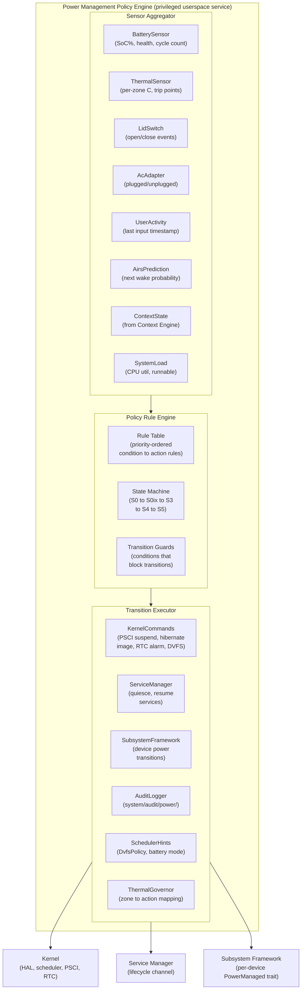
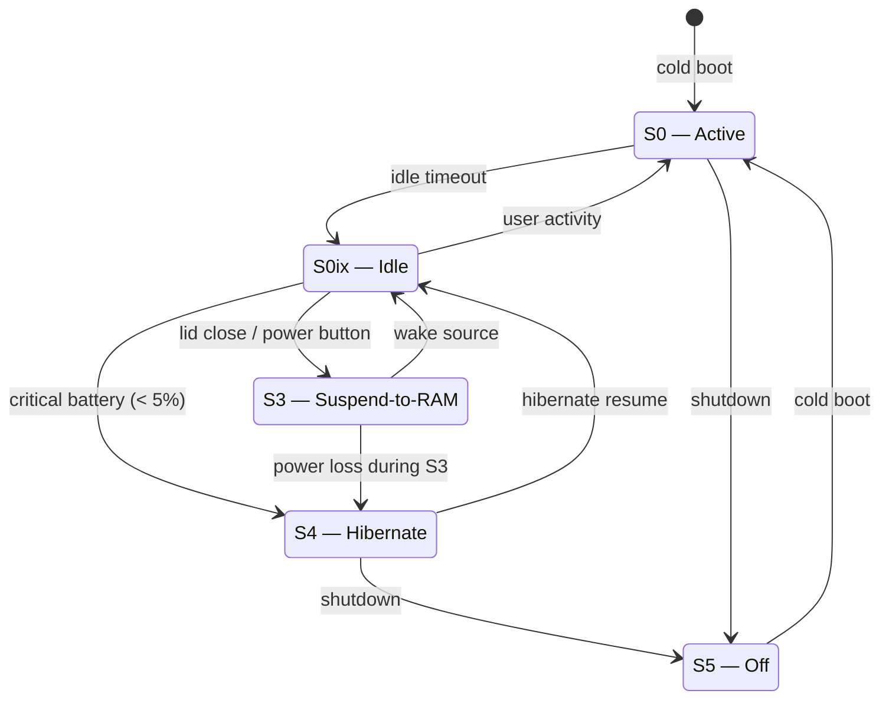
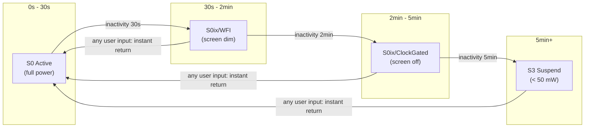
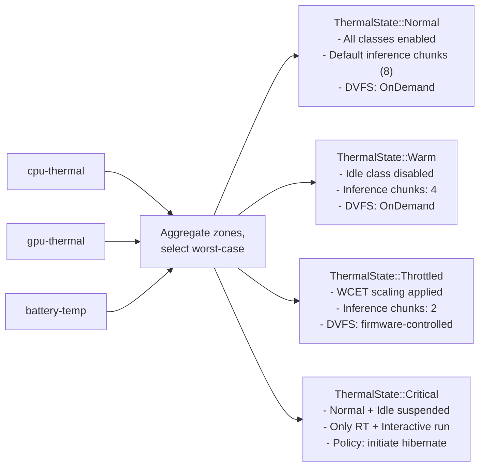
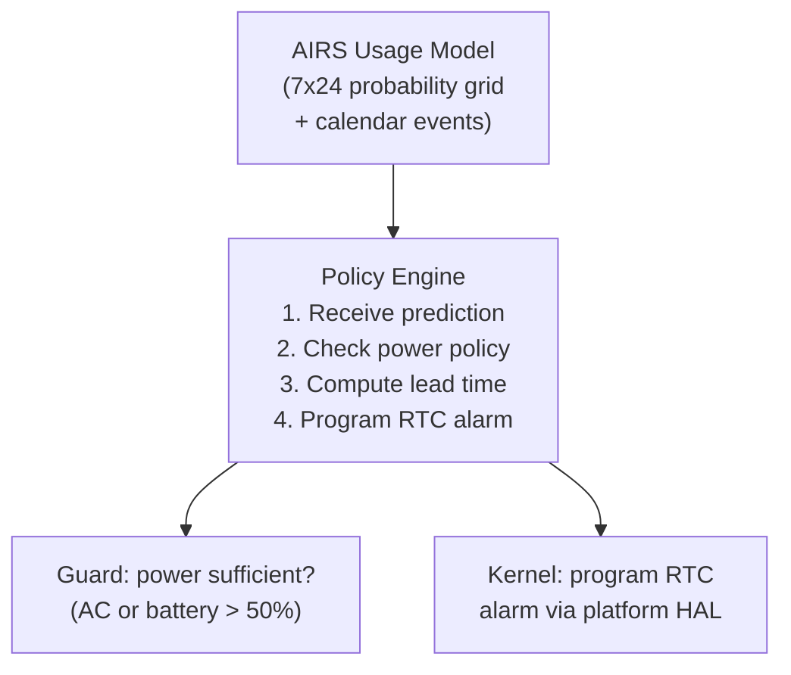
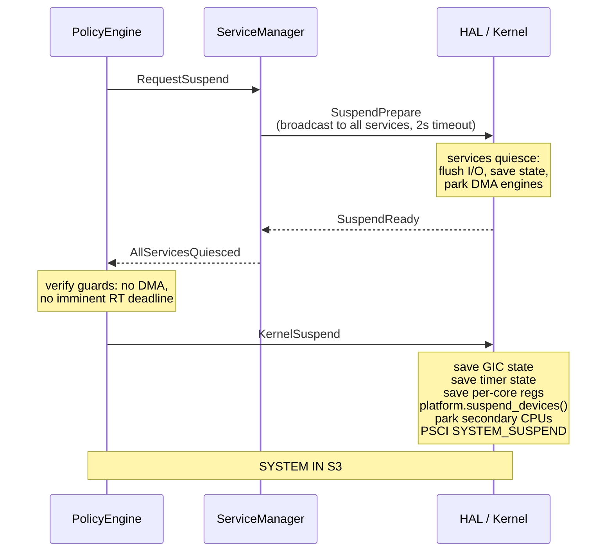
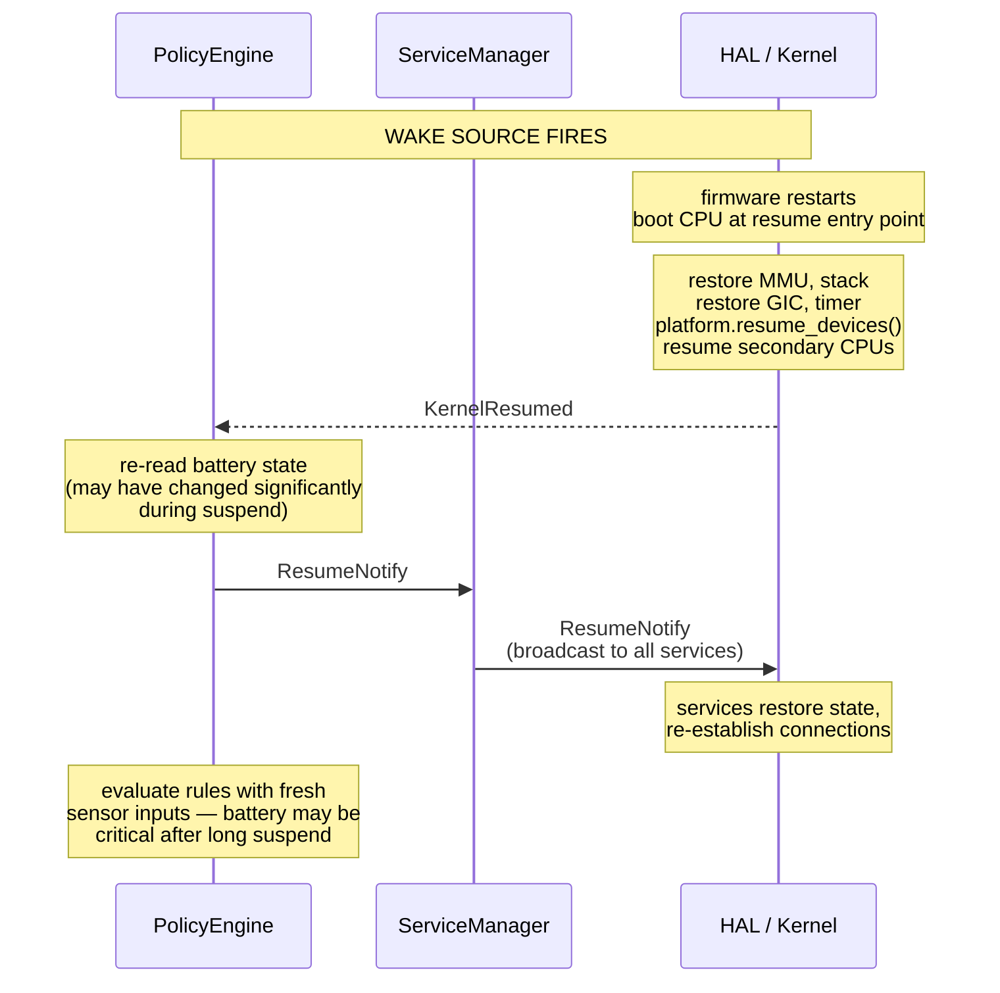

# AIOS Power Management Policy Engine

## Deep Technical Architecture

**Parent document:** [architecture.md](../project/architecture.md) — Section 2.1 Full Stack Overview (Subsystem Framework → Power Manager)
**Related:** [hal.md](../kernel/hal.md) — Platform trait and device abstractions, [scheduler.md](../kernel/scheduler.md) — Power-aware scheduling (§11), thermal throttling (§8.4), [boot-lifecycle.md](../kernel/boot-lifecycle.md) — Suspend/resume (§15), proactive wake (§15.5), boot intent (§16), [airs.md](../intelligence/airs.md) — AI Runtime Service, [context-engine.md](../intelligence/context-engine.md) — Context Engine signals (BatteryState, resource priority), [subsystem-framework.md](./subsystem-framework.md) — Per-device power management (§9)

-----

## 1. Overview

AIOS has power management logic scattered across five subsystems: the boot lifecycle handles suspend/resume and proactive wake (boot-lifecycle.md §15), the scheduler handles thermal throttling and DVFS (scheduler.md §8.4, §11), the Subsystem Framework handles per-device idle policies (subsystem-framework.md §9), the Context Engine signals battery state (context-engine.md §BatteryState), and AIRS predicts usage patterns for proactive wake (boot-lifecycle.md §15.5). Each subsystem makes correct local decisions, but no single component owns the system-wide power policy.

This document defines the **Power Management Policy Engine** — the unified component that observes all sensor inputs, evaluates policy rules, and drives the system through power state transitions. The Policy Engine is the single authority for questions like: "The user closed the lid. Should we enter S3, S4, or stay awake?" and "Battery is at 8%. Should we hibernate now or wait?" and "AIRS predicts the user arrives in 3 minutes. Should we proactive-wake?"

### 1.1 What the Policy Engine Is

The Policy Engine is a privileged userspace service that:

1. **Aggregates sensor inputs** — battery SoC, thermal zone temperatures, lid switch, AC adapter, user activity timers, AIRS predictions, and Context Engine state.
2. **Evaluates policy rules** — a deterministic rule engine that maps input state to power decisions.
3. **Drives state transitions** — sends commands to the kernel (suspend, hibernate, frequency scaling), the Service Manager (service quiesce), and the Subsystem Framework (device power states).
4. **Logs all decisions** — every state transition is recorded to `system/audit/power/` with the triggering rule, input values, and timestamp.

### 1.2 What the Policy Engine Is Not

- **Not a device driver.** The HAL provides hardware access (thermal sensors, PSCI, battery fuel gauge). The Policy Engine reads from HAL-exposed interfaces.
- **Not the scheduler.** The scheduler implements DVFS governor and thermal throttling response (scheduler.md §8.4, §11). The Policy Engine sets the *policy* that the scheduler executes.
- **Not AIRS.** AIRS predicts usage patterns. The Policy Engine *consumes* those predictions to schedule proactive wakes.

-----

## 2. Architecture



### 2.1 Service Position in Boot

The Policy Engine starts during Phase 2 of the boot sequence (see boot-lifecycle.md §12, Implementation Order). It requires:
- HAL initialized (thermal sensors, battery fuel gauge, GPIO for lid switch)
- Scheduler running (to receive DVFS policy updates)
- Service Manager running (to coordinate suspend/resume)

It does **not** require AIRS, the compositor, or user input. On a fresh boot, the Policy Engine runs with default heuristic rules. Once AIRS starts (Phase 3), AIRS predictions become available and the Policy Engine incorporates them.

```rust
/// Policy Engine service descriptor for the Service Manager
pub struct PowerPolicyService {
    /// Boot phase when this service starts
    phase: BootPhase::Phase2,

    /// Capabilities required from the kernel
    capabilities: &[
        Cap::ReadThermalZones,
        Cap::ReadBatteryState,
        Cap::ReadLidSwitch,
        Cap::ReadAcAdapter,
        Cap::SetDvfsPolicy,
        Cap::RequestSuspend,
        Cap::RequestHibernate,
        Cap::ProgramRtcAlarm,
        Cap::WriteAuditLog,
        Cap::QueryDeviceRegistry,
    ],

    /// Restart policy: always restart — power management is critical
    restart: RestartPolicy::Always,

    /// Priority: elevated — must respond to lid close within 100ms
    scheduler_class: SchedulerClass::Interactive,
}
```

-----

## 3. Power States

AIOS defines five system-wide power states, following the ACPI naming convention adapted for ARM:

```
State    Name              CPU            DRAM            Devices      Resume Time
─────    ────              ───            ────            ───────      ───────────
S0       Active            Running        Active          Active       (running)
S0ix     Idle              WFI / gated    Active          Mixed        < 5ms
S3       Suspend-to-RAM    Off (PSCI)     Self-refresh    Off          < 200ms
S4       Hibernate         Off            Off (→ disk)    Off          ~1.5s
S5       Off               Off            Off             Off          Cold boot
```

### 3.1 Power State Machine



### 3.2 State Definitions

```rust
/// System-wide power state. Exactly one state is active at any time.
/// Stored in KernelState and observable by all services.
#[derive(Debug, Clone, Copy, PartialEq, Eq)]
pub enum SystemPowerState {
    /// S0: CPU active, all devices available. Normal operation.
    Active,

    /// S0ix: CPU in WFI or power-gated, DRAM active. Devices may be
    /// suspended per their IdlePolicy (subsystem-framework.md §9).
    /// Entered automatically after idle timeout. Exits on any interrupt.
    Idle {
        /// How deep the idle state is. See §3.3.
        depth: IdleDepth,
        /// When idle state was entered (for timeout escalation).
        entered_at: Timestamp,
    },

    /// S3: Suspend-to-RAM. CPU cores off via PSCI, DRAM in self-refresh.
    /// All devices quiesced. System draws < 50 mW.
    /// See boot-lifecycle.md §15.1.
    Suspend,

    /// S4: Hibernate. Full system state written to block device, then
    /// power off. Survives complete power loss.
    /// See boot-lifecycle.md §15.2.
    Hibernate,

    /// S5: Off. No power draw. Requires cold boot to resume.
    Off,
}

/// Depth of S0ix idle state. Progressively deeper = more power savings
/// but longer wake latency.
#[derive(Debug, Clone, Copy, PartialEq, Eq, PartialOrd, Ord)]
pub enum IdleDepth {
    /// CPU in WFI (Wait For Interrupt). Wake latency: ~1μs.
    /// All caches retained. Used for sub-second idle periods.
    Wfi,

    /// CPU clock gated, L1 cache retained, L2 retained.
    /// Wake latency: ~100μs. Used for idle periods of 1-30 seconds.
    ClockGated,

    /// CPU power gated (cluster off), L2 flushed, interconnect off.
    /// Wake latency: ~5ms. Used for idle periods > 30 seconds.
    /// Corresponds to SuspendPowerState::LightSleep in boot-lifecycle.md §15.1.
    PowerGated,
}
```

### 3.3 Idle Depth Escalation

The Policy Engine progressively deepens idle state as inactivity continues. This avoids the latency penalty of deep idle for brief pauses (checking a notification) while achieving full power savings for sustained inactivity (user walked away).



```rust
/// Idle escalation policy. Configurable per power source.
pub struct IdleEscalationPolicy {
    /// Time after last input before entering S0ix/WFI and dimming screen.
    /// Default: 30 seconds (AC), 15 seconds (battery).
    pub dim_timeout: Duration,

    /// Time after dim before entering S0ix/ClockGated and turning screen off.
    /// Default: 120 seconds (AC), 60 seconds (battery).
    pub screen_off_timeout: Duration,

    /// Time after screen off before entering S3 suspend.
    /// Default: 300 seconds (AC), 120 seconds (battery).
    pub suspend_timeout: Duration,

    /// Whether to write hibernate image during S3 (boot-lifecycle.md §15.2).
    /// Default: true on battery, false on AC.
    pub hibernate_safety_net: bool,
}
```

-----

## 4. Sensor Inputs

The Policy Engine aggregates inputs from eight sensor sources. Each sensor is polled or event-driven depending on its characteristics.

### 4.1 Battery SoC

```rust
/// Battery state from the platform fuel gauge.
/// On platforms without a battery (QEMU, desktop Pi), this is
/// BatteryState::NotPresent and all battery-related rules are skipped.
#[derive(Debug, Clone)]
pub enum BatteryState {
    /// No battery present (desktop, QEMU). AC power assumed.
    NotPresent,

    /// Battery present with current measurements.
    Present {
        /// State of charge as percentage (0–100).
        /// Estimated from coulomb counting + voltage correlation.
        soc_percent: u8,

        /// Whether AC adapter is connected.
        ac_connected: bool,

        /// Instantaneous power draw in milliwatts (positive = discharging).
        power_draw_mw: i32,

        /// Estimated time to empty at current draw. None if charging or AC.
        time_to_empty: Option<Duration>,

        /// Estimated time to full at current charge rate. None if discharging.
        time_to_full: Option<Duration>,

        /// Battery health as percentage of design capacity (100% = new).
        health_percent: u8,

        /// Number of full charge cycles completed.
        cycle_count: u32,

        /// Battery temperature in tenths of degrees Celsius.
        temperature_decidegc: i16,

        /// Whether the battery is currently charging.
        charging: bool,
    },
}
```

**Polling interval:** Every 30 seconds during S0 Active. Every 60 seconds during S0ix Idle. Not polled during S3/S4 (no CPU running). On wake from S3, the battery is immediately re-read before any policy decisions.

### 4.2 Thermal Zone Temperatures

Each platform exposes one or more thermal zones. The Policy Engine reads all zones and uses the hottest zone for throttling decisions.

```rust
/// Thermal zone reading. One per zone per platform.
pub struct ThermalZoneReading {
    /// Zone identifier (e.g., "cpu-thermal", "gpu-thermal").
    pub zone_id: &'static str,

    /// Current temperature in millidegrees Celsius.
    pub temp_mdegc: i32,

    /// Trip points for this zone, in ascending temperature order.
    pub trip_points: &'static [ThermalTripPoint],
}

/// A thermal trip point — the temperature at which an action is taken.
pub struct ThermalTripPoint {
    /// Temperature threshold in millidegrees Celsius.
    pub temp_mdegc: i32,

    /// Type of action at this trip point.
    pub trip_type: ThermalTripType,
}

pub enum ThermalTripType {
    /// Passive cooling: reduce frequency (DVFS). No user-visible impact
    /// other than slightly slower computation.
    Passive,

    /// Active cooling: enable fan (if present). Pi 5 with official
    /// active cooler uses this.
    Active,

    /// Hot: aggressive throttling. Suspend idle-class work.
    /// Corresponds to ThermalState::Warm in scheduler.md §8.4.
    Hot,

    /// Critical: emergency shutdown temperature. The Policy Engine
    /// initiates immediate hibernate or shutdown to prevent hardware damage.
    Critical,
}
```

**Polling interval:** Every 2 seconds during S0 Active (balances responsiveness with overhead). If any zone is above the Hot trip point, polling increases to every 500ms. Thermal zone interrupts (where supported) provide immediate notification of trip point crossings, supplementing polling.

### 4.3 Lid Switch

```rust
/// Lid state. Event-driven via GPIO interrupt.
/// Platforms without a lid (Pi, QEMU) always report Open.
pub enum LidState {
    Open,
    Closed,
}
```

The lid switch is purely event-driven — a GPIO interrupt fires when the lid opens or closes. The Policy Engine acts within 100ms of the event. On lid close, the default action is S3 suspend. On lid open, the default action is resume (handled by firmware wake source, not the Policy Engine).

### 4.4 AC Adapter

```rust
/// AC adapter state. Event-driven via GPIO interrupt or fuel gauge notification.
pub enum AcAdapterState {
    Connected,
    Disconnected,
    /// Platform does not have battery/AC detection (QEMU, desktop Pi).
    NotApplicable,
}
```

AC adapter state changes trigger immediate re-evaluation of all battery-related rules. When AC disconnects, the Policy Engine switches to battery-mode idle timeouts (more aggressive). When AC connects, it switches back to AC-mode timeouts (more relaxed).

### 4.5 User Activity

```rust
/// User activity state, derived from input subsystem events.
pub struct UserActivity {
    /// Timestamp of the last user input event (key, mouse, touch, stylus).
    pub last_input: Timestamp,

    /// Timestamp of the last "significant" activity (not just mouse jiggle —
    /// actual typing, clicking, scrolling).
    pub last_significant_input: Timestamp,

    /// Whether the system is currently receiving continuous input
    /// (e.g., user is actively typing or scrolling).
    pub active_input: bool,
}
```

User activity is the primary signal for idle escalation. The Policy Engine subscribes to input events from the Input Subsystem via the Subsystem Framework. Any input event resets the idle timer and immediately returns the system to S0 Active from any S0ix depth.

### 4.6 AIRS Prediction

```rust
/// Prediction from AIRS about upcoming usage. See §7 for full AIRS integration.
pub struct AirsPrediction {
    /// Probability that the user will interact within the next `horizon`.
    /// Range: 0.0–1.0.
    pub wake_probability: f32,

    /// Time horizon for the prediction.
    pub horizon: Duration,

    /// Suggested pre-warm actions if proactive wake is triggered.
    pub pre_warm: Vec<PreWarmAction>,

    /// Confidence in this prediction (based on historical accuracy).
    pub confidence: f32,
}

pub enum PreWarmAction {
    /// Load a specific AIRS model into memory.
    LoadModel { model_id: ModelId },
    /// Warm Space index caches for recent workspaces.
    WarmSpaceCache { space_ids: Vec<SpaceId> },
    /// Sync time via NTP (clock may have drifted).
    NtpSync,
    /// Check for OTA updates.
    CheckUpdates,
}
```

AIRS predictions are only available after AIRS starts (Phase 3). Before that, the Policy Engine uses time-of-day heuristics from the 7x24 probability grid described in boot-lifecycle.md §15.5.

### 4.7 Context Engine State

The Context Engine (context-engine.md) provides high-level context about user activity mode:

```rust
/// Relevant context signals consumed by the Policy Engine.
pub struct PowerRelevantContext {
    /// Current context mode (Work, Leisure, Focus, Sleep, etc.)
    pub context_mode: ContextMode,

    /// Resource priority derived from engagement level.
    pub resource_priority: ResourcePriority,

    /// Whether the user is in a "do not disturb" mode that should
    /// suppress proactive wake.
    pub suppress_proactive: bool,
}
```

### 4.8 System Load

```rust
/// System load metrics from the scheduler.
pub struct SystemLoad {
    /// Per-CPU utilization over the last 1 second (0.0–1.0).
    pub cpu_util: [f32; MAX_CPUS],

    /// Total runnable thread count across all CPUs.
    pub nr_runnable: u32,

    /// Whether any RT task has an imminent deadline (< 50ms).
    pub rt_active: bool,

    /// Whether background inference is currently running.
    pub inference_active: bool,

    /// Current DMA activity (storage, network).
    pub dma_active: bool,
}
```

System load acts as a **guard** on state transitions. The Policy Engine does not enter S3 while DMA is active (data corruption risk) or while an RT task has an imminent deadline (compositor frame drop). These guards are documented in §5.

-----

## 5. Policy Rules

The Policy Engine evaluates rules in priority order. The first matching rule whose guards are satisfied determines the action. Rules are deterministic — given the same inputs, the same action is always taken.

### 5.1 Rule Table

```rust
/// A policy rule. Evaluated in priority order (lower number = higher priority).
pub struct PolicyRule {
    /// Unique identifier for audit logging.
    pub id: &'static str,

    /// Priority. Rules are evaluated in ascending priority order.
    /// First matching rule wins.
    pub priority: u16,

    /// Condition that must be true for this rule to fire.
    pub condition: PolicyCondition,

    /// Guards that must all pass for the transition to execute.
    /// If any guard fails, the rule is skipped and evaluation continues.
    pub guards: &'static [TransitionGuard],

    /// Action to take when condition is met and all guards pass.
    pub action: PolicyAction,
}
```

### 5.2 Core Rules (Default Policy)

```
Priority  Rule ID                   Condition                         Action
────────  ───────                   ─────────                         ──────
   1      thermal-emergency         Any zone ≥ Critical trip          Immediate hibernate
   2      thermal-emergency-no-s4   Any zone ≥ Critical + no          Force shutdown (S5)
                                    hibernate partition
   3      battery-critical          SoC ≤ 3% AND not charging         Immediate hibernate
   4      battery-critical-no-s4    SoC ≤ 3% AND not charging         Force shutdown (S5)
                                    AND no hibernate partition
   5      lid-close                 Lid → Closed                      Enter S3
   6      power-button-suspend      Power button pressed AND          Enter S3
                                    state = S0/S0ix
   7      battery-low-hibernate     SoC ≤ 5% AND not charging         Enter S4
                                    AND state = S3 (already
                                    suspended, battery draining)
  10      idle-dim                  Idle ≥ dim_timeout                Dim screen (S0ix/WFI)
  11      idle-screen-off           Idle ≥ screen_off_timeout         Screen off (S0ix/ClockGated)
  12      idle-suspend              Idle ≥ suspend_timeout            Enter S3
  20      battery-low-aggressive    SoC ≤ 10% AND on battery          Switch to aggressive
                                                                      idle timeouts
  21      battery-moderate          SoC ≤ 20% AND on battery          Reduce inference,
                                                                      pause idle-class
  30      thermal-warm              Any zone ≥ Hot trip                Signal ThermalState::Warm
                                                                      to scheduler
  31      thermal-throttle          Any zone ≥ Passive trip            Signal ThermalState::Throttled
                                    AND firmware freq reduced          to scheduler
  40      ac-connected              AC plugged in                     Switch to AC idle
                                                                      timeouts
  41      ac-disconnected           AC unplugged                      Switch to battery
                                                                      idle timeouts
  50      proactive-wake            AIRS predicts wake within          Program RTC alarm
                                    lead_time AND confidence
                                    ≥ threshold
  51      proactive-wake-cancel     Previously scheduled wake          Cancel RTC alarm
                                    AND prediction confidence
                                    dropped below threshold
  60      user-input                Any input event                   Return to S0 Active,
                                                                      reset idle timer
```

### 5.3 Transition Guards

Guards prevent dangerous transitions. A rule fires only if all its guards pass.

```rust
/// Guards that prevent a state transition even if the condition is met.
#[derive(Debug, Clone, Copy)]
pub enum TransitionGuard {
    /// Block suspend while DMA is in flight (storage, network).
    /// Wait up to 2 seconds for DMA to complete, then force.
    NoDmaInFlight,

    /// Block suspend while a critical RT task is within 50ms of its deadline.
    /// The compositor must finish its current frame.
    NoImminentRtDeadline,

    /// Block hibernate while the hibernate partition is being written.
    /// (Prevents corruption of a partial image.)
    NoHibernateWriteInProgress,

    /// Block S3 if battery SoC is below 5% — go directly to S4 instead.
    /// Prevents entering S3 only to lose power and lose the RAM image.
    BatteryAboveHibernateThreshold,

    /// Block proactive wake if on battery below 50% (configurable via
    /// ProactiveWakePowerPolicy, boot-lifecycle.md §15.5).
    ProactiveWakePowerSufficient,

    /// Block suspend if a service has requested a suspend inhibit lock.
    /// Used during: OTA update installation, AIRS model download,
    /// active file transfer. Locks expire after 15 minutes maximum.
    NoSuspendInhibitLock,

    /// Block transition while services are still responding to
    /// SuspendPrepare (2-second timeout, then force).
    ServicesQuiesced,
}

/// A suspend inhibit lock — held by services that must not be interrupted.
pub struct SuspendInhibitLock {
    pub holder: ServiceId,
    pub reason: &'static str,
    pub acquired_at: Timestamp,
    /// Maximum hold time. After this, the lock is forcibly released.
    pub max_duration: Duration, // default: 15 minutes
}
```

### 5.4 Rule Evaluation Loop

```rust
impl PolicyEngine {
    /// Main evaluation loop. Called on every sensor event and periodically (1 Hz).
    fn evaluate(&mut self) {
        let inputs = self.sensor_aggregator.snapshot();

        for rule in &self.rules {
            if !rule.condition.matches(&inputs) {
                continue;
            }

            let guards_pass = rule.guards.iter().all(|g| g.check(&inputs, &self.state));

            if guards_pass {
                self.audit_log.record(PowerEvent {
                    timestamp: Timestamp::now(),
                    rule_id: rule.id,
                    from_state: self.state.current,
                    action: rule.action,
                    inputs: inputs.summary(),
                });

                self.execute(rule.action, &inputs);
                return; // first matching rule wins
            } else {
                // Log that the rule matched but guards prevented it.
                // Useful for debugging "why didn't the system suspend?"
                self.audit_log.record(PowerEvent {
                    timestamp: Timestamp::now(),
                    rule_id: rule.id,
                    from_state: self.state.current,
                    action: PolicyAction::GuardBlocked {
                        intended: rule.action,
                        failed_guard: rule.guards.iter()
                            .find(|g| !g.check(&inputs, &self.state))
                            .copied(),
                    },
                    inputs: inputs.summary(),
                });
            }
        }
    }
}
```

-----

## 6. Thermal Management

### 6.1 Thermal Zone Architecture

Each platform exposes thermal zones through the HAL. The Policy Engine reads all zones and drives the scheduler's thermal response.



### 6.2 Per-Platform Thermal Zones

```
Platform          Zones                  Trip Points                    Sensor
────────          ─────                  ───────────                    ──────
QEMU              cpu-thermal (virtual)  Passive: 80°C                 Emulated
                                         Critical: 95°C                (config)
                                         (QEMU rarely hits these —
                                          useful for testing only)

Raspberry Pi 4    cpu-thermal            Passive: 80°C                 BCM2711
(BCM2711)         (single zone)          Critical: 85°C                on-die
                                         Soft limit: 80°C              thermal
                                         (firmware throttles at 80°C   sensor
                                          via mailbox property)

Raspberry Pi 5    cpu-thermal            Passive: 80°C                 BCM2712
(BCM2712)         gpu-thermal            Hot: 82°C                     on-die
                  (two zones)            Critical: 85°C                thermal
                                         Active: 50°C (fan on)         sensor
                                         (Pi 5 has fan connector;      × 2 zones
                                          active cooling supported)

Apple Silicon     cpu-thermal            Passive: 90°C                 SMC
(M1–M4)           gpu-thermal            Hot: 95°C                     (System
                  npu-thermal            Critical: 105°C               Management
                  io-thermal             Active: varies by model       Controller)
                  (4+ zones)             (Apple Silicon has excellent   per-core
                                          thermal margin; passive       temp
                                          cooling handles most loads)   sensors
```

### 6.3 Thermal Zone Driver Interface

```rust
/// HAL extension trait for platforms with thermal zone support.
/// All current platforms implement this.
pub trait PlatformThermal {
    /// Read all thermal zones. Returns one reading per zone.
    fn read_thermal_zones(&self) -> Result<Vec<ThermalZoneReading>>;

    /// Get the trip points for a specific zone (static, from device tree).
    fn trip_points(&self, zone_id: &str) -> Result<&[ThermalTripPoint]>;

    /// Enable/disable thermal zone interrupt for a specific trip point.
    /// When enabled, the HAL fires an interrupt when the temperature
    /// crosses the trip point, allowing the Policy Engine to react
    /// without polling.
    fn set_trip_interrupt(
        &mut self,
        zone_id: &str,
        trip_index: usize,
        enabled: bool,
    ) -> Result<()>;
}
```

### 6.4 Platform-Specific Thermal Details

**Raspberry Pi 4 (BCM2711):**

The BCM2711 SoC has a single on-die thermal sensor accessed via the TSENS register. The VideoCore firmware monitors this sensor independently and throttles the CPU via the ARM frequency mailbox when the temperature exceeds 80C. AIOS reads the sensor directly for proactive management but does not override firmware-initiated throttling.

```rust
impl PlatformThermal for RaspberryPi4Platform {
    fn read_thermal_zones(&self) -> Result<Vec<ThermalZoneReading>> {
        // BCM2711 TSENS register at offset 0x7d5d2200
        // Returns raw ADC value, converted to millidegrees:
        //   temp_mdegc = (410_040 - adc_val * 487) / 1000
        let adc_val = self.mmio_read(TSENS_BASE + TSENS_DATA_OFFSET);
        let temp_mdegc = (410_040i32 - (adc_val as i32) * 487) / 1000;

        Ok(vec![ThermalZoneReading {
            zone_id: "cpu-thermal",
            temp_mdegc,
            trip_points: &PI4_TRIP_POINTS,
        }])
    }
}

static PI4_TRIP_POINTS: [ThermalTripPoint; 2] = [
    ThermalTripPoint { temp_mdegc: 80_000, trip_type: ThermalTripType::Passive },
    ThermalTripPoint { temp_mdegc: 85_000, trip_type: ThermalTripType::Critical },
];
```

**Raspberry Pi 5 (BCM2712):**

The BCM2712 adds a second thermal zone for the GPU and supports active cooling via a fan connected to the official Pi 5 Active Cooler header. The fan speed is controlled via PWM based on temperature.

```rust
/// Pi 5 fan speed curve. PWM duty cycle based on GPU temperature.
static PI5_FAN_CURVE: [(i32, u8); 4] = [
    (50_000,  0),    // Below 50°C: fan off
    (60_000, 30),    // 60°C: 30% duty
    (70_000, 60),    // 70°C: 60% duty
    (75_000, 100),   // 75°C: 100% duty
];
```

**Apple Silicon (M1-M4):**

Apple Silicon Macs expose thermal data through the System Management Controller (SMC), a coprocessor that manages power, fans, and sensors. The SMC is accessed via MMIO at addresses documented by the Asahi Linux project. Apple Silicon has per-core temperature sensors and significantly higher thermal headroom than Pi hardware.

```rust
impl PlatformThermal for AppleSiliconPlatform {
    fn read_thermal_zones(&self) -> Result<Vec<ThermalZoneReading>> {
        let mut zones = Vec::new();

        // CPU thermal — aggregate of P-core and E-core sensors
        let p_core_temps = self.smc_read_key_array("TC0P")?;  // P-core temps
        let e_core_temps = self.smc_read_key_array("TC0E")?;  // E-core temps
        let max_cpu = p_core_temps.iter().chain(&e_core_temps).max().copied()
            .unwrap_or(0);
        zones.push(ThermalZoneReading {
            zone_id: "cpu-thermal",
            temp_mdegc: max_cpu,
            trip_points: &APPLE_CPU_TRIPS,
        });

        // GPU thermal
        let gpu_temp = self.smc_read_key("TGXP")?;
        zones.push(ThermalZoneReading {
            zone_id: "gpu-thermal",
            temp_mdegc: gpu_temp,
            trip_points: &APPLE_GPU_TRIPS,
        });

        // NPU thermal (if present)
        if let Ok(npu_temp) = self.smc_read_key("TANP") {
            zones.push(ThermalZoneReading {
                zone_id: "npu-thermal",
                temp_mdegc: npu_temp,
                trip_points: &APPLE_NPU_TRIPS,
            });
        }

        Ok(zones)
    }
}
```

### 6.5 DVFS Governor Integration

The Policy Engine translates thermal state and battery state into DVFS policy directives that the scheduler executes (see scheduler.md §11.1 for DVFS implementation):

```rust
impl PolicyEngine {
    /// Compute the DVFS policy directive based on current power state.
    /// The scheduler combines this with its own per-CPU queue analysis
    /// (scheduler.md §11.1) — the scheduler's queue-based policy is
    /// clamped to the Policy Engine's directive.
    fn compute_dvfs_directive(&self) -> DvfsDirective {
        let battery = &self.inputs.battery;
        let thermal = &self.inputs.thermal_state;

        match (thermal, battery) {
            // Thermal critical: minimum frequency to cool down.
            (ThermalState::Critical, _) => DvfsDirective {
                max_policy: DvfsPolicy::PowerSave,
                reason: "thermal-critical",
            },

            // Thermal throttled: firmware is already controlling frequency.
            // Don't fight it — accept the firmware's limit.
            (ThermalState::Throttled { .. }, _) => DvfsDirective {
                max_policy: DvfsPolicy::OnDemand,
                reason: "thermal-throttled",
            },

            // Battery critical (≤ 10%): save every joule.
            (_, BatteryState::Present { soc_percent, ac_connected: false, .. })
                if *soc_percent <= 10 => DvfsDirective {
                    max_policy: DvfsPolicy::PowerSave,
                    reason: "battery-critical",
                },

            // Battery low (≤ 20%): on-demand only, no performance mode.
            (_, BatteryState::Present { soc_percent, ac_connected: false, .. })
                if *soc_percent <= 20 => DvfsDirective {
                    max_policy: DvfsPolicy::OnDemand,
                    reason: "battery-low",
                },

            // Normal: no restrictions.
            _ => DvfsDirective {
                max_policy: DvfsPolicy::Performance,
                reason: "normal",
            },
        }
    }
}

/// DVFS directive from the Policy Engine to the scheduler.
/// The scheduler's per-CPU DVFS decision is clamped: it cannot
/// exceed max_policy. It can choose a lower-power policy.
pub struct DvfsDirective {
    pub max_policy: DvfsPolicy,
    pub reason: &'static str,
}
```

-----

## 7. AIRS Integration — Predictive Power Management

AIRS provides two capabilities to the Policy Engine: proactive wake scheduling and workload-aware power budgeting.

### 7.1 Proactive Wake Scheduling

Proactive Wake is described in boot-lifecycle.md §15.5. The Policy Engine is responsible for the operational mechanics: programming the RTC alarm, handling the wake event, and deciding whether to re-suspend.



```rust
impl PolicyEngine {
    /// Called when entering S3 or when AIRS updates its prediction.
    fn schedule_proactive_wake(&mut self) {
        let config = &self.proactive_wake_config;
        if !config.enabled {
            return;
        }

        let prediction = match self.inputs.airs_prediction.as_ref() {
            Some(p) if p.confidence >= config.confidence_threshold => p,
            _ => return, // no prediction or confidence too low
        };

        // Check power policy guard
        let power_ok = match config.power_policy {
            ProactiveWakePowerPolicy::AcOnly =>
                self.inputs.battery.is_ac_connected(),
            ProactiveWakePowerPolicy::AcOrBatteryAbove50 =>
                self.inputs.battery.is_ac_connected()
                || self.inputs.battery.soc_percent() > 50,
            ProactiveWakePowerPolicy::Always => true,
        };

        if !power_ok {
            return;
        }

        // Compute wake time: prediction horizon minus lead time
        let now = Timestamp::now();
        let predicted_use = now + prediction.horizon;
        let wake_at = predicted_use - config.lead_time;

        if wake_at <= now {
            // Already past the wake point — too late for proactive wake.
            return;
        }

        // Program RTC alarm
        self.kernel.program_rtc_alarm(wake_at);
        self.scheduled_wake = Some(ScheduledWake {
            wake_at,
            predicted_use,
            pre_warm_actions: prediction.pre_warm.clone(),
        });

        self.audit_log.record(PowerEvent {
            timestamp: now,
            rule_id: "proactive-wake-scheduled",
            from_state: self.state.current,
            action: PolicyAction::ProgramRtcAlarm { wake_at },
            inputs: self.inputs.summary(),
        });
    }

    /// Called on proactive wake (BootIntent::ProactiveWake).
    /// Executes pre-warm tasks, then waits for user or re-suspends.
    fn handle_proactive_wake(&mut self) {
        let wake = self.scheduled_wake.take()
            .expect("proactive wake without scheduled wake");

        // Execute pre-warm actions with screen off
        for action in &wake.pre_warm_actions {
            match action {
                PreWarmAction::LoadModel { model_id } =>
                    self.airs.preload_model(model_id),
                PreWarmAction::WarmSpaceCache { space_ids } =>
                    self.space_storage.warm_caches(space_ids),
                PreWarmAction::NtpSync =>
                    self.network.ntp_sync(),
                PreWarmAction::CheckUpdates =>
                    self.ota.check_for_updates(),
            }
        }

        // Set re-suspend timer
        let resuspend_deadline = Timestamp::now()
            + self.proactive_wake_config.max_idle_awake;
        self.resuspend_timer = Some(resuspend_deadline);

        // If user arrives (input event detected), resuspend_timer is
        // canceled by the user-input rule (§5.2, rule 60).
        // If timer expires, re-enter S3.
    }
}
```

### 7.2 Workload-Aware Power Budgeting

AIRS learns which operations the user performs at different times and in different contexts. The Policy Engine uses this to pre-emptively adjust power budgets:

```
Pattern Observed                 Policy Adjustment
──────────────────               ─────────────────
Morning: heavy inference         Pre-warm at higher frequency, accept
(conversation, coding agents)    higher thermal budget during morning hours

Evening: media consumption       Reduce CPU frequency ceiling, bias GPU
(video, music, browsing)         power, extend battery life

Weekend: lighter usage           More aggressive idle timeouts, longer
                                 time before proactive wake

Plugged in at desk: sustained    Disable idle timeouts entirely,
work sessions                    keep system warm for instant response
```

```rust
/// AIRS-learned power profile for a time-of-day × context combination.
pub struct LearnedPowerProfile {
    /// Suggested idle escalation overrides.
    pub idle_overrides: Option<IdleEscalationPolicy>,

    /// Suggested thermal budget (how close to throttle point we tolerate).
    pub thermal_headroom_target: Option<i32>,  // millidegrees below passive trip

    /// Suggested DVFS floor (don't go below this frequency even when idle).
    pub min_freq_mhz: Option<u32>,

    /// Whether to suppress proactive wake (user rarely uses device at this time).
    pub suppress_proactive_wake: bool,
}
```

**Fallback:** When AIRS is unavailable or the learned profile has low confidence, the Policy Engine uses the default heuristic policy. Intelligence is an optimization, never a correctness requirement — consistent with design principle #20 in boot-lifecycle.md §24.

-----

## 8. Battery Management

### 8.1 SoC Estimation

Battery state-of-charge (SoC) estimation on embedded ARM platforms is challenging — there is no standardized fuel gauge. The Policy Engine supports two estimation methods:

```
Method           Accuracy    Platforms        How
──────           ────────    ─────────        ───
Coulomb counting ±2-5%      Apple Silicon     Dedicated fuel gauge IC (SBS)
                             (via SMC)         measures current in/out

Voltage-based    ±10-15%    Pi (external      Read ADC voltage, look up in
                             battery HAT)      discharge curve table
```

```rust
/// Battery fuel gauge abstraction. Platform-specific implementation.
pub trait BatteryFuelGauge {
    /// Read current SoC estimate.
    fn soc(&self) -> Result<u8>;

    /// Read instantaneous current (positive = discharging) in milliamps.
    fn current_ma(&self) -> Result<i32>;

    /// Read battery voltage in millivolts.
    fn voltage_mv(&self) -> Result<u16>;

    /// Read battery temperature in tenths of degrees Celsius.
    fn temperature_decidegc(&self) -> Result<i16>;

    /// Read design capacity and current full-charge capacity.
    fn capacity(&self) -> Result<BatteryCapacity>;

    /// Read cycle count.
    fn cycle_count(&self) -> Result<u32>;
}

pub struct BatteryCapacity {
    /// Original design capacity in mAh.
    pub design_mah: u16,
    /// Current full-charge capacity in mAh (decreases with age).
    pub full_charge_mah: u16,
}
```

### 8.2 Charge Cycle Tracking

The Policy Engine tracks battery health over time, stored in `system/power/battery_history`:

```rust
/// Battery health record, persisted to system/power/battery_history.
pub struct BatteryHealthRecord {
    pub timestamp: Timestamp,
    pub cycle_count: u32,
    pub full_charge_capacity_mah: u16,
    pub design_capacity_mah: u16,
    /// Derived: full_charge / design × 100
    pub health_percent: u8,
}
```

### 8.3 Degradation-Aware Policies

As battery health degrades, the Policy Engine adjusts thresholds to account for reduced capacity:

```rust
impl PolicyEngine {
    /// Adjust battery thresholds based on health.
    /// A degraded battery (e.g., 70% health) reports 100% SoC when fully
    /// charged, but holds 30% less energy. The Policy Engine compensates
    /// by raising the critical/low thresholds.
    fn adjusted_thresholds(&self) -> BatteryThresholds {
        let health = self.inputs.battery.health_percent();

        // Scale factor: 1.0 for healthy battery, increases as health degrades.
        // At 70% health, critical threshold moves from 3% to ~4%.
        // At 50% health, critical threshold moves from 3% to 6%.
        let scale = 100.0 / health.max(50) as f32;

        BatteryThresholds {
            critical_percent: (3.0 * scale).ceil() as u8,   // default: 3%
            low_percent: (5.0 * scale).ceil() as u8,        // default: 5%
            moderate_percent: (10.0 * scale).ceil() as u8,   // default: 10%
            caution_percent: (20.0 * scale).ceil() as u8,    // default: 20%
        }
    }
}
```

-----

## 9. Per-Platform Behavior

### 9.1 QEMU

QEMU simulates power states for development and testing. No real battery, thermal sensors, or lid switch exist, so the Policy Engine accepts simulated inputs.

```
Component            QEMU Implementation                     Notes
─────────            ────────────────────                     ─────
Battery              Simulated via QEMU monitor               Set SoC, charging
                     command: `battery set soc=50`             state for testing
Thermal              Simulated via device tree property        Set temp for testing
                     or QEMU monitor: `thermal set cpu=75`     thermal rules
Lid switch           Not present (LidState::Open always)      Test via monitor
AC adapter           Not present (AcAdapter::NotApplicable)   Test via monitor
PSCI suspend         QEMU halts vCPUs (PSCI SYSTEM_SUSPEND)  Works correctly
RTC alarm            UEFI RTC via QEMU `-rtc` option          Proactive wake works
DVFS                 No real frequency scaling. Policy Engine  DVFS rules still
                     runs but frequency changes are no-ops.    evaluate (for testing)
Hibernate            Writes to virtio-blk hibernate partition  Full flow works
```

**Testing power policies in QEMU:** The QEMU monitor provides commands to inject power events, enabling full policy testing without hardware:

```
(qemu) power battery soc=5 charging=false     # trigger low battery rules
(qemu) power thermal cpu=82000                 # trigger thermal warm rules
(qemu) power lid close                         # trigger lid close → S3
(qemu) power ac disconnect                     # trigger battery mode switch
```

### 9.2 Raspberry Pi 4 (BCM2711)

```
Component            Pi 4 Implementation                      Notes
─────────            ───────────────────                       ─────
Battery              External: PiJuice HAT or similar          I2C fuel gauge
                     via I2C. Not built-in.                    (varies by HAT)
                     If absent: BatteryState::NotPresent.
Thermal              BCM2711 on-die TSENS sensor               Single zone
                     (1 zone: cpu-thermal)                     80°C passive trip
Lid switch           External GPIO if laptop form factor.      GPIO interrupt
                     Default: not present (desktop use).
AC adapter           Via battery HAT I2C, or GPIO detection.   Event-driven
PSCI                 ARM PSCI via secure firmware (TF-A).      CPU_SUSPEND,
                     Trustzone firmware handles power states.   SYSTEM_SUSPEND
RTC                  No built-in RTC. External RTC module      Required for
                     (DS3231 via I2C) required for timed       proactive wake
                     wake. Without it, no proactive wake.
DVFS                 VideoCore firmware controls CPU freq       ARM frequency
                     via mailbox property interface.            mailbox
                     4 OPPs: 600 / 1000 / 1500 / 1800 MHz.
Hibernate            Writes to SD card / eMMC hibernate         ~24s at 50 MB/s
                     partition. SD write speed is the           for 1.2 GB image
                     bottleneck.
```

**VideoCore firmware interaction:** On Raspberry Pi, the VideoCore firmware (running on the GPU coprocessor) has ultimate authority over CPU frequency and thermal management. The Policy Engine communicates frequency preferences via the ARM mailbox property interface, but the firmware may override requests if its own thermal monitoring triggers first. The Policy Engine reads the firmware's actual frequency to detect firmware-initiated throttling.

```rust
impl RaspberryPi4Platform {
    /// Request a CPU frequency via the VideoCore mailbox.
    /// The firmware may grant a lower frequency than requested
    /// if thermal conditions prevent the requested OPP.
    fn set_cpu_freq(&self, freq_mhz: u32) -> Result<u32> {
        let tag = MboxTag::SetClockRate {
            clock_id: CLOCK_ARM,
            rate_hz: freq_mhz as u32 * 1_000_000,
            skip_turbo: 0,
        };
        let actual_hz = self.mailbox_call(tag)?;
        Ok((actual_hz / 1_000_000) as u32)
    }

    /// Read the current CPU frequency (may differ from requested
    /// if firmware throttled).
    fn get_cpu_freq(&self) -> Result<u32> {
        let tag = MboxTag::GetClockRate { clock_id: CLOCK_ARM };
        let hz = self.mailbox_call(tag)?;
        Ok((hz / 1_000_000) as u32)
    }
}
```

### 9.3 Raspberry Pi 5 (BCM2712)

```
Component            Pi 5 Implementation                      Notes
─────────            ───────────────────                       ─────
Battery              External: same HAT ecosystem as Pi 4.     I2C fuel gauge
Thermal              BCM2712 on-die sensors (2 zones:          80°C passive trip
                     cpu-thermal, gpu-thermal).                 for both zones
                     Fan header with PWM control.
Lid switch           External GPIO (same as Pi 4).             GPIO interrupt
AC adapter           Via battery HAT or USB-C PD negotiation.  USB-C PD aware
PSCI                 ARM PSCI via TF-A. GICv3 for wake.       Same as Pi 4
RTC                  Built-in RTC with battery backup           Proactive wake
                     connector. Survives power loss.            works natively
DVFS                 VideoCore firmware, same mailbox API.      5 OPPs:
                     Higher turbo frequency (2.4 GHz).          600/1000/1500/
                                                                2000/2400 MHz
Active cooling       Official Pi 5 Active Cooler (fan).        PWM-controlled
                     Fan speed curve in §6.4.                   via GPIO
Hibernate            Faster than Pi 4 (NVMe via PCIe            ~5s for 1.2 GB
                     or faster SD). Hibernate is practical.      image via NVMe
```

The Pi 5's built-in RTC is a significant advantage for proactive wake. No external module is needed — the RTC alarm survives power loss via its dedicated battery backup pin.

### 9.4 Apple Silicon (M1-M4)

```
Component            Apple Silicon Implementation              Notes
─────────            ──────────────────────────                 ─────
Battery              SMC fuel gauge (Apple SBS protocol).       Accurate coulomb
                     Read via SMC key "B0FC" (full charge),     counting. Health
                     "B0RM" (remaining), "B0CT" (cycle count).  reporting built-in.
Thermal              SMC sensors: per-core P/E temps,           4+ zones.
                     GPU temp, NPU temp, I/O temp.              Higher thermal
                     Read via SMC keys "TC0P", "TGXP", etc.    headroom (105°C
                                                                critical).
Lid switch           SMC key "MSLD" (lid state).                Event-driven via
                     Interrupt on state change.                  SMC notification.
AC adapter           SMC key "AC-W" (AC wattage).               Includes wattage
                     Zero = battery only.                        for power budget.
PSCI                 Not standard ARM PSCI. Apple's custom       PMGR (Power
                     PMGR block handles power state              Manager) block
                     transitions. Documented by Asahi Linux.     per core + cluster.
RTC                  Built-in RTC via SMC. Survives power        Proactive wake
                     loss (internal battery).                     works natively.
DVFS                 Per-core P-state and E-state control.       P-cores: up to
                     PMGR controls voltage/frequency per         3.5 GHz.
                     cluster independently. P-cores and           E-cores: up to
                     E-cores have separate OPP tables.           2.0 GHz.
Hibernate            NVMe (ANS controller). Very fast.           ~2s for 4 GB
                     Apple NVMe is the fastest storage            compressed image.
                     on any AIOS platform.
```

**P-core / E-core power management:** Apple Silicon is the only AIOS platform with heterogeneous cores. The Policy Engine works with the scheduler's Energy-Aware Scheduling (scheduler.md §9.4) to make placement decisions:

```rust
/// Apple Silicon core power states.
/// The PMGR block controls per-core and per-cluster power independently.
pub struct AppleSiliconPowerState {
    /// P-core cluster power state.
    pub p_cluster: ClusterPowerState,
    /// E-core cluster power state.
    pub e_cluster: ClusterPowerState,
    /// Per-core P-state indices (into OPP table).
    pub p_core_pstates: [u8; MAX_P_CORES],
    /// Per-core E-state indices (into OPP table).
    pub e_core_pstates: [u8; MAX_E_CORES],
}

pub enum ClusterPowerState {
    /// All cores active at their respective P-states.
    Active,
    /// All cores in WFI, cluster power retained.
    Idle,
    /// Cluster power gated. Wake latency: ~1ms.
    /// Used when no threads are assigned to this cluster type.
    PowerGated,
}
```

**Policy Engine directives for Apple Silicon:**

```
Battery Level    P-cores                E-cores              Notes
─────────────    ───────                ───────              ─────
> 50%            Active, any P-state    Active               Full performance
20-50%           Active, capped at      Active               Save P-core power
                 medium P-state
10-20%           PowerGated unless      Active (all work     E-cores are 4-8x
                 RT/Interactive work     migrates here)       more efficient
< 10%            PowerGated             Minimum E-state      Maximum savings
```

-----

## 10. Suspend/Resume Coordination with Device Drivers

The Policy Engine orchestrates suspend/resume through a three-phase protocol coordinating with the Service Manager and the HAL. This builds on the flow described in boot-lifecycle.md §15.1.

### 10.1 Suspend Protocol



### 10.2 Resume Protocol



### 10.3 Per-Device Suspend/Resume Requirements

Each HAL device class has specific quiesce and restore requirements during suspend/resume:

```
Device               Suspend (quiesce)                    Resume (restore)
──────               ─────────────────                    ────────────────
InterruptController  Save distributor + redistributor     Restore GIC state,
(GIC)                per-core state. Disable all IRQs     re-enable IRQs,
                     except wake sources.                 restore affinity.

Timer                Save CNTV_CTL_EL0, CNTV_CVAL_EL0.  Restore timer state,
(ARM Generic)        Disable timer interrupt.              re-arm scheduler tick.

UART (PL011)         Save baud rate, control registers.   Restore registers.
                     Drain TX FIFO.                        First output may be
                                                           a resume log entry.

GPU                  Save mode, scanout buffer address.   Restore mode. On Pi:
(VirtIO/VC4/V3D)     Quiesce command queues.              re-init VideoCore
                     On Apple: save AGX state.            firmware mailbox.

Network              Save MAC filters, link state.        Restore filters.
(VirtIO/Genet)       Disable RX. Drain TX queue.          Re-enable RX/TX.
                     Configure wake-on-LAN if enabled.     Check link state.

Storage              Quiesce controller. No DMA in         Re-init controller.
(VirtIO/SDHCI)       flight (guard ensures this).          WAL is crash-safe,
                     Flush write-back cache.               no replay needed
                                                           after clean suspend.

RNG                  No state to save.                     Re-seed from hardware.
```

-----

## 11. Scheduler Integration

The Policy Engine and the scheduler interact through three interfaces. The Policy Engine sets policy; the scheduler executes it.

### 11.1 Interface Summary

```
Policy Engine → Scheduler         Purpose                     Reference
──────────────────────────         ───────                     ─────────
DvfsDirective                      Cap maximum DVFS policy     scheduler.md §11.1
ThermalState notification          Adjust WCET budgets,        scheduler.md §8.4
                                   inference chunks, idle class
BatteryMode                        Switch scheduler to low-    scheduler.md §11.3
                                   battery parameters
```

### 11.2 Power-Aware Scheduling Integration

The scheduler's power-aware scheduling (scheduler.md §11) operates within constraints set by the Policy Engine:

```rust
/// Message from PolicyEngine to Scheduler.
/// Sent via a dedicated IPC channel with Interactive priority.
pub enum PowerToSchedulerMsg {
    /// New DVFS directive. Scheduler clamps its per-CPU policy to this.
    DvfsDirective(DvfsDirective),

    /// Thermal state change. Scheduler adjusts WCET budgets, inference
    /// chunk sizes, and class enablement per scheduler.md §8.4.
    ThermalStateChange(ThermalState),

    /// Battery mode change. Scheduler switches between normal and
    /// low-battery scheduling parameters per scheduler.md §11.3.
    BatteryModeChange(BatteryMode),

    /// Proactive wake started — scheduler should use minimal idle
    /// timeouts and run pre-warm tasks at background priority.
    ProactiveWakeActive,

    /// Proactive wake complete — return to normal scheduling.
    ProactiveWakeComplete,
}

/// Battery mode sent to scheduler.
pub enum BatteryMode {
    /// AC power or battery > 20%: normal scheduling.
    Normal,
    /// Battery 10-20%: reduced slices, paused background inference.
    /// See scheduler.md §11.3 for parameter changes.
    Low,
    /// Battery < 10%: minimal scheduling. PowerSave DVFS.
    Critical,
}
```

### 11.3 Tickless Idle Coordination

The scheduler's tickless idle (scheduler.md §10.1) is the mechanism for entering S0ix from the CPU side. The Policy Engine does not directly control tickless idle — the scheduler enters it automatically when run queues are empty. The Policy Engine's role is to ensure that background work is suppressed (via BatteryMode or ThermalState) so that run queues *become* empty, allowing the scheduler to enter tickless idle naturally.

```
Policy Engine sets BatteryMode::Low
    → Scheduler pauses background inference (scheduler.md §11.3)
    → Scheduler reduces idle-class scheduling
    → Fewer runnable threads
    → CPUs enter tickless idle more often
    → CPUs enter WFI / power-gated state
    → System power draw decreases
```

-----

## 12. Implementation Order

Power management spans multiple development phases, with each phase building on the previous. The core Policy Engine is Phase 19, but preparatory work begins earlier and refinements continue later.

```
Phase    Weeks       Deliverable                                    Depends On
─────    ─────       ───────────                                    ──────────
Phase 1  5-8        Timer, GIC — foundation for idle/WFI           Phase 0
Phase 2  9-12       Memory management — DMA tracking for guards    Phase 1
Phase 5  21-24      Compositor — screen dim/off integration        Phase 4
Phase 7  29-34      Input subsystem — user activity tracking       Phase 5
Phase 8  35-39      AIRS core — usage model, prediction API        Phase 7
Phase 14 55-58      Tickless idle, DVFS governor, thermal monitor  Phase 6, 8
                    (scheduler power features, scheduler.md §11)
Phase 16 63-66      Subsystem Framework power management (§9)      Phase 7
                    — per-device IdlePolicy, PowerManaged trait
Phase 17 67-70      USB stack — suspend/resume for USB devices     Phase 16
Phase 18 71-74      WiFi/BT — wireless power management            Phase 17
                    (radio power states, scan scheduling)

Phase 19 75-78      *** POWER MANAGEMENT POLICY ENGINE ***         Phase 18
                    ├── Sensor aggregator (all inputs)
                    ├── Policy rule engine (state machine)
                    ├── Transition executor (S0↔S0ix↔S3↔S4↔S5)
                    ├── Thermal governor integration
                    ├── Battery management
                    ├── Per-platform power drivers:
                    │   ├── QEMU: simulated power
                    │   ├── Pi 4: VideoCore mailbox, TSENS, PSCI
                    │   ├── Pi 5: + fan control, built-in RTC
                    │   └── Apple Silicon: SMC, PMGR, P/E states
                    ├── Proactive wake integration with AIRS
                    ├── Suspend inhibit locks
                    ├── Audit logging to system/audit/power/
                    └── QEMU power testing harness

Phase 20 79-82      UI toolkit — power status indicator, settings  Phase 12
Phase 22 87-90      Media/audio — power-aware media playback       Phase 18
                    (prevent suspend during playback)
Phase 24 93-96      Secure boot — authenticated suspend/resume     Phase 19
                    (verify hibernate image integrity)
```

### 12.1 Phase 19 Internal Milestones

```
Week 75: Sensor aggregator and policy rule engine
         - Battery, thermal, lid, AC, user activity inputs
         - Rule table with default policies
         - Audit logging

Week 76: State machine and transition executor
         - S0 ↔ S0ix idle escalation
         - S0ix → S3 suspend (coordinate with Service Manager)
         - S3 → S0 resume
         - S3 → S4 hibernate (background image write)
         - Guards (DMA, RT deadline, inhibit locks)

Week 77: Per-platform power drivers
         - QEMU: simulated power inputs + testing harness
         - Pi 4: TSENS, VideoCore mailbox DVFS, PSCI
         - Pi 5: + dual-zone thermal, fan PWM, built-in RTC
         - Apple Silicon: SMC sensor reads, PMGR P-states

Week 78: AIRS integration and refinement
         - Proactive wake scheduling and execution
         - Workload-aware power profiles
         - Degradation-aware battery policies
         - End-to-end testing on all platforms
```

-----

## 13. Design Principles

1. **One authority, no conflicts.** The Policy Engine is the single decision-maker for system-wide power state. The scheduler, Service Manager, and Subsystem Framework execute decisions — they do not independently initiate power transitions. This eliminates race conditions where two subsystems disagree about the target state.

2. **Sensors are passive, policy is active.** The HAL exposes sensor readings. The Subsystem Framework reports device idle durations. AIRS provides predictions. None of these trigger actions directly. The Policy Engine reads them all and makes a unified decision.

3. **Guards prevent harm.** Every state transition has explicit guards that prevent data loss (no DMA in flight), user-visible glitches (no imminent RT deadline), and premature transitions (suspend inhibit locks). Guards are logged when they block a transition, making "why didn't it suspend?" always diagnosable.

4. **Battery thresholds adapt to health.** A 3-year-old battery with 70% health cannot be treated the same as a new battery. The Policy Engine scales thresholds based on measured degradation, preventing unexpected shutdowns on worn batteries.

5. **Thermal management is proactive, not reactive.** The Policy Engine reduces workload *before* hitting the throttle point (ThermalState::Warm), rather than waiting for firmware to force-throttle (ThermalState::Throttled). This keeps the user experience smooth — reduced background work is invisible; hard throttling causes visible stutter.

6. **Platform differences are contained.** The per-platform code lives in HAL trait implementations (§6.4, §9.1-9.4). The Policy Engine's rule table, state machine, and transition logic are platform-independent. Adding a new platform means implementing `PlatformThermal`, `BatteryFuelGauge`, and the PSCI/PMGR power state interface — not changing the policy rules.

7. **Intelligence is an optimization.** AIRS predictions make proactive wake and workload-aware budgeting possible. Without AIRS (Phase 2, before Phase 8), the Policy Engine uses time-of-day heuristics and fixed idle timeouts. The system is fully functional — just not predictive.

8. **Every decision is auditable.** The audit log in `system/audit/power/` records every rule evaluation, every state transition, every guard failure, and every AIRS prediction that influenced a decision. A user or developer can always answer "why did the system suspend/wake/throttle at this moment?"

9. **User preferences are respected.** The Policy Engine's default rules can be overridden by user preferences (set via the Preference Service, preferences.md). Users can disable proactive wake, change idle timeouts, or set "always on AC" mode. Preferences modify the rule table — they don't bypass the engine.

10. **Fail toward safety.** When sensors disagree or readings are stale, the Policy Engine assumes the worst case. A stale thermal reading is treated as the last known temperature plus a margin. A missing battery reading triggers a precautionary hibernate. No data is better handled than bad data.
