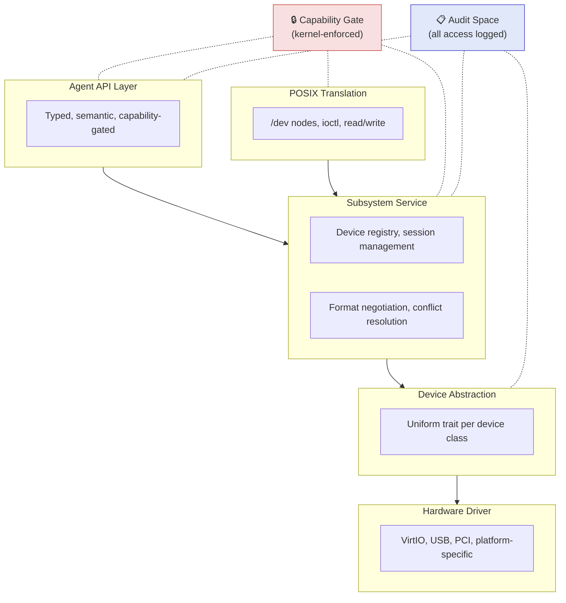
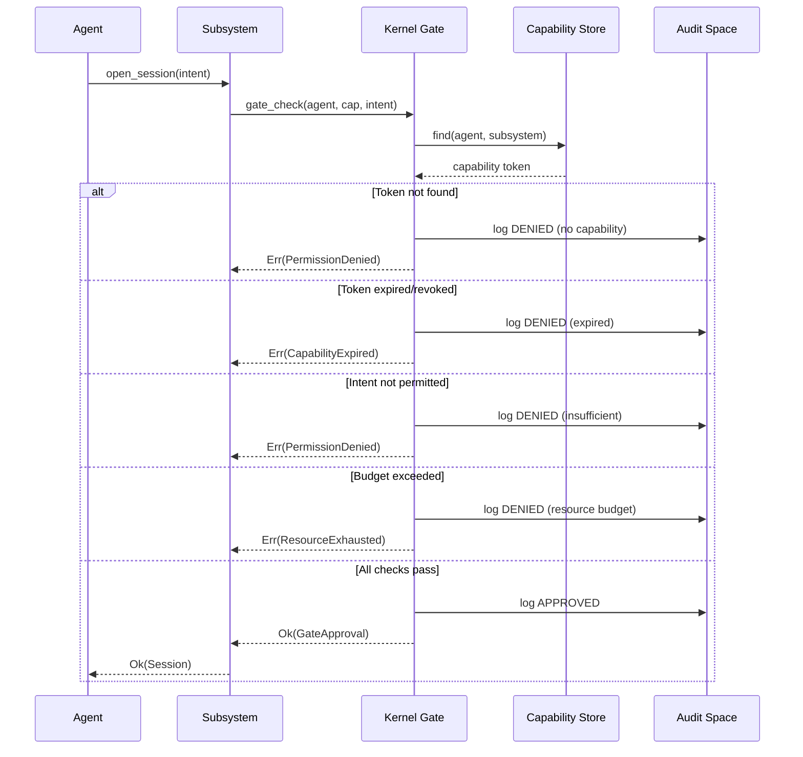
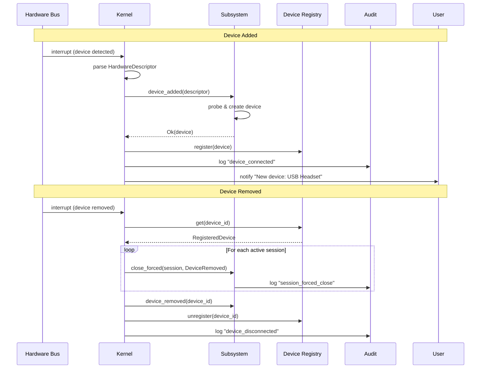
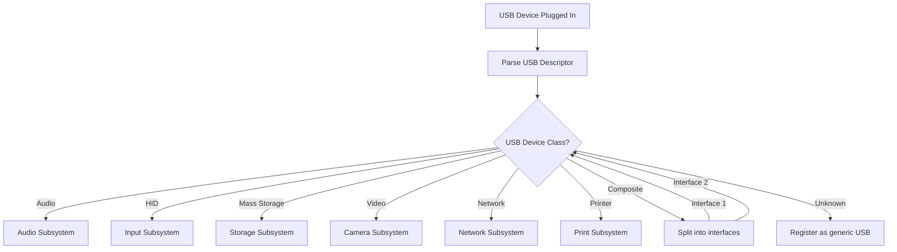
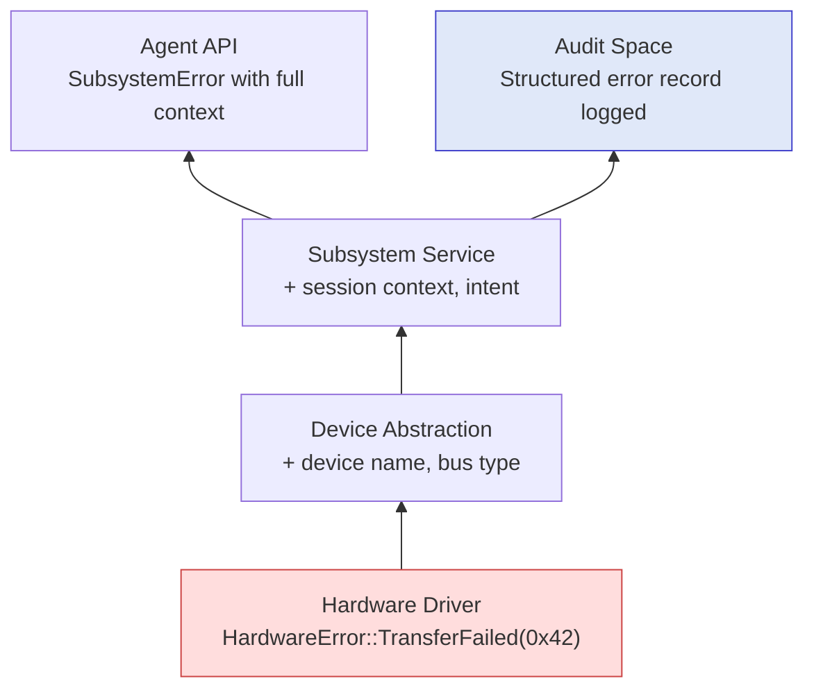
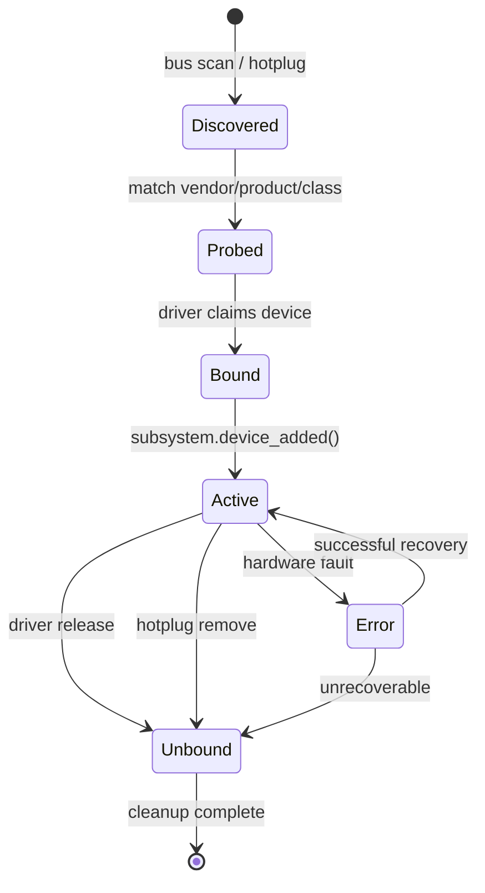

# AIOS Subsystem Framework

## Universal Hardware Abstraction Architecture

**Parent document:** [architecture.md](../project/architecture.md)
**Related:** [device-model.md](../kernel/device-model.md) — Device model and driver framework, [networking.md](./networking.md), [audio.md](./audio.md), [gpu.md](./gpu.md), [wireless.md](./wireless.md) — WiFi & Bluetooth subsystem (§7.1), [power-management.md](./power-management.md), [posix.md](./posix.md)

-----

## 1. Core Problem

Every hardware subsystem in an OS (networking, audio, USB, display, cameras, Bluetooth, printers) faces the same challenges: mediating access between software and hardware, enforcing security, handling device lifecycle, managing power, providing compatibility, and logging activity. Traditionally, each subsystem solves these independently, leading to inconsistency, duplicated patterns, and architectural drift.

AIOS defines a **subsystem framework** — a set of traits, types, and patterns that every hardware subsystem implements. The framework handles everything generic (capability enforcement, session lifecycle, audit, power management, POSIX compatibility, device registry, hotplug). The subsystem-specific code is the minimal amount needed to handle the domain (format negotiation for audio, packet framing for network, page rendering for print).

**Design principle:** Define the framework once, instantiate it for each hardware class, and the OS stays coherent no matter how many subsystems are added. Adding a new hardware class becomes formulaic, not architectural.

-----

## 2. What Every Subsystem Shares

Strip away domain-specific details from networking, USB, audio, display, storage, Bluetooth, cameras, and printers. The same structure appears every time:

1. **Hardware produces or consumes data.** A network card receives packets. A microphone produces audio samples. A display consumes pixel buffers. A USB keyboard produces key events. The direction and shape of data varies, but data always flows between hardware and software.
2. **Agents want to use that data without knowing the hardware.** An agent wants to play audio. It doesn't care whether the output is a USB headset, a Bluetooth speaker, or an HDMI monitor's built-in speakers. It has audio data and wants it to come out of something.
3. **The OS must mediate access.** Multiple agents may want the microphone. One agent shouldn't be able to spy on another's audio. The user must consent to camera access. Some devices are shared (display), some are exclusive (printer during a job), some are multiplexed (audio mixer).
4. **Everything must be auditable.** The user should be able to ask: "What has accessed my microphone?" just as easily as "What network connections were made?"
5. **POSIX tools expect specific APIs.** BSD tools expect `/dev/` nodes, file descriptors, `ioctl()`. These must work even though the underlying model is different.
6. **Power must be managed.** Every device has active, idle, suspended, and off states. The OS must transition between them uniformly.

-----

## 3. The Five-Layer Subsystem Architecture

Every subsystem in AIOS follows this layered structure:



The Capability Gate and Audit Space are cross-cutting concerns that span all layers. The gate is in the kernel. Everything else is userspace.

-----

## 4. Framework Traits and Types

These are the actual Rust traits that every subsystem implements. This isn't a guideline — it's the code structure.

### 4.1 The Subsystem Trait

```rust
/// Unique identifier for a device within the subsystem framework.
pub struct DeviceId(u64);

/// Every hardware subsystem implements this.
/// Registered with the kernel at boot.
pub trait Subsystem: Send + Sync + 'static {
    /// Unique identifier: "network", "audio", "usb", "display", etc.
    const ID: SubsystemId;

    /// The capability type this subsystem uses
    type Capability: Capability;

    /// The device abstraction for this class of hardware
    type Device: DeviceClass;

    /// The session type for active use of a device
    type Session: DeviceSession;

    /// The audit event type for this subsystem
    type AuditEvent: AuditRecord;

    /// Initialize the subsystem, discover initial devices
    fn init(&mut self, registry: &DeviceRegistry) -> Result<()>;

    /// Handle a new device being connected (hotplug)
    fn device_added(&mut self, device: HardwareDescriptor) -> Result<Self::Device>;

    /// Handle a device being disconnected
    fn device_removed(&mut self, device_id: DeviceId) -> Result<()>;

    /// An agent requests access to this subsystem
    fn open_session(
        &self,
        agent: AgentId,
        capability: &Self::Capability,
        intent: &SessionIntent,
    ) -> Result<Self::Session>;

    /// POSIX translation: map file operations to subsystem actions
    fn posix_bridge(&self) -> &dyn PosixBridge;

    /// Audit space path for this subsystem
    fn audit_space(&self) -> SpacePath {
        SpacePath::system(format!("audit/{}", Self::ID))
    }
}
```

### 4.2 Hardware Discovery

Hardware comes and goes. USB devices are plugged in and removed. Bluetooth devices appear and disappear. Even "permanent" hardware like the built-in display can be enabled/disabled. The framework handles all of this uniformly:

```rust
/// Describes hardware as discovered by the kernel
pub struct HardwareDescriptor {
    pub bus: Bus,                    // USB, PCI, Platform, Virtual
    pub vendor_id: u32,
    pub product_id: u32,
    pub device_class: DeviceClassId, // audio, input, storage, network...
    pub interfaces: Vec<Interface>,  // what the device offers
    pub power_state: PowerState,
    pub unique_id: Option<String>,   // serial number if available
}

pub enum Bus {
    USB,
    PCI,
    Platform,     // SoC-integrated (built-in audio, GPU, etc.)
    Virtual,      // VirtIO devices in QEMU
    Bluetooth,
    I2C,
    SPI,
}

/// Kernel sends these to subsystems
pub enum HardwareEvent {
    /// New device detected (USB plugged in, Bluetooth paired, etc.)
    Added(HardwareDescriptor),

    /// Device removed (USB unplugged, Bluetooth out of range)
    Removed(DeviceId),

    /// Device changed state (error, reset, firmware update)
    StateChanged(DeviceId, DeviceState),
}
```

### 4.3 Device Abstraction

What the subsystem creates from raw hardware:

```rust
/// Uniform interface for devices within a class
pub trait DeviceClass: Send + Sync {
    /// Human-readable name: "Built-in Microphone", "USB Headset", etc.
    fn name(&self) -> &str;

    /// What this device can do — not what it IS, but what it OFFERS
    /// expressed as capabilities
    fn capabilities_offered(&self) -> Vec<DeviceCapabilityDesc>;

    /// Current state
    fn state(&self) -> DeviceState;

    /// Power management
    fn set_power(&mut self, state: PowerState) -> Result<()>;

    /// Device-class-specific properties
    /// Audio: sample rates, channel counts, formats
    /// Network: link speed, MAC address
    /// Display: resolutions, refresh rates
    /// Input: key count, axes, buttons
    fn properties(&self) -> &DeviceProperties;
}

#[derive(Debug)]
pub enum DeviceState {
    Available,           // ready to use
    InUse(Vec<AgentId>), // which agents are using it
    Suspended,           // power-saving
    Error(DeviceError),  // something wrong
    Disconnected,        // physically removed (pending cleanup)
}
```

The key idea: `capabilities_offered()` returns what the device CAN do, expressed as capabilities. A microphone offers an audio capture capability. A display offers a render surface capability. A USB drive offers a storage capability. The capability system is the uniform language for what hardware provides.

### 4.4 Sessions

An agent doesn't "open a device." It opens a **session** — a bounded, capability-checked, audited interaction with hardware:

```rust
/// Active use of a device by an agent
pub trait DeviceSession: Send + Sync {
    /// The agent that owns this session
    fn agent(&self) -> AgentId;

    /// The capability that authorized this session
    fn capability(&self) -> &dyn Capability;

    /// When this session was opened
    fn started_at(&self) -> Timestamp;

    /// What the agent declared it intends to do
    fn intent(&self) -> &SessionIntent;

    /// Session-specific data channel
    /// Audio: stream of samples
    /// Network: byte channel
    /// Input: event stream
    /// Display: render surface handle
    fn channel(&self) -> &dyn DataChannel;

    /// Close the session (release the device)
    fn close(self) -> Result<SessionSummary>;
}
```

**Why sessions matter:**

Sessions give the OS complete visibility into who is using what, for how long, and why. When you ask "What's using my microphone?", the OS checks active audio sessions. When an agent crashes, its sessions are cleaned up — the microphone is released, the audio channel is closed, the speaker stops playing.

### 4.5 Session Intent

When an agent opens a session, it declares intent — not just "I want access" but why. The OS uses this for resource allocation, conflict resolution, and audit:

```rust
/// What the agent says it wants to do
pub struct SessionIntent {
    pub purpose: String,             // human-readable: "voice call", "background music"
    pub direction: DataDirection,     // Produce, Consume, Both
    pub priority: Priority,          // Realtime, Interactive, Background
    pub expected_duration: Option<Duration>,
    pub exclusive: bool,             // does this agent need sole access?
    pub task_id: Option<TaskId>,     // which task is this for?
}

pub enum DataDirection {
    Produce,    // device → agent (microphone, camera, network recv)
    Consume,    // agent → device (speakers, display, network send)
    Both,       // agent ↔ device (USB serial, network bidirectional)
}

pub enum Priority {
    Realtime,      // audio/video calls, game audio — lowest latency
    Interactive,   // user-initiated actions — moderate latency OK
    Background,    // sync, updates, non-urgent — best-effort
}
```

### 4.6 Conflict Resolution

Multiple agents may want the same device. The framework provides a uniform conflict resolution mechanism that each subsystem configures for its domain:

```rust
/// The subsystem decides how to handle conflicts
pub trait ConflictPolicy {
    fn resolve(
        &self,
        existing: &[ActiveSession],
        requested: &SessionIntent,
    ) -> ConflictResolution;
}

pub enum ConflictResolution {
    /// Both can share (audio output: mix together)
    Share,
    /// New session gets access, existing continues at lower priority
    Preempt,
    /// New session waits until existing finishes
    Queue,
    /// Deny the new session
    Deny,
    /// Ask the user
    Prompt(String),
}
```

**Conflict policies by subsystem:**

| Subsystem | Default Conflict Policy | Rationale |
|---|---|---|
| Audio output | Share (mixer) | Multiple audio streams mix naturally |
| Audio input (microphone) | Prompt user | Privacy-sensitive, user must consent |
| Display | Share (compositor) | Compositor manages windows |
| Input (keyboard/mouse) | Share (broadcast) | Events go to focused agent |
| Camera | Prompt user | Privacy-sensitive |
| Network | Share (multiplex) | Connections are independent |
| Printer | Queue (FIFO) | Print jobs wait in line |
| Storage | Share (filesystem) | Concurrent access managed by storage layer |
| Bluetooth audio | Exclusive or Prompt | Only one audio stream to BT headphones |

-----

## 5. The Capability Gate

Every session opening passes through the same kernel-enforced gate. This is the security foundation — it cannot be bypassed:

```rust
/// Kernel-enforced capability check for all subsystem access
fn gate_check(
    agent: AgentId,
    subsystem: SubsystemId,
    capability: &dyn Capability,
    intent: &SessionIntent,
) -> Result<GateApproval> {
    // 1. Does this agent hold a capability for this subsystem?
    let agent_caps = capability_store.get(agent)?;
    let relevant_cap = agent_caps.find(subsystem)?;

    // 2. Does the capability permit this specific intent?
    if !relevant_cap.permits(intent) {
        audit(agent, subsystem, intent, "DENIED: insufficient capability");
        return Err(PermissionDenied);
    }

    // 3. Is the capability still valid? (not expired, not revoked)
    if relevant_cap.is_expired() || relevant_cap.is_revoked() {
        audit(agent, subsystem, intent, "DENIED: capability expired/revoked");
        return Err(CapabilityExpired);
    }

    // 4. Rate limiting / resource budget
    if !resource_budget.allows(agent, subsystem, intent) {
        audit(agent, subsystem, intent, "DENIED: resource budget exceeded");
        return Err(ResourceExhausted);
    }

    // 5. All checks passed
    audit(agent, subsystem, intent, "APPROVED");
    Ok(GateApproval {
        session_id: new_session_id(),
        granted_at: now(),
    })
}
```

This is identical for every subsystem. Audio, network, USB, camera, display — they all pass through the same gate. The only thing that varies is the capability type and what "permits" means for each subsystem.

The gate check flow in detail:



-----

## 6. Data Channels

Every session produces or consumes data through a channel. The channel abstraction is common, but the shape of data varies:

### 6.1 The DataChannel Trait

```rust
/// Universal data channel — the pipe between hardware and agents
pub trait DataChannel: Send + Sync {
    /// The format of data in this channel
    fn format(&self) -> DataFormat;

    /// Read data from the channel (device → agent)
    fn read(&self, buffer: &mut [u8]) -> Result<usize>;

    /// Write data to the channel (agent → device)
    fn write(&self, data: &[u8]) -> Result<usize>;

    /// Non-blocking poll
    fn poll(&self) -> ChannelState;

    /// Flow integration: connect this channel to a Flow pipe
    fn connect_flow(&self, flow: FlowPipe) -> Result<()>;

    /// Backpressure: how full is the buffer?
    fn pressure(&self) -> f32; // 0.0 = empty, 1.0 = full
}
```

### 6.2 Zero-Copy Data Plane

The synchronous `read`/`write` interface above handles the common case, but high-throughput subsystems (network, storage, video) benefit from zero-copy data transfer. The framework provides an optional zero-copy extension inspired by io_uring's submission/completion model (Linux), Fuchsia's VMO registration pattern, and Hubris's lease-based bulk I/O:

```rust
/// Zero-copy data channel extension for high-throughput subsystems.
/// Implementations choose the transport that fits their performance needs.
pub trait ZeroCopyChannel: DataChannel {
    /// Register a buffer pool for zero-copy I/O.
    /// Buffers are pinned once at registration time; subsequent I/O
    /// references them by ID, avoiding per-operation page pinning.
    fn register_buffers(&self, pool: &BufferPool) -> Result<BufferPoolId>;

    /// Submit a zero-copy read: hardware DMAs directly into a registered buffer.
    /// Returns a completion token; the caller polls or awaits completion.
    fn submit_read(&self, buf_id: BufferId, offset: usize, len: usize) -> Result<CompletionToken>;

    /// Submit a zero-copy write: hardware reads directly from a registered buffer.
    fn submit_write(&self, buf_id: BufferId, offset: usize, len: usize) -> Result<CompletionToken>;

    /// Poll for completed I/O operations (non-blocking).
    fn poll_completions(&self, out: &mut [Completion]) -> usize;

    /// Transfer buffer ownership between subsystems without copying.
    /// The source loses access; the destination gains it. Kernel validates
    /// capability for both sides.
    fn transfer_buffer(&self, buf_id: BufferId, target: &dyn ZeroCopyChannel) -> Result<BufferId>;
}

/// Pre-registered buffer pool for zero-copy I/O
pub struct BufferPool {
    pub region: SharedMemoryId,     // capability-gated shared memory region
    pub buffer_size: usize,         // size of each buffer slot
    pub buffer_count: usize,        // number of slots
}
```

**Design rationale:**

- **Registered buffers** (from io_uring): pin memory once at registration, eliminating per-I/O page table walks. Linux 6.15's zero-copy receive achieves +41% throughput with this pattern.
- **Buffer transfer** (from Fuchsia VMOs): `zx_vmo_transfer_data` moves physical pages between virtual memory objects without copying or zeroing. AIOS adapts this as `transfer_buffer()` for inter-subsystem pipelines.
- **Lease-based access** (from Hubris): when sending a message, a task grants the recipient read or write access to its memory via a kernel-validated lease. This enables zero-copy bulk I/O between isolated address spaces.
- **SPSC rings** (from LionsOS/sDDF on seL4): bounded single-producer, single-consumer shared-memory queues with cache-line-aligned entries. No locks needed when producer and consumer are in separate address spaces.

### 6.3 Data Formats

```rust
/// What kind of data flows through a channel
pub enum DataFormat {
    ByteStream,                          // network, serial, generic
    Audio {
        sample_rate: u32,                // 44100, 48000, 96000...
        channels: u16,                   // 1=mono, 2=stereo, 6=5.1
        format: SampleFormat,            // F32, I16, I24
    },
    Video {
        width: u32, height: u32,
        pixel_format: PixelFormat,
        frame_rate: f32,
    },
    Events(EventSchema),                 // input devices: key, mouse, touch
    Frames(FrameSchema),                 // structured data: USB HID reports
    RenderSurface {                      // display output
        width: u32, height: u32,
        format: PixelFormat,
    },
}
```

### 6.4 Flow Integration

The critical method is `connect_flow()`. This is where the subsystem framework meets AIOS's Flow system. Any data channel can be connected to a Flow pipe, enabling hardware-to-agent-to-hardware pipelines:

```rust
// Microphone → Flow → Speech recognition agent
let mic_session = audio.open_session(agent, mic_cap, intent)?;
let speech_input = speech_agent.input_flow()?;
mic_session.channel().connect_flow(speech_input)?;
// Audio samples flow directly from hardware to agent — zero-copy if possible

// Camera → Flow → Object detection agent → Flow → Network (push notification)
let cam_session = camera.open_session(agent, cam_cap, intent)?;
let detect_input = detection_agent.input_flow()?;
cam_session.channel().connect_flow(detect_input)?;
let net_channel = network.open_session(agent, net_cap, intent)?;
detection_agent.output_flow()?.connect_flow(net_channel)?;

// GPS + Camera → Flow → Field survey agent → Flow → Storage space (geotagged photos)
let gps_session = gps.open_session(agent, gps_cap, intent)?;
let cam_session = camera.open_session(agent, cam_cap, intent)?;
survey_agent.connect_inputs(gps_session.channel(), cam_session.channel())?;
survey_agent.output_flow()?.connect_flow(storage_channel)?;
```

Hardware, agents, and network are all connected through the same abstraction. Data flows from hardware through agents to other hardware or network as a continuous pipeline, not as disconnected read/write calls. This is a defining characteristic of AIOS.

When both endpoints implement `ZeroCopyChannel`, Flow can establish a direct buffer-transfer pipeline — hardware DMAs into a registered buffer, the buffer's ownership transfers through the pipeline without any memory copies, and the final consumer reads directly from the original DMA target.

-----

## 7. Audit System

Every subsystem logs to its audit space using the same structure:

### 7.1 Audit Record Trait

```rust
pub trait AuditRecord: Serialize {
    fn timestamp(&self) -> Timestamp;
    fn agent(&self) -> AgentId;
    fn session(&self) -> SessionId;
    fn task(&self) -> Option<TaskId>;
    fn event_type(&self) -> &str;
    fn summary(&self) -> String;
}
```

### 7.2 Subsystem-Specific Audit Events

Each subsystem defines its specific audit events, but they all implement `AuditRecord`:

```rust
// Network audit
struct NetworkAuditEvent {
    // ... AuditRecord fields plus:
    destination: String,
    bytes_sent: u64,
    bytes_received: u64,
    protocol: Protocol,
    tls_version: Option<TlsVersion>,
}

// Audio audit
struct AudioAuditEvent {
    // ... AuditRecord fields plus:
    device: DeviceId,
    direction: DataDirection,
    duration: Duration,
    sample_count: u64,
}

// Camera audit
struct CameraAuditEvent {
    // ... AuditRecord fields plus:
    device: DeviceId,
    resolution: (u32, u32),
    frame_count: u64,
    duration: Duration,
}

// Input audit
struct InputAuditEvent {
    // ... AuditRecord fields plus:
    device: DeviceId,
    event_count: u64,
    // NOTE: never logs keystroke content — only counts and timing
}
```

### 7.3 Audit Space Structure

```text
system/audit/                    ← Top-level audit space
  network/                       ← Network subsystem audit
    connections/                  ← Individual connection records
    dns/                          ← DNS resolution log
    certificates/                 ← Certificate observations
    bandwidth/                    ← Per-day bandwidth summaries
  audio/                          ← Audio subsystem audit
    sessions/                     ← Who used mic/speakers, when, why
  camera/                         ← Camera subsystem audit
    sessions/                     ← Who accessed camera, when, why
  input/                          ← Input subsystem audit
    sessions/                     ← Device usage (not keystroke content)
  display/                        ← Display subsystem audit
  storage/                        ← Storage subsystem audit
  bluetooth/                      ← Bluetooth subsystem audit
  usb/                            ← USB subsystem audit (device connections)
```

### 7.4 Cross-Subsystem Queries

Because all audit events implement the same trait and live in the same space hierarchy, AIRS can query across all subsystems:

- "What hardware did agent X access in the last hour?" → query all `audit/*/` spaces filtered by agent ID
- "Is anything using my camera right now?" → query `audit/camera/` for active sessions
- "Show me all hardware access while I was away." → query all audit spaces for the time range
- "Which agent uses the most hardware resources?" → aggregate across all audit spaces by agent

AIRS can surface insights automatically: "Your backup agent has transferred 50GB in the last week. That's 3x more than usual. Would you like to investigate?"

-----

## 8. POSIX Bridge

Every subsystem exposes a POSIX-compatible interface for BSD tools. See [posix.md](./posix.md) for the full POSIX compatibility layer design.

```rust
pub trait PosixBridge {
    /// What /dev nodes this subsystem provides
    fn dev_nodes(&self) -> Vec<DevNode>;

    /// Handle open() on a /dev node
    fn open(&self, node: &DevNode, flags: OpenFlags, agent: AgentId) -> Result<PosixFd>;

    /// Handle read() on an opened fd
    fn read(&self, fd: PosixFd, buf: &mut [u8]) -> Result<usize>;

    /// Handle write() on an opened fd
    fn write(&self, fd: PosixFd, buf: &[u8]) -> Result<usize>;

    /// Handle ioctl() — the escape hatch for device-specific operations
    fn ioctl(&self, fd: PosixFd, request: u64, arg: *mut u8) -> Result<i32>;

    /// Handle close()
    fn close(&self, fd: PosixFd) -> Result<()>;

    /// Handle poll()/select() for async I/O
    fn poll(&self, fd: PosixFd) -> PollState;
}

pub struct DevNode {
    pub path: String,           // "/dev/audio0", "/dev/video0", "/dev/input/event0"
    pub device_class: String,   // "audio", "video", "input"
    pub permissions: PosixPerms,
    pub device_id: DeviceId,    // maps to actual AIOS device
}
```

**Translation flow:** When a BSD tool does `open("/dev/audio0", O_RDONLY)`:

1. POSIX emulation layer sees the `/dev/` path
2. Routes to the audio subsystem's POSIX bridge
3. Bridge checks: does this process's agent have an audio capture capability?
4. If yes: opens a session internally, returns a file descriptor
5. Subsequent `read()` calls on that fd return audio samples
6. `close()` ends the session, logs to audit

The tool thinks it's reading from a device file. The subsystem framework handles everything underneath.

-----

## 9. Power Management

Every device has power states. The framework makes this uniform. See [power-management.md](./power-management.md) for the system-wide power management architecture.

```rust
#[derive(Debug, Clone)]
pub enum PowerState {
    Active,                      // fully powered, in use
    Idle,                        // powered but not actively used
    Suspended {                  // low-power, can resume quickly
        resume_time: Duration,   // how long to wake up
    },
    Off,                         // fully powered down
}

pub trait PowerManaged {
    fn current_power(&self) -> PowerState;
    fn set_power(&mut self, state: PowerState) -> Result<()>;
    fn supports_state(&self, state: &PowerState) -> bool;

    /// How long since last active use
    fn idle_duration(&self) -> Duration;

    /// Policy: when should OS auto-suspend this device?
    fn idle_policy(&self) -> IdlePolicy;
}

pub struct IdlePolicy {
    pub idle_to_suspended: Duration,  // e.g., 30 seconds of no sessions
    pub suspended_to_off: Duration,   // e.g., 5 minutes suspended
    pub wake_on: Vec<WakeEvent>,      // what brings it back
}

pub enum WakeEvent {
    SessionRequested,       // an agent wants to use it
    DeviceInterrupt,        // hardware interrupt (e.g., USB device plugged in)
    Timer(Duration),        // periodic wake for polling
    NetworkPacket,          // wake-on-LAN
}
```

The OS power manager doesn't need to know what kind of device it is. It checks `idle_duration()` against `idle_policy()` for every device, across all subsystems, and transitions power states uniformly. A microphone that hasn't been used for 30 seconds gets suspended the same way a WiFi radio that hasn't been used for 30 seconds gets suspended.

-----

## 10. Device Registry

Central registry of all devices across all subsystems, itself stored as a system space:

```rust
/// Central registry — a system space at system/devices/
pub struct DeviceRegistry {
    devices: HashMap<DeviceId, RegisteredDevice>,
}

pub struct RegisteredDevice {
    pub id: DeviceId,
    pub subsystem: SubsystemId,
    pub hardware: HardwareDescriptor,
    pub name: String,
    pub state: DeviceState,
    pub power: PowerState,
    pub active_sessions: Vec<SessionId>,
    pub connected_since: Timestamp,
    pub space_path: SpacePath,  // where this device's data lives
}
```

Because the Device Registry is a space (`system/devices/`), every connected device is a queryable object:

- "What devices are connected?" → space query
- "When was my USB drive last connected?" → space query with temporal filter
- "What devices has agent X used?" → cross-reference device space with audit space

-----

## 11. Subsystem Registration and Hotplug

At boot, subsystems register with the kernel and discover initial hardware:

```rust
fn init_subsystems(registry: &mut DeviceRegistry) {
    // Each subsystem registers itself
    subsystem::register(NetworkSubsystem::new());
    subsystem::register(AudioSubsystem::new());
    subsystem::register(InputSubsystem::new());
    subsystem::register(DisplaySubsystem::new());
    subsystem::register(StorageSubsystem::new());
    subsystem::register(CameraSubsystem::new());
    subsystem::register(UsbSubsystem::new());       // meta-subsystem: routes to others
    subsystem::register(BluetoothSubsystem::new());
    subsystem::register(PrintSubsystem::new());

    // Discover initial hardware
    for descriptor in hardware::enumerate() {
        let subsystem = match_subsystem(descriptor.device_class);
        subsystem.device_added(descriptor);
    }

    // Listen for hotplug events
    hardware::on_event(|event| {
        match event {
            HardwareEvent::Added(desc) => {
                let subsystem = match_subsystem(desc.device_class);
                let device = subsystem.device_added(desc)?;
                registry.register(device);
                audit_log("device_connected", &device);
                notify_user("New device: {}", device.name());
            }
            HardwareEvent::Removed(id) => {
                let device = registry.get(id)?;
                // Close all active sessions on this device
                for session in device.active_sessions() {
                    session.close_forced(Reason::DeviceRemoved);
                }
                device.subsystem().device_removed(id)?;
                registry.unregister(id);
                audit_log("device_disconnected", &device);
            }
            HardwareEvent::StateChanged(id, state) => {
                registry.update_state(id, state)?;
            }
        }
    });
}
```

The hotplug lifecycle in detail:



-----

## 12. USB as a Meta-Subsystem

**Full USB architecture:** [usb.md](./usb.md) — controller drivers (xHCI, DWC2), device class drivers, hotplug state machine, power management, security model, AI-native features. This section covers the subsystem framework routing pattern.

USB is special because it's a bus, not a device class. A USB port can have a keyboard (input), a microphone (audio), a webcam (camera), a thumb drive (storage), or an Ethernet adapter (network) plugged into it. USB's role is to identify what's been connected and route it to the right subsystem:



```rust
impl Subsystem for UsbSubsystem {
    fn device_added(&mut self, desc: HardwareDescriptor) -> Result<()> {
        let usb_desc = UsbDescriptor::parse(&desc)?;

        match usb_desc.class {
            UsbClass::Audio => {
                let audio_dev = usb_audio::create_device(usb_desc)?;
                audio_subsystem.device_added(audio_dev)?;
            }
            UsbClass::HID => {
                let input_dev = usb_hid::create_device(usb_desc)?;
                input_subsystem.device_added(input_dev)?;
            }
            UsbClass::MassStorage => {
                let storage_dev = usb_storage::create_device(usb_desc)?;
                storage_subsystem.device_added(storage_dev)?;
            }
            UsbClass::Video => {
                let camera_dev = usb_video::create_device(usb_desc)?;
                camera_subsystem.device_added(camera_dev)?;
            }
            UsbClass::Network => {
                let net_dev = usb_net::create_device(usb_desc)?;
                network_subsystem.device_added(net_dev)?;
            }
            UsbClass::Printer => {
                let print_dev = usb_print::create_device(usb_desc)?;
                print_subsystem.device_added(print_dev)?;
            }
            UsbClass::Composite(interfaces) => {
                // Device has multiple interfaces (e.g., webcam + mic)
                for interface in interfaces {
                    self.device_added(interface.as_descriptor())?;
                }
            }
            _ => {
                // Unknown device class — register as generic USB device
                // Agent with raw USB capability can interact with it
                registry.register_generic(usb_desc)?;
            }
        }
        Ok(())
    }
}
```

USB doesn't implement sessions or data channels directly. It routes devices to the subsystem that handles their class. The audio subsystem doesn't care whether a microphone is USB, Bluetooth, or built-in — it sees a device that implements `AudioDevice` and treats them all the same.

-----

## 13. Example: Audio Subsystem Implementation

To prove the framework works, here's how the audio subsystem fills in all the traits:

```rust
pub struct AudioSubsystem {
    devices: Vec<AudioDevice>,
    mixer: AudioMixer,
    sessions: HashMap<SessionId, AudioSession>,
}

impl Subsystem for AudioSubsystem {
    const ID: SubsystemId = "audio";
    type Capability = AudioCapability;
    type Device = AudioDevice;
    type Session = AudioSession;
    type AuditEvent = AudioAuditEvent;

    fn open_session(
        &self,
        agent: AgentId,
        cap: &AudioCapability,
        intent: &SessionIntent,
    ) -> Result<AudioSession> {
        // 1. Capability gate (kernel-enforced)
        gate_check(agent, Self::ID, cap, intent)?;

        // 2. Find the right device
        let device = match &cap.target {
            AudioTarget::Default => self.default_device(intent.direction)?,
            AudioTarget::Specific(id) => self.get_device(id)?,
        };

        // 3. Conflict resolution
        if device.has_active_sessions() && intent.exclusive {
            match self.conflict_policy.resolve(&device.sessions(), intent) {
                ConflictResolution::Deny => return Err(DeviceBusy),
                ConflictResolution::Prompt(msg) => {
                    user::prompt(msg).await?;
                }
                _ => { /* proceed */ }
            }
        }

        // 4. Negotiate format
        let format = negotiate_format(
            cap.requested_format(),
            device.supported_formats(),
        )?;

        // 5. Create data channel
        let channel = match intent.direction {
            DataDirection::Produce => device.open_capture(format)?,
            DataDirection::Consume => self.mixer.add_stream(device, format)?,
            DataDirection::Both => device.open_duplex(format)?,
        };

        let session = AudioSession {
            id: new_session_id(),
            agent,
            device: device.id(),
            channel,
            format,
            intent: intent.clone(),
            started_at: now(),
        };

        // 6. Audit
        self.audit(AudioAuditEvent::SessionOpened {
            agent, device: device.id(), direction: intent.direction,
            format, purpose: intent.purpose.clone(),
        });

        Ok(session)
    }

    fn posix_bridge(&self) -> &dyn PosixBridge {
        &self.posix // maps /dev/audio*, /dev/dsp, /dev/mixer
    }
}

/// Audio-specific capability (simplified — see audio.md §3.2 for the canonical enum definition)
pub struct AudioCapability {
    pub direction: DataDirection,    // capture, playback, or both
    pub target: AudioTarget,         // specific device or default
    pub max_channels: u16,           // e.g., stereo only
    pub max_sample_rate: u32,        // e.g., 48000
    pub exclusive: bool,             // can request exclusive access
}
```

### 13.1 Audio Mixer: A Subsystem Service

Like the optional TLS service in networking, the audio subsystem provides an **audio mixer service**. Multiple agents playing audio simultaneously get mixed together:

- Apply per-agent volume (capability can set max volume)
- Apply system-wide volume
- Route to the correct output device
- Handle device changes (headphones plugged in → reroute)
- Maintain low latency (audio glitches are immediately perceptible)

An agent that needs raw, exclusive audio access (a professional audio workstation agent) can bypass the mixer with an `exclusive: true` session. This requires an explicit capability grant and blocks other agents from using that output device.

-----

## 14. All Subsystems at a Glance

How each subsystem fills in the framework:

| Subsystem | Device Type | Session Type | Channel Format | Conflict Policy | POSIX Nodes |
|---|---|---|---|---|---|
| **Network** | Interface (eth, wlan) | Connection | ByteStream | Share (multiplex) | socket API |
| **Audio** | Output/Input device | Playback/Capture stream | Audio samples | Output: Share (mixer), Input: Prompt | /dev/audio* |
| **Display** | Monitor/screen | Render surface | RenderSurface | Share (compositor) | /dev/fb*, DRM |
| **Input** | Keyboard/mouse/touch | Event listener | Events | Share (broadcast to focus) | /dev/input/event* |
| **Camera** | Camera device | Capture stream | Video frames | Prompt user | /dev/video* |
| **Storage** | Disk/partition | Mount/read/write | ByteStream | Share (filesystem layer) | /dev/sd*, block |
| **Bluetooth** | BT adapter | Connection | ByteStream/Events | Per-profile | /dev/bluetooth* |
| **Print** | Printer | Print job | Frames (pages) | Queue (FIFO) | /dev/lp*, CUPS bridge |
| **GPS** | GPS receiver | Location stream | Events (location) | Share (read-only) | — |
| **Compute** | GPU/NPU/DSP | Inference session | ByteStream (tensors) | Queue (priority-ordered) | /dev/compute/* |

Every row follows the same traits. The subsystem-specific code is the minimal amount needed to handle the domain. Everything else — capability gate, session lifecycle, audit, power management, POSIX bridge, device registry, hotplug — is the framework.

-----

## 15. What the Framework Enables

### 15.1 Adding New Hardware Is Formulaic

To add GPS support:

1. Define `GpsCapability` (which agents can read location, how often, precision level)
2. Define `GpsDevice` implementing `DeviceClass` (reports position + accuracy)
3. Define `GpsSession` (active location tracking session)
4. Data channel format: `Events(LocationEvent { lat, lon, altitude, accuracy, timestamp })`
5. Conflict policy: `Share` (multiple agents can read location)
6. Audit: which agents read location and when

No new kernel code, no new IPC protocols, no new security model. GPS plugs into the same system as audio, network, and cameras.

### 15.2 Hardware Pipelines Through Flow

Because every subsystem's data channel connects to Flow, agents can build hardware pipelines:

```text
Microphone → [speech recognition] → [translation] → Speaker
Camera → [object detection] → [alert agent] → Network (push notification)
GPS + Camera → [field survey] → Storage space (geotagged photos)
Microphone → [voice command] → [system control] → Display (UI updates)
```

Each arrow is a Flow connection. Each agent has capabilities for the subsystems it touches. The OS enforces the pipeline's security at every boundary.

### 15.3 AIRS Understands All Hardware

Because every subsystem logs to audit spaces using the same trait, AIRS can query across all hardware:

- "What hardware was in use during my video call?" → correlate audio, camera, network, and display audit spaces by overlapping time ranges
- "Which agent uses the most hardware resources?" → aggregate across all audit spaces by agent
- "Turn off everything I'm not using." → check all subsystems for idle devices, transition to suspended

### 15.4 New Subsystems Don't Require AIRS Updates

AIRS queries spaces. New subsystems create new spaces with the same audit structure. AIRS can query a GPS audit space the same way it queries a camera audit space — the schema is the same `AuditRecord` trait. No AI model update needed to understand new hardware.

### 15.5 Uniform Power Management

The OS power manager treats all devices identically. Check idle duration, apply idle policy, transition power states. This works across all subsystems without per-subsystem power management code.

-----

## 16. Relationship to Networking

The networking subsystem was the first to be designed in detail (see [networking.md](./networking.md)). The subsystem framework was derived from patterns that emerged from that design.

Networking follows the framework with some domain-specific additions:

- **Layered optional services:** The TLS service and HTTP service are subsystem services (like the audio mixer). Agents can use them or bypass them with raw capabilities. This is the "mandatory gate + optional services" pattern.
- **The capability gate enforces destination restrictions**, not just "can this agent use the network" but "can this agent reach this specific service."
- **Connection intent maps to SessionIntent** with network-specific extensions (Realtime, API, Transfer, BackgroundSync, Streaming).
- **The Space Mesh Protocol** is a networking subsystem service for device-to-device space synchronization.

The same "mandatory kernel gate + optional userspace services" pattern applies to every subsystem.

-----

## 17. Error Handling and Recovery

Every layer in the subsystem stack produces errors. The framework defines a uniform error taxonomy so agents receive typed, actionable errors regardless of which subsystem they interact with.

### 17.1 Error Taxonomy

```rust
/// Errors originate at different layers and propagate upward,
/// gaining context at each level.
pub enum SubsystemError {
    /// Hardware-level fault reported by the driver
    Hardware(HardwareError),

    /// Subsystem service policy violation
    Policy(PolicyError),

    /// Session-level error during active use
    Session(SessionError),

    /// Capability system rejection (from kernel gate)
    Capability(CapabilityError),
}

pub enum HardwareError {
    DeviceNotResponding,         // timeout on MMIO/DMA
    TransferFailed(u32),         // bus-specific error code
    DeviceReset,                 // device initiated reset
    FirmwareError(String),       // device firmware reported error
    PowerFault,                  // device failed to change power state
}

pub enum PolicyError {
    FormatNotSupported,          // requested format unavailable
    ConflictDenied,              // conflict policy rejected session
    DeviceBusy,                  // exclusive session already active
    RateLimited,                 // too many operations in time window
}

pub enum SessionError {
    ChannelClosed,               // data channel unexpectedly closed
    BufferOverrun,               // producer faster than consumer
    BufferUnderrun,              // consumer faster than producer
    Timeout,                     // operation timed out
    DeviceRemoved,               // hardware unplugged during session
}

pub enum CapabilityError {
    NotHeld,                     // agent lacks required capability
    Expired,                     // capability token expired
    Revoked,                     // capability was revoked
    InsufficientRights,          // capability exists but doesn't permit this intent
    BudgetExhausted,             // resource budget exceeded
}
```

### 17.2 Error Propagation

Errors propagate upward through the layers, gaining context at each level:



### 17.3 Recovery Strategies

Each layer has recovery options before escalating:

| Layer | Recovery Strategy |
|---|---|
| Hardware Driver | Retry with exponential backoff (max 3 attempts), device reset |
| Device Abstraction | Fallback to alternative device if available |
| Subsystem Service | Graceful degradation (e.g., lower sample rate on audio error) |
| Agent API | Return typed error for agent to handle or display to user |

All errors — including recovered ones — are logged to the subsystem's audit space with structured context (device ID, session ID, error code, recovery action taken).

-----

## 18. Testing Patterns

Subsystem implementations must be testable without hardware. The framework provides patterns for testing at multiple levels.

### 18.1 Mock Device Framework

```rust
/// Mock transport for host-side unit testing
pub struct MockTransport {
    responses: VecDeque<MockResponse>,
    operations: Vec<MockOperation>,
}

impl MockTransport {
    /// Configure a sequence of responses the mock will return
    pub fn with_responses(responses: Vec<MockResponse>) -> Self { /* ... */ }

    /// Inject an error at a specific operation index
    pub fn with_error_at(index: usize, error: HardwareError) -> Self { /* ... */ }

    /// Retrieve the log of operations performed against the mock
    pub fn operations(&self) -> &[MockOperation] { /* ... */ }
}
```

Every `DeviceClass` implementation should be testable with a `MockTransport` in place of real hardware. Tests run on the host (`cargo test`) without QEMU.

### 18.2 Conformance Test Suite

The framework provides a generic conformance test suite that every `Subsystem` implementation must pass:

- **Session lifecycle:** open → use → close produces correct audit records
- **Conflict resolution:** verify conflict policy returns correct resolution for all combinations
- **Hotplug:** device_added → device_removed correctly cleans up all sessions
- **Power transitions:** idle → suspended → active round-trip preserves device state
- **Error recovery:** injected hardware errors propagate correctly and trigger recovery
- **Capability enforcement:** sessions without valid capabilities are rejected

### 18.3 Fuzz Targets

Hardware descriptor parsing is a primary attack surface. Fuzz targets should cover:

- `HardwareDescriptor` parsing from raw bus data (USB descriptors, PCI BARs, DTB nodes)
- `SessionIntent` validation (malformed priority, invalid duration, conflicting flags)
- `DataFormat` negotiation (incompatible format combinations, overflow in dimensions)
- Feature negotiation (VirtIO feature bits, USB interface descriptors)

The DNAFuzz approach (descriptor-aware fuzzing with field-level mutation guidance) is particularly effective — it found an 8-year Linux kernel USB bug that other fuzzers missed. See [fuzzing.md](../security/fuzzing.md) for the project-wide fuzzing strategy.

### 18.4 Integration Testing Tiers

| Tier | Environment | What It Tests | Speed |
|---|---|---|---|
| 1. Host unit tests | `cargo test` | Subsystem logic with MockTransport | Seconds |
| 2. QEMU device tests | QTest framework | Driver ↔ virtual device interaction | Minutes |
| 3. QEMU full boot | `just run` | End-to-end session lifecycle | Minutes |

-----

## 19. Performance Monitoring

Every subsystem exposes performance metrics through the kernel observability framework (see [observability.md](../kernel/observability.md)).

### 19.1 Per-Subsystem Metrics

```rust
/// Standard metrics every subsystem reports
pub trait SubsystemMetrics {
    /// How long it takes to open a session (gate check + device setup)
    fn session_open_latency(&self) -> &Histogram<8>;

    /// Data throughput through active channels
    fn channel_throughput_bytes(&self) -> &Counter;

    /// Number of currently active sessions
    fn active_sessions(&self) -> &Gauge;

    /// Error rate (errors per second)
    fn error_rate(&self) -> &Counter;

    /// Backpressure: fraction of channels above 80% buffer utilization
    fn high_pressure_channels(&self) -> &Gauge;
}
```

These metrics integrate with the `KernelMetrics` registry, enabling system-wide dashboards through the Inspector application (see [inspector.md](../applications/inspector.md)).

### 19.2 Per-Session Telemetry

Each active session tracks:

- **Latency histogram:** end-to-end latency from hardware event to agent delivery
- **Buffer pressure over time:** rolling average of `DataChannel::pressure()`
- **Format conversion overhead:** CPU time spent in format negotiation or transcoding
- **Zero-copy efficiency:** fraction of transfers that avoided memory copies

### 19.3 AIRS Dashboard Queries

AIRS and Inspector can query subsystem health across the system:

- "Which subsystem has the highest error rate?" → compare `error_rate()` across all subsystems
- "Is any device under backpressure?" → check `high_pressure_channels()` system-wide
- "What's the audio latency right now?" → query audio subsystem's `session_open_latency()`

-----

## 20. Driver Model Integration

The subsystem framework sits above individual device drivers. This section defines how drivers integrate with the framework and how the HAL Platform trait (see [hal.md](../kernel/hal.md) §2-3) relates to subsystem-level abstractions.

### 20.1 Driver Lifecycle



- **Discovered:** Bus enumeration or hotplug event produces a `HardwareDescriptor`.
- **Probed:** Driver matching checks vendor/product ID tables and device class against registered drivers.
- **Bound:** The matching driver claims the device and initializes transport (MMIO mapping, interrupt setup, DMA allocation).
- **Active:** The subsystem's `device_added()` is called, creating a `DeviceClass` instance. Sessions can now be opened.
- **Unbound:** On hotplug removal or driver unload, all sessions are force-closed, the subsystem's `device_removed()` is called, and resources are released.

### 20.2 Driver Matching

When multiple drivers could handle a device, matching follows a priority order:

1. **Exact match:** vendor ID + product ID (most specific)
2. **Class match:** device class + subclass + protocol
3. **Bus match:** bus-specific generic driver (fallback)

### 20.3 Driver Isolation

Following the Asterinas framekernel pattern, the subsystem framework enforces a trust boundary:

- **Framework core (privileged):** Capability gate, session lifecycle, audit logging, buffer pool management. The design goal is for this to be the only code that uses `unsafe` for MMIO and DMA operations — drivers should not need direct `unsafe` hardware access.
- **Driver code (de-privileged):** All subsystem-specific logic — format negotiation, protocol handling, device quirks — targets safe Rust. Drivers interact with hardware through the framework's transport abstraction rather than direct MMIO. Early drivers (e.g., `virtio_blk`) predate the framework and still contain `unsafe` blocks; these will be migrated as the transport abstraction matures.

Each driver runs in its own address space with capability-gated MMIO access. The driver holds a capability token granting access to specific MMIO regions and interrupt lines — nothing more.

-----

## 21. Versioning and Evolution

The subsystem framework must evolve without breaking existing subsystem implementations.

### 21.1 Extension Traits

New framework capabilities are added as extension traits rather than modifying the base `Subsystem` trait:

```rust
/// Added after initial framework — zero-copy support
pub trait SubsystemV2: Subsystem {
    /// Open a session with zero-copy channel support
    fn open_session_zc(
        &self,
        agent: AgentId,
        capability: &Self::Capability,
        intent: &SessionIntent,
    ) -> Result<(Self::Session, Box<dyn ZeroCopyChannel>)> {
        // Default: zero-copy not supported, caller should use open_session() instead
        Err(SubsystemError::Policy(PolicyError::FormatNotSupported))
    }
}
```

### 21.2 Subsystem Manifest

Every subsystem declares its capabilities and framework version at registration:

```rust
pub struct SubsystemManifest {
    pub id: SubsystemId,
    pub framework_version: u32,      // which framework version this implements
    pub extensions: Vec<ExtensionId>, // which extension traits are supported
    pub required_capabilities: Vec<Capability>, // what kernel capabilities the subsystem needs
    pub mmio_regions: Vec<MmioRegion>,          // declared MMIO needs (validated at registration)
    pub irq_lines: Vec<u32>,                    // declared interrupt needs
}
```

### 21.3 Deprecation Workflow

1. Old methods marked `#[deprecated(since = "v2", note = "use open_session_zc instead")]`
2. Framework continues to call deprecated methods for subsystems that haven't upgraded
3. After N releases, deprecated methods are removed and subsystems must implement the replacement

-----

## 22. Future Directions

Research-informed improvements organized by dependency and timeline. Techniques are categorized as either kernel-internal (no external runtime dependency, can run as lightweight statistical models) or AIRS-dependent (requires the AI Runtime Service for semantic understanding).

### 22.1 Zero-Copy DataChannel Evolution

**Timeline:** Phase 8-9 | **Dependency:** IPC shared memory (Phase 3), memory management (Phase 2)

The current `DataChannel` trait uses synchronous `read`/`write` with buffer copies. The `ZeroCopyChannel` extension (§6.2) provides the API; these are the implementation techniques:

- **io_uring-style SQ/CQ rings:** Shared-memory submission and completion queues between driver and agent. Lock-free, single-producer/single-consumer. Linux 6.15 achieves 116 Gbps (41% improvement) with registered buffers and zero-copy receive where hardware DMA writes directly into user pages.
- **Page-move ownership transfer:** Fuchsia's `zx_vmo_transfer_data` moves physical pages between virtual memory objects — no copy, no page zeroing. AIOS adapts this for `transfer_buffer()` in the `ZeroCopyChannel` trait.
- **Lease-based bulk I/O:** Hubris's lease system grants temporary read/write access to caller memory via kernel-validated references. Enables zero-copy between isolated address spaces without shared memory regions.
- **DMA-direct paths:** For the highest throughput (network, storage), hardware DMA targets pre-registered user-space buffers. The kernel validates buffer registration at setup time and enforces IOMMU restrictions.

### 22.2 Async Session Model

**Timeline:** Phase 10-12 | **Dependency:** Scheduler (Phase 3), async runtime

- **Completion-based session operations:** Non-blocking `open_session()` returns a future. Useful when device probe or format negotiation takes time (Bluetooth pairing, USB enumeration).
- **Waker integration with IPC select:** Agents can wait on multiple device channels and IPC channels simultaneously using the existing `IpcSelect` mechanism (see [ipc.md](../kernel/ipc.md) §5.4).
- **Cancellation tokens:** Long-running sessions (video recording, network transfers) support cooperative cancellation without forcing session abort.

### 22.3 Formal Verification of Framework Invariants

**Timeline:** Phase 17+ | **Dependency:** Stable framework API

- **Verus proofs for session lifecycle:** The Atmosphere microkernel (SOSP 2025 Best Paper) demonstrated that Verus can verify a full Rust microkernel with a proof-to-code ratio of 7.5:1 (vs seL4's 19:1). Apply Verus to prove session invariants: no double-close, no use-after-close, capability always checked before session creation.
- **Compile-time priority analysis (RTIC/SRP):** The Stack Resource Policy, used by RTIC for Rust embedded systems, provides deadlock-freedom by construction through compile-time priority ceiling analysis. Apply to conflict resolution to prove no starvation under Queue policy.
- **TLA+ hotplug state machine:** Model the device lifecycle (Discovered → Probed → Bound → Active → Unbound) and verify that forced session cleanup on device removal never leaks resources or leaves dangling references.
- **Safe/unsafe boundary (Asterinas framekernel):** Asterinas demonstrates that confining all `unsafe` to ~14% of OS code (the framework) while keeping drivers in safe Rust eliminates entire vulnerability classes. AIOS adopts this for the subsystem framework: transport abstractions in the framework use `unsafe`; driver code is pure safe Rust.

### 22.4 AI-Driven Subsystem Intelligence (AIRS-Dependent)

**Timeline:** Phase 10-15 | **Dependency:** AIRS runtime (Phase 10)

These capabilities require AIRS for semantic understanding and live inference:

- **Natural language device policies:** Users express policies in natural language — "never let background apps use the microphone" or "only allow video calls to use the camera." AIRS translates these to structured capability constraints using techniques from LACE and NIST's NL-to-ABAC research. The kernel enforces the translated policy; AIRS handles the translation.
- **GNN cross-subsystem threat detection:** Model device access patterns as a heterogeneous graph (agents → sessions → devices). AIRS runs graph neural network inference to detect lateral movement — an agent that normally uses only network suddenly accessing the microphone. Inspired by Splunk's GNN-based security observability.
- **Content-aware format selection:** Instead of static format negotiation, AIRS analyzes content semantics to select optimal codec and quality. Voice calls get low-latency narrow-band; music gets high-fidelity wide-band. Adapts dynamically based on content changes (speaker switches to music playback mid-call).
- **Intent-driven device management:** Inspired by AIOS (COLM 2025) and Confucius (ASPLOS 2025), AIRS acts as a device management agent that reads subsystem telemetry and pushes optimal configurations. An AIRS agent observes that an agent always uses the same audio format and pre-configures the device to avoid negotiation latency.

### 22.5 Kernel-Internal Statistical Models

**Timeline:** Phase 6-9 | **Dependency:** Subsystem metrics (§19), no AIRS dependency

These techniques use frozen decision trees, EMA thresholds, or histogram bucketing — lightweight enough to run in-kernel without AIRS:

- **RL parameter tuning:** Subsystems expose named tunables via `register_tunables()` (buffer sizes, timeout values, prefetch depths). A kernel-internal Q-learning agent adjusts these based on workload feedback. Inspired by STUN and OS-R1 research.
- **Statistical fault prediction:** Track per-device error counters with exponential moving average. When `health_score()` drops below a threshold, proactively notify the user before device failure. Ensemble models achieve >90% prediction accuracy for memory and storage devices.
- **Adaptive power prediction:** Build per-device usage histograms (Markov chain on time-of-day buckets). `predict_next_use()` informs power state transitions — don't suspend the microphone at 9 AM if the user has a daily standup. Inspired by Android Adaptive Battery.
- **I/O prefetch pattern detection:** Stride detection and sequential pattern matching on device access patterns. Classic kernel technique applied uniformly across all subsystems via `prefetch_hint()`.
- **Thermal-aware device routing:** When thermal pressure rises, route workloads to cooler devices. MPC + ML frequency selection achieves 12.5°C reduction at 1% performance cost.

### 22.6 Multi-Device Subsystem Federation

**Timeline:** Phase 22+ | **Dependency:** Networking (Phase 8), Space Sync (Phase 12)

- **Session handoff:** Continue a session across AIOS devices — audio playback transfers from phone to laptop, video call moves from desktop to tablet. Each session implements `Serialize + Deserialize` for state transfer. Encrypted via the Flow sync protocol. Inspired by Apple Handoff, Android 17 Handoff, and Microsoft Cross Device Resume.
- **Capability delegation for device sharing:** Share a peripheral's capability with a peer device. Delegation uses the existing cascade revocation system (see [model/capabilities.md](../security/model/capabilities.md) §3.5) with attenuation — the delegated capability can be strictly less powerful than the original.
- **Unified device registry:** Devices connected to any AIOS device in the user's identity group appear in a combined registry. "Play this on the living room speakers" works even though the speakers are connected to a different AIOS device.

### 22.7 Summary

| Direction | Timeline | Dependency | Impact |
|---|---|---|---|
| Zero-copy DataChannel | Phase 8-9 | Shared memory, MM | Eliminates copies for high-throughput subsystems |
| Async sessions | Phase 10-12 | Scheduler, async | Non-blocking device access for all agents |
| Formal verification | Phase 17+ | Stable API | Proven session safety invariants |
| AI intelligence (AIRS) | Phase 10-15 | AIRS runtime | NL policies, threat detection, smart format selection |
| Statistical models (kernel) | Phase 6-9 | Metrics only | Fault prediction, adaptive power, RL tuning |
| Multi-device federation | Phase 22+ | Networking, sync | Cross-device sessions and device sharing |

### 22.8 References

- Atmosphere: A Verified Microkernel in Rust. SOSP 2025 Best Paper. [ACM DL](https://dl.acm.org/doi/10.1145/3731569.3764821)
- LionsOS: A Verified-Secure Operating System Framework. arXiv:2501.06234, Jan 2025. [arXiv](https://arxiv.org/abs/2501.06234)
- Asterinas: Framekernel Architecture. USENIX ATC 2025. [asterinas.github.io](https://asterinas.github.io/)
- Fuchsia Driver Framework v2. [fuchsia.dev](https://fuchsia.dev/fuchsia-src/concepts/drivers/driver_framework)
- Hubris: An Embedded OS for Oxide. [hubris.oxide.computer](https://hubris.oxide.computer/reference/)
- Theseus: An Experiment in OS Structure and State Management. OSDI 2020. [USENIX](https://www.usenix.org/conference/osdi20/presentation/boos)
- Tock OS Hardware Interface Layer. [tockos.org](https://book.tockos.org/development/hil)
- RTIC: Real-Time Interrupt-driven Concurrency. [rtic.rs](https://rtic.rs/2/book/en/preface.html)
- io_uring Zero-Copy Receive. Linux 6.15. [kernel.org](https://docs.kernel.org/networking/iou-zcrx.html)
- Fuchsia VMO Transfer Data (RFC-0223). [fuchsia.dev](https://fuchsia.dev/fuchsia-src/contribute/governance/rfcs/0223_zx_vmo_transfer_data)
- DNAFuzz: USB Descriptor-Aware Fuzzing. IEEE 2024. [IEEE Xplore](https://ieeexplore.ieee.org/document/11334375/)
- AIOS: LLM Agent Operating System. COLM 2025. [arXiv](https://arxiv.org/abs/2403.16971)
- STUN: RL-based OS Parameter Tuning. Applied Sciences 2022. [MDPI](https://www.mdpi.com/2076-3417/12/14/7072)
- OS-R1: Reinforcement Learning for OS Optimization. arXiv 2025. [arXiv](https://arxiv.org/html/2508.12551v1)
- LAKE: Learned Kernel Scheduling. UT Austin. [Paper](https://utns.cs.utexas.edu/assets/papers/lake_camera_ready.pdf)
