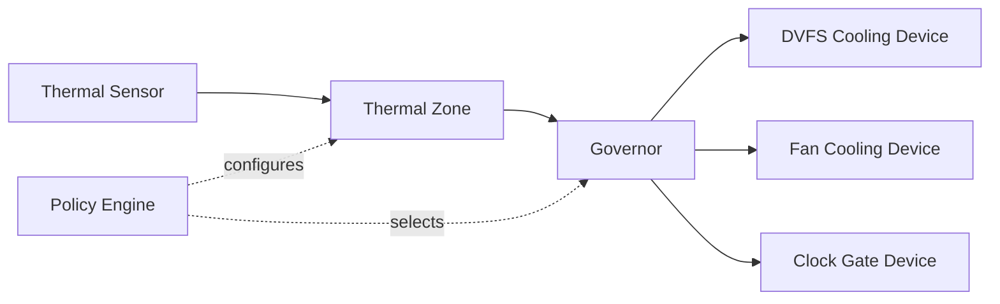

# AIOS Cooling Devices & Governors

Part of: [thermal.md](../thermal.md) — Thermal Management
**Related:** [zones.md](./zones.md) — Thermal zones & sensors, [scheduling.md](./scheduling.md) — Scheduler integration

---

## §4 Cooling Devices

Cooling devices are the actuators of the thermal subsystem. Where thermal zones and sensors
provide the measurement side, cooling devices provide the response side: the mechanisms by
which the system sheds heat or reduces heat generation. AIOS models cooling devices through
a unified trait abstraction, allowing governors to operate without knowing whether they are
adjusting a CPU frequency, spinning a fan, or cutting power to a GPU domain.

### §4.1 CoolingDevice Trait

The `CoolingDevice` trait defines the unified cooling abstraction, inspired by the Linux
`thermal_cooling_device` interface. Every controllable heat-reduction mechanism in AIOS
implements this trait, regardless of hardware implementation.

```rust
pub trait CoolingDevice: Send + Sync {
    /// Human-readable name (e.g., "cpu-dvfs", "chassis-fan", "gpu-clock-gate")
    fn name(&self) -> &str;

    /// Cooling device type
    fn device_type(&self) -> CoolingType;

    /// Maximum cooling state (0 = no cooling, max = maximum cooling effort)
    fn max_state(&self) -> u32;

    /// Current cooling state
    fn cur_state(&self) -> u32;

    /// Set cooling state. Returns error if state > max_state.
    fn set_state(&mut self, state: u32) -> Result<()>;

    /// Power consumption at given state (milliwatts), for IPA governor.
    /// Returns None if power model unavailable.
    fn power_draw_mw(&self, state: u32) -> Option<u32>;

    /// Frequency at given state (MHz), for DVFS devices.
    /// Returns None for non-frequency cooling devices.
    fn frequency_at_state(&self, state: u32) -> Option<u32>;
}

pub enum CoolingType {
    Dvfs,                // CPU/GPU frequency scaling
    Fan { pwm: bool },   // Active cooling (PWM or on/off)
    ClockGate,           // Disable clock domain
    PowerGate,           // Disable power domain
}
```

Cooling devices are registered with the thermal subsystem and bound to one or more thermal
zones during driver probe. Governors observe temperature changes in a zone and respond by
adjusting the cooling states of all devices bound to that zone. The governor does not need
to understand the hardware mechanism — it only adjusts state values and queries power
consumption; the cooling device implementation translates those states into hardware actions.

The `power_draw_mw` method is central to energy-aware governors (see §5.3). When a cooling
device returns `Some(mw)` for each state, the PID governor can distribute a power budget
across multiple devices optimally. Devices that cannot model their power consumption return
`None`, which causes the Policy Engine to fall back to the step-wise governor for their zone.

### §4.2 DVFS Cooling

Dynamic Voltage and Frequency Scaling (DVFS) is the primary and most effective cooling
mechanism for CPU and GPU cores. Reducing operating frequency reduces power consumption
approximately as `P ∝ f × V²`, so a halved frequency combined with reduced voltage can
reduce power to one quarter or less.

DVFS cooling devices model frequency reduction as a monotonic state range:

- State 0 = maximum performance frequency (no thermal throttling applied)
- State N = minimum frequency (maximum thermal cooling effort)
- Intermediate states map to intermediate frequency/voltage operating points (OPPs)

Frequency steps are platform-specific. For the Raspberry Pi 4, the nominal OPP table yields
states 0 through 3 corresponding to 1500, 1000, 750, and 600 MHz respectively.

On platforms where firmware participates in thermal management — notably the Raspberry Pi 4
and Pi 5, where the VideoCore firmware independently monitors and throttles the ARM cores —
the kernel must track the firmware-imposed frequency cap separately from its own cooling
state. The `firmware_cap` field captures this constraint, and `set_state` must never request
a frequency above the firmware cap.

```rust
pub struct DvfsCoolingDevice {
    /// Frequency operating points in MHz, descending (highest to lowest)
    freq_table: &'static [u32],
    current_state: u32,
    /// Firmware-imposed frequency ceiling, if any (MHz)
    firmware_cap: Option<u32>,
}
```

Voltage scaling is coupled to frequency scaling through the OPP table. The DVFS driver is
responsible for coordinating with the voltage regulator to lower voltage when dropping to
lower-frequency OPPs, and for raising voltage before increasing frequency. This sequencing
is mandatory: raising frequency before voltage causes undervolting faults; lowering voltage
before frequency causes the same. The platform-specific DVFS driver (see
[platform-drivers.md](./platform-drivers.md) §8.2) handles this sequencing.

### §4.3 Fan Control

Active cooling via fans is available on platforms with dedicated cooling hardware. AIOS
models fan control as a multi-state cooling device where each state corresponds to a specific
duty cycle or speed setting.

The Raspberry Pi 5 with the official active cooler exposes a 4-speed PWM fan through the
GPIO PWM controller. Apple Silicon platforms expose multi-speed fans through the SMC
(System Management Controller), accessed via the Apple Platform Driver.

```rust
pub struct FanCoolingDevice {
    /// Base address of PWM controller or SMC endpoint identifier
    pwm_address: u64,
    /// Maximum duty cycle value (100 for percentage, 255 for 8-bit PWM)
    max_duty: u32,
    current_duty: u32,
    /// Fan curve: (temp_mdegc threshold, duty_percent) pairs, ascending temperature
    fan_curve: &'static [(i32, u32)],
}
```

The fan curve maps temperature thresholds to duty cycle targets. The thermal governor
consults the curve when translating a cooling state into a duty cycle write. For the
Raspberry Pi 5 active cooler, the default fan curve follows the firmware's reference values
(see [power-management.md](../power-management.md) §6.4):

| Temperature | Fan Duty |
|---|---|
| < 50°C | 0% (off) |
| 50–60°C | 30% |
| 60–70°C | 60% |
| ≥ 75°C | 100% |

Fan state transitions must account for spin-up characteristics: PWM fans may have a minimum
start duty cycle (typically 20–30%) below which they fail to spin from a stopped state. The
`FanCoolingDevice` implementation enforces the minimum start duty when transitioning from
state 0 (off) to any active state, then reduces to the requested duty after the spin-up
interval (typically 500ms).

Acoustic considerations are handled at the fan curve level. Platforms where fan noise is a
user-visible concern should define conservative curves that avoid unnecessary fan activation.
The Intelligent Power Allocation governor (§5.3) can further smooth fan transitions by
spreading power budget across DVFS and fan devices, preferring DVFS reduction over fan
activation when both are bound to the same zone.

### §4.4 Clock & Power Gating

Clock and power gating provide coarser-grained heat reduction for subsystems that can
tolerate a period of inactivity. These mechanisms are more disruptive than DVFS but can
achieve greater power reduction for subsystems that are genuinely idle.

Clock gating disables the clock signal to a hardware block, preventing any switching
activity and eliminating dynamic power dissipation. The block retains its state but cannot
perform work. This is appropriate for GPU shader cores during non-rendering periods, DSP
blocks between audio frames, or ISP blocks between camera captures.

Power gating cuts power entirely to a domain. The domain loses all state, requiring full
reinitialization on wake. This achieves the greatest power reduction (only static leakage
current remains) at the cost of significant wake latency. Power gating maps directly to
device D-states as defined in [device-model/lifecycle.md](../device-model/lifecycle.md) §7.5:

| D-State | Thermal Effect | Wake Latency |
|---|---|---|
| D0 (Active) | Full heat generation | 0 |
| D1 (Light Sleep) | ~50% heat reduction | < 1ms |
| D2 (Deep Sleep) | ~90% heat reduction | < 10ms |
| D3 (Off) | Zero heat (leakage only) | 50–500ms |

Clock and power gating cooling devices expose these transitions as cooling states. A GPU
clock-gate device with states 0 (full clock), 1 (half clock), 2 (clock off) allows the
governor to apply proportional cooling without committing to full power gating. The governor
progresses through states only as thermal pressure increases, allowing the subsystem to
recover clock rates as temperature falls.

The interaction between thermal-driven gating and AIRS workload scheduling is described in
[scheduling.md](./scheduling.md) §6.3. When the thermal subsystem requests clock or power
gating of a compute domain, the scheduler must not dispatch new work to that domain until
the thermal subsystem grants permission to restore it.

### §4.5 Cooling Device Registration

Cooling device drivers register their devices with the thermal subsystem during the device
probe phase. Registration establishes the binding between a cooling device and the thermal
zone(s) it can affect.

```rust
pub struct CoolingBinding {
    /// Name of the cooling device being registered
    pub device_name: &'static str,
    /// Name of the thermal zone this device is bound to
    pub zone_name: &'static str,
    /// Relative weight for fair-share power allocation in PID governor
    pub contribution_weight: u32,
    /// Minimum cooling state for this binding (governor will not go below this)
    pub min_state: u32,
    /// Maximum cooling state for this binding (governor will not exceed this)
    pub max_state: u32,
}
```

A cooling device may be bound to multiple thermal zones. For example, a CPU DVFS device
is typically bound to both the CPU thermal zone (primary) and the SoC package zone
(secondary, with lower contribution weight). When multiple zones independently drive the
same cooling device, the thermal subsystem applies the most restrictive state requested
by any governor.

The `contribution_weight` field informs the PID governor's power allocation logic (§5.3).
When multiple cooling devices share a power budget, the governor distributes available
power proportional to each device's weight. A CPU core cluster with higher weight receives
more power headroom than a GPU cluster with lower weight, reflecting the default preference
for CPU performance in interactive workloads.

Registration requires the `Capability::ThermalCoolingRegister` capability, ensuring that
only kernel drivers and trusted platform services can add thermal actuators. Unprivileged
agents may observe cooling state through the thermal observability interface but cannot
register or directly control cooling devices.

---

## §5 Thermal Governors

Thermal governors implement the control policy that maps observed temperatures to cooling
device states. AIOS provides three governor implementations — step-wise, PID, and bang-bang
— each suited to different platform capabilities and thermal characteristics.

### §5.1 Governor Architecture

Each thermal zone operates under exactly one active governor. The governor is invoked on
every sensor polling interval with the zone's current temperature reading, and is responsible
for adjusting the cooling states of all devices bound to that zone.

```rust
pub trait ThermalGovernor: Send + Sync {
    /// Governor name for diagnostics and runtime selection
    fn name(&self) -> &str;

    /// Core control loop: adjust cooling devices given the current zone temperature.
    /// Called on every sensor poll cycle.
    fn throttle(
        &mut self,
        zone: &ThermalZone,
        temp_mdegc: i32,
        devices: &mut [&mut dyn CoolingDevice],
    ) -> Result<()>;

    /// Reset governor internal state (integral error, hysteresis flags, etc.).
    /// Called when the governor is selected or when the zone is re-initialized.
    fn reset(&mut self);
}
```

The Policy Engine selects the active governor for each zone during thermal subsystem
initialization, based on the availability of energy model data from the cooling devices
bound to the zone. The selection logic and runtime switching are described in §5.5.

The governor receives the full `ThermalZone` reference (see [zones.md](./zones.md) §3.2),
giving it access to trip points, hysteresis values, and zone metadata in addition to the
current temperature. Governors should not cache zone configuration internally; they should
read it from the zone reference on each invocation to pick up any runtime changes made by
the Policy Engine or a privileged agent.



The Policy Engine acts as the supervisor: it selects which governor is active, can override
governor decisions for system-level power constraints, and receives governor telemetry for
AIRS-driven optimization (see [scheduling.md](./scheduling.md) §6.4).

### §5.2 Step-Wise Governor

The step-wise governor is the simplest production governor and the appropriate default for
platforms without a power model. It operates by comparing the current temperature against
the zone's trip points and adjusting cooling states by one increment per polling cycle.

**Throttling logic:**

- When temperature crosses a trip point from below: increment all bound cooling devices
  by one state (toward maximum cooling)
- When temperature falls below a trip point minus hysteresis: decrement all bound cooling
  devices by one state (toward minimum cooling)
- Only one state transition per polling cycle: prevents abrupt jumps and gives temperature
  time to respond to the cooling change before the next decision

**Hysteresis** is applied exclusively on the cooling reduction side. This asymmetry is
deliberate: the governor responds immediately to temperature increases (no hysteresis on
the way up) but requires the temperature to fall a configurable margin below a trip point
before relaxing cooling. The default hysteresis is 2,000 millidegrees C (2°C), matching
the sensor resolution on most embedded platforms.

Pseudocode for one governor invocation:

```text
function step_wise_throttle(zone, temp, devices):
    target_state = 0
    for each trip in zone.trips (ascending order):
        if temp >= trip.temperature:
            target_state += 1

    for each device in devices:
        current = device.cur_state()
        if target_state > current:
            device.set_state(current + 1)  // one step up per cycle
        elif target_state < current:
            // only relax if temp is below trip - hysteresis
            if temp < (relevant_trip.temperature - zone.hysteresis):
                device.set_state(current - 1)
```

The step-wise governor requires no knowledge of power consumption, making it suitable for
QEMU (where the thermal sensor is virtual and no power model exists) and for simple embedded
platforms where OPP power data is unavailable. Its limitation is responsiveness: reaching
maximum cooling from a cold start requires as many polling cycles as there are cooling
states, which can result in thermal overshoot on platforms with rapid heat generation.

### §5.3 PID Governor (Intelligent Power Allocation)

The PID governor implements a proportional-integral-derivative controller, drawing
inspiration from the Linux `power_allocator` governor. It treats temperature as the
controlled variable and power allocation as the output, distributing a sustainable power
budget among bound cooling devices proportional to their `power_draw_mw` values.

The PID governor requires that at least one cooling device in the zone returns `Some(mw)`
from `power_draw_mw`. Without power model data, the Policy Engine falls back to step-wise.

```rust
pub struct PidGovernor {
    /// Proportional gain when temperature is above target (aggressive correction)
    pub k_po: f32,
    /// Proportional gain when temperature is below target (gentle headroom recovery)
    pub k_pu: f32,
    /// Integral gain for long-term drift compensation
    pub k_i: f32,
    /// Accumulated integral error (clamped to integral_clamp)
    integral: f32,
    /// Symmetric clamp on integral accumulation to prevent windup
    integral_clamp: f32,
    /// Target temperature in millidegrees C
    /// Typically: passive trip point - hysteresis margin
    target_temp_mdegc: i32,
    /// Sustainable power budget in milliwatts
    /// Maximum power the cooling system can dissipate continuously
    sustainable_power_mw: u32,
}
```

**Control loop (one invocation):**

1. Compute error: `error = target_temp_mdegc - current_temp_mdegc`
2. Select proportional gain:
   - If `error > 0` (temperature below target): `P = k_pu × error`
   - If `error ≤ 0` (temperature at or above target): `P = k_po × error`
3. Update integral: `integral = clamp(integral + k_i × error, -integral_clamp, +integral_clamp)`
4. Compute granted power: `granted_mw = sustainable_power_mw + P + integral`
   - Clamped to range `[0, sum of all devices' max power]`
5. Distribute `granted_mw` among bound cooling devices proportional to their
   `power_draw_mw(state=0)` (maximum power) values, weighted by `contribution_weight`
6. For each device: find the highest state (most cooling) where `power_draw_mw(state) ≤ allocated_mw`

Using asymmetric gains (`k_po > k_pu`) is key to stability. When the system is above the
target temperature, a large proportional gain causes swift, aggressive cooling reduction.
When below target, a small gain allows frequency to recover gradually, preventing oscillation
where the system alternates between hot-and-throttled and cool-and-unthrottled.

The integral term compensates for steady-state drift. Without it, a constant modest heat
source might hold the temperature slightly above target indefinitely (proportional error
alone would not accumulate enough correction). The integral_clamp prevents windup in
scenarios where the error is large and sustained (e.g., extended heavy workloads).

Default tuning parameters and their rationale:

| Parameter | Value | Rationale |
|---|---|---|
| k_po | 20.0 | Aggressive above-target correction; overshoot is costly |
| k_pu | 5.0 | Gentle below-target recovery; avoid oscillation |
| k_i | 0.5 | Slow drift compensation; fast integral causes instability |
| integral_clamp | ±50,000 | Bounds integral at ~50°C × 1000 millidegrees scale |
| target_temp_mdegc | passive_trip − 5,000 | 5°C below passive trip as working target |

These defaults are starting points. Platform tuning should adjust `k_po` and `k_pu` based
on the thermal mass of the SoC package: heavy thermal mass (Pi 4 with heatsink) tolerates
lower `k_po`; light thermal mass (bare SoC) requires higher `k_po` to prevent overshoot.

The PID governor produces smooth frequency transitions compared to step-wise, which is
especially important for interactive workloads where abrupt DVFS changes are visible as
performance stutter. The integral term's slow accumulation means the governor tends to hold
a stable operating point rather than hunting between states.

### §5.4 Bang-Bang Governor

The bang-bang governor implements simple on/off hysteresis control. It is appropriate only
for binary cooling devices — fans without PWM control, or other actuators that have no
intermediate states.

```rust
pub struct BangBangGovernor {
    /// Temperature (millidegrees C) at which cooling activates
    pub upper_threshold_mdegc: i32,
    /// Hysteresis margin (millidegrees C); cooling deactivates below
    /// (upper_threshold_mdegc - hysteresis_mdegc)
    pub hysteresis_mdegc: i32,
    /// Current on/off state
    active: bool,
}
```

**Control logic:**

- If `temp ≥ upper_threshold_mdegc` and not active: activate (set device to max_state)
- If `temp ≤ upper_threshold_mdegc - hysteresis_mdegc` and active: deactivate (set device to 0)
- Otherwise: no change (hysteresis band maintains current state)

The hysteresis band is essential. Without it, a fan at the exact threshold temperature
would oscillate on and off every polling cycle, causing wear and acoustic annoyance. A
hysteresis of 5,000 millidegrees C (5°C) is the recommended default; platforms with
fast-responding sensors or thin thermal margins may reduce this to 2,000 millidegrees C.

Bang-bang is only assigned to fan-only zones or to zones where the bound cooling devices
are exclusively binary. The Policy Engine (§5.5) identifies binary-only zones during
initialization by checking that all bound devices have `max_state == 1`.

For the Raspberry Pi 5 with both a DVFS cooling device and an on/off fan, the thermal
subsystem creates two separate zones or binds the fan with bang-bang as a supplementary
governor and uses PID as the primary zone governor. The fan activates at its own threshold
independently of the PID-controlled DVFS device.

### §5.5 Governor Selection & Runtime Switching

The Policy Engine selects the initial governor for each thermal zone during thermal
subsystem initialization, after all cooling devices have been registered. The selection
algorithm:

1. Collect all cooling devices bound to the zone
2. If all devices have `max_state == 1` (binary only): assign bang-bang governor
3. Else if any device returns `Some(mw)` from `power_draw_mw`: assign PID governor
4. Otherwise: assign step-wise governor

This logic ensures that platforms with rich energy models benefit from PID control
automatically, without requiring per-platform governor configuration.

Runtime governor switching is permitted for privileged agents holding
`Capability::ThermalGovernorSelect`. Switching resets the new governor's internal state
by calling `reset()` before the first `throttle()` invocation. The current cooling states
of bound devices are preserved across the switch; the new governor begins from the current
hardware state rather than driving to zero.

Recommended governor assignments by platform and zone:

| Platform | Zone | Governor | Rationale |
|---|---|---|---|
| QEMU | cpu | step-wise | Virtual sensor; no energy model available |
| Pi 4 | cpu | PID | VideoCore firmware exposes OPP power data |
| Pi 5 | cpu | PID | ARM subsystem energy model from firmware |
| Pi 5 | gpu | PID | VideoCore energy model available |
| Pi 5 | fan | bang-bang | Official active cooler is binary (Pi 5 base) |
| Pi 5 (cooler) | fan | step-wise | Active cooler with 4-speed PWM fan |
| Apple M-series | cpu | PID | Detailed per-cluster SMC energy data |
| Apple M-series | gpu | PID | GPU power reported via SMC per domain |
| Apple M-series | npu | PID | ANE power model from SMC |

For runtime tuning of PID governor parameters — particularly `sustainable_power_mw` and
the target temperature — the Policy Engine exposes a configuration interface to AIRS. This
allows the AI runtime to adjust thermal headroom dynamically based on predicted workload
duration and ambient temperature trends. The AIRS interaction is described in
[scheduling.md](./scheduling.md) §6.4 and in the context of future governor extensions in
[power-management.md](../power-management.md) §14.2.

Governor telemetry — including the PID governor's current integral error, granted power
budget, and per-device state assignments — is published to the kernel observability
subsystem (see [zones.md](./zones.md) §3.2 for the thermal state schema). This telemetry
is consumed by AIRS for predictive throttling decisions and exposed to privileged agents
through the thermal audit interface.
