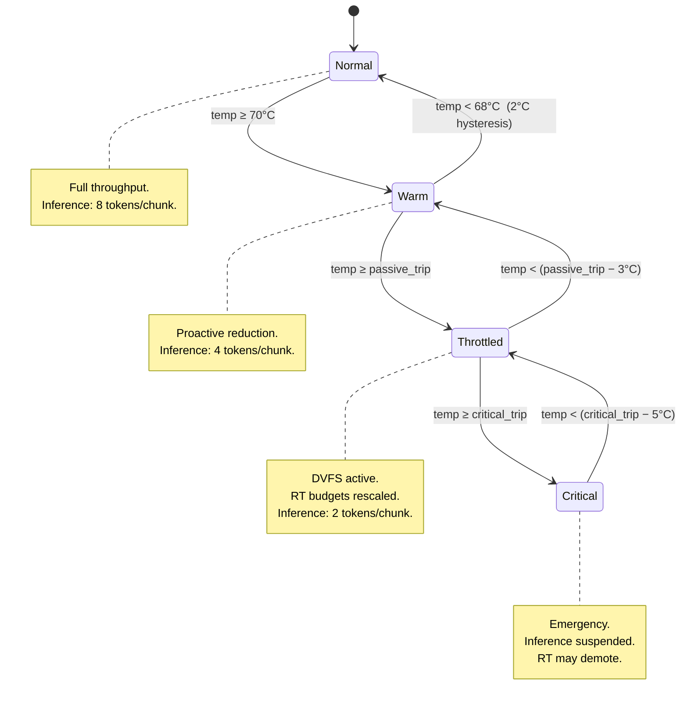
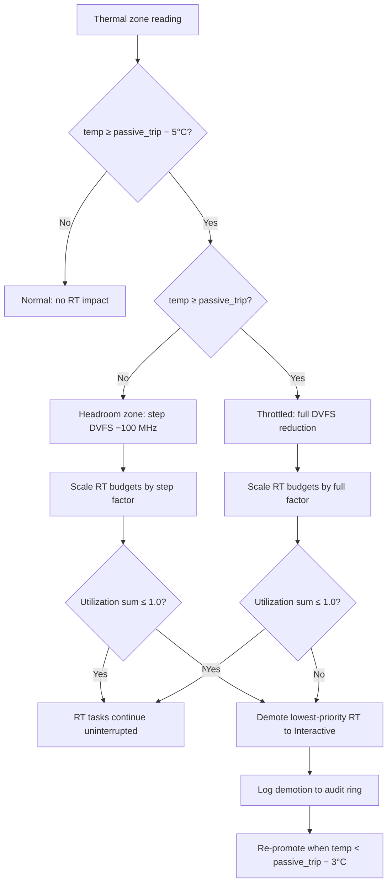

# AIOS Thermal-Aware Scheduling

Part of: [thermal.md](../thermal.md) — Thermal Management
**Related:** [zones.md](./zones.md) — Thermal zones & sensors, [cooling.md](./cooling.md) — Cooling devices & governors

---

## §6 Scheduler–Thermal Integration

The scheduler does not read thermal sensors directly. All thermal state transitions flow through the
Policy Engine (see [power-management.md](../power-management.md) §5), which translates raw zone
readings into scheduler-visible state changes. This separation ensures the scheduler hot path never
blocks on sensor I/O, and that thermal policy decisions are made in a single authoritative location.

### §6.1 ThermalState Enum

The `ThermalState` enum is the canonical representation of chip thermal condition as seen by the
scheduler. It is derived by the Policy Engine from zone readings (see [zones.md](./zones.md) §3)
and communicated via `PowerToSchedulerMsg::ThermalStateChange`.

```rust
/// Thermal state as seen by the AIOS scheduler.
/// Temperatures are illustrative; exact trip points are zone-specific.
pub enum ThermalState {
    /// < 70_000 m°C: all systems nominal, no restrictions.
    Normal,

    /// 70_000 m°C to passive trip: proactive reduction begins.
    /// Inference chunk size halved; idle inserted between chunks.
    Warm,

    /// ≥ Passive trip point: firmware or kernel DVFS governor is actively
    /// reducing CPU frequency. RT WCET budgets must be rescaled.
    Throttled { max_freq_mhz: u32 },

    /// ≥ Critical trip point: emergency state.
    /// All inference suspended; RT tasks may be temporarily demoted.
    Critical,
}
```

State transitions follow hysteresis thresholds to prevent oscillation. The diagram below shows
valid transitions and the temperature thresholds that trigger them.



The Policy Engine sends `PowerToSchedulerMsg::ThermalStateChange(new_state)` on every valid
transition. The scheduler processes this message on its next wake-up, updating all per-CPU
atomics atomically before the next scheduling decision. The scheduler never reads sensors
directly; the only input is the message channel from the Policy Engine.

### §6.2 Per-CPU Thermal State Tracking

Each CPU run queue maintains thermal state through a set of atomics embedded in `PerCpuScheduler`.
Atomic types allow the scheduler hot path to read these fields without taking any lock.

```rust
pub struct PerCpuScheduler {
    // ... existing fields (run queues, idle thread, etc.) ...

    /// False when thermal state is Warm or Critical.
    /// When false, the idle thread is ineligible for de-scheduling;
    /// the CPU is forced to idle to shed heat.
    idle_enabled: AtomicBool,

    /// Token budget per inference chunk.
    /// Set to 8 / 4 / 2 / 0 for Normal / Warm / Throttled / Critical.
    inference_chunk_modifier: AtomicU32,

    /// Scale factor applied to RT WCET budgets under frequency throttling.
    /// 1.0 when ThermalState is Normal or Warm; > 1.0 when Throttled.
    /// Represented as a fixed-point u32 (Q16.16) to avoid f32 in hot path.
    rt_wcet_scale_q16: AtomicU32,

    /// Weight applied to inference thread priority under thermal pressure.
    /// Combined with memory pressure weight via min() before use.
    /// Represented as a fixed-point u32 (Q16.16): 1.0 = 0x00010000.
    thermal_pressure_weight_q16: AtomicU32,
}
```

Writes to these atomics happen only on `ThermalStateChange` events, which are rare (seconds apart
at minimum due to hysteresis). Reads happen on every scheduling decision. The asymmetry justifies
`Relaxed` stores paired with `Acquire` loads — the message-channel receive provides the required
ordering fence before the store, and the scheduler loop provides the ordering fence before the load.

When the Policy Engine delivers `ThermalStateChange`, the scheduler iterates all CPU run queues and
updates their atomics before releasing the scheduler lock. This ensures a consistent global view
within a single scheduling epoch.

### §6.3 WCET Scaling Under Frequency Throttling

When firmware reduces CPU frequency via DVFS in response to a Passive trip, real-time task WCET
(Worst-Case Execution Time) budgets expressed in wall-clock nanoseconds become incorrect: the same
number of instructions takes proportionally longer at a lower frequency.

The scheduler adjusts WCET budgets using the following formula:

```rust
/// Scale a WCET budget (nanoseconds) from base frequency to throttled frequency.
///
/// # Arguments
/// * `base_budget_ns` — original budget measured at `base_freq_mhz`
/// * `base_freq_mhz` — the CPU's unthrottled frequency (e.g., 2400 for Apple M2)
/// * `throttled_freq_mhz` — the current reduced frequency from ThermalState::Throttled
///
/// Returns the adjusted budget in nanoseconds. Always >= base_budget_ns.
fn scale_wcet(base_budget_ns: u64, base_freq_mhz: u32, throttled_freq_mhz: u32) -> u64 {
    // SAFETY: both frequencies are > 0 by construction (Policy Engine validates).
    // Integer division truncates; the +1 ensures we do not underestimate the budget.
    (base_budget_ns * base_freq_mhz as u64 + throttled_freq_mhz as u64 - 1)
        / throttled_freq_mhz as u64
}
```

Concrete example for the compositor RT task:

| Parameter | Value |
|---|---|
| Base budget | 4 ms at 2400 MHz |
| Throttled frequency | 1500 MHz |
| Scale factor | 2400 / 1500 = 1.6 |
| Scaled budget | 6.4 ms |

After scaling, the scheduler re-runs the RT utilization admission test across all RT tasks. If the
sum of scaled utilizations exceeds 1.0 on any CPU, the lowest-priority RT task on that CPU is
temporarily demoted to the Interactive class. It is re-promoted when the thermal state returns to
Normal or Warm and the original budgets pass the admission test without demotion.

Reference: [scheduler.md](../../kernel/scheduler.md) §8.4 for the full WCET scaling and admission
re-test implementation, including priority demotion and re-promotion bookkeeping.

### §6.4 Inference Chunk Modifiers

AI inference token generation is computationally dense and a significant heat source. The scheduler
controls inference thread throughput by limiting how many tokens an inference task may generate per
scheduling slice before yielding. This is the inference chunk modifier.

| ThermalState | Chunk Size (tokens) | Rationale |
|---|---|---|
| Normal | 8 | Full throughput; heat is within sustainable bounds |
| Warm | 4 | Proactive reduction before trip points are reached |
| Throttled | 2 | Minimum useful inference; preserves responsiveness |
| Critical | 0 (suspended) | All inference paused; emergency heat reduction |

Inference threads cooperate with this mechanism by calling `thermal_yield_point()` after each
chunk. In Critical state, this call blocks the thread unconditionally until the state returns to
Throttled or better.

```rust
/// Called by inference threads after completing one token-generation chunk.
/// Blocks in Critical state; returns immediately otherwise.
pub fn thermal_yield_point(cpu_id: CpuId) {
    let chunk_mod = PER_CPU_SCHEDULERS[cpu_id.index()]
        .inference_chunk_modifier
        .load(Ordering::Acquire);

    if chunk_mod == 0 {
        // Critical state: suspend until thermal recovery.
        // The scheduler will unblock this thread on the next
        // ThermalStateChange to Throttled or better.
        block_current_thread(BlockReason::ThermalCritical);
    }
    // Non-zero: yield to allow other threads to run, then return.
    schedule();
}
```

The chunk modifier of 0 in Critical state is a hard suspension, not a rate limit. Inference threads
are re-queued by the scheduler when the Policy Engine delivers `ThermalStateChange(Throttled { .. })`
or better.

### §6.5 Thermal Pressure Weight Reconciliation

Two independent pressure signals can reduce inference thread scheduling weight: memory pressure
(from the memory subsystem) and thermal pressure. Both are expressed as weights in [0.0, 1.0],
where 1.0 means no restriction and 0.0 means fully suppressed. The effective scheduling weight for
an inference thread is the minimum of both signals — the most restrictive wins.

```rust
/// Compute the effective inference scheduling weight.
/// Both inputs are Q16.16 fixed-point values; 0x00010000 = 1.0.
fn reconcile_inference_weight(
    mem_pressure_weight_q16: u32,
    thermal_pressure_weight_q16: u32,
) -> u32 {
    mem_pressure_weight_q16.min(thermal_pressure_weight_q16)
}
```

Thermal pressure weights by state:

| ThermalState | `thermal_pressure_weight` (float view) | Q16.16 value |
|---|---|---|
| Normal | 1.0 | `0x00010000` |
| Warm | 0.5 | `0x00008000` |
| Throttled | 0.25 | `0x00004000` |
| Critical | 0.0 | `0x00000000` |

The reconciled weight scales the time quantum allocated to inference threads relative to Normal
class threads. A weight of 0.5 means an inference thread receives half the CPU time it would at
full weight.

Reference: [scheduler.md](../../kernel/scheduler.md) §8.3 for memory pressure weight derivation,
and §8.4 for how the reconciled weight feeds into the Normal-class time quantum calculation.

---

## §7 Advanced Thermal Scheduling

### §7.1 Thermal-Aware Load Balancing

The scheduler's periodic load balancer (every 4 timer ticks, approximately 4 ms at 1 kHz) normally
migrates threads from overloaded CPUs to underloaded ones based on run queue length. Under thermal
asymmetry — where individual cores differ in temperature — the balancer additionally migrates
threads from hot cores to cool cores to equalize thermal load across the chip.

Per-core temperature readings are obtained from thermal zones tagged with the relevant CPU affinity
(see [zones.md](./zones.md) §3.2 for zone–CPU affinity tagging). The load balancer reads these
values from the zone cache, which is updated by the monitoring loop without holding the scheduler
lock.

Migration rules under thermal load balancing:

- The thermal migration threshold is a 10°C (10_000 m°C) difference between the hottest core (H)
  and the coolest core (C).
- Only Normal and Idle class threads are eligible for thermal migration. RT and Interactive threads
  are never migrated for thermal reasons; their latency guarantees take precedence.
- At most one thread is migrated per load-balance tick to prevent thermal oscillation.
- A thread that was thermally migrated has a 100 ms cooldown before it is eligible for another
  thermal migration, preventing ping-pong between cores.

Algorithm executed on each load-balance tick:

1. Read per-core temperature from zone cache; identify hottest core H and coolest core C.
2. If `temp[H] - temp[C] <= 10_000 m°C`: no thermal migration needed, continue normal balancing.
3. Walk the Normal-class run queue of H; find the first thread without a thermal migration cooldown.
4. If found: remove from H's run queue, enqueue on C's run queue, record migration timestamp, set
   cooldown.
5. Emit audit log entry: `ThermalMigration { from_cpu: H, to_cpu: C, thread_id, delta_temp_mdegc }`.

```rust
pub struct ThermalMigrationRecord {
    pub thread_id: ThreadId,
    pub from_cpu: CpuId,
    pub to_cpu: CpuId,
    pub delta_temp_mdegc: i32,
    pub timestamp_ticks: u64,
}
```

Thermal migration events are logged to the per-CPU audit ring (256 entries) with reason
`"thermal_balance"` to allow offline analysis of thermal asymmetry patterns.

### §7.2 Dark Silicon Power Budgeting

On modern SoCs, the thermal design power (TDP) constrains how many cores can simultaneously run at
maximum frequency. As more cores become active, each core's sustainable power budget decreases.
This is the dark silicon problem: at peak utilization, portions of the chip must be clock-gated or
frequency-capped to remain within thermal limits.

AIOS models this with a per-platform `ThermalPowerBudget` structure:

```rust
/// Per-platform thermal power budget model.
/// All power values in milliwatts.
pub struct ThermalPowerBudget {
    /// Total chip TDP: maximum sustained power dissipation (mW).
    pub total_sustainable_mw: u32,

    /// Static power always consumed regardless of active core count (mW).
    /// Includes memory controllers, interconnects, always-on peripherals.
    pub static_power_mw: u32,

    /// Returns the per-core power budget given the number of currently active cores.
    /// Implementations typically use a lookup table derived from vendor datasheets.
    pub per_core_budget_mw: fn(active_cores: u32) -> u32,
}
```

Example budget table for Raspberry Pi 4 (BCM2711, ~5 W TDP, 1000 mW static overhead):

| Active Cores | Per-Core Budget (mW) | Total Dynamic (mW) | Total with Static |
|---|---|---|---|
| 1 | 3500 | 3500 | 4500 |
| 2 | 2000 | 4000 | 5000 |
| 3 | 1500 | 4500 | 5500 |
| 4 | 1200 | 4800 | 5800 |

Note that the 4-core total (5800 mW) exceeds the 5000 mW TDP: the Pi 4 relies on burst capacity
and passive heatsinking for transient loads. The governor enforces frequency caps before sustained
loads exceed the TDP.

When a core's measured power consumption (estimated from performance counters, if available, or
from a simplified `active_freq^3` model) exceeds its per-core budget, the CPUFREQ governor reduces
its frequency before the Passive trip point is reached. This pre-emptive reduction is preferable to
reactive throttling because it avoids the latency of a thermal state transition.

The `ThermalPowerBudget` is initialized from DTB properties or platform-specific hardcoded tables
during early boot, before the CPUFREQ governor starts. Reference:
[cooling.md](./cooling.md) §4 for governor integration with the power budget model.

### §7.3 Real-Time Guarantees Under Thermal Constraints

Thermal throttling introduces a fundamental tension with real-time scheduling: classical RT analysis
assumes constant CPU frequency, but DVFS violates this assumption. AIOS addresses this with a
three-tier approach that preserves RT guarantees as long as the chip remains below the Passive trip
point, and degrades gracefully above it.

**Tier 1 — Budget Scaling** (§6.3): When `ThermalState::Throttled` is entered, RT task WCET
budgets are immediately scaled by the frequency reduction factor. This ensures that schedulability
analysis remains valid at the new frequency.

**Tier 2 — Admission Re-Test**: After scaling, the scheduler re-runs the RT utilization admission
test. If the sum of utilizations on any CPU exceeds 1.0, the lowest-priority RT task on that CPU
is demoted to Interactive until the thermal state recovers.

**Tier 3 — Headroom Reservation**: The Policy Engine reserves a 5°C (5_000 m°C) margin below the
Passive trip point as an RT thermal headroom zone. Within this band, the governor reduces frequency
gradually in steps of 100 MHz, allowing budgets to scale incrementally rather than in a single
large jump. This reduces the probability that a full admission re-test and demotion cycle is
triggered.

The following diagram shows the interaction between thermal state and RT admission:



The demotion record includes the demoted thread's original class, deadline, and the thermal state
at demotion time, so the re-promotion logic can restore the correct RT parameters without requiring
the application to re-register its RT constraints.

### §7.4 Core-Idling for Thermal Regulation

DVFS reduces frequency uniformly across all active cores, which is suboptimal when the workload
is not fully parallel: a single-threaded application running at reduced frequency is slower than
it would be if fewer cores ran at full frequency. Core-idling selectively parks cores to concentrate
compute on a smaller number of full-speed cores, reducing aggregate heat while maintaining per-core
performance for non-parallel workloads.

This approach is modeled on Isci et al. (RTSS 2021, "Thermal-Aware Real-Time Scheduling via
Core-Idling") adapted for AIOS's scheduler architecture.

```rust
/// Control-theoretic core-idling controller.
pub struct CoreIdlingController {
    /// Thermal resistance of each core (°C per watt).
    /// Higher resistance means a core heats up faster per watt consumed.
    /// Populated from DTB thermal topology or platform defaults.
    thermal_resistance: [f32; MAX_CORES],

    /// Target die temperature in millidegrees Celsius.
    /// Set to (passive_trip − headroom_mdegc) by the Policy Engine.
    target_temp_mdegc: i32,

    /// Hysteresis band in millidegrees Celsius.
    /// A core is not re-activated until predicted temp < target − hysteresis.
    hysteresis_mdegc: i32,

    /// Bitmask of currently active cores (1 = active, 0 = idled by thermal).
    active_mask: AtomicU64,
}
```

Decision logic, executed by the Policy Engine on each monitoring interval:

1. Compute total active power: sum the estimated power of all active cores based on their current
   frequency and utilization.
2. Compute predicted die temperature:
   `predicted = ambient_mdegc + (total_power_mw * max_thermal_resistance / 1000)`.
3. If `predicted > target_temp_mdegc`: identify the active core with the highest
   `thermal_resistance`; idle it by setting its bit in `active_mask` to 0 and sending
   `PowerToSchedulerMsg::CoreIdle(cpu_id)` to the scheduler.
4. If `predicted < target_temp_mdegc - hysteresis_mdegc`: identify the most recently idled
   core; re-activate it by setting its bit in `active_mask` to 1 and sending
   `PowerToSchedulerMsg::CoreWake(cpu_id)`.
5. Log the action to the audit ring with predicted temperature and reason.

The scheduler responds to `CoreIdle(cpu_id)` by migrating all threads from the targeted CPU's run
queue to the remaining active CPUs (using the normal load-balancing migration path), then parking
the idle thread on that CPU. It responds to `CoreWake(cpu_id)` by marking that CPU eligible for
load balancing again, allowing threads to migrate back naturally.

Core-idling and DVFS are complementary: when the system is under light load (one or two active
threads), core-idling parks unused cores and lets the active cores run at full speed. When all
cores are busy, DVFS reduces frequency across all of them. The Policy Engine selects the
appropriate mechanism based on the ratio of active threads to available cores:

| Condition | Mechanism | Rationale |
|---|---|---|
| Active threads ≤ active cores / 2 | Core-idling | Concentrate compute on fewer full-speed cores |
| Active threads > active cores / 2 | DVFS | All cores needed; reduce frequency uniformly |
| Both over budget | Core-idling then DVFS | Idle first, then reduce remaining cores |

Reference: [scheduler.md](../../kernel/scheduler.md) §16 for load balancer integration points
used during core-idle-triggered thread migration, and §16.5 specifically for the migration path
invoked by `PowerToSchedulerMsg::CoreIdle`.
