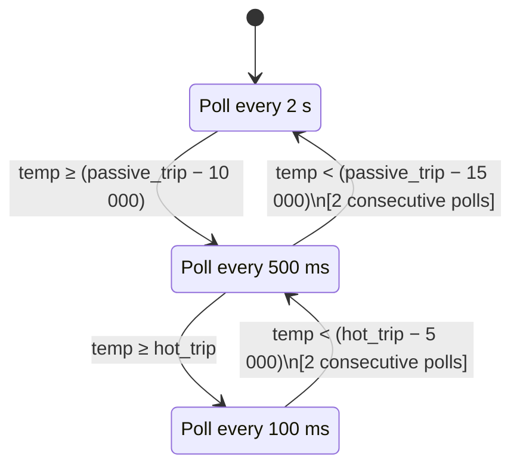
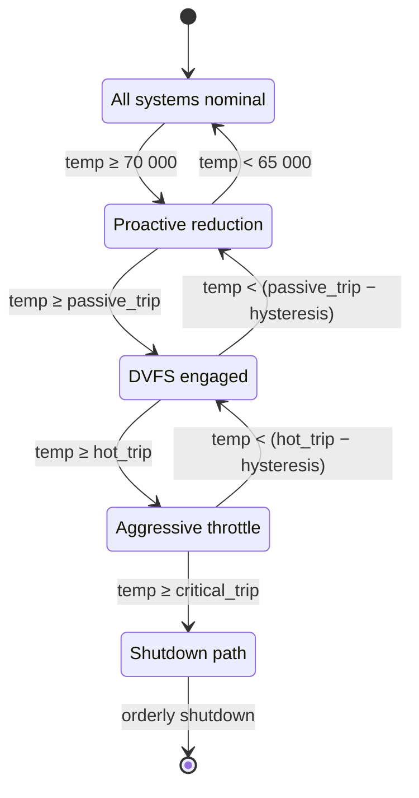

# AIOS Thermal Zones & Sensors

Part of: [thermal.md](../thermal.md) — Thermal Management
**Related:** [cooling.md](./cooling.md) — Cooling devices & governors, [platform-drivers.md](./platform-drivers.md) — Per-platform sensor drivers

---

## §2 Thermal Zone Abstraction

### §2.1 ThermalZone Structure

A thermal zone is the fundamental unit of thermal monitoring in AIOS. Each zone
represents a single monitorable thermal domain — a CPU cluster, a GPU, a SoC
aggregate — and binds together a sensor, a set of trip points, and optional
coupling relationships to adjacent zones.

```rust
pub struct ThermalZone {
    pub name: &'static str,           // "cpu", "gpu", "npu", "soc"
    pub sensor_address: u64,          // MMIO base or SMC key address
    pub zone_type: ThermalZoneType,
    pub polling_interval: Duration,   // interval in normal thermal state
    pub trip_points: &'static [ThermalTripPoint],
    pub coupling: Option<&'static [ThermalCoupling]>,
}

pub enum ThermalZoneType {
    Cpu,
    Gpu,
    Npu,
    Soc,                    // System-on-chip aggregate (package sensor)
    Storage,
    Custom(&'static str),
}
```

Each zone owns exactly one sensor. Zones with multiple physical sensors (for
example, per-cluster readings on a big.LITTLE CPU) aggregate those readings at
the driver layer before they reach the zone abstraction. The zone therefore
always presents a single temperature value to the thermal management core.

The `sensor_address` field is interpreted by the per-platform sensor driver. For
MMIO sensors it is the register base address; for SMC sensors on Apple Silicon
it is the four-byte SMC key packed into a `u64`.

**References:** `hal.md §17` defines the `PlatformThermal` trait that sensor
drivers implement; `power-management.md §4.2` defines the `ThermalZoneReading`
type returned by sensor reads.

### §2.2 Temperature Representation

All temperatures throughout the AIOS thermal stack are represented as `i32`
values in millidegrees Celsius (mdegC). This convention applies uniformly to
sensor readings, trip point thresholds, hysteresis offsets, and coupling
computations.

- 80°C = 80_000 mdegC
- -10°C = -10_000 mdegC
- 0°C = 0 mdegC

Using a signed integer representation is deliberate. Embedded deployments in
server rooms, outdoor enclosures, and cold-start scenarios may present sensor
readings below 0°C. Signing the integer avoids a special-case representation for
sub-zero temperatures.

Millidegree precision eliminates rounding error that would accumulate if integer
degrees were used in EMA filtering and coupling coefficient arithmetic. Raw
sensor hardware typically provides 0.25°C or 0.5°C resolution; retaining the
full sub-degree value avoids precision loss when averaging multiple readings.

Conversion helpers for display and logging purposes:

```rust
#[inline]
pub fn mdegc_to_degc(t: i32) -> f32 {
    t as f32 / 1000.0
}

#[inline]
pub fn degc_to_mdegc(t: f32) -> i32 {
    (t * 1000.0) as i32
}
```

These helpers are display-only. All internal thermal logic operates exclusively
on `i32` mdegC values to avoid floating-point in hot paths and to keep behavior
deterministic across platforms.

### §2.3 Sensor Types

AIOS supports four sensor access methods, selected at platform initialization
based on the detected hardware.

| Sensor Type    | Access Method                    | Platforms           | Latency      |
|----------------|----------------------------------|---------------------|--------------|
| On-die TSENS   | MMIO register read               | Pi 4, Pi 5          | < 1 μs       |
| SMC coprocessor | SMC mailbox RPC                 | Apple Silicon       | 10–50 μs     |
| SCMI firmware  | SCMI sensor protocol (0x15)      | ARM reference (FVP) | 5–20 μs      |
| Virtual        | Software-emulated counter        | QEMU virt           | < 1 μs       |

**On-die TSENS** sensors expose a temperature-to-digital-converter result as a
read-only MMIO register. On the Raspberry Pi 4 and Pi 5, the BCM2711/BCM2712
TSENS result register is polled directly. The driver reads the raw ADC code and
applies a factory-calibrated linear conversion to produce an mdegC value.

**SMC coprocessor** access on Apple Silicon routes temperature sensor reads
through the System Management Controller via a mailbox protocol. The SMC
presents named keys (four-byte ASCII identifiers) mapped to sensor values. The
higher latency (10–50 μs) means SMC reads must be performed on a background
thermal polling thread and must not block the scheduler hot path.

**SCMI firmware** access uses the System Control and Management Interface
sensor protocol (message type 0x15, `SENSOR_READING_GET`). This is the
canonical access method on ARM reference platforms and is expected to be the
primary interface for future SoC support. The latency depends on firmware
implementation quality and secure-world IPC overhead.

**Virtual** sensors on QEMU use a monotonically increasing software counter
that advances with simulated workload. This provides a deterministic baseline
for thermal stack testing without requiring physical hardware.

**Reference:** `platform-drivers.md §8` provides per-platform sensor driver
implementation details including register offsets, ADC conversion formulas,
and SMC key tables.

### §2.4 Polling vs Interrupt-Driven

Thermal sensors may be monitored in one of three modes, selected based on
hardware capability and current thermal state.

**Polling mode** samples the sensor at a configurable interval. The interval
is state-dependent:

- Normal state: 2 s
- Elevated state (zone approaching a trip): 500 ms
- Emergency state (zone at or above a hot trip): 100 ms

**Interrupt-driven mode** relies on hardware threshold registers. When the
sensor reading crosses a programmed threshold, the hardware asserts an IRQ.
This is available on select platforms (Apple Silicon PMU, BCM2712 on Pi 5 with
active cooler configuration). Interrupt-driven monitoring is used as a
complement to polling in emergency scenarios to guarantee sub-millisecond trip
detection.

**Hybrid mode** (default) uses polling for routine monitoring and arms an
interrupt threshold at the `Hot` trip point. Polling handles `Passive` and
`Active` trip detection; the interrupt catches runaway heating that polling
might miss between intervals.

The polling interval escalation follows a state machine with hysteresis to
prevent thrashing. A zone must sustain a reading 5°C (5_000 mdegC) below the
transition threshold for two consecutive polls before the interval de-escalates.



### §2.5 Sensor Filtering & Calibration

Raw sensor readings contain noise from ADC quantization, electromagnetic
interference, and thermal gradients within the sensor substrate. The thermal
subsystem applies a two-stage filter before any trip-point comparison.

**Spike rejection** is the first stage. A reading that differs from the
previous accepted value by more than 10_000 mdegC (10°C) in a single poll
interval is treated as a transient spike and discarded. The previous accepted
value is retained for that poll cycle. Consecutive spikes within a 500 ms
window trigger a sensor health warning rather than continuing to discard.

**Exponential Moving Average (EMA)** is the second stage. The smoothing factor
α is state-dependent to balance stability against responsiveness:

```rust
pub fn ema_filter(raw: i32, prev_filtered: i32, alpha_scaled: i32) -> i32 {
    // alpha_scaled is α × 1000 to avoid floating-point in hot path
    // Normal mode: alpha_scaled = 300  (α = 0.3)
    // Emergency:   alpha_scaled = 700  (α = 0.7)
    let a = alpha_scaled;
    let b = 1000 - a;
    (a * raw + b * prev_filtered) / 1000
}
```

In normal mode (α = 0.3), the filter strongly attenuates noise at the cost of
a ~3-sample lag before a genuine temperature rise is reflected in the output.
In emergency mode (α = 0.7), the filter weights recent samples more heavily,
reducing lag at the cost of slightly more noise pass-through.

**Calibration offsets** are applied before EMA filtering. Each platform's
device tree encodes a per-zone factory calibration offset in mdegC. The offset
corrects for sensor-to-sensor process variation:

```text
calibrated_mdegc = raw_mdegc + zone_calibration_offset_mdegc
```

On Raspberry Pi 4 and Pi 5, the calibration offset is stored in the
OTP fuses and extracted by the firmware into the device tree blob before
handing off to the UEFI stub. On Apple Silicon, the SMC firmware applies
calibration internally, and the reported value is already corrected.

**Sensor health monitoring** runs as a background check on each poll. If a
zone's calibrated, filtered reading has not changed by more than 500 mdegC
(0.5°C) across 10 consecutive polls, the sensor is flagged as potentially
stuck. A stuck sensor triggers a kernel warning log entry and activates
**thermal safe mode**: all zones governed by the failed sensor are treated as
if they are at their `Hot` trip point until the sensor resumes reporting varied
values or the system reboots.

---

## §3 Trip Points

### §3.1 Trip Point Types

Trip points define the temperature thresholds at which the thermal manager
escalates its response. Each trip point carries the threshold temperature, the
action type, and a hysteresis offset used for de-escalation.

```rust
pub struct ThermalTripPoint {
    pub temp_mdegc: i32,        // threshold in millidegrees Celsius
    pub trip_type: ThermalTripType,
    pub hysteresis_mdegc: i32,  // must drop this far below temp to clear
}

pub enum ThermalTripType {
    Passive,    // Reduce frequency (DVFS), throttle background work
    Active,     // Enable active cooling device (fan spin-up)
    Hot,        // Aggressive throttling, suspend non-critical scheduler classes
    Critical,   // Emergency: initiate orderly shutdown; non-overridable
}
```

`Passive` is the first line of response. It signals the scheduler and DVFS
governor to reduce CPU and GPU operating frequencies. Background work items
(Normal scheduler class) may be deferred but are not suspended. Inference
chunk scheduling is reduced.

`Active` is only meaningful on platforms with a controllable cooling device
(for example, a PWM fan). It instructs the cooling governor to increase fan
speed. On passively cooled platforms this trip type is omitted.

`Hot` triggers aggressive thermal response. The Normal scheduler class is
suspended. The DVFS governor applies its most conservative frequency cap.
Inference scheduling drops to minimum.

`Critical` initiates an orderly system shutdown. This response is
non-overridable by user space or privileged processes. The kernel logs the
thermal event to persistent storage, then proceeds through the standard
shutdown path. The trip is designed to fire before hardware self-protection
circuits (which would produce an unclean reset).

Default trip point values per platform:

| Platform        | Passive   | Active | Hot       | Critical  |
|-----------------|-----------|--------|-----------|-----------|
| QEMU (cpu)      | 80_000    | —      | —         | 95_000    |
| Pi 4 (cpu)      | 80_000    | —      | —         | 85_000    |
| Pi 5 (cpu)      | 80_000    | —      | —         | 85_000    |
| Pi 5 (gpu)      | 75_000    | —      | —         | 85_000    |
| Pi 5 (cpu+fan)  | 80_000    | 75_000 | —         | 85_000    |
| Apple (cpu)     | 95_000    | —      | 100_000   | 105_000   |
| Apple (gpu)     | 90_000    | —      | 95_000    | 105_000   |
| Apple (npu)     | 90_000    | —      | 95_000    | 105_000   |

All values are in mdegC. The `Active` trip is only populated for Pi 5
configurations that include an active cooler accessory. Apple Silicon platforms
operate at significantly higher temperatures due to their advanced process node
and integrated thermal management within the SoC package.

### §3.2 Escalation Ladder

Thermal state progresses through five levels. Transitions upward occur
immediately when a zone's filtered temperature meets or exceeds the threshold.
Transitions downward require the temperature to drop below the threshold minus
the hysteresis value and remain there for the de-bounce period.



The `Warm` level is a proactive stage that precedes any formal trip point. It
engages lightweight mitigations before frequency is formally capped, reducing
the likelihood of reaching `Passive` during sustained workloads.

Actions and resource allocation at each level:

| Level    | Trigger temp (cpu)       | Actions                                           | Inference Chunks | Classes Running              |
|----------|--------------------------|---------------------------------------------------|------------------|------------------------------|
| Normal   | < 70_000 mdegC           | All systems nominal; no restrictions              | 8                | RT, Interactive, Normal, Idle |
| Warm     | 70_000–(passive−1)       | Idle class disabled; thermal_weight = 0.5         | 4                | RT, Interactive, Normal      |
| Passive  | ≥ passive_trip           | DVFS reduction; firmware throttle permitted       | 2                | RT, Interactive, Normal      |
| Hot      | ≥ hot_trip               | Normal class suspended; aggressive frequency cap  | 2                | RT, Interactive              |
| Critical | ≥ critical_trip          | Emergency shutdown sequence initiated             | 0                | Shutdown path only           |

The `thermal_weight` field in the scheduler's `ThermalState` structure is used
by the load balancer to scale the work acceptance rate of background queues.
A value of 0.5 in `Warm` state halves the rate at which Normal class threads
are added to run queues.

**References:** `scheduler.md §8.4` documents the `ThermalState` enum and
`thermal_weight` integration with the per-CPU run queue; `power-management.md
§5.2` documents the policy rule table that maps `ThermalState` to DVFS
operating points.

### §3.3 Hysteresis & De-bounce

Without hysteresis, a zone whose temperature oscillates near a trip point would
repeatedly cross and un-cross the threshold, causing the governor to alternate
rapidly between two operating points. This produces frequency jitter visible
to user-space workloads and increases wear on cooling hardware.

Hysteresis addresses this by requiring the temperature to fall a fixed margin
below the trip threshold before the trip is considered cleared. The default
hysteresis for all trip types is 5_000 mdegC (5°C). This value is stored in
the `hysteresis_mdegc` field of `ThermalTripPoint` and may be overridden per
platform in the device tree.

```text
Trip at 80_000 mdegC, hysteresis 5_000 mdegC:

  Temperature (mdegC)
  82 ─────────────────────────────────────────
  81 ──────────────────╮
  80 ──────────────────── (TRIP FIRES here ↑) ─── (TRIP CLEARS here ↓)
  79                   │                          ╭────────────────────
  78                   │                          │
  77                   │                          │
  76                   ╰──────────────────────────╯ ← must reach 75_000 to clear
  75 ──────────────────── (CLEAR threshold = 80_000 − 5_000)
```

The trip fires as soon as the filtered temperature reaches or exceeds
`temp_mdegc`. It clears only when the filtered temperature falls to or below
`temp_mdegc - hysteresis_mdegc` (75_000 in the example above).

**De-bounce** is a complementary mechanism that ignores a trip crossing if
the temperature returns within 500 ms. A transient spike that crosses the
threshold but retreats within the de-bounce window does not invoke governor
actions. The de-bounce timer is reset on each poll that confirms the zone
remains above the trip threshold; it only expires if the zone holds above the
threshold continuously for 500 ms.

De-bounce interacts with the spike rejection filter described in §2.5. Spike
rejection discards individual outlier readings before they reach the EMA filter.
De-bounce handles multi-sample events where several consecutive readings are
elevated but the zone quickly recovers — for example, a burst computation that
causes a short thermal excursion.

### §3.4 Cross-Zone Thermal Coupling

On multi-zone SoC platforms, heat generated in one die region conducts to
adjacent regions through the package substrate. Ignoring this coupling causes
each zone's governor to react only to its own sensor, potentially
under-responding to a scenario where cumulative heat is building across the
package.

AIOS models thermal coupling using a linear coefficient matrix. The effective
temperature used for trip-point comparison is a weighted sum of the zone's own
measurement and contributions from coupled neighbors:

```text
effective_temp[i] = measured_temp[i] + Σ(coupling[i][j] × measured_temp[j])
    for all j where j ≠ i and a coupling entry exists
```

Coupling coefficients are stored per-zone in the zone's `coupling` slice:

```rust
pub struct ThermalCoupling {
    pub source_zone: &'static str,  // name of the contributing zone
    pub coefficient: f32,           // typically 0.01 to 0.30
}
```

Coefficients are dimensionless fractions derived from thermal resistance
measurements. A coefficient of 0.15 between `gpu` and `cpu` means that for
every 1°C the GPU is above 0°C, 0.15°C is added to the CPU's effective
temperature for trip-point evaluation purposes. The coefficients are
asymmetric: the GPU coupling into the CPU does not equal the CPU coupling into
the GPU.

Example coupling matrix for Raspberry Pi 5 (two-zone configuration):

| Coupling direction | Coefficient |
|--------------------|-------------|
| gpu → cpu          | 0.20        |
| cpu → gpu          | 0.15        |

The GPU-to-CPU coefficient (0.20) exceeds the CPU-to-GPU coefficient (0.15)
because the GPU die is physically positioned closer to the shared voltage
regulator, and its heat spreads preferentially toward the CPU cluster in the
BCM2712 package layout.

For Apple Silicon, coupling coefficients span three zones (cpu, gpu, npu) and
are expected to be sourced from Apple's platform thermal descriptor tables via
the SMC firmware interface. Until that interface is implemented, Apple Silicon
defaults to zero coupling (zones treated independently).

Coupling computations use floating-point arithmetic and are performed on the
thermal management thread, not in IRQ context. The result is truncated to `i32`
mdegC before comparison against trip thresholds. The floating-point operations
are acceptable here because coupling evaluation occurs at the polling interval
rate (at minimum every 100 ms), not at interrupt frequency.

**Reference:** `power-management.md §6` defines the per-platform zone
configuration tables that include coupling coefficient arrays and the zone
enumeration order used when indexing into the coupling matrix.
