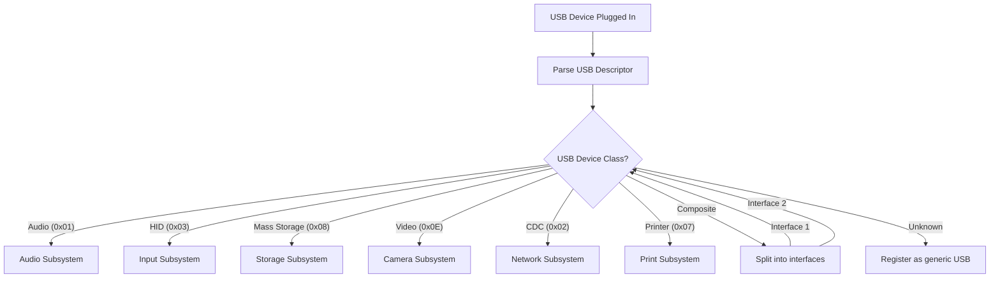
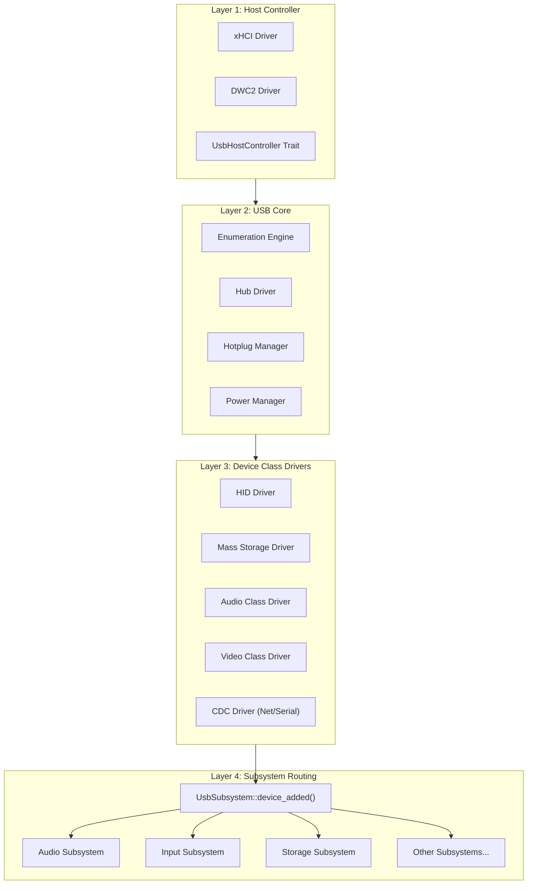
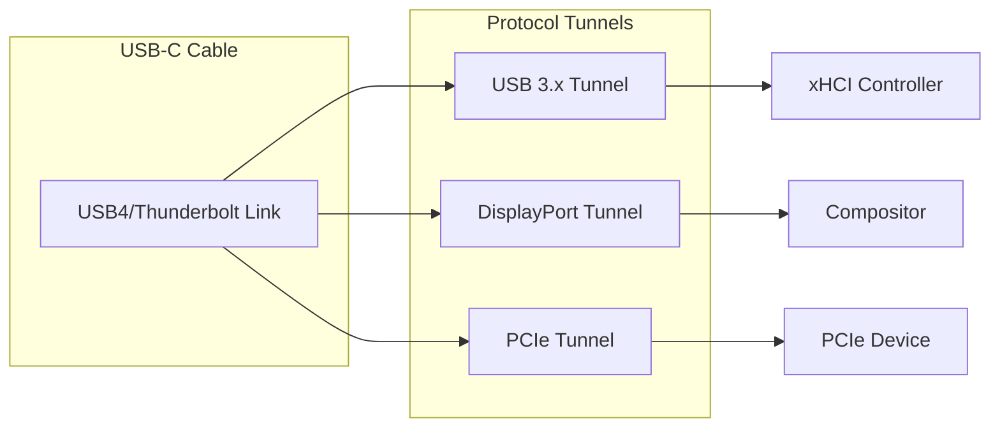

# AIOS USB Subsystem

## Deep Technical Architecture

**Parent document:** [architecture.md](../project/architecture.md)
**Related:** [subsystem-framework.md](./subsystem-framework.md) — Universal hardware abstraction (capability gate, sessions, data channels, audit, power, POSIX bridge), [hal.md](../kernel/hal.md) — `PlatformUsb` extension trait (§12) and controller HAL (§14), [audio/drivers.md](./audio/drivers.md) — USB Audio Class driver (§5.6), [accessibility.md](../experience/accessibility.md) — USB HID Braille/switch devices (§4-5), [security/model.md](../security/model.md) — USB physical attack surface (§1), [wireless.md](./wireless.md) — USB WiFi/BT dongle discovery and routing (§7.2)

**Note:** The USB subsystem is a **meta-subsystem** — it is a bus, not a device class. USB identifies what's connected and routes each device to the subsystem that handles its class. A USB keyboard goes to the input subsystem; a USB microphone goes to the audio subsystem; a USB thumb drive goes to the storage subsystem. USB itself manages controllers, enumeration, hotplug, power, and security — the class-specific behavior lives in each destination subsystem.

-----

## Document Map

This document was split for navigability. Each sub-document preserves the original section numbers for cross-reference stability.

| Document | Sections | Content |
|---|---|---|
| **This file** | §1, §12–§14 | Overview, implementation order, design principles, future directions |
| [controller.md](./usb/controller.md) | §2 | Controller architecture: xHCI/DWC2 drivers, discovery, DMA buffers, interrupts, performance |
| [device-classes.md](./usb/device-classes.md) | §3, §4, §5 | Device enumeration, class drivers (HID, mass storage, audio, video, network, serial, accessibility), subsystem routing |
| [hotplug.md](./usb/hotplug.md) | §6, §7, §8 | Hub enumeration, hotplug state machine, power management (selective suspend, USB-C PD) |
| [security.md](./usb/security.md) | §9, §10, §11 | Security model (BadUSB, IOMMU, fuzzing, allowlisting), AI-native USB, audit and observability |

-----

## 1. Overview

USB (Universal Serial Bus) is the primary expansion bus on all AIOS target platforms. On Raspberry Pi hardware, USB is the only input device path — there is no PS/2 or built-in keyboard. On QEMU, emulated xHCI provides a development-time USB stack. USB connects keyboards, mice, game controllers, storage devices, audio interfaces, webcams, network adapters, serial consoles, and countless other peripherals.

### 1.1 Core Insight: USB as Meta-Subsystem

USB is not a device class — it is a bus that carries many device classes. The AIOS USB subsystem has a fundamentally different role from subsystems like audio or networking:



The audio subsystem doesn't care whether a microphone is USB, Bluetooth, or built-in — it sees a device that implements `AudioDevice` and treats them all the same. USB's job is to make that abstraction work: enumerate the device, identify its class, create the right wrapper, and hand it to the destination subsystem.

### 1.2 Architecture Layers

The USB stack is organized into four layers:



- **Layer 1 (Host Controller):** Platform-specific drivers (xHCI, DWC2) behind a common `UsbHostController` trait. Manages ring buffers, DMA, and interrupts. See [controller.md](./usb/controller.md).
- **Layer 2 (USB Core):** Enumeration engine discovers devices and reads descriptors. Hub driver manages tree topology. Hotplug manager handles device connect/disconnect. Power manager handles selective suspend and USB-C PD. See [hotplug.md](./usb/hotplug.md).
- **Layer 3 (Class Drivers):** Protocol-specific drivers (HID, mass storage, audio, video, network, serial) that translate USB transfers into subsystem-compatible abstractions. See [device-classes.md](./usb/device-classes.md).
- **Layer 4 (Subsystem Routing):** The `UsbSubsystem` implementation of the Subsystem Framework's `device_added()` dispatches each device to the appropriate subsystem. See [device-classes.md §5](./usb/device-classes.md).

### 1.3 Platform Support

| Platform | Controller | USB Ports | Notes |
|---|---|---|---|
| QEMU virt | Emulated xHCI | Virtual | `-device qemu-xhci` flag |
| Raspberry Pi 4 | VL805 xHCI (PCIe) + DWC2 | 2×USB 3.0, 2×USB 2.0 | VL805 via PCIe bridge on BCM2711 |
| Raspberry Pi 5 | RP1 xHCI | 2×USB 3.0, 2×USB 2.0 | RP1 south bridge, xHCI only |
| Apple Silicon | Thunderbolt xHCI | USB-C / Thunderbolt | xHCI-compatible controller |

### 1.4 Capability Model

USB devices are accessed through the AIOS capability system. No agent can interact with a USB device without the appropriate capability token:

```rust
pub enum UsbCapability {
    /// Access a specific device class (e.g., HID input, mass storage read/write)
    DeviceClass(UsbClassPermission),
    /// Raw USB access for unknown or custom devices (high privilege)
    RawAccess { device_id: UsbDeviceId },
    /// Hub management (enumerate ports, power control)
    HubControl,
    /// USB subsystem administration (device policy, allowlisting)
    Admin,
}
```

Most agents receive `DeviceClass` capabilities — they interact with the device through the destination subsystem, never seeing raw USB transfers. `RawAccess` is reserved for specialized agents that need direct control (e.g., firmware updaters, security scanners). See [security.md §9.2](./usb/security.md) for the full capability model.

-----

## 12. Implementation Order

The USB subsystem is implemented in **Phase 24** (5 weeks) across three milestones. Prerequisites: Phase 20 (Camera) completes the subsystem framework pattern; Phase 3 (IPC/Scheduler) provides the threading model.

### Phase 24 Milestones

| Milestone | Steps | Target | Observable Result |
|---|---|---|---|
| M52: xHCI + HID | Steps 1-4 | Week 1-2 | USB keyboard input on QEMU; HID report parsing |
| M53: Mass Storage + Hub | Steps 5-8 | Week 3-4 | Mount USB drive, read/write files; hub enumeration |
| M54: Hotplug + Security | Steps 9-12 | Week 5 | Device connect/disconnect events; capability enforcement; audit logging |

### Dependency Chain

```text
Phase 3 (IPC) ────────── Thread model, IPC channels for device events
Phase 4 (Storage) ─────── Block Engine for mass storage integration
Phase 7 (Networking) ──── Network subsystem for CDC Ethernet routing
Phase 16 (HAL) ────────── PlatformUsb trait, IOMMU abstraction
Phase 20 (Camera) ─────── Subsystem Framework pattern established
     │
Phase 24 (USB) ────────── This document
     │
Phase 25 (WiFi/BT) ───── Wireless subsystems (USB dongle support)
Phase 27 (Power) ──────── Full USB-C PD integration
```

### Cross-Phase USB Features

Some USB features are implemented in phases other than Phase 24:

- **USB Audio Class driver**: Phase 25 (audio/drivers.md §5.6)
- **USB HID Braille displays**: Phase 24+ (accessibility.md §4)
- **USB-C Power Delivery negotiation**: Phase 27 (power-management.md)
- **USB4/Thunderbolt tunneling**: Phase 31+ (§14 Future Directions)
- **AI-native USB features**: Phase 41+ (security.md §10)

-----

## 13. Design Principles

1. **Bus, not device.** USB is infrastructure. It doesn't own devices — it discovers them, wraps them in class-specific drivers, and hands them to destination subsystems. Device-class behavior lives in the destination subsystem, not the USB stack.

2. **Capability-gated from the start.** Every USB device interaction requires a capability token. No default trust. Even HID input devices require `DeviceClass(Hid)` capability before they can deliver keystrokes. This prevents BadUSB attacks where a malicious device masquerades as a keyboard.

3. **Hotplug is first-class.** USB devices come and go. The entire stack is designed around dynamic device lifecycles — there are no static device allocations. Every data structure supports graceful insertion and removal. Surprise removal (cable yank) is handled without panics or resource leaks.

4. **Controller abstraction.** The `UsbHostController` trait hides xHCI ring buffers, DWC2 channels, and future controller architectures behind a single interface. Class drivers never know which controller is in use.

5. **Security by default.** USB is a physical attack vector. Descriptors are untrusted input — they are validated, length-checked, and fuzzed. IOMMU/DART confines DMA. Device allowlisting controls what can connect. AI-based anomaly detection catches devices that lie about their class.

6. **Power-aware.** USB devices consume significant power. Selective suspend puts idle devices to sleep. USB-C Power Delivery negotiates optimal power. The power manager coordinates with the system-wide power policy.

7. **Latency matters.** USB HID is the primary input path on Pi hardware. The target is < 16ms from USB poll to pixel on a 60Hz display. The stack minimizes copies, avoids unnecessary allocations, and uses interrupt-driven I/O.

-----

## 14. Future Directions

### 14.1 USB4 and Thunderbolt

USB4 tunnels USB 3.x, DisplayPort, and PCIe over a single USB-C cable. This transforms USB from a peripheral bus into a multi-protocol fabric:



USB4 requires a **tunnel manager** that:

- Negotiates bandwidth allocation across tunnels (USB 3.x vs. DisplayPort vs. PCIe)
- Coordinates with the compositor for DisplayPort tunnel setup and hotplug
- Enforces security levels for PCIe tunneling (PCIe DMA is the primary Thunderbolt attack vector)
- Supports Thunderbolt security levels: `None`, `UserApproval`, `SecureBoot`, `DisplayPortOnly`

AIOS maps Thunderbolt security levels to the capability system — `PCIe tunnel` requires explicit `ThunderboltPcie` capability, which is never granted by default.

### 14.2 USB4 Bandwidth Scheduling

USB4 supports asymmetric bandwidth allocation. A video editor might need 80% of bandwidth for an external display (DP tunnel) and 20% for a USB drive, while a musician might want 60% for a USB audio interface and 40% for a USB MIDI controller. AIRS-driven bandwidth scheduling adapts tunnel allocations to the user's current workflow context.

### 14.3 Wireless USB

Wireless USB (based on WiGig/802.11ad or newer standards) enables cable-free USB connections. The stack architecture doesn't change — wireless USB presents as a standard xHCI controller — but adds latency variability and connection reliability concerns that the power manager and hotplug manager must handle.

### 14.4 USB Device Passthrough for Agents

Secure USB device passthrough allows agents to directly access USB devices in a sandboxed context. This requires:

- IOMMU-isolated DMA buffers per agent
- Capability-limited `RawAccess` tokens with timeout and revocation
- Audit logging of all raw USB transactions
- Automatic device reclaim when the agent terminates

### 14.5 Formal Verification of Descriptor Parsing

USB descriptor parsing is a primary attack surface (complex nested structures, variable lengths, untrusted input). Formal verification of the descriptor parser using tools like Kani or Creusot would provide mathematical guarantees against parsing bugs — a defense-in-depth complement to fuzzing.

-----

## Cross-Reference Index

| Section | Sub-file | Topic |
|---|---|---|
| §1 | This file | Overview, architecture layers, platform support, capability model |
| §2 | [controller.md](./usb/controller.md) | Controller architecture |
| §2.1 | [controller.md](./usb/controller.md) | UsbHostController trait |
| §2.2 | [controller.md](./usb/controller.md) | xHCI driver |
| §2.3 | [controller.md](./usb/controller.md) | DWC2 driver |
| §2.4 | [controller.md](./usb/controller.md) | Controller discovery |
| §2.5 | [controller.md](./usb/controller.md) | DMA buffer management |
| §2.6 | [controller.md](./usb/controller.md) | Interrupt handling |
| §2.7 | [controller.md](./usb/controller.md) | Performance tuning |
| §3 | [device-classes.md](./usb/device-classes.md) | Device enumeration |
| §3.1 | [device-classes.md](./usb/device-classes.md) | Enumeration state machine |
| §3.2 | [device-classes.md](./usb/device-classes.md) | Descriptor parsing |
| §3.3 | [device-classes.md](./usb/device-classes.md) | Composite devices |
| §4 | [device-classes.md](./usb/device-classes.md) | Device class drivers |
| §4.1 | [device-classes.md](./usb/device-classes.md) | HID |
| §4.2 | [device-classes.md](./usb/device-classes.md) | Mass Storage |
| §4.3 | [device-classes.md](./usb/device-classes.md) | Audio |
| §4.4 | [device-classes.md](./usb/device-classes.md) | Video |
| §4.5 | [device-classes.md](./usb/device-classes.md) | Network |
| §4.6 | [device-classes.md](./usb/device-classes.md) | Serial |
| §4.7 | [device-classes.md](./usb/device-classes.md) | Accessibility HID |
| §5 | [device-classes.md](./usb/device-classes.md) | Subsystem routing |
| §6 | [hotplug.md](./usb/hotplug.md) | Hub enumeration |
| §7 | [hotplug.md](./usb/hotplug.md) | Hotplug state machine |
| §8 | [hotplug.md](./usb/hotplug.md) | Power management |
| §9 | [security.md](./usb/security.md) | USB security model |
| §10 | [security.md](./usb/security.md) | AI-native USB |
| §11 | [security.md](./usb/security.md) | Audit and observability |
| §12 | This file | Implementation order |
| §13 | This file | Design principles |
| §14 | This file | Future directions |
