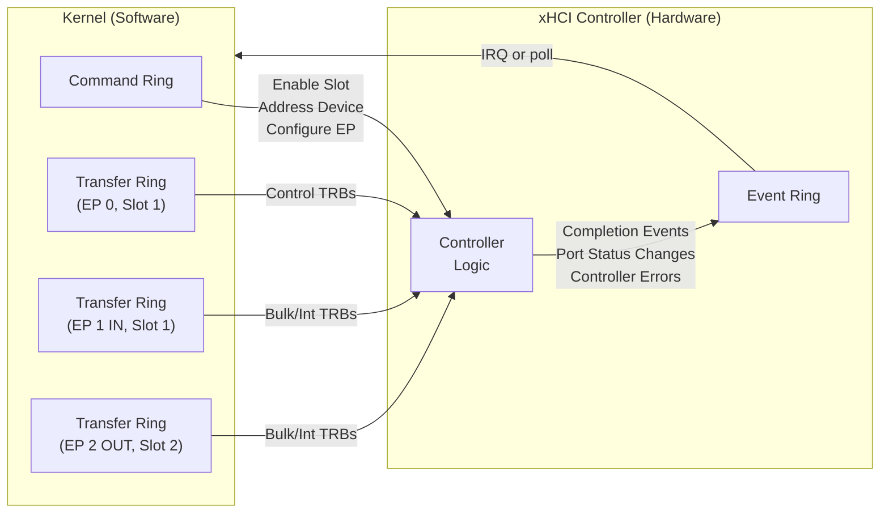
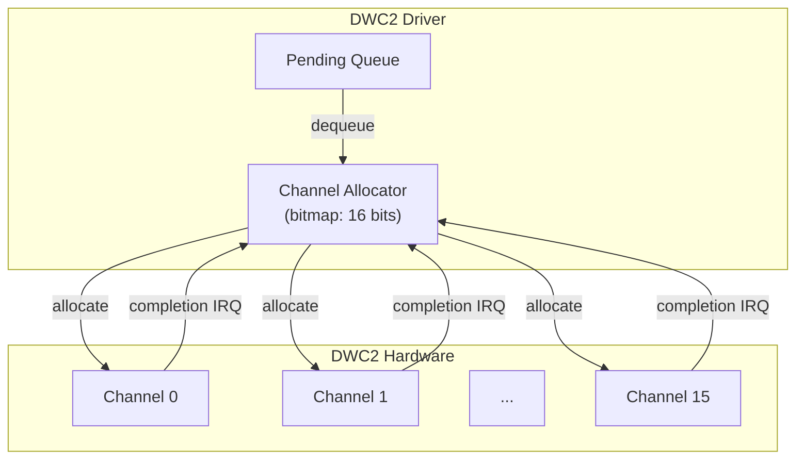
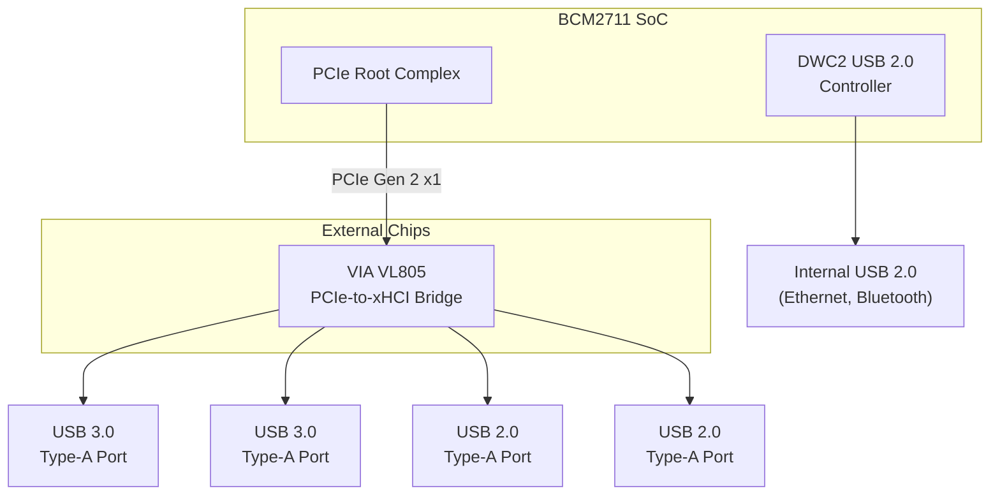
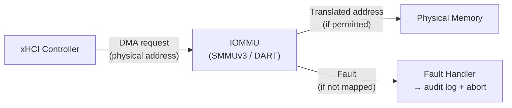
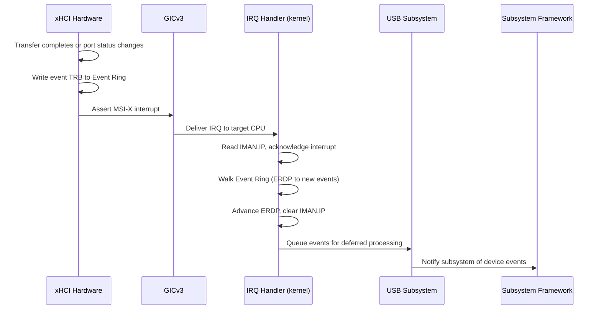

# AIOS USB Controller Architecture

Part of: [usb.md](../usb.md) — USB Subsystem
**Related:** [device-classes.md](./device-classes.md) — Device enumeration and class drivers, [hotplug.md](./hotplug.md) — Hub enumeration and hotplug, [security.md](./security.md) — DMA isolation and security

-----

## 2. Controller Architecture

USB host controllers are the hardware interface between the kernel and USB devices. AIOS abstracts the differences between controller types behind a single trait, allowing class drivers (HID, mass storage, audio) to operate identically regardless of the underlying hardware. The controller layer handles initialization, transfer submission, completion polling, and shutdown — everything below the device model and above raw MMIO registers.

Two controller families are relevant:

- **xHCI** (eXtensible Host Controller Interface) — the USB 3.x standard. Ring-buffer based. Used on all supported platforms.
- **DWC2** (DesignWare Core USB 2.0) — a channel-based USB 2.0 controller specific to the Raspberry Pi 4 SoC.

Both implement the same `UsbHostController` trait. Upper-layer code never interacts with controller-specific types directly.

-----

### 2.1 UsbHostController Trait

The controller abstraction lives in the HAL ([hal.md](../../kernel/hal.md) §12.5, with the extension trait pattern in §12.2). Every USB host controller — xHCI, DWC2, or any future controller type — implements this trait:

```rust
/// USB host controller abstraction.
///
/// Implementors manage the hardware-specific details of USB communication:
/// ring buffers (xHCI), channels (DWC2), or other transport mechanisms.
/// Upper-layer class drivers interact exclusively through this trait.
pub trait UsbHostController {
    /// Initialize the controller hardware.
    /// Resets the controller, configures ring buffers, enables port power.
    fn init(&mut self) -> Result<()>;

    /// Enumerate devices on all root hub ports.
    /// Returns a tree of discovered devices with their descriptors.
    fn enumerate(&mut self) -> Result<Vec<UsbDevice>>;

    /// Submit a transfer (control, bulk, interrupt, or isochronous).
    fn submit_transfer(&mut self, transfer: UsbTransfer) -> Result<TransferHandle>;

    /// Poll for completed transfers (non-blocking).
    fn poll_completions(&mut self) -> Vec<TransferCompletion>;

    /// Shutdown the controller, release all resources.
    fn shutdown(&mut self);
}
```

#### Method Semantics

**`init()`** performs a full hardware reset and brings the controller to a running state. For xHCI, this involves the 15-step initialization sequence (§2.2). For DWC2, this configures channel registers and the host port. `init()` enables port power but does not enumerate devices — that is a separate step because the caller may need to configure DMA buffers or IOMMU mappings between initialization and enumeration. Returns `Err` if the controller fails to reset within its timeout window or if required DMA buffers cannot be allocated.

**`enumerate()`** walks all root hub ports (and recursively, hub ports) to discover connected devices. Each discovered device has its descriptors read and parsed into a `UsbDevice` structure containing the device descriptor, configuration descriptor, interface descriptors, and endpoint descriptors. The returned `Vec<UsbDevice>` represents the full device tree at the time of enumeration. See [hotplug.md](./hotplug.md) for the incremental re-enumeration that occurs on device connect/disconnect events.

**`submit_transfer()`** queues a USB transfer for execution by the controller hardware. The caller provides a `UsbTransfer` describing the transfer type, direction, target endpoint, and data buffer. The method returns a `TransferHandle` — an opaque identifier used to match completions. Transfers are asynchronous: this method returns immediately after queuing, and the caller retrieves results via `poll_completions()`.

**`poll_completions()`** returns all transfers that have completed since the last call. Each `TransferCompletion` contains the original `TransferHandle`, the completion status (success, stall, babble, data toggle error, etc.), and the number of bytes actually transferred. This method never blocks.

**`shutdown()`** stops the controller, cancels all pending transfers, and releases DMA memory. After shutdown, the controller is in a quiescent state suitable for suspend or driver unload. Any pending `TransferHandle` values become invalid.

#### Transfer Types

USB defines four transfer types, each with different guarantees:

```rust
pub enum UsbTransfer {
    /// Control transfers: bidirectional, guaranteed delivery, used for
    /// device configuration and standard requests (GET_DESCRIPTOR, SET_ADDRESS).
    /// Always target endpoint 0. Three phases: Setup, Data (optional), Status.
    Control {
        device: DeviceAddress,
        setup: SetupPacket,
        data: Option<DmaBuffer>,
        direction: Direction,
    },

    /// Bulk transfers: unidirectional, guaranteed delivery, no latency
    /// guarantee. Used for mass storage, printers, and network adapters.
    /// The controller schedules bulk transfers in bandwidth left over after
    /// isochronous and interrupt transfers.
    Bulk {
        device: DeviceAddress,
        endpoint: EndpointAddress,
        data: DmaBuffer,
        direction: Direction,
    },

    /// Interrupt transfers: unidirectional, guaranteed delivery, guaranteed
    /// maximum latency. Used for HID devices (keyboards, mice) and hub
    /// status change notifications. Polled at the interval declared in the
    /// endpoint descriptor (1-255 ms for full-speed, 1-16 microframes for
    /// high/super-speed).
    Interrupt {
        device: DeviceAddress,
        endpoint: EndpointAddress,
        data: DmaBuffer,
        direction: Direction,
        interval_ms: u8,
    },

    /// Isochronous transfers: unidirectional, no delivery guarantee,
    /// guaranteed bandwidth and constant latency. Used for audio and video
    /// streaming. Packets that miss their scheduled frame are dropped —
    /// no retransmission.
    Isochronous {
        device: DeviceAddress,
        endpoint: EndpointAddress,
        data: DmaBuffer,
        direction: Direction,
        /// Number of packets per frame (microframe scheduling)
        packets_per_frame: u8,
        /// Maximum packet size for this endpoint
        max_packet_size: u16,
    },
}

pub enum Direction {
    /// Host to device (OUT token)
    Out,
    /// Device to host (IN token)
    In,
}
```

The `DmaBuffer` type ensures that transfer data resides in DMA-accessible memory with correct alignment and cache attributes. See §2.5 for DMA buffer management details.

-----

### 2.2 xHCI (USB 3.x)

xHCI (eXtensible Host Controller Interface) is the standard USB 3.x host controller, specified by Intel. It supports USB 1.1, 2.0, and 3.x devices through a unified interface. All AIOS target platforms provide xHCI in some form: QEMU emulates it, Pi 4 uses the VIA VL805 PCIe-USB bridge, Pi 5 integrates xHCI in the RP1 south bridge, and Apple Silicon exposes xHCI through Thunderbolt controllers.

#### Data Flow Architecture

xHCI uses a ring-buffer architecture for communication between the kernel (software) and the controller (hardware). Three ring types form the data path:



- **Command Ring** — kernel to controller. One per controller. Used for device management operations: Enable Slot, Address Device, Configure Endpoint, Evaluate Context, Reset Endpoint, Stop Endpoint, and similar commands. The kernel writes Command TRBs (Transfer Request Blocks) and rings the controller's command doorbell.

- **Transfer Rings** — kernel to controller. One per active endpoint per device slot. The kernel writes data transfer TRBs (Normal, Setup Stage, Data Stage, Status Stage, Isoch) describing the data to move. Each ring has its own doorbell register.

- **Event Ring** — controller to kernel. One per interrupter (AIOS uses a single interrupter for simplicity, with multi-interrupter support planned for per-core interrupt distribution). The controller writes completion events, port status change events, and error notifications. The kernel reads events by advancing the Event Ring Dequeue Pointer (ERDP).

#### XhciController Structure

```rust
pub struct XhciController {
    /// MMIO base address of the xHCI capability registers.
    /// All other register sets are at offsets from this base.
    mmio_base: *mut u8,

    /// Operational registers (base + CAPLENGTH offset).
    /// Contains USBCMD, USBSTS, DNCTRL, CRCR, DCBAAP, CONFIG.
    op_regs: *mut u8,

    /// Runtime registers (base + RTSOFF offset).
    /// Contains interrupter register sets (IMAN, IMOD, ERSTSZ, ERSTBA, ERDP).
    rt_regs: *mut u8,

    /// Doorbell registers (base + DBOFF offset).
    /// Doorbell 0 = command ring, doorbell N = device slot N.
    db_regs: *mut u8,

    /// Device Context Base Address Array (DCBAA).
    /// Array of 256 64-bit pointers, one per device slot.
    /// Entry 0 points to the scratchpad buffer array (if required).
    /// Entries 1-255 point to output device contexts.
    dcbaa: DmaBuffer,

    /// Command ring — single ring shared across all device management operations.
    command_ring: TransferRing,

    /// Event ring — single interrupter, polled or IRQ-driven.
    event_ring: EventRing,

    /// Per-slot device state. xHCI supports up to 255 device slots.
    /// AIOS configures MaxSlotsEn = 64, sufficient for hub topologies.
    slots: [Option<DeviceSlot>; 256],

    /// Scratchpad buffers required by some controllers.
    /// The number of required scratchpad pages is read from HCSPARAMS2.
    scratchpad: Option<DmaBuffer>,
}

pub struct DeviceSlot {
    /// Slot ID assigned by the controller (1-255).
    slot_id: u8,

    /// Parsed USB device information (descriptors, speed, address).
    device: UsbDevice,

    /// Device context — the controller's view of this device.
    /// Contains the Slot Context and up to 31 Endpoint Contexts.
    /// Allocated as a DMA buffer because the controller reads/writes it.
    device_context: DmaBuffer,

    /// Per-endpoint transfer rings.
    /// Index 0 = EP 0 (default control pipe, always present).
    /// Index 1 = EP 1 OUT, Index 2 = EP 1 IN, etc.
    /// Up to 31 endpoints per device (endpoint 0 + 15 IN + 15 OUT).
    endpoint_rings: [Option<TransferRing>; 31],
}
```

#### xHCI Register Layout

xHCI organizes its MMIO registers into four distinct sets, each at an offset from the capability base:

```text
+---------------------------+  mmio_base + 0x00
| Capability Registers      |
|  CAPLENGTH (1 byte)       |  Length of capability register set
|  HCIVERSION (2 bytes)     |  Interface version (0x0100 = xHCI 1.0)
|  HCSPARAMS1              |  MaxSlots, MaxIntrs, MaxPorts
|  HCSPARAMS2              |  Scratchpad count, IST, ERST max
|  HCSPARAMS3              |  U1/U2 device exit latency
|  HCCPARAMS1              |  64-bit addressing, context size, etc.
|  DBOFF                   |  Doorbell array offset
|  RTSOFF                  |  Runtime register offset
|  HCCPARAMS2              |  Extended capabilities
+---------------------------+  mmio_base + CAPLENGTH
| Operational Registers     |
|  USBCMD                  |  Run/Stop, HCRST, interrupt enable
|  USBSTS                  |  HCH, HSE, EINT, PCD, CNR
|  PAGESIZE                |  Controller page size (4K minimum)
|  DNCTRL                  |  Device notification control
|  CRCR                    |  Command Ring Control Register
|  DCBAAP                  |  Device Context Base Address Array Pointer
|  CONFIG                  |  MaxSlotsEn (number of enabled slots)
|  Port Register Sets      |  PORTSC, PORTPMSC, PORTLI per port
+---------------------------+  mmio_base + RTSOFF
| Runtime Registers         |
|  MFINDEX                 |  Microframe index counter
|  Interrupter Set 0:      |
|    IMAN                  |  Interrupt Management (IP, IE)
|    IMOD                  |  Interrupt Moderation (interval, counter)
|    ERSTSZ                |  Event Ring Segment Table Size
|    ERSTBA                |  Event Ring Segment Table Base Address
|    ERDP                  |  Event Ring Dequeue Pointer
+---------------------------+  mmio_base + DBOFF
| Doorbell Registers        |
|  DB[0]                   |  Command ring doorbell
|  DB[1..255]              |  Per-slot doorbells (target = endpoint DCI)
+---------------------------+
```

#### TRB (Transfer Request Block) Structure

All ring communication uses 16-byte TRBs. The format varies by TRB type, but the general structure is:

```rust
/// Transfer Request Block — the fundamental unit of xHCI communication.
/// All TRBs are 16 bytes (128 bits), naturally aligned.
#[repr(C, align(16))]
pub struct Trb {
    /// Parameter field — meaning varies by TRB type.
    /// For Normal TRBs: data buffer pointer (physical address).
    /// For Command TRBs: input context pointer or slot ID.
    /// For Event TRBs: TRB pointer or completion parameter.
    parameter: u64,

    /// Status field — meaning varies by TRB type.
    /// For Normal TRBs: transfer length and TD size.
    /// For Event TRBs: completion code and residual byte count.
    status: u32,

    /// Control field — TRB type, cycle bit, flags.
    /// Bits [15:10] = TRB Type (Normal=1, Setup=2, Data=3, Status=4,
    ///   Isoch=5, Link=6, EventData=7, NoOp=8, EnableSlot=9, etc.)
    /// Bit [0] = Cycle bit (producer/consumer synchronization)
    /// Other bits: IOC (Interrupt On Completion), IDT (Immediate Data),
    ///   chain bit, etc.
    control: u32,
}
```

The **cycle bit** is the synchronization mechanism between the kernel and the controller. The producer sets the cycle bit to match its Producer Cycle State (PCS). The consumer knows a TRB is valid when the TRB's cycle bit matches the Consumer Cycle State (CCS). When the ring wraps via a Link TRB, both PCS and CCS toggle, preventing stale TRB confusion without requiring explicit read/write pointer synchronization.

#### Initialization Sequence

The xHCI initialization sequence brings the controller from a reset state to operational:

```text
 1. Reset controller (write USBCMD.HCRST = 1, wait for USBSTS.CNR = 0)
 2. Read capability registers: MaxSlots, MaxIntrs, MaxPorts from HCSPARAMS1
 3. Program MaxSlotsEn in CONFIG register (AIOS uses 64)
 4. Allocate DCBAA — 256-entry array of 64-bit pointers, 64-byte aligned, DMA buffer
 5. Write DCBAA physical address to DCBAAP register
 6. Allocate scratchpad buffers if HCSPARAMS2.Max_Scratchpad_Bufs > 0
 7. Allocate Command Ring — array of TRBs, 64-byte aligned, set initial CCS = 1
 8. Write Command Ring pointer to CRCR register (with RCS bit = initial cycle state)
 9. Allocate Event Ring Segment Table and Event Ring segment(s)
10. Write segment count to ERSTSZ, segment table base to ERSTBA
11. Set Event Ring Dequeue Pointer (ERDP) to start of first segment
12. Enable interrupter 0 (set IMAN.IE = 1, write IMOD for coalescing)
13. Start controller (USBCMD.R/S = 1, USBCMD.INTE = 1)
14. Wait for USBSTS.HCH = 0 (controller running — Halted bit clear)
15. Enable port power on all root hub ports (PORTSC.PP = 1)
```

After step 15, the controller monitors root hub ports for device connections and generates Port Status Change Events on the event ring. The driver processes these events to trigger device enumeration (see [device-classes.md](./device-classes.md) §3.1).

#### Platform Variants

| Platform | xHCI Hardware | Connection | Notes |
| --- | --- | --- | --- |
| QEMU virt | Emulated xHCI | Virtual MMIO or PCI | `-device qemu-xhci` flag |
| Raspberry Pi 4 | VIA VL805 | PCIe Gen 2 x1 on BCM2711 | External chip on PCIe bus; requires firmware initialization of PCIe bridge |
| Raspberry Pi 5 | RP1 south bridge | Dedicated bus from BCM2712 | Two xHCI controllers in RP1: one USB 3.0, one USB 2.0 |
| Apple Silicon | Thunderbolt xHCI | PCIe tunneled through Thunderbolt | Standard xHCI registers; Apple-specific PCIe enumeration |

All variants use the same `XhciController` implementation. Platform differences are limited to:
- MMIO base address discovery (DTB node path varies per platform)
- PCIe BAR mapping (VL805 on Pi 4 requires PCIe configuration space access)
- Firmware quirks (VL805 requires a firmware load step before xHCI reset)

-----

### 2.3 DWC2 (Pi 4)

Raspberry Pi 4 includes a DesignWare DWC2 USB 2.0 controller connected directly to the BCM2711 SoC. This controller predates xHCI and uses a fundamentally different architecture: instead of ring buffers, DWC2 uses a fixed set of **host channels** — hardware resources that each handle one transfer at a time.

```rust
pub struct Dwc2Controller {
    /// MMIO base address of the DWC2 global registers.
    mmio_base: *mut u8,

    /// Host channels — Pi 4 has 16 hardware channels.
    /// Each channel can execute one transfer at a time.
    channels: [HostChannel; 16],

    /// Channel allocation bitmap (bit N = 1 means channel N is in use).
    channel_alloc: u16,

    /// Pending transfers waiting for a free channel.
    /// When all 16 channels are busy, new transfers queue here.
    pending_queue: VecDeque<UsbTransfer>,
}
```

#### Channel-Based Architecture

The DWC2 controller has 16 host channels on Pi 4. Each channel is an independent hardware unit that can execute one USB transaction (a setup/data/status sequence) at a time. The driver manages channels as a pool:



1. **Submit:** When `submit_transfer()` is called, the driver checks the channel allocation bitmap. If a channel is free, it programs the channel registers (device address, endpoint number, direction, transfer size, DMA buffer address) and starts the transfer. If no channel is free, the transfer goes into the pending queue.

2. **Completion:** When a channel completes a transfer (success, STALL, NAK retry exhausted, or error), it generates a channel interrupt. The driver reads the channel status, builds a `TransferCompletion`, frees the channel, and dequeues the next pending transfer (if any) into the newly freed channel.

3. **Split transactions:** For low-speed and full-speed devices connected through a high-speed hub, DWC2 uses split transactions (SSPLIT/CSPLIT). The driver handles the split transaction state machine transparently — callers see a single `TransferCompletion` regardless of the underlying split transaction complexity.

#### Differences from xHCI

| Aspect | xHCI | DWC2 |
| --- | --- | --- |
| Communication model | Ring buffers (Command, Transfer, Event) | Fixed channel registers |
| Parallelism | Limited by ring depth (hundreds) | Limited by channel count (16) |
| USB 3.x support | Native | None (USB 2.0 only) |
| Scheduling | Hardware-managed (periodic/async lists) | Software-managed (driver allocates channels) |
| DMA model | Scatter-gather via TRB chains | Single contiguous buffer per channel |
| Isochronous | Frame-accurate hardware scheduling | Software frame tracking required |

**DWC2 is only present on Raspberry Pi 4.** Pi 5 uses xHCI exclusively via the RP1 south bridge. QEMU emulates xHCI by default. The `UsbHostController` trait abstraction ensures that class drivers (HID, mass storage, audio) work identically on both controller types.

-----

### 2.4 Controller Discovery

USB controllers are discovered during kernel boot through device tree (DTB) parsing combined with the HAL extension trait pattern ([hal.md](../../kernel/hal.md) §12).

#### PlatformUsb Extension Trait

USB is optional hardware — a headless embedded board might not have a USB controller. The HAL uses an extension trait rather than adding USB to the mandatory `Platform` trait:

```rust
/// Optional: platforms with a USB host controller implement this.
/// The DeviceTree parameter enables DTB-driven discovery of controller
/// MMIO base addresses and interrupt assignments.
pub trait PlatformUsb: Platform {
    fn init_usb(&self, dt: &DeviceTree) -> Result<UsbController>;
}
```

Each platform provides its own implementation:

```rust
impl PlatformUsb for QemuPlatform {
    fn init_usb(&self, dt: &DeviceTree) -> Result<UsbController> {
        // Parse DTB for "generic-xhci" or "qemu,xhci" compatible node
        // Map MMIO region, initialize XhciController
    }
}

impl PlatformUsb for RaspberryPi4Platform {
    fn init_usb(&self, dt: &DeviceTree) -> Result<UsbController> {
        // Two controllers on Pi 4:
        // 1. VL805 xHCI via PCIe (USB 3.0 ports)
        // 2. DWC2 via SoC MMIO (internal USB 2.0)
        // Returns a composite controller that dispatches to both
    }
}

impl PlatformUsb for RaspberryPi5Platform {
    fn init_usb(&self, dt: &DeviceTree) -> Result<UsbController> {
        // RP1 south bridge provides two xHCI controllers
        // Parse DTB for RP1 xHCI nodes, initialize both
    }
}
```

#### Runtime Detection

The kernel checks whether the active platform supports USB using `Any`-based downcasting ([hal.md](../../kernel/hal.md) §12.3):

```rust
fn try_init_usb(platform: &dyn Platform, dt: &DeviceTree) -> Option<UsbController> {
    let any = platform.as_any();

    if let Some(qemu) = any.downcast_ref::<QemuPlatform>() {
        return Some(qemu.init_usb(dt).ok()?);
    }
    if let Some(pi4) = any.downcast_ref::<RaspberryPi4Platform>() {
        return Some(pi4.init_usb(dt).ok()?);
    }
    if let Some(pi5) = any.downcast_ref::<RaspberryPi5Platform>() {
        return Some(pi5.init_usb(dt).ok()?);
    }

    None // Platform does not support USB
}
```

This pattern means adding a new platform with USB requires only two changes: implement `PlatformUsb` for the new platform type, and add a downcast branch in `try_init_usb()`.

#### DTB-Based Discovery

Each platform discovers USB controllers by walking the device tree. The DTB compatible strings identify the controller type:

| Platform | DTB Compatible String | Controller Type |
| --- | --- | --- |
| QEMU virt | `"generic-xhci"` or `"qemu,xhci"` | Virtual xHCI |
| Raspberry Pi 4 | `"brcm,bcm2711-xhci"` (VL805 via PCIe) | xHCI |
| Raspberry Pi 4 | `"brcm,bcm2835-usb"` (DWC2) | DWC2 |
| Raspberry Pi 5 | `"brcm,bcm2712-xhci"` (RP1) | xHCI |
| Apple Silicon | `"apple,t8103-xhci"` (varies by SoC) | xHCI |

The DTB node provides the MMIO base address, register region size, and interrupt assignment. The driver maps the MMIO region into the kernel's virtual address space (via MMIO_BASE mapping in kmap.rs) and reads the controller's capability registers to determine its configuration.

#### Pi 4 Dual-Controller Topology

Raspberry Pi 4 is unique in having two distinct USB controllers:



The Pi 4 `PlatformUsb` implementation returns a composite `UsbController` that dispatches transfers to the appropriate underlying controller based on the target device's attachment point. From the perspective of class drivers and the subsystem framework, this looks like a single controller with multiple ports.

-----

### 2.5 DMA Buffer Management

USB controllers perform DMA (Direct Memory Access) — the controller hardware reads and writes system memory directly, bypassing the CPU cache hierarchy. DMA buffers require special allocation and cache management to prevent data corruption.

#### DmaBuffer Type

```rust
/// A buffer allocated for DMA access by a USB controller.
///
/// DMA buffers are allocated from the DMA page pool (Pool::Dma) and have
/// physical addresses known to the kernel. The controller accesses them
/// via physical (or IOMMU-translated) addresses.
pub struct DmaBuffer {
    /// Virtual address (kernel direct-map) for CPU access.
    virt: *mut u8,
    /// Physical address for controller DMA programming.
    phys: PhysAddr,
    /// Buffer size in bytes.
    size: usize,
    /// IOMMU mapping handle (if IOMMU is active).
    iommu_mapping: Option<IommuMapping>,
}
```

All xHCI data structures that the controller accesses — DCBAA, command ring, event ring, transfer rings, device contexts, scratchpad buffers, and transfer data — must reside in DMA-accessible memory. The kernel allocates these from the DMA page pool ([memory/physical.md](../../kernel/memory/physical.md) §2.4), which is a dedicated region of physical memory reserved during boot (64 MB on QEMU with 2 GB RAM).

#### IOMMU Integration

On platforms with an IOMMU (ARM SMMUv3 on Pi 5 and QEMU, Apple DART on Apple Silicon), each USB controller is assigned a StreamID. The IOMMU restricts the controller's DMA to only the memory regions explicitly mapped for it ([security.md](./security.md) §9.3):



The controller discovery path maps each DMA buffer through the IOMMU before programming the buffer's address into controller registers. The address the controller sees is the IOMMU-translated address (IOVA — I/O Virtual Address), not the raw physical address.

```rust
impl DmaBuffer {
    /// Allocate a DMA buffer and optionally map it through the IOMMU.
    ///
    /// If an IOMMU is active for this controller's StreamID, the returned
    /// phys address is the IOVA (IOMMU virtual address), not the real
    /// physical address. The controller uses this IOVA for all DMA.
    pub fn allocate(
        size: usize,
        alignment: usize,
        iommu: Option<&mut dyn Iommu>,
        stream_id: u32,
    ) -> Result<Self> {
        let frame = frame_alloc(Pool::Dma, order_for_size(size))?;
        let phys = frame.phys_addr();
        let virt = phys_to_direct_map(phys);

        let (dma_addr, mapping) = match iommu {
            Some(iommu) => {
                let mapping = iommu.map_device(
                    stream_id,
                    phys,
                    size,
                    DmaPermissions { read: true, write: true },
                )?;
                (mapping.iova(), Some(mapping))
            }
            None => (phys, None),
        };

        Ok(DmaBuffer {
            virt: virt as *mut u8,
            phys: dma_addr,
            size,
            iommu_mapping: mapping,
        })
    }
}
```

#### Bounce Buffer Fallback (Pi 4)

Raspberry Pi 4 has no IOMMU. The VL805 xHCI controller can DMA to any physical address without restriction. To prevent a compromised or malfunctioning USB device from corrupting arbitrary memory, the HAL uses **bounce buffers** ([hal.md](../../kernel/hal.md) §13.1):

1. A dedicated physical memory region is reserved at boot for all DMA operations.
2. Before a transfer, the kernel copies outbound data from the caller's buffer into the bounce buffer.
3. The controller DMAs to/from the bounce buffer only.
4. After completion, the kernel copies inbound data from the bounce buffer to the caller's buffer.

This adds one memory copy per transfer direction but prevents DMA-based attacks on systems without hardware IOMMU protection. The bounce buffer region is not mapped into any userspace address space.

#### Cache Coherency

ARM aarch64 is not cache-coherent with DMA by default. DMA buffers must be either:

- **Non-cacheable** — mapped with device or non-cacheable memory attributes, so the CPU never caches their contents. This is the simplest approach but incurs higher CPU access latency.
- **Cache-maintained** — mapped cacheable, with explicit cache clean (before controller reads) and cache invalidate (before CPU reads after controller writes) operations around each transfer.

AIOS uses non-cacheable mapping for all DMA pool allocations. The DMA pool pages are mapped with MAIR Attr0 (device-nGnRnE) or Attr1 (non-cacheable Normal) in the direct map, ensuring the CPU and controller always see the same data without explicit cache maintenance. This simplifies the driver and eliminates an entire class of cache coherency bugs at the cost of slightly higher CPU access latency to DMA buffers — an acceptable trade-off given that the CPU accesses DMA buffers infrequently compared to the controller.

#### Alignment Requirements

xHCI imposes specific alignment requirements on its data structures:

| Structure | Alignment | Size |
| --- | --- | --- |
| DCBAA | 64 bytes | 256 entries x 8 bytes = 2048 bytes |
| Device Context | 64 bytes | 32 entries x 32 bytes = 1024 bytes (32-byte context) or 2048 bytes (64-byte context) |
| Transfer Ring | 64 bytes | N TRBs x 16 bytes (N is typically 256) |
| Event Ring Segment | 64 bytes | N TRBs x 16 bytes |
| Event Ring Segment Table | 64 bytes | N entries x 16 bytes |
| Scratchpad Buffer | Page-aligned (4 KiB) | One page per scratchpad entry |
| Input Context | 64 bytes | Same size as Device Context |
| TRB data buffer | No alignment (but 64 KB boundary crossing rules apply) | Variable |

The `DmaBuffer::allocate()` method accepts an alignment parameter and rounds up the allocation to the nearest frame order that satisfies both the size and alignment requirements. For page-aligned structures (scratchpad buffers), it allocates at order 0 (single 4 KiB page) or higher.

-----

### 2.6 Interrupt Handling

USB controllers generate interrupts to signal completed transfers, port status changes, and error conditions. The interrupt handling path differs between xHCI and DWC2, but both ultimately produce events that the USB subsystem processes uniformly.

#### xHCI Interrupt Path

xHCI uses MSI-X (Message Signaled Interrupts — Extended) when available, falling back to legacy pin-based interrupts. Each interrupter has its own event ring and can target a different CPU core for interrupt distribution:



The ISR (Interrupt Service Routine) runs in IRQ context with interrupts masked on the current core. It performs minimal work:

1. Read the interrupter's IMAN register. If the Interrupt Pending (IP) bit is set, an event is waiting.
2. Walk the event ring from the current ERDP, processing each event TRB where the cycle bit matches the CCS.
3. For each event: extract the completion code, residual byte count, and TRB pointer. Queue a lightweight event descriptor for deferred processing.
4. Write the new ERDP to acknowledge processed events. Set the Event Handler Busy (EHB) bit to 0.
5. Clear IMAN.IP by writing 1 to it (write-1-to-clear).

Deferred processing happens outside IRQ context. The USB subsystem matches `TransferCompletion` events to their `TransferHandle` and notifies the appropriate class driver. Port status change events trigger enumeration or teardown via the hotplug path ([hotplug.md](./hotplug.md)).

#### DWC2 Interrupt Path

DWC2 uses a single shared IRQ line. The IRQ handler reads the Host All Channels Interrupt Register (HAINT) to determine which channels have pending events, then reads each channel's interrupt register (HCINTn) for the specific event:

1. Read GINTSTS (Global Interrupt Status) — check for HCINT (Host Channel Interrupt) bit.
2. Read HAINT — bitmap of channels with pending interrupts.
3. For each set bit N in HAINT:
   - Read HCINT[N] — channel N interrupt flags (transfer complete, STALL, NAK, error, etc.).
   - Read HCTSIZ[N] — remaining transfer size (to calculate bytes transferred).
   - Clear channel interrupt flags by writing to HCINT[N].
   - Free channel N in the allocation bitmap.
   - If pending queue is non-empty, program the next transfer into channel N.
4. Clear GINTSTS.HCINT.

#### Polled I/O Fallback

During early boot, before the GIC is initialized and interrupts are enabled, USB operates in polled mode. The `poll_completions()` method reads the event ring (xHCI) or channel status registers (DWC2) directly without waiting for an interrupt. This enables USB keyboard input during early boot diagnostics and firmware interaction.

The transition from polled to interrupt-driven mode happens after GIC initialization ([hal.md](../../kernel/hal.md) §4.1). The driver calls a `set_interrupt_mode()` method that:

1. Enables the controller's interrupt output (USBCMD.INTE for xHCI, GINTMSK for DWC2).
2. Configures the GIC to route the USB interrupt to the appropriate CPU core.
3. Sets an internal flag so that `poll_completions()` becomes a no-op (events are delivered via IRQ instead).

#### Event Propagation

The path from hardware interrupt to subsystem notification:


Transfer completion events are matched to pending `TransferHandle` values and delivered to the class driver that submitted them. Port status change events are routed to the hotplug handler ([hotplug.md](./hotplug.md)). Host controller error events (hardware failure, bandwidth overrun) are logged to the audit ring and may trigger controller reset recovery.

-----

### 2.7 Performance Tuning

USB performance involves trade-offs between latency, throughput, and CPU utilization. The controller layer provides several tuning mechanisms.

#### Interrupt Coalescing (IMOD)

xHCI provides the Interrupt Moderation (IMOD) register in each interrupter's register set. IMOD delays interrupt delivery after an event is posted, allowing multiple events to accumulate before triggering a single interrupt:

```text
IMOD Register (32 bits):
  Bits [15:0]  — Interrupt Moderation Interval (IMODI)
                  Unit: 250 nanoseconds. Value of 0 = no moderation.
                  Value of 4000 = 1ms coalescing window.
  Bits [31:16] — Interrupt Moderation Counter (IMODC)
                  Hardware countdown; interrupt fires when counter reaches 0.
```

AIOS configures IMOD based on the connected device profile:

| Profile | IMOD Interval | Rationale |
| --- | --- | --- |
| HID input (keyboard/mouse) | 0 (disabled) | Minimize input latency — every event matters |
| Mass storage (bulk) | 4000 (1 ms) | Batch completions to reduce IRQ rate during large transfers |
| Audio (isochronous) | 500 (125 us) | Match USB microframe boundary for audio timing |
| Hub status change | 0 (disabled) | Immediate notification for hotplug responsiveness |

The driver adjusts IMOD dynamically when device profiles change (e.g., a hub with only HID devices versus a hub with a mass storage device attached).

#### Zero-Copy Transfers

When an IOMMU is present, the controller can DMA directly to and from user-provided buffers without an intermediate kernel copy:

1. The agent submits a buffer address via the USB subsystem's capability-gated API.
2. The kernel validates the buffer (within agent's address space, correct permissions).
3. The kernel maps the buffer's physical pages through the IOMMU for the controller's StreamID.
4. The controller DMAs directly to/from the agent's buffer.
5. On completion, the kernel unmaps the IOMMU entries.

Zero-copy eliminates two memory copies (user-to-kernel and kernel-to-DMA) per transfer direction. This matters for high-bandwidth devices: a USB 3.0 mass storage device at 5 Gbps generates data faster than a single memory copy can consume. Without zero-copy, the CPU becomes the bottleneck.

On Pi 4 (no IOMMU), zero-copy is not available — bounce buffers are always used, adding one copy per direction (see §2.5).

#### Transfer Batching

xHCI supports chaining multiple TRBs into a single Transfer Descriptor (TD) using the chain bit. The driver batches TRBs and rings the doorbell once for the entire batch rather than per-TRB:

```rust
/// Submit a batch of TRBs to a transfer ring.
/// Only one doorbell ring is needed for the entire batch.
fn submit_batch(
    &mut self,
    slot: u8,
    endpoint_dci: u8,
    trbs: &[Trb],
) {
    let ring = &mut self.slots[slot as usize]
        .as_mut()
        .expect("slot active")
        .endpoint_rings[endpoint_dci as usize]
        .as_mut()
        .expect("endpoint configured");

    for trb in trbs {
        ring.enqueue(*trb);
    }

    // Single doorbell ring for the entire batch
    self.ring_doorbell(slot, endpoint_dci);
}
```

Batching reduces doorbell register writes (each is an MMIO store with device memory ordering overhead) and allows the controller to schedule multiple transfers in a single pass through its internal scheduling loop.

#### Isochronous Scheduling

Isochronous transfers (audio, video) require frame-accurate timing. The xHCI controller provides a Microframe Index Register (MFINDEX) that counts USB microframes (125 us each, 8 per millisecond). The driver uses MFINDEX to schedule isochronous TRBs for specific future frames:

```text
Isochronous TRB:
  Frame ID field — target microframe for this transfer
  TBC (Transfer Burst Count) — packets per burst
  TLBPC (Transfer Last Burst Packet Count) — packets in final burst
```

The driver maintains a scheduling window — it submits isochronous TRBs 2-4 frames ahead of the current MFINDEX to ensure the controller has them before the target frame arrives. If a TRB is submitted too late (target frame already passed), the controller skips it and reports a Missed Service Error in the event ring. The class driver handles this by inserting silence (audio) or repeating the previous frame (video).

#### Input Latency Target

For HID devices (keyboards, mice, game controllers), the total input latency chain from physical button press to pixel change on a 60 Hz display:

```text
USB poll interval:        1-8 ms   (declared by device endpoint descriptor)
xHCI event ring:          < 0.1 ms (hardware event posting)
IRQ delivery:             < 0.01 ms (GIC interrupt routing)
HAL event processing:     < 0.1 ms (event ring walk + event queue)
IPC to compositor:        < 0.5 ms (direct switch IPC)
Compositor frame build:   < 2 ms   (scene graph update + render)
Display scanout:          0-16.7 ms (depends on position in refresh cycle)
─────────────────────────────────────────────────
Total:                    3.7-27.4 ms (target: < 16 ms for 60 Hz, < 8 ms for 120 Hz)
```

To hit the 16 ms target on a 60 Hz display:
- IMOD is disabled for HID interrupters (no interrupt coalescing delay).
- HID interrupt transfers use the shortest poll interval the device supports (1 ms for high-speed, 125 us for super-speed).
- The compositor uses damage tracking to update only the region affected by the input event, avoiding a full-frame redraw.
- On 120 Hz displays, the budget tightens to 8 ms, requiring sub-millisecond USB poll intervals (super-speed devices only).

#### Throughput Benchmarks

Target throughput for each USB speed class:

| Speed | Raw Bandwidth | Achievable (with protocol overhead) | Primary Use |
| --- | --- | --- | --- |
| Low-speed (USB 1.0) | 1.5 Mbps | ~0.8 Mbps | Legacy keyboards/mice |
| Full-speed (USB 1.1) | 12 Mbps | ~8 Mbps | Audio devices, hubs |
| High-speed (USB 2.0) | 480 Mbps | ~280 Mbps | Mass storage, webcams |
| SuperSpeed (USB 3.0) | 5 Gbps | ~3.2 Gbps | Fast storage, video capture |
| SuperSpeed+ (USB 3.1) | 10 Gbps | ~7.2 Gbps | NVMe enclosures, docks |

Protocol overhead comes from packet framing, handshakes, inter-packet gaps, and hub scheduling. Bulk transfers achieve the highest utilization because they fill unused bandwidth. Isochronous transfers reserve bandwidth but may not use it all. Interrupt transfers consume minimal bandwidth but have guaranteed latency.
