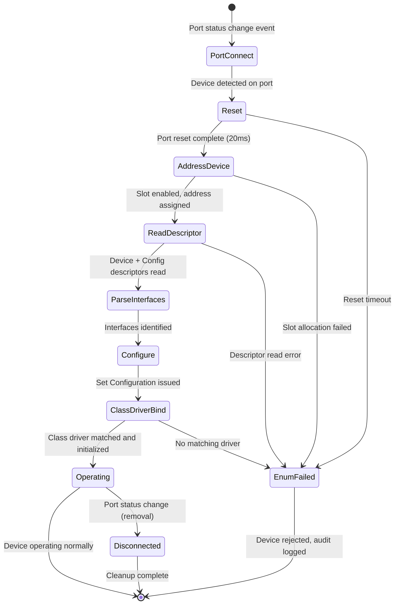
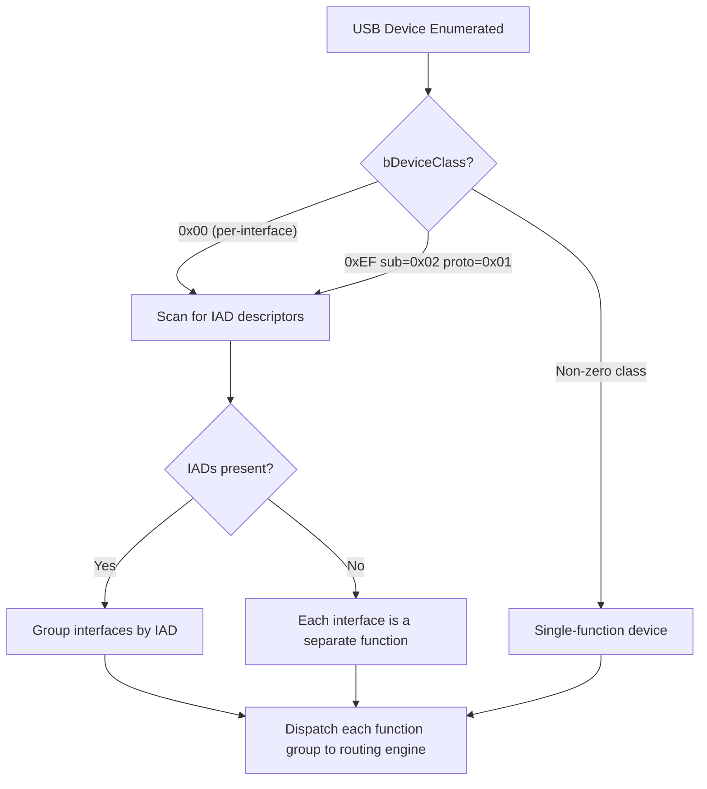
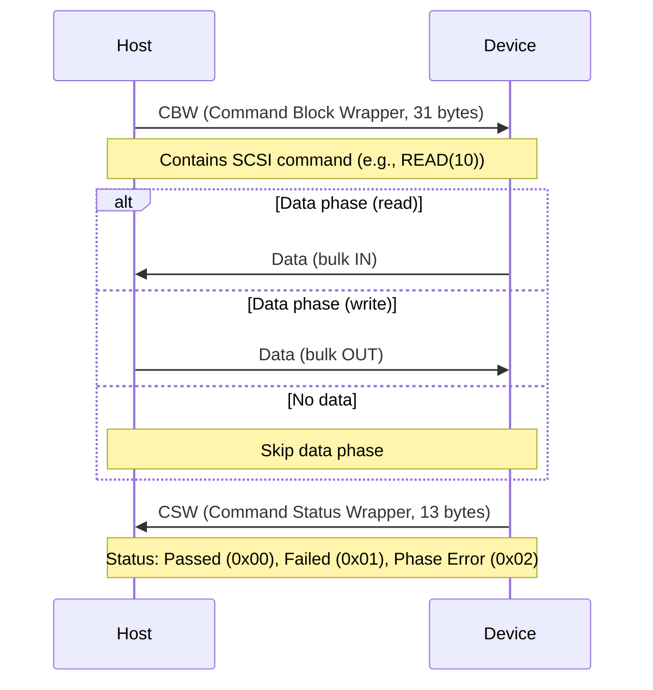
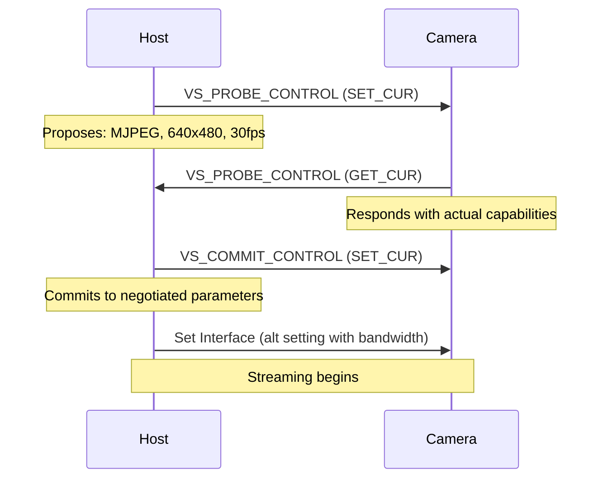
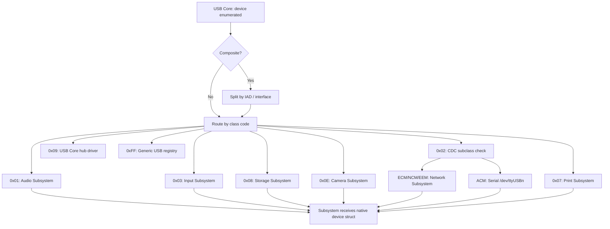

# AIOS USB Device Enumeration and Class Drivers

Part of: [usb.md](../usb.md) — USB Subsystem
**Related:** [controller.md](./controller.md) — Host controller architecture, [hotplug.md](./hotplug.md) — Hub enumeration and hotplug, [security.md](./security.md) — Descriptor validation and device trust

-----

## 3. Device Enumeration

USB device enumeration is the process by which the host controller discovers a newly connected device, reads its descriptors, assigns it an address, selects a configuration, and binds it to the appropriate class driver. Every USB device — from a simple keyboard to a composite webcam-with-microphone — goes through this same sequence. The enumeration engine runs in the USB core layer and coordinates with the host controller (xHCI or DWC2) via the `UsbHostController` trait (see [controller.md](./controller.md) §2).

### 3.1 Enumeration State Machine

When a device connects to a USB port, the host controller detects a change in the port's electrical state and generates a port status change event. The enumeration engine processes this event through a ten-step state machine:



The full enumeration sequence, from port status change event to operating device:

```text
1.  Port status change event: device connected
2.  Reset the port (10ms reset signal + 10ms recovery time)
3.  Read device speed from port status register (Low/Full/High/Super)
4.  Assign a device address (Enable Slot command, then Address Device)
5.  Read Device Descriptor: first 8 bytes (to learn max packet size for EP0)
6.  Read Device Descriptor: full 18 bytes (vendor/product ID, class, etc.)
7.  Read Configuration Descriptor (variable length, contains all interfaces)
8.  Parse Interface Descriptors to identify device class per interface
9.  Configure the device (Set Configuration request)
10. Bind class driver(s): for each interface, match class/subclass/protocol
    and initialize the appropriate driver (HID, mass storage, audio, etc.)
```

Steps 5 and 6 are split because the initial Device Descriptor read uses a conservative max packet size (8 bytes for low-speed, 64 bytes for full/high/super-speed). After learning the actual `bMaxPacketSize0` from the first 8 bytes, the enumeration engine adjusts the control endpoint accordingly before reading the full descriptor.

```rust
/// Enumeration state tracked per port during device discovery.
pub enum EnumState {
    /// Waiting for port status change event.
    Idle,
    /// Port reset in progress, timer armed for 20ms.
    Resetting { port: u8, timeout_ticks: u64 },
    /// Slot assigned, reading device descriptor.
    Addressing { port: u8, slot_id: u8 },
    /// Device descriptor read, reading configuration descriptor.
    ReadingDescriptors { port: u8, slot_id: u8, device_desc: DeviceDescriptor },
    /// Configuration selected, binding class drivers.
    Configuring { port: u8, slot_id: u8, config: ConfigurationDescriptor },
    /// Device fully operational.
    Operating { port: u8, slot_id: u8, device: UsbDevice },
    /// Enumeration failed at some step.
    Failed { port: u8, reason: EnumError },
}

/// Errors that can occur during enumeration.
pub enum EnumError {
    /// Port reset did not complete within timeout.
    ResetTimeout,
    /// Host controller could not allocate a device slot.
    SlotAllocationFailed,
    /// Control transfer to read descriptor failed.
    DescriptorReadFailed,
    /// Descriptor data is malformed or violates length constraints.
    MalformedDescriptor,
    /// No class driver matches the device's interface(s).
    NoMatchingDriver,
    /// Device was rejected by the security policy.
    SecurityRejected,
}
```

**Timing.** The entire enumeration sequence completes in 50-200ms for a typical single-function device. Composite devices with many interfaces take longer due to additional descriptor reads. The enumeration engine enforces a 2-second overall timeout per device — if enumeration does not complete within that window, the device is marked as failed and an audit event is logged.

### 3.2 Descriptor Parsing and Validation

USB devices describe themselves through a hierarchy of descriptors. The enumeration engine reads and validates these descriptors to determine what the device is and how to communicate with it. All descriptor data comes from the device itself over the control endpoint (endpoint 0) — this is untrusted input and must be treated accordingly.

#### Descriptor Hierarchy

USB descriptors form a tree:

```text
Device Descriptor (18 bytes, exactly one per device)
  +-- Configuration Descriptor (variable length, one or more)
        +-- Interface Association Descriptor (optional, groups related interfaces)
        +-- Interface Descriptor (one per function)
              +-- Endpoint Descriptor (one per endpoint in the interface)
              +-- Class-specific Descriptors (HID report, audio format, etc.)
  +-- String Descriptors (optional, referenced by index)
```

**Device Descriptor** (18 bytes): The root descriptor, read first during enumeration.

```rust
/// USB Device Descriptor (USB 2.0 spec Table 9-8).
/// Always exactly 18 bytes.
#[repr(C, packed)]
pub struct DeviceDescriptor {
    /// Size of this descriptor (18).
    pub b_length: u8,
    /// Descriptor type (0x01 = Device).
    pub b_descriptor_type: u8,
    /// USB specification release number (BCD): 0x0200 = USB 2.0, 0x0300 = USB 3.0.
    pub bcd_usb: u16,
    /// Class code: 0x00 = per-interface, 0xEF = composite (IAD), 0xFF = vendor-specific.
    pub b_device_class: u8,
    /// Subclass code (meaning depends on class).
    pub b_device_sub_class: u8,
    /// Protocol code (meaning depends on class + subclass).
    pub b_device_protocol: u8,
    /// Maximum packet size for endpoint 0: 8, 16, 32, or 64 bytes.
    pub b_max_packet_size0: u8,
    /// Vendor ID (assigned by USB-IF).
    pub id_vendor: u16,
    /// Product ID (assigned by vendor).
    pub id_product: u16,
    /// Device release number (BCD, vendor-assigned).
    pub bcd_device: u16,
    /// Index of manufacturer string descriptor.
    pub i_manufacturer: u8,
    /// Index of product string descriptor.
    pub i_product: u8,
    /// Index of serial number string descriptor.
    pub i_serial_number: u8,
    /// Number of possible configurations.
    pub b_num_configurations: u8,
}
```

**Configuration Descriptor**: Variable-length, describes a complete device configuration including all interfaces and endpoints. The `w_total_length` field gives the total size of the configuration descriptor plus all subordinate descriptors — the host reads exactly this many bytes in a single control transfer.

```rust
/// USB Configuration Descriptor header (USB 2.0 spec Table 9-10).
/// The full configuration data is w_total_length bytes and contains
/// interface, endpoint, and class-specific descriptors inline.
#[repr(C, packed)]
pub struct ConfigurationDescriptor {
    pub b_length: u8,              // 9
    pub b_descriptor_type: u8,     // 0x02
    pub w_total_length: u16,       // Total bytes returned for this configuration
    pub b_num_interfaces: u8,      // Number of interfaces in this configuration
    pub b_configuration_value: u8, // Value to pass to Set Configuration
    pub i_configuration: u8,       // String descriptor index
    pub bm_attributes: u8,        // Self-powered, remote wakeup
    pub b_max_power: u8,          // Maximum power in 2mA units (USB 2.0) or 8mA units (USB 3.x)
}
```

**Interface Descriptor**: Identifies a single function within a configuration. The class/subclass/protocol triple determines which class driver handles this interface.

```rust
/// USB Interface Descriptor (USB 2.0 spec Table 9-12).
#[repr(C, packed)]
pub struct InterfaceDescriptor {
    pub b_length: u8,                // 9
    pub b_descriptor_type: u8,       // 0x04
    pub b_interface_number: u8,      // Zero-based interface index
    pub b_alternate_setting: u8,     // Alternate setting selector
    pub b_num_endpoints: u8,         // Number of endpoints (excluding EP0)
    pub b_interface_class: u8,       // Class code (see §5.1 routing table)
    pub b_interface_sub_class: u8,   // Subclass code
    pub b_interface_protocol: u8,    // Protocol code
    pub i_interface: u8,             // String descriptor index
}
```

**Endpoint Descriptor**: Defines a communication pipe between host and device.

```rust
/// USB Endpoint Descriptor (USB 2.0 spec Table 9-13).
#[repr(C, packed)]
pub struct EndpointDescriptor {
    pub b_length: u8,             // 7
    pub b_descriptor_type: u8,    // 0x05
    /// Endpoint address: bits[3:0] = endpoint number, bit 7 = direction (0=OUT, 1=IN).
    pub b_endpoint_address: u8,
    /// Transfer type: 0x00 = Control, 0x01 = Isochronous, 0x02 = Bulk, 0x03 = Interrupt.
    /// For iso endpoints, bits[3:2] = sync type, bits[5:4] = usage type.
    pub bm_attributes: u8,
    /// Maximum packet size for this endpoint (bytes).
    pub w_max_packet_size: u16,
    /// Polling interval: for interrupt endpoints in ms (full/low) or 2^(n-1) microframes (high);
    /// for isochronous endpoints, must be 1 (every microframe).
    pub b_interval: u8,
}
```

**String Descriptors**: UTF-16LE encoded strings referenced by index from other descriptors. String descriptor 0 returns the list of supported language IDs. String descriptors carry manufacturer name, product name, and serial number — useful for device identification and audit logging.

**HID Report Descriptors**: Variable-length binary encoding that describes the format of HID input and output reports. Unlike other descriptors, HID report descriptors use a compact encoding with short items (1-byte prefix) and long items (3-byte prefix). Each item specifies usage pages, collections, input/output/feature fields, logical ranges, and physical units. The HID report descriptor parser is described in [§4.1](#41-hid-human-interface-devices).

#### Descriptor Validation

All descriptor data originates from the device and is treated as untrusted input. The descriptor parser enforces the following validation rules:

| Check | What is validated | Defense against |
|---|---|---|
| Length consistency | `b_length` matches expected size for descriptor type; `w_total_length` bounds all nested descriptors | Buffer overread, heap overflow |
| Nested bounds | Each sub-descriptor offset + length fits within parent's `w_total_length` | Out-of-bounds parsing |
| Type field | `b_descriptor_type` matches expected value at each parsing position | Type confusion |
| Endpoint limits | `b_num_endpoints` <= 30 (EP0 is implicit); endpoint addresses unique within interface | Resource exhaustion |
| Interface limits | `b_num_interfaces` <= 32; interface numbers sequential | State machine confusion |
| Packet size | `w_max_packet_size` within spec limits for the endpoint type and device speed | DMA buffer overflow |
| String index | String descriptor indices validated before issuing GET_DESCRIPTOR requests | Infinite descriptor loops |
| Configuration count | `b_num_configurations` >= 1 and <= 8 | Enumeration stalls |

```rust
/// Validate a raw configuration descriptor blob.
/// Returns the parsed configuration or a validation error.
pub fn parse_configuration(raw: &[u8]) -> Result<ParsedConfiguration, DescriptorError> {
    if raw.len() < 9 {
        return Err(DescriptorError::TooShort);
    }

    let total_length = u16::from_le_bytes([raw[2], raw[3]]) as usize;
    if total_length > raw.len() || total_length > MAX_CONFIG_DESCRIPTOR_SIZE {
        return Err(DescriptorError::LengthMismatch);
    }

    let num_interfaces = raw[4];
    if num_interfaces == 0 || num_interfaces > MAX_INTERFACES_PER_CONFIG {
        return Err(DescriptorError::InvalidInterfaceCount);
    }

    // Walk sub-descriptors within bounds
    let mut offset = 9; // skip configuration descriptor header
    let mut interfaces = Vec::new();

    while offset + 2 <= total_length {
        let desc_len = raw[offset] as usize;
        let desc_type = raw[offset + 1];

        if desc_len < 2 || offset + desc_len > total_length {
            return Err(DescriptorError::NestedBoundsViolation);
        }

        match desc_type {
            DESCRIPTOR_TYPE_INTERFACE => {
                let iface = parse_interface(&raw[offset..offset + desc_len])?;
                interfaces.push(iface);
            }
            DESCRIPTOR_TYPE_ENDPOINT => {
                let ep = parse_endpoint(&raw[offset..offset + desc_len])?;
                if let Some(last_iface) = interfaces.last_mut() {
                    last_iface.endpoints.push(ep);
                }
            }
            _ => {
                // Class-specific or unknown descriptor — store as opaque bytes
                // for the class driver to parse later.
            }
        }

        offset += desc_len;
    }

    Ok(ParsedConfiguration { interfaces })
}
```

For additional fuzzing strategies targeting the descriptor parser, see [security.md](./security.md) §9.4.

### 3.3 Composite Device Splitting

A composite device is a single physical USB device that exposes multiple interfaces, each representing a different function. A webcam with a built-in microphone is the canonical example: it appears as one USB device but presents both a Video Class interface and an Audio Class interface. The USB subsystem splits composite devices so that each interface is dispatched independently through the routing engine (§5).

#### Detection

Composite devices are identified in two ways:

1. **Per-interface class codes.** The Device Descriptor has `bDeviceClass = 0x00`, indicating that class information is in the Interface Descriptors rather than at the device level. Each interface carries its own class/subclass/protocol triple.

2. **Interface Association Descriptors (IAD).** Some functions span multiple interfaces (e.g., USB Video Class uses a control interface and one or more streaming interfaces). The IAD groups related interfaces so the splitting logic treats them as a single logical function.

```rust
/// Interface Association Descriptor (USB 2.0 ECN, Table 9-Z).
/// Groups multiple interfaces into a single function.
#[repr(C, packed)]
pub struct InterfaceAssociationDescriptor {
    pub b_length: u8,              // 8
    pub b_descriptor_type: u8,     // 0x0B
    pub b_first_interface: u8,     // First interface number in the group
    pub b_interface_count: u8,     // Number of contiguous interfaces in the group
    pub b_function_class: u8,      // Class code for the function
    pub b_function_sub_class: u8,  // Subclass code
    pub b_function_protocol: u8,   // Protocol code
    pub i_function: u8,            // String descriptor index
}
```

#### Splitting Logic



When splitting a composite device, the USB subsystem creates a `UsbFunction` for each logical function (either a single interface or an IAD-grouped set of interfaces). Each `UsbFunction` carries the relevant subset of the device's endpoints and class-specific descriptors:

```rust
/// A logical function extracted from a USB device.
/// Single-function devices produce one UsbFunction.
/// Composite devices produce one UsbFunction per interface or IAD group.
pub struct UsbFunction {
    /// Reference to the parent USB device (for shared control endpoint).
    pub device: UsbDeviceHandle,
    /// Class/subclass/protocol identifying this function.
    pub class: UsbClassTriple,
    /// Interface number(s) owned by this function.
    pub interfaces: Vec<u8>,
    /// Endpoints associated with this function's interfaces.
    pub endpoints: Vec<EndpointDescriptor>,
    /// Class-specific descriptor data (opaque bytes for the class driver).
    pub class_descriptors: Vec<u8>,
}

/// USB class identification triple.
pub struct UsbClassTriple {
    pub class: u8,
    pub subclass: u8,
    pub protocol: u8,
}
```

Each `UsbFunction` is dispatched independently to the routing engine (§5.1), which matches it to the appropriate subsystem. The parent `UsbDevice` is shared across all functions — control transfers (e.g., Set Interface, class-specific requests) are serialized through the shared control endpoint.

-----

## 4. Device Class Drivers

Each USB device class has a dedicated driver that translates between the USB wire protocol and the AIOS subsystem interface. Class drivers sit between the USB core (which handles transport) and the destination subsystem (which handles the domain-specific logic). A class driver's responsibilities are:

- Parse class-specific descriptors to understand the device's capabilities
- Configure class-specific endpoints and transfer parameters
- Translate incoming data into subsystem-native events or streams
- Handle class-specific control requests (e.g., HID idle rate, audio volume)

### 4.1 HID (Human Interface Devices)

The HID class driver handles keyboards, mice, game controllers, Braille displays, switch access devices, and other human input peripherals. On Raspberry Pi hardware, HID over USB is the primary input path — there is no PS/2 or built-in keyboard. The HID driver is therefore critical to system usability from first boot.

#### HID Driver Structure

```rust
/// HID class driver instance, one per HID interface.
pub struct HidDriver {
    /// Handle to the parent USB device.
    device: UsbDevice,
    /// Interface number this driver is bound to.
    interface: u8,
    /// Parsed HID report descriptor — describes the format of input/output reports.
    report_descriptor: HidReportDescriptor,
    /// Interrupt IN endpoint for polling input reports from the device.
    interrupt_endpoint: EndpointAddress,
    /// Poll interval from endpoint descriptor (in milliseconds).
    poll_interval_ms: u8,
}

impl HidDriver {
    /// Parse an incoming HID input report into structured events.
    /// The report descriptor defines the layout — this method applies
    /// the parsed descriptor to interpret raw report bytes.
    pub fn parse_report(&self, report: &[u8]) -> Vec<InputEvent> {
        self.report_descriptor.parse(report)
    }
}
```

#### HID Report Descriptor Parsing

HID report descriptors use a compact binary encoding to describe the structure of input, output, and feature reports. Each item in the descriptor is either a short item (1-byte prefix encoding type and size) or a long item (3-byte prefix). Items are categorized as:

- **Main items**: Input, Output, Feature, Collection, End Collection. These define the actual data fields in reports.
- **Global items**: Usage Page, Logical Minimum/Maximum, Physical Minimum/Maximum, Report Size, Report Count, Report ID. These set context for subsequent Main items.
- **Local items**: Usage, Usage Minimum/Maximum, Designator Index, String Index. These modify the next Main item only.

```rust
/// Parsed HID report descriptor.
pub struct HidReportDescriptor {
    /// Input report fields (device-to-host data).
    pub input_fields: Vec<HidField>,
    /// Output report fields (host-to-device data, e.g., keyboard LEDs).
    pub output_fields: Vec<HidField>,
    /// Feature report fields (bidirectional configuration).
    pub feature_fields: Vec<HidField>,
    /// Whether the device uses report IDs (multiple report types).
    pub uses_report_ids: bool,
}

/// A single field within an HID report.
pub struct HidField {
    /// Usage page (e.g., 0x01 = Generic Desktop, 0x07 = Keyboard, 0x09 = Button).
    pub usage_page: u16,
    /// Usage ID or usage range within the page.
    pub usage: HidUsage,
    /// Bit offset of this field within the report.
    pub bit_offset: u32,
    /// Size of this field in bits.
    pub bit_size: u32,
    /// Number of values reported (Report Count).
    pub count: u32,
    /// Logical value range.
    pub logical_min: i32,
    pub logical_max: i32,
    /// Field flags: constant, variable, relative, wrap, nonlinear, etc.
    pub flags: HidFieldFlags,
}
```

#### Boot Protocol vs. Report Protocol

HID defines two operating modes:

- **Boot protocol**: A fixed, simple report format. Keyboards send 8-byte reports (1 byte modifier keys, 1 byte reserved, 6 bytes keycodes). Mice send 3-byte reports (1 byte buttons, 1 byte X delta, 1 byte Y delta). Boot protocol requires no report descriptor parsing — the format is hardcoded.

- **Report protocol**: The device's native format, described by the HID report descriptor. More expressive: supports NKRO (N-key rollover), high-resolution scroll wheels, analog axes, multiple report types, and arbitrary field layouts.

The HID driver starts in boot protocol during early system boot (when the report descriptor parser may not yet be available) and switches to report protocol after full initialization. The `Set_Protocol` control request (class-specific) performs the switch.

#### Device Types

**Keyboards.** Boot protocol report: modifier keys in byte 0 (each bit: LCtrl, LShift, LAlt, LGui, RCtrl, RShift, RAlt, RGui), reserved byte 1, up to 6 simultaneous keycodes in bytes 2-7. Report protocol enables NKRO (bitmap of all keys rather than 6-key limit). Output report controls LEDs: Num Lock, Caps Lock, Scroll Lock, Compose, Kana.

**Mice.** Boot protocol report: button state in byte 0 (bit 0 = left, bit 1 = right, bit 2 = middle), X displacement (signed byte), Y displacement (signed byte). Report protocol adds: high-resolution X/Y (16-bit), scroll wheel (vertical and horizontal), additional buttons (up to 16).

**Game controllers.** Report protocol only (no boot protocol). Typical fields: buttons bitmap (8-32 buttons), left stick X/Y (signed 16-bit), right stick X/Y (signed 16-bit), triggers (unsigned 8 or 16-bit), D-pad (hat switch, 4-bit). The report descriptor varies per controller — the HID driver's generic field parser handles any layout conforming to the HID specification.

#### Input Latency

USB HID devices poll at their declared interval — typically 1-8ms for keyboards, 1ms for gaming mice with high polling rates. The total input latency chain:

```text
USB poll interval (1-8ms)
  --> xHCI interrupt/event ring
  --> IRQ to kernel
  --> HAL input event
  --> IPC to compositor
  --> Compositor frame
  --> Display scanout
------------------------------
Target: < 16ms total (keyboard-to-pixel on a 60Hz display)
```

The scheduler reserves RT-class priority for the USB interrupt handler and HID report processing to minimize the kernel-side contribution to this latency chain.

### 4.2 Mass Storage

The USB Mass Storage Class (MSC) provides block-level storage access over USB. Flash drives, external hard drives, and card readers use this class. The mass storage driver wraps SCSI commands inside USB transport, providing a block device interface that integrates with the AIOS storage subsystem.

#### Bulk-Only Transport (BOT)

The primary transport protocol for USB mass storage. Every I/O operation follows a three-phase sequence:



```rust
/// Command Block Wrapper — wraps a SCSI command for USB transport.
#[repr(C, packed)]
pub struct CommandBlockWrapper {
    /// Signature: 0x43425355 ("USBC").
    pub d_cbw_signature: u32,
    /// Tag matching this CBW to its CSW.
    pub d_cbw_tag: u32,
    /// Number of bytes the host expects to transfer in the data phase.
    pub d_cbw_data_transfer_length: u32,
    /// Direction: bit 7 = 0 (OUT/write), 1 (IN/read).
    pub bm_cbw_flags: u8,
    /// Target LUN (logical unit number), bits[3:0].
    pub b_cbw_lun: u8,
    /// Length of the SCSI command block (1-16 bytes).
    pub b_cbw_cb_length: u8,
    /// SCSI command block (variable length, padded to 16 bytes).
    pub cbwcb: [u8; 16],
}

/// Command Status Wrapper — device's response to a CBW.
#[repr(C, packed)]
pub struct CommandStatusWrapper {
    /// Signature: 0x53425355 ("USBS").
    pub d_csw_signature: u32,
    /// Tag matching this CSW to its CBW.
    pub d_csw_tag: u32,
    /// Difference between expected and actual data transferred.
    pub d_csw_data_residue: u32,
    /// Status: 0x00 = Passed, 0x01 = Failed, 0x02 = Phase Error.
    pub b_csw_status: u8,
}
```

#### Key SCSI Commands

| Command | Opcode | Purpose |
|---|---|---|
| TEST UNIT READY | `0x00` | Check if the device is ready for I/O |
| INQUIRY | `0x12` | Read device identification (vendor, product, revision) |
| READ CAPACITY(10) | `0x25` | Read total block count and block size |
| READ(10) | `0x28` | Read blocks from the device |
| WRITE(10) | `0x2A` | Write blocks to the device |
| REQUEST SENSE | `0x03` | Read error information after a failed command |
| MODE SENSE(6) | `0x1A` | Read device parameters (write-protect status, caching) |

#### UAS (USB Attached SCSI)

UAS is the USB 3.x optimized mass storage protocol. Instead of the sequential CBW-Data-CSW cycle of BOT, UAS uses multiple USB streams to pipeline commands:

- **Command pipe** (bulk OUT, stream): sends SCSI commands wrapped in Command IUs (Information Units)
- **Status pipe** (bulk IN, stream): receives status and sense data
- **Data-IN pipe** (bulk IN, stream): reads data from device
- **Data-OUT pipe** (bulk OUT, stream): writes data to device

UAS allows multiple SCSI commands to be in flight simultaneously, eliminating the head-of-line blocking inherent in BOT. On USB 3.x hardware, UAS provides significantly higher throughput than BOT for random I/O workloads.

#### Mass Storage Driver

```rust
/// USB Mass Storage class driver.
pub struct MassStorageDriver {
    /// USB device handle.
    device: UsbDeviceHandle,
    /// Interface number for the mass storage interface.
    interface: u8,
    /// Bulk OUT endpoint (host-to-device: commands and write data).
    bulk_out: EndpointAddress,
    /// Bulk IN endpoint (device-to-host: read data and status).
    bulk_in: EndpointAddress,
    /// Transport protocol: BOT or UAS.
    transport: MassStorageTransport,
    /// Logical block size (typically 512 bytes).
    block_size: u32,
    /// Total number of logical blocks.
    block_count: u64,
    /// CBW tag counter for matching commands to responses.
    next_tag: u32,
    /// Whether the device is write-protected.
    write_protected: bool,
}

pub enum MassStorageTransport {
    /// Bulk-Only Transport (USB 2.0 and fallback).
    Bot,
    /// USB Attached SCSI (USB 3.x optimized).
    Uas { streams: UasStreams },
}
```

#### Storage Subsystem Integration

The mass storage driver presents a block device interface to the AIOS storage subsystem. The Block Engine (see [spaces/block-engine.md](../../storage/spaces/block-engine.md)) can format and mount USB storage devices just as it does the primary VirtIO-blk device. The storage subsystem manages filesystem metadata; the mass storage driver handles only block-level I/O.

On device removal, the mass storage driver coordinates graceful unmount: pending I/O completes or fails with an error, dirty buffers are flushed if the device is still reachable, and the Block Engine is notified to release the device. If the user removes a device with unflushed writes, the audit ring logs a warning for the user's attention.

### 4.3 Audio (USB Audio Class)

The USB Audio Class (UAC) handles headsets, microphones, speakers, audio interfaces, and other USB audio devices. For full coverage of the audio subsystem including mixing, scheduling, and privacy controls, see [audio/drivers.md](../audio/drivers.md) §5.6. This section covers the USB-specific aspects.

#### USB Audio Class 2.0

USB Audio Class 2.0 (UAC2) is the standard for USB audio devices. UAC2 defines three types of interfaces per audio function:

- **Audio Control (AC) interface**: Describes the device topology — input/output terminals, feature units (volume, mute, EQ), mixer units, selector units. No data flows through this interface; it is used only for control requests.
- **Audio Streaming (AS) interface**: Carries the actual audio samples. Each AS interface has one isochronous endpoint for real-time audio data. Multiple alternate settings allow selecting different sample rates and bit depths without reconfiguration.
- **MIDI Streaming interface** (optional): Carries MIDI events for devices that include MIDI I/O.

#### Isochronous Transfers

Audio data flows over isochronous endpoints with guaranteed bandwidth. USB organizes time into 1ms frames (full/high speed) or 125us microframes (high speed). At 48 kHz stereo 16-bit:

```text
48000 samples/sec * 2 channels * 2 bytes/sample = 192000 bytes/sec
192000 / 1000 frames/sec = 192 bytes per USB frame
```

Isochronous transfers have no retransmission — if a frame is corrupted, it is lost. The audio subsystem's buffer management absorbs occasional frame losses without audible artifacts.

#### Adaptive Rate Feedback

USB audio devices have their own clock crystals, which may not be perfectly synchronized with the host's clock. Over time, this drift causes buffer underruns or overruns. UAC2 addresses this with a feedback endpoint: the device periodically reports its actual sample consumption rate, and the host adjusts the number of samples per frame accordingly.

```rust
/// USB Audio Class device, created by the USB subsystem
/// and handed to the audio subsystem via device_added().
pub struct UsbAudioDevice {
    /// USB device handle (from USB subsystem).
    usb: UsbDeviceHandle,
    /// Audio streaming interfaces (one per endpoint direction).
    streaming_interfaces: Vec<UsbAudioStreamInterface>,
    /// Audio control interface (volume, mute, etc.).
    control_interface: UsbAudioControlInterface,
    /// Isochronous endpoint for real-time audio data.
    iso_endpoint: UsbIsoEndpoint,
    /// Feedback endpoint (adaptive rate: device tells host its actual clock).
    feedback_endpoint: Option<UsbIsoEndpoint>,
    /// Descriptor-reported audio formats (sample rate, bit depth, channels).
    formats: Vec<AudioFormat>,
}
```

#### Privacy Controls

USB Audio Class defines a Mute Control feature unit in the audio control interface. The audio driver reads the mute state on each capture callback. Devices with a hardware mute button report state changes via an interrupt endpoint on the control interface. See [audio/drivers.md](../audio/drivers.md) §5.7 for the `AudioInputPrivacy` trait that all capture-capable drivers implement.

### 4.4 Video (USB Video Class)

The USB Video Class (UVC) handles webcams, document cameras, and other USB video capture devices. UVC 1.5 is the target specification.

#### UVC Architecture

Like UAC, UVC uses separate control and streaming interfaces:

- **Video Control (VC) interface**: Describes the device topology — camera terminal, processing unit (brightness, contrast, white balance), selector unit (for multi-sensor devices), extension units (vendor-specific). Supports both auto and manual control via control requests.
- **Video Streaming (VS) interface**: Carries video frames. Uses isochronous transfers for real-time streaming or bulk transfers for still image capture. Multiple alternate settings provide different bandwidth allocations.

#### Format Negotiation

UVC uses a probe/commit mechanism to negotiate video format, resolution, and frame rate:



The probe request proposes desired parameters. The device responds with what it can actually deliver (it may adjust frame rate down or select a different resolution). The host reviews the response and either commits to it or probes again with different parameters.

#### Supported Formats

| Format | Type | Bandwidth (640x480@30fps) | Bandwidth (1080p@30fps) |
|---|---|---|---|
| MJPEG | Compressed | ~15 Mbps | ~40 Mbps |
| YUY2 | Uncompressed | ~147 Mbps | ~995 Mbps |
| NV12 | Uncompressed (planar) | ~110 Mbps | ~746 Mbps |
| H.264 | Compressed (UVC 1.5) | ~5 Mbps | ~15 Mbps |

MJPEG is the most common format for USB webcams — it provides acceptable quality at reasonable bandwidth. Uncompressed formats (YUY2, NV12) require USB 3.x bandwidth for resolutions above 640x480. H.264 encoding in the device reduces bandwidth but requires decoder support on the host.

#### Video Class Driver

```rust
/// USB Video Class driver.
pub struct UvcDriver {
    /// USB device handle.
    device: UsbDeviceHandle,
    /// Video control interface (camera controls).
    control_interface: UvcControlInterface,
    /// Video streaming interface (frame data).
    streaming_interface: UvcStreamInterface,
    /// Isochronous or bulk endpoint for frame data.
    video_endpoint: EndpointAddress,
    /// Negotiated format.
    current_format: Option<UvcFormat>,
    /// Frame buffer for assembling multi-packet frames.
    frame_buffer: Vec<u8>,
    /// Camera capabilities parsed from descriptors.
    capabilities: UvcCapabilities,
}

/// Negotiated video format.
pub struct UvcFormat {
    /// Pixel format (MJPEG, YUY2, NV12, H264).
    pub format: VideoPixelFormat,
    /// Frame width in pixels.
    pub width: u16,
    /// Frame height in pixels.
    pub height: u16,
    /// Frame interval in 100ns units (e.g., 333333 = 30fps).
    pub frame_interval: u32,
    /// Maximum video frame size in bytes.
    pub max_frame_size: u32,
}

pub struct UvcCapabilities {
    /// Supported formats with their resolutions and frame rates.
    pub formats: Vec<UvcFormatDescriptor>,
    /// Camera controls: auto-exposure, white balance, focus, zoom.
    pub controls: UvcControlFlags,
    /// Whether the device supports still image capture.
    pub still_capture: bool,
}
```

#### Frame Delivery

UVC frames arrive as a series of USB packets. Each packet begins with a UVC payload header (2-12 bytes) containing frame ID, end-of-frame marker, and error flags. The driver assembles packets into complete frames and delivers them to the camera subsystem. Corrupted frames (indicated by error flags in the payload header) are dropped silently.

### 4.5 Network (CDC Ethernet)

The Communications Device Class (CDC) provides network connectivity over USB. USB Ethernet adapters, smartphone tethering, and embedded network interfaces use CDC subclasses.

#### CDC Subclasses

**CDC ECM (Ethernet Control Model).** Standard Ethernet framing over USB. Each Ethernet frame is sent as a single bulk transfer. Simple and widely compatible, but limited to one frame per USB transfer — inefficient for high-throughput scenarios.

**CDC NCM (Network Control Model).** Optimized for USB 3.x. Multiple Ethernet frames are aggregated into a single Network Transfer Block (NTB), reducing USB transaction overhead. An NTB contains:
- NTH (NTB Header): signature, sequence number, block length
- NDP (NTB Datagram Pointer): offsets and lengths of each datagram within the NTB
- Datagrams: the actual Ethernet frames, packed contiguously

NCM can aggregate 30-60 Ethernet frames per USB transfer, dramatically improving throughput on USB 3.x.

**CDC EEM (Ethernet Emulation Model).** A simpler alternative to ECM that eliminates the separate notification endpoint. Frames are wrapped in a 2-byte EEM header (type + length). Useful for embedded devices where simplicity matters more than features.

**RNDIS (Remote NDIS).** Microsoft's proprietary USB networking protocol, widely used for Windows compatibility. RNDIS wraps Ethernet frames in RNDIS message headers. AIOS supports RNDIS for interoperability with devices that only offer RNDIS (some Android phones in tethering mode, older USB Ethernet adapters).

#### Network Class Driver

```rust
/// CDC Ethernet class driver (ECM/NCM/EEM/RNDIS).
pub struct CdcNetDriver {
    /// USB device handle.
    device: UsbDeviceHandle,
    /// CDC communication interface (control and notifications).
    comm_interface: u8,
    /// CDC data interface (bulk IN/OUT for Ethernet frames).
    data_interface: u8,
    /// Bulk IN endpoint (device-to-host: received frames).
    bulk_in: EndpointAddress,
    /// Bulk OUT endpoint (host-to-device: transmitted frames).
    bulk_out: EndpointAddress,
    /// Interrupt endpoint for link state notifications (ECM/NCM).
    notification_endpoint: Option<EndpointAddress>,
    /// CDC variant determining framing protocol.
    variant: CdcVariant,
    /// MAC address (from CDC Ethernet Networking Functional Descriptor or capability policy).
    mac_address: [u8; 6],
    /// Maximum segment size.
    max_segment_size: u16,
    /// Link state (up/down), updated via notification endpoint.
    link_up: bool,
}

pub enum CdcVariant {
    /// Ethernet Control Model — one frame per transfer.
    Ecm,
    /// Network Control Model — aggregated frames in NTBs.
    Ncm { max_ntb_size: u32, ntb_sequence: u16 },
    /// Ethernet Emulation Model — EEM header framing.
    Eem,
    /// Remote NDIS — Microsoft compatibility.
    Rndis { max_transfer_size: u32 },
}
```

#### Network Subsystem Integration

The CDC network driver presents a standard network device interface to the AIOS networking subsystem. The smoltcp TCP/IP stack (see [networking/stack.md](../networking/stack.md) §4.1) treats USB Ethernet adapters identically to VirtIO-Net or platform-specific NICs. Frame transmission and reception go through the same buffer management and zero-copy paths.

MAC address assignment follows a priority order: the CDC Ethernet Networking Functional Descriptor in the USB configuration (if present), then the device's serial number hashed to a locally-administered MAC, and finally a random locally-administered MAC. The capability system controls which agents can bind to network interfaces — see [networking/security.md](../networking/security.md) §6.1.

### 4.6 Serial (CDC ACM)

The CDC Abstract Control Model (ACM) provides USB serial port functionality. Debug consoles, embedded device communication, GPS receivers, and microcontroller programming tools use CDC ACM.

#### Protocol

CDC ACM uses three endpoints:

- **Bulk IN**: Serial data from device to host
- **Bulk OUT**: Serial data from host to device
- **Interrupt IN**: Notifications (carrier detect, ring signal, serial state changes)

Line coding parameters are configured via class-specific control requests:

```rust
/// Serial line coding parameters, sent via SET_LINE_CODING control request.
#[repr(C, packed)]
pub struct LineCoding {
    /// Baud rate in bits per second.
    pub dw_dte_rate: u32,
    /// Stop bits: 0 = 1 stop bit, 1 = 1.5 stop bits, 2 = 2 stop bits.
    pub b_char_format: u8,
    /// Parity: 0 = None, 1 = Odd, 2 = Even, 3 = Mark, 4 = Space.
    pub b_parity_type: u8,
    /// Data bits: 5, 6, 7, 8, or 16.
    pub b_data_bits: u8,
}
```

Control signals (DTR, RTS) are set via SET_CONTROL_LINE_STATE. The device reports CTS, DSR, RI, and DCD via the SERIAL_STATE notification on the interrupt endpoint.

#### Serial Class Driver

```rust
/// CDC ACM (serial) class driver.
pub struct CdcSerialDriver {
    /// USB device handle.
    device: UsbDeviceHandle,
    /// Communication interface (control requests and notifications).
    comm_interface: u8,
    /// Data interface (bulk IN/OUT for serial data).
    data_interface: u8,
    /// Bulk IN endpoint (device-to-host serial data).
    bulk_in: EndpointAddress,
    /// Bulk OUT endpoint (host-to-device serial data).
    bulk_out: EndpointAddress,
    /// Interrupt endpoint for serial state notifications.
    notification_endpoint: EndpointAddress,
    /// Current line coding (baud rate, parity, etc.).
    line_coding: LineCoding,
    /// Control line state: bit 0 = DTR, bit 1 = RTS.
    control_lines: u8,
    /// Receive buffer for incoming serial data.
    rx_buffer: RingBuffer<u8, 4096>,
    /// Transmit buffer for outgoing serial data.
    tx_buffer: RingBuffer<u8, 4096>,
}
```

#### POSIX Bridge

CDC ACM devices are exposed through the POSIX compatibility layer as `/dev/ttyUSBn` (where `n` is assigned sequentially). Standard POSIX serial APIs apply:

- `open("/dev/ttyUSB0", O_RDWR)` — open the serial port
- `tcsetattr()` / `tcgetattr()` — configure line coding (baud rate, parity, etc.)
- `read()` / `write()` — data transfer
- `ioctl(TIOCMSET)` / `ioctl(TIOCMGET)` — control signals (DTR, RTS, CTS, DSR)

See [posix.md](../posix.md) §9 for details on the device node translation layer.

### 4.7 Accessibility HID Devices

USB HID encompasses several device types that are critical for accessibility. These devices use standard HID protocols but with specialized usage pages and report formats. For full coverage of accessibility features, see [accessibility.md](../../experience/accessibility.md) §4-5.

#### Braille Displays

Refreshable Braille displays use USB HID usage page 0x41 (Braille Display). A Braille display presents a row of tactile cells (typically 14, 20, 40, or 80 cells), each representing one Braille character as a pattern of raised dots. The display also provides input via routing keys (one per cell), navigation keys, and often a Braille keyboard for text entry.

Detection during USB enumeration:

```rust
/// Detect Braille display on USB bus.
/// HID usage page 0x41 = Braille Display.
pub fn detect_braille(usb: &UsbSubsystem) -> Option<BrailleDevice> {
    let devices = usb.find_devices(UsbHidUsagePage::Braille);
    devices.first().map(|dev| {
        let cell_count = dev.descriptor().braille_cell_count();
        BrailleDevice::new(dev.clone(), cell_count)
    })
}
```

The HID output report sends dot patterns to the display (one byte per cell, 8 dots). The HID input report carries routing key presses, navigation events, and chord input from the Braille keyboard. See [accessibility.md](../../experience/accessibility.md) §4.2 for the `BrailleDriver` struct and translation logic.

#### Switch Access Devices

Switch access devices are specialized USB HID peripherals for users who cannot use conventional input devices. They present as HID devices with one or more buttons. Common configurations:

- **Single-switch**: One button. The system auto-scans through UI elements; the user presses to select.
- **Two-switch**: One button advances the highlight, another selects.
- **Multi-switch**: Directional navigation plus select.

Switch devices are detected via USB HID enumeration and matched by their usage page:

```rust
/// Detect switch access devices on USB bus.
pub fn detect_switches(usb: &UsbSubsystem) -> Vec<SwitchDevice> {
    let hid_switches = usb.find_devices(UsbHidUsagePage::Switch);
    hid_switches.into_iter().map(|dev| {
        SwitchDevice::from_hid(dev)
    }).collect()
}
```

Keyboard keys can also be mapped as switches for users who can press one or two specific keys but cannot operate a full keyboard. See [accessibility.md](../../experience/accessibility.md) §5 for the `SwitchScanEngine` and scan pattern details.

-----

## 5. Subsystem Routing

The USB subsystem's primary role after enumeration is routing: identifying which destination subsystem should handle each device function and delivering it there. This routing logic is what makes USB a **meta-subsystem** rather than a device class — USB does not process device data itself; it connects devices to the subsystems that do.

### 5.1 Class-to-Subsystem Dispatch

When a USB device is enumerated (or a composite device is split into functions), each `UsbFunction` is matched to a destination subsystem based on its class code. The routing table maps USB class codes to AIOS subsystems:

| USB Class Code | Class Name | Destination Subsystem | Driver |
|---|---|---|---|
| `0x01` | Audio | Audio Subsystem | `UsbAudioDevice` (§4.3) |
| `0x02` | CDC (Communications) | Network Subsystem (ECM/NCM) or Serial (`/dev/ttyUSBn`) | `CdcNetDriver` (§4.5) / `CdcSerialDriver` (§4.6) |
| `0x03` | HID | Input Subsystem | `HidDriver` (§4.1) |
| `0x07` | Printer | Print Subsystem | `UsbPrintDriver` |
| `0x08` | Mass Storage | Storage Subsystem | `MassStorageDriver` (§4.2) |
| `0x09` | Hub | USB Core (self-managed) | Hub driver ([hotplug.md](./hotplug.md) §6) |
| `0x0E` | Video | Camera Subsystem | `UvcDriver` (§4.4) |
| `0xFF` | Vendor-Specific | Generic USB (§5.2) | Raw access |

For CDC (class `0x02`), the subclass code determines the routing: subclass `0x06` (ECM), `0x0D` (NCM), and `0x0C` (EEM) route to the network subsystem; subclass `0x02` (ACM) routes to serial.

The dispatch is implemented in `UsbSubsystem::device_added()`, which the subsystem framework calls when the USB core reports a new device:

```rust
impl Subsystem for UsbSubsystem {
    fn device_added(&mut self, desc: HardwareDescriptor) -> Result<()> {
        let usb_desc = UsbDescriptor::parse(&desc)?;

        match usb_desc.class {
            UsbClass::Audio => {
                let audio_dev = usb_audio::create_device(usb_desc)?;
                audio_subsystem.device_added(audio_dev)?;
            }
            UsbClass::HID => {
                let input_dev = usb_hid::create_device(usb_desc)?;
                input_subsystem.device_added(input_dev)?;
            }
            UsbClass::MassStorage => {
                let storage_dev = usb_storage::create_device(usb_desc)?;
                storage_subsystem.device_added(storage_dev)?;
            }
            UsbClass::Video => {
                let camera_dev = usb_video::create_device(usb_desc)?;
                camera_subsystem.device_added(camera_dev)?;
            }
            UsbClass::CdcEthernet => {
                let net_dev = usb_net::create_device(usb_desc)?;
                network_subsystem.device_added(net_dev)?;
            }
            UsbClass::CdcSerial => {
                let serial_dev = usb_serial::create_device(usb_desc)?;
                serial_subsystem.device_added(serial_dev)?;
            }
            UsbClass::Printer => {
                let print_dev = usb_print::create_device(usb_desc)?;
                print_subsystem.device_added(print_dev)?;
            }
            UsbClass::Hub => {
                // Hubs are self-managed by USB core
                self.hub_driver.add_hub(usb_desc)?;
            }
            UsbClass::Composite(interfaces) => {
                // Split composite device into per-interface functions
                for function in interfaces {
                    self.device_added(function.as_descriptor())?;
                }
            }
            _ => {
                // Unknown or vendor-specific class
                // Register as generic USB device for raw access
                self.device_registry.register_generic(usb_desc)?;
            }
        }

        Ok(())
    }
}
```

The destination subsystem receives a subsystem-native device struct (e.g., `AudioDevice`, `StorageDevice`). It does not see USB-specific details — the class driver wraps USB transport behind the subsystem's device trait. This means the audio subsystem treats a USB headset identically to a Bluetooth speaker or an HDMI audio output.

#### Dispatch Flow



### 5.2 Generic USB Device Access

Devices with unknown or vendor-specific class codes (class `0xFF`) do not match any standard class driver. These devices are registered in the USB device registry as generic USB devices. They are not routed to any subsystem automatically.

#### Raw USB Access

Agents with the `UsbRawAccess` capability can interact with generic USB devices directly by submitting control, bulk, interrupt, or isochronous transfers through the USB core API:

```rust
/// Capability required for raw USB device access.
pub struct UsbRawAccessCapability {
    /// Specific device(s) this capability grants access to.
    /// DeviceFilter::Any requires elevated trust level.
    pub device_filter: DeviceFilter,
    /// Allowed transfer types.
    pub allowed_transfers: TransferTypeFlags,
    /// Maximum transfer size per request.
    pub max_transfer_size: u32,
}

pub enum DeviceFilter {
    /// Access to a specific device by vendor/product ID.
    VendorProduct { vendor_id: u16, product_id: u16 },
    /// Access to a specific device by bus location.
    BusDevice { bus: u8, device: u8 },
    /// Access to any generic USB device (requires elevated trust).
    Any,
}
```

#### Use Cases

- **Firmware updaters**: Vendor tools that flash firmware to USB devices using vendor-specific control requests.
- **Proprietary hardware**: Devices with no standard class (specialized sensors, test equipment, custom peripherals) that require vendor-specific protocols.
- **Security scanners**: Tools that read USB device descriptors and firmware versions for vulnerability assessment.
- **Development tools**: USB protocol analyzers, debug probes, and JTAG adapters.

#### Security Constraints

Raw USB access bypasses the class driver abstraction and therefore requires explicit capability grants. The capability system enforces:

1. **Device specificity**: The `DeviceFilter` limits which devices the agent can access. An agent granted raw access to vendor `0x1234` product `0x5678` cannot access any other device.
2. **Transfer type limits**: The `allowed_transfers` field restricts which USB transfer types the agent can submit. A firmware updater might be limited to control transfers only.
3. **Size limits**: The `max_transfer_size` field prevents a compromised agent from submitting arbitrarily large DMA transfers.
4. **Audit logging**: Every raw USB transfer is logged to the USB audit space, including the agent ID, device, transfer type, endpoint, and data size.

See [security.md](./security.md) §9.2 for the full raw USB access security model and capability delegation rules.
