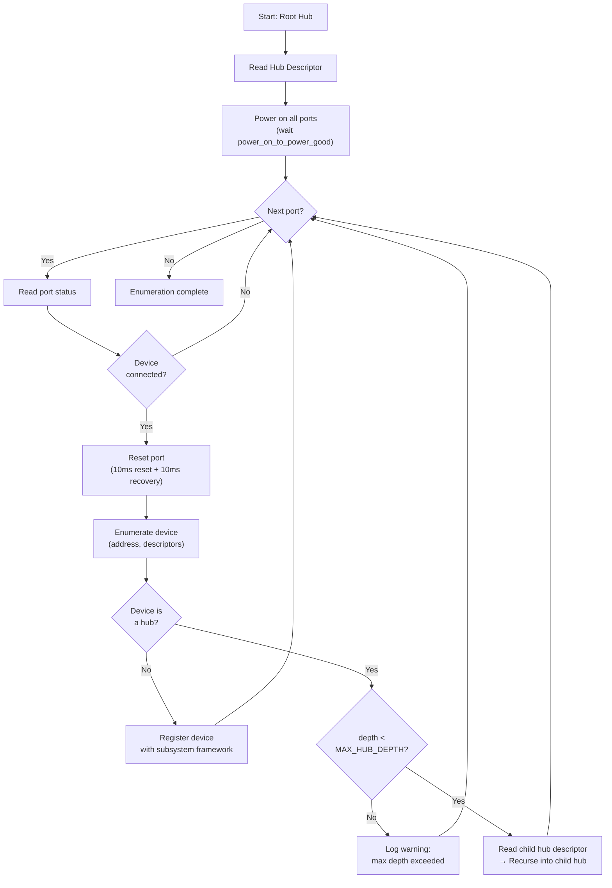
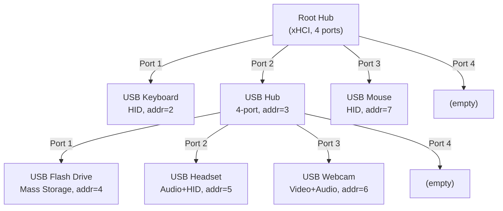
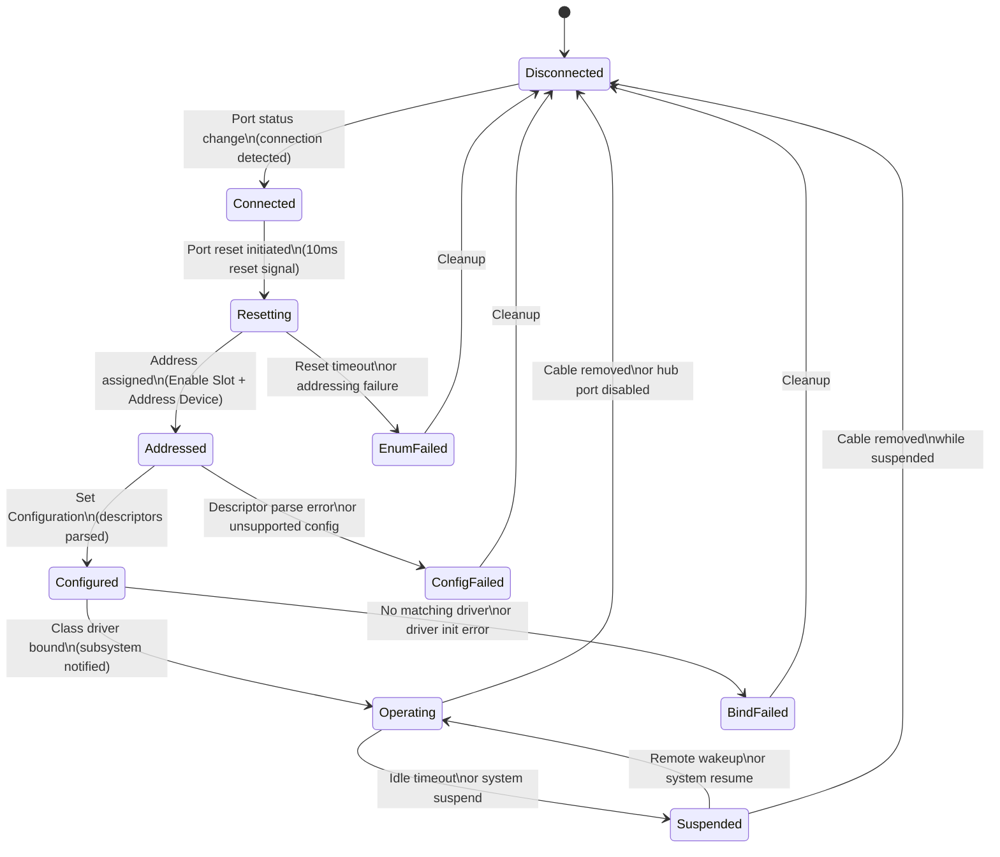

# AIOS USB Hotplug and Power Management

Part of: [usb.md](../usb.md) — USB Subsystem
**Related:** [controller.md](./controller.md) — Host controller architecture, [device-classes.md](./device-classes.md) — Device enumeration and class drivers, [security.md](./security.md) — Device trust and audit

-----

## 6. Hub Enumeration

USB hubs create tree topologies. A single root hub port can expand into dozens of downstream devices through cascaded hubs. The USB subsystem discovers this topology recursively, powers each port, and registers devices as they appear. Hub enumeration runs both at boot (initial tree discovery) and at runtime (hotplug events on hub ports).

### 6.1 Hub Descriptor and Port Power

When a hub is enumerated as a device (class code `0x09`), the USB subsystem reads its Hub Descriptor to learn the hub's topology and power characteristics:

```rust
/// USB Hub Descriptor (USB 2.0 spec Table 11-13, USB 3.x spec Table 10-3).
pub struct HubDescriptor {
    /// Number of downstream-facing ports on this hub.
    pub num_ports: u8,
    /// Hub characteristics bitmap.
    pub characteristics: HubCharacteristics,
    /// Time from port power-on to power good, in 2ms units.
    /// A value of 50 means 100ms (the USB spec minimum).
    pub power_on_to_power_good: u8,
    /// Maximum current drawn by the hub controller itself (mA).
    pub hub_controller_current: u8,
    /// Per-port removable device bitmap (one bit per port).
    pub device_removable: u32,
}

/// Hub characteristics flags (wHubCharacteristics field).
pub struct HubCharacteristics {
    /// Power switching mode: per-port or ganged (all ports share one switch).
    pub power_switching: PowerSwitchingMode,
    /// Whether the hub is part of a compound device.
    pub compound_device: bool,
    /// Over-current protection mode: per-port or global.
    pub overcurrent_mode: OvercurrentMode,
    /// TT think time for high-speed hubs (0=8 FS bit times, up to 3=32).
    pub tt_think_time: u8,
    /// Whether the hub supports port indicators (LEDs).
    pub port_indicators: bool,
}

pub enum PowerSwitchingMode {
    /// Each port's power can be controlled independently.
    PerPort,
    /// All ports share a single power switch (ganged).
    Ganged,
}
```

**Port power-on sequence:**

```text
1. Send SET_PORT_FEATURE(PORT_POWER) for each port
2. Wait power_on_to_power_good * 2ms (minimum 100ms per USB spec)
3. Read GET_PORT_STATUS for each port
4. If port status shows connection: proceed to enumeration
```

**Hub power modes** determine downstream power budget:

| Mode | Description | Per-Port Current | Constraints |
|---|---|---|---|
| Self-powered | Hub has its own power supply | Up to 500mA (USB 2.0) or 900mA (USB 3.x) per port | No bus power budget impact |
| Bus-powered | Hub draws all power from upstream port | 100mA per port, max 5 ports | Total hub draw limited to upstream port's budget (500mA for USB 2.0) |

Bus-powered hubs are common in low-cost peripherals (keyboard with extra ports, monitor USB pass-through). The USB subsystem tracks cumulative power draw through the topology to reject devices that would exceed the available budget (see [Section 8.4](#84-port-power-management)).

### 6.2 Recursive Tree Enumeration

The USB specification permits up to 5 levels of hub nesting (tier 1 is the root hub, tier 6 is the maximum depth for a device). The USB subsystem uses depth-first enumeration, matching the standard USB discovery order:

```rust
/// Maximum hub nesting depth (USB 2.0 spec Section 4.1.1).
const MAX_HUB_DEPTH: u8 = 5;

/// Recursively enumerate a hub and all devices beneath it.
fn enumerate_hub(
    controller: &mut dyn UsbHostController,
    hub: &UsbDevice,
    hub_descriptor: &HubDescriptor,
    depth: u8,
) -> Result<Vec<UsbDevice>, UsbError> {
    if depth > MAX_HUB_DEPTH {
        return Err(UsbError::MaxHubDepthExceeded);
    }

    let mut discovered = Vec::new();

    for port in 1..=hub_descriptor.num_ports {
        let status = controller.get_port_status(hub, port)?;

        if !status.connected {
            continue;
        }

        // Reset the port to move the device to the Default state
        controller.reset_port(hub, port)?;

        // Enumerate the device (assign address, read descriptors)
        let device = enumerate_device(controller, hub, port)?;

        if device.class == UsbClassCode::Hub {
            // Read the new hub's descriptor and recurse
            let child_hub_desc = read_hub_descriptor(controller, &device)?;
            power_on_hub_ports(controller, &device, &child_hub_desc)?;
            let children = enumerate_hub(
                controller,
                &device,
                &child_hub_desc,
                depth + 1,
            )?;
            discovered.extend(children);
        }

        discovered.push(device);
    }

    Ok(discovered)
}
```

**Topology discovery** follows this algorithm for each port on every hub, starting from the root hub:



**Example topology** after enumeration:



Depth-first is the standard approach because it follows the USB specification's enumeration model: each device must be fully addressed and configured before moving to the next port. Breadth-first would require tracking partially-enumerated devices across hub levels, adding complexity without benefit.

### 6.3 Hub Status Change Interrupts

After initial enumeration, hubs report port changes asynchronously via their interrupt IN endpoint. The hub driver schedules periodic interrupt transfers to poll for changes:

```rust
/// Hub interrupt IN transfer: one byte per 8 ports, plus one bit for hub status.
/// Bit 0 = hub status changed, Bit N = port N status changed (1-indexed).
pub struct HubStatusChangeBitmap {
    /// Raw bitmap bytes from the interrupt IN transfer.
    data: [u8; 4],
    /// Number of ports on this hub (determines valid bits).
    num_ports: u8,
}

impl HubStatusChangeBitmap {
    /// Check if a specific port has a pending status change.
    pub fn port_changed(&self, port: u8) -> bool {
        let bit_index = port as usize; // port 1 = bit 1
        let byte_index = bit_index / 8;
        let bit_offset = bit_index % 8;
        (self.data[byte_index] >> bit_offset) & 1 == 1
    }

    /// Check if the hub itself has a status change (overcurrent, etc.).
    pub fn hub_status_changed(&self) -> bool {
        self.data[0] & 1 == 1
    }
}
```

**Port status bits** returned by `GET_PORT_STATUS`:

| Bit | Name | Meaning |
|---|---|---|
| 0 | `PORT_CONNECTION` | Device is connected to this port |
| 1 | `PORT_ENABLE` | Port is enabled (USB 2.0 only; USB 3.x ports are always enabled) |
| 2 | `PORT_SUSPEND` | Port is in suspend state |
| 3 | `PORT_OVER_CURRENT` | Over-current condition detected |
| 4 | `PORT_RESET` | Port is being reset |
| 8 | `PORT_POWER` | Port has power applied |
| 9 | `PORT_LOW_SPEED` | Low-speed device attached (USB 2.0 hubs) |
| 10 | `PORT_HIGH_SPEED` | High-speed device attached (USB 2.0 hubs) |

**Change notification chain:**

```text
1. Hub interrupt IN endpoint fires (polled at hub's bInterval, typically 256ms)
2. xHCI event ring: Transfer Event with hub's interrupt endpoint
3. USB subsystem: parse status change bitmap
4. For each changed port:
   a. Read GET_PORT_STATUS + GET_PORT_STATUS_CHANGE
   b. Clear the change bits (SET_PORT_FEATURE(C_PORT_CONNECTION), etc.)
   c. If connection change: notify hotplug manager
   d. If overcurrent change: trigger power management response
5. Re-submit interrupt transfer for next change
```

The hub driver maintains an active interrupt transfer at all times. When the transfer completes (indicating a change), it processes all flagged ports and immediately re-submits the transfer. If the hub is disconnected, the transfer completes with an error and the hub driver cleans up.

-----

## 7. Hotplug State Machine

USB devices have a well-defined lifecycle from physical connection to operating state and back to disconnection. The USB subsystem tracks each device through this state machine and coordinates with the subsystem framework for class-specific behavior.

### 7.1 Device Lifecycle

Every USB device transitions through these states:



```rust
/// Current state of a USB device in the hotplug state machine.
pub enum UsbDeviceState {
    /// No device present on this port.
    Disconnected,
    /// Physical connection detected, not yet reset.
    Connected,
    /// Port reset in progress (10ms reset + 10ms recovery).
    Resetting,
    /// Device has a USB address but is not yet configured.
    Addressed,
    /// Device configuration selected, descriptors parsed.
    Configured,
    /// Class driver bound, device is fully operational.
    Operating,
    /// Device in USB suspend state (low power).
    Suspended,
    /// An error occurred during enumeration or configuration.
    Error(UsbDeviceError),
}

/// Errors that can occur during device lifecycle transitions.
pub enum UsbDeviceError {
    /// Port reset timed out or device did not respond.
    EnumerationFailed,
    /// Descriptor parsing failed or device configuration is unsupported.
    ConfigurationFailed,
    /// No class driver matched, or driver initialization failed.
    DriverBindFailed,
    /// Device reported an error during operation.
    DeviceError,
    /// Over-current condition forced device removal.
    OvercurrentShutdown,
}
```

**State transition timing:**

| Transition | Typical Duration | Maximum |
|---|---|---|
| Connected to Resetting | Immediate | Immediate |
| Resetting to Addressed | 20ms (10ms reset + 10ms recovery) | 50ms |
| Addressed to Configured | 5-50ms (descriptor reads) | 5000ms (spec maximum) |
| Configured to Operating | 1-100ms (driver init) | 5000ms |
| Operating to Suspended | Configurable idle timeout | 30s default |
| Suspended to Operating | 1-20ms (resume signaling) | 50ms |

### 7.2 Subsystem Framework Integration

The USB subsystem implements the `Subsystem` trait from the subsystem framework ([subsystem-framework.md](../subsystem-framework.md) §4.1). USB is a meta-subsystem: when a device reaches the Configured state, the USB subsystem identifies the device class and routes it to the appropriate destination subsystem.

```rust
impl Subsystem for UsbSubsystem {
    const ID: SubsystemId = SubsystemId::Usb;
    type Capability = UsbCapability;
    type Device = UsbDeviceHandle;
    type Session = UsbSession;
    type AuditEvent = UsbAuditEvent;

    fn device_added(&mut self, desc: HardwareDescriptor) -> Result<UsbDeviceHandle> {
        // Parse USB descriptors, identify class
        let usb_desc = UsbDescriptor::parse(&desc)?;

        // Route to destination subsystem based on device class
        match usb_desc.primary_class() {
            UsbClassCode::Audio       => audio_subsystem.device_added(usb_desc.as_audio())?,
            UsbClassCode::Hid         => input_subsystem.device_added(usb_desc.as_hid())?,
            UsbClassCode::MassStorage => storage_subsystem.device_added(usb_desc.as_storage())?,
            UsbClassCode::Video       => camera_subsystem.device_added(usb_desc.as_video())?,
            UsbClassCode::CdcData     => network_subsystem.device_added(usb_desc.as_network())?,
            UsbClassCode::Printer     => print_subsystem.device_added(usb_desc.as_printer())?,
            UsbClassCode::Composite   => {
                // Split composite device into per-interface descriptors and recurse
                for interface in usb_desc.interfaces() {
                    self.device_added(interface.as_hardware_descriptor())?;
                }
            }
            _ => {
                // Unknown class: register as generic USB device
                self.registry.register_generic(usb_desc)?;
            }
        }

        Ok(UsbDeviceHandle::new(usb_desc))
    }

    fn device_removed(&mut self, device_id: DeviceId) -> Result<()> {
        // Identify which subsystem(s) own this device's interfaces
        let routing = self.routing_table.get(device_id)?;

        for route in routing.destinations() {
            route.subsystem.device_removed(route.device_id)?;
        }

        // Clean up USB-level state
        self.device_table.remove(device_id);
        self.routing_table.remove(device_id);

        Ok(())
    }
}
```

**Integration with `HardwareEvent`:**

| Event | Source | USB Subsystem Action |
|---|---|---|
| `HardwareEvent::Added` | Hub status change interrupt | Enumerate device, parse descriptors, route to class subsystem |
| `HardwareEvent::Removed` | Hub status change interrupt | Cancel transfers, notify class subsystem, release resources |
| `HardwareEvent::StateChanged` | Controller error or port status | Update device state, notify class subsystem if needed |

**Device registry** supports temporal queries through the subsystem framework's audit space. Each device connection and disconnection event is recorded with a timestamp, enabling queries such as "when was this USB drive last connected?" or "which USB devices were active during the last hour?" See [security.md](./security.md) §11 for audit event details.

### 7.3 Graceful Removal

Graceful removal is the user-initiated "safe eject" path. The user (or an agent) requests removal before physically disconnecting the device. This gives each subsystem time to flush state and release resources cleanly:

```rust
/// Request graceful removal of a USB device.
/// Returns Ok(()) when all subsystems have acknowledged removal.
/// Returns Err(timeout) if a subsystem does not respond within the deadline.
pub fn request_safe_removal(
    device_id: DeviceId,
    timeout: Duration,
) -> Result<(), UsbError> {
    let routing = routing_table.get(device_id)?;

    for route in routing.destinations() {
        route.subsystem.device_removing(route.device_id, timeout)?;
    }

    // All subsystems acknowledged — safe to disable port power
    disable_port(device_id)?;

    audit_log(UsbAuditEvent::SafeRemoval { device_id });

    Ok(())
}
```

Each subsystem implements a `device_removing()` callback with class-specific cleanup:

| Subsystem | Graceful Removal Sequence | Timeout |
|---|---|---|
| **Storage** | Flush pending writes, sync filesystem metadata, unmount volume, release block device | 5 seconds |
| **Audio** | Fade out active streams (50ms ramp), close audio sessions, release mixer channels | 2 seconds |
| **Input** | Release keyboard/mouse focus, remove device from input routing map, release endpoints | 1 second |
| **Network** | Send TCP FIN on active connections, remove network interface, release MAC address | 5 seconds |
| **Video** | Stop capture streams, release video buffers, close camera sessions | 2 seconds |
| **Printer** | Wait for current page to finish, cancel queued jobs, release print spooler | 10 seconds |

If a subsystem does not acknowledge removal within its timeout, the USB subsystem logs a warning and proceeds with forced removal (identical to surprise removal). The default per-subsystem timeout is 5 seconds, configurable per device class.

### 7.4 Surprise Removal Handling

Surprise removal occurs when a cable is physically disconnected without safe eject. The USB subsystem detects this via a hub status change interrupt (port connection bit cleared) or a controller-level port status change event.

**Immediate actions on surprise removal:**

```text
1. Mark device state as Disconnected
2. Cancel all pending transfers on all device endpoints
   - Each pending transfer completes with TransferError::DeviceDisconnected
3. Notify each class subsystem via device_removed()
4. Release the device's xHCI slot (Disable Slot command)
5. Free all DMA buffers and transfer rings for the device
6. Remove device from routing table and device registry
7. Log audit event: "USB device surprise-removed"
```

**Per-subsystem surprise removal behavior:**

| Subsystem | Behavior on Surprise Removal |
|---|---|
| **Storage** | All pending I/O completes with error. File descriptors backed by this device return `EIO` on subsequent operations. Open file handles become stale; the POSIX bridge marks them as dead. No data loss for already-flushed writes. |
| **Audio** | Active playback session terminates immediately. The mixer removes the dead stream. Audio falls back to the next available output device (if configured). No audible glitch beyond abrupt silence. |
| **Input** | Keyboard/mouse device disappears from the input map. The compositor receives a device-lost event and stops polling. If this was the only input device, a notification is raised. |
| **Network** | All TCP connections on the USB network interface receive `ECONNRESET`. The network subsystem removes the interface and its routing entries. DNS/DHCP leases are abandoned. |
| **Video** | Active capture streams terminate. Applications receive an end-of-stream signal. Camera indicator (if active) is cleared. |

**Invariants maintained during surprise removal:**

- No panics. Every code path that touches device state checks for `Disconnected` before accessing hardware.
- No resource leaks. DMA buffers, transfer rings, device slots, and endpoint state are freed in a deterministic order.
- No dangling references. The routing table entry is removed atomically; subsystem callbacks receive the device ID, not a reference to device state.
- No use-after-free. Transfer completion callbacks check device state before dereferencing device pointers.

```rust
/// Handle surprise removal of a USB device.
/// Called from the hub status change interrupt handler or
/// from the xHCI port status change event handler.
pub fn handle_surprise_removal(device_id: DeviceId) {
    // Atomically mark as disconnected — prevents new transfers
    let device = match device_table.mark_disconnected(device_id) {
        Some(d) => d,
        None => return, // Already removed (race with graceful removal)
    };

    // Cancel all in-flight transfers
    for endpoint in device.active_endpoints() {
        controller.cancel_endpoint_transfers(
            device.slot_id,
            endpoint,
            TransferError::DeviceDisconnected,
        );
    }

    // Notify class subsystems
    let routing = routing_table.remove(device_id);
    for route in routing.destinations() {
        if let Err(e) = route.subsystem.device_removed(route.device_id) {
            // Log but do not propagate — cleanup must complete
            audit_log(UsbAuditEvent::RemovalCallbackError {
                device_id,
                subsystem: route.subsystem_id,
                error: e,
            });
        }
    }

    // Release controller resources
    controller.disable_slot(device.slot_id);
    controller.free_device_resources(device.slot_id);

    // Audit
    audit_log(UsbAuditEvent::SurpriseRemoval {
        device_id,
        vendor_id: device.vendor_id,
        product_id: device.product_id,
    });
}
```

-----

## 8. Power Management

USB power management operates at three levels: individual device suspend, system-wide suspend/resume, and USB-C power delivery negotiation. The USB subsystem coordinates with the kernel's power management framework ([power-management.md](../power-management.md)) and the subsystem framework's `DeviceClass::set_power()` interface.

### 8.1 USB Selective Suspend

Selective suspend allows individual USB devices to enter a low-power state while the rest of the bus remains active. A suspended device draws less than 2.5mA from the bus (USB 2.0 spec Section 7.2.3).

```rust
/// Per-device selective suspend configuration.
pub struct SelectiveSuspendConfig {
    /// Time with no transfers before the device is suspended.
    /// Default: 30 seconds. Set to Duration::MAX to disable.
    pub idle_timeout: Duration,
    /// Whether the device supports remote wakeup.
    /// Read from the device's configuration descriptor (bmAttributes bit 5).
    pub remote_wakeup_capable: bool,
    /// Whether remote wakeup is currently enabled for this device.
    /// Set via SET_FEATURE(DEVICE_REMOTE_WAKEUP).
    pub remote_wakeup_enabled: bool,
}

/// Selective suspend state machine for a single device.
pub enum SuspendState {
    /// Device is active, transfer activity tracked.
    Active { last_transfer: Timestamp },
    /// Idle timeout expired, suspend initiated.
    Suspending,
    /// Device is in USB suspend state (< 2.5mA draw).
    Suspended,
    /// Remote wakeup signal detected, resume in progress.
    Resuming,
}
```

**Idle detection:** The USB subsystem tracks the timestamp of the last completed transfer for each device. A background task checks idle devices against their configured timeout. When the timeout expires:

```text
1. Check that no transfers are pending on any endpoint
2. If device supports remote wakeup: send SET_FEATURE(DEVICE_REMOTE_WAKEUP)
3. Send SET_PORT_FEATURE(PORT_SUSPEND) to the parent hub port
4. Device enters USB suspend state (draws < 2.5mA)
5. Hub reports suspend via status change bitmap
```

**Remote wakeup:** A suspended device that supports remote wakeup can signal the host to resume the port. Common triggers include mouse movement, keyboard keypress, or network packet arrival. The resume sequence:

```text
1. Device drives resume signaling on the bus (K-state for 1-15ms)
2. Hub detects resume and reports via status change interrupt
3. Hub completes the resume sequence (20ms resume signaling)
4. USB subsystem marks device as Active
5. Class subsystem is notified via device state change
```

Devices that do not support remote wakeup require explicit host-initiated resume. The USB subsystem resumes these devices on demand when a transfer is submitted.

### 8.2 System Suspend and Resume

When the system enters a sleep state (S3 suspend-to-RAM or S4 hibernate), the USB subsystem must save controller state and gracefully suspend all devices. On resume, it must restore controller state and verify that devices are still present.

**Suspend sequence (xHCI):**

```text
1. Notify all class subsystems: system entering suspend
   - Each subsystem flushes pending work and acknowledges
2. Cancel all pending periodic transfers (interrupt, isochronous)
3. Wait for all pending control and bulk transfers to complete (5s timeout)
4. For each connected device:
   a. If remote wakeup capable: enable remote wakeup
   b. Suspend the device (SET_PORT_FEATURE(PORT_SUSPEND))
5. Save xHCI state:
   - DCBAA pointer
   - Command Ring pointer and cycle bit
   - Event Ring segment table and dequeue pointer
   - Per-port status and power state
   - Interrupter configuration
6. Stop the controller (clear USBCMD.R/S, wait for USBSTS.HCH)
7. Optionally: disable controller power (platform-dependent)
```

**Resume sequence (xHCI):**

```text
1. Restore controller power (if removed during suspend)
2. Reset controller (USBCMD.HCRST, wait for USBSTS.CNR clear)
3. Restore saved state:
   - DCBAA, command ring, event ring, interrupter config
4. Start controller (USBCMD.R/S = 1, wait for USBSTS.HCH clear)
5. For each port that was connected before suspend:
   a. Read current port status
   b. If device still present: resume port, verify device responds
   c. If device missing: treat as surprise removal
   d. If new device present: treat as hotplug connection
6. Re-enumerate any devices that fail to resume
7. Notify class subsystems: system resumed
   - Each subsystem re-establishes active sessions
```

**DWC2 suspend/resume (Pi 4):**

```text
Suspend:
  1. Stop all active channels (write HCCHAR.ChDis for each)
  2. Wait for channel halt interrupts
  3. Save host port control register (HPRT)
  4. Save channel configuration for each active channel
  5. Disable global interrupts (GAHBCFG.GIntMsk = 0)

Resume:
  1. Restore GAHBCFG (global AHB configuration)
  2. Restore HPRT (host port control)
  3. For each saved channel: restore configuration, re-enable
  4. Enable global interrupts
  5. Re-enumerate ports (HPRT.PrtConnSts check)
```

**Resume timing:** USB is the slowest subsystem to resume, requiring 100-500ms depending on the number of connected devices and hub topology depth. The kernel's resume ordering places USB last (see [hal.md](../../kernel/hal.md) §16.3) so that all other subsystems are available before USB devices come back online.

| Resume Phase | Duration | Notes |
|---|---|---|
| Controller reset and restore | 10-50ms | Hardware-dependent |
| Port resume signaling | 20ms per port | USB spec minimum |
| Device re-enumeration | 50-200ms per device | Descriptor reads + configuration |
| Class driver re-bind | 10-100ms per device | Subsystem-specific initialization |

### 8.3 USB-C Power Delivery

USB Power Delivery (PD) enables negotiation of voltage and current levels beyond the default USB power profiles. PD is carried over the CC (Configuration Channel) pins on USB-C connectors and operates independently of the USB data protocol.

**PD negotiation protocol:**

```text
1. Source advertises capabilities (Source_Capabilities message):
   - List of voltage/current pairs (PDOs: Power Data Objects)
   - Example: 5V/3A, 9V/3A, 15V/3A, 20V/5A
2. Sink evaluates offered PDOs against its requirements
3. Sink sends Request message selecting a specific PDO
4. Source evaluates request:
   - Accept: sends Accept message, transitions to requested voltage
   - Reject: sends Reject message, sink falls back to 5V/default
5. Source signals PS_RDY when new voltage is stable
6. Power contract is established
```

```rust
/// USB Power Delivery Object (PDO) — one entry in Source_Capabilities.
pub enum PowerDataObject {
    /// Fixed supply: specific voltage and maximum current.
    Fixed {
        voltage_mv: u32,     // e.g., 5000, 9000, 15000, 20000
        max_current_ma: u32, // e.g., 3000 (3A)
        peak_current: PeakCurrent,
        dual_role_data: bool,
        dual_role_power: bool,
    },
    /// Variable supply: voltage range with maximum current.
    Variable {
        min_voltage_mv: u32,
        max_voltage_mv: u32,
        max_current_ma: u32,
    },
    /// Battery supply: voltage range with maximum power.
    Battery {
        min_voltage_mv: u32,
        max_voltage_mv: u32,
        max_power_mw: u32,
    },
    /// Augmented PDO (PPS): programmable voltage within a range.
    Augmented {
        min_voltage_mv: u32,
        max_voltage_mv: u32,
        max_current_ma: u32,
    },
}

/// USB-C port roles.
pub struct UsbCPortState {
    /// Power role: who supplies power.
    pub power_role: PowerRole,
    /// Data role: who is the USB host.
    pub data_role: DataRole,
    /// Active power contract (if negotiated).
    pub power_contract: Option<PowerContract>,
    /// Available source capabilities (from partner).
    pub source_capabilities: Vec<PowerDataObject>,
}

pub enum PowerRole {
    /// This port supplies power to the partner.
    Source,
    /// This port draws power from the partner.
    Sink,
    /// This port can be either source or sink (Dual-Role Power).
    Drp,
}

pub enum DataRole {
    /// This port is the USB host (Downstream Facing Port).
    Host,
    /// This port is the USB device (Upstream Facing Port).
    Device,
    /// This port can be either host or device (Dual-Role Data).
    Drd,
}
```

**Power profiles:**

| Profile | Voltage | Current | Power | Use Case |
|---|---|---|---|---|
| USB 2.0 default | 5V | 500mA | 2.5W | Low-power peripherals |
| USB 3.x default | 5V | 900mA | 4.5W | External drives, hubs |
| USB-C default | 5V | 3A | 15W | Phones, tablets |
| PD 3.0 | 5-20V | up to 5A | up to 100W | Laptops, monitors |
| PD 3.1 EPR | 5-48V | up to 5A | up to 240W | High-power devices, docking stations |

**Integration with AIOS power management:**

The USB-C PD controller is managed by the USB subsystem and reports power state to the kernel's power management framework. PD policy decisions (which voltage to request, when to swap power roles) are made by the power policy agent, which requires `UsbCapability::Admin` to modify PD parameters:

```rust
/// PD policy operations that require UsbCapability::Admin.
pub trait PdPolicyControl {
    /// Set the preferred power profile for a USB-C port.
    /// The USB subsystem negotiates the closest available PDO.
    fn set_preferred_power(
        &mut self,
        port: UsbCPortId,
        min_voltage_mv: u32,
        min_current_ma: u32,
    ) -> Result<PowerContract, UsbError>;

    /// Initiate a power role swap (Source <-> Sink).
    /// Requires UsbCapability::Admin.
    fn request_power_role_swap(
        &mut self,
        port: UsbCPortId,
        desired_role: PowerRole,
    ) -> Result<(), UsbError>;

    /// Initiate a data role swap (Host <-> Device).
    /// Requires UsbCapability::Admin.
    fn request_data_role_swap(
        &mut self,
        port: UsbCPortId,
        desired_role: DataRole,
    ) -> Result<(), UsbError>;
}
```

On battery-powered devices (Raspberry Pi running from a power bank), the USB subsystem monitors the PD contract and reports available power budget to the power management subsystem. If the power source cannot supply the requested power, the system reduces its USB power budget and may suspend non-essential devices.

### 8.4 Port Power Management

The USB subsystem manages per-port power for hubs that support individual port power control (`PowerSwitchingMode::PerPort`). This enables fine-grained power management and protection against electrical faults.

**Over-current protection (OCP):**

When a hub detects an over-current condition on a port, it reports the event via the status change interrupt. The USB subsystem responds immediately:

```text
1. Hub reports PORT_OVER_CURRENT via status change bitmap
2. USB subsystem reads port status: confirm over-current active
3. Disable port power (CLEAR_PORT_FEATURE(PORT_POWER))
4. Log audit event with device identity and current draw estimate
5. Notify the device's class subsystem (forced removal)
6. After a cooldown period (5 seconds): re-enable port power
7. If over-current recurs: disable port permanently until next system boot
   - Raise a persistent notification to the user
```

**Power budgeting:**

The USB subsystem tracks total power consumption across the bus topology to prevent overload:

```rust
/// Per-port power tracking.
pub struct PortPowerBudget {
    /// Maximum current this port can provide (mA).
    pub max_current_ma: u32,
    /// Current draw reported by the connected device (mA).
    /// From device configuration descriptor bMaxPower field.
    pub device_draw_ma: u32,
    /// Whether the device has been granted its full power request.
    pub power_granted: bool,
}

/// Bus-wide power budget for a single controller.
pub struct BusPowerBudget {
    /// Total available current from the root hub power supply (mA).
    pub total_available_ma: u32,
    /// Sum of all granted device draws across all ports (mA).
    pub total_consumed_ma: u32,
    /// Per-port budget tracking.
    pub ports: Vec<PortPowerBudget>,
}
```

When a new device connects, the USB subsystem checks its power requirement (`bMaxPower` from the configuration descriptor) against the available budget:

```text
1. Read device's bMaxPower from configuration descriptor
   - USB 2.0: bMaxPower is in 2mA units (max 500mA = 250 units)
   - USB 3.x: bMaxPower is in 8mA units (max 896mA = 112 units)
2. Check available budget on the port's upstream path
   - Account for hub overhead (hub controller current)
   - Account for bus-powered hub limitations
3. If budget available: grant power, configure device
4. If budget exceeded: reject configuration
   - Log audit event
   - Notify user: "USB device requires more power than available"
   - Device remains in Addressed state (not configured)
```

**Battery-powered mode:**

When the system is running on battery power (detected via PD contract or platform-specific battery monitor), the USB subsystem reduces its power budget:

| Mode | Root Hub Budget | Behavior |
|---|---|---|
| AC powered | Full (per controller spec) | All devices powered normally |
| Battery (normal) | 75% of rated | Non-essential devices may be suspended |
| Battery (low) | 50% of rated | Only input and storage devices remain active |
| Battery (critical) | 25% of rated | Only input devices remain active; storage suspended |

The power policy agent determines which devices are "essential" based on the current user activity. A keyboard and mouse are always essential; an external drive is essential only if a file transfer is in progress; a USB audio device is essential only if audio is playing.

```rust
/// Power budget reduction policy.
pub struct PowerBudgetPolicy {
    /// Map from battery level to allowed percentage of full power budget.
    pub battery_thresholds: [(BatteryLevel, u8); 4],
    /// Devices that are never suspended regardless of power state.
    pub always_essential: Vec<UsbClassCode>,
    /// Callback to query whether a device is currently active.
    pub activity_check: fn(DeviceId) -> bool,
}
```

When the power budget is reduced, the USB subsystem suspends devices in priority order (lowest priority first):

```text
Priority 0 (suspend first): Printers, serial adapters
Priority 1: Video capture devices, secondary displays
Priority 2: Network adapters (if WiFi is available as fallback)
Priority 3: Audio devices (if not actively playing)
Priority 4: Storage devices (if no active transfers)
Priority 5 (suspend last): Input devices (keyboard, mouse, gamepad)
```

Suspended devices resume automatically when the power budget increases (AC power restored) or when an agent requests access to the device. The subsystem framework's `open_session()` call triggers a resume if the target device is suspended.
