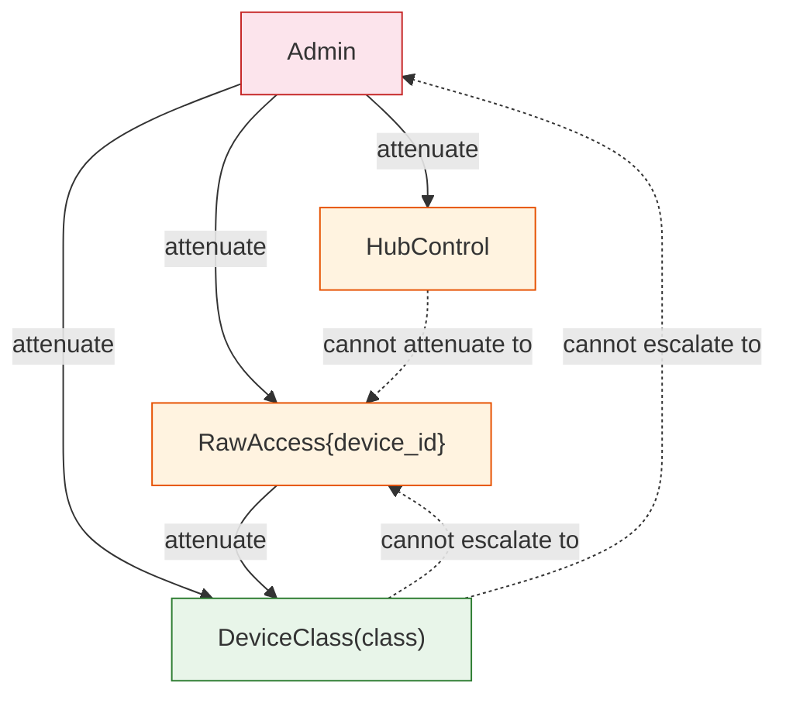
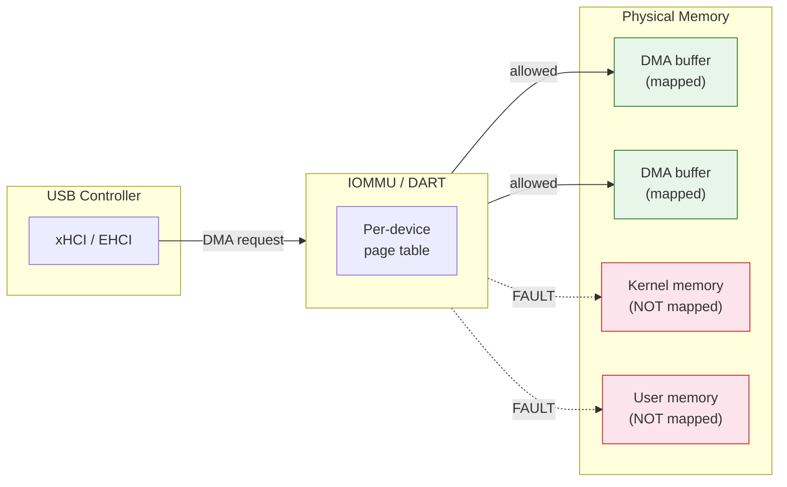
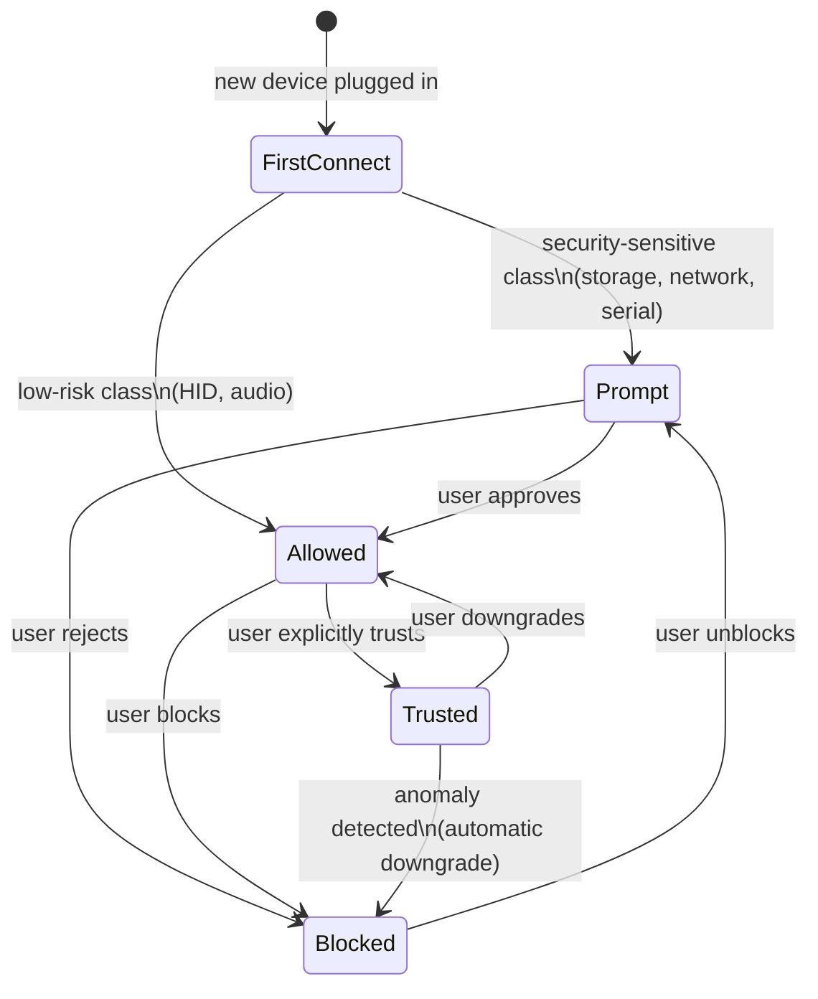
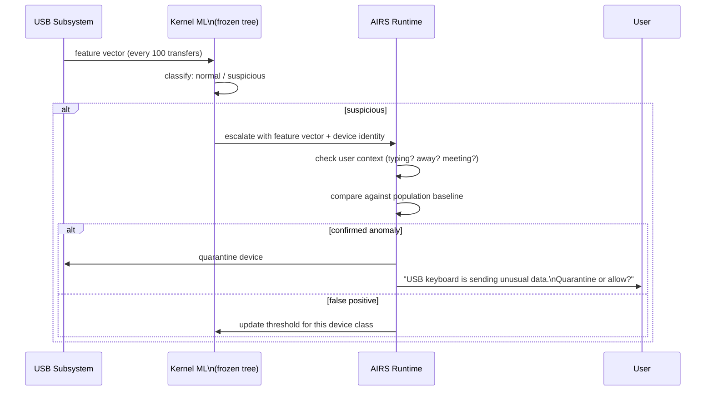

# AIOS USB Security and AI-Native Features

Part of: [usb.md](../usb.md) — USB Subsystem
**Related:** [controller.md](./controller.md) — DMA buffer management and IOMMU integration, [device-classes.md](./device-classes.md) — Descriptor validation, [hotplug.md](./hotplug.md) — Device lifecycle and trust, [../../security/model.md](../../security/model.md) — System-wide security model

-----

## 9. USB Security Model

USB is among the most dangerous hardware interfaces an operating system exposes. Every USB port is a potential injection point for malicious devices, rogue DMA engines, and protocol-level exploits. AIOS treats every USB device as untrusted by default and enforces security through layered defenses: capability-gated access, IOMMU-confined DMA, validated descriptor parsing, behavioral monitoring, and device allowlisting.

### 9.1 Threat Model

USB attack vectors fall into six categories. Each has a distinct mechanism, a distinct defense, and a distinct severity profile.

**BadUSB.** A device with reprogrammable firmware presents itself as a different device class than its physical form suggests. A USB flash drive enumerates as a keyboard and injects keystrokes. A phone charger enumerates as a network interface and redirects DNS. The device's claimed identity is a lie, and the host has no hardware-level mechanism to verify the truth.

Defenses:
- Behavioral anomaly detection (see [10.1](#101-airs-dependent-device-behavior-anomaly-detection)) compares actual traffic patterns against learned baselines for each device class. A keyboard that sends bulk transfers triggers an alert.
- Class-change detection: if a device re-enumerates with a different class after initial binding, the USB subsystem quarantines it and notifies the user.
- Capability enforcement: even if a BadUSB device successfully masquerades as a keyboard, the agent receiving its input must hold `UsbCapability::DeviceClass(Hid)`. A storage-only agent cannot receive HID events regardless of what the device claims.

**DMA attacks.** USB host controllers are bus-mastering devices that perform DMA. On platforms without an IOMMU, a compromised USB controller (or a malicious Thunderbolt/USB4 device tunneling PCIe) can read or write arbitrary physical memory, extracting secrets or overwriting kernel page tables.

Defenses:
- IOMMU/DART isolation (see [9.3](#93-iommudart-protection-for-dma)) confines each USB controller to explicitly mapped DMA buffer pages. No default DMA access to kernel memory.
- On platforms without IOMMU (Pi 4), bounce buffers ensure DMA never touches kernel-critical memory regions.

**Descriptor injection.** Malformed USB descriptors exploit parsing bugs to trigger buffer overflows, integer overflows, or infinite loops in the descriptor parser. Historical examples include crafted configuration descriptors with `wTotalLength` exceeding the actual data, nested interface descriptors triggering stack exhaustion, and HID report descriptors with recursive references.

Defenses:
- Structure-aware validated parsing with strict length bounds (see [9.4](#94-descriptor-validation-and-fuzzing)).
- Continuous fuzzing of all descriptor parsers in CI.
- All descriptor parsing runs in a bounded-resource context with a maximum recursion depth.

**Data exfiltration.** A malicious USB device (or a compromised driver) copies sensitive data from the system. A USB mass storage device with modified firmware could present a virtual file that, when read by the host, triggers the host to write sensitive data to the device. A covert channel could encode data in USB timing patterns or packet sizes.

Defenses:
- Capability-gated data access: a USB storage device can only access data that the holding agent has capabilities for. The USB subsystem never exposes raw kernel memory or other agents' data to any device.
- Audit logging: all data transfers above a configurable threshold are logged with source agent, device identity, and transfer size.

**USB killer.** An electrical attack where a modified USB device sends a high-voltage power surge through the data pins, physically damaging the host's USB controller or mainboard.

Defenses:
- Hardware-level protection only. Software cannot defend against electrical attacks. AIOS assumes compliant hardware with overcurrent protection. This attack is out of scope for the software stack.

**Thunderbolt/USB4 PCIe tunneling.** USB4 and Thunderbolt 3/4 tunnel PCIe traffic over the same connector. A malicious device can establish a PCIe tunnel and perform DMA attacks that bypass USB-level protections entirely.

Defenses:
- Thunderbolt security levels: AIOS enforces user authorization before establishing any PCIe tunnel.
- Per-tunnel IOMMU isolation: each PCIe tunnel gets its own IOMMU stream ID and page table. A Thunderbolt device can only DMA to pages explicitly mapped for its tunnel.
- On platforms without IOMMU, PCIe tunneling is disabled entirely.

#### Threat Matrix

| Attack Vector | Severity | Mitigation | Defense Layer |
|---|---|---|---|
| BadUSB class masquerade | High | Behavioral monitoring, class-change detection, capability enforcement | AI-native (10.1) + capability (9.2) |
| DMA read/write via host controller | Critical | IOMMU page-granular isolation, bounce buffers | Hardware + kernel (9.3) |
| Descriptor buffer overflow | High | Validated parsing, fuzzing, recursion limits | Input validation (9.4) |
| Descriptor integer overflow | High | Checked arithmetic in parser, length bounds | Input validation (9.4) |
| Data exfiltration via storage | Medium | Capability-gated access, audit logging | Capability (9.2) + audit (11.1) |
| Covert channel via USB timing | Low | Traffic classification ML, anomaly alerts | AI-native (10.3) |
| USB killer (electrical) | Critical | Hardware overcurrent protection | Out of scope (hardware) |
| Thunderbolt PCIe tunnel DMA | Critical | Per-tunnel IOMMU, user authorization | Hardware + kernel (9.3) |
| Device re-enumeration attack | Medium | Class-change quarantine, user prompt | Hotplug (9.5) + capability (9.2) |
| HID report descriptor recursion | Medium | Max recursion depth, stack budget | Input validation (9.4) |

### 9.2 Capability-Gated Device Access

Every USB device interaction is mediated by the AIOS capability system. No agent can access a USB device without presenting a valid capability token to the kernel. The USB subsystem defines its own capability types that integrate with the system-wide capability model described in [capabilities.md](../../security/model/capabilities.md) §3.

```rust
/// USB-specific capabilities, enforced by the kernel's capability gate.
pub enum UsbCapability {
    /// Access to a specific USB device class.
    DeviceClass(UsbClassPermission),

    /// Raw access to a specific device by identity.
    /// Required for firmware updates, custom protocols, and diagnostics.
    /// Granted only to Trusted devices (see 9.5).
    RawAccess { device_id: UsbDeviceId },

    /// Permission to manage USB hubs: port power, reset, enumeration control.
    HubControl,

    /// Full administrative access: allowlist management, trust level override,
    /// global device policy, firmware update authorization.
    Admin,
}

/// Per-class access permissions. Each maps to a specific class driver.
pub enum UsbClassPermission {
    /// HID: keyboard, mouse, game controller input events.
    Hid,
    /// Mass storage: block-level read/write access.
    Storage,
    /// Audio: playback and capture streams (UAC class).
    Audio,
    /// Video: capture streams (UVC class).
    Video,
    /// Network: CDC-NCM/ECM network interface.
    Network,
    /// Serial: CDC-ACM serial port access.
    Serial,
    /// Printer: print job submission.
    Printer,
}
```

**Default capability grants by trust level:**

| Trust Level | Default USB Capabilities |
|---|---|
| 0 (Kernel) | N/A -- kernel operates below capability layer |
| 1 (System) | `DeviceClass(*)` for the subsystem's own class; `HubControl` for USB service |
| 2 (Native experience) | `DeviceClass(Hid)`, `DeviceClass(Storage)` -- broad but bounded |
| 3 (Third-party) | Must explicitly request; user approves at install time |
| 4 (Web content) | `DeviceClass(Hid)` only (WebUSB requires explicit user gesture + prompt) |

**Capability attenuation.** An agent holding `Admin` can attenuate to `DeviceClass(Storage)` for a child agent. `DeviceClass` cannot escalate to `RawAccess` or `Admin`. Attenuation follows the system-wide rules in [capabilities.md](../../security/model/capabilities.md) §3.4.



**Temporal capabilities.** For one-shot operations like firmware updates, the USB subsystem issues time-limited `RawAccess` tokens:

```rust
let firmware_cap = capability_create(CapabilityToken {
    capability: UsbCapability::RawAccess { device_id },
    expires: now() + Duration::minutes(5),
    delegatable: false,
    // ...
});
```

The token expires automatically. If the firmware update completes early, the agent releases the token explicitly. The kernel revokes it either way at expiry.

**Capability revocation on device removal.** When a USB device is physically disconnected, the USB subsystem triggers cascade revocation of all capability tokens referencing that device's `UsbDeviceId`. All active sessions are closed, all pending transfers are cancelled, and all derived tokens (attenuated or delegated) are revoked. This ensures no agent retains a stale reference to a removed device.

### 9.3 IOMMU/DART Protection for DMA

USB host controllers are DMA-capable bus masters. Without containment, a host controller (or a device behind it) can read and write any physical address. The AIOS HAL provides platform-specific IOMMU support to constrain DMA to explicitly allocated buffers. See [hal.md](../../kernel/hal.md) §13.1 for the full IOMMU abstraction.

**Core principle:** a USB controller can only DMA to pages that the kernel has explicitly mapped into the controller's IOMMU page table. No default access to any physical memory.



**Stream ID assignment.** Each USB host controller instance receives a unique IOMMU stream ID. On platforms that support per-device stream IDs within a host controller (USB4 with per-tunnel isolation), each device or tunnel receives its own stream ID and page table.

**Page-granular DMA mapping.** When the USB subsystem allocates a transfer buffer, it:

1. Allocates pages from the DMA page pool (see [memory/physical.md](../../kernel/memory/physical.md) §2.4)
2. Maps those pages into the controller's IOMMU page table with the appropriate permissions (read-only for IN transfers, write-only for OUT transfers)
3. Issues the USB transfer descriptor referencing the IOMMU virtual address
4. On transfer completion, unmaps the pages from the IOMMU page table

No persistent DMA mappings exist. Each transfer's DMA window is opened and closed atomically.

**Platform-specific behavior:**

| Platform | IOMMU Hardware | USB DMA Strategy |
|---|---|---|
| QEMU virt | SMMUv3 (configurable) | Full per-controller page tables; zero-copy DMA |
| Raspberry Pi 4 | None | Bounce buffer fallback; copy to/from DMA-safe region |
| Raspberry Pi 5 | ARM SMMU (BCM2712) | Full per-controller page tables; zero-copy DMA |
| Apple Silicon | Apple DART | Per-controller DART instance; zero-copy DMA |

**Pi 4 bounce buffer fallback.** On Pi 4, which has no SMMU, the HAL allocates a dedicated DMA-safe region at boot (from the DMA page pool). For every USB transfer, the kernel copies data from the agent's buffer into the bounce buffer before an OUT transfer, and copies from the bounce buffer to the agent's buffer after an IN transfer. This prevents the USB controller from accessing arbitrary physical memory, at the cost of one extra memory copy per transfer.

**USB4/Thunderbolt isolation.** USB4 tunnels PCIe traffic over the USB-C connector. Each PCIe tunnel requires its own IOMMU stream ID and page table. The USB subsystem refuses to establish a PCIe tunnel on platforms without IOMMU support. On platforms with IOMMU, the tunnel's DMA is confined to pages mapped for the specific tunnel -- a compromised Thunderbolt device cannot access memory allocated for a different tunnel or for the host USB controller.

**IOMMU fault handling.** When a USB controller (or device behind it) attempts DMA to an unmapped page, the IOMMU raises a fault interrupt. The kernel:

1. Logs an audit event with the faulting stream ID, physical address, and access type
2. Identifies the USB device associated with the stream ID
3. Quarantines the device: suspends all transfers, notifies the user
4. Does not crash -- the fault is contained to the offending device

### 9.4 Descriptor Validation and Fuzzing

USB descriptors are the primary attack surface for protocol-level exploits. Every descriptor is untrusted data from a potentially malicious device. AIOS uses structure-aware validated parsing with defense-in-depth through continuous fuzzing.

#### Structure-Aware Validation

The USB descriptor parser uses recursive descent with strict invariants enforced at every level:

```rust
/// Parse a configuration descriptor tree with strict validation.
pub fn parse_config_descriptor(
    raw: &[u8],
    max_depth: usize,
) -> Result<ConfigDescriptor, UsbDescriptorError> {
    if raw.len() < CONFIG_DESC_MIN_LEN {
        return Err(UsbDescriptorError::TooShort);
    }

    let w_total_length = u16::from_le_bytes([raw[2], raw[3]]) as usize;

    // Bounds check: wTotalLength must not exceed actual data
    if w_total_length > raw.len() {
        return Err(UsbDescriptorError::LengthMismatch);
    }

    // Bounds check: wTotalLength must be at least the header size
    if w_total_length < CONFIG_DESC_MIN_LEN {
        return Err(UsbDescriptorError::InvalidLength);
    }

    // Parse child descriptors within the validated length
    parse_children(&raw[..w_total_length], max_depth)?;

    // ...
}
```

Key validation rules:
- **Length bounds**: every `bLength` and `wTotalLength` field is checked against both the remaining buffer size and a per-descriptor-type minimum
- **Checked arithmetic**: all offset calculations use saturating or checked arithmetic; no wrapping
- **Recursion limit**: nested descriptors (configurations containing interfaces containing endpoints) are limited to `MAX_DESCRIPTOR_DEPTH = 8`
- **Duplicate detection**: multiple descriptors claiming the same interface/endpoint number trigger an error
- **Reserved field validation**: reserved bits that must be zero are checked; non-zero triggers a warning (logged) but not a rejection, to maintain compatibility with non-compliant devices

#### Fuzzing Strategy

USB descriptor parsing is a high-priority fuzz target. AIOS employs multiple fuzzing approaches, each targeting different aspects of the parser.

**DNAFuzz (descriptor-aware fuzzing).** Rather than mutating raw bytes, DNAFuzz parses a USB descriptor into an abstract syntax tree, then mutates individual fields with type-aware mutations (e.g., setting `bLength` to 0, `wTotalLength` to `0xFFFF`, `bNumInterfaces` to 255). This approach found an 8-year-old Linux kernel USB bug that byte-level fuzzers missed. See [subsystem-framework.md](../subsystem-framework.md) §18.3 for the broader framework fuzzing strategy.

**USBFuzz (device-level fuzzing).** A portable USB fuzzing framework that emulates a USB device and feeds malformed descriptors and transfer data to the host stack. USBFuzz has found 26 new bugs across Linux, FreeBSD, and macOS. AIOS integrates USBFuzz into its CI pipeline to exercise the full descriptor-to-driver path.

**FaceDancer (hardware emulation).** A hardware USB emulation platform that presents arbitrary USB device identities to the host. FaceDancer is used for integration testing where software-only emulation is insufficient -- it exercises the real USB hardware stack on physical test machines.

#### Fuzz Target Catalog

| Target | Input | Invariant |
|---|---|---|
| Device descriptor parser | 18+ bytes | No panic; invalid descriptors return `Err` |
| Configuration descriptor parser | Variable-length tree | No panic; `wTotalLength` overflow returns `Err` |
| HID report descriptor parser | Nested items with push/pop | No panic; stack depth bounded; recursion limit enforced |
| Hub descriptor parser | 7+ bytes | No panic; port count bounded to `MAX_HUB_PORTS` |
| UAC (audio class) descriptors | Format type, mixer unit, feature unit | No panic; channel count bounded |
| UVC (video class) descriptors | Format, frame, streaming interface | No panic; frame size bounded |
| CDC (communication class) descriptors | Functional descriptors, union | No panic; interface references validated |
| String descriptor (UTF-16) | Arbitrary byte pairs | No panic; invalid UTF-16 handled gracefully |

All fuzz targets are compiled and run on the host (`cargo test` with `cargo-fuzz` or `libfuzzer`). See [fuzzing.md](../../security/fuzzing.md) for the project-wide fuzzing strategy and [tooling.md](../../security/fuzzing/tooling.md) §6 for the full fuzz target catalog.

### 9.5 Device Allowlisting and Trust Levels

AIOS maintains a persistent device allowlist that controls how USB devices are treated at enumeration time. The allowlist is stored in the system space (`system/usb/allowlist` in Space storage) and survives reboots.

#### Device Identity

Each USB device is identified by a fingerprint tuple:

```rust
pub struct UsbDeviceFingerprint {
    pub vendor_id: u16,
    pub product_id: u16,
    pub serial_number: Option<[u8; 64]>,  // SHA-256 hash of iSerialNumber string
    pub device_version: u16,               // bcdDevice
}
```

Devices without serial numbers are identified by `(vendor_id, product_id, device_version)` alone. This is less precise -- two identical USB drives are indistinguishable -- but necessary for devices that omit serial numbers.

#### Trust Levels

Every USB device has a trust level that determines how the USB subsystem handles it at enumeration:

| Trust Level | Behavior | Default For |
|---|---|---|
| **Blocked** | Device rejected at enumeration; port is power-cycled to prevent electrical attacks | Devices explicitly blocked by user or policy |
| **Prompt** | User must approve before class driver binds; device is visible but non-functional until approved | Storage, network, serial -- security-sensitive classes on first connection |
| **Allowed** | Class driver binds automatically; standard `DeviceClass` capabilities available | HID (keyboards, mice) on first connection; all devices after user approval |
| **Trusted** | Full capabilities including `RawAccess` if requested; no prompts | Devices explicitly trusted by user; enterprise-managed devices |



#### Default Trust Assignment

When a device is connected for the first time and has no allowlist entry, the USB subsystem assigns a default trust level based on the device's claimed class:

| Device Class | Default Trust | Rationale |
|---|---|---|
| HID (keyboard, mouse) | Allowed | Essential input; blocking would prevent system use |
| Audio (headset, speakers) | Allowed | Low security risk; user expects immediate function |
| Mass storage | Prompt | Can exfiltrate data; requires conscious user approval |
| Network (CDC-NCM/ECM) | Prompt | Can redirect traffic; requires conscious user approval |
| Serial (CDC-ACM) | Prompt | Raw data channel; requires conscious user approval |
| Video (UVC camera) | Prompt | Privacy-sensitive; requires conscious user approval |
| Printer | Allowed | Low security risk; data flows from host to device |
| Hub | Allowed | Infrastructure device; blocking would prevent downstream devices |
| Vendor-specific | Prompt | Unknown behavior; requires user decision |
| Wireless controller | Prompt | Can establish radio links; requires user approval |

#### Trust Persistence

The allowlist is stored as objects in the system space:

```text
system/usb/allowlist/
    {fingerprint_hash_1}    # CompactObject with trust level, last-seen timestamp
    {fingerprint_hash_2}
    ...
```

Each entry records:
- Device fingerprint (vendor, product, serial hash, version)
- Current trust level
- Timestamp of first connection
- Timestamp of last connection
- Number of times connected
- Who approved (user identity or policy name)

#### Enterprise Policy

An administrator with `UsbCapability::Admin` can set organization-wide USB policy:

- **Global allowlist**: pre-approve specific `(vendor_id, product_id)` tuples for all users
- **Global blocklist**: block specific devices or entire vendor ranges
- **Class policy override**: change the default trust level for any device class (e.g., force all storage devices to Blocked in a high-security environment)
- **Disable trust escalation**: prevent users from promoting devices to Trusted

Policy is stored in `system/usb/policy` and takes precedence over user-level allowlist entries. A user cannot override a policy-level block.

-----

## 10. AI-Native USB

AIOS uses machine learning at two levels to enhance USB security and efficiency: kernel-internal frozen models that run without any external dependency, and AIRS-dependent models that leverage the full AI Runtime for semantic understanding.

### 10.1 AIRS-Dependent: Device Behavior Anomaly Detection

The AIRS runtime monitors USB traffic patterns and compares them against learned baselines for each device class. This is the primary defense against BadUSB attacks and other behavioral anomalies that evade static analysis.

**Feature vector per device:**

| Feature | Type | Example |
|---|---|---|
| Transfer type distribution | `[f32; 4]` (control, bulk, interrupt, isochronous) | Keyboard: `[0.01, 0.0, 0.99, 0.0]` |
| Average transfer size | `f32` (bytes) | Keyboard: 8.0; storage: 65536.0 |
| Transfer frequency | `f32` (transfers/second) | Keyboard: 50.0; storage: varies |
| Endpoint usage bitmap | `u32` | Which endpoints are active |
| Control request distribution | `[f32; 8]` | Standard, class, vendor request ratios |
| Data direction ratio | `f32` (IN / total) | Keyboard: 0.95; storage: 0.50 |

**Anomaly detection flow:**



**Anomaly examples:**
- A keyboard device sending bulk OUT transfers (data exfiltration via BadUSB)
- A storage device issuing HID interrupt transfers (class masquerade)
- A device's transfer frequency jumping 10x while the user is away (automated exfiltration)
- A device sending vendor-specific control requests it has never sent before (firmware reprogramming)

**Alert escalation:**

| Alert Level | Trigger | Action |
|---|---|---|
| Log | Feature vector slightly outside baseline | Audit event recorded; no user notification |
| Notify | Feature vector significantly outside baseline | User notified via attention system |
| Quarantine | Feature vector matches known attack pattern | Device suspended; transfers halted; user prompted |
| Disconnect | Device continues anomalous behavior after quarantine | USB port power-cycled; device blocked |

**Training.** AIRS learns per-device-class baselines from normal usage across the device population (with privacy-preserving aggregation). Baselines are updated periodically and distributed as part of AIRS model updates. The initial baselines are hand-crafted from USB specification transfer profiles and refined through telemetry.

### 10.2 AIRS-Dependent: Context-Aware Device Trust

AIRS adjusts USB device trust dynamically based on the user's current environment and activity context. A device that is auto-mounted at home may require explicit approval at a public kiosk.

**Context factors:**

| Factor | Source | Effect on Trust |
|---|---|---|
| Location | Wi-Fi SSID, Bluetooth beacons, GPS | Home/office: trust up; public/unknown: trust down |
| Time of day | System clock | Normal hours: baseline; unusual hours: trust down |
| User activity state | AIRS context engine | Active typing: trust baseline; locked/away: trust down |
| Recent security events | Audit log | Recent anomaly on any USB device: trust down globally |
| Device history | Allowlist entry | Many successful connections: trust up; first connection: baseline |

**Example scenarios:**

| Scenario | Context | Trust Decision |
|---|---|---|
| Known USB drive at home office | Location=home, device=Trusted | Auto-mount; no prompt |
| Same USB drive at conference | Location=unknown, device=Trusted | Prompt before mount; suggest read-only |
| Unknown USB drive at home | Location=home, device=new | Prompt (default for storage) |
| Unknown USB drive at conference | Location=unknown, device=new | Prompt with strong warning; suggest sandbox |
| Keyboard after security event | Recent anomaly detected | Prompt even though HID is normally Allowed |

**Dynamic trust adjustment.** AIRS can downgrade a device's effective trust level (but not its stored allowlist entry) if its behavior changes. A storage device that was Allowed but starts exhibiting network-like traffic patterns gets temporarily demoted to Prompt. The user is notified and can override.

**Integration with capability system.** AIRS recommends a capability level for each device based on context. The kernel enforces the recommendation -- AIRS cannot bypass capability checks, only influence which capabilities are offered to the user for approval.

### 10.3 Kernel-Internal ML: USB Traffic Classification

A frozen decision tree running entirely in the kernel classifies actual USB device behavior against the device's claimed class. This model has no dependency on AIRS and runs on every active USB device.

**Purpose:** detect devices lying about their class, and detect covert channels over USB.

**Features (computed per 100-transfer window):**

```rust
pub struct UsbTrafficFeatures {
    /// Fraction of transfers that are control/bulk/interrupt/isochronous
    pub transfer_type_dist: [f32; 4],
    /// Mean transfer size in bytes (log-scaled)
    pub mean_transfer_size_log: f32,
    /// Standard deviation of transfer sizes (log-scaled)
    pub transfer_size_stddev_log: f32,
    /// Transfers per second
    pub transfer_rate: f32,
    /// Fraction of transfers in the IN direction
    pub in_direction_ratio: f32,
    /// Number of distinct endpoints used
    pub active_endpoint_count: u8,
    /// Claimed device class code
    pub claimed_class: u8,
}
```

**Classification output:** the model produces a probability distribution over device classes. If the highest-probability class does not match the claimed class, the device is flagged for review.

**Decision tree structure:**
- Depth: 8 levels maximum
- Leaf nodes: 64 maximum
- Size budget: < 4 KiB total (fits in a single page)
- Inference time: < 1 microsecond per classification

**Training pipeline:**
1. Collect labeled USB traffic traces from diverse devices (offline, on development machines)
2. Extract features per 100-transfer window
3. Train a gradient-boosted decision tree (XGBoost or LightGBM) on the host
4. Export the trained model as a static decision tree (if/else chain or lookup table)
5. Compile the frozen tree into the kernel as a `const` data structure
6. Retrain periodically using AIRS-curated training data; ship updated tree in kernel updates

**What it catches:**
- A device claiming to be a keyboard but producing bulk transfer patterns consistent with storage
- A device claiming to be storage but producing interrupt transfer patterns consistent with HID
- Covert data channels embedded in USB timing or transfer size patterns (statistical detection)

### 10.4 Kernel-Internal ML: Optimal Polling and Suspend Prediction

Two frozen decision trees optimize USB power consumption and CPU utilization without any AIRS dependency.

#### Polling Interval Optimizer

USB 3.x bulk transfers use a polling model where the host periodically checks for pending data. Polling too frequently wastes CPU cycles; polling too infrequently adds latency.

**Features:**

| Feature | Description |
|---|---|
| Recent throughput | Bytes transferred in the last 100ms (log-scaled) |
| Transfer size | Average transfer size in the current session |
| Device class | Encoded device class (storage, network, etc.) |
| Queue depth | Number of pending transfer descriptors |
| Time since last transfer | Milliseconds since the last completed transfer |

**Output:** recommended polling interval in microseconds (range: 1 to 10000).

**Impact:** reduces CPU wake-ups by 30-60% for idle or bursty USB devices compared to fixed-interval polling. For devices with sustained throughput, the model converges to the minimum interval.

**Training:** reinforcement learning on simulated USB workloads. The reward signal balances latency (penalize high polling intervals when data is pending) against CPU cost (penalize low polling intervals when no data arrives). The trained policy is exported as a decision tree with < 2 KiB footprint.

#### Selective Suspend Predictor

USB selective suspend powers down individual devices when idle, but waking a suspended device adds latency (2-20ms depending on device). Suspending too aggressively degrades responsiveness; suspending too conservatively wastes power.

**Features:**

| Feature | Description |
|---|---|
| Time since last transfer | Seconds since the last completed transfer |
| Device class | Encoded device class |
| Time of day | Coarse bucket (morning, afternoon, evening, night) |
| User activity state | Active, idle, locked (from kernel timer heuristic, not AIRS) |
| Historical idle duration | Median idle period for this device over the last 24 hours |

**Output:** binary decision (suspend now / keep awake) with a confidence score. The device is suspended only when confidence exceeds a tunable threshold (default: 0.8).

**Impact:** reduces USB subsystem power consumption by 20-40% on typical workloads with mixed active and idle devices. Keyboard and mouse are rarely suspended incorrectly because the model learns their intermittent-but-frequent usage pattern.

**Training:** supervised learning on labeled USB device activity traces. Labels are generated by an oracle that knows future transfer timing (offline only). The trained model is exported as a decision tree with < 2 KiB footprint.

**Update cycle for both models:** AIRS periodically retrains both models using aggregated (privacy-preserving) telemetry from the device population. Updated decision trees are shipped as part of kernel updates, replacing the frozen trees at boot.

-----

## 11. Audit and Observability

The USB subsystem produces a comprehensive audit trail and real-time metrics, integrated with the AIOS observability framework (see [observability.md](../../kernel/observability.md)).

### 11.1 USB Event Logging

All USB events are logged to the audit space at `audit/usb/` in Space storage. The audit space uses the same Space storage infrastructure as all other AIOS audit data (see [spaces.md](../../storage/spaces.md)).

**Events logged:**

| Event Type | Trigger | Details Recorded |
|---|---|---|
| `device_connect` | Physical connection detected | Port, speed, timestamp |
| `device_disconnect` | Physical disconnection detected | Port, device fingerprint, duration connected |
| `enumeration_complete` | Device successfully enumerated | Vendor/product ID, class, serial hash, descriptors |
| `enumeration_failed` | Device enumeration failed | Error code, partial descriptor data, port |
| `class_driver_bind` | Class driver bound to interface | Driver name, interface number, device fingerprint |
| `capability_granted` | Agent granted USB capability | Agent ID, capability type, device fingerprint |
| `capability_denied` | Agent's USB capability request denied | Agent ID, requested capability, reason |
| `trust_level_changed` | Device trust level modified | Old level, new level, who changed, reason |
| `anomaly_detected` | ML model flagged suspicious behavior | Feature vector, confidence, alert level |
| `device_quarantined` | Device suspended due to anomaly | Device fingerprint, anomaly type, user action |
| `dma_fault` | IOMMU fault from USB controller | Stream ID, physical address, access type |
| `firmware_update` | Device firmware update initiated/completed | Device fingerprint, old/new version, success/failure |

**Event format:**

```rust
pub struct UsbAuditEvent {
    /// Monotonic timestamp (kernel tick count)
    pub timestamp: u64,
    /// Device identity (if known at event time)
    pub device_id: Option<UsbDeviceFingerprint>,
    /// USB port path (e.g., "1-2.3" for port 3 of hub on port 2 of root port 1)
    pub port_path: [u8; 16],
    /// Event type discriminant
    pub event_type: UsbAuditEventType,
    /// Event-specific details (variable-length, max 128 bytes)
    pub details: [u8; 128],
}
```

**Privacy.** Device serial numbers are stored as SHA-256 hashes in audit logs by default. Retrieving the unhashed serial number requires `UsbCapability::Admin`. This prevents casual audit log readers from correlating devices across users while still allowing administrators to investigate specific incidents.

### 11.2 Device History Tracking

The USB subsystem maintains a persistent device registry in `system/usb/devices/` that tracks the full connection history of every device that has been connected to the system.

**Per-device history record:**

```rust
pub struct UsbDeviceHistory {
    /// Device fingerprint
    pub fingerprint: UsbDeviceFingerprint,
    /// Current trust level
    pub trust_level: UsbTrustLevel,
    /// First connection timestamp
    pub first_seen: u64,
    /// Most recent connection timestamp
    pub last_seen: u64,
    /// Total number of connections
    pub connection_count: u32,
    /// Cumulative connected duration (seconds)
    pub total_connected_seconds: u64,
    /// Cumulative data transferred (bytes, approximate)
    pub total_bytes_transferred: u64,
    /// Total transfer error count
    pub error_count: u32,
    /// Total stall condition count
    pub stall_count: u32,
    /// Total overcurrent event count
    pub overcurrent_count: u32,
    /// Number of anomaly detections
    pub anomaly_count: u32,
}
```

**Temporal queries.** The device history supports queries such as:
- "When was this USB drive last connected?" -- look up by fingerprint, return `last_seen`
- "What devices were connected during this time window?" -- scan entries where `last_seen` falls within the range
- "How much data has this device transferred in total?" -- return `total_bytes_transferred`
- "Has this device ever triggered an anomaly?" -- check `anomaly_count > 0`

These queries are exposed through the USB subsystem's IPC interface, gated by `UsbCapability::Admin` for full history or `UsbCapability::DeviceClass(*)` for the querying agent's own devices.

### 11.3 Metrics

The USB subsystem exports real-time metrics through the kernel observability framework, using the same `Counter`, `Gauge`, and `Histogram` primitives as all other kernel subsystems.

**Enumeration metrics:**
- `usb_enumeration_latency_us`: histogram of time from port connect event to class driver bind (microseconds)
- `usb_enumeration_failures`: counter of failed enumeration attempts, labeled by error type
- `usb_devices_connected`: gauge of currently connected devices, labeled by speed (LS/FS/HS/SS/SS+)

**Transfer metrics:**
- `usb_transfer_throughput_bps`: per-device gauge of current transfer throughput (bytes/second)
- `usb_transfer_errors`: per-device counter of transfer errors, labeled by error type (stall, timeout, CRC, babble)
- `usb_transfer_latency_us`: per-device histogram of transfer completion latency

**Error and fault metrics:**
- `usb_stall_conditions`: counter of endpoint stall conditions
- `usb_overcurrent_events`: counter of overcurrent detection events (hardware-reported)
- `usb_iommu_faults`: counter of IOMMU/DART fault events from USB controllers
- `usb_anomaly_detections`: counter of ML-flagged anomalies, labeled by alert level

**Power metrics:**
- `usb_device_power_draw_mw`: per-device gauge of estimated power draw (milliwatts), computed from device descriptor `bMaxPower` and current state (active/suspended)
- `usb_suspended_devices`: gauge of currently suspended devices
- `usb_suspend_transitions`: counter of suspend/resume transitions, labeled by device class

All metrics are emitted via `kinfo!` and `kmetrics!` macros and are accessible through the kernel's metrics registry. The Inspector application (see [inspector.md](../../applications/inspector.md)) renders USB metrics in a dedicated hardware dashboard panel.
