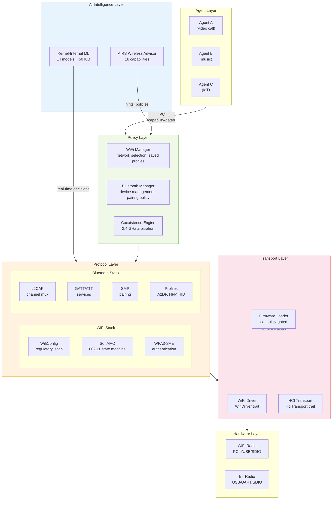

# AIOS Wireless: WiFi & Bluetooth

## Deep Technical Architecture

**Parent document:** [architecture.md](../project/architecture.md)
**Related:** [subsystem-framework.md](./subsystem-framework.md) — Universal hardware abstraction (capability gate, sessions, data channels, audit, power, POSIX bridge), [networking.md](./networking.md) — WiFi as NTM transport, [audio.md](./audio.md) — Bluetooth audio integration (A2DP, HFP, LE Audio), [input.md](./input.md) — Bluetooth HID (HOGP), [usb.md](./usb.md) — USB WiFi/BT dongle discovery, [hal.md](../kernel/hal.md) — `PlatformWifi` and `PlatformBluetooth` extension traits (§12.7), [model.md](../security/model.md) — Capability system, [power-management.md](./power-management.md) — Radio power states

**Note:** The wireless subsystem implements the subsystem framework. Its capability gate, session model, audit logging, power management, and POSIX bridge follow the universal patterns defined in the framework document. This document covers the wireless-specific design decisions and architecture.

-----

## Document Map

This document was split for navigability. Each sub-document preserves the original section numbers for cross-reference stability.

| Document | Sections | Content |
|---|---|---|
| **This file** | §1, §2, §11–§13 | Core insight, architecture overview, implementation order, technology choices, design principles |
| [wifi.md](./wireless/wifi.md) | §3.1–§3.6 | WiFi stack layers, station management, WPA2/WPA3 authentication, frame processing, WiFi Direct, WiFi 6/6E/7 |
| [bluetooth.md](./wireless/bluetooth.md) | §4.1–§4.6 | HCI transport, L2CAP, classic profiles (A2DP/HFP/HID), BLE GATT/HOGP, Mesh, LE Audio |
| [firmware.md](./wireless/firmware.md) | §5.1–§5.5 | Firmware blob strategy, loading mechanism, versioning, open firmware, regulatory domain |
| [security.md](./wireless/security.md) | §6.1–§6.5 | WiFi security (WPA3-SAE), Bluetooth security, capability-gated access, rogue AP detection, attack surface |
| [integration.md](./wireless/integration.md) | §7.1–§7.8 | Subsystem framework, USB transport, audio/input/networking integration, power, POSIX, coexistence |
| [ai-native.md](./wireless/ai-native.md) | §8–§10 | AIRS-dependent intelligence (18 capabilities), kernel-internal ML (14 models), future directions |

-----

## 1. Core Insight

In conventional operating systems, WiFi and Bluetooth are plumbing — driver stacks that shuttle packets and audio streams without understanding what they carry or why. The OS connects to whatever network the user configures and pairs with whatever device the user selects. Every application manages its own wireless context: checking connectivity, handling disconnects, adapting to bandwidth changes.

AIOS treats WiFi and Bluetooth as an **intelligent connectivity fabric** — a unified wireless system that understands user intent, predicts connectivity needs, and coordinates radio resources across all agents. The wireless subsystem does not merely provide a link layer; it makes connectivity decisions that no individual agent could make alone, because it has visibility across all wireless activity, user context, and security posture.

```text
What agents see:

    space::remote("api.example.com")?.read("data")   ← network-transparent access
    audio::session(AudioRoute::Bluetooth)?            ← just requests audio output
    input::subscribe(InputDevice::BluetoothHid)?      ← just subscribes to events

What the wireless subsystem does underneath:

    WiFi: scan → evaluate APs (ML-scored) → WPA3-SAE → associate →
          monitor quality → proactive roam → power-optimize (TWT/PSM)
    Bluetooth: discover → pair (LE Secure Connections) → profile negotiation →
              codec selection (adaptive) → connection interval optimization
    Cross-radio: coexistence arbitration → coordinated sleep → multi-radio routing
    Security: rogue AP detection → firmware validation → capability enforcement → audit
    AI: intent-predicted prefetch → semantic roaming suppression → fleet AP reputation
```

The agent does not know or care that its audio is flowing over Bluetooth A2DP with AAC codec at 256 kbps, or that the WiFi roamed from one AP to another during a video call without dropping a packet. The wireless subsystem handles this transparently.

-----

## 2. Full Architecture



The architecture follows six design principles documented in §13, with a clean separation between:

- **Policy** (which network to join, which device to pair) — in the WiFi/Bluetooth Manager services
- **Mechanism** (how to authenticate, how to encode frames) — in the protocol stack
- **Intelligence** (when to roam, what to prefetch) — split between kernel-internal ML (real-time, no AIRS dependency) and AIRS-dependent capabilities (semantic understanding)

-----

## 11. Implementation Order

The wireless subsystem is implemented in Phase 25 (WiFi, Bluetooth & Wireless — 5 weeks), building on Phase 24 (USB Stack & Hotplug) for USB dongle support.

```text
Phase 25 M1:  WiFi Foundation
              ├── WifiDriver trait + USB WiFi class driver skeleton
              ├── SoftMAC 802.11 frame processing (basic TX/RX)
              ├── WPA3-SAE authentication (Dragonfly key exchange)
              ├── Regulatory domain enforcement (embedded wireless-regdb)
              └── WiFi capability gate (WifiScan, WifiConnect)

Phase 25 M2:  Bluetooth Foundation
              ├── HciTransport trait + btusb driver
              ├── HCI Core + L2CAP (basic channel multiplexing)
              ├── LE Secure Connections pairing (P-256 ECDH)
              ├── GATT client/server + HOGP → input subsystem
              ├── A2DP → audio subsystem (SBC codec minimum)
              └── Bluetooth capability gate (BtDiscovery, BtPair, BtAudio, BtHid)

Phase 25 M3:  Integration & Intelligence
              ├── Firmware loading (capability-gated, signature-verified)
              ├── WiFi/BT coexistence (AFH, time-domain arbitration)
              ├── Power management (PSM, TWT, BLE connection intervals)
              ├── Kernel-internal ML models (roaming, coexistence, anomaly)
              ├── POSIX bridge (/dev/bluetooth*, /dev/wlan*, AF_BLUETOOTH)
              └── Rogue AP detection + BLE tracker detection
```

-----

## 12. Technology Choices

| Decision | Choice | Rationale |
|---|---|---|
| WiFi stack location | Userspace agent (SoftMAC) | Crash isolation, fault recovery, matches agent model |
| BLE host stack | `trouble` crate (adapted) | `no_std` Rust, async, actively maintained, avoids BlueZ (300K LoC C) |
| WPA3 implementation | Rust-native | Clean capability integration, no C dependency (wpa_supplicant) |
| Regulatory enforcement | Kernel-resident | Must not be bypassable by agents; DFS timing-critical |
| Firmware loading | Capability-gated + signature-verified | FirmwareLoad capability required; treat firmware as untrusted |
| Classic BT support | Included (A2DP, HFP, HID) | Required for existing peripherals; LE-first for new features |
| WiFi driver model | `WifiDriver` trait | Matches subsystem framework pattern; SoftMAC/FullMAC split |
| BT profile hosting | Userspace agents per profile | Each profile is a separate capability-gated agent |
| Rogue AP detection | Built-in, AIRS-integrated | Differentiator; continuous monitoring, not reactive |
| MLO (WiFi 7) | Design now, implement later | MLD abstraction from start avoids architecture lock-in |

-----

## 13. Design Principles

Six architectural patterns guide the wireless subsystem design:

1. **Layered protocol stack with clean trait boundaries.** WiFi: `WifiDriver` → `SoftMAC` → `WifiConfig` → `WifiManager`. Bluetooth: `HciTransport` → `HciCore` → `L2CAP` → Profiles. Each boundary is a Rust trait, enabling testing, swapping implementations, and enforcing the separation of concerns.

2. **Firmware as untrusted component.** WiFi and Bluetooth firmware blobs run on separate processors with direct DMA access. AIOS validates all HCI/WMI responses from firmware, constrains firmware DMA via IOMMU, and verifies firmware signatures before loading. A firmware crash triggers driver restart, not kernel panic.

3. **Userspace driver with kernel-assisted I/O.** Following the Fuchsia model, wireless drivers run as privileged agents (not kernel code). The kernel provides IRQ forwarding via notifications, DMA buffer allocation from the DMA pool, and IOMMU configuration. Driver crashes are isolated — the driver agent restarts without affecting the kernel.

4. **Separated policy and mechanism.** Policy decisions (which network to join, which device to auto-connect, when to roam) are in the Manager services and AIRS. Protocol mechanism (frame encoding, key exchange, codec negotiation) is in the protocol stack. This separation allows AI to influence policy without touching security-critical mechanism code.

5. **Capability-gated wireless access.** WiFi and Bluetooth access is governed by fine-grained capabilities: `WifiScan`, `WifiConnect`, `WifiMonitor`, `BtDiscovery`, `BtPair`, `BtAudio`, `BtHid`, `BtMesh`, `BtRawHci`. Capabilities support attenuation (e.g., `WifiConnect(ssid="home-*")` limits an agent to specific networks). Raw radio access (`WifiMonitor`, `BtRawHci`) requires elevated trust.

6. **Subsystem integration via IPC.** The wireless subsystem does not duplicate functionality from other subsystems. Bluetooth audio flows through the audio subsystem's mixing engine. Bluetooth HID devices route through the input subsystem's event pipeline. WiFi provides a transport to the Network Translation Module. Integration uses AIOS IPC channels with capability enforcement at every boundary.
