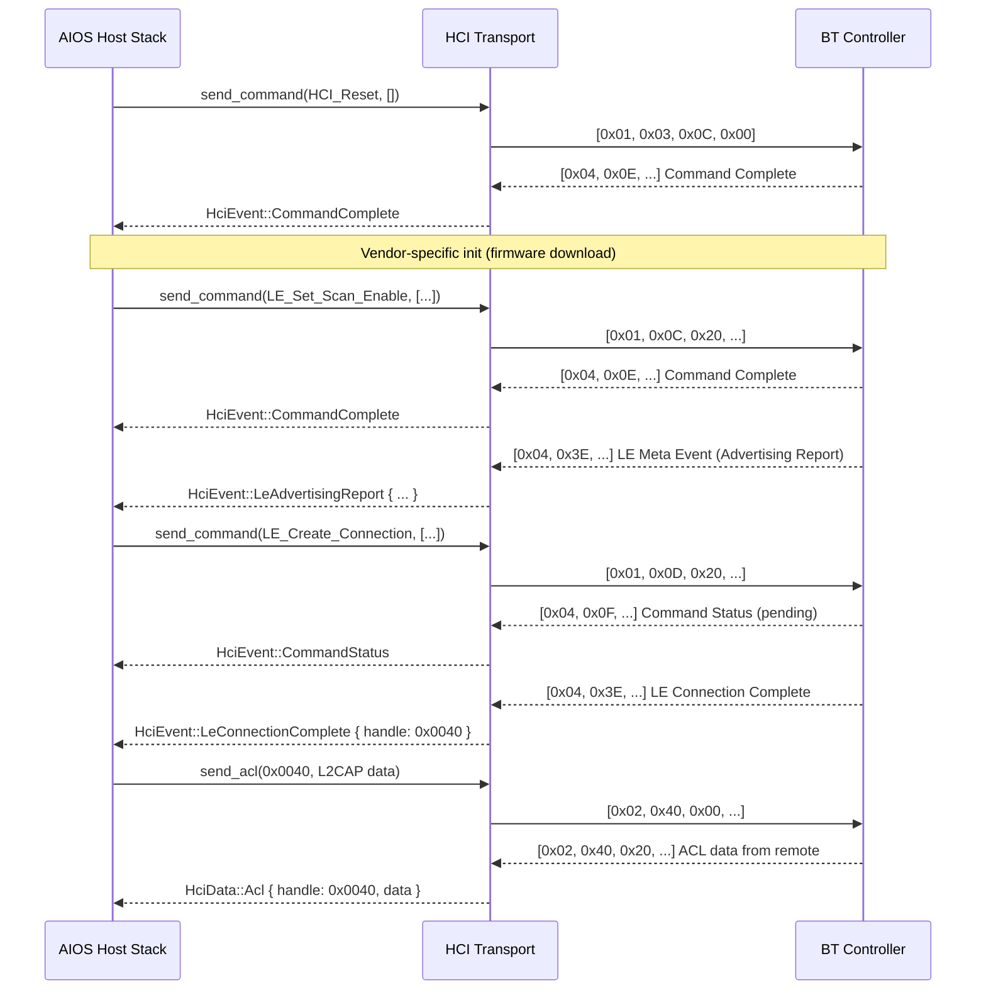
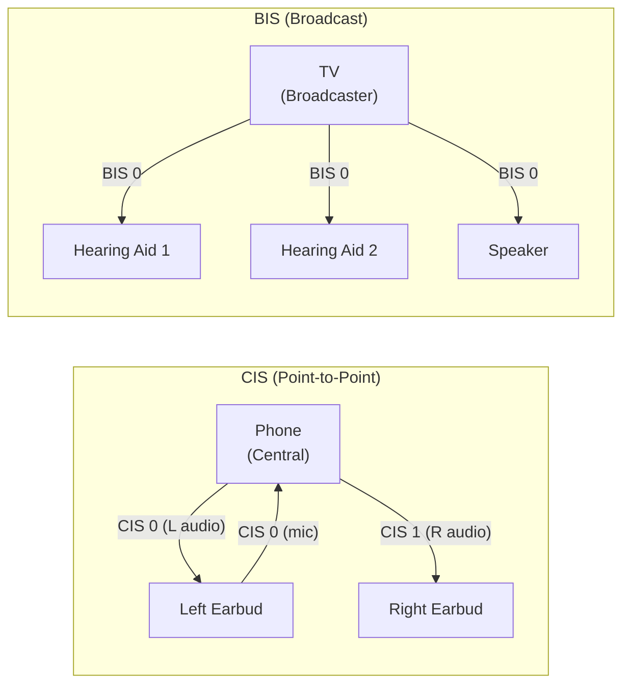

# AIOS Bluetooth Stack Architecture

Part of: [wireless.md](../wireless.md) — WiFi & Bluetooth
**Related:** [security.md](./security.md) — Pairing security, [integration.md](./integration.md) — Audio/input/POSIX integration, [firmware.md](./firmware.md) — Controller firmware, [ai-native.md](./ai-native.md) — BLE optimization

-----

## 4. Bluetooth Stack Architecture

AIOS implements a full-featured Bluetooth host stack covering Bluetooth Classic (BR/EDR), Bluetooth Low Energy (BLE), and Bluetooth Mesh. The stack is structured as a layered architecture with clean trait boundaries at each layer: HCI transport at the bottom, L2CAP for channel multiplexing, and profiles/GATT at the top. Each layer communicates with its neighbors through well-defined Rust traits, enabling testing, driver swapping, and hardware abstraction.

The design draws from the `trouble` crate — a `no_std` Rust BLE host — adapted for AIOS's capability-gated IPC model and extended to include Classic Bluetooth profiles. Classic support is necessary because the installed base of Bluetooth peripherals (headphones, speakers, car kits, keyboards) still predominantly uses Classic profiles for audio and HID. New features (LE Audio, Mesh, HOGP) are BLE-first.

```text
Agent Layer
    │
    │  IPC (capability-gated: BtAudio, BtHid, BtGattClient, BtGattServer, BtMesh)
    ▼
┌─────────────────────────────────────────────────────────────┐
│                    Bluetooth Manager                         │
│  device discovery, pairing policy, auto-connect, trust DB   │
├─────────────────────────────────────────────────────────────┤
│                    Profile Layer                              │
│  A2DP  │  HFP  │  HID  │  RFCOMM  │  HOGP  │  Mesh  │ BAP │
├─────────────────────────────────────────────────────────────┤
│  GATT/ATT (BLE services)  │  SDP (Classic service discovery) │
├─────────────────────────────────────────────────────────────┤
│  GAP (advertising, scanning, connection management)          │
├─────────────────────────────────────────────────────────────┤
│           L2CAP (channel multiplexing, MTU, flow control)    │
├─────────────────────────────────────────────────────────────┤
│           HCI Core (command/event dispatch, ACL/SCO/ISO)     │
├─────────────────────────────────────────────────────────────┤
│           HCI Transport (btusb, H:4 UART, SDIO)             │
├─────────────────────────────────────────────────────────────┤
│           Controller Hardware (firmware-loaded)              │
└─────────────────────────────────────────────────────────────┘
```

The entire host stack runs as a set of cooperating userspace agents (manager + profile-specific agents), not kernel code. The kernel provides DMA buffer allocation (from the DMA pool), IRQ forwarding via notifications, and IOMMU enforcement. A controller firmware crash triggers driver restart, not kernel panic — matching the isolation model described in the wireless design principles ([wireless.md](../wireless.md) §13).

-----

### 4.1 HCI Transport Abstraction

HCI (Host Controller Interface) defines the standard boundary between the Bluetooth Host (the AIOS stack) and the Controller (the hardware radio plus its firmware). All communication between host and controller flows through HCI: commands down, events up, and bidirectional data packets (ACL, SCO, ISO).

#### HciTransport Trait

The transport abstraction isolates the host stack from the physical interface to the controller:

```rust
/// Abstraction over HCI transport mechanisms (USB, UART, SDIO).
///
/// Implementors handle framing, flow control, and error recovery
/// for their specific physical transport. The host stack interacts
/// exclusively through this trait.
pub trait HciTransport: Send + Sync {
    /// Send an HCI command to the controller.
    /// `opcode` encodes OGF (bits 15:10) and OCF (bits 9:0).
    /// `params` contains the command-specific parameter bytes.
    fn send_command(&self, opcode: u16, params: &[u8]) -> Result<(), HciError>;

    /// Send an ACL data packet (asynchronous connection-oriented).
    /// Used for L2CAP data over BR/EDR and BLE connections.
    fn send_acl(&self, handle: u16, data: &[u8]) -> Result<(), HciError>;

    /// Send a SCO data packet (synchronous connection-oriented).
    /// Used for voice audio over Classic Bluetooth (HFP).
    fn send_sco(&self, handle: u16, data: &[u8]) -> Result<(), HciError>;

    /// Send an ISO data packet (isochronous, Bluetooth 5.2+).
    /// Used for LE Audio (CIS and BIS channels).
    fn send_iso(&self, handle: u16, data: &[u8]) -> Result<(), HciError>;

    /// Register a handler for incoming HCI events and data packets.
    /// The transport calls this handler from its receive loop.
    fn register_event_handler(&self, handler: Box<dyn HciEventHandler>);

    /// Reset the controller via HCI_Reset command and re-initialize transport.
    fn reset(&self) -> Result<(), HciError>;
}
```

#### Transport Implementations

Four transport types cover the hardware ecosystem:

- **USB (btusb)** — the most common transport for discrete Bluetooth adapters. Uses USB bulk endpoints for ACL data, interrupt endpoints for HCI events, and isochronous endpoints for SCO/ISO audio. The btusb driver registers with the USB subsystem as a class driver ([usb.md](../usb.md) §4) and obtains its endpoints through standard USB enumeration. USB alternate settings control isochronous bandwidth allocation for SCO voice and LE Audio streams.

- **UART (H:4 and H:5 protocols)** — used for SoC-integrated controllers (Raspberry Pi, many embedded boards). H:4 is the basic protocol: a one-byte packet indicator (0x01=command, 0x02=ACL, 0x03=SCO, 0x04=event, 0x05=ISO) followed by the packet. H:5 (Three-Wire) adds reliability with sequence numbers, CRC, and link establishment — required for controllers without hardware flow control. UART transport requires careful baud rate configuration, often chip-specific (e.g., Broadcom controllers negotiate higher baud rates after initial communication at 115200).

- **SDIO** — used by combo WiFi/Bluetooth chips (e.g., Broadcom BCM43xx, Qualcomm WCN series). The Bluetooth controller shares the SDIO bus with the WiFi controller, requiring coordinated bus access. HCI packets are exchanged through SDIO function registers. Coexistence arbitration between WiFi and Bluetooth is handled at both the firmware level (on-chip) and the host level ([integration.md](./integration.md) §7.8).

- **PCIe** — future high-speed transport for next-generation controllers. Not required for initial bring-up but the trait-based design ensures it slots in without protocol layer changes.

#### Vendor-Specific Initialization

Bluetooth controllers require vendor-specific initialization sequences after HCI_Reset but before the host stack begins normal operation. These sequences vary significantly across chipset families:

| Vendor | Init Sequence | Typical Operations |
|---|---|---|
| Broadcom (BCM) | `.hcd` firmware download | Patch RAM download, baud rate change, PCM config |
| Qualcomm (QCA) | `.tlv` + `.bin` segments | NVM configuration, firmware segments, board-specific tuning |
| Intel | `.sfi` firmware | Boot params, firmware download, DDC (device configuration) |
| Realtek | `.bin` firmware patch | Config file + firmware patch, USB alt settings |
| MediaTek (MTK) | Proprietary commands | Firmware download, WMT (Wireless Management Task) setup |

The firmware loading mechanism is documented in [firmware.md](./firmware.md) §5.2. The Bluetooth transport layer calls into the firmware loader after `HCI_Reset` and before reporting the controller as ready.

#### HCI Command/Event Flow



The HCI layer maintains a command queue that serializes command submission (most controllers support only one outstanding command). Events are dispatched through the registered `HciEventHandler` — the L2CAP layer consumes ACL data events, the SCO/ISO layer consumes synchronous data, and the GAP layer processes connection and advertising events.

-----

### 4.2 L2CAP

L2CAP (Logical Link Control and Adaptation Protocol) multiplexes multiple logical channels over a single HCI ACL connection. Every higher-layer protocol in Bluetooth — ATT, SMP, SDP, RFCOMM, AVDTP — operates over an L2CAP channel.

#### Channel Types

L2CAP channels fall into two categories:

**Fixed channels** have pre-assigned Channel IDs (CIDs) and exist for the lifetime of the ACL connection:

| CID | Protocol | Transport |
|---|---|---|
| 0x0001 | L2CAP Signaling (BR/EDR) | Classic |
| 0x0002 | Connectionless reception | Classic |
| 0x0003 | AMP Manager | Classic (deprecated) |
| 0x0004 | ATT (Attribute Protocol) | BLE |
| 0x0005 | L2CAP Signaling (LE) | BLE |
| 0x0006 | SMP (Security Manager Protocol) | BLE |
| 0x0007 | SMP (BR/EDR cross-transport) | Classic |

**Dynamic channels** are allocated per-connection through L2CAP signaling (Connection Request/Response for Classic, LE Credit Based Connection Request for BLE). Each profile that needs a dedicated data path opens a dynamic channel — RFCOMM, AVDTP media transport, OBEX, and BLE Connection-Oriented Channels (CoC) all use dynamic channels.

#### Channel Modes

L2CAP supports multiple reliability modes, selected during channel establishment:

- **Basic Mode** (default) — unreliable, no flow control. The simplest mode: L2CAP passes SDUs directly to the lower layer without segmentation retransmission. Used for ATT, SMP, SDP, and most signaling. Packet loss is handled (or ignored) by higher layers.

- **Enhanced Retransmission Mode (ERTM)** — reliable, ordered delivery with acknowledgment and retransmission. Uses sequence numbers, a transmit window, and a retransmission timer. Required for OBEX file transfers (OPP/FTP) and AVCTP (AV/C control commands for A2DP). ERTM ensures no data loss over the inherently unreliable radio link.

- **Streaming Mode** — ordered delivery without retransmission. Lost frames are detected (via sequence numbers) and reported to the upper layer, but not retransmitted. Used for A2DP media transport where retransmission would add unacceptable latency — a momentary audio glitch is preferable to a latency spike.

- **LE Credit-Based Flow Control** — used for BLE Connection-Oriented Channels (CoC). The receiver grants credits to the sender; each credit permits transmission of one L2CAP SDU. When credits are exhausted, the sender pauses. This provides flow control without the complexity of ERTM, suited to BLE's lower throughput environment.

#### MTU Negotiation

Both sides of an L2CAP connection exchange their maximum transmission unit (MTU) during channel establishment. The negotiated MTU determines the maximum SDU size for that channel. Default MTUs:

- BR/EDR signaling: 48 bytes (minimum), typically negotiated to 672 bytes
- BLE ATT: 23 bytes (minimum), extended to 512 bytes via ATT MTU Exchange
- Dynamic channels: negotiated per-channel, typically 672–65535 bytes

#### Segmentation and Reassembly

When an L2CAP SDU exceeds the HCI ACL buffer size (reported by the controller in the `LE_Read_Buffer_Size` response), L2CAP segments the SDU into multiple ACL fragments. The first fragment carries the L2CAP header (length + CID); subsequent fragments are continuation packets (identified by the `PB` flag in the HCI ACL header). The receiving L2CAP reassembles fragments into complete SDUs before delivering them to the upper layer.

#### Security Enforcement

Each L2CAP channel has an associated security level, enforced before the channel is established:

| Level | Requirement | Typical Use |
|---|---|---|
| 0 — None | No security | SDP service discovery |
| 1 — Unauthenticated | Encryption without MITM protection | Low-risk data transfer |
| 2 — Authenticated | Encryption with MITM protection (numeric comparison, passkey) | HID, file transfer |
| 3 — Authenticated + Secure Connections | P-256 ECDH + AES-CCM (BLE) or controller-provided BR/EDR link encryption (Classic) | Financial, health data |

The SMP (Security Manager Protocol) handles the pairing and key exchange that satisfies these requirements. Security enforcement details are in [security.md](./security.md) §6.2.

-----

### 4.3 Classic Profiles

Classic Bluetooth profiles define standard behaviors for common use cases. Each profile specifies which L2CAP channels to use, what protocols to layer on top, and how devices interact. In AIOS, each profile runs as a capability-gated component within the Bluetooth agent — profiles are isolated from each other and from other system services.

#### A2DP (Advanced Audio Distribution Profile)

A2DP enables high-quality audio streaming from a source (phone, computer) to a sink (headphones, speaker). The transport protocol is AVDTP (Audio/Video Distribution Transport Protocol), which manages stream setup, codec negotiation, and media transport over L2CAP.

**Stream setup sequence:**

1. **Service discovery** — the source queries SDP for the sink's A2DP service record, obtaining supported codecs and capabilities.
2. **AVDTP signaling** — source and sink exchange `Get_Capabilities`, `Set_Configuration`, `Open`, and `Start` commands over an L2CAP signaling channel. Codec parameters (bitrate, sample rate, channel mode) are negotiated here.
3. **Media transport** — encoded audio flows over a separate L2CAP channel in Streaming Mode (no retransmission). The source encodes PCM samples using the negotiated codec and transmits media packets at the codec's frame interval.

**Codec negotiation** follows a priority order:

| Priority | Codec | Quality | Latency | License |
|---|---|---|---|---|
| 1 | LDAC | 990 kbps, near-lossless | ~200 ms | Sony (royalty-bearing) |
| 2 | aptX HD | 576 kbps, 24-bit | ~150 ms | Qualcomm (royalty-bearing) |
| 3 | aptX | 352 kbps, 16-bit | ~120 ms | Qualcomm (royalty-bearing) |
| 4 | AAC | 256 kbps, perceptual | ~100 ms | MPEG LA (royalty-bearing) |
| 5 | SBC | 328 kbps max, mandatory | ~150 ms | Royalty-free |

SBC is mandatory for all A2DP devices. Higher-quality codecs are negotiated opportunistically when both sides support them. The codec selection can be overridden by the Bluetooth Manager's policy (e.g., prefer low-latency codec for gaming).

**Audio subsystem integration:** A2DP codec negotiation and AVDTP signaling happen within the Bluetooth agent. Decoded PCM samples flow to the audio subsystem via IPC — the Bluetooth agent writes samples to an audio session (see [audio.md](../audio.md) §3), and the audio subsystem handles mixing, routing, and hardware output. This separation ensures the audio subsystem's mixing engine applies consistent volume, equalization, and routing regardless of whether audio comes from Bluetooth, USB, or HDMI.

#### HFP (Hands-Free Profile)

HFP provides bidirectional voice audio for phone calls, voice assistants, and video conferencing. Unlike A2DP (which is unidirectional streaming), HFP requires low-latency synchronous audio in both directions.

**Transport:** HFP uses SCO (Synchronous Connection-Oriented) or eSCO (Extended SCO) links — dedicated synchronous channels with guaranteed bandwidth, separate from ACL data. SCO/eSCO links bypass L2CAP entirely, providing a direct path between the HCI layer and the audio subsystem.

**Control channel:** An RFCOMM channel carries AT commands between the AG (Audio Gateway — typically AIOS) and the HF (Hands-Free device). AT commands control call setup, volume, codec selection, indicator reporting, and voice recognition activation.

**Wideband Speech codecs:**

| Codec | Bandwidth | Sample Rate | Quality |
|---|---|---|---|
| CVSD | Narrowband | 8 kHz | Legacy, poor quality |
| mSBC | Wideband | 16 kHz | Good, transparent coding |
| LC3-SWB | Super-wideband | 32 kHz | Excellent (BT 5.3+) |

**Audio subsystem integration:** SCO/eSCO voice samples route through the audio subsystem's capture and playback pipelines. The audio subsystem applies echo cancellation, noise reduction, and gain control — not the Bluetooth stack. This ensures consistent voice processing regardless of the audio source.

#### HID (Human Interface Device Profile)

Classic Bluetooth HID operates over two L2CAP channels: a control channel (for feature reports, SET_REPORT, GET_REPORT) and an interrupt channel (for input/output reports — the actual keypresses, mouse movements, and button states).

**HID report descriptors** use the same binary format as USB HID ([usb.md](../usb.md) §4.1), describing the layout and semantics of input, output, and feature reports. A keyboard report descriptor, for example, declares modifier keys, key arrays, and LED indicators in the same structure whether the keyboard connects via USB or Bluetooth.

**Input subsystem integration:** HID reports from Bluetooth devices route to the input subsystem's EventPipeline ([input.md](../input.md) §4) through the same path as USB HID reports. The input subsystem does not distinguish between USB and Bluetooth HID devices — both produce `InputEvent` values with `InputSource::BluetoothHid` or `InputSource::UsbHid` tags for provenance tracking, but the event processing is identical.

#### RFCOMM (Radio Frequency Communication)

RFCOMM emulates RS-232 serial ports over L2CAP. It provides a reliable byte stream with flow control, suitable for legacy serial protocols. RFCOMM is the foundation for:

- **SPP (Serial Port Profile)** — generic serial communication, used by GPS receivers, scientific instruments, and custom embedded devices
- **Braille display communication** — many Braille displays use SPP for bidirectional data exchange
- **DUN (Dial-up Networking Profile)** — AT modem commands over Bluetooth (legacy, rarely used)

Each RFCOMM connection creates a virtual serial port accessible through the POSIX bridge as `/dev/rfcomm*` (see [integration.md](./integration.md) §7.7).

#### OBEX (Object Exchange)

OBEX provides file transfer and object push capabilities over RFCOMM or L2CAP (GOEP v2.0+). Two profiles use OBEX:

- **OPP (Object Push Profile)** — simple push of vCards, calendar entries, and files to a remote device. No browsing capability.
- **FTP (File Transfer Profile)** — directory browsing, file upload/download, and file deletion on a remote device.

OBEX operations are capability-gated: agents require the `BtFile` capability to initiate or accept OBEX transfers. The capability can be attenuated to restrict transfer direction (send-only, receive-only) or file types.

-----

### 4.4 BLE GATT and HOGP

BLE (Bluetooth Low Energy) uses a fundamentally different data model from Classic Bluetooth. Where Classic profiles define fixed behaviors (A2DP always streams audio, HID always sends reports), BLE exposes a generic attribute database that any application can populate and query. GATT (Generic Attribute Profile) and ATT (Attribute Protocol) together define how this database is structured and accessed.

#### ATT (Attribute Protocol)

ATT operates over the fixed L2CAP channel CID 0x0004. It implements a client-server model where the server hosts a database of attributes, and the client reads, writes, and subscribes to them. Each attribute has:

- **Handle** — a 16-bit identifier, unique within the server, used for all read/write operations
- **Type** — a UUID (16-bit short form or full 128-bit) identifying what the attribute represents
- **Value** — variable-length data (0 to MTU-3 bytes)
- **Permissions** — read, write, authenticated read, authenticated write, encrypted, authorized

ATT operations are request-response (Read Request → Read Response) or server-initiated (Notifications, Indications). Notifications are unacknowledged; Indications require a confirmation from the client.

#### GATT (Generic Attribute Profile)

GATT layers a hierarchical structure on top of ATT's flat attribute database:

```text
GATT Server
├── Service: Heart Rate (UUID 0x180D)
│   ├── Characteristic: Heart Rate Measurement (UUID 0x2A37)
│   │   ├── Value: [flags, heart_rate, rr_interval...]
│   │   └── Descriptor: CCCD (UUID 0x2902) — enable notifications
│   ├── Characteristic: Body Sensor Location (UUID 0x2A38)
│   │   └── Value: [0x01] (Chest)
│   └── Characteristic: Heart Rate Control Point (UUID 0x2A39)
│       └── Value: write-only (reset energy expended)
├── Service: Battery (UUID 0x180F)
│   └── Characteristic: Battery Level (UUID 0x2A19)
│       ├── Value: [85] (85%)
│       └── Descriptor: CCCD (UUID 0x2902) — enable notifications
└── Service: Device Information (UUID 0x180A)
    ├── Characteristic: Manufacturer Name (UUID 0x2A29)
    └── Characteristic: Firmware Revision (UUID 0x2A26)
```

**Services** group related characteristics. A service has a UUID (either a 16-bit Bluetooth SIG-assigned UUID or a 128-bit vendor UUID) and contains one or more characteristics.

**Characteristics** represent individual data points. Each characteristic has properties (read, write, write-without-response, notify, indicate) that determine how clients can interact with it. The CCCD (Client Characteristic Configuration Descriptor) is a special descriptor that clients write to enable or disable notifications and indications.

**GATT Server:** AIOS agents can expose GATT services, allowing remote BLE devices to discover and interact with them. This requires the `BtGattServer` capability. Example use cases: an AIOS device acting as a heart rate display, a smart home controller exposing control points, or a custom sensor hub.

**GATT Client:** Agents can discover remote GATT services, read characteristics, write values, and subscribe to notifications. This requires the `BtGattClient` capability. The client performs service discovery (by UUID or full enumeration), caches the discovered attribute handles, and subscribes to notifications for characteristics that change over time.

#### HOGP (HID over GATT Profile)

HOGP is the BLE equivalent of the Classic HID Profile — it transports HID reports over GATT instead of over dedicated L2CAP channels. HOGP reuses the same USB HID report descriptor format (see [usb.md](../usb.md) §4.1), so the input subsystem processes BLE HID reports identically to USB and Classic Bluetooth HID reports.

**HOGP services:**

| Service UUID | Purpose |
|---|---|
| 0x1812 | HID Service — report map, reports, control point |
| 0x180F | Battery Service — battery level (common on HID devices) |
| 0x180A | Device Information — manufacturer, model, firmware version |

**Connection parameters** significantly affect HID latency:

| Parameter | Typical Range | HID Recommendation |
|---|---|---|
| Connection Interval (CI) | 7.5 ms – 4 s | 7.5–15 ms for mice/keyboards |
| Slave Latency | 0–500 | 0–4 (low for responsive input) |
| Supervision Timeout | 100 ms – 32 s | 2–6 s |

Lower connection intervals reduce input latency but increase power consumption. The Bluetooth Manager negotiates connection parameters based on device type: mice and keyboards get aggressive (low-latency) parameters, while environmental sensors get conservative (power-saving) parameters.

**Supported devices:** wireless keyboards, mice, trackpads, gamepads, stylus pens, accessibility switches, and Braille displays.

**Input subsystem integration:** HOGP reports flow through the same path as all other HID reports — the Bluetooth agent parses the HID report descriptor, extracts input events from incoming reports, and forwards them to the input subsystem's EventPipeline ([input.md](../input.md) §4). The input subsystem applies the same gesture recognition, key mapping, and event routing regardless of whether the device connects via USB, Classic Bluetooth, or BLE HOGP.

#### GAP (Generic Access Profile)

GAP governs device discovery, connection establishment, and privacy for BLE:

**Advertising** — a device broadcasts advertising packets at a configurable interval (20 ms to 10.24 s). Advertising types include:

- **Connectable undirected** — the most common type; any scanner can initiate a connection
- **Connectable directed** — targets a specific device (used for fast reconnection)
- **Scannable undirected** — allows scan requests (for additional data) but not connections
- **Non-connectable undirected** — broadcast-only (beacons, Auracast)
- **Extended advertising** (Bluetooth 5.0+) — supports larger advertising data (up to 254 bytes per fragment, chained up to 1650 bytes) on secondary advertising channels
- **Periodic advertising** (Bluetooth 5.0+) — synchronized broadcasts at a fixed interval, used for Auracast and BLE Mesh proxy

**Scanning** — the host instructs the controller to listen for advertising packets:

- **Passive scanning** — listens for advertising packets without transmitting; does not request additional data
- **Active scanning** — sends scan requests to advertisers, eliciting scan responses with additional data (name, services, TX power)
- **Extended scanning** — listens on both primary (37/38/39) and secondary advertising channels

**Connection** — GAP manages connection initiation, parameter negotiation, and PHY selection:

- Connection parameter update requests (CI, latency, supervision timeout)
- PHY negotiation (1M, 2M, Coded for long range)
- Data length extension (up to 251 bytes per LE-ACL PDU)

**Privacy** — BLE addresses can reveal device identity across sessions. GAP implements address rotation using Resolvable Private Addresses (RPAs):

- The device generates a new random address periodically (default: every 15 minutes)
- Bonded peers can resolve the RPA using the device's IRK (Identity Resolving Key), distributed during pairing
- Non-bonded observers see only changing random addresses, preventing tracking
- AIOS enforces RPA rotation for all BLE advertising to protect user privacy

-----

### 4.5 Bluetooth Mesh

Bluetooth Mesh extends BLE to support many-to-many device communication for IoT deployments. Unlike point-to-point BLE connections, Mesh uses a flooding-based architecture where messages propagate through the network via relay nodes, enabling coverage over large areas without direct connectivity between all devices.

#### Network Topology

Mesh nodes communicate by broadcasting BLE advertising packets. There are no persistent connections — all communication is connectionless. A message from one node reaches its destination by being received and retransmitted by intermediate relay nodes.

**Node roles:**

- **Relay node** — receives mesh messages and retransmits them. Every mains-powered node should be a relay to maximize network coverage. Relays use a TTL (Time to Live) counter to prevent infinite loops.
- **Proxy node** — bridges between GATT-connected devices and the mesh network. A smartphone that does not support mesh natively can interact with the mesh through a proxy node using standard GATT operations.
- **Friend node** — stores messages for associated Low Power Nodes (LPNs). When an LPN wakes from sleep, it polls its friend for any queued messages. Friend nodes must be mains-powered with sufficient memory for message queuing.
- **Low Power Node (LPN)** — a battery-powered device that sleeps most of the time. LPNs do not relay messages. They establish a friendship with a nearby friend node and poll for messages at a configured interval.

#### Provisioning

Provisioning is the process of adding a new device to a mesh network. An unprovisioned device advertises its UUID and capabilities. The provisioner (typically a phone or AIOS device) discovers the device and performs the provisioning protocol:

1. **Invite** — provisioner sends a Provisioning Invite PDU; device responds with its capabilities (supported OOB methods, element count)
2. **Public key exchange** — both sides exchange ECDH P-256 public keys
3. **Authentication** — OOB (out-of-band) methods: output numeric (device displays, user enters on provisioner), input numeric (provisioner displays, user enters on device), static OOB (pre-shared key), or no OOB (least secure)
4. **Key distribution** — provisioner sends the network key (NetKey), device key, IV index, and unicast address to the new device, encrypted with the session key derived from the ECDH exchange

#### Security Architecture

Mesh security operates at three layers:

| Key Type | Scope | Purpose |
|---|---|---|
| Network Key (NetKey) | All nodes in the network | Encrypt/authenticate network-layer PDUs; any node with the NetKey can relay messages |
| Application Key (AppKey) | Subset of nodes (per application) | Encrypt/authenticate application-layer payloads; relay nodes cannot read application data |
| Device Key | Provisioner ↔ single device | Secure provisioner-to-device communication (key refresh, configuration) |

This separation means that relay nodes — which must decrypt network headers to determine routing — cannot read application-layer payloads encrypted with AppKeys they do not possess. A light switch can relay a door lock message without being able to unlock the door.

#### Model Publish/Subscribe

Mesh communication uses a publish/subscribe model:

- **Models** define behaviors (e.g., Generic OnOff Server, Light Lightness Server, Sensor Server)
- **Publish address** — the destination address to which a model sends messages (unicast, group, or virtual)
- **Subscribe list** — the set of addresses from which a model accepts messages

Example: a light switch publishes to group address 0xC001 (kitchen lights). All kitchen light bulbs subscribe to 0xC001. Pressing the switch sends a Generic OnOff Set message to the group, and all subscribed lights respond.

#### Capability Requirement

Mesh operations require the `BtMesh` capability. This capability can be attenuated to specific roles:

- `BtMesh(provisioner)` — can provision new devices and manage keys
- `BtMesh(node)` — can participate as a mesh node (relay, friend, or LPN)
- `BtMesh(proxy)` — can act as a GATT proxy for non-mesh devices

-----

### 4.6 LE Audio

LE Audio (Bluetooth 5.2+) is a fundamental redesign of Bluetooth audio, replacing the Classic A2DP/HFP model with a unified BLE-based architecture. LE Audio introduces a new mandatory codec (LC3), isochronous channels for time-bounded delivery, multi-stream audio for true wireless stereo, and broadcast audio for one-to-many streaming.

#### LC3 Codec

LC3 (Low Complexity Communication Codec) is the mandatory codec for LE Audio, replacing SBC's role in Classic A2DP:

| Parameter | LC3 | SBC (for comparison) |
|---|---|---|
| Mandatory | Yes (LE Audio) | Yes (Classic A2DP) |
| License | Royalty-free (Bluetooth SIG) | Royalty-free |
| Sample rates | 8, 16, 24, 32, 44.1, 48 kHz | 16, 32, 44.1, 48 kHz |
| Frame duration | 7.5 ms, 10 ms | 2.5–15 ms (block-based) |
| Bit depth | 16, 24, 32 bit | 16 bit |
| Quality at 160 kbps | Equivalent to SBC at 345 kbps | Baseline |
| Algorithmic latency | 5–7.5 ms | ~10 ms |

LC3 achieves significantly better audio quality than SBC at the same bitrate — or equivalent quality at roughly half the bitrate. This is critical for BLE, which has lower throughput than Classic Bluetooth. LC3 encoding and decoding happen in the audio subsystem ([audio.md](../audio.md)), not in the Bluetooth stack — the Bluetooth stack handles only transport.

#### Isochronous Channels

LE Audio introduces isochronous channels — a new HCI data path alongside ACL and SCO, designed for time-bounded delivery with configurable reliability:

**CIS (Connected Isochronous Stream)** — point-to-point, between two connected devices:

- Unidirectional or bidirectional (simultaneous transmit and receive)
- Configurable flush timeout: controls how many retransmission attempts before a packet is dropped
- Grouped into CIG (Connected Isochronous Group): multiple CIS streams share scheduling parameters
- Use case: earbuds, headphones, hearing aids

**BIS (Broadcast Isochronous Stream)** — one-to-many, no connection required:

- Transmitter broadcasts encrypted or unencrypted isochronous data
- Any receiver within range can synchronize and receive the stream
- Grouped into BIG (Broadcast Isochronous Group): multiple BIS streams share timing
- Use case: Auracast public audio, TV audio sharing, hearing aid assistance



#### Multi-Stream Audio

Classic A2DP sends stereo audio as a single stream to one earbud, which then relays the opposite channel to the second earbud. This relay introduces latency, drains the relay earbud's battery faster, and creates an audio delay between ears.

LE Audio multi-stream eliminates this by sending independent streams to each earbud:

- Each earbud receives its own CIS from the phone (left audio to left earbud, right audio to right earbud)
- Both streams share a CIG, ensuring synchronized scheduling
- No relay between earbuds — symmetric battery drain, lower latency, better robustness (one earbud dropping does not affect the other)

#### Auracast Broadcast Audio

Auracast is the consumer-facing name for BIS-based broadcast audio. It enables one-to-many audio streaming without pairing:

- **Public venues** — airports, gyms, bars can broadcast audio that any Auracast receiver can tune into
- **TV audio sharing** — stream TV audio to multiple headphones simultaneously (late-night viewing)
- **Hearing aid assistance** — hearing loops replaced by Auracast broadcasts with better audio quality
- **Personal sharing** — share music with friends' earbuds without pairing

Auracast broadcasts are discoverable through Extended Advertising and Periodic Advertising. The broadcaster advertises the broadcast's metadata (name, language, codec configuration), and receivers synchronize to the periodic advertising train to discover the BIG parameters before synchronizing to the BIS.

#### Audio Profile Stack

LE Audio introduces new profiles and services that replace and extend Classic audio profiles:

| Component | Role |
|---|---|
| BAP (Basic Audio Profile) | Stream setup, codec configuration, QoS negotiation, stream lifecycle |
| PACS (Published Audio Capabilities) | GATT service advertising supported codecs, sample rates, frame durations |
| ASCS (Audio Stream Control Service) | GATT service controlling stream state machine per ASE (Audio Stream Endpoint) |
| BASS (Broadcast Audio Scan Service) | Discover and synchronize to Auracast broadcasts |
| VCP (Volume Control Profile) | Synchronized volume across multiple devices |
| MCP (Media Control Profile) | Media playback control (play, pause, skip) via GATT |
| CCP (Call Control Profile) | Call management (answer, hang up, hold) via GATT |
| TMAP (Telephony and Media Audio Profile) | Combines MCP + CCP + VCP for unified audio device behavior |

#### ASCS State Machine

Each Audio Stream Endpoint (ASE) — one per audio direction per device — follows a state machine managed through the ASCS GATT service:

```text
        ┌──────────┐
        │   Idle   │
        └────┬─────┘
             │ Configure Codec
             ▼
  ┌────────────────────┐
  │  Codec Configured  │
  └────────┬───────────┘
           │ Configure QoS
           ▼
  ┌────────────────────┐
  │   QoS Configured   │
  └────────┬───────────┘
           │ Enable
           ▼
  ┌────────────────────┐
  │     Enabling       │
  └────────┬───────────┘
           │ Receiver Start Ready
           ▼
  ┌────────────────────┐
  │     Streaming      │◄── audio data flows in this state
  └────────┬───────────┘
           │ Disable
           ▼
  ┌────────────────────┐
  │     Disabling      │
  └────────┬───────────┘
           │ Release
           ▼
       ┌───────┐
       │ Idle  │
       └───────┘
```

The central (typically the phone or AIOS device) drives state transitions by writing to the ASE Control Point characteristic. The peripheral (earbuds, hearing aids) notifies state changes via ASE characteristic notifications.

#### Scheduler Integration

Isochronous channels require time-bounded packet delivery — the controller must transmit and receive ISO packets at precise intervals (the ISO interval, typically 7.5 or 10 ms). The Bluetooth controller firmware handles the radio-level scheduling, but the host stack must feed encoded audio frames to the controller on time.

In AIOS, the audio encoding thread runs at the scheduler's RT (Real-Time) class ([scheduler.md](../../kernel/scheduler.md)) with a 4 ms time slice, ensuring it meets the ISO interval deadline. The audio subsystem's frame scheduling ([audio.md](../audio.md) §6) coordinates encoding latency with the Bluetooth ISO interval to minimize end-to-end audio delay.

#### Audio Subsystem Integration

The division of responsibilities between the Bluetooth stack and the audio subsystem:

| Component | Bluetooth Stack | Audio Subsystem |
|---|---|---|
| Codec negotiation (PACS/ASCS) | Determines supported codecs, selects codec | — |
| LC3 encode/decode | — | Encodes PCM → LC3 (source), decodes LC3 → PCM (sink) |
| ISO transport (CIS/BIS) | Sends/receives ISO packets to/from controller | — |
| Mixing, volume, routing | — | Mixes BT audio with other sources, applies DSP |
| Stream lifecycle (BAP) | Manages ASE state machine, CIS/BIG setup | Notified of stream start/stop |
| Latency budget | Reports ISO interval and transport latency | Adjusts buffer depth to meet budget |

This separation ensures that audio processing remains centralized in the audio subsystem, regardless of transport (USB, HDMI, Bluetooth Classic, LE Audio). The Bluetooth stack is responsible only for the radio transport and Bluetooth-specific protocol logic.
