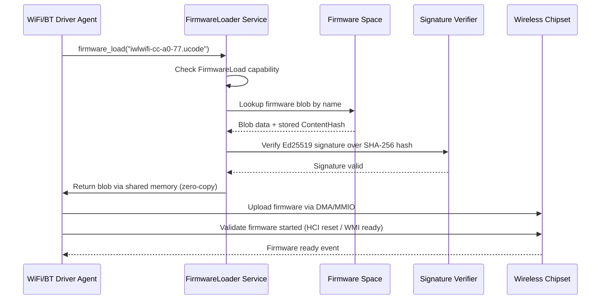

# AIOS Wireless Firmware Loading & Management

Part of: [wireless.md](../wireless.md) — WiFi & Bluetooth
**Related:** [security.md](./security.md) — Firmware trust model, [wifi.md](./wifi.md) — WiFi driver initialization, [bluetooth.md](./bluetooth.md) — HCI firmware download, [integration.md](./integration.md) — USB dongle firmware

-----

## 5. Firmware Loading & Management

Wireless chipsets are not self-contained processors that ship with their own software burned into ROM. The vast majority require the host operating system to upload firmware — compiled binary blobs — into the chipset's embedded processor before the radio becomes functional. This firmware controls everything from baseband signal processing to power amplifier calibration, making it one of the most security-sensitive components in the system. AIOS treats firmware loading as a first-class subsystem concern: capability-gated, signature-verified, and isolated from kernel trust.

-----

### 5.1 Firmware Blob Strategy

Most WiFi and Bluetooth chipsets require proprietary firmware uploaded by the host at initialization time. The specific files vary by vendor and chipset family:

- **Intel WiFi (iwlwifi)**: `.ucode` files (e.g., `iwlwifi-cc-a0-77.ucode`), versioned per hardware stepping and firmware API generation
- **Broadcom WiFi (brcmfmac)**: `.bin` firmware + `.txt` NVRAM configuration (board-specific calibration data)
- **Qualcomm Atheros WiFi (ath10k/ath11k/ath12k)**: `board.bin` (calibration) + `firmware-N.bin` (runtime firmware), sometimes `board-2.bin` with per-board overrides
- **Qualcomm Bluetooth**: `.tlv` (Tag-Length-Value formatted firmware) + `.bin` (NVM configuration)
- **Realtek Bluetooth**: `.bin` firmware files (e.g., `rtl8761bu_fw.bin`), loaded via USB bulk transfer
- **MediaTek combo chips**: single firmware blob covering both WiFi and Bluetooth (shared processor)
- **Cypress/Infineon (brcmfmac successor)**: `.bin` + `.clm_blob` (Country Locale Matrix, regulatory data baked into firmware)

Firmware sizes vary significantly: Bluetooth firmware is typically 50--500 KiB, WiFi firmware ranges from 200 KiB (simple USB adapters) to 2 MiB (modern WiFi 6E/7 chipsets with complex beamforming engines). Some chipsets (Intel AX210/AX211) exceed 2.5 MiB including calibration data.

**Licensing.** These blobs are redistributable under manufacturer-specific licenses (not GPL, not copyleft). AIOS bundles them in a read-only firmware Space, following the same distribution model as the Linux `linux-firmware` package. The AIOS BSD-2-Clause license applies to AIOS code only; firmware blobs retain their original manufacturer licenses.

**Open firmware precedent.** The Atheros AR9271 chipset runs fully open-source firmware (`open-ath9k-htc-firmware`) on its embedded MIPS core. This proves that open WiFi firmware is technically feasible. Vendors resist open firmware for business reasons (competitive advantage in RF algorithms, regulatory certification complexity, and proprietary calibration data). The AR9271 remains the only widely-available WiFi chipset with community-maintained open firmware.

**AIOS stance on firmware trust.** Firmware runs on a separate processor inside the wireless chipset. That processor typically has direct DMA access to host memory (constrained by IOMMU where available). AIOS makes three commitments:

1. **Support proprietary blobs pragmatically** — users need working WiFi and Bluetooth today
2. **Prefer open firmware where available** — mark open-firmware devices as "fully auditable" in the security UI (see [security.md](./security.md))
3. **Treat all firmware as untrusted code** — every HCI event, WMI response, and received frame from firmware is validated before processing. A compromised firmware blob cannot escalate to kernel compromise if IOMMU isolation is enforced.

**Firmware inventory.** The FirmwareLoader maintains a manifest of all bundled firmware blobs, indexed by `(vendor_id, product_id, revision)` tuples. This manifest enables:

- Automatic firmware selection based on detected hardware (no user intervention)
- Reporting which hardware is supported before purchase (queryable via Inspector)
- Identifying firmware gaps when new hardware is plugged in (audit event: "no firmware for device 0x1234:0x5678")
- Tracking firmware versions across fleet deployments

```rust
struct FirmwareManifest {
    entries: &'static [FirmwareEntry],
}

struct FirmwareEntry {
    vendor_id: u16,
    product_id: u16,
    revision_min: u16,        // minimum hardware revision
    revision_max: u16,        // maximum hardware revision
    firmware_name: &'static str,
    firmware_type: FirmwareType,
    abi_version: u32,
    size_bytes: u32,
    hash: ContentHash,
}

enum FirmwareType {
    WifiFull,         // complete WiFi firmware image
    WifiCalibration,  // board-specific calibration data
    WifiNvram,        // NVRAM configuration (Broadcom)
    BtPrimary,        // main Bluetooth firmware
    BtNvm,            // Bluetooth NVM/configuration
    CombinedRadio,    // MediaTek-style combo firmware
}
```

-----

### 5.2 Loading Mechanism

Firmware loading is mediated by the `FirmwareLoader` service, a privileged kernel service that enforces capability checks and signature verification before releasing firmware blobs to driver agents.

**Capability gate.** A driver agent must hold the `FirmwareLoad` capability to request firmware. This capability is restricted to driver agents spawned by the device manager — application agents cannot request firmware directly.

**Firmware storage.** All firmware blobs reside in `/spaces/system/firmware/` (a Space directory within the system Space, not a POSIX filesystem path). This Space is:

- Read-only after initial population (immutable at runtime)
- Integrity-protected via content-addressed storage (SHA-256 hashes verified on read)
- Updated only through signed OS updates

**Loading flow.**



**Step-by-step detail:**

1. **Device identification.** The driver agent reads the device's vendor ID, product ID, and hardware revision from USB descriptors, PCI config space, or SDIO CIS tuples. These identify which firmware file is required.

2. **Firmware request.** The driver sends an IPC message to the FirmwareLoader service with the firmware filename (e.g., `"brcmfmac43455-sdio.bin"`). The FirmwareLoader is a registered kernel service discoverable via `service_lookup(b"firmware-loader")`.

3. **Capability check.** FirmwareLoader verifies the requesting agent holds `FirmwareLoad`. Requests without this capability are rejected and audited.

4. **Space lookup.** FirmwareLoader reads the firmware blob from the firmware Space. The Space storage layer verifies the content hash (SHA-256) on read, detecting any corruption.

5. **Signature verification.** FirmwareLoader verifies an Ed25519 signature over the blob's SHA-256 content hash. The signing key is the AIOS firmware distribution key, embedded in the kernel image. Firmware without a valid signature is rejected.

6. **Zero-copy delivery.** The verified firmware blob is mapped into a shared memory region between FirmwareLoader and the driver agent. No copy occurs — the driver reads directly from the shared mapping. The shared region is read-only from the driver's perspective.

7. **Device upload.** The driver uploads firmware to the chipset using the chipset-specific protocol (USB bulk transfer for btusb, MMIO writes for PCIe, SDIO CMD53 for SDIO devices).

8. **Firmware validation.** The driver confirms the firmware started correctly by checking for the expected initialization response: HCI Command Complete for `HCI_Reset` (Bluetooth), WMI Ready event (Qualcomm WiFi), or firmware version report (Intel WiFi).

**Asynchronous loading.** Firmware loading does not block kernel boot. The wireless subsystem becomes available when firmware loading completes. Other subsystems (audio, input, networking) that depend on wireless connectivity handle the delay gracefully through the subsystem framework's device-availability notifications.

**Resume cache.** On suspend, the wireless chipset loses power and firmware state. On resume, firmware must be reloaded. The FirmwareLoader caches validated firmware blobs in kernel memory (DMA pool) to avoid re-reading from storage and re-verifying signatures during the resume path. The cache is invalidated on OS update (when firmware Space contents change).

**Error handling and recovery.** Firmware loading failures are classified by severity:

```text
Transient errors (retry with backoff):
├── Storage I/O timeout         → retry up to 3 times, 100ms backoff
├── Chipset not ready           → retry after reset, up to 5 times
└── USB transfer stall          → clear stall, retry transfer

Permanent errors (report and disable device):
├── Firmware not found          → no matching entry in manifest
├── Signature verification fail → possible tampering, audit alert
├── ABI version mismatch        → driver/firmware incompatible
└── Chipset rejected firmware   → hardware fault or wrong firmware
```

On permanent failure, the wireless subsystem marks the device as unavailable and emits an audit event. The device remains in the device registry but is not presented to agents. The user can view the failure reason in the Inspector dashboard.

**Firmware loading timeout.** The entire firmware loading sequence (request, verify, upload, validate) has a 10-second timeout. Chipsets that fail to initialize within this window are treated as a permanent failure. This prevents a misbehaving chipset from blocking other device initialization.

**Coredump collection.** When a wireless chipset crashes after firmware is running, the driver attempts to extract a firmware coredump before resetting the device. Coredumps are stored in the ephemeral Space (`/spaces/ephemeral/firmware-dumps/`) with the device ID and timestamp. These are invaluable for diagnosing firmware bugs — particularly for proprietary firmware where source-level debugging is impossible. Coredump collection is capability-gated (`FirmwareDebug`) and disabled by default in production builds.

-----

### 5.3 Firmware Versioning

Firmware versioning is critical because each driver version expects a specific firmware ABI. Loading firmware with an incompatible ABI leads to undefined behavior — silent data corruption, phantom disconnections, or chipset hangs that require a power cycle to recover.

**ABI compatibility enforcement.** Each driver declares the firmware ABI versions it supports:

```rust
struct FirmwareMetadata {
    name: &'static str,
    min_abi_version: u32,
    max_abi_version: u32,
    expected_hash: ContentHash,  // SHA-256
}
```

The driver passes this metadata to FirmwareLoader alongside the filename. FirmwareLoader extracts the ABI version from the firmware blob header (vendor-specific format) and rejects the load if the version falls outside `[min_abi_version, max_abi_version]`. A version mismatch produces an explicit error — never silent fallback.

**Multi-stage firmware.** Some chipsets require firmware loaded in multiple stages, where each stage prepares the chipset for the next:

- **Intel WiFi (iwlwifi)**: IML (Initial MIPS Loader) runs first, then the main uCode image. Each stage is verified independently.
- **Qualcomm ath11k/ath12k**: Board data loaded first (calibration), then runtime firmware.
- **Broadcom brcmfmac**: Firmware binary loaded first, then NVRAM text file parsed and uploaded.

Each stage is a separate `firmware_load()` call with its own `FirmwareMetadata`. A failure at any stage aborts the entire initialization sequence and reports the specific stage that failed.

**Firmware patch sets.** Some vendors (notably Realtek for Bluetooth) distribute firmware as a base image plus a set of patches applied sequentially. The driver loads the base image, then applies patches one by one. Each patch is a small binary diff that modifies specific firmware functions. FirmwareLoader treats each patch as a separate firmware blob with its own signature and version metadata. The patch application order is encoded in the patch filenames (e.g., `rtl8761bu_config.bin` applied after `rtl8761bu_fw.bin`).

**BLE peripheral firmware updates.** Bluetooth Low Energy peripherals (earbuds, keyboards, fitness trackers) support over-the-air firmware updates via the Device Firmware Update (DFU) profile over GATT. The AIOS Bluetooth subsystem supports DFU as a capability-gated operation:

- The `BtFirmwareUpdate` capability is required to initiate a DFU transfer
- DFU targets are validated (only paired, trusted devices)
- Transfer progress is reported through the Bluetooth Manager
- Failed updates trigger automatic rollback on the peripheral (DFU spec requires dual-bank storage)

**Differential firmware updates.** Full firmware images range from 500 KiB (Bluetooth) to 2 MiB (WiFi). For OS updates that only change firmware blobs, the content-addressed storage in Spaces enables efficient delta computation. Only the changed blocks are downloaded and applied, reducing update bandwidth for metered connections.

**Firmware fallback chains.** Some chipset families accept multiple firmware versions with varying feature sets. The driver declares a fallback chain — an ordered list of firmware files from most-preferred to minimum-viable:

```rust
const IWL_AX210_FIRMWARE_CHAIN: &[FirmwareMetadata] = &[
    FirmwareMetadata {
        name: "iwlwifi-ty-a0-gf-a0-77.ucode",
        min_abi_version: 77,
        max_abi_version: 77,
        expected_hash: /* SHA-256 */,
    },
    FirmwareMetadata {
        name: "iwlwifi-ty-a0-gf-a0-72.ucode",
        min_abi_version: 72,
        max_abi_version: 72,
        expected_hash: /* SHA-256 */,
    },
];
```

FirmwareLoader tries each entry in order. The first successful load wins. This allows AIOS to ship newer firmware while retaining compatibility with older firmware versions that users may have manually installed.

-----

### 5.4 Open Firmware

**ath9k_htc (Atheros AR9271).** The AR9271 is a USB 802.11n WiFi adapter whose firmware runs on an embedded MIPS core. The `open-ath9k-htc-firmware` project provides fully open-source firmware, compiled from C source with a standard MIPS toolchain. This firmware:

- Enables features vendors typically lock out (monitor mode, packet injection, arbitrary channel selection)
- Receives community bug fixes independent of Atheros/Qualcomm release cycles
- Allows full security audit of the code running on the radio processor
- Proves that open WiFi firmware is technically viable — the barriers are commercial, not engineering

**Other open firmware efforts.** Beyond ath9k_htc, several projects push for wireless firmware transparency:

- **OpenWrt** maintains community-patched versions of some Broadcom firmware, though the core remains proprietary
- **Libre-Mesh** project documents which chipsets work without proprietary blobs
- **RISC-V based wireless chipsets** (e.g., Bouffalo Lab BL602/BL706) ship with open SDKs and partially open firmware, though RF calibration remains closed
- The **ESP32** series from Espressif has open-source host drivers but closed WiFi/BT firmware running on a separate core

**Why most firmware remains closed.** Three factors keep WiFi/Bluetooth firmware proprietary:

1. **Competitive advantage.** RF algorithms (beamforming weights, rate adaptation, power amplifier linearization) represent significant R&D investment. Vendors view these as trade secrets.
2. **Regulatory certification.** Wireless devices are certified (FCC, CE, MIC) with specific firmware. Open firmware that allows arbitrary TX power or channel selection could violate certification. Vendors argue that controlling firmware is necessary for regulatory compliance.
3. **Calibration data.** Per-device RF calibration data (antenna gain, frequency offset, IQ imbalance) is generated during manufacturing and embedded in firmware or companion files. Vendors consider calibration procedures proprietary.

**AIOS strategy for open firmware.**

- Ship proprietary firmware blobs by default (pragmatic — users need working hardware)
- Allow users to replace firmware with open alternatives through a documented process
- Mark devices running open firmware as "fully auditable" in the Inspector security dashboard (see [security.md](./security.md))
- Enforce identical IOMMU isolation and output validation regardless of firmware provenance — open firmware receives no additional kernel trust
- As AIOS gains adoption, advocate for open firmware with hardware vendors. The capability model and IOMMU isolation make this argument stronger: even with closed firmware, AIOS already constrains firmware behavior at the hardware boundary. Open firmware adds auditability without changing the security architecture.

**Firmware transparency log.** Regardless of whether firmware is open or proprietary, AIOS logs every firmware load event to the audit subsystem:

```rust
struct FirmwareLoadEvent {
    device_id: DeviceId,          // USB/PCI device identifier
    firmware_name: [u8; 64],      // filename loaded
    firmware_hash: ContentHash,   // SHA-256 of loaded blob
    signature_valid: bool,        // Ed25519 verification result
    abi_version: u32,             // firmware ABI version
    load_time_us: u64,            // microseconds to complete loading
    open_firmware: bool,          // whether this is known open-source firmware
}
```

This audit trail enables fleet-wide firmware inventory, anomaly detection (unexpected firmware hash), and compliance reporting.

-----

### 5.5 Regulatory Domain

Wireless regulatory compliance is a legal requirement in every jurisdiction. Transmitting outside authorized frequency ranges, exceeding power limits, or ignoring radar avoidance obligations violates telecommunications law and can cause harmful interference to safety-critical systems (weather radar, aviation).

**Regulatory database.** AIOS embeds the `wireless-regdb` database (from the Linux wireless-regdb project, licensed under the ISC license). This database maps ISO 3166-1 alpha-2 country codes to:

- Allowed frequency ranges per band (2.4 GHz, 5 GHz sub-bands, 6 GHz)
- Maximum transmit power per channel (in dBm EIRP)
- DFS (Dynamic Frequency Selection) requirements per channel
- Indoor/outdoor restrictions
- Maximum channel bandwidth (20/40/80/160/320 MHz)

**Kernel-resident enforcement.** Regulatory rules are enforced by the kernel, not by driver agents. An agent cannot bypass regulatory limits even if it holds `WifiMonitor` or `BtRawHci` capabilities. The kernel validates every channel/power configuration request against the active regulatory domain before programming the hardware.

**RegDomain trait.** Drivers and the WiFi Manager query regulatory rules through a kernel-provided trait:

```rust
trait RegDomain {
    fn allowed_channels(&self, band: Band) -> &[ChannelRule];
    fn max_tx_power(&self, channel: Channel) -> TxPower;
    fn requires_dfs(&self, channel: Channel) -> bool;
    fn requires_afc(&self, channel: Channel) -> bool;
    fn is_indoor_only(&self, channel: Channel) -> bool;
}
```

`ChannelRule` encodes the center frequency, bandwidth limits, maximum power, and applicable flags (DFS, indoor-only, no-IR, AFC-required) for each permitted channel:

```rust
struct ChannelRule {
    center_freq_mhz: u16,      // e.g., 5180 for channel 36
    max_bandwidth_mhz: u16,    // 20, 40, 80, 160, or 320
    max_eirp_dbm: i8,          // maximum EIRP in dBm
    flags: ChannelFlags,       // bitflags: DFS, INDOOR_ONLY, NO_IR, AFC_REQUIRED, NO_OFDM
}

bitflags! {
    struct ChannelFlags: u16 {
        const DFS          = 0x0001;  // requires radar detection
        const INDOOR_ONLY  = 0x0002;  // prohibited outdoors
        const NO_IR        = 0x0004;  // no initiating radiation (passive scan only)
        const AFC_REQUIRED = 0x0008;  // requires AFC response before TX
        const NO_OFDM      = 0x0010;  // DSSS/CCK only (JP ch 14)
        const AUTO_BW      = 0x0020;  // bandwidth determined by AP capability
    }
}
```

**DFS (Dynamic Frequency Selection) state machine.** The 5 GHz band (and parts of 6 GHz in some jurisdictions) shares spectrum with weather radar and military radar systems. DFS requires the wireless system to detect radar pulses and vacate the channel:

```text
USABLE ──(start CAC)──> CAC_IN_PROGRESS ──(CAC complete)──> AVAILABLE
   ^                                                            |
   |                       <--(radar detected)------------------+
   |                   UNAVAILABLE ──(NOP timeout)──> USABLE
```

- **CAC (Channel Availability Check)**: Before transmitting on a DFS channel, the radio must listen for radar for a mandatory period — 60 seconds under ETSI (Europe), 1 to 10 minutes under FCC (US) depending on the channel.
- **Radar detection**: If radar is detected on the current operating channel, the wireless system must vacate (stop all transmissions) within 200 ms (ETSI) or 260 ms (FCC). All connected clients receive a Channel Switch Announcement (CSA) directing them to a non-DFS channel.
- **NOP (Non-Occupancy Period)**: After radar detection, the channel is unavailable for 30 minutes before CAC can be reattempted.
- **Real-time scheduling**: DFS radar detection and channel evacuation have hard deadlines. The radar detection task runs at RT scheduler class priority to meet the 200 ms vacating requirement.
- **Background CAC**: While operating on a non-DFS channel, the radio can perform CAC on DFS channels in the background (if the hardware supports off-channel scanning). This pre-qualifies DFS channels for faster channel switching when needed.
- **Weather radar channels**: Channels 120, 124, 128 (5.6--5.65 GHz) overlap with TDWR (Terminal Doppler Weather Radar) in the US, requiring extended CAC of 10 minutes instead of the standard 60 seconds.

The DFS state is tracked per channel and persisted across suspend/resume cycles. Channels that completed CAC before suspend retain their AVAILABLE status on resume (within the NOP timeout window), avoiding redundant 60-second CAC delays.

**WiFi 6E AFC (Automated Frequency Coordination).** The 6 GHz band (5.925--7.125 GHz) introduces a new regulatory mechanism for outdoor and higher-power indoor use:

- **Standard Power (SP)**: Outdoor 6 GHz operation requires querying an AFC (Automated Frequency Coordination) database operated by a licensed entity. The device submits its geographic location (GPS or user-provided) and receives a response specifying which 6 GHz channels are permitted at that location and the maximum allowed power for each.
- **Low Power Indoor (LPI)**: Indoor-only 6 GHz operation at reduced power (typically 5 dBi + 24 dBm EIRP). No AFC query required. The device must not be used outdoors in LPI mode.
- **Very Low Power (VLP)**: Even lower power limits, permitted both indoors and outdoors without AFC. Intended for short-range applications (wearables, AR/VR tethering).

AFC integration in AIOS:

- AFC queries are sent through the AI Network Model (ANM), which requires network connectivity — creating a bootstrap dependency (WiFi needs AFC, AFC needs network). Initial 6 GHz connections use LPI/VLP modes until an AFC response is obtained.
- AFC responses are cached with a validity period (typically 24 hours). The cache persists across suspend/resume in the ephemeral Space.
- Location information for AFC queries uses coarse precision (street-level, not exact coordinates) to limit privacy exposure.
- AFC database providers must be certified by the FCC (US) or equivalent authority. AIOS ships with a configurable list of AFC provider URLs.
- If AFC queries fail (no network, provider down), the device falls back to LPI mode with reduced power rather than disabling 6 GHz entirely.

**Regulatory updates.** The `wireless-regdb` is updated through signed OS updates. The firmware Space holding the regulatory database is read-only at runtime — no agent can modify regulatory rules. The regdb is compiled into a binary format (matching the CRDA binary database format) for efficient lookup — O(1) country lookup, O(n) channel enumeration where n is the number of rules for that country.

**Self-managed regulatory in firmware.** Some WiFi chipsets (particularly FullMAC designs like Broadcom brcmfmac) enforce their own regulatory domain internally via a Country Locale Matrix (CLM) embedded in the firmware. For these devices, AIOS applies regulatory enforcement at both layers: the firmware's internal CLM restricts RF parameters, and the kernel's regdb independently validates all channel/power requests. The more restrictive of the two limits applies. This defense-in-depth approach prevents a compromised firmware from transmitting on prohibited channels even if it ignores its own CLM.

**Per-country channel allocation examples:**

```text
US:   2.4 GHz (ch 1-11, 30 dBm)
      5 GHz (ch 36-64, 100-144 DFS, 149-165)
      6 GHz (ch 1-233, AFC/LPI/VLP, max 36 dBm SP)

EU:   2.4 GHz (ch 1-13, 20 dBm EIRP)
      5 GHz (ch 36-64, 100-140 DFS, 23 dBm EIRP)
      6 GHz (ch 1-93 LPI/VLP only, no outdoor SP yet)

JP:   2.4 GHz (ch 1-14, ch 14 restricted to 802.11b DSSS only)
      5 GHz (ch 36-64 W52, 100-140 W53/W56 DFS)
      6 GHz (regulatory proceedings ongoing)
```

**Country detection.** The active regulatory domain is determined through a priority chain:

1. **User-configured country code** — highest priority, set explicitly in system settings
2. **Country IE from associated AP** — the AP's beacon includes a Country Information Element specifying the regulatory domain
3. **802.11d country element** — scanned from nearby AP beacons before association
4. **Timezone-based heuristic** — maps system timezone to probable country (least reliable, used only as last resort)
5. **World regulatory domain (WW)** — most restrictive intersection of all country rules, used when no country can be determined

When the regulatory domain changes (e.g., user travels and connects to a foreign AP), the wireless subsystem:

- Validates all current channel/power configurations against the new domain
- Tears down connections on channels that are no longer permitted
- Updates the DFS state machine (different CAC timings per jurisdiction)
- Logs the regulatory domain transition in the audit trail

The active regulatory domain is visible in the Inspector dashboard and reported in the wireless subsystem's status output. Regulatory violations (attempted transmission on a prohibited channel, power limit exceeded) are blocked by the kernel and generate audit alerts.

**Bluetooth regulatory considerations.** Bluetooth operates in the 2.4 GHz ISM band, which is globally allocated for unlicensed use. Regulatory constraints are simpler than WiFi but still apply:

- Maximum TX power varies by jurisdiction (typically 10 dBm class 2, 20 dBm class 1)
- Adaptive Frequency Hopping (AFH) is mandatory in most jurisdictions to avoid interference with WiFi and other ISM devices
- BLE advertising on channels 37, 38, 39 has separate power limits in some jurisdictions
- The kernel enforces Bluetooth power limits through the same `RegDomain` mechanism used for WiFi

**Regulatory domain and coexistence.** When WiFi and Bluetooth share the 2.4 GHz band, regulatory constraints interact with coexistence mechanisms. The coexistence engine (see [integration.md](./integration.md)) respects regulatory limits when performing Adaptive Frequency Hopping — it cannot hop to channels outside the permitted set, even if those channels would provide better interference avoidance. Similarly, when WiFi DFS forces a channel change from 5 GHz to 2.4 GHz, the coexistence engine must immediately adjust Bluetooth AFH maps to accommodate the new WiFi channel.

**Regulatory testing support.** For hardware certification testing, AIOS provides a restricted test mode (gated by a `RegulatoryTest` capability that is never granted to production agents) that allows:

- Fixed-frequency continuous transmission (for conducted emissions testing)
- Duty cycle control (for SAR compliance measurement)
- Per-antenna TX power calibration
- Receiver sensitivity measurement (fixed-channel receive with packet error rate reporting)

This test mode is accessible only through a dedicated certification agent that requires physical access to enable (hardware button press or UART command during boot). It cannot be activated remotely or by software alone.
