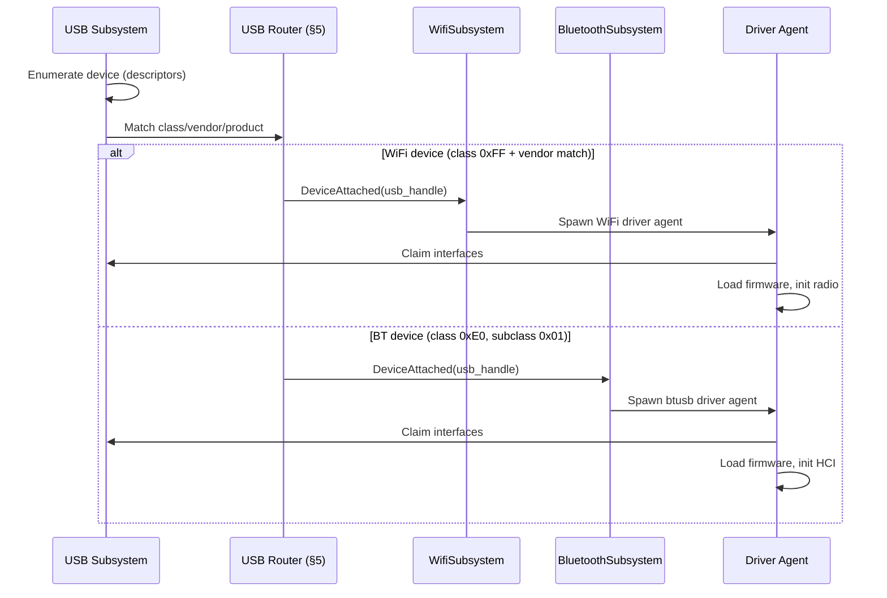
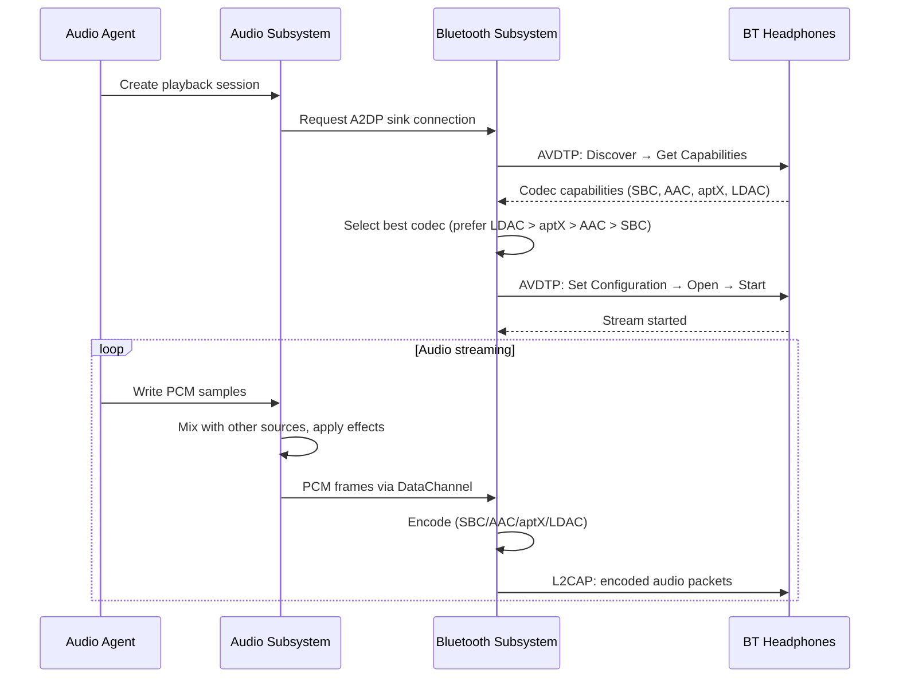

# AIOS Wireless Subsystem Integration

Part of: [wireless.md](../wireless.md) — WiFi & Bluetooth
**Related:** [subsystem-framework.md](../subsystem-framework.md) — Universal framework patterns, [usb.md](../usb.md) — USB dongle discovery, [audio.md](../audio.md) — BT audio routing, [input.md](../input.md) — BT HID devices, [networking.md](../networking.md) — WiFi as ANM Link Layer transport, [power-management.md](../power-management.md) — Radio power states

-----

## 7. Subsystem Integration

The wireless subsystem does not exist in isolation. WiFi provides Link Layer transport for the ANM mesh (native AIOS networking) and the Bridge Module (legacy TCP/IP). Bluetooth routes audio through the audio subsystem, HID input through the input subsystem, and serial data through POSIX device nodes. BLE additionally provides peer discovery for ANM mesh peers. Both radios arrive over USB on QEMU and early hardware targets. Both share the 2.4 GHz band and must coordinate to avoid mutual interference. This section defines every integration surface — the contracts between the wireless subsystem and the rest of AIOS.

-----

### 7.1 Subsystem Framework

The wireless subsystem implements the universal Subsystem trait defined in [subsystem-framework.md](../subsystem-framework.md). Rather than registering a single monolithic subsystem, AIOS registers two logical subsystems — `WifiSubsystem` and `BluetoothSubsystem` — because they have separate capability domains, separate session lifecycles, and separate device registries. A user may grant an agent WiFi scanning capability without granting Bluetooth pairing capability, and vice versa.

The two subsystems coordinate through a shared coexistence engine (see §7.8) but are otherwise independent in the framework's eyes. Each has its own session table, its own audit channel, and its own power state machine.

#### 7.1.1 Session Model

Each subsystem maintains per-agent sessions that track capability grants, connection state, and audit context:

```rust
struct WifiSession {
    agent_id: AgentId,
    capabilities: Vec<WifiCapability>,
    state: WifiSessionState,   // Disconnected, Scanning, Connected, P2P
    audit_channel: ChannelId,
}

struct BluetoothSession {
    agent_id: AgentId,
    capabilities: Vec<BtCapability>,
    connections: Vec<BtConnectionHandle>,
    audit_channel: ChannelId,
}
```

`WifiSession` tracks a single association state because an agent interacts with one WiFi network at a time (the underlying radio may support multiple virtual interfaces, but each vif maps to a separate session). `BluetoothSession` tracks multiple concurrent connections because an agent may use a keyboard, mouse, and headphones simultaneously.

#### 7.1.2 Capability Gate Enforcement

Every wireless operation passes through the capability gate before proceeding. The gate checks are defined per-operation, not per-subsystem — a fine-grained model that prevents ambient authority:

```text
WiFi operations:
    wifi_scan()             → requires WifiScan capability
    wifi_connect()          → requires WifiConnect capability
    wifi_disconnect()       → requires WifiConnect capability
    wifi_create_ap()        → requires WifiAp capability
    wifi_send_raw_frame()   → requires WifiMonitor capability (driver agents only)

Bluetooth operations:
    bt_scan()               → requires BtDiscovery capability
    bt_pair()               → requires BtPair capability
    bt_connect_profile()    → requires profile-specific capability (BtAudio, BtHid, BtFile, etc.)
    bt_send_hci_raw()       → requires BtRawHci capability (driver agents only)
```

Capability attenuation follows the standard model ([subsystem-framework.md](../subsystem-framework.md) §5). A parent agent holding `BtAudio` can delegate an attenuated form restricted to a specific device address, so a child agent can reconnect to known headphones but cannot initiate connections to arbitrary devices.

#### 7.1.3 Audit Logging

All wireless operations generate audit records through the subsystem framework's audit channel ([subsystem-framework.md](../subsystem-framework.md) §7). Audit records include:

- **WiFi**: scan initiated/completed, association attempt/success/failure, deauthentication, AP mode start/stop, raw frame sent
- **Bluetooth**: scan initiated/completed, pairing attempt/success/failure, profile connection/disconnection, HCI command issued

Each record carries the agent ID, timestamp, and operation-specific details. The user can query "which agents have used Bluetooth in the last hour?" through the Inspector application ([inspector.md](../../applications/inspector.md)).

#### 7.1.4 Device Registration

WiFi and Bluetooth hardware registers with the device registry ([subsystem-framework.md](../subsystem-framework.md) §10) using device descriptors that capture radio-specific metadata:

```rust
struct WifiDeviceDescriptor {
    bands: Vec<WifiBand>,           // 2.4 GHz, 5 GHz, 6 GHz
    supported_modes: WifiModeFlags, // STA, AP, P2P, Monitor
    max_scan_ssids: u8,
    firmware_version: FirmwareVersion,
    regulatory_domain: RegDomain,
}

struct BtDeviceDescriptor {
    bt_version: BtVersion,         // 4.2, 5.0, 5.1, 5.2, 5.3, 5.4
    le_supported: bool,
    classic_supported: bool,
    max_acl_connections: u8,
    max_le_connections: u8,
    supported_codecs: Vec<BtCodecId>,
}
```

These descriptors allow the system to enumerate available wireless capabilities without querying the hardware directly — useful for capability pre-checking and UI display.

-----

### 7.2 USB Transport

USB is the primary transport for WiFi and Bluetooth hardware on QEMU (which has no native wireless chipset) and on early hardware targets where USB dongles are the most accessible option. The Raspberry Pi 4/5 also uses USB internally for some wireless chipsets (the BCM4345C0 Bluetooth controller on Pi 4 connects via UART, but many third-party adapters are USB).

#### 7.2.1 Discovery Flow

The USB subsystem discovers wireless devices through standard USB enumeration and routes them to the appropriate wireless subsystem:



WiFi devices are identified by vendor/product ID rather than USB class code because most USB WiFi adapters use vendor-specific class codes (0xFF). The routing table in [usb.md](../usb.md) §5 contains the vendor/product match list. Bluetooth devices use the standard Wireless Controller class (0xE0) with subclass 0x01 (RF Controller) and protocol 0x01 (Bluetooth), making class-based routing reliable.

#### 7.2.2 btusb HCI Transport

The `btusb` driver implements the `HciTransport` trait over USB bulk, interrupt, and isochronous endpoints. The USB Bluetooth transport uses a fixed endpoint layout defined by the Bluetooth USB Transport specification:

```text
Endpoint 0 (Control)     : HCI commands (host → controller)
Endpoint 1 IN (Interrupt) : HCI events (controller → host)
Endpoint 2 OUT (Bulk)     : ACL data out (host → controller)
Endpoint 2 IN (Bulk)      : ACL data in (controller → host)
Endpoint 3 (Isochronous)  : SCO/eSCO audio data (bidirectional)
Endpoint 4 (Bulk)         : Diagnostic/vendor-specific (optional)
```

HCI commands are sent via USB control transfers on the default endpoint (endpoint 0). HCI events and ACL data arrive on interrupt and bulk IN endpoints respectively. The driver submits multiple URBs (USB Request Blocks) on the event and ACL IN endpoints to ensure the controller always has a buffer available — dropping an HCI event because no URB was posted is a protocol violation.

Isochronous endpoint 3 carries SCO/eSCO voice data. The btusb driver configures the isochronous alternate setting based on the SCO connection's air coding format (CVSD for 8 kHz, mSBC for 16 kHz). Isochronous transfers have fixed bandwidth guarantees negotiated during USB enumeration, which maps naturally to SCO's fixed-rate voice channels.

#### 7.2.3 USB WiFi Drivers

Most USB WiFi devices use a FullMAC architecture where the chipset's embedded firmware handles the 802.11 state machine (association, authentication, encryption). The host driver sends high-level commands ("connect to this SSID with this PSK") and receives data frames. This means the USB WiFi driver wraps the device behind the `WifiDriver` trait with relatively thin command translation.

SoftMAC USB WiFi devices — where the host controls the 802.11 state machine directly — exist but are uncommon in USB form factor. The Atheros AR9271 with open-ath9k-htc firmware is the notable exception. AIOS supports SoftMAC devices through the same `WifiDriver` trait by implementing the 802.11 MLME (MAC Layer Management Entity) in the driver agent rather than delegating to firmware.

#### 7.2.4 Hotplug

USB WiFi and Bluetooth dongles can be inserted and removed at runtime. The hotplug flow follows the USB subsystem's hotplug state machine ([usb.md](../usb.md) §7):

- **Insert**: USB subsystem detects the device, routes to the wireless subsystem, the subsystem spawns a driver agent, the driver initializes the hardware and registers the device in the wireless device registry. If the device was previously bonded (Bluetooth) or had saved network profiles (WiFi), connections resume automatically.
- **Remove**: The USB subsystem sends a disconnect notification to the driver agent. The driver cleans up: active WiFi associations are torn down, Bluetooth connections are terminated, audio routes switch to alternatives (see §7.3), and input devices are unregistered from the input subsystem. The wireless subsystem removes the device from its registry and closes all sessions that depended on the removed hardware.

-----

### 7.3 Audio Integration

Bluetooth audio is a collaboration between the Bluetooth subsystem and the audio subsystem ([audio.md](../audio.md)). The Bluetooth subsystem handles radio transport, codec negotiation, and profile signaling. The audio subsystem handles mixing, effects, routing, and presentation to agents. Neither subsystem owns the full audio path — they share responsibility at a well-defined boundary.

#### 7.3.1 A2DP Integration

A2DP (Advanced Audio Distribution Profile) provides high-quality stereo audio streaming. The integration flow spans both subsystems:



The boundary between subsystems is PCM audio. The audio subsystem delivers mixed, effects-processed PCM frames to the Bluetooth subsystem via a DataChannel ([subsystem-framework.md](../subsystem-framework.md) §6). The Bluetooth subsystem encodes those frames using the negotiated codec and transmits them over L2CAP. This boundary keeps codec-specific logic in the Bluetooth subsystem (where it belongs, alongside AVDTP signaling) and keeps mixing/effects in the audio subsystem (where it belongs, alongside all other audio sources).

Codec selection follows a quality preference order: LDAC (990 kbps, near-lossless) > aptX HD (576 kbps) > aptX (352 kbps) > AAC (256 kbps) > SBC (328 kbps, mandatory baseline). The Bluetooth subsystem selects the highest-quality codec supported by both the local controller and the remote device. AIRS can override this selection based on context — for example, selecting a lower-bitrate codec when battery is low or WiFi coexistence pressure is high (see [ai-native.md](./ai-native.md)).

#### 7.3.2 HFP Integration

HFP (Hands-Free Profile) provides bidirectional voice audio for phone calls and voice assistants. Unlike A2DP's unidirectional high-quality stream, HFP uses SCO/eSCO synchronous links with narrow-band (8 kHz CVSD) or wide-band (16 kHz mSBC) codecs.

The Bluetooth subsystem bridges SCO audio to the audio subsystem's capture and playback pipelines:

- **Playback direction**: audio subsystem delivers mixed PCM at 8/16 kHz to the Bluetooth subsystem, which writes it into the SCO TX buffer. The USB isochronous endpoint carries it to the controller.
- **Capture direction**: SCO RX data arrives via USB isochronous endpoint, the Bluetooth subsystem decodes CVSD/mSBC to PCM, and delivers it to the audio subsystem's capture pipeline. Agents receive it through standard audio capture sessions.
- **Call control**: HFP uses an AT command channel (RFCOMM) for call signaling — answer, hang up, hold, volume up/down, voice dial. The Bluetooth subsystem exposes these as IPC messages to the telephony agent.

#### 7.3.3 LE Audio Integration

LE Audio (Bluetooth 5.2+) introduces isochronous channels (CIS for point-to-point, BIS for broadcast) carrying LC3-encoded audio. LE Audio replaces both A2DP and HFP with a unified, lower-power, higher-quality transport.

The integration follows the same PCM boundary as A2DP:

- The Bluetooth subsystem manages isochronous transport setup (CIG/CIS creation, QoS negotiation)
- LC3 encode/decode happens in the audio subsystem (matching the A2DP model where codec processing is centralized alongside mixing and effects)
- The audio subsystem delivers/receives PCM frames, unaware of the underlying BLE transport
- **Multi-stream**: LE Audio supports independent streams to each earbud (left/right), enabling true wireless stereo. The audio subsystem splits stereo PCM into left/right channels, and the Bluetooth subsystem routes each to its CIS. This eliminates the inter-earbud relay hop that classic A2DP TWS implementations require.

#### 7.3.4 Hotplug Route Switching

When Bluetooth audio devices connect or disconnect, the audio subsystem adjusts output/input routing automatically:

- **Connect**: When a Bluetooth headset connects and A2DP/HFP streams become available, the audio subsystem can auto-route output to the headset. This behavior is governed by user preferences — some users want automatic switching, others prefer manual control. The default is automatic for headphones, manual for speakers.
- **Disconnect**: When a Bluetooth audio device disconnects (user walks away, battery dies, dongle removed), the audio subsystem routes back to the previously active output (typically built-in speakers). Transition is seamless — the audio subsystem maintains a route fallback stack.
- **AIRS influence**: The AIRS context engine can influence routing decisions based on user context. In a video meeting, AIRS prefers the headset microphone. At home with no meeting active, AIRS routes to speakers. These are suggestions — the user's explicit preference always takes precedence.

-----

### 7.4 Input Integration

Bluetooth HID devices — keyboards, mice, trackpads, gamepads, styluses — route through the input subsystem ([input.md](../input.md)) for event processing, focus routing, and capability-gated access control. The Bluetooth subsystem handles the radio transport and HID report delivery; the input subsystem handles everything from report parsing onward.

#### 7.4.1 HOGP (BLE HID) Flow

HID over GATT Profile (HOGP) is the standard for BLE input devices. The Bluetooth subsystem discovers and subscribes to HID Service characteristics, then forwards raw HID reports to the input subsystem:

```text
1. BLE connection established (already paired/bonded)
2. GATT service discovery: find HID Service (UUID 0x1812)
3. Read Report Map characteristic → USB HID report descriptor
4. Parse report descriptor → field layout (keys, buttons, axes)
5. Enable notifications on Report characteristics (write CCCD)
6. HID reports arrive as GATT notifications
7. Forward raw reports to input subsystem via DataChannel
8. Input subsystem parses fields, generates InputEvents
9. InputEvents flow through EventPipeline (input.md §4)
```

The report descriptor parsing happens once at connection time. The parsed field layout is cached for the lifetime of the connection. Each subsequent GATT notification is a compact binary report (typically 8-20 bytes for keyboards, 4-6 bytes for mice) that the input subsystem decodes using the cached layout.

#### 7.4.2 Classic Bluetooth HID

Classic Bluetooth HID uses L2CAP connections on two fixed PSMs:

- **PSM 0x0011** (HID Control): control channel for feature reports, SET_PROTOCOL, SET_IDLE
- **PSM 0x0013** (HID Interrupt): data channel for input/output reports

Input reports arrive on the interrupt channel and are forwarded to the input subsystem identically to HOGP reports — the HID report format is the same regardless of transport. The Bluetooth subsystem abstracts the transport difference so the input subsystem sees a uniform stream of HID reports from both classic and BLE devices.

#### 7.4.3 Power Optimization for HID

Bluetooth HID devices spend most of their time idle. The Bluetooth subsystem optimizes power for each transport:

- **BLE (HOGP)**: when no input activity is detected for a configurable interval (default: 5 seconds), the Bluetooth subsystem increases the connection interval from the active range (7.5-30 ms) to a power-saving range (100-500 ms). The first keypress or mouse movement triggers an immediate connection interval reduction back to the active range. The device's HID report triggers a Connection Parameter Update Request.
- **Classic BT**: when idle, the Bluetooth subsystem transitions the ACL link to sniff mode with a longer sniff interval. Wake-on-HID-event is handled by the controller — the first input report causes a sniff subrating change that increases polling frequency.

Both mechanisms are transparent to the input subsystem. From its perspective, HID reports simply arrive when the user provides input, regardless of the underlying power state.

#### 7.4.4 Device Classification

The input subsystem classifies Bluetooth HID devices by type (keyboard, mouse, gamepad, stylus, braille display) based on the HID report descriptor's usage page and usage ID. This classification determines capability requirements:

- **Keyboard**: `InputCapability::Receive` — any surface-owning agent can receive keyboard input directed to its focused surface
- **Mouse/Trackpad**: `InputCapability::Receive` — standard pointer input, no special capability
- **Gamepad**: `InputCapability::Receive` with `GestureRecognize` for advanced gesture mapping
- **Braille display**: routed to the accessibility subsystem via RFCOMM/SPP serial connection, requires `AccessibilityDevice` capability

#### 7.4.5 Braille Display Support

Braille displays commonly use Bluetooth serial connections (RFCOMM/SPP profile). The Bluetooth subsystem establishes the RFCOMM channel and presents it as a serial byte stream to the accessibility subsystem. The accessibility subsystem implements the device-specific protocol (BrlAPI or vendor protocol) to drive the braille cells and receive button presses.

-----

### 7.5 Networking Integration

WiFi provides the physical link over which AIOS networking operates. For native AIOS traffic, WiFi carries ANM mesh packets directly (Noise IK encrypted, no IP layer). For legacy/external traffic, WiFi carries Ethernet frames to the Bridge Module (NTM), which handles IP, TCP/UDP, TLS, HTTP, and QUIC. The WiFi subsystem manages radio-level concerns — scanning, association, authentication, roaming, power saving — while the ANM mesh and Bridge Module handle everything above the link layer.

#### 7.5.1 Integration Points

The WiFi subsystem and NTM interact through four channels:

```text
WiFi → NTM:
    link_state_change(Connected | Disconnected | Roaming)
    bandwidth_estimate(mbps: u32, latency_ms: u16)

NTM → WiFi:
    qos_requirement(flow_id: FlowId, access_category: AccessCategory)

WiFi ↔ NTM:
    data frames (Ethernet II format via DataChannel)
```

Link state changes notify both the ANM mesh and the Bridge Module when WiFi connectivity changes. The ANM mesh uses this to update peer reachability and trigger mesh re-convergence. The Bridge Module uses this to trigger DNS re-resolution, DHCP renewal, and QUIC connection migration for legacy traffic. Bandwidth estimates allow the NTM's bandwidth scheduler ([networking.md](../networking.md) §3.6) to make informed scheduling decisions — no point queuing a 4K video stream if the WiFi link is reporting 2 Mbps.

#### 7.5.2 WMM Access Category Mapping

The WiFi subsystem supports 802.11e WMM (WiFi Multimedia) quality-of-service through four access categories. The NTM bandwidth scheduler maps agent traffic classes to WMM categories:

```text
WMM Access Category    AIOS Traffic Class         Example
─────────────────────────────────────────────────────────────
AC_VO (Voice)          RT / Interactive (voice)    VoIP, video calls
AC_VI (Video)          Interactive (streaming)     Video playback, screen sharing
AC_BE (Best Effort)    Normal                      Web browsing, file sync
AC_BK (Background)     Bulk / Low Priority         OS updates, backup sync
```

Agent manifests can declare QoS requirements (see [ai-native.md](./ai-native.md) §8.8). An agent declared as `qos: voice` has its traffic mapped to AC_VO, receiving the highest-priority WiFi access. Agents without QoS declarations default to AC_BE.

#### 7.5.3 QUIC Connection Migration (Bridge Module)

When the device transitions between WiFi and cellular (or between WiFi networks during a roam), established QUIC connections in the Bridge Module (via the quinn crate, see [networking.md](../networking.md) §5.3) can migrate to the new network path without dropping the connection. ANM mesh connections are inherently transport-agnostic and re-converge automatically via peer discovery. For legacy QUIC traffic, the flow is:

1. WiFi subsystem detects roam or disconnection, notifies NTM via `link_state_change`
2. NTM detects that the source IP address has changed (new DHCP lease on new network)
3. NTM instructs the QUIC stack to perform path migration — sends PATH_CHALLENGE on the new path
4. Remote server responds with PATH_RESPONSE, confirming the new path
5. QUIC continues on the new path without application-visible interruption

For TCP connections (which cannot migrate), the NTM's resilience engine ([networking.md](../networking.md) §3.4) buffers in-flight data and attempts reconnection on the new path. The application sees a brief stall, not a connection reset, if the transition completes within the resilience timeout.

-----

### 7.6 Power Management

Wireless radios are among the highest power consumers in a mobile device. The WiFi radio alone can consume 500 mW in active receive mode. The Bluetooth radio adds 10-50 mW depending on connection count and activity. AIOS implements layered power management for each radio, from protocol-level power saving to full radio shutdown.

#### 7.6.1 WiFi Power States

The WiFi subsystem manages five power states, ordered from highest to lowest power consumption:

```text
State           Description                                      Typical Power
──────────────────────────────────────────────────────────────────────────────
Active          Continuous RX, immediate TX                      500 mW
PSM             Sleep between beacons, wake for DTIM             50-100 mW
U-APSD          Per-AC trigger-based delivery, deeper sleep      20-50 mW
TWT             Negotiated wake schedule (WiFi 6+)               5-20 mW
Radio Off       WiFi radio completely disabled                   0 mW
```

**PSM (Power Save Mode)**: the WiFi client announces sleep via a null data frame with the Power Management bit set. The AP buffers frames destined for the client and indicates their presence in the TIM (Traffic Indication Map) of each beacon. The client wakes at DTIM intervals (typically every 3 beacons = 307 ms at 100 TU beacon interval) to check for buffered frames.

**U-APSD (Unscheduled Automatic Power Save Delivery)**: an enhancement over PSM where the client triggers frame delivery by sending an uplink frame on a specific access category. The AP responds with all buffered frames for that AC. This allows per-AC wake-on-need rather than periodic polling.

**TWT (Target Wake Time)**: introduced in WiFi 6 (802.11ax), TWT allows the client and AP to negotiate specific wake times. The client can sleep for extended periods (seconds to minutes) and wake only at the agreed schedule. TWT is the deepest WiFi sleep state that maintains association.

State transitions are driven by traffic patterns. The WiFi subsystem monitors frame rate and transitions:

- Active → PSM: when no frames sent/received for 200 ms
- PSM → U-APSD: when only specific ACs have traffic (e.g., only voice)
- U-APSD → TWT: when traffic is predictable and periodic (firmware update checks, heartbeats)
- Any → Active: when burst traffic detected (web page load, file download)
- Any → Radio Off: when user or AIRS disables WiFi

#### 7.6.2 BLE Power States

Bluetooth Low Energy connections have fine-grained power control through connection parameters:

```text
State           Connection Interval    Typical Power    Use Case
──────────────────────────────────────────────────────────────────────
Active          7.5-30 ms              15-30 mW         Active input, streaming
Low Duty        100-500 ms             1-5 mW           Idle HID, sensor polling
Standby         Advertising only       0.5-1 mW         Discoverable, no connections
Radio Off       BT radio disabled      0 mW             User disabled BT
```

Classic Bluetooth adds sniff mode (periodic wake windows) and sniff subrating (variable interval based on traffic) for ACL links. SCO links are always active at their configured interval — voice data cannot be buffered.

#### 7.6.3 WoWLAN (Wake on Wireless LAN)

When the system enters a low-power suspend state, WiFi can remain in a minimal listening mode to wake the system on specific network events:

- **Magic Packet**: wake on receipt of a packet containing the device's MAC address repeated 16 times
- **Pattern Match**: wake on packets matching user-defined patterns (e.g., specific TCP port, ARP for the device's IP)
- **GTK Rekey**: the WiFi firmware can respond to group temporal key renegotiation without waking the host, maintaining the WiFi association across sleep

WoWLAN requires firmware support and is configured per-device. The WiFi subsystem programs wake patterns into the firmware before the host suspends.

#### 7.6.4 Cross-Radio Coordinated Sleep

When both WiFi and Bluetooth are idle, the wireless subsystem coordinates their sleep windows to maximize the time where all radios are off simultaneously. This enables the deepest SoC power states on platforms where the radio power domain is shared.

```text
Without coordination:
    WiFi:  ████░░░░████░░░░████░░░░  (wake every 300ms for DTIM)
    BT:    ██░░██░░██░░██░░██░░██░░  (wake every 200ms for sniff)
    Radio: ████████████████████████  (always at least one radio active)

With coordination:
    WiFi:  ████░░░░░░░░████░░░░░░░░  (shifted to align)
    BT:    ████░░░░░░░░████░░░░░░░░  (sniff window aligned with DTIM)
    Radio: ████░░░░░░░░████░░░░░░░░  (400ms continuous sleep possible)
```

The coexistence engine (§7.8) aligns BT sniff anchor points with WiFi DTIM wake times. The kernel-internal Multi-Radio Coordinator ML model (see [ai-native.md](./ai-native.md) §9.9) refines alignment based on observed traffic patterns.

#### 7.6.5 On-Demand Bluetooth Subsystem

`BluetoothSubsystem` is registered as an `OnDemand` service in the service manager (see [boot/intelligence.md](../../kernel/boot/intelligence.md)). It is not started at boot unless one of the following conditions is true:

- Bonded Bluetooth devices exist in the device database (user has previously paired devices)
- The user has explicitly enabled Bluetooth in system preferences
- A USB Bluetooth adapter is detected during boot

If none of these conditions are met, the Bluetooth subsystem is not loaded, saving approximately 80 ms of boot time and 15 MB of RSS. The subsystem starts on demand when:

- The user initiates a Bluetooth scan from the UI
- A USB Bluetooth adapter is hot-plugged
- An agent requests a Bluetooth capability

-----

### 7.7 POSIX Bridge

POSIX applications expect network interfaces as named devices and Bluetooth as a socket family. The wireless subsystem exposes both through the POSIX compatibility layer ([posix.md](../posix.md) §9).

#### 7.7.1 WiFi POSIX Interface

WiFi devices appear as standard network interfaces:

```text
/dev/wlan0              First WiFi interface
/dev/wlan1              Second WiFi interface (if present)
```

Standard socket operations (`socket()`, `bind()`, `connect()`, `send()`, `recv()`) on `AF_INET` and `AF_INET6` work transparently over WiFi. The NTM handles the translation between POSIX socket semantics and the AIOS space-based networking model. From a POSIX application's perspective, WiFi is indistinguishable from any other network interface.

Wireless-specific `ioctl()` calls are translated to WiFi subsystem queries:

```text
SIOCGIWESSID         → wifi_get_ssid()         Current SSID
SIOCGIWFREQ          → wifi_get_frequency()    Current channel/frequency
SIOCGIWRATE          → wifi_get_bitrate()      Current link rate
SIOCGIWAP            → wifi_get_bssid()        Associated AP BSSID
SIOCGIWSCAN          → wifi_scan_results()     Cached scan results
SIOCGIWSTATS         → wifi_get_stats()        Signal strength, noise, etc.
```

The `/proc/net/wireless` compatibility shim provides the `/proc/net/wireless` file that legacy monitoring tools (e.g., `wavemon`, `iwconfig`) expect. This file contains per-interface statistics (link quality, signal level, noise level) regenerated on each read from the WiFi subsystem's internal state.

#### 7.7.2 Bluetooth POSIX Interface

Bluetooth devices appear as HCI device nodes:

```text
/dev/bluetooth0         First HCI adapter
/dev/bluetooth1         Second HCI adapter (if present)
```

The `AF_BLUETOOTH` socket family provides protocol-specific access:

```rust
/// Bluetooth socket protocols (POSIX bridge layer)
const BTPROTO_L2CAP: i32 = 0;    // L2CAP data channels
const BTPROTO_HCI: i32 = 1;      // Raw HCI access (privileged)
const BTPROTO_RFCOMM: i32 = 3;   // RFCOMM serial emulation
const BTPROTO_SCO: i32 = 2;      // SCO synchronous audio
```

Each protocol maps to a different Bluetooth transport:

- **`BTPROTO_L2CAP`**: L2CAP sockets for data channels. `connect()` specifies the remote BD_ADDR and PSM. Supports both connection-oriented (stream) and connectionless (datagram) modes. Used by applications that implement Bluetooth profiles directly.
- **`BTPROTO_RFCOMM`**: RFCOMM sockets emulate serial ports over Bluetooth. `connect()` specifies the remote BD_ADDR and RFCOMM channel number. Commonly used for SPP (Serial Port Profile) communication with embedded devices, GPS receivers, and OBD-II adapters.
- **`BTPROTO_SCO`**: SCO sockets for synchronous voice audio. `connect()` establishes a SCO link to the specified BD_ADDR. Primarily used by VoIP applications that need direct access to the voice audio path.
- **`BTPROTO_HCI`**: Raw HCI sockets for sending/receiving HCI commands and events directly. Requires the `BtRawHci` capability — this is the most privileged Bluetooth operation and is restricted to system-level agents (e.g., diagnostic tools, protocol analyzers).

**D-Bus compatibility.** AIOS does not provide D-Bus. Applications that depend on BlueZ's D-Bus API (the standard Linux Bluetooth management interface) require adaptation to use AIOS IPC channels instead. A BlueZ compatibility shim is not provided because the D-Bus API model (ambient authority, no capability checks) conflicts fundamentally with AIOS's capability-gated security model. Applications should use the AIOS Bluetooth IPC API, which provides equivalent functionality with proper capability enforcement.

-----

### 7.8 Coexistence

WiFi and Bluetooth both operate in the 2.4 GHz ISM band (2.400-2.4835 GHz). When both radios transmit simultaneously, they interfere with each other — WiFi's 20/40 MHz channels overlap with Bluetooth's 1 MHz frequency-hopping channels. On devices where WiFi and Bluetooth share an antenna or are physically close, the interference can be severe enough to cause packet loss, increased latency, and audio glitches. The coexistence engine coordinates both radios to minimize mutual interference.

#### 7.8.1 Adaptive Frequency Hopping (AFH)

Bluetooth's primary defense against WiFi interference is AFH. The Bluetooth controller classifies each of its 79 channels (in the 2.4 GHz band, 1 MHz spacing) as "good" or "bad" based on observed error rates. Channels that overlap with active WiFi channels are marked "bad" and excluded from the hopping sequence. At least 20 channels must remain in the hopping set (Bluetooth specification requirement).

The WiFi subsystem informs the coexistence engine which 20/40/80 MHz channels it occupies. The coexistence engine translates this to a Bluetooth channel map:

```text
WiFi channel 6 (2.437 GHz, 20 MHz wide):
    Occupies 2.427–2.447 GHz
    Bluetooth channels affected: 27–47 (20 channels)
    AFH marks channels 27–47 as bad
    Bluetooth hops among remaining 59 channels
```

The coexistence engine updates the AFH channel map whenever the WiFi channel changes (including during roaming).

#### 7.8.2 Time-Domain Arbitration

When WiFi and Bluetooth must share the same antenna or RF front-end (common on combo chips and single-antenna designs), time-domain arbitration prevents simultaneous transmission. The arbitration mechanism depends on the hardware:

- **PTA (Packet Traffic Arbitration)**: a hardware signal line between WiFi and Bluetooth controllers. When one radio needs to transmit, it asserts a request signal. A priority arbiter grants access based on traffic type. This is the standard mechanism for discrete WiFi + BT designs.
- **Combo chip coexistence**: Qualcomm (MWS — Mobile Wireless Standard), Broadcom (GCI — General Coexistence Interface), and MediaTek have vendor-specific internal protocols for coordinating WiFi/BT on the same silicon. These operate below the host driver level — the host configures priority tables, and the chip handles real-time arbitration.

#### 7.8.3 AIOS Coexistence Engine

The AIOS coexistence engine sits above the hardware-level mechanisms and makes policy decisions:

```text
Priority arbitration order (highest to lowest):
    1. BT voice (SCO/eSCO)         — real-time, latency-critical, small packets
    2. WiFi interactive (AC_VO)    — VoIP over WiFi, similar latency needs
    3. BT audio (A2DP streaming)   — tolerates 20-50ms jitter, can rebuffer
    4. WiFi video (AC_VI)          — buffered streaming, tolerates brief stalls
    5. BT data (ACL bulk)          — file transfer, OPP, tolerates delays
    6. WiFi best-effort (AC_BE)    — web browsing, API calls
    7. WiFi background (AC_BK)     — updates, sync
    8. BT scan                     — discovery, lowest priority
```

The coexistence engine receives interference reports from both WiFi and BT drivers (packet error rates, retransmission counts, RSSI measurements) and adjusts arbitration weights dynamically. When interference is severe, the engine can:

- Request WiFi to switch to 5 GHz or 6 GHz (if the AP supports it), eliminating the interference entirely
- Reduce Bluetooth connection intervals to consolidate BT traffic into shorter bursts
- Adjust A2DP bitpool parameters to reduce BT airtime

The kernel-internal WiFi-BT Coexistence Predictor ML model (see [ai-native.md](./ai-native.md) §9.5) learns interference patterns over time and proactively adjusts coexistence parameters before interference becomes user-visible.

#### 7.8.4 5 GHz / 6 GHz Avoidance

The simplest coexistence strategy is to avoid the 2.4 GHz band entirely for WiFi when Bluetooth is active. AIOS prefers 5 GHz and 6 GHz WiFi bands when:

- The connected AP supports 5 GHz or 6 GHz operation
- Signal strength on the higher band is adequate (5/6 GHz has shorter range due to higher path loss)
- Bluetooth is actively streaming audio or connected to HID devices

This preference is a soft rule — if the only available AP is 2.4 GHz, WiFi connects there and relies on AFH and time-domain arbitration to manage coexistence. The WiFi network selection logic (see [wifi.md](./wifi.md)) incorporates coexistence pressure as one factor in AP scoring.
