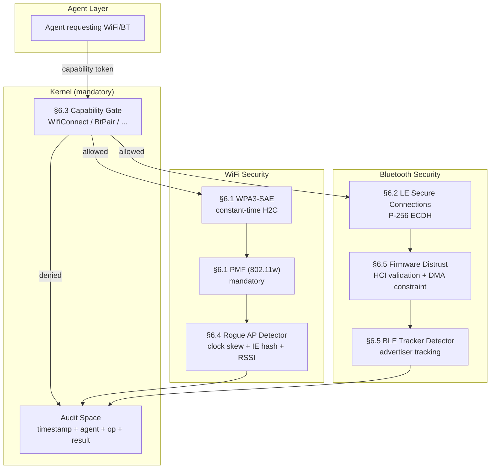
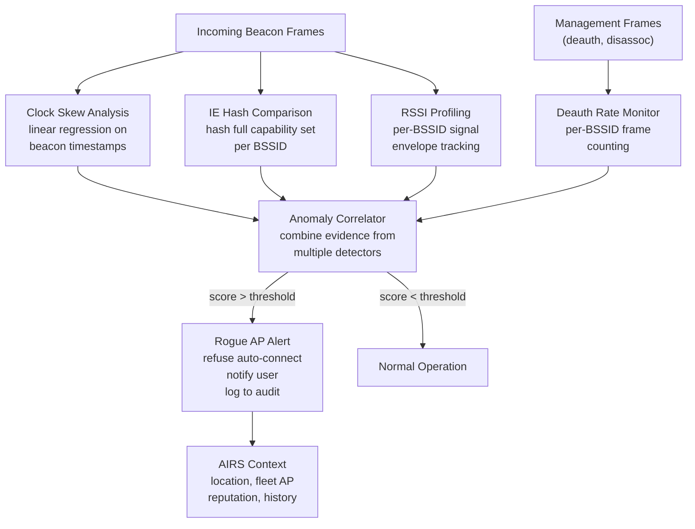

# AIOS Wireless Security

Part of: [wireless.md](../wireless.md) — WiFi & Bluetooth
**Related:** [wifi.md](./wifi.md) — WPA3-SAE implementation, [bluetooth.md](./bluetooth.md) — Pairing protocols, [firmware.md](./firmware.md) — Firmware trust, [ai-native.md](./ai-native.md) — Anomaly detection, [model.md](../../security/model.md) — AIOS capability system

-----

## 6. Wireless Security

Wireless interfaces are uniquely dangerous attack surfaces. Unlike wired connections, every WiFi frame and Bluetooth advertisement is broadcast to anyone within radio range. An attacker does not need physical access to the device, USB port, or network cable — they need only proximity. AIOS addresses this by treating wireless security as a first-class architectural concern, not a configuration checkbox. Every wireless operation — scanning, connecting, pairing, transferring data — passes through the capability system, uses mandatory strong cryptography, and generates audit records.

The wireless security architecture has five pillars:

1. **WiFi security** (§6.1) — WPA3-SAE mandatory, PMF mandatory, constant-time cryptography
2. **Bluetooth security** (§6.2) — LE Secure Connections mandatory, firmware distrust
3. **Capability-gated access** (§6.3) — fine-grained wireless capabilities with attenuation
4. **Rogue AP detection** (§6.4) — continuous background monitoring with ML-assisted anomaly detection
5. **Bluetooth attack surface** (§6.5) — known vulnerability mitigations, BLE tracker detection



-----

### 6.1 WiFi Security

AIOS takes an opinionated stance on WiFi security: the strongest available protections are mandatory, not optional. Users should not need to understand WPA versions, PMF settings, or SAE variants to be safe. The wireless subsystem enforces secure defaults and warns when connecting to networks that cannot meet AIOS security standards.

#### WPA3-SAE Mandatory

AIOS requires WPA3-SAE (Simultaneous Authentication of Equals) for all WiFi connections. WPA3-SAE replaces the PSK 4-way handshake with a Dragonfly key exchange that provides:

- **Forward secrecy.** Compromising the network password does not reveal past session keys. Each session derives a unique PMK through the SAE exchange.
- **Offline dictionary resistance.** An attacker capturing the SAE exchange cannot perform offline brute-force attacks against the password. Each guess requires an online interaction with the AP.
- **Equal-party authentication.** Both station and AP prove knowledge of the password simultaneously, preventing asymmetric authentication attacks.

If an AP offers only WPA2 (PSK or Enterprise without WPA3 transition), AIOS refuses auto-connection and displays a security warning requiring explicit user acknowledgment. The warning explains the specific risk: "This network uses WPA2, which is vulnerable to offline dictionary attacks. Your password could be recovered by an attacker who captures the handshake."

**WPA2+WPA3 transition mode.** When an AP advertises both WPA2 and WPA3, AIOS connects using WPA3-SAE exclusively. However, the UI displays a "Reduced Security" badge because other devices on the same network may be connected via WPA2, and a downgrade attack is theoretically possible (an attacker could forge deauthentication frames to force WPA2 reconnection on non-PMF clients).

#### Protected Management Frames (802.11w)

PMF is mandatory for all AIOS WiFi connections. PMF encrypts management frames (deauthentication, disassociation, action frames) that are sent in cleartext in legacy 802.11. Without PMF, an attacker can trivially disconnect any client by spoofing deauthentication frames — a prerequisite for evil twin and WPA2 handshake capture attacks.

AIOS rejects association with any AP that does not support PMF when connecting via WPA3. For WPA2 transition mode connections (where the user has explicitly acknowledged the security warning), PMF is required if the AP advertises PMF capability and strongly recommended otherwise.

#### SAE-PK (SAE with Public Key)

For enterprise and managed networks, AIOS supports SAE-PK, which embeds a public key fingerprint in the network password. This provides:

- **Evil twin immunity.** Even if an attacker knows the network password, they cannot create a convincing evil twin without the corresponding private key. The station verifies the AP's public key during the SAE exchange.
- **Infrastructure verification.** Managed deployments can distribute passwords freely (e.g., printed on a coffee shop receipt) while preventing unauthorized APs from impersonating the network.

SAE-PK uses a modified SAE exchange where the AP proves possession of a private key corresponding to a fingerprint encoded in the password. AIOS validates this proof and displays a "Verified Network" indicator when SAE-PK authentication succeeds.

#### Constant-Time Cryptographic Operations

All SAE computations use constant-time implementations to prevent timing side-channel attacks:

- **Password element derivation.** AIOS uses the Hash-to-Curve (H2C) method exclusively, not the deprecated hunt-and-peck method. H2C maps the password directly to an elliptic curve point in constant time, eliminating the variable-iteration timing leak present in hunt-and-peck.
- **Scalar multiplication.** The `p256` crate provides constant-time P-256 ECDH operations. All point multiplications execute in the same number of CPU cycles regardless of the scalar value.
- **Comparison.** The `subtle` crate provides constant-time byte comparison via `ct_eq()`. Password-derived values are never compared using `==`, which short-circuits on the first differing byte.

```rust
use p256::ecdh::EphemeralSecret;
use subtle::ConstantTimeEq;

/// Derive the SAE password element using Hash-to-Curve (RFC 9380).
/// This function executes in constant time regardless of password content.
fn derive_password_element(
    password: &[u8],
    ssid: &[u8],
    sta_mac: &[u8; 6],
    ap_mac: &[u8; 6],
) -> Result<p256::AffinePoint, SaeError> {
    // H2C method: single-pass, constant-time mapping
    // No branching on intermediate values, no early exits
    let seed = sae_hash_to_curve(password, ssid, sta_mac, ap_mac)?;
    Ok(seed)
}

/// Verify SAE commit exchange. All comparisons are constant-time.
fn verify_commit(
    local_commit: &SaeCommit,
    peer_commit: &SaeCommit,
) -> Result<SaeConfirm, SaeError> {
    // Constant-time comparison prevents timing oracle
    let scalar_valid = peer_commit.scalar.ct_eq(&p256::Scalar::ZERO);
    let element_valid = peer_commit.element.ct_eq(&p256::AffinePoint::IDENTITY);

    // Reject invalid commits without revealing which check failed
    if bool::from(scalar_valid | element_valid) {
        return Err(SaeError::InvalidCommit);
    }

    compute_confirm(local_commit, peer_commit)
}
```

#### Key Storage and Lifecycle

Wireless session keys receive the following protections:

- **PMK, PTK, and GTK** are stored in kernel memory only, never in agent-accessible address spaces. The wireless driver agent communicates key material to the kernel via a capability-gated IPC channel.
- **At-rest encryption.** When keys must persist across suspend/resume cycles, they are encrypted using the device key (AES-256-GCM, same key management as the [crypto subsystem](../../storage/spaces/encryption.md) §6.1).
- **Zeroing on disconnect.** All key material is zeroed (using `zeroize` crate semantics, not optimizer-removable memset) when the WiFi session ends, the network is forgotten, or the system suspends without key persistence enabled.
- **Key rotation.** GTK rekeying follows AP-initiated schedules. PTK rekeying occurs on every reassociation. AIOS logs key rotation events to the audit Space.

#### OWE (Opportunistic Wireless Encryption)

For open networks (captive portals, guest networks), AIOS supports OWE (RFC 8110), which provides unauthenticated Diffie-Hellman key exchange. OWE provides encryption without authentication — a passive eavesdropper cannot read traffic, but an active attacker can perform a man-in-the-middle attack.

AIOS marks OWE connections as "Encrypted but Unverified" in the UI, with a distinct icon from authenticated WPA3 connections. Agents querying network security status via the wireless API receive a `SecurityLevel::EncryptedUnauthenticated` value, allowing them to adjust behavior (e.g., a banking agent might refuse to transmit credentials over OWE).

#### 802.1X/EAP-TLS

For enterprise WiFi deployments, AIOS supports EAP-TLS with the following security requirements:

- **Server certificate validation mandatory.** AIOS does not support TOFU (Trust On First Use) for enterprise WiFi. The server certificate must chain to a trusted root CA configured in the network profile.
- **Certificate pinning.** Network profiles can pin the expected server certificate or CA, preventing attacks where a compromised CA issues a rogue certificate for the RADIUS server.
- **Client certificate storage.** Client certificates and private keys are stored in an encrypted Space, accessible only via the `WifiManage` capability. Private keys are never exported.
- **Inner identity protection.** EAP-TLS with TLS 1.3 encrypts the client certificate exchange, preventing passive observation of user identity.

-----

### 6.2 Bluetooth Security

Bluetooth's security model has a troubled history. Legacy Pairing (BLE 4.0) uses a fixed-key exchange vulnerable to passive eavesdropping. SSP (Secure Simple Pairing) for Classic BT improved this but left room for downgrade attacks. AIOS enforces the strongest available pairing mechanisms and rejects devices that cannot meet minimum security requirements.

#### LE Secure Connections Mandatory

AIOS requires LE Secure Connections (introduced in BLE 4.2) for all BLE pairing. Legacy Pairing is rejected unconditionally. LE Secure Connections uses P-256 ECDH key exchange, providing:

- **Passive eavesdropping resistance.** The Diffie-Hellman exchange ensures that an attacker who captures the entire pairing exchange cannot derive the shared secret.
- **MITM protection** (with Numeric Comparison, Passkey Entry, or OOB methods). The authentication stage confirms that both parties derived the same key.
- **Key derivation.** LTK (Long Term Key) is derived from the ECDH shared secret, not from a short PIN.

#### Pairing Methods

AIOS supports four SMP (Security Manager Protocol) pairing methods, with different MITM protection levels:

- **Numeric Comparison.** Both devices display a 6-digit confirmation code. The user verifies the codes match and confirms on both devices. MITM-protected: an attacker cannot predict or influence the confirmation value without being detected.

- **Passkey Entry.** The user enters a 6-digit passkey displayed on one device into the other device. MITM-protected: the passkey is used as input to the key exchange, and an attacker who doesn't know it cannot complete the exchange.

- **Out-of-Band (OOB).** Key exchange data is transmitted via a secondary channel — NFC tap, QR code scan, or similar. MITM-protected if the OOB channel itself is secure (NFC requires physical proximity; QR codes require line-of-sight).

- **Just Works.** No user interaction. Uses the same ECDH exchange as other methods but without authentication — an active MITM can substitute their own public key undetected. AIOS treats Just Works as a security risk:
  - Requires explicit user consent with a warning: "This device does not support secure pairing. A nearby attacker could intercept the connection."
  - Capability-gated: only agents with trust level Standard or above can initiate Just Works pairing.
  - The resulting bond is marked as `SecurityLevel::UnauthenticatedEncrypted` in the device database.
  - Agents querying the pairing security level can refuse to transmit sensitive data over unauthenticated bonds.

#### CTKD (Cross-Transport Key Derivation)

CTKD allows deriving Classic BT (BR/EDR) link keys from BLE keys, or vice versa, enabling a single pairing to secure both transports. However, the BLURtooth vulnerability (CVE-2020-15802) demonstrated that CTKD can be exploited to overwrite stronger keys with weaker ones.

AIOS disables CTKD by default. When a user requests CTKD for a specific device (e.g., a headset that uses both A2DP over Classic BT and battery status over BLE), the following safeguards apply:

- Re-authentication required before key derivation.
- The derived key's security level is capped at the minimum of the two transports' security levels.
- The original key is preserved; if the derived key would represent a security downgrade, the derivation is blocked and the user is informed.
- CTKD events are logged to the audit Space with both transport security levels.

#### Minimum Key Entropy

AIOS enforces a 128-bit (16-byte) minimum encryption key length for all Bluetooth connections. This mitigates the KNOB attack (Key Negotiation of Bluetooth), where an attacker forces both devices to negotiate a 1-byte encryption key that can be brute-forced in real time.

During key length negotiation, the Bluetooth stack rejects any proposed key length below 16 bytes. If the remote device insists on a shorter key, the connection is terminated with an audit log entry recording the attempted negotiation.

```rust
/// Minimum acceptable Bluetooth encryption key length (bytes).
/// Rejects KNOB attack attempts to negotiate shorter keys.
const BT_MIN_KEY_LENGTH: u8 = 16;

/// Validate negotiated encryption key length.
fn validate_key_length(proposed: u8) -> Result<(), BtSecurityError> {
    if proposed < BT_MIN_KEY_LENGTH {
        audit_log(BtAuditEntry {
            event: BtSecurityEvent::KeyLengthRejected,
            proposed_length: proposed,
            minimum_length: BT_MIN_KEY_LENGTH,
        });
        Err(BtSecurityError::InsufficientKeyLength {
            proposed,
            minimum: BT_MIN_KEY_LENGTH,
        })
    } else {
        Ok(())
    }
}
```

#### Key Storage

Bluetooth bonding keys (LTK, IRK, CSRK) are stored in an encrypted Space, one entry per bonded device. Access is capability-gated:

- `BtKeyStore` capability required to read or modify bonding keys.
- The Bluetooth Manager agent holds `BtKeyStore`; individual profile agents (A2DP, HID) do not.
- Keys are identified by device identity (IRK-resolved address or static address), not by connection handle.
- Key deletion (un-bonding) requires the `BtPair` capability and generates an audit entry.

#### Secure Connections Only Mode

AIOS operates its Bluetooth stack in Secure Connections Only mode for both Classic BT and BLE:

- **Classic BT:** SSP (Secure Simple Pairing) is mandatory. Legacy PIN-based pairing is rejected. Encryption Mode 3 (encrypt before link setup is complete) is enforced.
- **BLE:** LE Secure Connections mandatory as described above.
- **User override:** For devices that do not support Secure Connections (typically older peripherals), the user can grant a per-device exception. The exception is logged, the device is marked as "Legacy Security" in the device list, and agents are informed of the reduced security level.

-----

### 6.3 Capability-Gated Wireless Access

Every wireless operation is mediated by the AIOS capability system. No agent can scan for networks, connect to an AP, pair with a Bluetooth device, or stream audio without presenting a valid capability token. Wireless capabilities follow the same lifecycle as all AIOS capabilities: create, grant, use, attenuate, delegate, revoke (see [capabilities.md](../../security/model/capabilities.md) §3.1).

#### Wireless Capability Table

| Capability | Description | Trust Level | Attenuation |
|---|---|---|---|
| `WifiScan` | Passive and active scanning for nearby APs | Standard | Band, channel range |
| `WifiConnect` | Connect to WiFi networks | Standard | SSID pattern, security type minimum |
| `WifiManage` | Manage saved network profiles, certificates | Elevated | — |
| `WifiMonitor` | Monitor mode (promiscuous frame capture) | System | Channel, duration limit |
| `WifiP2p` | WiFi Direct peer-to-peer connections | Standard | — |
| `WifiAp` | Create a software access point | Elevated | — |
| `BtDiscovery` | Bluetooth device discovery (inquiry/LE scan) | Standard | Device class filter |
| `BtPair` | Initiate pairing with a Bluetooth device | Standard | Pairing method, device class |
| `BtAudio` | A2DP/HFP/LE Audio streaming | Standard | Codec restriction, max concurrent streams |
| `BtHid` | HID device connection (keyboard, mouse, gamepad) | Standard | Device type filter |
| `BtFile` | OBEX file transfer | Standard | Size limit, file type filter |
| `BtGattClient` | GATT client operations (read/write characteristics) | Standard | Service UUID filter |
| `BtGattServer` | Expose GATT services to remote devices | Elevated | Service UUID restriction |
| `BtMesh` | Bluetooth Mesh networking | Elevated | Network key restriction |
| `BtRawHci` | Raw HCI command/event access | System | — |

Trust level meanings:

- **Standard:** Third-party agents can request this capability at install time.
- **Elevated:** Requires explicit user approval with a security explanation. Native agents hold these by default.
- **System:** Reserved for system services. Third-party agents cannot obtain these capabilities.

#### Attenuation Examples

Capabilities can be attenuated to restrict their scope. Attenuated capabilities follow the monotonic restriction principle: a child capability can never exceed the permissions of its parent.

```rust
// Agent can only connect to home network
cap!(WifiConnect { ssid_filter: "MyHome-*" })

// Agent can only pair with audio devices via Numeric Comparison
cap!(BtPair { device_class: Audio, method: NumericComparison })

// Agent can only access heart rate GATT service
cap!(BtGattClient { service_filter: uuid!("0x180D") })

// Agent can scan only 5 GHz channels
cap!(WifiScan { band: Band5GHz, channels: 36..=165 })

// Agent can transfer files up to 10 MiB, images only
cap!(BtFile { max_size: 10 * 1024 * 1024, file_types: ["image/png", "image/jpeg"] })
```

#### Audit Logging

All wireless capability exercises are logged to the audit Space. Each entry records:

- **Timestamp.** Monotonic kernel time (CNTPCT_EL0-derived).
- **Agent ID.** The agent that presented the capability.
- **Operation.** The specific wireless operation attempted (scan, connect, pair, transfer, etc.).
- **Capability ID.** The token used to authorize the operation.
- **Result.** Success, denied (no matching capability), or failed (capability valid but operation failed).
- **Details.** Operation-specific metadata: SSID for WiFi connect, device address for BT pair, service UUID for GATT access.

The audit log enables post-incident forensics ("which agent connected to this rogue AP?"), compliance reporting, and AIRS behavioral analysis. Audit entries are immutable once written — agents cannot delete their own audit trail.

-----

### 6.4 Rogue AP Detection

AIOS performs continuous background monitoring for rogue access points whenever WiFi is active. This monitoring is transparent to agents — it uses the kernel's internal `WifiScan` capability and does not require agent involvement. The goal is to detect evil twin attacks, unauthorized APs on managed networks, and deauthentication floods that precede more sophisticated attacks.

#### Detection Techniques

**Clock skew fingerprinting.** Every physical AP has a unique oscillator with a characteristic frequency drift, typically 1-50 ppm (parts per million). AIOS measures the timestamp field in successive beacon frames from each BSSID and computes the clock skew via linear regression. Two BSSIDs advertising the same SSID but exhibiting different clock skew values are distinct physical radios — one of them is a rogue.

Implementation details:

- State per AP: ~100 bytes (BSSID, running regression coefficients, beacon count, last timestamp).
- Accuracy: >97% detection rate after ~100 beacons (~10 seconds at 100ms beacon interval).
- False positive mitigation: legitimate AP replacements (hardware swap) trigger a clock skew change. AIOS waits for stable skew before alerting, and distinguishes sudden skew changes (rogue) from gradual drift (legitimate oscillator aging).

**Beacon IE hashing.** Each AP broadcasts a set of Information Elements (IEs) in its beacons: supported rates, HT/VHT/HE capabilities, vendor-specific IEs, country codes, and more. AIOS hashes the full IE set for each BSSID. A rogue AP replicating an SSID rarely replicates every IE exactly — subtle differences in supported rates, vendor IEs, or capability fields reveal the impersonation.

**RSSI consistency.** A legitimate AP has a consistent RSSI envelope at a given location, varying smoothly with user movement. The sudden appearance of a second BSSID with the same SSID but a markedly different RSSI profile (e.g., much stronger signal from a direction where no AP existed moments ago) triggers a proximity anomaly alert.

**Deauthentication flood detection.** An abnormal rate of deauthentication or disassociation frames is a strong indicator that an attacker is attempting to disconnect clients from a legitimate AP to force reconnection through a rogue AP. AIOS counts management frames per BSSID per time window. Exceeding a threshold (configurable, default: 10 deauth frames in 5 seconds from a single BSSID) triggers a deauth flood alert.

#### Detection Flow



#### Response to Detected Rogue AP

When the anomaly correlator's combined score exceeds the alert threshold, AIOS takes the following actions:

1. **Refuse auto-connect.** The suspected rogue BSSID is blacklisted for automatic connection. Manual connection requires explicit user confirmation with a security warning.

2. **Alert the user.** A notification explains the threat in plain language: "A suspicious access point impersonating YourNetwork has been detected nearby. AIOS has blocked automatic connection to protect your data."

3. **Log to audit Space.** The alert record includes:
   - Clock skew measurements (legitimate AP skew vs. suspect AP skew)
   - IE hash differences (which IEs differ between legitimate and suspect)
   - RSSI anomaly data (signal strength history)
   - Deauthentication frame counts (if a deauth flood preceded the detection)
   - Confidence score from the anomaly correlator

4. **AIRS correlation** (when available). If AIRS is active, the rogue AP detection feeds into broader context analysis:
   - Location correlation: is the user at a location where rogue APs have been detected before?
   - Fleet AP reputation: have other AIOS devices reported this BSSID as suspicious?
   - Temporal patterns: does the rogue AP appear at the same time every day (suggesting a persistent attacker)?

The kernel-internal AP Profile Anomaly Detector model (~200 bytes per AP, ~100ns inference time) provides real-time scoring without AIRS dependency. See [ai-native.md](./ai-native.md) §9.7 for model architecture details.

-----

### 6.5 Bluetooth Attack Surface

Bluetooth has a large and historically vulnerable attack surface. The protocol stack spans multiple layers (baseband, LMP, L2CAP, SDP, RFCOMM, profiles), each with distinct parsing logic and state machines. AIOS mitigates known vulnerability classes through input validation, firmware distrust, and behavioral monitoring.

#### Known Vulnerability Classes

**BrakTooth.** A family of vulnerabilities in Bluetooth baseband and LMP implementations. Malformed LMP packets crash or hang the Bluetooth controller firmware. Since the controller runs on a separate processor with its own firmware, these attacks bypass host-side input validation entirely.

Mitigation: the firmware distrust model (below) validates all HCI events received from the controller. Unexpected event types, malformed event parameters, and out-of-sequence events are dropped. Controller hangs are detected via HCI command timeout and trigger a controller reset.

**SweynTooth.** BLE link layer vulnerabilities including truncated PDUs, L2CAP length overflows, and sequence number deadlocks. These exploit parsing bugs in the BLE controller's link layer implementation.

Mitigation: AIOS validates all BLE PDUs received via HCI. Length fields are bounds-checked against the actual data received. Sequence numbers are tracked and validated. Malformed PDUs are dropped with an audit log entry.

**BlueBorne.** Remote code execution via crafted L2CAP packets. The attack exploits buffer overflow vulnerabilities in the host-side L2CAP implementation, particularly in handling configuration requests and information responses.

Mitigation: the AIOS L2CAP implementation is written in safe Rust with strict bounds checking on all incoming PDUs. L2CAP channel allocation is bounded (maximum channels per device, maximum total channels). The Bluetooth driver agent runs in its own address space — even if an L2CAP vulnerability were exploited, the attacker gains control of the driver agent, not the kernel.

**BLUFFS.** Forces weak session key derivation by manipulating the key derivation process during session establishment. The attacker causes both devices to derive a session key with insufficient entropy.

Mitigation: AIOS enforces minimum 128-bit session key length (see §6.2). The key derivation process validates entropy at each stage. If the derived key does not meet the entropy requirement, the session is terminated.

**KNOB.** Key Negotiation of Bluetooth — forces encryption key length to 1 byte. The attacker intercepts the key length negotiation and reduces it to the minimum the protocol allows.

Mitigation: AIOS enforces 16-byte minimum key length as described in §6.2. The negotiation is rejected if the remote device proposes less than 16 bytes.

**BIAS.** Bluetooth Impersonation AttackS — exploits role switching during authentication to impersonate a previously paired device. The attacker initiates authentication as the central role but switches to peripheral during the process, bypassing mutual authentication.

Mitigation: AIOS enforces mutual authentication in all connection states. Role changes during active authentication are rejected. The Bluetooth stack validates the remote device's role at every authentication stage transition.

#### Firmware Distrust Model

WiFi and Bluetooth controllers run their own firmware on embedded processors. This firmware has direct access to radio hardware, DMA engines, and sometimes shared memory with the host. AIOS treats controller firmware as an untrusted component — a compromised controller should not be able to compromise the host OS.

**HCI event validation.** All HCI events received from the Bluetooth controller are validated before processing:

```rust
/// Validate an HCI event received from the controller.
/// Rejects malformed, unexpected, or out-of-sequence events.
fn validate_hci_event(event: &[u8], state: &HciState) -> Result<HciEvent, HciError> {
    // 1. Minimum length check
    if event.len() < 2 {
        audit_log_bt(BtSecurityEvent::MalformedHciEvent { len: event.len() });
        return Err(HciError::TooShort);
    }

    let event_code = event[0];
    let param_len = event[1] as usize;

    // 2. Length consistency: declared parameter length must match actual data
    if event.len() != 2 + param_len {
        audit_log_bt(BtSecurityEvent::HciLengthMismatch {
            declared: param_len,
            actual: event.len() - 2,
        });
        return Err(HciError::LengthMismatch);
    }

    // 3. Known event code: reject unrecognized event types
    let parsed = HciEvent::parse(event_code, &event[2..])?;

    // 4. State consistency: event must be valid for current HCI state
    if !state.expects_event(&parsed) {
        audit_log_bt(BtSecurityEvent::UnexpectedHciEvent {
            event: event_code,
            state: state.current(),
        });
        return Err(HciError::UnexpectedEvent);
    }

    Ok(parsed)
}
```

**HCI response timeout.** If the controller does not respond to an HCI command within 5 seconds, AIOS assumes the controller is hung or compromised:

- The pending command is cancelled.
- A controller reset (HCI_Reset) is attempted.
- If the reset fails, the controller is power-cycled via the platform's power management interface.
- The reset event is logged to the audit Space.
- Active Bluetooth connections are gracefully terminated (agents receive disconnect notifications).

**DMA constraint.** The Bluetooth controller's DMA access is restricted via IOMMU/SMMU to only its allocated DMA buffers from the DMA pool. The controller cannot read kernel memory, agent address spaces, or other devices' DMA buffers. On platforms without IOMMU (Pi 4 with DWC2), the Bluetooth transport uses PIO (Programmed I/O) via HCI UART, which does not involve DMA.

**Crash recovery.** If the Bluetooth controller becomes unresponsive or crashes:

- The Bluetooth driver agent is restarted, not the kernel. The crash is isolated to the driver agent's address space.
- Bonded device keys are preserved (stored in encrypted Space, not in the driver agent's memory).
- Active connections are lost but can be re-established automatically after the driver agent restarts.
- The crash is logged with a stack trace and HCI command history for post-incident analysis.

#### BLE Tracker Detection

AIOS includes a universal BLE tracker detection system that identifies any persistent BLE advertiser following the user, not just specific products (AirTags, Tile, SmartTags). The detector operates on the principle that a BLE device consistently in proximity across multiple location changes is likely tracking the user.

**Detection technique.** The BLE tracker detector maintains a table of recently seen BLE advertising addresses. When the user changes location (detected via WiFi BSSID changes, not GPS — preserving privacy), the detector checks which advertising addresses persist:

- BLE devices use randomized addresses that rotate periodically (typically every 15 minutes for privacy-compliant devices).
- A tracker's randomized address rotates, but the tracker remains physically present. The detector correlates advertising data patterns (manufacturer-specific data, service UUIDs, TX power) across address rotations to identify persistent physical devices.
- If a physical device is consistently present across 3 or more location changes over a period exceeding 30 minutes, it is flagged as a potential tracker.

**Privacy.** All detection runs locally on the device. No BLE advertising data, location information, or detection results leave the device. The detector does not phone home, does not participate in a crowd-sourced tracker network, and does not share data with any external service.

**Kernel-internal model.** The BLE Tracker Detector model requires ~2 KiB per tracked device and ~200ns per inference cycle. See [ai-native.md](./ai-native.md) §9.8 for the model architecture.

**User alert.** When a potential tracker is detected, AIOS notifies the user: "An unknown Bluetooth device has been following you for [duration]. It was first detected at [time] and has been consistently nearby through [N] location changes."

**Response options.** The user can:

- **Play sound on tracker** (if the tracker supports the Find My or similar protocol).
- **View device details** — advertising address, manufacturer data, signal strength history, first/last seen times.
- **Block advertising address** — the Bluetooth stack filters out the device's advertisements, removing it from the detection table. Note: this does not stop the tracker from tracking; it only stops AIOS from seeing it.
- **Report to authorities** — generates a summary report with timestamps and detection evidence, suitable for filing a police report about stalking.
