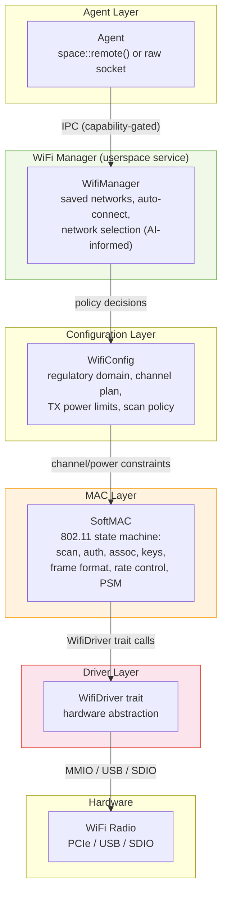
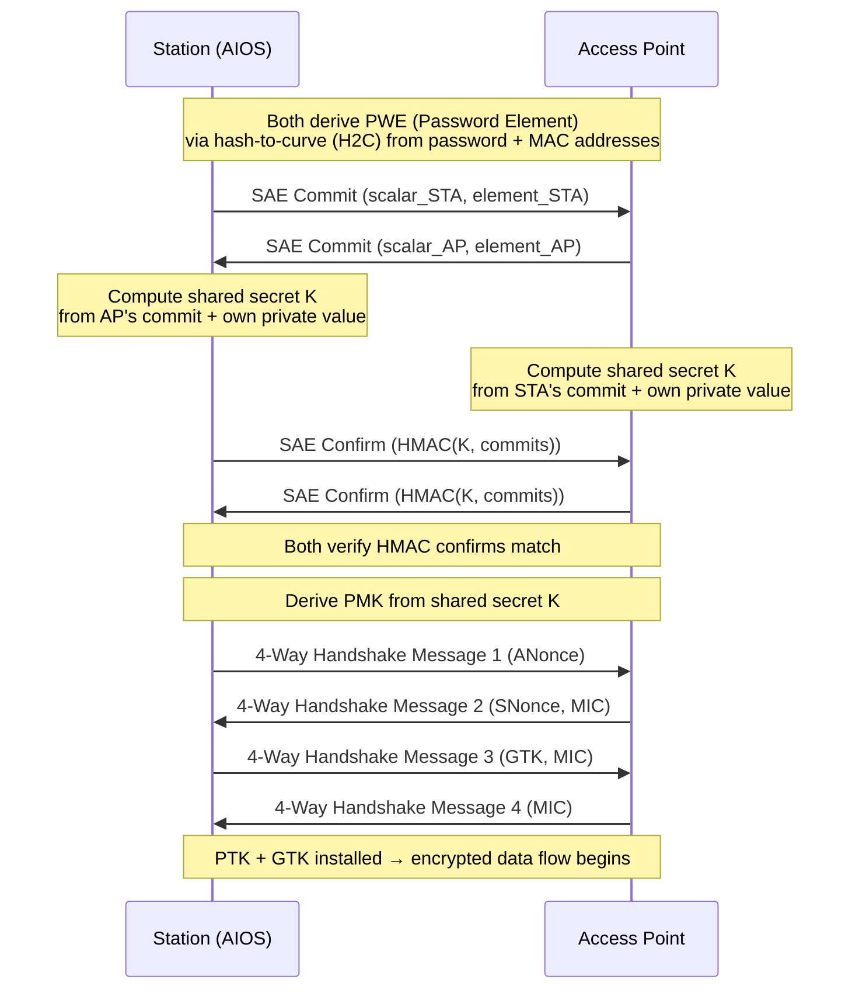
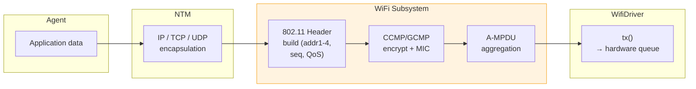
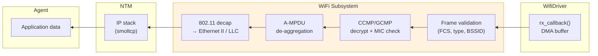

# AIOS WiFi Stack Architecture

Part of: [wireless.md](../wireless.md) — WiFi & Bluetooth
**Related:** [security.md](./security.md) — WPA3-SAE details, [firmware.md](./firmware.md) — Firmware loading, [integration.md](./integration.md) — NTM transport, [ai-native.md](./ai-native.md) — ML-driven roaming

-----

## 3. WiFi Stack Architecture

The WiFi stack translates agent network requests into 802.11 frames on the air. It is structured as five layers with clean Rust trait boundaries at each transition, enabling independent testing, SoftMAC/FullMAC driver flexibility, and crash-isolated operation as a userspace agent.

-----

### 3.1 Stack Layers

The WiFi stack uses a five-layer architecture. Each layer has a single responsibility and communicates with adjacent layers through well-defined Rust traits or IPC channels.



**Layer responsibilities:**

- **WifiManager** — Userspace service that owns saved network profiles, implements auto-connect logic, and makes network selection decisions. Receives ML-scored AP rankings from the kernel-internal roaming model (see [ai-native.md](./ai-native.md) §9.1) and translates them into connect/roam commands.

- **WifiConfig** — Enforces regulatory domain constraints. Maintains the channel plan (allowed channels, maximum TX power per channel, DFS requirements) derived from the embedded `wireless-regdb` database. Kernel-resident because regulatory enforcement must not be bypassable by agents.

- **SoftMAC** — The 802.11 state machine. Handles scanning (passive and active), authentication (open, SAE), association, key installation, frame formatting (adding 802.11 headers, sequence numbers), rate control, A-MPDU aggregation, and power save mode management. This is the largest layer and contains all 802.11 protocol logic.

- **WifiDriver** — A Rust trait that abstracts hardware differences. Each WiFi chipset implements this trait. SoftMAC drivers expose raw frame TX/RX and channel control. FullMAC drivers wrap firmware commands behind the same trait, with the SoftMAC layer bypassed.

- **Hardware** — The physical radio, accessed through PCIe MMIO, USB bulk transfers, or SDIO. DMA buffers are allocated from the kernel DMA pool with IOMMU protection.

**SoftMAC vs. FullMAC paths:**

For SoftMAC chipsets (e.g., Atheros, Mediatek, Intel), the driver provides raw frame TX/RX and the SoftMAC layer handles all 802.11 logic:

```text
SoftMAC path:
  Agent → WifiManager → WifiConfig → SoftMAC → WifiDriver::tx(raw_frame) → Hardware
  Hardware → WifiDriver::rx_callback(raw_frame) → SoftMAC → WifiManager → Agent
```

For FullMAC chipsets (e.g., Broadcom), the firmware handles 802.11 internally. The driver wraps firmware commands (scan, connect, disconnect) behind the `WifiDriver` trait, and the SoftMAC layer is bypassed:

```text
FullMAC path:
  Agent → WifiManager → WifiConfig → WifiDriver::connect(ssid, key) → Firmware → Hardware
  Hardware → Firmware → WifiDriver::rx_callback(data_frame) → WifiManager → Agent
```

**WifiDriver trait definition:**

```rust
/// Hardware abstraction for WiFi chipsets.
///
/// SoftMAC drivers implement all methods; FullMAC drivers may return
/// `Err(WifiError::FirmwareHandled)` for operations the firmware owns.
pub trait WifiDriver: Send {
    /// Initialize the hardware and load firmware if required.
    /// Returns the device capabilities (supported bands, HT/VHT/HE/EHT).
    fn start(&mut self) -> Result<WifiCapabilities, WifiError>;

    /// Shut down the hardware and release DMA resources.
    fn stop(&mut self) -> Result<(), WifiError>;

    /// Transmit a frame. Ownership of the DMA buffer transfers to the driver.
    /// The driver calls `tx_complete_callback` when the hardware is done.
    fn tx(&mut self, frame: DmaBuffer, rate_hint: RateInfo) -> Result<(), WifiError>;

    /// Register the callback invoked when the hardware delivers a received frame.
    fn set_rx_callback(&mut self, cb: fn(DmaBuffer, RxStatus));

    /// Initiate a scan on the specified channels. Results arrive via rx_callback
    /// as beacon/probe-response frames (SoftMAC) or via scan_results() (FullMAC).
    fn scan(&mut self, channels: &[Channel], scan_type: ScanType) -> Result<(), WifiError>;

    /// Switch the radio to the specified channel and bandwidth.
    fn set_channel(&mut self, channel: Channel, bandwidth: Bandwidth) -> Result<(), WifiError>;

    /// Install a pairwise or group key into the hardware key cache.
    fn set_key(&mut self, key: &CryptoKey, key_type: KeyType) -> Result<(), WifiError>;

    /// Query hardware capabilities (bands, MCS rates, HE/EHT support, antenna config).
    fn get_capabilities(&self) -> &WifiCapabilities;

    /// Configure hardware power save mode (PSM, U-APSD, TWT).
    fn set_power_save(&mut self, mode: PowerSaveMode) -> Result<(), WifiError>;

    /// Configure hardware filters (multicast, broadcast, promiscuous for monitor mode).
    fn set_rx_filter(&mut self, filter: RxFilter) -> Result<(), WifiError>;
}
```

**WifiManager as userspace service:**

WifiManager runs as a privileged agent with `WifiConnect` and `WifiScan` capabilities. It maintains a persistent store of saved networks in the user's personal space (`user/home/settings/wifi/networks`), ordered by priority. Auto-connect logic evaluates visible APs against saved profiles, using ML-scored signal quality predictions when available (see [ai-native.md](./ai-native.md) §8.1). Network selection considers:

- Saved network priority and last-successful-connection timestamp
- Signal strength (RSSI) and signal-to-noise ratio (SNR)
- AP load (from BSS Load Element, 802.11k)
- Security level (WPA3-only preferred over transition mode)
- Band preference (5 GHz/6 GHz preferred over 2.4 GHz for throughput)
- AIRS-provided context hints (e.g., "user is about to start a video call" raises throughput priority)

-----

### 3.2 Station Management

Station management covers the lifecycle of a WiFi connection: discovering available networks, selecting one, authenticating, associating, maintaining the connection, roaming between APs, and disconnecting.

**Scanning:**

Three scan modes are supported:

- **Passive scan** — Listen on each channel for beacon frames. Required on DFS channels where active probing is prohibited. Dwell time: 100-150 ms per channel.
- **Active scan** — Send probe request frames and listen for probe responses. Faster discovery (20-40 ms per channel) but not permitted on all channels.
- **PSC scan** (Preferred Scanning Channels) — For WiFi 6E (6 GHz band), scan only the 15 PSC channels (every 4th 20 MHz channel) instead of all 59 channels. Reduces 6 GHz scan time from ~6 seconds to ~1.5 seconds.

**Scan scheduling:**

- **Background scans** — Periodic scans while connected, to maintain an up-to-date neighbor AP list for roaming decisions. Interval adapts based on mobility: stationary (60s), walking (15s), driving (5s). Mobility detection uses RSSI variance from the kernel-internal ML model.
- **Triggered scans** — Initiated when RSSI drops below the roaming threshold (-70 dBm default) or when an agent requests a network list.
- **ML-informed intervals** — The kernel-internal scan scheduler adjusts dwell times and channel order based on historical AP visibility patterns. Channels where APs were previously found are scanned first (see [ai-native.md](./ai-native.md) §9.2).

**Association state machine:**

The station state machine uses a typestate pattern to enforce valid transitions at the type level:

```rust
/// Station association state machine.
///
/// Transitions are enforced by consuming `self` and returning the new state,
/// preventing invalid state combinations at compile time.
enum StationState {
    /// No association. Radio may be off or in scan-only mode.
    Idle,

    /// Actively scanning for networks.
    Scanning {
        channels: ChannelList,
        passive: bool,
        results: ScanResultSet,
    },

    /// SAE or Open authentication in progress with a specific AP.
    Authenticating {
        bssid: MacAddr,
        method: AuthMethod,
        attempt: u8,
    },

    /// Association request sent, waiting for association response.
    Associating {
        bssid: MacAddr,
        capabilities: ApCapabilities,
    },

    /// Fully connected. Data frames can flow.
    Connected {
        bssid: MacAddr,
        channel: Channel,
        security: SecurityInfo,
        rssi: i8,
        tx_rate: RateInfo,
    },

    /// Roaming from one AP to another (802.11r fast transition or reassociation).
    Roaming {
        from_bssid: MacAddr,
        to_bssid: MacAddr,
        method: RoamMethod,
    },

    /// Graceful disconnection in progress.
    Disconnecting {
        reason: DisconnectReason,
    },
}
```

**Valid state transitions:**

```text
Idle → Scanning → Authenticating → Associating → Connected
Connected → Roaming → Connected  (fast BSS transition)
Connected → Disconnecting → Idle
Connected → Scanning → Authenticating  (roam via full reassociation)
Any → Idle  (on hardware error, deauthentication, or timeout)
```

**Roaming:**

AIOS implements the 802.11 roaming amendment suite for seamless AP transitions:

- **802.11r (Fast BSS Transition / FT)** — Pre-derives the PMK-R1 key at target APs using the mobility domain hierarchy (PMK-R0 → PMK-R1 → PTK). Reduces roam handshake from 4 frames to 2 (reassociation request/response only). Over-the-air and over-the-DS variants supported.
- **802.11k (Radio Resource Measurement)** — Requests neighbor reports from the current AP, providing a ranked list of candidate APs with channel and PHY type information. Eliminates full scan before roaming.
- **802.11v (BSS Transition Management)** — Allows the AP to suggest or request that the station move to a different AP (e.g., for load balancing). The station evaluates the suggestion against its own signal quality measurements before complying.

**ML-triggered roaming:**

The kernel-internal roaming model makes the final roam/stay decision. It consumes:

- RSSI gradient (rate of signal change, not just instantaneous value)
- Current traffic flow type (video call requires higher roaming threshold than background sync)
- Candidate AP quality from neighbor reports or background scans
- Anti-ping-pong logic (minimum dwell time of 10 seconds at the new AP; exponential backoff if the station roams back within 30 seconds)

The model outputs a roam score per candidate AP. The SoftMAC layer initiates a roam when the best candidate score exceeds the current AP score by a configurable hysteresis margin. See [ai-native.md](./ai-native.md) §9.1 for model architecture details.

-----

### 3.3 WPA2/WPA3 Authentication

AIOS mandates WPA3-SAE for all new WiFi connections. WPA2-PSK is permitted only in transition mode (WPA2+WPA3) for backward compatibility with legacy APs, with a visible security warning surfaced to the user through the compositor's notification system.

**SAE (Simultaneous Authentication of Equals):**

WPA3-SAE uses the Dragonfly key exchange, a password-authenticated key exchange (PAKE) protocol that provides forward secrecy and resistance to offline dictionary attacks. AIOS implements the hash-to-curve (H2C) method exclusively — the older hunt-and-peck method is rejected due to side-channel vulnerabilities.



**Anti-clogging token mechanism:**

To prevent denial-of-service attacks where an adversary floods the AP with SAE commit messages (each requiring an expensive elliptic curve operation), the AP responds with an anti-clogging token before processing the commit. The station must echo this token in a retransmitted commit, proving it can receive responses at its claimed MAC address.

```text
Attacker floods SAE commits → AP detects high SAE rate →
AP sends anti-clogging token (HMAC of MAC + timestamp) →
Legitimate station echoes token → AP processes commit
Attacker cannot echo tokens (spoofed MAC) → rejected
```

**SAE-PK (SAE with Public Key):**

SAE-PK extends SAE to prevent evil twin attacks. The AP's public key fingerprint is encoded in the SSID or a separate out-of-band channel. During SAE, the AP signs its commit message with the corresponding private key. The station verifies the signature against the known fingerprint, confirming the AP is not an impersonator. This is the recommended configuration for enterprise and high-security deployments.

**WPA2-PSK transition mode:**

When connecting to an AP that advertises both WPA2-PSK and WPA3-SAE in its RSN Information Element, AIOS always selects WPA3-SAE. If the SAE handshake fails (indicating the AP's WPA3 implementation is broken), AIOS falls back to WPA2-PSK with a security notification:

```text
"Connected to [SSID] using WPA2 (less secure).
 This network supports WPA3 but the handshake failed.
 Contact the network administrator."
```

WPA2-only APs (no WPA3 advertised) are permitted in transition mode but displayed with a warning icon in the network list. A per-network `allow_wpa2` flag controls whether fallback is permitted.

**Protected Management Frames (802.11w / PMF):**

PMF is mandatory for all AIOS connections. It encrypts management frames (deauthentication, disassociation, action frames) using the Integrity Group Temporal Key (IGTK), preventing:

- **Deauthentication attacks** — An attacker cannot forge deauth frames to disconnect the station.
- **Disassociation attacks** — Same protection for disassociation frames.
- **Channel switch attacks** — Forged CSA (Channel Switch Announcement) frames are rejected.

If an AP does not support PMF (802.11w Capable=0 in RSN IE), the connection proceeds with a security warning. PMF-required APs are preferred in network selection scoring.

**Crypto implementation:**

All cryptographic operations use constant-time Rust implementations to prevent timing side-channel attacks:

- **ECDH (SAE)** — `p256` crate for NIST P-256 elliptic curve operations. Hash-to-curve via `p256::hash2curve`.
- **CCMP-256 / GCMP-256** — `aes-gcm` crate for frame encryption. CCMP-128 supported for WPA2 backward compatibility.
- **Key derivation** — `sha2` crate for HMAC-SHA-256 in the PRF+ key derivation function.
- **Constant-time comparison** — `subtle` crate for comparing MACs, confirms, and MICs without timing leaks.

**Key hierarchy:**

```text
Password + MAC addresses
    │
    ▼
  SAE → PMK (Pairwise Master Key, 256 bits)
    │
    ├──→ 4-Way Handshake → PTK (Pairwise Transient Key)
    │       ├── KCK (Key Confirmation Key, 128/256 bits) — MIC generation
    │       ├── KEK (Key Encryption Key, 128/256 bits) — key wrapping in msg 3
    │       └── TK  (Temporal Key, 128/256 bits)       — data frame encryption
    │
    └──→ Group Key Handshake → GTK (Group Temporal Key)
            └── broadcast/multicast frame encryption

  PMF: GMK → IGTK (Integrity Group Temporal Key) → management frame protection
```

-----

### 3.4 Frame Processing Pipeline

The frame processing pipeline handles the transformation between agent data and 802.11 frames on the wire. Both TX and RX paths are designed for zero-copy operation using DMA buffer ownership transfer.

**TX path:**



1. Agent writes data to a space or raw socket. The NTM encapsulates it in IP/TCP/UDP.
2. The SoftMAC layer builds the 802.11 header: destination MAC (addr1), source MAC (addr2), BSSID (addr3), sequence number, QoS field (TID mapping from DSCP).
3. The crypto engine encrypts the MSDU using the installed TK (CCMP-128, CCMP-256, or GCMP-256) and appends the MIC.
4. The aggregation engine groups multiple MPDUs destined for the same receiver into a single A-MPDU, respecting the maximum A-MPDU length negotiated during association.
5. `WifiDriver::tx()` receives the completed frame in a DMA buffer. Ownership transfers to the driver; the WiFi subsystem does not retain a reference.

**RX path:**



1. The driver delivers a received frame via `rx_callback` with an `RxStatus` struct (RSSI, noise floor, data rate, channel).
2. Frame validation checks: FCS correct, frame type is data/management (control frames handled in driver), BSSID matches current association.
3. The crypto engine decrypts the frame and verifies the MIC. Replay detection uses the per-TID receive sequence counter (RSC). Frames with invalid MIC or replayed sequence numbers are dropped and logged as a security event.
4. A-MPDU de-aggregation splits the aggregate into individual MSDUs, reordering by sequence number using the per-TID reorder buffer (window size negotiated via Block Ack).
5. 802.11 decapsulation strips the 802.11 header and converts to an Ethernet II frame for the IP stack.
6. The frame enters the NTM's smoltcp instance for TCP/UDP processing and delivery to the requesting agent.

**Zero-copy via Rust ownership transfer:**

Frames are allocated from the DMA pool (`Pool::Dma`) as `DmaBuffer` objects. The buffer's ownership moves through the pipeline without copying:

```rust
/// A DMA-safe buffer with ownership semantics.
/// Moving a DmaBuffer transfers exclusive access — no reference counting,
/// no shared pointers. The compiler enforces single-owner at each pipeline stage.
pub struct DmaBuffer {
    phys: PhysAddr,      // physical address for hardware DMA
    virt: *mut u8,       // kernel virtual address for CPU access
    capacity: usize,     // allocated size
    len: usize,          // current data length
    headroom: usize,     // reserved space for prepending headers
}
```

The headroom field reserves space at the start of the buffer for the 802.11 header (up to 36 bytes) and crypto overhead (8-16 bytes), so the SoftMAC layer can prepend headers without copying the payload.

**Rate control:**

AIOS implements a Minstrel-HT equivalent rate control algorithm:

- Maintains per-rate success/attempt statistics over a sliding window (100 ms)
- Selects the rate with the highest expected throughput: `throughput = success_probability * bitrate`
- Probes alternative rates by sending ~5% of frames at non-optimal rates to track changing conditions
- Responds to rate changes within 200 ms (2 statistics windows)
- Per-TID rate tracking for stations with mixed traffic profiles

**Power save:**

- **PSM (Power Save Mode)** — Station announces power save via null data frame (PM bit=1). The AP buffers frames and delivers them when the station wakes at each DTIM beacon interval. Wake frequency is configurable per power profile.
- **U-APSD (Unscheduled Automatic Power Save Delivery)** — Per-AC trigger/delivery mechanism. The station sends a trigger frame on one AC (e.g., Voice) and the AP delivers all buffered frames for the delivery-enabled ACs. Reduces latency compared to PSM for voice/video traffic.
- **TWT (Target Wake Time)** — WiFi 6 scheduled power save. The station and AP negotiate specific wake times, eliminating contention during wake. TWT schedules are coordinated across all connected stations by WifiManager for optimal battery life.

-----

### 3.5 WiFi Direct / P2P

WiFi Direct enables agent-to-agent direct communication without an infrastructure AP. This is the transport layer for local device collaboration in AIOS.

**Group Owner (GO) negotiation:**

When two AIOS devices discover each other via WiFi Direct device discovery (probe requests with P2P IE), they negotiate which device acts as the Group Owner (soft AP). The GO intent value (0-15) is exchanged in the GO Negotiation Request/Response/Confirmation frames. The device with the higher intent becomes GO; ties are broken by a random bit.

AIOS sets the GO intent based on:

- Power source (plugged in = higher intent, preserves battery on the mobile device)
- Current connection count (fewer existing connections = higher intent)
- Device capabilities (device with better antenna = higher intent)

**P2P service discovery:**

Before establishing a P2P connection, agents advertise and discover services using the P2P Service Discovery protocol (GAS/ANQP frames). This enables use cases like:

- "Find nearby AIOS devices willing to accept a file transfer"
- "Discover local AI model sharing services"
- "Locate collaborative editing sessions"

Service advertisements are registered through the WifiManager with a service type identifier and a serialized service descriptor.

**Use cases:**

- **File transfer** — Direct high-speed transfer between nearby AIOS devices without routing through an AP. Uses WiFi Direct's full link rate (up to WiFi 6 speeds).
- **Collaborative editing** — Multiple AIOS devices form a P2P group for real-time document synchronization via the Space Sync protocol (see [../../storage/spaces/sync.md](../../storage/spaces/sync.md)).
- **Local AI model sharing** — A device with a cached model shares it with nearby devices over P2P, avoiding redundant downloads.

**Capability requirement:**

WiFi Direct operations require the `WifiP2p` capability, which is separate from `WifiConnect`. An agent with `WifiConnect` can join infrastructure networks but cannot initiate or accept P2P connections without `WifiP2p`. The `WifiP2p` capability supports attenuation by service type (e.g., `WifiP2p(service="file-transfer")` limits an agent to file transfer P2P sessions only).

-----

### 3.6 WiFi 6/6E/7 Features

AIOS supports the full progression of modern WiFi standards, with graceful degradation when connected to older APs.

**WiFi 6 (802.11ax):**

- **OFDMA (Orthogonal Frequency Division Multiple Access)** — The AP divides the channel into Resource Units (RUs) and schedules multiple stations simultaneously in both uplink and downlink. AIOS participates in OFDMA scheduling by responding to trigger frames with data on the assigned RU. This reduces latency in dense environments compared to WiFi 5's contention-based access.

- **MU-MIMO (Multi-User Multiple-Input Multiple-Output)** — Simultaneous uplink and downlink streams to/from multiple stations. AIOS reports its antenna capabilities and beamforming feedback in HE Capabilities and Compressed Beamforming frames.

- **TWT (Target Wake Time)** — Scheduled wake times negotiated between station and AP. AIOS coordinates TWT schedules across multiple connected APs (when roaming within an ESS) through WifiManager. TWT parameters are tuned per power profile: aggressive sleep for battery preservation, frequent wake for latency-sensitive flows.

- **BSS Coloring** — Each BSS is assigned a 6-bit color (0-63) in the HE Operation element. Frames from other BSSes with different colors are identified and either ignored (improving spatial reuse) or treated as inter-BSS interference. AIOS uses BSS color to filter CCA (Clear Channel Assessment), allowing transmission when only other-color BSSes are active on the channel.

**WiFi 6E (6 GHz band):**

- **6 GHz band access** — WiFi 6E adds the 5925-7125 MHz band (1200 MHz of spectrum), providing up to seven non-overlapping 160 MHz channels or three 320 MHz channels. AIOS prefers 6 GHz when available for maximum throughput and minimum interference.

- **AFC (Automated Frequency Coordination)** — For outdoor 6 GHz operation (Standard Power mode), AIOS queries an AFC system to determine permitted channels and power levels at the device's geolocation. Indoor-only (Low Power Indoor) operation does not require AFC. The AFC client is implemented in WifiManager and caches responses for the regulatory domain's required validity period.

- **PSC scanning** — In the 6 GHz band, APs advertise on Preferred Scanning Channels (every 4th 20 MHz channel: 5, 21, 37, ...). AIOS scans PSC channels first and derives the full channel list from discovered APs' Reduced Neighbor Reports (RNR), reducing scan time from ~6 seconds (all 59 channels) to ~1.5 seconds (15 PSC channels).

**WiFi 7 (802.11be):**

- **MLO (Multi-Link Operation)** — The defining feature of WiFi 7. A Multi-Link Device (MLD) maintains simultaneous connections across multiple bands (2.4 GHz + 5 GHz + 6 GHz) through per-link state machines, while presenting a single MAC address and association to upper layers.

```rust
/// Multi-Link Device abstraction.
///
/// Groups per-link state under a single MLD identity. Upper layers
/// see one logical connection; the MLO engine distributes traffic
/// across links based on TID-to-link mapping.
pub struct MultiLinkDevice {
    /// MLD MAC address (common across all links).
    mld_addr: MacAddr,

    /// Per-link state (one StationState per affiliated link).
    links: [Option<LinkState>; MAX_MLO_LINKS],

    /// TID-to-link mapping: which traffic class uses which link(s).
    tid_map: TidToLinkMap,

    /// Active link count (links currently associated and usable).
    active_links: u8,
}

/// Per-link state within an MLD.
pub struct LinkState {
    link_id: u8,
    bssid: MacAddr,
    channel: Channel,
    bandwidth: Bandwidth,
    station: StationState,
    metrics: LinkMetrics,
}
```

- **TID-to-link mapping** — Each traffic class (TID 0-7) is assigned to one or more links. WifiManager configures the default mapping: latency-sensitive traffic (Voice, Video) on the lowest-latency link, bulk transfers on the widest-bandwidth link. AIRS can override the mapping based on flow semantics (see [ai-native.md](./ai-native.md) §8.8).

- **4K-QAM (4096-QAM)** — Higher-order modulation that increases peak throughput by 20% compared to WiFi 6's 1024-QAM. Requires high SNR; effective only at short range.

- **320 MHz channels** — Doubles maximum channel width from WiFi 6's 160 MHz. Available in the 6 GHz band where sufficient contiguous spectrum exists.

- **Multi-RU puncturing** — When a portion of a wide channel is occupied by an incumbent (e.g., a radar signal on a DFS sub-channel), WiFi 7 can "puncture" the affected resource units and continue using the rest of the channel. AIOS configures puncturing based on the AP's EHT Operation element and local interference measurements.

**Backward compatibility:**

When connecting to older APs, the WiFi stack gracefully degrades:

```text
WiFi 7 AP  → full MLO, 320 MHz, 4K-QAM, multi-RU puncturing
WiFi 6E AP → single-link, 160 MHz, 1K-QAM, 6 GHz access, TWT
WiFi 6 AP  → single-link, 160 MHz, 1K-QAM, OFDMA, TWT, BSS Color
WiFi 5 AP  → single-link, 160 MHz, 256-QAM, MU-MIMO (DL only)
WiFi 4 AP  → single-link, 40 MHz, 64-QAM, HT greenfield
```

The `WifiCapabilities` struct returned by `WifiDriver::get_capabilities()` reports the intersection of hardware and AP capabilities, and the SoftMAC layer automatically selects the highest common feature set during association.
