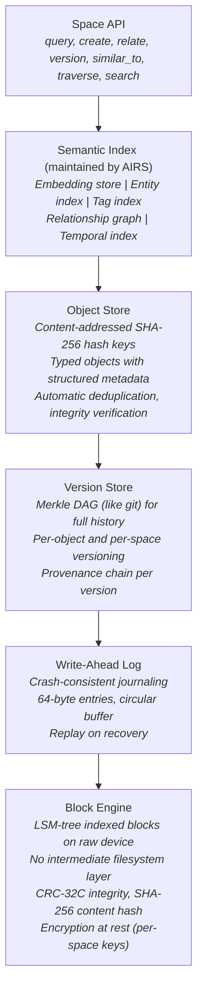
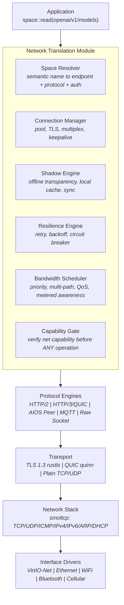
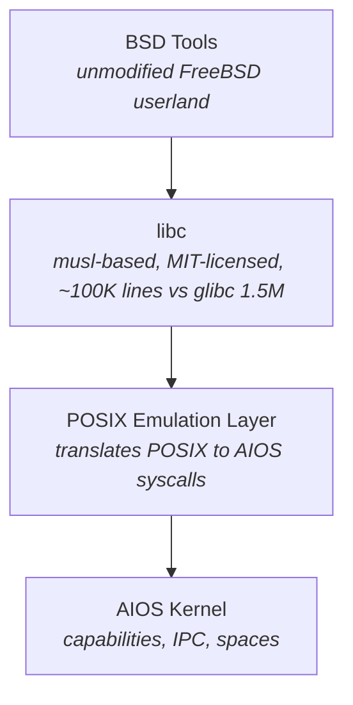
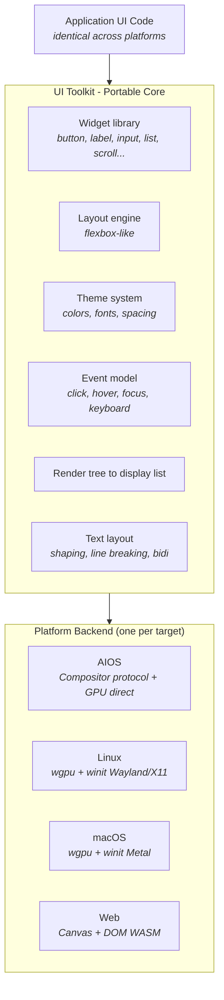
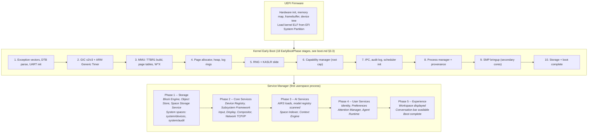

# AIOS: AI-First Operating System

## System Architecture Document

**Related documents:**

- [overview.md](./overview.md) — System overview and vision summary
- [development-plan.md](./development-plan.md) — Phase plan, timeline, risks
- [ipc.md](../kernel/ipc.md) — IPC and syscall interface deep dive
- [scheduler.md](../kernel/scheduler.md) — Scheduler deep dive
- [memory.md](../kernel/memory.md) — Memory management architecture
- [boot.md](../kernel/boot.md) — Boot sequence and init system deep dive
- [boot-lifecycle.md](../kernel/boot-lifecycle.md) — Boot lifecycle, advanced topics, and design principles
- [hal.md](../kernel/hal.md) — Hardware Abstraction Layer (Platform trait, device drivers, porting guide)
- [observability.md](../kernel/observability.md) — Kernel observability (structured logging, metrics, tracing, health)
- [deadlock-prevention.md](../kernel/deadlock-prevention.md) — Lock ordering and deadlock prevention
- [spaces.md](../storage/spaces.md) — Space storage system deep dive
- [compositor.md](../platform/compositor.md) — GPU compositor and window management
- [networking.md](../platform/networking.md) — Network Translation Module deep dive
- [subsystem-framework.md](../platform/subsystem-framework.md) — Universal hardware abstraction architecture
- [airs.md](../intelligence/airs.md) — AI Runtime Service deep dive
- [agents.md](../applications/agents.md) — Agent framework and SDK specification
- [security.md](../security/security.md) — Eight-layer security model deep dive
- [fuzzing-and-hardening.md](../security/fuzzing-and-hardening.md) — Fuzzing strategy and input hardening
- [static-analysis.md](../security/static-analysis.md) — Static analysis and formal verification roadmap
- [flow.md](../storage/flow.md) — Flow system deep dive
- [context-engine.md](../intelligence/context-engine.md) — Context Engine deep dive
- [posix.md](../platform/posix.md) — POSIX compatibility layer deep dive
- [experience.md](../experience/experience.md) — Experience layer and UI design
- [browser.md](../applications/browser.md) — Decomposed web content runtime
- [inspector.md](../applications/inspector.md) — Security dashboard and provenance viewer
- [ui-toolkit.md](../applications/ui-toolkit.md) — Portable UI toolkit specification
- [attention.md](../intelligence/attention.md) — Attention Manager and notification triage
- [preferences.md](../intelligence/preferences.md) — Preference Service
- [identity.md](../experience/identity.md) — Identity and trust model
- [task-manager.md](../intelligence/task-manager.md) — Task decomposition and orchestration
- [audio.md](../platform/audio.md) — Audio subsystem architecture
- [accessibility.md](../experience/accessibility.md) — Accessibility engine
- [power-management.md](../platform/power-management.md) — Power management policy engine
- [developer-guide.md](./developer-guide.md) — Kernel developer guide: Rust patterns, pitfalls, workflow
- [language-ecosystem.md](./language-ecosystem.md) — Language runtimes and multi-language support
- [ai-agent-context.md](./ai-agent-context.md) — AI agent onboarding: required reading, anti-patterns, verification
- [language-ecosystem.md](./language-ecosystem.md) — Language ecosystem: Rust, Python, TypeScript, WASM runtimes and toolchains

-----

## Terminology Glossary

AIOS reuses common OS terms but gives them specific meanings. This glossary defines canonical types for each meaning. **In code and API documentation, always use the specific type name, never the bare term.**

| Term | Context | Canonical Type | Definition |
|---|---|---|---|
| **Agent** | Installation | `AgentManifest` | Signed package declaring name, author, requested capabilities, code hash, dependencies, and AI security analysis |
| **Agent** | Runtime | `AgentProcess` | A running process created from a manifest, with a PID, capability table, resource limits, and behavioral baseline |
| **Task** | User-facing | `Task` | A user's goal decomposed into subtasks, with agents assigned, capabilities scoped, and activity logged |
| **Task** | Kernel | `Thread` | A schedulable unit of work assigned to a scheduling class (RT, Interactive, Normal, Idle) |
| **Session** | Hardware | `SubsystemSession` | A bounded interaction with a hardware subsystem (audio output session, camera capture session) |
| **Session** | AIRS | `InferenceSession` | A single inference request with its own KV cache, priority, token callback, and stop sequences |
| **Service** | System | Trust Level 1 process | A userspace daemon (AIRS, Space Storage, Compositor, NTM, Service Manager) with elevated capabilities |
| **Service** | IPC | `ChannelId` + protocol | A capability-gated IPC channel with a registered protocol that clients call via `IpcCall` |
| **Space** | Storage | `Space` | A named collection of typed objects with a security zone, encryption state, quota, and parent hierarchy |
| **Space** | Security | `SecurityZone` | The zone classification of a space: Core, Personal, Collaborative, Untrusted, or Ephemeral |

**Usage rules:**
- Write `AgentManifest`, not "agent," when referring to the installable package
- Write `InferenceSession`, not "session," when referring to an AIRS inference context
- Write `SubsystemSession`, not "session," when referring to a hardware interaction
- The bare term is acceptable in user-facing UI and conversation, never in code or API docs

-----

## 1. Vision

A clean-sheet microkernel operating system written in Rust for aarch64 where every subsystem is designed assuming AI exists. AI is the infrastructure — invisible when not needed, available when invoked, and the reason everything works better than on any other OS.

### Design Principles

1. **AI is infrastructure, not interface.** The user never has to interact with AI to use the computer. AI enhances silently — performance, organization, security, search. When the user wants AI help, the conversation bar is always one gesture away.
1. **No legacy tax.** Every abstraction is designed for 2026, not inherited from 1970. Spaces instead of files. Tasks instead of processes. Flow instead of clipboard. Capabilities instead of permissions.
1. **The computer is one continuous experience.** Work, leisure, communication, creation — these aren't separate app silos. They're activities that share context through spaces, connected by relationships the AI maintains.
1. **Security through depth, not walls.** Eight layers of security, each designed for a world where autonomous agents act on your behalf. No single layer failing compromises the system.
1. **Developers build capabilities, not apps.** The SDK provides context, persistence, inference, security, and tool interop as system services. Developers write the interesting part.
1. **Portable where it matters.** The UI toolkit and developer tools run on Linux, macOS, and AIOS. Developers build on familiar platforms, deploy to AIOS. The OS earns adoption, it doesn't demand it.
1. **BSD-licensed ecosystem.** FreeBSD userland, musl libc, permissive licensing throughout. No GPL copyleft constraints on the OS or its users.
1. **One framework, every subsystem.** All hardware — networking, audio, USB, display, cameras, Bluetooth, printers — implements the same traits: capability gate, sessions, data channels, audit, power management, POSIX bridge. Adding new hardware is formulaic, not architectural.

-----

## 2. System Architecture

### 2.1 Full Stack Overview

```mermaid
flowchart TD
    subgraph EXP["EXPERIENCE LAYER"]
        direction LR
        Workspace["`Workspace
*contextual home view*`"]
        ConvBar["`Conversation Bar
*always available, user-invoked*`"]
        MediaPlayer["`Media Player
*music, video, podcasts, streaming*`"]
        WebBrowser["`Web Browser
*Servo-based, semantic indexing*`"]
        GameLauncher["`Game Launcher
*library, saves as space objects*`"]
        Inspector["`Inspector
*provenance, security visibility*`"]
        AgentStore["`Agent Store
*discover, approve capabilities*`"]
        Settings["`Settings
*conversational, AI-mediated*`"]
    end

    subgraph SVC["SERVICES LAYER"]
        direction LR
        subgraph AIRS["AI Runtime Service — hot-swappable privileged service"]
            direction LR
            InfEngine["`Inference Engine
*GGML, NEON SIMD*`"]
            ModelReg["`Model Registry
*GGUF, LRU*`"]
            AgentLife["`Agent Lifecycle
*create, sandbox*`"]
            CtxMgr["`Context Manager
*state, compress*`"]
            ToolMgr["`Tool Manager
*register, exec*`"]
            SpaceIdx["`Space Indexer
*embed, relate*`"]
            CtxEngine["`Context Engine
*infer work/play*`"]
            AttnMgr["`Attention Mgr
*triage, digest*`"]
            IntentVer["`Intent Verifier
*action alignment*`"]
            BehMon["`Behavioral Monitor
*anomaly detect*`"]
            AdvDef["`Adversarial Def
*injection detect*`"]
            InfSched["`Inference Scheduler
*priority, deadline*`"]
        end

        SpaceStorage["`Space Storage
*object store, block engine, content-addr*`"]
        TaskMgr["`Task Manager
*intent to subtasks, orchestrate*`"]
        FlowSvc["`Flow Service
*context-aware data transfer, transform*`"]
        IdentitySvc["`Identity Svc
*crypto keys, relationships, trust model*`"]
        NTM["`Network Translation Module
*spaces to net*`"]
        PrefSvc["`Preference Svc
*conversational config, learn*`"]
        Compositor["`Compositor
*GPU-native, semantic-ready*`"]
        AudioSvc["`Audio Service
*mixing, route, decode, output*`"]

        subgraph SUBSYS["Subsystem Framework — universal hardware abstraction"]
            direction LR
            CapGate["`Capability Gate
*kernel-enforced*`"]
            Sessions["`Sessions
*bounded use*`"]
            DataChan["`Data Channels
*Flow-connected*`"]
            DevReg["`Device Registry
*system/devices/*`"]
            AuditSp["`Audit Spaces
*system/audit/*`"]
            PwrMgr["`Power Manager
*idle policies*`"]
            PosixBr["`POSIX Bridge
*/dev nodes*`"]
            ConflRes["`Conflict Res
*share/queue*`"]
            Hotplug["`Hotplug Handler
*USB, BT, etc.*`"]
        end

        POSIXCompat["`POSIX Compat
*BSD userland, musl libc, translation*`"]
        AgentRT["`Agent Runtime
*sandbox, SDK runtime, tool execution*`"]
        ConnSvc["`Connector Svc
*Slack, GitHub, external APIs*`"]
        DevDrivers["`Device Drivers
*VirtIO, USB, WiFi, BT*`"]
    end

    subgraph KERN["KERNEL SPACE"]
        subgraph AIKP["AI Kernel Primitives"]
            direction LR
            ModelMem["`Model memory regions
*shared, pinned, ref-counted*`"]
            ComputeAbs["`Compute device abstraction
*CPU/GPU/NPU*`"]
            AgentCap["`Agent capability tokens
*fine-grained, revocable, expiring*`"]
            ProvChain["`Provenance chain
*append-only, Merkle-linked, signed*`"]
            InfPrim["`Inference scheduling primitives
*priority, deadline, preempt*`"]
        end

        subgraph MICRO["Core Microkernel"]
            direction LR
            VMM["`Virtual Memory Manager
*4-level, TTBR0/TTBR1, W^X, KASLR*`"]
            IPC["`IPC
*sync message passing, capability transfer, zero-copy*`"]
            Sched["`Scheduler
*priority + deadline, context-aware hints*`"]
            CapMgr["`Capability Manager
*create, transfer, revoke, attenuate*`"]
            CryptoCore["`Cryptographic Core
*Ed25519, AES-256, key storage*`"]
            AuditLog["`Audit Log
*kernel-enforced, tamper-evident*`"]
            ProcMgr["`Process Manager
*create, isolate, terminate*`"]
        end

        subgraph HAL["Hardware Abstraction Layer"]
            direction LR
            PlatTrait["`Platform trait
*7 init methods, one per hardware class*`"]
            IntCtrl["`InterruptController
*GICv2 on Pi 4, GICv3 on Pi 5/QEMU*`"]
            Timer["`Timer
*ARM Generic Timer*`"]
            Uart["`Uart
*PL011 UART*`"]
            GpuDev["`GpuDevice
*VirtIO-GPU / VideoCore VI / VII*`"]
            NetDev["`NetworkDevice
*VirtIO-Net / Broadcom Genet*`"]
            StorDev["`StorageDevice
*VirtIO-Blk / Arasan SDHCI*`"]
            RngDev["`RngDevice
*VirtIO-RNG / bcm2835-rng*`"]
            UEFIRS["UEFI Runtime Services"]
            DTBParse["Device Tree Parsing + Platform Detection"]
        end
    end

    subgraph HW["HARDWARE"]
        direction LR
        CPU["`CPU
*aarch64*`"]
        RAM["RAM"]
        GPU["GPU"]
        NPU["NPU"]
        Storage["Storage"]
        Network["Network"]
    end

    EXP --> SVC
    SVC --> KERN
    KERN --> HW
```



### 2.2 Space Storage System

Replaces the traditional filesystem. Objects instead of files. Semantic relationships instead of directory trees. Content-addressed storage with AI-maintained indexes.



For deep-dive specifications, see the Space Storage sub-documents: [data structures](../storage/spaces-data-structures.md), [block engine](../storage/spaces-block-engine.md), [versioning](../storage/spaces-versioning.md), [encryption](../storage/spaces-encryption.md), [query engine](../storage/spaces-query-engine.md), [sync](../storage/spaces-sync.md), [POSIX compatibility](../storage/spaces-posix.md), and [storage budget](../storage/spaces-budget.md).

**Core data model:**

```rust
pub struct Space {
    id: SpaceId,
    name: String,
    parent: Option<SpaceId>,
    security_zone: SecurityZone,
    encryption: EncryptionState,
    quota: SpaceQuota,
    created_at: Timestamp,
    modified_at: Timestamp,
    object_count: u64,
    total_size: u64,
}

pub struct Object {
    id: ObjectId,
    /// Human-readable name (last path component)
    name: String,
    content_hash: Hash,
    content_type: ContentType,
    content_size: u64,
    semantic: SemanticMetadata,
    relations: Vec<Relation>,
    created_at: Timestamp,
    modified_at: Timestamp,
    created_by: AgentId,
    modified_by: AgentId,
    provenance: ProvenanceChain,
}

pub struct SemanticMetadata {
    summary: Option<String>,
    tags: Vec<String>,
    auto_tags: Vec<String>,
    embedding: Option<Vec<f32>>,
    entities: Vec<Entity>,
    description: Option<String>,
    auto_summary: Option<String>,
    text_content: Option<String>,
    indexed_at: Option<Timestamp>,
}

/// Simplified content type enum; see spaces-data-structures.md §3.3 for the full canonical definition
/// with additional variants (Directory, Text, Markdown, Json, Xml, Credential, etc.).
pub enum ContentType {
    Document, Code, Image, Audio, Video, Data,
    Conversation, Config, Agent, GameSave,
    WebPage, MediaReference, Task, Note,
    CacheEntry, SessionToken, Cookie,
}

pub struct Relation {
    source: ObjectId,
    target: ObjectId,
    kind: RelationKind,
    confidence: f32,
    explanation: Option<String>,
    created_by: RelationSource,
}

pub enum RelationKind {
    DerivedFrom, References, DependsOn,
    RelatedTo, CreatedBy, InputTo,
    OutputOf, ConversationContext,
    VersionOf, SiblingOf,
    ChildOf, Attachment,
}
```

### 2.3 Task & Agent Model

Replaces the process model for user-facing work. Users think about goals, not programs. Processes still exist underneath for isolation.

```rust
pub struct Task {
    id: TaskId,
    intent: Intent,
    state: TaskState,
    agents: Vec<AgentId>,
    capabilities: CapabilitySet,
    activity_log: Vec<ActivityEntry>,
    children: Vec<TaskId>,
    persistence: Persistence,
    context: ContextLink,
}

/// Links a task to its surrounding context — the active space, identity,
/// and Context Engine snapshot at the time the task was created. Used by
/// agents to access contextual information without querying the Context
/// Engine repeatedly. The snapshot is a frozen ContextState (see §2.5 below).
pub struct ContextLink {
    /// The space the task was initiated from
    space_id: SpaceId,
    /// The identity that owns this task
    identity_id: IdentityId,
    /// Snapshot of context at task creation (focus state, recent activity)
    snapshot_id: ObjectId,
}

pub enum TaskState {
    Active,
    WaitingForUser(Question),
    WaitingForResource,
    Background,
    Suspended,
    Completed(Outcome),
    Failed(Error),
}

/// A user-facing question presented when a task needs input.
pub struct Question {
    text: String,
    options: Option<Vec<String>>,
    default: Option<String>,
}

/// Result of a successfully completed task.
pub struct Outcome {
    summary: String,
    artifacts: Vec<ObjectId>,
}

/// Structured intent describing what a task or agent is trying to accomplish.
/// Used by Intent Verification (Layer 1) to compare observed actions against
/// declared goals. Distinct from TransferIntent (§2.4) which governs Flow.
pub struct Intent {
    /// Human-readable goal description (e.g., "organize research papers")
    goal: String,
    /// Structured action categories this intent permits
    permitted_actions: Vec<ActionCategory>,
    /// Maximum scope (spaces, object count) the intent covers
    scope: IntentScope,
}

pub enum ActionCategory {
    Read, Write, Delete, Create, Search, Infer, Network, Spawn,
}

pub struct IntentScope {
    spaces: Vec<SpaceId>,
    max_objects: Option<u64>,
    max_network_requests: Option<u64>,
}

/// AI engagement level driven by Context Engine signals.
pub enum AiEngagement {
    /// Pure infrastructure — scheduling, security, indexing.
    /// User sees no AI activity.
    Invisible,
    /// Results visible, process hidden — search works, defaults adapt.
    Ambient,
    /// Conversation bar responsive, suggestions ready.
    Available,
}

/// Resource allocation priority driven by Context Engine.
pub enum ResourcePriority {
    /// Foreground task gets maximum resources
    Foreground,
    /// Background tasks get fair share
    Background,
    /// System is in low-power mode
    LowPower,
}

/// A named entity extracted from content by AIRS (person, place,
/// organization, date, concept, etc.).
/// Named entity extracted from content by AIRS.
/// Simplified; see spaces-data-structures.md §3.3 for the canonical definition
/// (uses entity_type: EntityType with fewer variants, no span field).
pub struct Entity {
    name: String,
    kind: EntityKind,
    confidence: f32,
    /// Byte offset range in the source content
    span: Option<(usize, usize)>,
}

pub enum EntityKind {
    Person, Organization, Location, Date, Concept,
    Technology, Event, Product, Other(String),
}

/// Who created a relation between objects.
/// Simplified; see spaces-data-structures.md §3.4 for the canonical definition
/// (Explicit/AiInferred/SystemGenerated).
pub enum RelationSource {
    /// Created by AIRS during indexing
    Ai,
    /// Created explicitly by a user action
    User,
    /// Created by an agent during its operation
    Agent(AgentId),
}

pub enum Persistence {
    Ephemeral,   // gone when done
    Session,     // lives until closed
    Persistent,  // survives reboot
}

/// Simplified; see agents.md §2.4 for full definition.
pub struct AgentManifest {
    name: String,
    author: Identity,
    requested_capabilities: Vec<CapabilityRequest>,
    code: ContentHash,
    dependencies: Vec<Dependency>,
    ai_analysis: Option<SecurityAnalysis>,
}

/// Set of capabilities held by a task or agent process. Capabilities are
/// kernel-managed tokens — agents hold references, not the capabilities
/// themselves. The kernel validates every token on every syscall.
/// See ipc.md §4 for capability transfer and boot.md §4.7 for
/// the root capability from which all others derive.
pub struct CapabilitySet {
    /// Active capability tokens, keyed by capability type for O(1) lookup
    tokens: HashMap<CapabilityType, Vec<CapabilityToken>>,
}

/// Simplified capability discriminant for HashMap keying in CapabilitySet.
/// Maps to the broader `Capability` enum (§3.2) which carries full parameters.
/// CapabilityType identifies the *kind* of access; Capability carries the
/// full token with specific parameters (e.g., AudioCapability details).
pub enum CapabilityType {
    ReadSpace(SpaceId),
    WriteSpace(SpaceId),
    FlowRead,
    FlowWrite,
    Network(NetworkScope),  // see networking.md for scope semantics
    Spawn,
    DeviceAccess(DeviceClass),
    IpcConnect(ServiceName),  // service name string wrapper
}

/// Simple type aliases for capability parameters (full definitions in
/// their respective subsystem documents where applicable).
pub type NetworkScope = String;       // service name or wildcard pattern
pub type ServiceName = String;        // registered IPC service name
pub type Scope = SpaceId;             // audit read scope
pub type CredentialId = u64;          // credential store identifier

/// A single entry in a task's activity log. Records what an agent did,
/// when, and in what context. Used by Intent Verification (Layer 1) to
/// compare observed actions against the task's declared Intent.
pub struct ActivityEntry {
    timestamp: Timestamp,
    agent: AgentId,
    action: ActivityAction,
    /// Capability that authorized this action
    capability: CapabilityType,
    /// Time spent on this action (for CPU accounting)
    duration: Option<Duration>,
}

pub enum ActivityAction {
    SpaceRead { space: SpaceId, object: ObjectId },
    SpaceWrite { space: SpaceId, object: ObjectId },
    SpaceCreate { space: SpaceId, object: ObjectId },
    SpaceDelete { space: SpaceId, object: ObjectId },
    FlowTransfer { intent: TransferIntent },
    NetworkRequest { endpoint: String },
    InferenceRequest { model: ModelId },
    AgentSpawn { child: AgentId },
    IpcMessage { channel: ChannelId },
}

/// Append-only provenance chain for an object. Each entry links to the
/// previous via hash, forming a Merkle chain. Stored in the Version Store
/// (see spaces-versioning.md §5.1 for per-version ProvenanceEntry). The chain here
/// is the object-level summary — it aggregates provenance across all
/// versions for quick inspection without walking the full version DAG.
pub struct ProvenanceChain {
    /// Hash of the most recent provenance entry
    head: Hash,
    /// Total number of entries in the chain
    length: u64,
    /// Who originally created this object
    origin: ProvenanceOrigin,
}

pub enum ProvenanceOrigin {
    /// Created by a user action via an agent
    UserCreated { agent: AgentId },
    /// AI-generated content
    AiGenerated { model: ModelId },
    /// Imported from external source
    Imported { source: String },
    /// Derived from another object
    DerivedFrom { source: ObjectId },
}
```

### 2.4 Flow System

Replaces the clipboard. Context-aware data transfer with transformation and history.

```rust
pub struct Flow {
    history: Vec<FlowEntry>,
    active_transfer: Option<Transfer>,
}

pub struct Transfer {
    source: ObjectRef,      // see spaces-data-structures.md §3.0 for ObjectRef definition
    content: TypedContent,  // see flow-data-model.md §3.4 for TypedContent definition
    intent: TransferIntent,
    transformations: Vec<Transform>,
}

/// A content transformation applied during Flow transfer.
/// Converts content from one type to another (e.g., rich text → plain text,
/// image → thumbnail, audio → transcript).
pub struct Transform {
    id: TransformId,
    name: String,
    input_types: Vec<String>,    // MIME patterns
    output_type: String,         // MIME type
    provider: TransformProvider,
}

pub enum TransformProvider {
    /// Built-in system transforms (e.g., text encoding conversion)
    System,
    /// AI-powered transforms via AIRS (e.g., audio → transcript)
    Airs,
    /// Agent-provided transforms
    Agent(AgentId),
}

pub enum TransferIntent {
    Copy, Move, Reference, Quote, Derive,
}
```

For deep-dive specifications, see the Flow sub-documents: [data model](../storage/flow-data-model.md), [transforms](../storage/flow-transforms.md), [history & sync](../storage/flow-history.md), [integration](../storage/flow-integration.md), [security](../storage/flow-security.md), [SDK](../storage/flow-sdk.md), and [extensions](../storage/flow-extensions.md).

### 2.5 Context Engine

Replaces explicit Work/Play modes. Continuously infers user context from signals. No toggles required.

```rust
pub struct ContextEngine {
    signals: Vec<ContextSignal>,
    current: ContextState,
    overrides: Vec<Override>,
}

pub enum ContextSignal {
    ActiveSpace(SpaceId),
    RunningAgents(Vec<AgentId>),
    InputPattern(InputActivity),
    TimeOfDay(Time),
    CalendarState(CalendarContext),
    MediaPlayback(MediaState),
    UserHistory(Pattern),
    ExplicitIntent(Option<Intent>),
}

pub struct ContextState {
    work_engagement: f32,     // 0.0 = deep leisure, 1.0 = deep work
    ai_engagement: AiEngagement,
    notification_threshold: Urgency,
    resource_priority: ResourcePriority,
}

pub struct Override {
    intent: String,        // "heads down for 2 hours"
    effect: ContextState,
    expires: Timestamp,    // always time-bounded
}
```

**AI engagement tiers driven by context:**

|Tier     |AI Behavior                                                   |Triggered When                            |
|---------|--------------------------------------------------------------|------------------------------------------|
|Invisible|Pure infrastructure — scheduling, security, indexing          |Gaming, media playback, casual browsing   |
|Ambient  |Results visible, process hidden — search works, defaults adapt|Light work, mixed activity                |
|Available|Conversation bar responsive, suggestions ready                |Active work in spaces, explicit invocation|

### 2.6 Attention Management

Replaces notifications. AI-triaged, context-aware, never interruptive during leisure unless genuinely urgent.

```rust
pub struct AttentionManager {
    incoming: PriorityQueue<AttentionItem>,
    model: AttentionModel,   // see attention.md §4 for AttentionModel (urgency classification parameters)
    context: ContextState,
}

pub struct AttentionItem {
    source: AgentId,
    content: AttentionContent,  // see attention.md §3 for AttentionContent enum (distinct from flow.md §3.4 TypedContent struct)
    urgency: Urgency,       // AI-assessed, not app-declared
    relevance: f32,
    auto_actionable: Option<ProposedAction>,
    group: Option<GroupId>,  // opaque identifier for grouping related notifications
}

pub enum Urgency {
    Interrupt,   // show immediately (system error, critical person)
    NextBreak,   // show when user pauses
    Digest,      // batch into periodic summary
    Silent,      // log but never show
}
```

### 2.7 Identity & Relationships

Replaces user accounts. Cryptographic identity, graduated trust, relationship-aware sharing.

```rust
/// Ed25519 keypair for identity signing and verification.
/// See identity.md §4 for key management and derivation.
pub struct KeyPair {
    public: [u8; 32],   // Ed25519 public key
    private: [u8; 64],  // Ed25519 expanded private key (encrypted at rest)
}

pub struct Identity {
    id: IdentityId,
    keys: KeyPair,
    relationships: Vec<Relationship>,
    space_access: Vec<(SpaceId, AccessLevel)>,  // see identity.md §7 for AccessLevel
    trust: TrustModel,                          // see identity.md §6 for TrustModel
}

pub struct Relationship {
    with: IdentityId,
    kind: RelationshipKind,  // see identity.md §5 for RelationshipKind
    trust_level: TrustLevel, // see identity.md §5 for TrustLevel
    shared_spaces: Vec<SpaceId>,
}
```

### 2.8 Preference System

Replaces config files. Conversational configuration, AI-mediated, evolves through use.

```rust
pub struct Preference {
    id: PreferenceId,
    description: String,
    value: PreferenceValue,       // see preferences.md §3 for PreferenceValue variants
    source: PreferenceSource,
    affects: Vec<SystemComponent>,// see preferences.md §3 for SystemComponent enum
    history: Vec<PreferenceChange>,// see preferences.md §3 for PreferenceChange
}

pub enum PreferenceSource {
    UserExplicit,
    UserBehaviorInferred,
    SystemDefault,
    AgentSuggested(AgentId),
}
```

### 2.9 Network Translation Module

Replaces application-level networking. Applications see spaces; the OS handles all networking transparently. **Full design in [networking.md](../platform/networking.md).**

**Core principle:** Applications never see the network. There are only space operations — some of which happen to involve remote spaces — and the OS handles everything else.



**Key innovations:**

- Mandatory kernel capability gate — agents cannot bypass network access control
- Layered optional services — TLS, HTTP, connection pooling are userspace services agents can use or bypass with appropriate capability labeling
- Six error types instead of hundreds (Unreachable, Unavailable, PermissionDenied, NotFound, Conflict, TooLarge)
- Offline transparency — applications never know whether they're online or offline
- Credential isolation — agents use credentials without possessing them
- Per-space capability enforcement — no default network access
- Trust labeling — agents using OS TLS get higher trust rating than self-managed TLS
- AIOS Peer Protocol for native device-to-device communication with capability exchange
- Implements the subsystem framework (see [subsystem-framework.md](../platform/subsystem-framework.md))

### 2.10 BSD Compatibility Layer

AIOS uses FreeBSD userland (BSD-licensed) instead of GNU tools (GPL), providing immediate productivity for every Unix developer.

**Compatibility architecture:**



**Why BSD, not GNU:** FreeBSD tools are BSD-licensed (permissively usable), self-contained, portable, proven in macOS/PlayStation/Switch, and assume less about the host system. GNU tools are GPL (copyleft creates legal complexity for OS distribution) and deeply tied to Linux/glibc.

**Why musl, not glibc:** MIT-licensed (vs GPL), designed for static linking and portability, much smaller codebase (~100K lines vs ~1.5M), already proven on Alpine Linux and non-Linux systems, not tied to Linux kernel specifics.

**Included tools:**

- Core utilities: ls, cp, mv, rm, mkdir, cat, grep, sed, awk, find, sort, diff, patch
- Development: make (BSD make), clang/lld (LLVM, BSD-licensed), ar, nm, strip
- Shell: FreeBSD /bin/sh (ash-based, POSIX-compliant, BSD-licensed) — NOT bash (GPL)
- Compression: tar, gzip, bzip2, xz
- Network: curl, OpenSSH
- Editor: nvi (BSD vi)

**POSIX-to-Spaces path mapping:**

```text
/spaces/research/          → Objects in "research" space
/spaces/research/paper.md  → Object "paper" (type: document)
/home/user/                → Personal space (default)
/tmp/                      → Ephemeral space (auto-cleaned)
/dev/null, /dev/urandom    → Device capabilities
/proc/self/                → Process introspection (minimal, read-only)
/bin/, /usr/bin/           → System utilities (initramfs/system space)
```

**Translation mechanics:**

```text
ls /spaces/research/   → space query, list objects, present as directory entries
grep "term" /spaces/*  → glob expansion to space objects, grep sees regular file content
open()                 → space object read capability check + content retrieval
stat()                 → object metadata query
fork()                 → process create with inherited capabilities
pipe()                 → IPC channel pair
mmap()                 → shared memory object
```

Tools never know they're not on a traditional filesystem. Self-hosting capability via clang/lld means AIOS can compile software for itself.

### 2.11 Portable UI Toolkit

The UI toolkit runs on Linux, macOS, and AIOS. Developers build on familiar platforms, deploy to AIOS.

**Why portability matters:**

1. **Developer adoption.** Build/test on familiar platform, no AIOS boot required for development
1. **Ecosystem bootstrapping.** Developers invest knowing work isn't trapped on a zero-user platform
1. **Proving abstractions.** Multi-platform proves design isn't accidentally kernel-coupled
1. **Fast iteration.** Development loop stays fast (edit on Mac, test in QEMU)

**Architecture:**



**Toolkit choice: iced (Elm-inspired, pure Rust)** — Already works on Linux/macOS/Windows/Web. MIT-licensed. GPU-rendered via wgpu. Architecture naturally separates platform from toolkit. Adding AIOS backend is a defined task, not research.

**AIOS backend unique capabilities (gracefully degrade on other platforms):**

- Semantic window hints → compositor understands content (ignored on Linux/macOS)
- Flow integration → context-aware drag/drop (falls back to standard D&D)
- Space-backed data → versioned, searchable (falls back to file I/O)
- Capability-aware UI → disable elements based on permissions (no restrictions elsewhere)

**Cross-platform example:**

```rust
use aios_toolkit::prelude::*;

fn view(state: &AppState) -> Element {
    column![
        text(&state.title).size(24),
        text_input("Search...", &state.query).on_input(Message::QueryChanged),
        button("Search").on_press(Message::Search),
        results_list(&state.results),
    ]
}

// Backend handles platform differences:
// AIOS: search via Space API → space objects
// Linux: search via SQLite → rows
// Web: search via REST → JSON
// UI code unchanged
```

### 2.12 Subsystem Framework

**Full design in [subsystem-framework.md](../platform/subsystem-framework.md).**

Every hardware subsystem in AIOS (networking, audio, USB, display, cameras, Bluetooth, printers, GPS, etc.) implements the same framework of traits and types. The framework handles everything generic — capability enforcement, session lifecycle, audit logging, power management, POSIX bridge, device registry, hotplug. Subsystem-specific code is the minimal amount needed for the domain.

**Core principle:** Define the framework once, instantiate it for each hardware class. Adding a new hardware class becomes formulaic, not architectural.

**Five-layer architecture (every subsystem):**

```text
Agent API Layer        → What agents see: typed, semantic, capability-gated
POSIX Translation      → What BSD tools see: /dev nodes, ioctl, read/write
Subsystem Service      → Policy, multiplexing, routing, format negotiation
Device Abstraction     → Uniform trait per device class, regardless of hardware
Hardware Driver        → VirtIO, USB, PCI, platform-specific
    ↕ Capability Gate (kernel-enforced) + Audit Space (all access logged)
```

**Key abstractions:**

|Concept            |What It Is                                               |Why It Matters                                           |
|-------------------|---------------------------------------------------------|---------------------------------------------------------|
|`Subsystem` trait  |Registration, device lifecycle, session creation         |Every hardware class implements the same interface       |
|`DeviceClass` trait|What a device offers, expressed as capabilities          |Agents don't need to know hardware details               |
|`DeviceSession`    |Bounded, audited interaction with hardware               |OS knows who is using what, for how long, and why        |
|`SessionIntent`    |Why the agent wants access (purpose, priority, direction)|Enables QoS, conflict resolution, meaningful audit       |
|`DataChannel`      |Universal data pipe with Flow integration                |Hardware pipelines: mic → agent → speaker through Flow   |
|`ConflictPolicy`   |How to handle multiple agents wanting same device        |Share (audio mixer), Queue (printer), Prompt (camera)    |
|`PosixBridge`      |Maps /dev nodes and ioctl to subsystem sessions          |BSD tools work unmodified on any subsystem               |
|`PowerManaged`     |Idle policy, suspend, wake events                        |Uniform power management across all hardware             |
|`AuditRecord`      |Timestamped, agent-tagged event for any subsystem        |Cross-subsystem queries: "what hardware did agent X use?"|

**Mandatory kernel gate + optional userspace services pattern:** The capability gate is the only part in the kernel — a few hundred lines that enforce who can access what. Everything above (TLS service, audio mixer, connection pooling) is a userspace service that agents can use for convenience or bypass with raw capabilities and appropriate trust labeling.

**USB as meta-subsystem:** USB is a bus, not a device class. The USB subsystem identifies what's connected and routes it to the right subsystem (audio, input, storage, camera, network, print). The audio subsystem doesn't care whether a microphone is USB, Bluetooth, or built-in.

**All subsystems at a glance:**

|Subsystem|Channel Format   |Conflict Policy                     |POSIX Interface  |
|---------|-----------------|------------------------------------|-----------------|
|Network  |ByteStream       |Share (multiplex)                   |socket API       |
|Audio    |Audio samples    |Output: Share (mixer), Input: Prompt|/dev/audio*      |
|Display  |RenderSurface    |Share (compositor)                  |/dev/fb*, DRM    |
|Input    |Events           |Share (broadcast to focus)          |/dev/input/event*|
|Camera   |Video frames     |Prompt user                         |/dev/video*      |
|Storage  |ByteStream       |Share (filesystem layer)            |/dev/sd*, block  |
|Bluetooth|ByteStream/Events|Per-profile                         |/dev/bluetooth*  |
|Print    |Frames (pages)   |Queue (FIFO)                        |/dev/lp*, CUPS   |
|GPS      |Events (location)|Share (read-only)                   |—                |
|USB      |Varies by class  |Varies by class                     |/dev/usb*        |
|Power    |Control commands |Exclusive (kernel)                  |/sys/power/*     |

### 2.13 Browser Architecture

**Full design in [browser.md](../applications/browser.md).**

Traditional browsers are mini-operating systems because the actual OS provides nothing for web security. AIOS already has capabilities, isolation, audited networking, spaces, and Flow. The browser doesn't rebuild all of that — it uses what the OS provides and focuses on the one thing only a browser can do: **execute web content.**

**Decomposition:** The browser becomes a constellation of agents:

- **Browser Shell Agent** — tab management, URL bar, bookmarks (stored in spaces), history (stored in spaces), built with portable UI toolkit
- **Tab Agents** — one per site, each a literal AIOS agent with capabilities derived from the URL origin. Contains Servo rendering engine and SpiderMonkey JS runtime
- **Service Worker Agents** — persistent Tab Agents with constrained capabilities for background operation

**Same-origin policy becomes kernel-enforced capability isolation.** A Tab Agent for `weather.com` physically cannot read memory belonging to a Tab Agent for `bank.com`. Not a browser policy — a hardware-enforced capability boundary.

**Web APIs bridge to OS services through the subsystem framework:**

|Web API                     |Subsystem|Mechanism                                    |
|----------------------------|---------|---------------------------------------------|
|`fetch()`                   |Network  |Service channel with origin-scoped NetworkCap|
|`getUserMedia()` (camera)   |Camera   |CameraCapability, user prompted              |
|`getUserMedia()` (mic)      |Audio    |AudioCapability, user prompted               |
|`navigator.geolocation`     |GPS      |GpsCapability, user prompted                 |
|`WebGL` / `WebGPU`          |Display  |DisplayCapability (limited)                      |
|`localStorage` / `IndexedDB`|Storage  |Web-storage space (origin sub-space)         |

**Web storage is a space.** All web storage (cookies, localStorage, IndexedDB, Cache API) maps to sub-spaces within `web-storage/`, scoped by origin. Unified quota, searchable by AIRS, syncable across devices, fully inspectable by the user.

**Unique capabilities:** Ad/tracker blocking at capability level (undetectable by anti-adblock), cross-agent web integration through Flow, spaces as PWA backends (sync without a server), transparent phishing protection using cross-subsystem context.

-----

## 3. Security Architecture

### 3.1 Eight-Layer Security Model

Every action by every agent passes through all eight layers. No single layer failing compromises the system.

```mermaid
flowchart TD
    L1["`Layer 1: Intent Verification
*Does this action align with the declared task/intent?
AI compares observed actions against user's goal.
Catches legitimate capabilities used inappropriately.*`"]
    L2["`Layer 2: Capability Check
*Does the agent hold the required capability token?
Kernel-enforced, unforgeable, revocable, expiring.
Fine-grained: per-space, per-object, per-device.*`"]
    L3["`Layer 3: Behavioral Boundary
*Is the access pattern normal for this agent?
Rate limits, anomaly detection, baseline comparison.
Catches compromised agents with valid capabilities.*`"]
    L4["`Layer 4: Security Zone
*Is this data in a zone this agent can reach?
Core / Personal / Collaborative / Untrusted / Ephemeral.
Promotion between zones requires review.*`"]
    L5["`Layer 5: Adversarial Defense
*Is this action the result of prompt injection?
Control/data plane separation, injection detection.
Agent instructions from kernel, never from data.*`"]
    L6["`Layer 6: Cryptographic Enforcement
*Does the agent have the decryption key?
Per-space encryption + device-level encryption.
Keys released only after intent verification.*`"]
    L7["`Layer 7: Provenance Recording
*Action logged to tamper-evident Merkle chain.
Cryptographically signed, append-only.
Cannot be bypassed -- even if action is allowed.*`"]
    L8["`Layer 8: Blast Radius Containment
*Even if all above fail, damage is bounded.
Max objects writable, auto-snapshot before bulk ops.
Rollback window -- changes reversible for 72 hours.*`"]

    L1 --> L2 --> L3 --> L4 --> L5 --> L6 --> L7 --> L8
```



For deep-dive specifications, see the security sub-documents: [defense layers](../security/security-layers.md), [capability internals](../security/security-capabilities.md), [hardening](../security/security-hardening.md), [operations](../security/security-operations.md), [fuzzing & input hardening](../security/fuzzing-and-hardening.md), and [static analysis & formal verification](../security/static-analysis.md).

### 3.2 Capability System

```rust
pub enum Capability {
    // Space capabilities
    ReadSpace(SpaceId),
    WriteSpace(SpaceId),
    ReadObject(ObjectId),
    WriteObject(ObjectId),

    // Inference capabilities
    InferenceCpu(Priority),
    InferenceGpu(Priority),
    InferenceNpu(Priority),

    // Network capabilities (subsystem-specific)
    Network(NetworkCapability),     // per-service, per-method, per-path

    // Hardware subsystem capabilities (via subsystem framework).
    // Each *Capability type is defined by its subsystem doc; see
    // subsystem-framework.md §5 for the universal capability gate pattern.
    Audio(AudioCapability),         // direction, device, format constraints (audio.md §3)
    Camera(CameraCapability),       // resolution, frame rate limits
    Gps(GpsCapability),             // precision, update frequency
    Input(InputCapability),         // device types (keyboard, mouse, gamepad)
    Display(DisplayCapability),     // memory limits, shader constraints (compositor.md §10)
    Bluetooth(BluetoothCapability), // profile, device constraints
    Usb(UsbCapability),             // device class, raw access level
    Print(PrintCapability),         // printer, page limits

    // Agent capabilities
    SpawnAgent(AgentManifest),

    // Flow capabilities
    FlowRead,
    FlowWrite,

    // System capabilities
    AttentionPost(Urgency),
    IdentityRead,
    PreferenceRead,
    PreferenceWrite,
    AuditRead(Scope),
    UseCredential(CredentialId),
}

pub struct CapabilityToken {
    id: CapabilityTokenId,
    capability: Capability,
    holder: AgentId,
    granted_by: Identity,
    created_at: Timestamp,
    expires: Timestamp,
    delegatable: bool,
    attenuations: Vec<AttenuationSpec>,  // see security-capabilities.md §3 for AttenuationSpec
    revoked: bool,
    parent_token: Option<CapabilityTokenId>,  // for delegation chains
    usage_count: u64,
    last_used: Timestamp,
}
```

All subsystem capabilities pass through the same kernel-enforced gate (see [subsystem-framework.md](../platform/subsystem-framework.md) §5). The gate checks: does this agent hold the required capability? Does the capability permit this specific intent? Is it still valid? Is the resource budget exceeded? Every check is audited regardless of outcome.

### 3.3 Adversarial AI Defense

```rust
pub struct AdversarialDefense {
    input_screening: InputFilter,
    output_validation: OutputValidator,
    constraint_immutability: KernelEnforced,  // marker: constraints are kernel-enforced, not modifiable by agents
    injection_detection: InjectionDetector,
}

/// Marker type indicating a constraint enforced by the kernel and immutable from userspace.
pub struct KernelEnforced;

/// Screens agent inputs for known injection patterns before they reach
/// the inference engine. Runs at the boundary between data and control planes.
pub struct InputFilter {
    /// Pattern-based detectors (regex, keyword, structural)
    pattern_detectors: Vec<PatternDetector>,
    /// ML-based detector trained on known injection corpora
    ml_detector: Option<ModelId>,
    /// Action on detection: block, sanitize, or flag for review
    on_detection: FilterAction,
}

/// Validates agent outputs before they are committed to spaces or
/// delivered via Flow. Catches data exfiltration and policy violations.
pub struct OutputValidator {
    /// Maximum output size per action
    max_output_bytes: u64,
    /// Forbidden content patterns (e.g., credential-shaped strings)
    forbidden_patterns: Vec<PatternDetector>,
    /// Space write rate limit (objects per minute)
    write_rate_limit: u32,
}

/// Detects prompt injection attempts by analyzing the boundary between
/// system instructions (from kernel/manifest) and user/data content.
pub struct InjectionDetector {
    /// Confidence threshold for flagging (0.0-1.0)
    threshold: f32,
    /// Whether to block or log-and-continue on detection
    enforcement: EnforcementMode,
}

pub enum FilterAction { Block, Sanitize, FlagForReview }
pub enum EnforcementMode { Block, LogOnly }

/// A pattern-based detector for screening agent inputs/outputs.
pub struct PatternDetector {
    pattern: String,          // regex or structural pattern
    category: String,         // e.g., "injection", "credential", "exfiltration"
    severity: f32,            // 0.0–1.0
}

// Critical principle: agent instructions come from kernel,
// never from data objects. This is the control/data plane
// separation that prevents prompt injection from escalating
// to system-level compromise.
```

### 3.4 ARM Hardware Security Integration

|Feature                           |Use                                  |Phase                               |
|----------------------------------|-------------------------------------|------------------------------------|
|PAC (Pointer Authentication)      |Sign return addresses, mitigate ROP  |Phase 2 (kernel), Phase 13 (enforce)|
|BTI (Branch Target Identification)|Mitigate JOP attacks                 |Phase 2 (kernel), Phase 13 (enforce)|
|MTE (Memory Tagging Extension)    |Hardware use-after-free detection    |Phase 13                            |
|TrustZone (EL3)                   |Isolated secure world for key storage|Phase 24 (Secure Boot)              |
|TTBR0/TTBR1 separation            |User/kernel address space isolation  |Phase 2                             |
|W^X enforcement                   |Prevent code injection               |Phase 2                             |
|KASLR                             |Randomize kernel base address        |Phase 2                             |

-----

## 4. Developer Experience

### 4.1 Agent SDK

```rust
use aios_sdk::prelude::*;

#[agent(
    name = "Research Assistant",
    capabilities = [
        ReadSpace("research"),
        WriteSpace("research"),
        InferenceCpu(Priority::Normal),
        Network(services = ["api.anthropic.com", "arxiv.org"]),
    ]
)]
async fn research_agent(ctx: AgentContext) -> Result<()> {
    let history = ctx.conversation().await?;

    let related = ctx.spaces()
        .query("papers about transformer architectures")
        .since(Duration::weeks(4))
        .await?;

    let response = ctx.infer()
        .with_context(&history)
        .with_references(&related)
        .prompt(&user_message)
        .await?;

    ctx.spaces().save(
        "research",
        Object::document(response.summary())
            .derived_from(&related)
    ).await?;

    ctx.respond(response).await?;
    Ok(())
}
```

### 4.2 What Developers Get For Free

|System Service                |What It Replaces                             |Developer Effort Saved                   |
|------------------------------|---------------------------------------------|-----------------------------------------|
|Space Storage + Semantic Index|Vector DB, embedding pipeline, search        |Weeks of setup → zero                    |
|Context Manager               |Conversation persistence, state management   |Custom DB schema → zero                  |
|Inference Scheduler           |Model loading, GPU management, queueing      |CUDA setup, OOM handling → zero          |
|Capability System             |OAuth flows, permission models, consent UIs  |Per-service auth → one manifest          |
|Network Translation           |Socket management, TLS, retry, offline       |Networking code → zero                   |
|Subsystem Framework           |Device access, permissions, power mgmt       |Per-device driver code → one session open|
|Tool Manager                  |Tool calling frameworks, execution sandboxing|LangChain/CrewAI plumbing → zero         |
|Behavioral Monitor            |Security auditing, rate limiting             |Custom middleware → zero                 |
|Provenance Chain              |Audit logging, compliance                    |Custom logging → zero                    |

### 4.3 What Developers Build

|Type              |Description                              |Example                                              |
|------------------|-----------------------------------------|-----------------------------------------------------|
|Domain agents     |Bring expertise to a domain              |Legal contract reviewer, medical symptom analyzer    |
|Tools             |Single-purpose capabilities for any agent|PDF parser, web scraper, data visualizer             |
|Workflows         |Orchestrate agents for a use case        |Sales pipeline, academic research, course design     |
|Connectors        |Bridge external services into spaces     |Slack, GitHub, Notion, Google Workspace              |
|Space templates   |Pre-structured spaces for common needs   |Project management, client onboarding                |
|Experience plugins|Custom compositor UI components          |Specialized data visualization, domain-specific views|

### 4.4 Developer Workflow

```text
1. Write agent using SDK (on Mac/Linux using portable toolkit)
2. Declare capabilities in manifest (including remote spaces)
3. `aios agent dev` → live-reload in sandboxed test space (QEMU or host)
4. `aios agent test` → run against mock spaces with synthetic data
5. `aios agent audit` → security analysis of capability usage
6. `aios agent publish` → sign, package, submit to agent store
7. Users discover via conversation bar or agent store
8. Users approve capabilities → agent runs
```

-----

## 5. Native Experiences

### 5.1 The Workspace (Home View)

The first thing the user sees. Not a desktop with icons. A contextual view that adapts to the inferred context.

**During work context:** Active tasks and their state. Recent spaces with activity indicators. Attention digest (triaged notifications). Conversation bar (prominent).

**During leisure context:** Recently played games/media. Casual browsing shortcuts. Minimal notifications (only urgent). Conversation bar (present but subtle).

**Always available:** Quick launch for any space or experience. System status (subtle, non-intrusive). Inspector access (for power users).

### 5.2 Conversation Bar

Always one gesture away. Never forced. User-invoked only (except genuine emergencies).

Handles: Natural language queries → space search. Task creation → "help me with X". System control → "I'm heads down for 2 hours". Quick actions → "send this to Alex". Help → "how do I do X".

Does NOT: Pop up uninvited. Suggest things unprompted. Interrupt activities. Require interaction for basic computer use.

### 5.3 Web Browser

**Full architecture in [browser.md](../applications/browser.md).**

Decomposed web content runtime based on Servo (Rust-based, embeddable). Each tab is a literal AIOS agent with capabilities derived from the URL origin. The Browser Shell manages tabs, bookmarks, history — all stored in spaces. Looks and feels like a normal browser to users.

Standard features: address bar, tabs, back/forward, bookmarks, downloads. All Web APIs work through thin shims that bridge to OS subsystems via the subsystem framework.

AI-enhanced (invisible): Closed tabs remain indexed in browsing space (findable later). Same-origin policy enforced by kernel capabilities, not browser logic. Content extraction available when user asks. Privacy-first by architecture (not extensions). Ad/tracker blocking at capability level (undetectable). Cross-agent integration through Flow. Web storage as spaces (searchable, syncable, inspectable).

### 5.4 Media Player

Standard player: play, pause, skip, volume, queue, library, playlists, album art.

AI-enhanced (invisible): Library is a space — semantic search works. Content indexed for later retrieval. Context Engine adjusts system behavior during playback.

### 5.5 Game Launcher

Standard launcher: library with game art, play time tracking, save management.

AI-enhanced (invisible): Game saves are space objects (versioned, never lost). Resources auto-optimized when game launches. Notifications suppressed during gameplay.

### 5.6 Inspector

Power user tool. Shows the 8 security layers in action. Full provenance chains. Agent activity logs. Behavioral analysis. Capability audit. Network activity per agent (what remote spaces each agent accessed). Cross-subsystem hardware audit — which agents accessed microphone, camera, GPS, and when. Per-tab browser resource accounting.

Available always, used by those who want transparency into the system.

-----

## 6. System Lifecycle

### 6.1 Boot Sequence



**Key invariant:** The system is usable at each phase boundary. If AIRS fails to load, the system still boots to a functional desktop — semantic search degrades to keyword search, intent verification is skipped (capability checks still enforced), and the conversation bar shows an "AI unavailable" status. Users can still launch agents, browse the web, and use BSD tools.

### 6.2 Graceful Degradation Without AIRS

AIRS is infrastructure, not a hard dependency. Every AIRS-dependent feature has a non-AI fallback:

| Feature | With AIRS | Without AIRS |
|---|---|---|
| Space search | Semantic (embedding similarity) | Keyword (full-text index, always maintained) |
| Intent verification (Layer 1) | AI compares actions against declared intent | Skipped — capability check (Layer 2) still enforced |
| Behavioral monitoring (Layer 3) | Anomaly detection via baseline comparison | Rate limits still enforced, anomaly detection disabled |
| Context Engine | Infers work/leisure from signals | Falls back to time-of-day heuristic + explicit overrides |
| Attention management | AI-triaged urgency assessment | Rule-based: source priority + keyword matching |
| Object metadata | AI-generated summaries, tags, embeddings | User-provided tags only, no embeddings |
| Conversation bar | Natural language interaction | Disabled — shows "AI service unavailable" |
| Adversarial defense (Layer 5) | Prompt injection detection | Disabled — other 7 layers still active |

**When AIRS goes down at runtime:** Active inference requests return `AirsUnavailable`. Agents handle this like any service error. The Context Engine freezes its last known state. The Attention Manager falls back to rules. No user-visible crash — the system becomes slightly less intelligent but fully functional.

**During early boot:** AIRS loads after storage but before the desktop. If model loading takes too long (>5 seconds), the Service Manager proceeds without it and AIRS loads in the background. The user sees the desktop immediately.

### 6.3 Agent Sandbox and Execution Model

Agents are the primary execution model for user-facing work. Each agent runs as an isolated OS process with a restricted capability set:

```rust
/// Agent process — isolation-relevant fields shown here.
/// Full struct also includes address_space, memory_stats, priority,
/// and suspended flag (see memory-virtual.md §5.1 for memory-related fields).
pub struct AgentProcess {
    pid: ProcessId,
    agent_id: AgentId,
    capabilities: CapabilitySet,       // kernel-enforced
    address_space: AddressSpace,       // per-agent page tables (TTBR0)
    memory_limit: usize,               // max RSS
    cpu_quota: CpuQuota,               // fair-share scheduling
    ipc_channels: Vec<ChannelId>,      // registered IPC endpoints
    space_access: Vec<SpaceMount>,     // mounted spaces
    manifest: AgentManifest,           // declared capabilities + metadata
    priority: AgentPriority,           // from manifest, for OOM scoring
    suspended: bool,                   // e.g., by thrash detector
}

/// A space mounted into an agent's namespace. Determines which spaces
/// an agent can access and at what POSIX path they appear.
pub struct SpaceMount {
    space_id: SpaceId,
    /// POSIX path where this space appears (e.g., "/spaces/research")
    mount_point: String,
    /// Access level: read-only or read-write
    access: MountAccess,
}

pub enum MountAccess { ReadOnly, ReadWrite }
```

**Isolation mechanisms:**
- **Memory isolation:** Each agent has its own address space (TTBR0). No shared memory except through explicit IPC shared regions, which require capability grants.
- **Capability confinement:** An agent cannot forge capabilities. Capabilities are kernel objects — agents hold references (tokens), not the capabilities themselves. The kernel validates every token on every syscall.
- **IPC mediation:** All inter-agent communication goes through kernel IPC. No direct memory sharing, no signals, no pipes between agents. The kernel logs every message exchange.
- **Resource limits:** Each agent has memory and CPU quotas. An agent that exceeds its memory limit is paused and the user is notified. An agent that spins CPU gets deprioritized by the scheduler.

**Language support:** The agent SDK has first-class support for:
- **Rust** — native, highest performance, direct syscall access
- **Python** — embedded interpreter (CPython or RustPython), SDK bindings, popular for AI/ML agents
- **TypeScript** — embedded V8 or QuickJS runtime, SDK bindings, popular for web-adjacent agents
- **WASM** — sandboxed execution, any language that compiles to WASM

All language runtimes run within the agent process. The SDK abstracts the syscall layer so agents written in Python or TypeScript use the same capability system as Rust agents.

### 6.4 Agent Update and Migration

When an agent is updated to a new version:

```text
1. New manifest compared against old manifest
2. If capabilities unchanged → hot-swap path: active sessions are drained
   gracefully (agent gets shutdown signal, 5s to clean up), then new code
   loads and the agent is respawned. Session *state* (conversations, tasks)
   is preserved in spaces — the new instance reads it back on startup.
3. If capabilities expanded → user re-approval required before step 2
4. If capabilities reduced → auto-approved, old tokens revoked, then step 2
5. Agent data in spaces is preserved (spaces belong to the user, not the agent)
6. New version spawned with fresh capability tokens
```

**Key principle:** Spaces belong to users, not agents. An agent's data lives in spaces the user granted access to. Updating or removing an agent never deletes user data. The user can revoke an agent's space access at any time, and the data remains in the space.

### 6.5 Multi-Identity and Shared Devices

AIOS supports multiple identities on a single device:

```rust
pub struct DeviceIdentities {
    owner: IdentityId,               // device owner, full admin
    active: IdentityId,              // currently active identity
    registered: Vec<IdentityProfile>,
}

pub struct IdentityProfile {
    identity: IdentityId,
    spaces: Vec<SpaceId>,            // this identity's spaces
    agents: Vec<AgentManifest>,      // this identity's approved agents
    preferences: PreferenceSet,
    security_zone: SecurityZone,
}
```

**Identity switching:** When the active identity changes, the OS:
1. Suspends all agents belonging to the previous identity
2. Unmounts previous identity's spaces (encrypted at rest — inaccessible without identity keys)
3. Loads new identity's spaces and preferences
4. Resumes new identity's agents
5. Compositor switches to new identity's workspace

**Shared device mode (family computer):**
- Each family member has their own identity, spaces, and agents
- A shared space can be created with multiple identity access
- Children can have restricted capability sets (no agent installation, content filtering)
- The device owner can manage all identities

**Guest mode:** Ephemeral identity with minimal capabilities. All data in ephemeral space — deleted on logout. No agent installation. Network access through shared credential space only (WiFi).

### 6.6 Space Query Language

Spaces support three query modes:

```rust
/// Programmatic queries (always available, even without AIRS)
pub enum SpaceQuery {
    /// Exact match on metadata fields
    Filter {
        content_type: Option<ContentType>,
        tags: Vec<String>,
        created_after: Option<Timestamp>,
        created_before: Option<Timestamp>,
        modified_after: Option<Timestamp>,
        relations: Vec<(RelationKind, ObjectId)>,
    },

    /// Full-text search on content and metadata
    TextSearch {
        text: String,
        boost_recent: bool,
        limit: Option<usize>,
    },

    /// Semantic similarity (requires AIRS)
    Semantic {
        text: String,               // natural language
        threshold: f32,             // minimum similarity score
        limit: usize,
    },

    /// Graph traversal
    Traverse {
        start: ObjectId,
        relation: RelationKind,
        depth: u32,
        direction: TraverseDirection,  // Forward, Reverse, Bidirectional
    },
}
```

**Filter and TextSearch** work without AIRS — they use LSM-tree indexes and a full-text index maintained by the Space Storage service. **Semantic** queries require AIRS to generate query embeddings and compute similarity against the embedding index. **Traverse** queries walk the relationship graph.

The Conversation Bar translates natural language to `SpaceQuery` via AIRS:
```text
User: "Find my notes about transformer architectures from last month"
  → SpaceQuery::Semantic {
      text: "transformer architectures",
      threshold: 0.7,
    } AND SpaceQuery::Filter {
      content_type: Some(Note),
      created_after: Some(one_month_ago),
    }
```

### 6.7 Content-Addressed Storage and Mutability

Objects have two identifiers:

```rust
pub struct Object {
    id: ObjectId,          // stable, mutable reference (UUID)
    content_hash: Hash,    // content-addressed, changes with content (SHA-256)
    // ...
}
```

- **`ObjectId`** is a stable UUID assigned at creation. It never changes. References between objects use `ObjectId`. Space queries return `ObjectId`.
- **`content_hash`** is the SHA-256 hash of the object's content. It changes every time the content is modified. The Version Store records each `(ObjectId, content_hash, timestamp)` tuple.

**How mutations work:**
```text
1. Agent calls space.write(object_id, new_content)
2. Space Storage hashes new_content → new_hash
3. If new_hash == old_hash → no-op (content unchanged, deduplicated)
4. Store new content block at new_hash
5. Update object's content_hash pointer to new_hash
6. Append to Version Store: (object_id, new_hash, timestamp, agent_id)
7. Old content block is NOT deleted — it's still referenced by the version history
8. Garbage collection reclaims unreferenced blocks when version history is pruned
```

**Deduplication:** If two objects have identical content, they share the same content block. The block is reference-counted. Writing the same document twice doesn't double storage usage.

### 6.8 Error Recovery and System Resilience

**Service crash recovery:** The Service Manager monitors all services. If a service crashes:
```text
1. Service Manager detects process exit
2. Active sessions on that service are terminated (clients get ServiceUnavailable)
3. Service is restarted with exponential backoff (immediate, 1s, 2s, 4s, max 30s)
4. After restart, service reloads state from its space (spaces survive crashes)
5. If service fails 5 times in 60 seconds → mark as degraded, notify user via Attention Manager (Urgency::Interrupt). Thresholds (5 failures, 60s window) are constants in the Service Manager config; they are chosen to distinguish transient failures (1-2 crashes from bad input) from persistent bugs (rapid crash loops).
6. Dependent services fall back to degraded mode (see §6.2 for AIRS example)
```

**Space corruption recovery:**
- Write-ahead log (WAL) ensures crash consistency — incomplete writes are rolled back on recovery
- Content-addressed storage provides integrity verification — hash mismatch = corruption detected
- Version history enables rollback — corrupt objects can be reverted to any previous version
- Block-level checksums detect storage media errors

**Kernel panic handling:**
- Kernel panics dump register state and backtrace to UART and a reserved memory region
- On reboot, the kernel checks the reserved region and saves the panic log to `system/crash/`
- The Space Storage WAL ensures no data loss from in-flight writes

### 6.9 Performance Targets

| Metric | Target | Rationale |
|---|---|---|
| Boot to desktop | < 3 seconds | Competitive with mobile, faster than most Linux distros |
| Compositor frame rate | 60 fps sustained | Smooth visual experience, no dropped frames |
| IPC round-trip latency | < 5 microseconds | Microkernel viability — services communicate via IPC constantly |
| Agent spawn time | < 50 milliseconds | Agents should feel instant to the user |
| Space object read | < 1 millisecond | Storage should not be a bottleneck for UI |
| Semantic search (AIRS) | < 500 milliseconds | Natural language queries must feel responsive |
| LLM inference (first token) | < 500 milliseconds | Conversation bar must respond quickly |
| Context switch | < 10 microseconds | Scheduler must be efficient with many agents |
| Memory per agent (minimum) | < 4 MB | Lightweight agents should be cheap |
| Minimum system RAM (kernel) | 2 GB | Pi 4 baseline — kernel-only, no local AI |
| Minimum for AI features | 4 GB | Local inference requires model pool (8 GB ideal) |
| Kernel image size | < 2 MB | Microkernel should be small |
| Base system disk usage | < 500 MB | Reasonable for embedded/Pi targets |

-----

## 7. Production OS Requirements

Beyond the MVP, a production OS requires these additional subsystems. Each implements the subsystem framework (see [subsystem-framework.md](../platform/subsystem-framework.md)) — the same capability gate, session model, audit logging, power management, and POSIX bridge as every other subsystem. See [development-plan.md](./development-plan.md) for implementation phases.

### 7.1 Power Management (Phase 19)

CPU frequency scaling (DVFS), display power management, device suspend, sleep/hibernate, thermal management. Without this, AIOS is tethered to a power outlet.

### 7.2 USB Stack (Phase 17)

xHCI host controller, USB hub support, mass storage, HID (keyboard, mouse, controllers), audio, video (webcams), serial, device hotplug. Real hardware uses USB for nearly everything.

### 7.3 WiFi & Bluetooth (Phase 18)

WiFi: firmware loading, WPA2/WPA3 authentication, regulatory compliance. Bluetooth: HID peripherals, audio (A2DP), nearby device communication. Both require proprietary firmware blobs on most hardware.

### 7.4 Secure Boot & Updates (Phase 24)

Verified boot chain (firmware → bootloader → kernel → AIRS → services). A/B partition scheme for atomic updates. Delta updates. Automatic rollback on failure. Separate model and agent update channels.

### 7.5 Display Protocol Compatibility (Phase 25)

Wayland compatibility layer for existing Linux GUI applications. XWayland for X11 apps. This gives access to thousands of existing applications.

### 7.6 Accessibility (Phase 23)

Screen reader support with semantic accessibility tree. Full keyboard navigation. High contrast / large text modes. Voice control. Switch access. Must be designed into compositor and toolkit from Phase 6, not retrofitted.

### 7.7 Internationalization (Phase 23)

Full Unicode everywhere. Input methods for CJK and complex scripts. Locale support (date, number, currency formats). UI string externalization for translation. Right-to-left layout support.

### 7.8 Printing & Peripherals (Phase 22)

CUPS port for printer support. Scanner support. Camera support. All require working network stack and USB stack.

### 7.9 Linux Binary Compatibility (Phase 25)

Compatibility layer for running unmodified Linux ELF binaries. Translates Linux syscalls to AIOS syscalls. Eliminates the app gap entirely. Long-term goal.

### 7.10 Enterprise Features (Phase 26)

MDM (Mobile Device Management), fleet management, remote wipe, compliance reporting, centralized policy enforcement. Required for organizational adoption.

-----

## 8. App Ecosystem Strategy

### Tier 1: BSD Command-Line Tools

Developers can work immediately. Compilers, editors, shell scripts — all functional through the POSIX layer.

### Tier 2: Web Applications

Through Servo/browser, users can access Gmail, Google Docs, Slack, YouTube, Netflix, Spotify, and thousands of other web apps. The web IS the app ecosystem.

### Tier 3: Native AIOS Agents

Purpose-built for AIOS, using the SDK. Start small (example agents) and grow as developers join.

### Tier 4: Linux Binary Compatibility

A compatibility layer that runs Linux ELF binaries on AIOS. Eliminates the app gap entirely.

### Tier 5: Wayland Applications

Native Wayland protocol support enables running existing Linux GUI applications that target the Wayland display protocol. This builds on Tier 4's Linux binary compatibility and the compositor's display subsystem architecture that will underpin Wayland support (see compositor.md §10).

For launch, Tiers 1-3 must be solid. Tier 2 (web apps) is the critical one — it determines whether AIOS can be someone's only computer.

-----

## 9. Hardware Strategy

### 9.1 Development Roadmap

**Stage 1: QEMU aarch64 (development target, dev Phases 0-15).** All development and testing. HVF acceleration on macOS for near-native speed.

**Stage 2: Raspberry Pi 4/5 (first real hardware, dev Phase 16+).** Proves the OS works on real silicon. Known, documented hardware. Large community. See overview.md §9 for the phase-aligned hardware timeline.

**Stage 3: VM images (adoption path, dev Phase 24+).** AIOS runs in UTM/QEMU on Mac/Linux/Windows. Low barrier to entry.

**Stage 4: Partner hardware (growth).** Pine64 (PineBook, PinePhone), Framework Laptop, or similar open-hardware vendors.

**Stage 5: Own hardware (maturity).** Only if AIOS becomes a real platform with users and funding.

### 9.2 Initial Target: Laptops and PCs

AIOS initially targets **laptops and PCs**. This is where the hardware is generous enough to deliver the full AI-native experience without compromise:

| Resource | Typical Laptop (2024-2026) | What AIOS Gets |
|---|---|---|
| Storage | 256 GB - 2 TB NVMe SSD | Enough for multiple AI models, generous version history, full embedding indexes |
| RAM | 8 - 64 GB | Load 8B-13B models fully in RAM. 70B models viable at 32 GB+ with quantization |
| CPU | 4-16 cores, 2-5 GHz | Real parallelism for inference, indexing, and compositor simultaneously |
| GPU/NPU | Integrated or discrete | Future: GPU-accelerated inference, NPU offload for always-on tasks |
| Network | WiFi 6/6E, Gigabit Ethernet | Fast model downloads, low-latency sync |

The laptop/PC target means storage pressure is low. A 256 GB SSD gives AIOS ~180 GB after the host OS and user apps. A 512 GB SSD gives ~350 GB. Storage budgeting still matters (see [spaces-budget.md §10](../storage/spaces-budget.md)) but the constraints are comfortable — multiple models, generous version retention, full indexes.

### 9.3 Future Device Classes

AIOS is architected for multi-device support, even though only laptops/PCs are supported at launch. The device profile system (see [spaces-budget.md §10.1](../storage/spaces-budget.md)) and the subsystem framework (see [subsystem-framework.md](../platform/subsystem-framework.md)) are designed so that adding a new device class requires writing hardware drivers and tuning profiles, not rearchitecting the system.

**Planned future targets (in rough priority order):**

| Device | When | Why | Key Constraints |
|---|---|---|---|
| **Tablets** (iPad-class) | After laptop stabilizes | Same form factor, touch input, split-screen UX | RAM-limited (6-8 GB), apps consume 40-50% storage |
| **Phones** | After tablet | Pocket AI assistant, always-on context | RAM-limited, 50-70% storage to apps/media, small screen |
| **TVs / Set-top boxes** | After core is stable | Living room AI — voice-first, media-centric | Very limited storage (16-128 GB), streaming-first for models |
| **Single-board computers** | Niche/enthusiast | Makers, kiosks, embedded AI | Tight on everything — 2-8 GB RAM, SD card storage |

Each future target brings a unique constraint that the architecture must handle:

- **Phones:** Apps and media consume 50-70% of storage. Today's iPhones have a minimum of 128 GB with 256 GB being the practical buy. AIOS competes for the remaining 30-50%. The storage budget and pressure system handles this, but the model strategy shifts to 1-2 small models with aggressive eviction.
- **TVs:** Minimal local storage. Models are streamed from a hub device on the local network or downloaded on demand. The NTM's mmap-over-network capability enables this — model weights are fetched as page faults, block by block.
- **SBCs:** The tightest constraints but also the simplest use case. Single model, minimal version history, aggressive compression.

### 9.4 Hardware Trends and AIOS Adaptation

Consumer hardware capabilities have grown exponentially and this trend shows no sign of slowing. AIOS's architecture is designed to ride this curve — what feels constrained on today's entry-level hardware will feel generous on tomorrow's baseline.

#### Storage Trajectory

```text
Storage trends (mainstream consumer devices):

Year    Phone (base)    Phone (practical)   Laptop (base)    Laptop (practical)
────    ────────────    ─────────────────   ─────────────    ──────────────────
2020    64 GB           128 GB              256 GB           512 GB
2022    128 GB          128-256 GB          256 GB           512 GB
2024    128 GB          256 GB              256-512 GB       512 GB - 1 TB
2026    128-256 GB      256-512 GB          512 GB           1-2 TB
2028†   256 GB          512 GB - 1 TB       1 TB             2-4 TB
2030†   512 GB          1-2 TB              2 TB             4-8 TB

† Projections based on NAND flash pricing trends (~30-40% cost reduction per year
  for equivalent capacity) and historical upgrade patterns.
```

**What this means for AIOS:**

- **Today (2026):** A 256 GB laptop stores 3-6 AI models comfortably. A phone with 256 GB and 60% apps leaves ~100 GB for AIOS — workable but requires budgeting.
- **2028:** A 512 GB phone with 60% apps leaves ~200 GB — enough for the full AI experience with multiple models. The phone profile starts to resemble today's laptop profile.
- **2030:** Storage stops being a meaningful constraint on any mainstream device. Version history can default to `KeepAll`. Multiple large models fit on every device class. The storage pressure system still exists (users will always find ways to fill storage) but triggers rarely.

#### RAM Trajectory

RAM is the more critical constraint for AI workloads. Unlike storage (which is about caching and history), RAM directly determines what models can run and how fast:

```text
RAM trends (mainstream consumer devices):

Year    Phone       Tablet      Laptop (base)    Laptop (power)
────    ─────       ──────      ─────────────    ──────────────
2020    4-6 GB      4-6 GB      8 GB             16-32 GB
2022    6-8 GB      6-8 GB      8-16 GB          32-64 GB
2024    8 GB        8 GB        8-16 GB          32-64 GB
2026    8-12 GB     8-12 GB     16-32 GB         64-128 GB
2028†   12-16 GB    12-16 GB    32 GB            128-256 GB
2030†   16-24 GB    16-24 GB    32-64 GB         128-512 GB

† Projections based on LPDDR pricing trends and the AI hardware arms race
  (Apple, Qualcomm, Samsung all investing in on-device AI RAM).
```

**What this means for AIOS:**

| RAM Available | Models That Fit | Experience |
|---|---|---|
| < 2 GB | No local model | Cloud-only or degraded — no local inference |
| 2-4 GB | 1B Q4_K_M (~0.9 GB) | Minimal — simple completions, limited context |
| 4-8 GB | 3B Q4_K_M (~2.0 GB) | Basic — simple queries, summarization |
| 8-16 GB | 8B Q4_K_M (~4.5 GB) | Good — conversational AI, search |
| ≥ 16 GB | 8B Q5_K_M (~4.5 GB, default) or Q6_K | Great — higher quality, room for vision model |
| 32 GB+ | 13B Q6_K or 70B Q4_K_M | Excellent — near-cloud quality locally |
| 64 GB+ | 70B Q6_K or multiple models loaded | Outstanding — full model library in RAM |

- **Today (2026):** 16 GB laptops are becoming baseline (Apple's M-series ships 16 GB minimum). This is the sweet spot for AIOS — one good 8B model fully loaded with room for the OS, compositor, browser, and agents.
- **2028:** 32 GB laptops become common. 13B models or quantized 70B models become viable on mainstream hardware. Phones reach 12-16 GB — enough for 8B inference, making phone AIOS a real product.
- **2030:** 64 GB laptops are mainstream. Full 70B inference without aggressive quantization. On-device AI quality approaches cloud. The distinction between "local AI" and "cloud AI" blurs for most tasks.

#### Compute Trajectory (CPU, GPU, NPU)

```text
Compute trends relevant to on-device AI:

Capability            2024                   2028†                  2030†
─────────────         ────                   ────                   ────
CPU inference         ~10-15 tok/s (8B Q4)   ~25-40 tok/s (8B Q4)  ~40-60 tok/s
  (laptop)            on M3/Snapdragon X     ISA improvements       Wider SIMD, more cores

NPU (dedicated AI)    Apple Neural Engine    Pervasive in all SoCs  Standard co-processor
                      Qualcomm Hexagon       40-100 TOPS            100-200+ TOPS
                      Intel NPU              Standardized APIs      Unified memory w/ GPU
                      10-40 TOPS

GPU for inference     Offload possible       Better quantized       Real-time 13B on
                      (Metal, Vulkan)        inference support      integrated GPU

Memory bandwidth      50-100 GB/s (LPDDR5)   100-200 GB/s           200-400 GB/s
  (determines         Bottleneck for         Bottleneck eases       70B models become
   tok/s ceiling)     large models           for 13B+               truly interactive
```

**What this means for AIOS:**

- **NPUs are the game changer.** Current NPUs (10-40 TOPS) are used for image processing and simple ML. By 2028, dedicated AI accelerators at 40-100+ TOPS will be standard in every laptop, tablet, and phone SoC. AIOS should detect and use NPUs via the subsystem framework — the inference engine talks to an abstract `AcceleratorDevice`, and the subsystem driver handles the hardware specifics.
- **Memory bandwidth, not raw compute, is the bottleneck for LLM inference.** Token generation speed is primarily limited by how fast model weights can be read from RAM. LPDDR5x (2024) provides ~50-100 GB/s. LPDDR6 (2027-2028) will push 100-200 GB/s. This directly translates to faster inference without any software changes — AIOS just gets faster on newer hardware.
- **Inference speed improves ~2-3x per generation.** An 8B model that runs at 15 tok/s today will run at 30-45 tok/s on 2028 hardware. This makes the AI experience feel increasingly native and instantaneous.

#### Architectural Implications

AIOS's architecture is designed to **scale with hardware** rather than target a fixed hardware generation:

1. **Device profiles adapt automatically.** `DeviceProfile::detect()` examines actual hardware (RAM size, storage capacity, accelerator presence) rather than matching device labels. A phone from 2028 with 16 GB RAM and 512 GB storage will automatically get more generous quotas than a 2024 phone with 8 GB and 256 GB. No software update needed — the thresholds are capability-based.

2. **The memory pool system scales.** The kernel's physical memory manager (see [memory-physical.md](../kernel/memory-physical.md) §2.4) doesn't hardcode pool sizes. The Kernel, User, Model, and DMA pools are sized as percentages of available RAM. 8 GB machine → 4 GB model pool. 16 GB machine → 8 GB model pool. Bigger models load automatically.

3. **Storage budgets are percentage-based.** Quotas like "20% for models" mean 48 GB on a 256 GB laptop and 400 GB on a 2 TB laptop. The architecture doesn't need to know the absolute size — it adapts.

4. **The subsystem framework abstracts accelerators.** When NPUs become standard, AIOS adds an NPU subsystem driver. The inference engine doesn't change — it requests "accelerated matrix multiply" from the subsystem framework, which routes to CPU SIMD, GPU compute shader, or NPU depending on what's available. The best hardware wins automatically.

5. **Model quality improves with hardware.** On a 2024 laptop with 16 GB RAM, AIOS loads an 8B Q5_K_M model. On a 2028 laptop with 32 GB, it loads a 13B Q6_K — better quantization, more parameters, higher quality. The model profile system (see [airs.md §4.2](../intelligence/airs.md)) selects the best model that fits the current hardware. Users don't configure this — the system figures it out.

6. **Version history retention grows with storage.** On a 256 GB laptop, the default is `KeepLast(50)` (laptop profile override; base default is `KeepLast(20)` — see spaces-budget.md §10.7). On a 2 TB laptop or a 2030 phone with 1 TB, the default can be `KeepAll`. The user never loses history if the hardware can afford it.

#### The Convergence Thesis

By 2030, the hardware gap between device classes narrows dramatically:

```text
2024:   Phone (8 GB / 256 GB)  ←——— huge gap ———→  Laptop (16 GB / 512 GB)
2026:   Phone (12 GB / 256 GB) ←—— large gap ——→   Laptop (32 GB / 1 TB)
2028:   Phone (16 GB / 512 GB) ←— moderate gap —→   Laptop (64 GB / 2 TB)
2030:   Phone (24 GB / 1 TB)   ←— small gap ——→    Laptop (64 GB / 4 TB)
```

The phone of 2030 has the capabilities of a 2024 power-user laptop. This means:

- **AIOS's device profiles converge.** What requires separate Phone/Tablet/Laptop profiles today may need only two profiles in 2030: "standard" and "constrained" (TVs, SBCs, legacy devices).
- **On-device AI quality converges with cloud.** When every phone can run a 13B model at 30+ tok/s, the case for cloud inference weakens significantly for most tasks. AIOS's local-first architecture becomes the natural default, not a compromise.
- **The multi-device experience becomes seamless.** When every device can run the same model at acceptable quality, the user experience is consistent everywhere. Space Sync handles data; AIRS handles intelligence; the device profile handles resource tuning. Same OS, same AI, same experience — just different screens.

This is why AIOS invests in device profiles and adaptive systems now: the architecture built for 2024's hardware diversity gracefully handles 2030's hardware convergence. The code doesn't change — the profiles just get more generous.

-----

## 10. Future Directions

This section surveys research and production innovations that inform AIOS's evolution. Each subsection identifies specific techniques, cites their origin, and explains how AIOS could adopt them. Improvements are categorized as **kernel-internal** (no AIRS dependency; works even if AIRS is offline) or **AIRS-dependent** (requires semantic understanding from the AI Runtime).

### 10.1 Microkernel Architecture Evolution

AIOS's microkernel draws from seL4, Fuchsia/Zircon, and L4 family designs. Several recent innovations from production and research microkernels suggest natural evolution paths.

#### IPC Fastpath Optimization

seL4's fastpath IPC achieves ~100-cycle call/reply for the common case by implementing the hot path in hand-written assembly, bypassing the general C entry/exit path entirely. The fastpath handles the case where: the message fits in registers, the receiver is already waiting, and no capability transfer is needed. For AIOS, this means the `ipc_call` → `ipc_recv` → `ipc_reply` hot loop (currently ~2000 cycles per round-trip on QEMU) could be reduced by 10-20x with an assembly fastpath in `kernel/src/arch/aarch64/`. The direct-switch optimization already in `ipc/direct.rs` provides the foundation — the fastpath would extend it to avoid TrapFrame save/restore entirely when the message fits in `x0`–`x5`.

**Category:** Kernel-internal
**Source:** seL4 Foundation; Klein et al., "Comprehensive Formal Verification of an OS Microkernel" (ACM TOCS 2014)

#### Scheduling Context Donation (MCS)

seL4's Mixed Criticality Systems (MCS) extension replaces the global round-robin timeslice with per-thread *scheduling contexts* — budgets that travel with IPC. When a client calls a server, the client's scheduling context is donated to the server, so the server runs on the client's time budget. This eliminates priority inversion without inheritance protocols and provides natural accounting: the client "pays" for server work.

AIOS's current priority inheritance (`ipc/direct.rs`, bounded to `MAX_INHERITANCE_DEPTH=8`) could be replaced with MCS-style context donation. The `SchedEntity`'s `inherited_priority` / `inherited_class` fields would become a `SchedulingContext` pointer. This is a cleaner model: no transitive inheritance chains, no depth bounds, and the scheduler sees the true initiator's priority at all times.

**Category:** Kernel-internal
**Source:** Lyons et al., "Scheduling-Context Capabilities: A Principled, Light-Weight OS Mechanism for Managing Time" (EuroSys 2018)

#### Component Isolation and Live Swapping

Two complementary approaches to component management:

- **Hubris (Oxide Computer)** isolates each driver/service in a separate protection domain with a *supervisor* that can restart failed components without rebooting the kernel. The supervisor detects faults via hardware exception forwarding and restarts the faulting task with fresh state. For AIOS, the service manager (`service/mod.rs`) could adopt supervised restart: when a service crashes (detected via process_exit error code), the service manager automatically restarts it with a fresh capability set while clients retry pending IPC calls.

- **Theseus (Rice/Yale)** takes isolation further with *cell-based live swapping* — individual functions and data structures can be replaced at runtime without stopping the system. Each "cell" (roughly a Rust crate) has explicit dependencies tracked by the OS. For AIOS's subsystem framework (`docs/platform/subsystem-framework.md`), this suggests a path to hot-swapping device drivers and subsystem implementations without rebooting.

**Category:** Kernel-internal
**Sources:** Hubris: Oxide Computer, hubris.oxide.computer; Theseus: Boos et al., "Theseus: an Experiment in Operating System Structure and State Management" (OSDI 2020)

#### Zero-Copy I/O and Framekernel Pattern

- **LionsOS** (UNSW/seL4 Foundation) demonstrates zero-copy I/O on seL4 using shared memory ring buffers between driver and application protection domains. Data never crosses an IPC boundary — only notifications signal data availability. AIOS's shared memory regions (`ipc/shmem.rs`, `MAX_SHARED_REGIONS=64`) already provide the primitive; the pattern is to pair each shared memory region with a notification for doorbell signaling, creating a virtio-style virtqueue in userspace.

- **Asterinas** (Ant Group) introduces the *framekernel* pattern: a trusted core kernel plus isolated "frames" (drivers, filesystems) in separate address spaces sharing the kernel's page tables read-only. This provides stronger isolation than a monolithic kernel with less IPC overhead than a pure microkernel. For AIOS, drivers loaded after boot could run in framekernel-style isolation — separate TTBR0 address spaces with read-only access to kernel data structures via the TTBR1 direct map.

**Category:** Kernel-internal
**Sources:** LionsOS: lionsOS.org; Asterinas: asterinas.github.io

#### Extensible Scheduling

- **sched_ext** (Linux 6.12+) allows scheduling policies to be loaded as eBPF programs, enabling per-workload scheduling without kernel recompilation. The kernel provides hooks; user-space scheduling logic runs in a sandbox.

- **ghOSt** (Google, SOSP 2021) goes further: the scheduling decision runs entirely in user-space, communicating with the kernel via shared memory message queues. The kernel provides a "null scheduler" that defers all decisions to the user-space agent.

For AIOS, the subsystem framework could expose a `SchedulerPolicy` trait that AIRS-driven scheduling optimizations implement without modifying `sched/scheduler.rs`. The kernel scheduler remains the fast path; the policy trait provides hints (thread affinity, batch grouping, preemption preferences) that the core scheduler respects.

**Category:** Kernel-internal (policy framework); AIRS-dependent (learned policies)
**Sources:** sched_ext: Humphries et al., LWN.net; ghOSt: Humphries et al., "ghOSt: Fast & Flexible User-Space Delegation of Linux Scheduling" (SOSP 2021)

### 10.2 AI-Native OS Primitives

AIOS's distinguishing feature is OS-level support for AI workloads. Research in ML systems (2023–2025) has produced techniques that map directly to kernel primitives.

#### PagedAttention and KV Cache Management

vLLM's PagedAttention (SOSP 2023) manages KV caches like virtual memory pages: logical KV blocks map to non-contiguous physical pages through a page table, enabling copy-on-write sharing across requests and near-zero memory waste. The key insight is that **KV cache management IS virtual memory management** — the same problems (fragmentation, sharing, reclamation) have the same solutions (paging, CoW, LRU eviction).

AIOS can implement this natively: the buddy allocator (`mm/buddy.rs`) manages physical pages for KV blocks, the page table infrastructure (`mm/pgtable.rs`) provides virtual→physical mapping, and the model pool in PagePools provides the backing store. A `KvCacheManager` would sit alongside `UserAddressSpace` in `mm/uspace.rs`, managing per-inference KV page tables. When memory pressure rises, the reclamation system (`docs/kernel/memory-reclamation.md` §8) evicts cold KV pages to swap, just like regular pages.

**RadixAttention** (SGLang) extends this with prefix sharing via a radix tree — common prompt prefixes share KV pages across requests, with CoW on divergence. This maps to AIOS's shared memory regions: the common prefix KV pages are a shared mapping, and per-request pages are private.

**Category:** Kernel-internal
**Sources:** Kwon et al., "Efficient Memory Management for Large Language Model Serving with PagedAttention" (SOSP 2023); Zheng et al., "SGLang: Efficient Execution of Structured Language Model Programs" (2023)

#### Inference Scheduling Primitives

Modern inference serving has moved beyond simple FIFO queuing:

- **Continuous batching** (Orca, Yu et al. 2022): Instead of waiting for an entire batch to complete, new requests join the batch at every iteration. The scheduler operates at *iteration granularity*, not request granularity. AIOS's scheduler classes could add an `Inference` class with iteration-level preemption — each decode step is a scheduling quantum, and the scheduler can add/remove requests from the active batch between steps.

- **Prefill/decode disaggregation** (DistServe, Splitwise 2024): Prefill (prompt processing) and decode (token generation) have opposite compute profiles — prefill is compute-bound, decode is memory-bound. On multi-core systems, AIOS could pin prefill to high-performance cores and decode to efficiency cores (when available on Arm big.LITTLE). The scheduler's `CpuSet` affinity already supports this; the inference scheduler would set affinity based on the current phase.

- **Speculative decoding co-scheduling**: Speculative decoding runs a small "draft" model and a large "verify" model in tandem. The OS should co-schedule draft and verify on separate cores with shared KV cache pages (read-only for verify, CoW from draft). This is a natural fit for AIOS's IPC shared memory + per-CPU scheduling.

**Category:** Kernel-internal
**Sources:** Yu et al., "Orca: A Distributed Serving System for Transformer-Based Generative Models" (OSDI 2022); Zhong et al., "DistServe: Disaggregating Prefill and Decoding for Goodput-optimized Large Language Model Serving" (OSDI 2024)

#### Accelerator Abstraction

NPUs (Neural Processing Units) are becoming standard in mobile and laptop SoCs (Apple Neural Engine, Qualcomm Hexagon, Intel NPU). The right abstraction is a **command-buffer model** (like GPU compute), not a thread model:

1. Application builds a command buffer (inference graph with weight references)
2. Submits to the NPU subsystem via IPC
3. NPU subsystem translates to hardware-specific commands
4. Completion notification signals the application

AIOS's subsystem framework (`docs/platform/subsystem-framework.md`) provides the structure. An NPU subsystem would register accelerator capabilities (supported operations, memory limits, quantization formats) and expose them through the standard subsystem IPC interface. The inference engine requests "accelerated matrix multiply" — the subsystem routes to CPU NEON, GPU compute, or NPU based on availability and estimated latency.

**Category:** Kernel-internal
**Source:** Industry practice; Apple Core ML, Android NNAPI, ONNX Runtime EP model

#### Tiered Model Memory

**FlexGen** (Stanford 2023) demonstrates that LLM inference can use tiered storage — model weights migrate between GPU VRAM, CPU RAM, and SSD based on access patterns. For AIOS, the model pool in PagePools and the Block Engine's data region form two tiers:

- **Hot tier**: Model pool pages (physical RAM), managed by buddy allocator
- **Cold tier**: Block Engine data region (VirtIO-blk), content-addressed by weight tensor hash

The memory pressure system (`docs/kernel/memory-reclamation.md` §8) triggers eviction of inactive model weight pages to the Block Engine, with content-addressing providing natural deduplication when multiple agents load the same model. Reloading is a Block Engine read + page fault handler, transparent to the inference engine.

**Category:** Kernel-internal
**Source:** Sheng et al., "FlexGen: High-Throughput Generative Inference of Large Language Models with a Single GPU" (ICML 2023)

#### Prompt Injection as W^X

Just as W^X prevents code injection by separating writable and executable memory, AI agents need **control/data plane separation**: instructions (system prompt, tool definitions) live in a protected "control plane" that untrusted data (user input, web content, file contents) cannot modify. AIOS's capability system provides the enforcement mechanism: agents receive different capability sets during data processing (read-only, no tool invocation) vs. verified action phases (full capabilities). The transition between planes requires an explicit capability upgrade mediated by AIRS, analogous to `mprotect()` changing page permissions.

**Category:** AIRS-dependent
**Source:** Simon Willison's prompt injection research (2023–2025); OWASP LLM Top 10

### 10.3 Storage and Data Architecture

The Block Engine and Space Storage system can adopt several innovations from storage research.

#### Key-Value Separation (WiscKey)

WiscKey (FAST 2016) separates keys from values in LSM-trees: small keys stay in the sorted LSM structure, while large values go to an append-only value log (vLog). Compaction only moves keys (32-byte ContentHash entries), reducing write amplification by 10–100x for large values.

AIOS's Block Engine is a natural fit: keys are 32-byte SHA-256 content hashes, values are variable-size data blocks (potentially multi-MB for AI model weight tensors). The existing WAL (`storage/wal.rs`) could evolve into the vLog, storing block data sequentially while the MemTable (`storage/lsm.rs`) indexes only the ContentHash→vLog-offset mapping. Compaction becomes nearly free — only the small index is compacted, never the block data.

Follow-up work from Dostoevsky (SIGMOD 2018) shows that **lazy leveling** — a hybrid of leveled and tiered compaction — achieves optimal write amplification trade-offs for mixed read/write workloads. Combined with key-value separation, this addresses the WAF concerns documented in `docs/storage/spaces-block-engine.md` §4.8.

**Category:** Kernel-internal
**Sources:** Lu et al., "WiscKey: Separating Keys from Values in SSD-Conscious Storage" (FAST 2016); Dayan & Idreos, "Dostoevsky: Better Space-Time Trade-Offs for LSM-Tree Based Key-Value Stores" (SIGMOD 2018)

#### Content Hashing: BLAKE3 and Verified Streaming

BLAKE3 is 3–5x faster than SHA-256 on aarch64 (exploiting NEON SIMD) while providing equivalent cryptographic strength for content addressing. The `blake3` Rust crate is `no_std` compatible. Switching AIOS's `ContentHash` from SHA-256 to BLAKE3 would improve Block Engine write throughput proportionally.

**Bao** (BLAKE3 verified streaming) extends BLAKE3's tree hashing mode to enable verified partial reads — any slice of a file can be verified against the root hash without reading the entire file. This is critical for multi-GB AI model weight files: the Block Engine could verify and load individual weight tensors without reading the full model, enabling demand-paged model loading via page faults.

**Category:** Kernel-internal
**Sources:** O'Connor et al., BLAKE3 specification (2020); github.com/oconnor663/bao

#### Content-Defined Chunking and Deduplication

**FastCDC** (USENIX ATC 2020) uses a gear-based rolling hash with normalized chunking, achieving 10x faster chunking than Rabin-based CDC while maintaining good deduplication ratios. For AIOS Spaces, FastCDC would be the chunking algorithm for the content-addressed object store: objects are split into content-defined chunks, each stored by ContentHash, enabling cross-Space deduplication. The gear hash lookup table is small (256 entries × 8 bytes = 2 KiB) and suitable for kernel-space.

**Category:** Kernel-internal
**Source:** Xia et al., "FastCDC: A Fast and Efficient Content-Defined Chunking Approach for Data Deduplication" (USENIX ATC 2020)

#### Merkle Search Trees for Sync

Merkle Search Trees (MSTs) are deterministic Merkle trees where the tree structure is determined by the data content (not insertion order), enabling efficient set reconciliation between peers. Two devices can determine exactly which objects differ in O(log n) round trips proportional to the symmetric difference — without exchanging full manifests. Proven in production by Bluesky's AT Protocol.

AIOS Space Sync (`docs/storage/spaces-sync.md` §8.1 Merkle exchange) should adopt MSTs for the reconciliation protocol. The current design describes Merkle tree exchange; MSTs provide a concrete algorithm with proven O(log n) efficiency and deterministic tree structure that simplifies conflict detection.

**Category:** Kernel-internal
**Source:** Meyer, "Merkle Search Trees: Efficient State-Based CRDTs in Open Networks" (2019); used in Bluesky AT Protocol

#### Learned Indexes for Storage

Several learned data structure innovations apply to AIOS's storage layer:

- **ALEX** (SIGMOD 2020): An adaptive learned index supporting inserts/updates/deletes via gapped arrays and adaptive node splitting. Could replace the MemTable's binary search (`storage/lsm.rs`) with learned prediction + local scan, reducing lookup time from O(log n) to O(1) expected with O(log n) worst case. Since ContentHash values are uniformly distributed (SHA-256 output), a simple piecewise linear model achieves near-perfect prediction.

- **Learned Bloom filters** (NeurIPS 2018): Replace traditional Bloom filters with a learned binary classifier backed by a small traditional filter for bounded false positives. Achieves 30–70% space reduction. Applicable to SSTable point lookups in the Block Engine.

- **DiskANN / Vamana** (Microsoft, NeurIPS 2019): Graph-based approximate nearest neighbor search that operates on SSD, not just RAM. For AIOS's embedding similarity search (`docs/storage/spaces-query-engine.md` §7.5), DiskANN is the most practical approach within kernel memory constraints — only the graph structure (bounded-degree, ~100 bytes per vector) stays in RAM; actual vectors live on disk.

**Category:** Kernel-internal
**Sources:** Ding et al., "ALEX: An Updatable Adaptive Learned Index" (SIGMOD 2020); Mitzenmacher, "A Model for Learned Bloom Filters" (NeurIPS 2018); Subramanya et al., "DiskANN" (NeurIPS 2019)

#### AI Model Checkpoint Storage

Systems like CheckFreq (FAST 2021) optimize model checkpoint storage with incremental checkpointing — only changed layers are written. AIOS's content-addressed Block Engine naturally supports this: each checkpoint stores weight tensors by ContentHash, and unchanged tensors share blocks with previous checkpoints via deduplication. The Version Store's Merkle DAG (`docs/storage/spaces-versioning.md` §5.1) tracks checkpoint lineage, enabling efficient rollback and branching of model fine-tuning experiments.

**Category:** Kernel-internal
**Source:** Mohan et al., "CheckFreq: Frequent, Fine-Grained DNN Checkpointing" (FAST 2021)

### 10.4 Security Model Evolution

AIOS's 8-layer security model (`docs/security/security-layers.md` §2) can incorporate several innovations from capability research, hardware security, and adversarial AI defense.

#### Capability System Innovations

- **Capsicum (FreeBSD)** demonstrates that capability systems work best when they *coexist* with POSIX abstractions rather than replacing them. Capsicum's `cap_enter()` switches a process into capability mode where all global namespaces (filesystem, PIDs, network) become inaccessible — only pre-opened file descriptor capabilities work. AIOS's POSIX compatibility layer (`docs/storage/spaces-posix.md`) should adopt this fd-as-capability model: each POSIX fd maps to an AIOS capability token, and `cap_enter()` equivalent restricts the process to its existing capability set.

- **CAmkES** (seL4 Component Architecture) generates capability distributions at build time from a static architecture description. Components declare interfaces; CAmkES generates IPC stubs and capability setup code. AIOS's composable capability profiles (`docs/security/security-capabilities.md` §3.7, Phase 28) should adopt static capability composition: agent manifests declare required capabilities, and the capability manager pre-allocates them at agent launch time — no runtime negotiation, no ambient authority.

- **CHERI** (Capability Hardware Enhanced RISC Instructions) extends pointers to 128-bit bounded capabilities with hardware-enforced bounds, permissions, and sealing. While aarch64 doesn't have CHERI today, Arm's Morello prototype demonstrates the direction. AIOS's software capability tokens should be designed so they can be backed by hardware capabilities when CHERI-ARM ships — the `CapabilityToken` structure already stores bounds (rights mask) and permissions that map to CHERI fields. MTE (Memory Tagging Extension) on current aarch64 provides a subset of CHERI's spatial safety.

**Category:** Kernel-internal
**Sources:** Watson et al., "Capsicum: Practical Capabilities for UNIX" (USENIX Security 2010); seL4 CAmkES documentation; Watson et al., "CHERI: A Hybrid Capability-System Architecture" (IEEE S&P 2015)

#### Temporal and Context-Aware Capabilities

**Temporal capabilities** automatically revoke after a time bound, preventing stale access. AIOS should implement these using the kernel's `TICK_COUNT` (1 kHz) as the time source, with lazy revocation checked at capability exercise time — no background sweeper thread needed. The existing `expires: Timestamp` field in `CapabilityToken` provides the mechanism; the enforcement check in `cap/mod.rs` compares against `TICK_COUNT.load(Relaxed)` before granting access.

**Context-aware capabilities** extend this further: capability exercise depends on runtime context (network state, threat level, time-of-day). A capability might grant full access during normal operation but restrict to read-only during elevated threat conditions. This requires AIRS to evaluate context predicates — the kernel provides the enforcement hook, AIRS provides the policy decision.

**Category:** Temporal = kernel-internal; Context-aware = AIRS-dependent
**Sources:** CHERI temporal safety research; XACML-inspired capability extensions

#### Adversarial AI Defense

- **GNN-based lateral movement detection**: Graph Neural Networks applied to IPC channel graphs and capability delegation chains can detect anomalous inter-process communication patterns indicating compromise. AIOS's IPC channel table (128 channels) and capability delegation trees form a natural graph. AIRS models normal communication patterns during a learning phase; deviations trigger security events via the audit ring.

- **Randomized smoothing for robustness certification** (ICML 2019): Provides provable guarantees that ML classifier predictions won't change within a given perturbation radius. For AIOS, this certifies that security-critical ML decisions (anomaly detection thresholds, capability recommendations) resist adversarial evasion — critical when AIRS makes security-relevant decisions.

- **Differential privacy for OS telemetry**: Local differential privacy applied to observability data (LogRing, TraceRing, audit ring) before it leaves the device. Apple's iOS/macOS deployment demonstrates practical DP for OS-level data. AIOS's audit ring (256 entries) is small enough for local DP mechanisms, protecting user behavior patterns even if sync data is intercepted.

**Category:** GNN detection = AIRS-dependent; Robustness certification = AIRS-dependent; Differential privacy = kernel-internal
**Sources:** Microsoft Defender graph-based detection research; Cohen et al., "Certified Adversarial Robustness via Randomized Smoothing" (ICML 2019); Apple differential privacy documentation

#### Post-Quantum Cryptography

NIST finalized ML-KEM (CRYSTALS-Kyber) for key encapsulation and ML-DSA (CRYSTALS-Dilithium) for digital signatures as post-quantum standards (FIPS 203/204, August 2024). Rust implementations are available (`pqcrypto` crate family). AIOS encryption zones (`docs/storage/spaces-encryption.md` §6.1–6.3) should plan PQC migration:

- ML-KEM key sizes are larger (1568 bytes for ML-KEM-1024 vs 32 bytes for X25519), affecting key management storage in the Block Engine
- Hybrid classical+PQC schemes (e.g., X25519 + ML-KEM-768) recommended during the transition period
- Space Sync security (`docs/storage/spaces-sync.md` §8.3) should use ML-DSA for cross-device capability verification

**Category:** Kernel-internal
**Source:** NIST FIPS 203 (ML-KEM), FIPS 204 (ML-DSA), finalized August 2024

#### Zero-Knowledge Capability Verification

For cross-device capability verification during Space Sync, ZK-SNARKs/STARKs can prove capability possession without revealing the capability token itself. A device proves it has a capability with sufficient permissions without exposing the token over the network — preventing capability theft via network interception. Computationally expensive but relevant for cross-device trust establishment where devices may not fully trust each other's platform integrity.

**Category:** Kernel-internal
**Source:** Groth16, PLONK frameworks applied to access control research

### 10.5 Formal Verification Roadmap

Rust's type system prevents many classes of bugs, but `unsafe` blocks, concurrent data structures, and hardware interactions remain sources of potential unsoundness. A layered verification strategy combines multiple tools targeting different aspects of correctness.

#### Bounded Model Checking: Kani

**Kani** (AWS Labs) is a bounded model checker for Rust using the CBMC backend. It exhaustively verifies properties within bounded inputs, supporting `unsafe` code, raw pointers, and `no_std`. Integration is via `cargo kani`.

Priority targets for AIOS:

- **Buddy allocator coalescing** (`mm/buddy.rs`): Verify that `alloc` + `free` round-trips preserve allocator invariants, that coalescing produces correct buddy pairs, and that poison fill is applied on every free
- **Capability attenuation** (`cap/mod.rs`): Verify that `attenuate()` only narrows permissions (never widens), that cascade revocation reaches all children, and that enforcement checks are monotonic
- **Page table entry bit fields** (`mm/pgtable.rs`): Verify that `set_writable` + `set_executable` cannot coexist (W^X enforcement), that physical address extraction preserves alignment, and that permission bits are correctly masked
- **Ring buffer bounds** (`shared/src/collections.rs`): Verify `FixedQueue` and `RingBuffer` never access out-of-bounds indices

**Category:** Kernel-internal
**Source:** github.com/model-checking/kani; AWS Labs

#### Proof-Based Verification: Verus

**Verus** (Microsoft Research, OOPSLA 2023) provides proof-based verification using Z3 with specifications written as Rust attributes. Critically, **Verus has been used to verify a production-grade page table implementation** — directly applicable to AIOS's `pgtable.rs` and `kmap.rs`.

Verus verification targets for AIOS:

- **Page table invariants**: W^X enforcement across all levels, correct physical address computation from PTE bits, ASID uniqueness
- **Capability cascade revocation**: Prove that revoking a parent capability transitively revokes all descendants — the linear ghost types in Verus map naturally to capability linearity
- **IPC channel safety**: Prove that `MessageRing` never loses or duplicates messages, that direct switch preserves thread state
- **Lock ordering**: Prove that the M13 lock ordering protocol (PROCESS_TABLE > SHARED_REGION_TABLE > ... > VIRTIO_BLK) is respected in all code paths

**Category:** Kernel-internal
**Source:** Lattuada et al., "Verus: Verifying Rust Programs using Linear Ghost Types" (OOPSLA 2023)

#### Deductive Verification: Prusti and Creusot

Two complementary deductive verification frameworks:

- **Prusti** (ETH Zurich, OOPSLA 2019): Based on the Viper intermediate verification language. Automatically derives loop invariants and natively supports Rust ownership. Best suited for AIOS's trait-based abstractions (Platform trait, allocator traits) and the `shared/` crate where types cross the kernel/stub boundary.

- **Creusot** (Inria, ICFEM 2022): Generates Why3 proof obligations with access to multiple SMT solvers and interactive provers (Coq, Isabelle). For AIOS's most critical invariants — capability cascade revocation correctness, IPC deadlock freedom, scheduler fairness — Creusot's multi-prover approach provides higher confidence than single-solver tools.

**Category:** Kernel-internal
**Sources:** Astrauskas et al., "Leveraging Rust Types for Modular Specification and Verification" (OOPSLA 2019); Denis et al., "Creusot: A Foundry for the Deductive Verification of Rust Programs" (ICFEM 2022)

#### Concurrency Verification: Loom and Shuttle

- **Loom** (Tokio): Deterministic concurrency testing that exhaustively explores all possible thread interleavings. Essential for verifying AIOS's concurrent data structures: the lock ordering protocol across 7 global tables, `MessageRing` producer/consumer correctness, per-CPU run queue interactions during load balancing, and `AsidAllocator` generation wrap behavior under concurrent ASID allocation.

- **Shuttle** (AWS): Randomized concurrency testing that scales better than Loom's exhaustive approach. Suitable for AIOS's larger concurrent subsystems where exhaustive exploration is infeasible: the scheduler's `try_load_balance` (4 CPUs × per-CPU queues × thread migration), IPC select with multiple waiters, and notification signal/wait races.

**Category:** Kernel-internal
**Sources:** github.com/tokio-rs/loom; github.com/awslabs/shuttle

#### Runtime Safety: Miri and Safety-Critical Compilation

- **Miri** (Rust Project): MIR interpreter detecting undefined behavior — out-of-bounds access, use-after-free, data races, invalid values. Already usable on AIOS's `shared/` crate (275 unit tests). Running `cargo +nightly miri test -p shared` would catch UB in `FixedQueue`, `RingBuffer`, `RawMessage` packing, and capability token operations. Cannot run `no_std` kernel code directly but covers all shared types.

- **Ferrocene** (Ferrous Systems): ISO 26262 (ASIL D) and IEC 61508 (SIL 4) qualified Rust compiler for safety-critical systems. If AIOS targets safety-critical deployments (automotive infotainment, medical devices, industrial control), Ferrocene provides the qualified toolchain. AIOS's `no_std` kernel compiles with Ferrocene without code changes — the qualification covers the compiler, not the application.

**Category:** Kernel-internal
**Sources:** github.com/rust-lang/miri; ferrocene.dev

#### Incremental Verification Strategy

Formal verification should be adopted incrementally, targeting the highest-value code paths first:

```text
Phase 1 — Immediate (Kani + Miri):
  ├── Kani harnesses for unsafe blocks in mm/, cap/, ipc/
  ├── Miri on shared/ crate unit tests
  └── Effort: ~1 week to add initial harnesses

Phase 2 — Critical paths (Verus):
  ├── Page table W^X invariants (pgtable.rs)
  ├── Capability attenuation correctness (cap/mod.rs)
  ├── ContentHash computation determinism (block_engine.rs)
  └── Effort: ~2-4 weeks per module

Phase 3 — Concurrency (Loom + Shuttle):
  ├── Lock ordering protocol verification
  ├── MessageRing concurrent access
  ├── Buddy allocator concurrent alloc/free
  └── Effort: ~1-2 weeks per data structure

Phase 4 — Deep invariants (Creusot):
  ├── Cascade revocation completeness
  ├── IPC deadlock freedom
  ├── Scheduler fairness bounds
  └── Effort: ~4-8 weeks per proof
```

This strategy starts with tools that require minimal annotation (Kani, Miri), progresses to targeted proofs on critical paths (Verus), and culminates in deep invariant proofs (Creusot) for the highest-assurance requirements.

### 10.6 Cross-References

| Subsection | Related Architecture Documents |
|---|---|
| §10.1 Microkernel Evolution | [ipc.md](../kernel/ipc.md) §13-14, [scheduler.md](../kernel/scheduler.md) §16, [subsystem-framework.md](../platform/subsystem-framework.md) |
| §10.2 AI-Native Primitives | [memory-ai.md](../kernel/memory-ai.md) §6, [airs.md](../intelligence/airs.md) §4-5, [agents.md](../applications/agents.md) |
| §10.3 Storage & Data | [spaces-block-engine.md](../storage/spaces-block-engine.md) §4, [spaces-query-engine.md](../storage/spaces-query-engine.md) §7, [spaces-sync.md](../storage/spaces-sync.md) §8 |
| §10.4 Security Evolution | [security-capabilities.md](../security/security-capabilities.md) §3, [security-operations.md](../security/security-operations.md) §13, [fuzzing-ai-native.md](../security/fuzzing-ai-native.md) §7 |
| §10.5 Formal Verification | [static-analysis.md](../security/static-analysis.md), [developer-guide.md](./developer-guide.md) |
