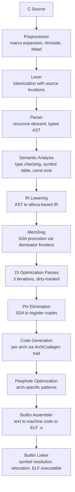
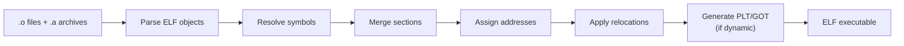
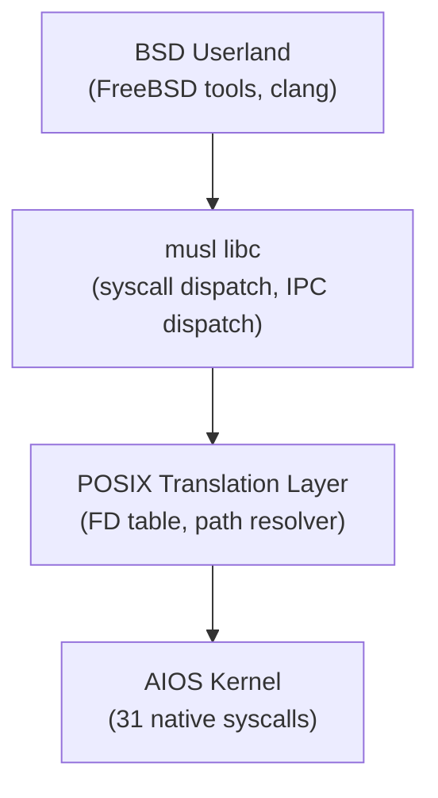
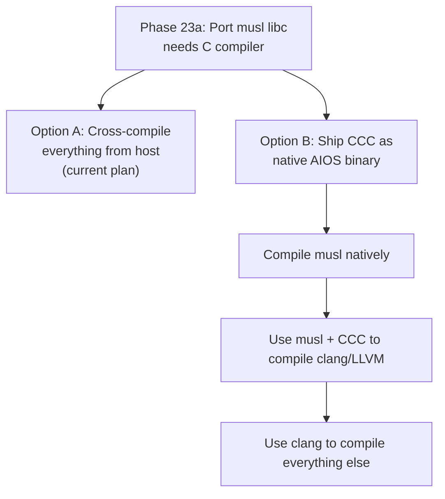
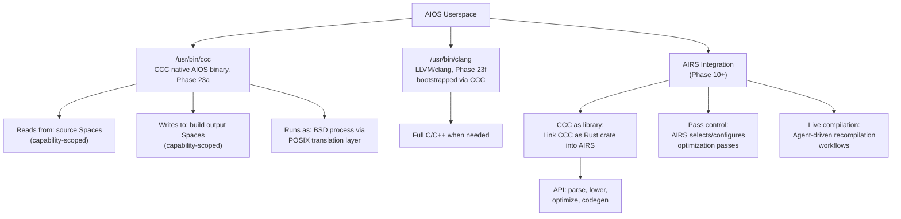
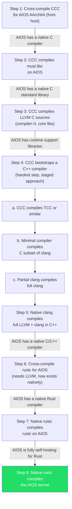

# CCC Integration Analysis: Claude's C Compiler for AIOS

**Status:** Research
**Date:** 2026-03-05
**Repository:** https://github.com/anthropics/claudes-c-compiler
**License:** CC0-1.0 (public domain dedication — no restrictions on integration)
**Size:** ~200,000-250,000 lines of Rust, ~170-200 source files, 8.2 MB source
**Stack thread:** Spawns 64 MB stack thread for deep recursion

---

## 1. What CCC Is

Claude's C Compiler (CCC) is a **complete, dependency-free C compiler** written in Rust by Claude Opus 4.6. It compiles C source code to native ELF executables for four architectures without requiring any external toolchain — no assembler, no linker, no runtime beyond libc.

### Pipeline



### Key Properties

| Property | Value |
|---|---|
| Language | Rust, 2021 edition, stable toolchain |
| External dependencies | **Zero** (no crates beyond std) |
| Target architectures | x86-64, i686, AArch64, RISC-V 64 |
| Output format | ELF executables, shared libraries, object files |
| Debug info | DWARF generation |
| Optimization | 15 SSA passes, peephole per-arch |
| GCC compatibility | Drop-in replacement (flags, `-dumpmachine`, etc.) |

---

## 2. Architecture Deep Dive

### 2.1 Frontend

Four-stage pipeline operating on text → tokens → AST → annotated AST:

**Preprocessor** (`src/frontend/preprocessor/`): Text-to-text transformation. Handles `#include`, `#ifdef`, macro expansion, `#pragma once`, predefined macros, and GCC-style line markers. ~10 source files.

**Lexer** (`src/frontend/lexer/`): Produces `Vec<Token>` with `TokenKind` + `Span` for source location tracking. Eager tokenization gives arbitrary lookahead.

**Parser** (`src/frontend/parser/`): Hand-written recursive descent with operator-precedence climbing for expressions. Handles the full C declarator syntax (inside-out rule). Produces `TranslationUnit` of `ExternalDecl` nodes.

**Semantic Analysis** (`src/frontend/sema/`): Walks AST to produce `SemaResult` containing:
- `FxHashMap<String, FunctionInfo>` — all function signatures
- `TypeContext` — struct/union layouts, typedef resolution
- `ExprTypeMap` — resolved types per expression
- `ConstMap` — compile-time evaluated constants

### 2.2 IR System

**Dual type system:**
- `CType` — C-level types preserving `int` vs `long` distinction for type checking
- `IrType` — Machine-level: `I8..I128`, `U8..U128`, `F32`, `F64`, `F128`, `Ptr`, `Void`

**SSA construction** follows LLVM's alloca-then-promote pattern:
1. Lowerer emits alloca/load/store for every local variable
2. Mem2reg independently promotes to SSA using dominator tree + phi insertion
3. Clean separation of C semantics from SSA bookkeeping

**IR instructions** include: arithmetic, comparisons, loads/stores, GEP, calls, casts, atomics, inline assembly, SIMD intrinsics.

### 2.3 Optimization Passes

15 passes organized in a three-phase pipeline with dirty tracking:

| Pass | File | What It Does |
|---|---|---|
| CFG Simplify | `cfg_simplify.rs` | Branch threading, block merging |
| Copy Propagation | `copy_prop.rs` | Substitute copies at use sites |
| Constant Folding | `constant_fold.rs` | Evaluate constant expressions at compile time |
| Dead Code Elimination | `dce.rs` | Remove unused instructions |
| Global Value Numbering | `gvn.rs` | CSE via hash-based value numbering |
| LICM | `licm.rs` | Hoist loop-invariant code |
| IV Strength Reduction | `iv_strength_reduce.rs` | Replace expensive loop induction ops |
| If-Conversion | `if_convert.rs` | Diamond if → select (cmov) |
| Function Inlining | `inline.rs` | Inline small/single-call functions |
| Algebraic Simplification | `simplify.rs` | `x + 0 → x`, `x * 1 → x`, etc. |
| Division by Constant | `div_by_const.rs` | Replace div with multiply-shift |
| Integer Narrowing | `narrow.rs` | Use narrower types where safe |
| IPCP | `ipcp.rs` | Interprocedural constant propagation |
| Dead Statics | `dead_statics.rs` | Remove unused static functions/globals |
| Resolve ASM | `resolve_asm.rs` | Post-inline assembly symbol resolution |
| Loop Analysis | `loop_analysis.rs` | Natural loop detection (shared utility) |

**Execution order:**
```
Phase 0 (post-inline cleanup):
  inline → mem2reg → constant_fold → copy_prop → simplify →
  constant_fold → copy_prop → resolve_asm

Main loop (up to 3 iterations, dirty-tracked):
  cfg_simplify → copy_prop → div_by_const → narrow → simplify →
  constant_fold → gvn → licm → iv_strength_reduce → if_convert →
  copy_prop → dce → cfg_simplify → ipcp

Final:
  dead_statics → phi_elimination
```

### 2.4 Backend Architecture

**Trait-based abstraction:** `ArchCodegen` trait with ~185 methods. All four architectures implement this single trait. Shared logic lives in default implementations (call ABI, inline asm, f128 soft-float).

**Register allocation:** Linear scan with loop-aware liveness analysis. Separate callee-saved and caller-saved phases. Register-allocated values bypass stack slots entirely.

**Stack layout:** Three-tier allocation with escape analysis for non-escaping allocas, copy coalescing, and liveness-based slot packing.

**Per-architecture structure:**
```
backend/{x86,i686,arm,riscv}/
  codegen/     # ~18 files: alu, atomics, calls, casts, comparison,
               # float_ops, globals, i128, inline_asm, intrinsics,
               # memory, prologue, returns, variadic, peephole
  assembler/   # GAS-syntax parser → instruction encoder → ELF .o writer
  linker/      # Symbol resolution → relocation → ELF executable
```

### 2.5 AArch64 Backend Specifics

Located in `src/backend/arm/`:

| Component | Details |
|---|---|
| ABI | AAPCS64 (LP64) |
| Codegen | 18+ files mirroring the x86 structure |
| Assembler | ARM syntax parser, fixed 32-bit instruction encoding, imm12 auto-shift |
| Linker | Static + dynamic linking, PLT/GOT, IFUNC/IPLT, TLS support |
| Relocations | `ADR_PREL_PG_HI21`, `ADD_ABS_LO12_NC`, `CALL26`, etc. |
| Long double | IEEE binary128 via compiler-rt/libgcc soft-float libcalls |
| NEON | Partial — core 128-bit operations work |
| Peephole | Single-file `peephole.rs` (vs x86's multi-file peephole directory) |

**Tested at scale:** FFmpeg (all 7331 FATE checkasm tests on AArch64), PostgreSQL (237 regression tests), SQLite, Lua, Redis, and 150+ other projects.

### 2.6 Builtin Assembler & Linker

**Assembler pipeline (per arch):**


**Linker pipeline:**



Shared infrastructure in `backend/elf/` (11 files) and `backend/linker_common/` (17 files) handles ELF constants, archive parsing, section ordering, `--gc-sections`, `.eh_frame` processing, and GNU/SysV hash tables.

---

## 3. AIOS Integration Analysis

### 3.1 Current AIOS Toolchain Plan

AIOS Phase 23 (POSIX Compatibility & BSD Userland) plans to use **LLVM/clang** as the C/C++ compiler. The architecture is:



Key constraints:
- **No GPL in kernel or core** → LLVM/clang (Apache-2.0), not GCC
- **Self-hosting goal:** "When AIOS can compile clang with clang on AIOS, the POSIX layer is complete"
- Compiler runs as a **regular BSD process** through the POSIX translation layer
- Capability-scoped access: read source spaces, write build output spaces
- Security: W^X enforcement, PAC (`-mbranch-protection=pac-ret`), BTI (`-mbranch-protection=bti`)

### 3.2 CCC vs LLVM/clang for AIOS

| Dimension | CCC | LLVM/clang |
|---|---|---|
| Language | Rust (single binary) | C++ (~15M LOC) |
| Binary size | ~10-20 MB estimated | ~100+ MB (clang + lld + compiler-rt) |
| Dependencies | Zero | Hundreds of C++ sources, cmake |
| Self-hosting | Already a single Rust binary | Requires bootstrapping C++ compiler first |
| C++ support | None | Full C++20/23 |
| AArch64 maturity | Battle-tested (FFmpeg, PostgreSQL) | Industry standard |
| Optimization quality | 15 passes, good but not LLVM-tier | 100+ passes, decades of tuning |
| NEON/SIMD | Partial (core 128-bit) | Complete |
| Debug info | DWARF | Full DWARF + source-level debugging |
| Shared libraries | Supported (PLT/GOT, TLS) | Full support |
| Build time | Minutes (cargo build) | Hours (cmake + build) |
| Boot dependency chain | Rust toolchain only | C++ compiler + cmake + python + ... |

### 3.3 Where CCC Fits in AIOS

CCC is not a replacement for LLVM/clang — it doesn't do C++. But it fills several roles that LLVM cannot:

#### Role 1: Bootstrap C Compiler (Phase 23a-b)

The LLVM bootstrap problem: to compile clang on AIOS, you need a C++ compiler. To get a C++ compiler, you need... a C++ compiler. CCC breaks this cycle:



CCC compiles musl libc successfully (listed as a verified project). This means AIOS could achieve native C compilation before LLVM is ported.

#### Role 2: Lightweight Development Compiler

For developers building C programs on AIOS, CCC offers:
- **10-50x smaller** than clang+lld+compiler-rt
- **No cmake/python/ninja dependency chain** — single Rust binary
- **Instant availability** — ships with the OS, always present
- **Fast compilation** — no LLVM middle-end overhead for debug builds

Think of it as AIOS's equivalent of Plan 9's compiler suite — a small, fast, native compiler for everyday development, with clang available when you need C++ or maximum optimization.

#### Role 3: AI-Native Compiler Platform

CCC was written by Claude. AIOS's AI Runtime (AIRS, Phase 10+) could leverage this:

- **AI-guided optimization:** AIRS could analyze program behavior and request specific CCC optimization passes, or train new passes. CCC's pass pipeline is simple and modifiable (15 passes in individual .rs files vs LLVM's 100+ interleaved C++ passes).
- **Context-aware compilation:** The AIOS Context Engine (Phase 10+) could feed program intent to CCC — "this is a latency-sensitive loop" → more aggressive LICM and unrolling.
- **Live recompilation:** CCC's small size and fast compilation make it viable for JIT-like workflows where agents recompile code as requirements change.
- **Compiler-as-agent:** An AIOS agent (Phase 14+) wrapping CCC could accept natural language build instructions and map them to compiler flags and optimization strategies.

#### Role 4: Security-Hardened Compilation

AIOS's security model requires:
- **PAC** (Pointer Authentication): `-mbranch-protection=pac-ret`
- **BTI** (Branch Target Identification): `-mbranch-protection=bti`
- **MTE** (Memory Tagging Extension): Phase 18
- **W^X enforcement**: kernel-level, no JIT exceptions

CCC's AArch64 backend would need these features added. But because CCC is Rust, the implementation is memory-safe by construction — the compiler itself can't be exploited via buffer overflows in the way a C++ compiler can. This matters when the compiler runs as a capability-scoped process inside AIOS.

### 3.4 Integration Architecture



**CCC as a Rust library** is particularly interesting. Since CCC is a Rust crate with `src/lib.rs`, AIOS could link it directly into kernel-space or AIRS without spawning a process:

```rust
// Hypothetical AIRS integration
use ccc::frontend::parser::Parser;
use ccc::ir::lowering::Lowerer;
use ccc::passes::run_passes;
use ccc::backend::arm::ArmCodegen;

fn compile_c_fragment(source: &str) -> Vec<u8> {
    let ast = Parser::parse(source);
    let ir = Lowerer::lower(&ast);
    let optimized = run_passes(ir);
    ArmCodegen::generate(optimized)
}
```

### 3.5 What CCC Needs for AIOS

To be fully useful in AIOS, CCC would need:

| Feature | Priority | Effort | Notes |
|---|---|---|---|
| PAC codegen (`-mbranch-protection=pac-ret`) | High | Medium | Add PACIASP/AUTIASP to prologue/epilogue |
| BTI codegen (`-mbranch-protection=bti`) | High | Medium | Add BTI instructions at branch targets |
| Static PIE support | High | Low | For KASLR-style loading |
| NEON completion | Medium | High | Full ARM NEON intrinsic coverage |
| MTE support | Medium | High | Memory tagging instructions in codegen |
| no_std mode | Medium | Medium | Remove libc dependency for kernel-space use |
| Freestanding output | Medium | Low | `-ffreestanding` for OS development |
| Differentiated -O levels | Low | Medium | Currently all levels run same pipeline |
| `_Atomic` type tracking | Low | Medium | Proper atomic type propagation |
| `_Complex` edge cases | Low | Low | Fix remaining complex number bugs |

---

## 4. Concrete AIOS Enhancement Opportunities

### 4.1 AIOS Makes CCC Better

**Capability-based build sandboxing:** AIOS's capability system (Phase 3+) provides something no other OS offers for compilation — the compiler process gets exactly the capabilities it needs and nothing more. CCC running on AIOS would be the most sandboxed compiler in existence:

```
BsdProcessCapabilities {
    read_spaces: [source_space_id],      // can only read source files
    write_spaces: [build_output_space],   // can only write to build dir
    network: None,                        // no network access
    device: None,                         // no device access
    process: ProcessCap::SpawnChildren,   // can fork for parallel compilation
}
```

**AI-optimized pass ordering:** AIOS's AIRS could learn optimal pass orderings per-program-type. CCC's `CCC_DISABLE_PASSES` and `CCC_TIME_PASSES` environment variables already support this workflow — AIRS could:
1. Compile with `CCC_TIME_PASSES=1`
2. Analyze which passes produced changes vs wasted time
3. Generate program-specific pass schedules
4. Feed back into CCC's pass pipeline

**MTE-aware compilation:** When AIOS enables MTE (Phase 18), CCC could generate MTE-tagged memory operations. Since CCC controls the full pipeline (codegen → assembler → linker), it can insert tagging instructions at allocation sites without relying on a separate runtime — a tighter integration than clang+compiler-rt.

### 4.2 CCC Makes AIOS Better

**Faster development cycle:** Developers on AIOS get a C compiler that starts in milliseconds vs clang's multi-second startup. For the edit-compile-run loop on small programs, CCC is significantly faster.

**Smaller OS image:** CCC is a single ~10-20 MB binary vs LLVM's ~100+ MB. For embedded AIOS deployments or minimal images, CCC provides C compilation without the LLVM footprint.

**Self-hosting milestone:** "AIOS can compile C programs natively" is achievable much earlier with CCC than with LLVM. This could be a Phase 23a deliverable rather than waiting for Phase 23f.

**Compiler-as-library for agents:** AIOS agents (Phase 14+) that generate and compile C code can use CCC as a Rust library call, avoiding process spawn overhead. This enables:
- Code generation agents that compile and test in-process
- Live patching workflows where AIRS recompiles individual functions
- Exploratory optimization where AIRS tries multiple optimization strategies in parallel

---

## 5. Risk Assessment

| Risk | Likelihood | Impact | Mitigation |
|---|---|---|---|
| License incompatibility | **None** | — | CC0-1.0 (public domain) — no restrictions whatsoever |
| AArch64 backend bugs in edge cases | Low | Medium | CCC already passes FFmpeg+PostgreSQL on AArch64; fuzz testing |
| Maintenance burden (two compilers) | Medium | Medium | CCC is supplementary, not replacement; clang remains primary |
| Missing security features (PAC/BTI/MTE) | Certain | High | Must be implemented before production use |
| Optimization quality gap vs LLVM | Certain | Low | CCC for dev builds, clang for release builds |
| NEON coverage gaps | Certain | Medium | Incremental improvement; core ops already work |

---

## 6. Recommended Integration Path

### Phase 23a (musl port): Ship CCC as cross-compiled binary
- Cross-compile CCC for AIOS AArch64 from host
- Use CCC to compile musl libc natively on AIOS
- Validates POSIX translation layer with a real workload

### Phase 23f (self-hosting): Bootstrap clang via CCC
- Use CCC + musl to compile LLVM/clang C sources
- Use compiled clang to compile LLVM C++ sources
- Full self-hosting achieved

### Post-Phase 23 (AI integration): CCC as AIRS library
- Link CCC crate into AIRS (available since Phase 10) for in-process compilation
- Implement AI-guided pass ordering
- Add PAC/BTI/MTE codegen to AArch64 backend

### Ongoing: CCC as default development compiler
- Ship in base AIOS image alongside clang
- `CC=ccc` for debug builds, `CC=clang` for release builds
- Maintain as first-party AIOS component

---

## 7. Source Code Statistics

```
src/
├── frontend/           # Preprocessor, lexer, parser, sema
│   ├── preprocessor/   # ~10 files
│   ├── lexer/          # ~2 files
│   ├── parser/         # ~7 files
│   └── sema/           # ~5 files
├── ir/                 # SSA IR, lowering, mem2reg
│   ├── lowering/       # AST → alloca IR
│   └── mem2reg/        # SSA promotion
├── passes/             # 15 optimization passes + loop analysis
│   └── 16 .rs files
├── backend/            # Code generation + assembler + linker
│   ├── (shared)        # ~15 files + elf/ (11) + linker_common/ (17) + stack_layout/ (7)
│   ├── x86/            # codegen (~20) + assembler + linker
│   ├── i686/           # codegen (~18) + assembler + linker
│   ├── arm/            # codegen (~18) + assembler + linker
│   └── riscv/          # codegen (~18) + assembler + linker
├── common/             # Shared types, diagnostics
├── driver/             # CLI, pipeline orchestration
├── main.rs             # Entry point
└── lib.rs              # Library root
```

Actual total: **~170-200 Rust source files**, **~200,000-250,000 lines of Rust** (8.2 MB source).

Cargo.toml declares **zero external crate dependencies** — everything from ELF parsing to instruction encoding is implemented from scratch.

---

## 8. Full Language Support & Self-Hosting Analysis

### 8.1 Can C Be a First-Class AIOS Language via CCC?

**Yes.** CCC can serve as a full-fledged C development environment on AIOS. What that looks like:

| Capability | Status | Notes |
|---|---|---|
| Compile C11 programs | Working | Full C11 minus `_Atomic` tracking, `_Complex` edge cases |
| Link executables | Working | Builtin ELF linker, static + dynamic |
| Shared libraries | Working | `-fPIC`, `-shared`, PLT/GOT |
| Debug info | Working | DWARF generation, `-g` flag |
| Cross-compilation | Working | All four arch targets from single binary |
| Compile real-world C | Working | PostgreSQL, FFmpeg, musl, CPython, Redis, Linux kernel |
| GCC drop-in | Working | Standard flags, `-dumpmachine`, build system integration |
| Optimization | Working | 15 SSA passes, but no tiered `-O` levels yet |
| AIOS security (PAC/BTI) | **Not yet** | Must add to AArch64 prologue/epilogue codegen |
| Full NEON intrinsics | **Partial** | Core 128-bit ops work; full `arm_neon.h` coverage needed |
| `_Atomic` correctness | **Partial** | Parsed but not type-system-tracked |

**The gap is narrow.** CCC already compiles musl libc, which means the POSIX translation layer
can be validated with CCC-compiled C programs at Phase 23a — far earlier than waiting for LLVM.

### 8.2 Does CCC Enable "Rust Compiles Rust on AIOS"?

**Indirectly, yes — CCC is the critical first link in the self-hosting bootstrap chain.**

The fundamental problem: to compile Rust on AIOS, you need `rustc`, which needs LLVM, which is
C++. To compile C++, you need `clang`, which is also C++. Chicken-and-egg.

CCC breaks this cycle. Here is the full bootstrap chain:



**Timeline estimate:**
- Steps 1-2: Phase 23a (musl port)
- Steps 3-5: Phase 23f (self-hosting with clang)
- Steps 6-7: Post-Phase 23 (Rust self-hosting)
- Step 8: Post-Phase 23 (full OS self-hosting)

### 8.3 Alternative: Skip CCC, Cross-Compile Everything

The alternative to CCC bootstrapping is to cross-compile clang, rustc, and all tools from the
host and ship them as pre-built AIOS binaries. This works but:

| Approach | CCC Bootstrap | Cross-Compile Everything |
|---|---|---|
| Native compilation | Phase 23a (early) | Phase 23f (late) |
| Self-hosting proof | Incremental (C first, then C++, then Rust) | All-or-nothing |
| Validates POSIX layer | Real workload at each step | Only validated at the end |
| Binary size shipped | ~20 MB (CCC) | ~500+ MB (clang + rustc + tools) |
| Debug story | Can debug compiler itself on AIOS | Must debug on host, ship fixed binary |
| Intellectual elegance | AI-written compiler bootstraps AI-written OS | Standard cross-compilation |

### 8.4 AArch64 Backend Improvement Priorities

The CCC AArch64 backend has a significant **register allocation weakness**: only 2 caller-saved
registers (`x13, x14`) are available for allocation. The rest are reserved:
- `x9`: address materialization scratch
- `x10-x12`: memcpy implementation
- `x15`: F128 scratch
- `x16-x18`: ABI-reserved (IP0, IP1, PR)

This causes excessive spilling under register pressure. For AIOS, improvements should target:

1. **Expand allocatable registers**: `x9` could be freed when not materializing addresses;
   `x10-x12` could be freed when not in a memcpy context. This alone would 3-4x the caller-saved
   register budget.
2. **PAC codegen**: Add `PACIASP`/`AUTIASP` to function prologue/epilogue — required by AIOS
   security model.
3. **BTI codegen**: Add `BTI` landing pads at all indirect branch targets.
4. **Full NEON**: Complete `arm_neon.h` intrinsic coverage for multimedia and crypto workloads.
5. **MTE integration**: Memory tagging instructions at allocation/deallocation sites for
   Phase 18 hardware use-after-free detection.
