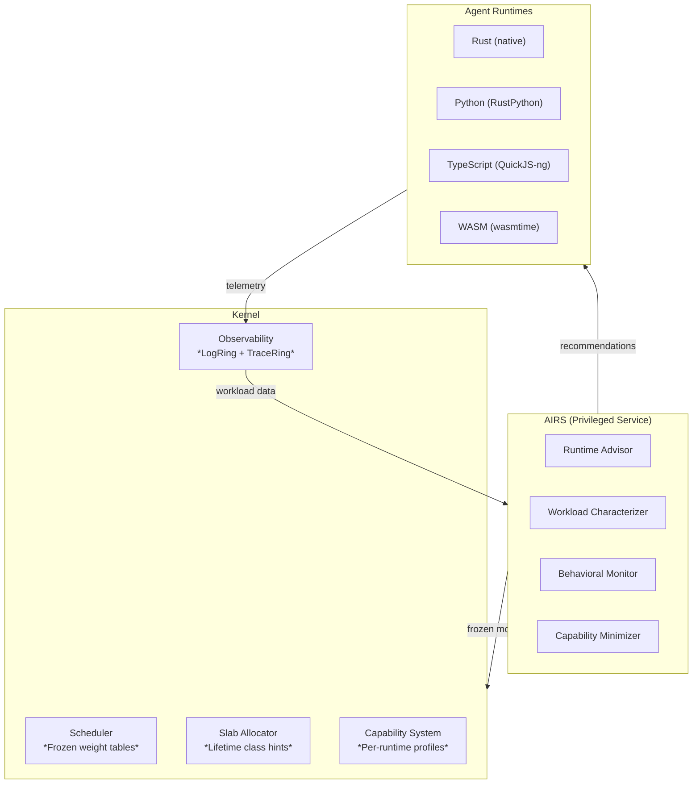
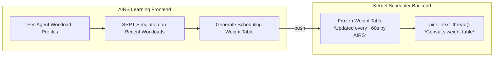

# AIOS Language Ecosystem: AI-Driven Optimization

Part of: [language-ecosystem.md](./language-ecosystem.md) — Language Ecosystem
**Related:** [language-ecosystem-runtimes.md](./language-ecosystem-runtimes.md) — Runtime deep dives, [language-ecosystem-integration.md](./language-ecosystem-integration.md) — Integration & build plan, [language-ecosystem-operations.md](./language-ecosystem-operations.md) — Operations & security

---

## 13. AI-Driven Runtime Optimization

AIOS's AI Runtime Service (AIRS, see [airs.md](../intelligence/airs.md)) has unique visibility
into agent workload patterns across all four runtimes. This section describes how AIRS optimizes
runtime behavior through a combination of kernel-internal frozen models and AIRS-dependent
semantic analysis.



### Two Categories of AI Optimization

| Category | Description | AIRS Required? | Latency |
|---|---|---|---|
| **Kernel-internal ML** | Frozen decision trees/lookup tables pushed by AIRS, executed in kernel | Training: yes. Inference: no. | Microseconds |
| **AIRS-dependent** | Requires semantic understanding, LLM inference, or cross-agent correlation | Yes (always) | Milliseconds to seconds |

The kernel never depends on AIRS for correctness — frozen models provide sensible defaults,
and AIRS periodically updates them based on observed workload patterns.

### 13.1 AIRS Runtime Advisor

**Category:** AIRS-dependent (Phase 12)

When a developer runs `aios agent audit`, AIRS analyzes the agent's manifest and source code
to recommend the optimal runtime:

**Analysis pipeline:**

1. **Static code analysis** — identify compute patterns (numerical loops → Rust/WASM, I/O-bound → Python/TS OK)
2. **Dependency analysis** — check if dependencies require C extensions (→ suggest Rust/WASM instead of Python)
3. **Capability requirements** — match declared capabilities against runtime trust levels
4. **Historical workload data** — if similar agents have been profiled, use performance baselines

**Output example:**

```text
$ aios agent audit my-agent/
Runtime: python (declared)
Recommendation: python (confirmed)
  ✓ I/O-bound workload (87% time waiting on AIRS/Space queries)
  ✓ No C extension dependencies
  ✓ Capabilities within semi-trusted bounds
  ⚠ Function data_transform() is compute-heavy (13% CPU)
    Consider: extract to Rust/WASM module for ~30x speedup
```

This builds on AIRS's existing capability intelligence pipeline (Stage 1: Static Code Analysis,
Stage 3: Behavioral Prediction — see [airs.md](../intelligence/airs.md) §5.9).

### 13.2 Learned Scheduling Weights

**Category:** Kernel-internal ML (inference) / AIRS-dependent (training) — Phase 14

AIOS's scheduler assigns agents to four scheduling classes (RT, Interactive, Normal, Idle)
based on manifest declarations. AIRS can learn **per-agent scheduling weights** from observed
behavior and push updated weights as frozen lookup tables to the kernel.

**Inspired by ALPS (USENIX ATC'24):** ALPS uses a decoupled frontend/backend architecture
where a user-space frontend learns scheduling policies from workload patterns, and an eBPF
backend enforces them in the kernel. ALPS achieved 57.2% reduction in average function
execution duration vs Linux CFS on serverless workloads.

**AIOS adaptation:**



**Examples of learned adjustments:**

- "Agent X is declared Normal but consistently produces interactive-latency work → promote to Interactive"
- "Agent Y's Python interpreter has bursty CPU usage → pre-allocate a 50ms burst budget"
- "Agent Z is idle 95% of the time but critical when active → keep in Normal but with priority boost on wake"

The kernel scheduler always has valid defaults. AIRS-pushed weights are an optimization, not
a requirement. See [scheduler.md](../kernel/scheduler.md) for the base scheduling architecture.

### 13.3 Lifetime-Aware Allocation

**Category:** Kernel-internal ML (inference) / AIRS-dependent (training) — Phase 14

**Inspired by LLAMA (Google, ASPLOS'20, CACM'24 Research Highlight):** LLAMA uses neural networks
trained on symbolized stack traces to predict object lifetime classes. Objects are allocated into
lifetime-segregated pages, reducing fragmentation by up to 78%.

**AIOS adaptation:** Each runtime has characteristic allocation patterns. AIRS trains lifetime
predictors per-runtime and feeds hints to the kernel's slab allocator:

| Lifetime Class | Duration | Typical Allocations | Slab Strategy |
|---|---|---|---|
| Ephemeral | < 10 ms | IPC message buffers, temp strings | Magazine fast path, aggressive reclaim |
| Short | 10 ms - 1 s | Request processing, query results | Standard slab, normal GC |
| Medium | 1 s - 60 s | Cached data, interpreter state | Separate pages, deferred reclaim |
| Long | > 60 s | Agent heap, loaded modules | Dedicated pool, compact on pressure |

The slab allocator's 5 size classes (64, 128, 256, 512, 4096 bytes) are augmented with lifetime
class hints. Allocations from the same lifetime class are co-located on the same pages, improving
compaction and reducing fragmentation.

**Training data:** AIRS collects allocation traces (stack trace + allocation size + observed
lifetime) from running agents. The model maps (runtime_type, allocation_site, call_stack_hash)
→ lifetime_class. A frozen decision tree (~1KB) is pushed to the kernel for each runtime type.

### 13.4 Garbage Collection Scheduling

**Category:** AIRS-dependent (Phase 14)

RustPython uses reference counting with a cycle collector. QuickJS-ng also uses reference
counting with cycle collection. The timing of cycle collection affects both latency (collection
pauses) and memory usage (deferred collection accumulates garbage).

**Inspired by Learned GC (MAPL'20) and iGC (2025):** Reinforcement learning determines both
the timing and aggressiveness of garbage collection based on workload state.

**AIOS adaptation:** AIRS observes per-agent interpreter behavior and learns optimal GC timing:

- "This Python agent creates many cyclic structures during query processing → trigger cycle collection after each query completes, not on a fixed interval"
- "This TypeScript agent's heap stays stable during idle periods → defer GC during idle, collect on next activation"
- "This agent is latency-sensitive → prefer frequent small collections over infrequent large ones"

**Implementation:** AIRS pushes a per-agent GC policy as a simple state machine:

```text
GC Policy for agent-X (Python):
  ON heap_usage > 80%: collect(aggressive=false)
  ON query_complete: collect(aggressive=true, cycles_only=true)
  ON memory_pressure >= Medium: collect(aggressive=true, full=true)
  ON idle > 5s: defer_gc()
```

The interpreter's GC hook checks this policy table (O(1) lookup) before deciding whether to
collect. A sensible default policy runs without AIRS.

### 13.5 Behavioral Anomaly Detection

**Category:** Kernel-internal ML (rate-based) / AIRS-dependent (semantic) — Phase 10

AIRS's BehavioralMonitor (see [airs.md](../intelligence/airs.md) §5.5) maintains per-runtime
behavioral baselines. Each runtime type has fundamentally different "normal" behavior:

| Signal | Python (normal) | TypeScript (normal) | WASM (normal) | Anomaly Indicator |
|---|---|---|---|---|
| Syscall rate | 50-200/s | 100-500/s | 10-50/s | >10x baseline |
| Memory growth | Gradual (interpreter heap) | Stable (small engine) | Bounded (linear memory) | Sudden spike |
| IPC pattern | Burst on query | Event-driven | Batch processing | Unexpected pattern |
| CPU utilization | Low (I/O-bound) | Low (I/O-bound) | Moderate (compute) | Sustained 100% |

**Detection layers:**

1. **Rate-based (kernel-internal):** Simple statistics — if syscall rate exceeds 10x the 24-hour
   rolling average for this runtime type, flag the agent. No AIRS needed.

2. **Sequence-based (AIRS-dependent):** LSTM model over syscall traces — flag sequences never
   seen in training data. Detects sophisticated attacks that stay within rate limits but use
   unusual syscall orderings.

3. **Semantic (AIRS-dependent):** Cross-agent correlation — if Agent A (Python) suddenly starts
   making raw memory operations that should be impossible for an interpreter, flag a potential
   sandbox escape attempt.

Anomalies trigger capability review, rate limiting, or suspension depending on severity.
See [security.md](../security/security.md) §1.2 for trust level enforcement.

### 13.6 Automatic Capability Minimization

**Category:** AIRS-dependent (Phase 10)

**Inspired by MiniScope (2024) and Progent (2025):** Automatically generate minimal permission
sets from task descriptions and code analysis.

When a developer runs `aios agent audit`, AIRS compares the agent's declared capabilities
against what the code actually uses:

```text
$ aios agent audit my-agent/ --capabilities
Declared capabilities:
  ✓ spaces.read     — used in main.py:12, utils.py:45
  ✓ ai.complete     — used in main.py:18
  ✗ network.fetch   — NOT USED in any source file
  ✗ spaces.write    — NOT USED in any source file

Recommendation: Remove unused capabilities [network.fetch, spaces.write]
  This reduces the agent's attack surface by 2 capability classes.
  Auto-fix: aios agent manifest minimize
```

**Analysis pipeline:**

1. **Static analysis** — identify SDK API calls in source code → map to capability requirements
2. **Dynamic analysis** — profile the agent against test workloads → record actual capability usage
3. **LLM reasoning** — for complex control flow, use AIRS inference to determine if a capability
   is reachable but untriggered vs truly dead code
4. **Profile suggestion** — generate a minimal `manifest.toml` capability section

This extends AIRS's Stage 5 (Profile Suggestion) in the capability intelligence pipeline
(see [airs.md](../intelligence/airs.md) §5.9).

---

## 14. Future Directions

### 14.1 Boa as Pure-Rust JavaScript Engine

Boa (github.com/boa-dev/boa) is a pure-Rust JavaScript engine with >90% ECMAScript test262
conformance. Its main limitation is runtime performance (~3-5x slower than QuickJS-ng). As
Boa's performance improves, it becomes the natural replacement for QuickJS-ng — eliminating
the only C dependency in the agent runtime stack and fully aligning with AIOS's Rust-native
philosophy.

**Migration criteria:** Boa replaces QuickJS-ng when:

- Performance reaches within 1.5x of QuickJS-ng on agent-typical workloads
- Memory usage is comparable (< 3 MB base)
- ES2022+ features needed by `@aios/sdk` are fully supported

### 14.2 StarlingMonkey and ComponentizeJS

StarlingMonkey (Bytecode Alliance) embeds SpiderMonkey with WASI 0.2.0 Component Model support.
ComponentizeJS compiles JavaScript to a WASM component via StarlingMonkey. This enables a
"JS-as-WASM-component" path where TypeScript agents are compiled to WASM components at install
time, gaining WASM's sandboxing benefits with SpiderMonkey's performance.

**Relevance:** Phase 21 browser integration (Servo uses SpiderMonkey). Agent TypeScript could
optionally compile to WASM components for stronger isolation.

### 14.3 WIT-Based Agent Manifests

Evolution of `manifest.toml` to use WASM Interface Types (WIT) for agent API contracts. WIT
definitions would replace or complement the current capability declaration format, enabling:

- Auto-generated SDK bindings via `wit-bindgen`
- Type-safe cross-agent contracts
- Compatibility verification at install time (does Agent A's interface match Agent B's imports?)

### 14.4 MSWasm and ARM MTE Integration

MSWasm extends WASM with memory segments that use unforgeable handles (similar to CHERI
capabilities) for memory access. Combined with ARM's Memory Tagging Extension (MTE) —
available on AIOS's aarch64 target — this could provide hardware-backed capability memory
safety for WASM agents.

**Impact:** WASM agents would get hardware-enforced spatial and temporal memory safety beyond
what linear memory provides, catching use-after-free and buffer overflow at the hardware level.

### 14.5 AI-Powered Code Migration

AIRS could identify hot functions in Python/TypeScript agents and suggest migration to
Rust or WASM for performance:

```text
$ aios agent optimize my-agent/
Analysis: Function data_transform() in main.py:45
  CPU time: 80% of agent total
  Pattern: Numerical computation (matrix ops)
  Suggestion: Migrate to Rust module for ~30x speedup

  Generate Rust equivalent? [y/n]
```

Multiple tools exist for AI-powered Python-to-Rust transpilation (py2many, PyCrust), with
demonstrated 60x speedups. This is a natural extension of AIRS's code analysis capabilities
but requires reliable transpilation — currently a research-grade capability.

### 14.6 Cross-Runtime Pipeline Fusion

When Agent A (Python) preprocesses data and sends it via IPC to Agent B (Rust) for inference,
there are two IPC boundary crossings (Python → serialize → IPC → deserialize → Rust). AIRS
could detect common inter-agent patterns and suggest fusion:

- Merge preprocessing into Agent B's input pipeline (eliminate one IPC hop)
- Generate a WASM bridge module that runs both steps in a single sandbox
- Pre-serialize common data formats to avoid repeated encode/decode cycles

This is a genuine research gap — no production OS implements cross-runtime pipeline fusion.

### 14.7 Formal Verification of RuntimeAdapter

Each `RuntimeAdapter` implementation mediates between untrusted agent code and the kernel's
capability system. Formal verification (using tools like Kani or Verus for Rust) of the
adapter's security properties would provide mathematical guarantees that:

- No capability escalation is possible through the adapter
- Memory isolation between interpreter and host is maintained
- Resource limits cannot be bypassed through adapter API misuse

This extends AIOS's broader formal verification goals (see
[static-analysis.md](../security/static-analysis.md)).

---

## References

### Runtime Ecosystem

- [QuickJS-ng](https://github.com/quickjs-ng/quickjs) — Maintained QuickJS fork (v0.9.0, March 2025)
- [Boa JavaScript Engine](https://github.com/boa-dev/boa) — Pure-Rust JS engine (>90% test262)
- [RustPython](https://github.com/RustPython/RustPython) — Pure-Rust Python interpreter
- [wasmtime](https://github.com/bytecodealliance/wasmtime) — Reference WASI runtime (Rust)
- [WAMR](https://github.com/bytecodealliance/wasm-micro-runtime) — WebAssembly Micro Runtime (~50KB)
- [WASI 0.2.0](https://bytecodealliance.org/articles/WASI-0.2) — Component Model foundation (Jan 2024)
- [WASM Component Model](https://component-model.bytecodealliance.org/) — Language-agnostic interop
- [wit-bindgen](https://github.com/bytecodealliance/wit-bindgen) — WIT binding generator
- [uniffi-rs](https://github.com/mozilla/uniffi-rs) — Rust → multi-language binding generator
- [StarlingMonkey](https://github.com/bytecodealliance/StarlingMonkey) — SpiderMonkey + WASI 0.2.0
- [ComponentizeJS](https://github.com/bytecodealliance/ComponentizeJS) — JS → WASM component compiler

### OS Runtime Approaches

- [Fuchsia FIDL](https://fuchsia.dev/fuchsia-src/development/languages/new/structure.md) — Language-agnostic IPC
- [seL4 CAmkES](https://docs.sel4.systems/projects/camkes/) — IDL-based component model
- [Theseus OS + wasmtime](https://www.theseus-os.com/) — WASM as untrusted code sandbox in Rust OS

### AI/ML for Runtime Optimization

- [ALPS](https://www.usenix.org/conference/atc24/presentation/fu) — Adaptive Learning Priority Scheduler (ATC'24)
- [LLAMA](https://cacm.acm.org/research-highlights/combining-machine-learning-and-lifetime-based-resource-management-for-memory-allocation-and-beyond/) — Lifetime-based memory allocation (ASPLOS'20, CACM'24)
- [MLGO](https://research.google/blog/mlgo-a-machine-learning-framework-for-compiler-optimization/) — ML framework for compiler optimization (Google)
- [Learned GC](https://dl.acm.org/doi/10.1145/3394450.3397469) — RL for garbage collection scheduling (MAPL'20)
- [IRIS](https://arxiv.org/abs/2405.17238) — LLM-assisted static analysis for vulnerability detection
- [MiniScope](https://arxiv.org/pdf/2512.11147) — Least privilege for tool-calling agents
- [Progent](https://arxiv.org/html/2504.11703v1) — Programmable privilege control for LLM agents

### Supply Chain Security

- [CISA npm Supply Chain Alert (Sep 2025)](https://www.cisa.gov/news-events/alerts/2025/09/23/widespread-supply-chain-compromise-impacting-npm-ecosystem)
- [CVE-2024-28397](https://github.com/Marven11/CVE-2024-28397-js2py-Sandbox-Escape) — js2py sandbox escape
- [MSWasm](https://cseweb.ucsd.edu/~dstefan/pubs/michael:2023:mswasm.pdf) — Memory-safe WASM extensions
