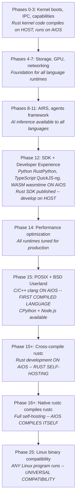

# AIOS Language Ecosystem: Integration & Build Plan

Part of: [language-ecosystem.md](./language-ecosystem.md) — Language Ecosystem
**Related:** [language-ecosystem-runtimes.md](./language-ecosystem-runtimes.md) — Runtime deep dives, [language-ecosystem-operations.md](./language-ecosystem-operations.md) — Operations & security, [language-ecosystem-ai.md](./language-ecosystem-ai.md) — AI-driven optimization

---

## 6. How It All Fits Together

### When Each Language Arrives

| Language | Introduced | Tooling Complete | Self-Hosting on AIOS |
|---|---|---|---|
| Rust | Phase 0 (kernel) | Phase 12 (SDK) | Phase 15+ (needs rustc + LLVM) |
| Python | Phase 12 | Phase 12 | Phase 12 (RustPython ships with OS) |
| TypeScript | Phase 12 | Phase 12 | Phase 12 (QuickJS-ng ships with OS) |
| WASM | Phase 12 (agents) | Phase 12 + 21 (browser) | N/A (compile on host, deploy .wasm) |
| C/C++ | Phase 15 | Phase 15f | Phase 15f (clang builds on AIOS) |
| Linux binaries | Phase 25 | Phase 25 | Whatever runs on Linux |

### The Dependency Chain



### What Each Phase Unlocks for Developers

| Phase | What You Can Do | Where You Do It |
|---|---|---|
| 12 | Write Python/TS/WASM agents for AIOS | On host OR on AIOS |
| 12 | Write Rust agents for AIOS | On host only (cross-compile) |
| 15 | Write C programs on AIOS | On AIOS natively |
| 15 | Use CPython with C extensions on AIOS | On AIOS natively |
| 15+ | Write Rust programs on AIOS | On AIOS natively |
| 16+ | Compile AIOS kernel on AIOS | On AIOS natively |
| 25 | Run any Linux binary on AIOS | On AIOS natively |

### Runtime Comparison

| Dimension | Rust | Python | TypeScript | WASM |
|---|---|---|---|---|
| Runtime | None (native) | RustPython | QuickJS-ng | wasmtime (AOT) |
| Startup | < 1 ms | ~50 ms | < 5 ms | < 1 ms (pre-compiled) |
| Performance | Baseline | 10-50x slower | 10-50x slower | ~1.2-2x slower |
| Memory overhead | None | ~10 MB interpreter | < 1 MB engine | ~5 MB runtime |
| Binary size | ~1-10 MB | ~20 MB (interpreter) | ~700 KB (engine) | ~15 MB (wasmtime) |
| C extension support | Via FFI | No (RustPython) | No | No |
| Trust level | Trusted | Semi-trusted | Semi-trusted | Untrusted OK |
| Available on AIOS | Phase 12 (SDK) | Phase 12 | Phase 12 | Phase 12 |
| Self-hosting on AIOS | Phase 15+ | Phase 12 | Phase 12 | Host-compiled |

---

## 7. What Needs to Be Built

### Per-Language Implementation Work

**Rust SDK (Phase 10-12):**

- [ ] `aios-sdk` crate with `AgentContext` trait
- [ ] `#[agent]` proc macro for entry point generation
- [ ] Syscall wrappers for all 31 AIOS syscalls
- [ ] IPC message builders for Space, Network, AIRS services
- [ ] Hot-reload support (< 2s incremental builds)
- [ ] `aios agent new/dev/test/publish` CLI workflow

**Python Runtime (Phase 12):**

- [ ] Embed RustPython into agent process
- [ ] RustPython embedding bindings for `AgentContext`
- [ ] `aios-sdk` pip package
- [ ] Restricted stdlib implementation (remove dangerous modules)
- [ ] `open()` / `os.path` redirection to Space API
- [ ] Dependency resolution and hash-pinning at install time (no pip at runtime)
- [ ] Async support (`asyncio` event loop integration)

**TypeScript Runtime (Phase 12):**

- [ ] Embed QuickJS-ng into agent process
- [ ] napi-like bridge for `AgentContext`
- [ ] `@aios/sdk` npm package
- [ ] TypeScript → JavaScript transpilation at install time
- [ ] `fetch()` redirection through Network Translation Module
- [ ] Promise/async integration with AIOS IPC

**WASM Runtime (Phase 12):**

- [ ] Integrate wasmtime into agent process
- [ ] WASI-to-AIOS syscall bridge (WASI 0.2.0 baseline)
- [ ] AOT compilation pipeline (install-time .wasm → native)
- [ ] Memory limits and fuel metering
- [ ] WASI Component Model support for capability passing
- [ ] WIT interface definitions for AIOS agent APIs

**C/C++ Toolchain (Phase 15):**

- [ ] musl libc port (syscall dispatch → AIOS IPC)
- [ ] POSIX translation layer (FD table, path resolver, process lifecycle)
- [ ] LLVM/clang cross-compiled for AIOS
- [ ] Self-hosting: clang compiles clang on AIOS

**Rust Self-Hosting (Phase 15+):**

- [ ] Cross-compile rustc + cargo for AIOS aarch64
- [ ] Verify rustc works through POSIX layer
- [ ] Native Rust compilation on AIOS
- [ ] rustc compiles rustc on AIOS (full self-hosting)

---

## 8. Key Architectural Decisions

### Why These Four Languages?

From the architecture docs, the selection criteria were:

1. **Rust** — AIOS is written in Rust. Native performance. Systems programming.
2. **Python** — Largest AI/ML ecosystem. Most agent developers know Python.
3. **TypeScript** — Largest web developer population. Type safety over JavaScript.
4. **WASM** — Language-agnostic sandbox for untrusted code. Future-proof.

These four cover ~90% of the developer population that would build AIOS agents.

### Why Embedded Interpreters Instead of System Runtimes?

The key insight: embedded interpreters (RustPython, QuickJS-ng) are available at **Phase 12**,
while system runtimes (CPython, Node.js) require the POSIX layer at **Phase 15**. By embedding
the interpreters directly into the agent process, AIOS gets multi-language support 3 phases
earlier — before the POSIX layer even exists.

The tradeoff is performance (embedded interpreters are slower) and compatibility (no C extensions,
no Node.js stdlib). For agent workloads that are I/O-bound (waiting on AI inference, space
queries, network requests), this tradeoff is acceptable.

### Why QuickJS-ng Over Boa?

Both QuickJS-ng and Boa are viable JavaScript engines for AIOS. The decision factors:

| Factor | QuickJS-ng (chosen) | Boa (future candidate) |
|---|---|---|
| Performance | Baseline | ~3-5x slower |
| Language | C (minimal deps) | Rust (pure, zero C deps) |
| ECMAScript conformance | ~85% test262 | >90% test262 |
| AIOS alignment | Good (embeds easily) | Excellent (Rust-native) |

QuickJS-ng is chosen for Phase 12 because agent workloads need adequate performance now.
Boa's pure-Rust nature makes it the preferred long-term choice once its performance reaches
parity — eliminating the only C dependency in the agent runtime stack.

### Security Equivalence Across Runtimes

All four runtimes enforce identical capability semantics. The `RuntimeAdapter` trait provides
the abstraction:

```rust
pub trait RuntimeAdapter: Send + Sync {
    /// Initialize the runtime (load interpreter, JIT, etc.)
    fn init(&mut self, manifest: &AgentManifest) -> Result<()>;
    /// Load the agent's code
    fn load(&mut self, code: &[u8]) -> Result<()>;
    /// Create an AgentContext bridge for this runtime
    fn create_context(&self, channels: &ChannelSet) -> Box<dyn AgentContext>;
    /// Start the agent's event loop
    fn run(&mut self, ctx: Box<dyn AgentContext>) -> Result<AgentResult>;
    /// Signal shutdown
    fn shutdown(&mut self, deadline: Timestamp);
    /// Runtime type identifier
    fn runtime_type(&self) -> RuntimeType;
}

// Four implementations:
pub struct NativeRuntime;      // Rust — direct execution
pub struct PythonRuntime;      // RustPython or CPython
pub struct TypeScriptRuntime;  // QuickJS-ng or V8
pub struct WasmRuntime;        // wasmtime — AOT-compiled WASM
```

A Python agent with `[spaces.read, ai.complete]` capabilities can do exactly what a Rust agent
with the same capabilities can do — nothing more, nothing less. The runtime cannot grant
capabilities the manifest doesn't declare.

Each runtime gets a pre-audited capability profile at Layer 10 of the composable capability
system (see [security-capabilities.md](../security/security-capabilities.md) §3.7):
`runtime.native.v1`, `runtime.python.v1`, `runtime.typescript.v1`, `runtime.wasm.v1`.
These profiles grant the minimum capabilities each runtime needs to function (interpreter
memory, temp space, IPC channels) without granting anything beyond what the agent manifest
declares.
