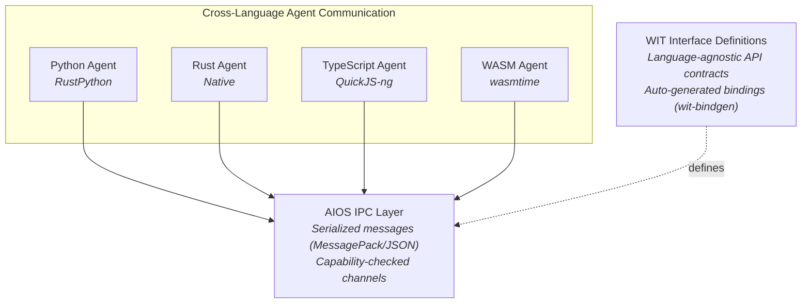
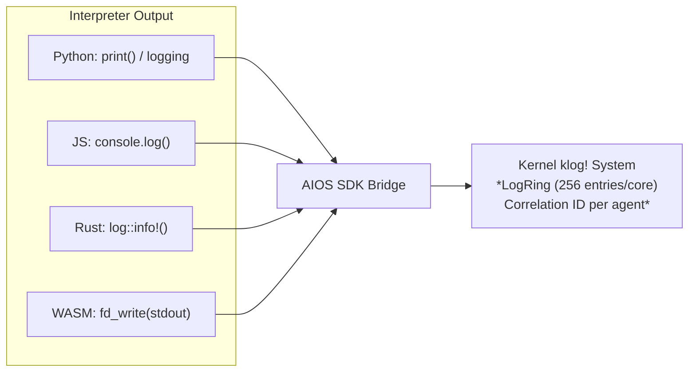
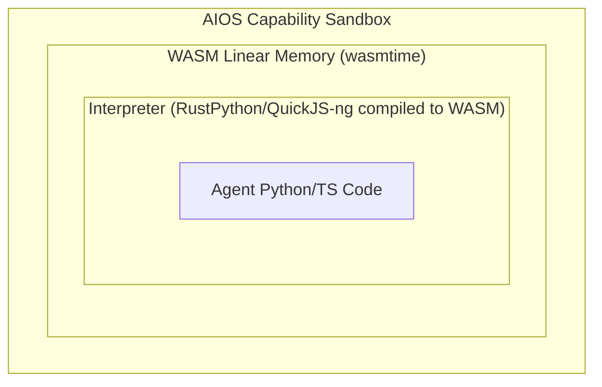

# AIOS Language Ecosystem: Operations & Security

Part of: [language-ecosystem.md](./language-ecosystem.md) — Language Ecosystem
**Related:** [language-ecosystem-runtimes.md](./language-ecosystem-runtimes.md) — Runtime deep dives, [language-ecosystem-integration.md](./language-ecosystem-integration.md) — Integration & build plan, [language-ecosystem-ai.md](./language-ecosystem-ai.md) — AI-driven optimization

---

## 9. Runtime Interoperability

### The Interop Problem

AIOS agents written in different languages need to communicate. A Python data-processing
agent may feed results to a Rust inference agent, which forwards to a TypeScript UI agent.
All cross-agent communication uses IPC (see [ipc.md](../kernel/ipc.md)), but the question
is how data is serialized and how APIs are defined across language boundaries.

### WASM Component Model as the Interop Standard

The WASM Component Model (stable in WASI 0.2.0) provides a language-agnostic interface
definition system through **WIT (WebAssembly Interface Types)**. Components carry a typed
contract specifying what they accept, provide, and need — with a shared-nothing isolation
model where each module is independently sandboxed.



**Why serialize at boundaries, not share memory**: Python and JavaScript have garbage collectors
that track object references. Sharing raw memory between interpreters would require coordinating
GC across runtimes — a source of subtle bugs and security vulnerabilities. AIOS uses explicit
serialization (MessagePack for performance, JSON for debugging) at IPC boundaries. This is the
same approach used by Fuchsia's FIDL and seL4's CAmkES.

### WIT for Agent API Definitions

WIT provides a standard way to define the interfaces that agents expose and consume. The
`wit-bindgen` tool generates language-specific bindings from WIT definitions for Rust, Python,
JavaScript, C, and more.

AIOS agent APIs are defined as WIT interfaces:

```text
// aios-agent.wit — AIOS Agent API contract
package aios:agent@0.1.0;

interface spaces {
    record query-result {
        id: string,
        content: string,
        score: f64,
    }
    query: func(text: string) -> list<query-result>;
    read: func(id: string) -> option<string>;
    write: func(id: string, content: string) -> result<_, string>;
}

interface ai {
    complete: func(prompt: string, context: string) -> string;
    embed: func(text: string) -> list<f64>;
}

world agent {
    import spaces;
    import ai;
    export run: func() -> result<string, string>;
}
```

This allows AIOS to auto-generate SDK bindings for all four languages from a single WIT
definition, ensuring API consistency and reducing per-language maintenance burden.

### SDK Binding Generation

Mozilla's **uniffi-rs** provides an alternative path: define the API once in Rust, auto-generate
bindings for Python, TypeScript, and other languages. This is complementary to WIT — uniffi-rs
generates the client-side SDK bindings, while WIT defines the wire-level IPC contracts.

| Approach | Strength | When to Use |
|---|---|---|
| WIT + wit-bindgen | Language-agnostic, WASM-native | WASM agent interfaces, cross-agent contracts |
| uniffi-rs | Rust-first, generates from implementation | SDK client libraries (`aios-sdk` pip/npm packages) |
| Manual | Full control, no codegen dependency | Critical-path APIs with custom optimizations |

---

## 10. Runtime Observability & Debugging

### Structured Logging Integration

Each runtime redirects its native logging and output through the AIOS SDK to the kernel's
structured logging system (see [observability.md](../kernel/observability.md)):



**Correlation IDs**: Each agent process receives a unique correlation ID at spawn time. All log
entries from that agent carry this ID, enabling end-to-end tracing across agents that communicate
via IPC. The correlation ID propagates through IPC calls — when Agent A calls Agent B, Agent B's
logs include both its own ID and Agent A's call ID.

### Source Map Preservation

TypeScript agents are transpiled to JavaScript at install time. Source maps must be preserved
for meaningful error reporting:

1. TypeScript → JavaScript transpilation generates `.js.map` source maps
2. Source maps are stored alongside the transpiled code in the agent's Space
3. When a JavaScript exception occurs, the QuickJS-ng runtime captures the raw stack trace
4. The SDK translates the stack trace using the source map before logging to klog
5. Developers see TypeScript file names and line numbers, not compiled JavaScript

### Debugging Limitations

Embedded interpreters do not support traditional step-debugging (GDB, lldb) because:

- The interpreter runs inside the agent process sandbox with no POSIX debugger interface
- No ptrace equivalent exists until Phase 15 (POSIX layer)
- No debug wire protocol (Chrome DevTools Protocol, DAP) until Phase 12+ SDK tooling

**Practical debugging workflow (Phase 12):**

1. **On host**: Use standard debuggers (VS Code, PyCharm, Chrome DevTools) against mock AIOS services
2. **On AIOS**: Use structured logging with `aios agent logs --follow` to tail real-time output
3. **Post-mortem**: Crash dumps include interpreter state (Python traceback, JS stack trace)

**Full debugging (Phase 15+):** Once the POSIX layer is available, GDB server support enables
remote debugging of agent processes from the host.

### Profiling

Each runtime provides profiling hooks through the SDK:

| Runtime | Profiling Mechanism | Overhead |
|---|---|---|
| Rust (native) | Kernel `trace_point!` macro, hardware perf counters | < 1% |
| Python | RustPython `sys.settrace()` equivalent (interpreter instrumentation) | ~10-30% |
| TypeScript | QuickJS-ng bytecode-level timing (per-function) | ~5-15% |
| WASM | wasmtime fuel metering (instruction counting) | ~2-5% |

Profiling data feeds into the kernel's TraceRing (4096 entries/core, 32 bytes each) and can
be collected by AIRS for workload analysis (see [AI-driven optimization](./language-ecosystem-ai.md#13-ai-driven-runtime-optimization)).

---

## 11. Supply Chain Security

### Threat Model

Agent manifests declare dependencies (`requirements.txt` for Python, `package.json` for
TypeScript). These dependencies are resolved and installed at agent install time. The
September 2025 npm supply chain attack — where 18 widely-used packages including `chalk`,
`debug`, and `ansi-styles` (2.6 billion weekly downloads combined) were compromised via
maintainer account phishing — demonstrates that **manifest-declared dependencies do not
reveal what is actually running**. AI agents amplify this risk because they inherit
vulnerable dependencies and bypass manual code review.

### Defense Layers

AIOS implements defense-in-depth for runtime dependencies:

**Layer 1 — Install-time verification:**

- All dependencies are resolved, downloaded, and **hash-pinned** at install time
- Package integrity is verified against content hashes (SHA-256), not just version numbers
- No runtime package installation — `pip install` and `npm install` are not available inside agents
- Dependency resolution happens in a sandboxed environment, not the agent's runtime

**Layer 2 — Curated package registry:**

- AIOS maintains a curated registry of approved packages for agent development
- Packages in the registry are audited for security, license compliance, and capability requirements
- Agents can declare dependencies outside the registry, but these require explicit user approval
- Registry packages carry a capability manifest: "this package needs network access" or "this package is pure computation"

**Layer 3 — Runtime behavioral monitoring:**

- The capability system enforces what an agent **can** do regardless of what its dependencies try to do
- If a dependency attempts a syscall the agent's manifest doesn't declare, it fails with `CapabilityDenied`
- AIRS monitors for behavioral anomalies: an agent's actual syscall patterns vs its declared capabilities (see [AI-driven optimization](./language-ecosystem-ai.md#135-behavioral-anomaly-detection) §13.5)

### Per-Runtime Trust Levels

Research shows that different language ecosystems have different vulnerability rates. Python
has consistently higher vulnerability rates (16-18%) vs JavaScript (8-9%) vs TypeScript (2-7%)
in public repositories. AIOS accounts for this with per-runtime default trust levels:

| Runtime | Default Trust | Rationale |
|---|---|---|
| Rust (native) | Trusted | Compiled, reviewed, no interpreter escape |
| WASM | Untrusted OK | Double-sandboxed (linear memory + capabilities) |
| TypeScript | Semi-trusted | QuickJS-ng sandbox + capability enforcement |
| Python | Semi-trusted | RustPython sandbox + capability enforcement; higher ecosystem vulnerability rate |

Trust levels affect default capability restrictions — see
[security-capabilities.md](../security/security-capabilities.md) §3.7 for how
composable capability profiles (Layer 10) encode per-runtime security policies.

### Interpreter-in-WASM Hardening

For maximum isolation of untrusted Python or TypeScript agents, AIOS supports an optional
**interpreter-in-WASM** mode: compile RustPython or QuickJS-ng to WASM, then run the WASM
module inside wasmtime. This creates triple sandboxing:



The performance overhead is significant (~15-100x slower than native interpreter), making this
suitable only for high-risk untrusted agents where security outweighs performance. The
CVE-2024-28397 sandbox escape in js2py (where attackers obtained references to host Python
objects inside the JS interpreter) motivates this defense: even if the interpreter has bugs,
WASM's linear memory prevents host memory access.

---

## 12. Resource Isolation

### Per-Runtime Resource Budgets

Every runtime — not just WASM — operates within resource budgets enforced by the capability
system. This prevents a runaway interpreter from starving other agents or the kernel:

| Resource | Enforcement Mechanism | Default Limits |
|---|---|---|
| CPU | Fuel metering (WASM) / preemptive scheduling (others) | Per-class time slices (see [scheduler.md](../kernel/scheduler.md)) |
| Memory | Heap ceiling per agent | 64 MB (Python/TS), 256 MB (Rust/WASM) |
| IPC rate | Channel rate limiting | 1000 messages/second per channel |
| File I/O | Space quota per agent | Declared in manifest |
| Network | NTM bandwidth allocation | Declared in manifest |

### Memory Pressure Response

When the kernel signals memory pressure (see [memory-reclamation.md](../kernel/memory-reclamation.md) §8),
each runtime responds differently:

| Pressure Level | Rust (native) | Python (RustPython) | TypeScript (QuickJS-ng) | WASM (wasmtime) |
|---|---|---|---|---|
| Low | No action | No action | No action | No action |
| Medium | Shrink unused allocations | Trigger cycle GC | Force GC sweep | Shrink linear memory |
| High | Release cached data | Shrink interpreter heap, evict `site-packages` cache | Compact heap, release JIT caches | Evict AOT code cache |
| Critical | OOM-kill eligible | OOM-kill eligible (background agents first) | OOM-kill eligible (background agents first) | OOM-kill eligible |

The OOM killer prioritizes killing background agents before foreground agents, and interpreted
runtimes (larger memory footprint per unit of work) before native runtimes. AIRS can override
these defaults based on learned workload importance (see
[AI-driven optimization](./language-ecosystem-ai.md#13-ai-driven-runtime-optimization) §13).

### Fuel Metering Beyond WASM

WASM's fuel metering (counting executed instructions) provides fine-grained CPU accounting.
For interpreted runtimes, AIOS implements equivalent accounting:

- **Python**: RustPython's `sys.settrace()` equivalent counts bytecode operations
- **TypeScript**: QuickJS-ng's interrupt callback fires every N opcodes
- **Rust (native)**: Preemptive scheduling via timer tick (see [scheduler.md](../kernel/scheduler.md))

All runtimes report CPU consumption to the kernel's metrics system (see
[observability.md](../kernel/observability.md)), enabling AIRS to detect runaway agents and
adjust scheduling priorities.
