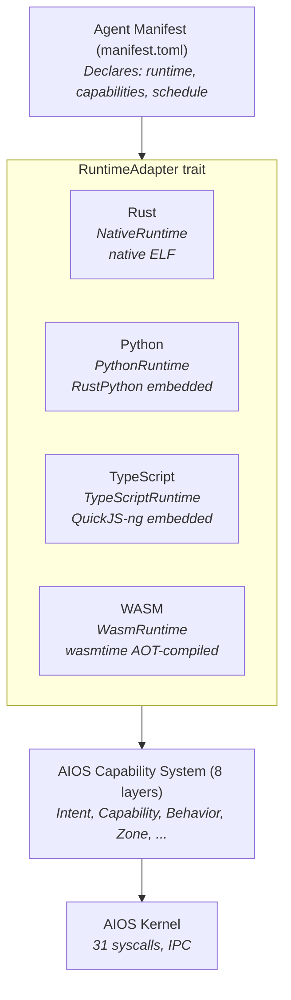

# AIOS Language Ecosystem: Technical Deep Dive

**Parent document:** [architecture.md](./architecture.md), [development-plan.md](./development-plan.md)
**Related:** [agents.md](../applications/agents.md) — Agent SDK and runtime adapters, [posix.md](../platform/posix.md) — C/C++ toolchain and POSIX layer, [browser.md](../applications/browser.md) — Browser Kit (QuickJS/WASM in reference browser)
**Scope:** Rust, Python, TypeScript, WASM — how each runs on AIOS, what's needed, when it arrives

---

## 1. Overview

AIOS supports four first-class development languages through a unified capability model. Every
language runtime enforces the same security boundaries — the language is an implementation detail,
the capability set is the security boundary.

### When Each Language Arrives

| Language | Introduced | Tooling Complete | Self-Hosting on AIOS |
|---|---|---|---|
| Rust | Phase 0 (kernel) | Phase 17 (SDK) | Phase 23+ (needs rustc + LLVM) |
| Python | Phase 17 | Phase 17 | Phase 17 (RustPython ships with OS) |
| TypeScript | Phase 17 | Phase 17 | Phase 17 (QuickJS-ng ships with OS) |
| WASM | Phase 17 (agents) | Phase 17 + 30 (browser) | N/A (compile on host, deploy .wasm) |
| C/C++ | Phase 23 | Phase 23f | Phase 23f (clang builds on AIOS) |
| Linux binaries | Phase 36 | Phase 36 | Whatever runs on Linux |

---

## Document Map

| Document | Sections | Content |
|---|---|---|
| **This file** | §1 | Overview, language arrival timeline, document navigation |
| [runtimes.md](./language-ecosystem/runtimes.md) | §2-§5 | Per-runtime deep dives: Rust (native), Python (RustPython), TypeScript (QuickJS-ng), WASM (wasmtime) |
| [integration.md](./language-ecosystem/integration.md) | §6-§8 | Dependency chain, implementation work list, key architectural decisions, RuntimeAdapter trait |
| [operations.md](./language-ecosystem/operations.md) | §9-§12 | Runtime interoperability (WIT/Component Model), observability & debugging, supply chain security, resource isolation |
| [ai.md](./language-ecosystem/ai.md) | §13-§14 | AI-driven runtime optimization (AIRS Runtime Advisor, learned scheduling, lifetime allocation, GC tuning, anomaly detection), future directions |

---

## Implementation Order

| Phase | Deliverable | Languages Affected |
|---|---|---|
| 13 | Agent framework + Rust SDK | Rust |
| 16 | Multi-language SDK + developer experience | Rust, Python, TypeScript, WASM |
| 21 | Performance optimization + AI-driven tuning | All runtimes |
| 22 | POSIX + BSD userland + C/C++ toolchain | C/C++, CPython, Node.js, Rust (self-hosting) |
| 30 | Browser (Servo + SpiderMonkey) | WASM (browser path), JavaScript |
| 35 | Linux binary compatibility | All Linux-compatible languages |

---

## Cross-Reference Index

| Section | Sub-file | Topic |
|---|---|---|
| §1 | This file | Overview and language timeline |
| §2 | [runtimes](./language-ecosystem/runtimes.md#2-rust--native-performance-zero-overhead) | Rust — native ELF agents |
| §3 | [runtimes](./language-ecosystem/runtimes.md#3-python--rustpython-embedded-interpreter) | Python — RustPython interpreter |
| §4 | [runtimes](./language-ecosystem/runtimes.md#4-typescript--quickjs-ng-embedded-runtime) | TypeScript — QuickJS-ng engine |
| §5 | [runtimes](./language-ecosystem/runtimes.md#5-webassembly--universal-sandbox) | WebAssembly — wasmtime + WAMR alternative |
| §6 | [integration](./language-ecosystem/integration.md#6-how-it-all-fits-together) | Dependency chain and phase timeline |
| §7 | [integration](./language-ecosystem/integration.md#7-what-needs-to-be-built) | Per-language implementation work |
| §8 | [integration](./language-ecosystem/integration.md#8-key-architectural-decisions) | Language selection, embedded vs system runtimes, QuickJS-ng vs Boa |
| §9 | [operations](./language-ecosystem/operations.md#9-runtime-interoperability) | WASM Component Model, WIT, cross-runtime communication |
| §10 | [operations](./language-ecosystem/operations.md#10-runtime-observability--debugging) | Logging integration, source maps, profiling |
| §11 | [operations](./language-ecosystem/operations.md#11-supply-chain-security) | Dependency integrity, curated registry, interpreter-in-WASM |
| §12 | [operations](./language-ecosystem/operations.md#12-resource-isolation) | Per-runtime resource budgets, memory pressure response |
| §13 | [ai](./language-ecosystem/ai.md#13-ai-driven-runtime-optimization) | AIRS Runtime Advisor, learned scheduling (ALPS), lifetime allocation (LLAMA), GC tuning, anomaly detection, capability minimization |
| §14 | [ai](./language-ecosystem/ai.md#14-future-directions) | Boa, StarlingMonkey, WIT manifests, MSWasm, AI code migration, pipeline fusion |
