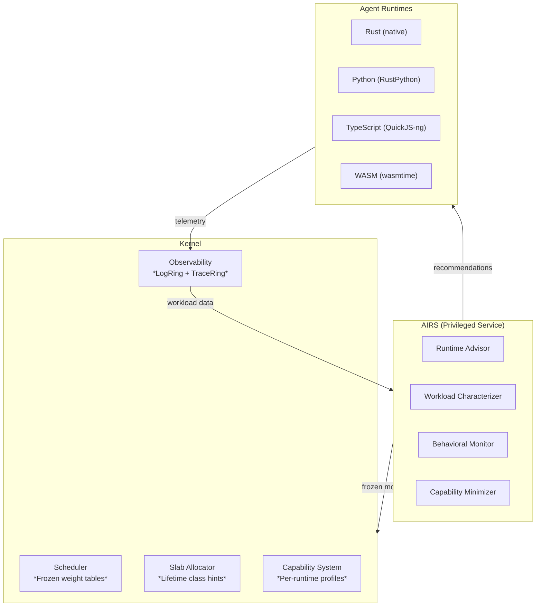

# AIOS Language Ecosystem: AI-Driven Optimization

Part of: [language-ecosystem.md](../language-ecosystem.md) — Language Ecosystem
**Related:** [runtimes.md](./runtimes.md) — Runtime deep dives, [integration.md](./integration.md) — Integration & build plan, [operations.md](./operations.md) — Operations & security

---

## 13. AI-Driven Runtime Optimization

AIOS's AI Runtime Service (AIRS, see [airs.md](../../intelligence/airs.md)) has unique visibility
into agent workload patterns across all four runtimes. This section describes how AIRS optimizes
runtime behavior through a combination of kernel-internal frozen models and AIRS-dependent
semantic analysis.



### Two Categories of AI Optimization

| Category | Description | AIRS Required? | Latency |
|---|---|---|---|
| **Kernel-internal ML** | Frozen decision trees/lookup tables pushed by AIRS, executed in kernel | Training: yes. Inference: no. | Microseconds |
| **AIRS-dependent** | Requires semantic understanding, LLM inference, or cross-agent correlation | Yes (always) | Milliseconds to seconds |

The kernel never depends on AIRS for correctness — frozen models provide sensible defaults,
and AIRS periodically updates them based on observed workload patterns.

> **Full architecture:** The AIRS Runtime Advisor is fully documented in
> [runtime-advisor.md](../../intelligence/runtime-advisor.md) — hub document with four deep
> sub-documents covering Rust trait definitions, `repr(C)` frozen artifact formats, state machines,
> and research-informed designs. The summaries below provide the language-ecosystem perspective.

### 13.1 AIRS Runtime Advisor

**Category:** AIRS-dependent (Phase 17)

When a developer runs `aios agent audit`, AIRS analyzes the agent's manifest and source code
to recommend the optimal runtime — matching compute patterns, dependencies, and capability
requirements against runtime characteristics. This builds on AIRS's capability intelligence
pipeline (see [airs.md](../../intelligence/airs.md) §5.9).

### 13.2 Learned Scheduling Weights

**Category:** Kernel-internal ML (inference) / AIRS-dependent (training) — Phase 22

AIRS learns per-agent scheduling weights from observed workload patterns and pushes frozen
weight tables to the kernel scheduler. Inspired by ALPS (USENIX ATC'24), which achieved 57.2%
latency reduction with a decoupled frontend/backend learned scheduler. The kernel always has
valid defaults; AIRS-pushed weights are an optimization.

Full architecture: [scheduling.md](../../intelligence/runtime-advisor/scheduling.md) — AIRS
learning frontend (§3), kernel scheduler backend (§4).

### 13.3 Lifetime-Aware Allocation

**Category:** Kernel-internal ML (inference) / AIRS-dependent (training) — Phase 22

AIRS trains per-runtime lifetime predictors from allocation traces (stack trace + size + observed
lifetime) and pushes frozen decision trees to the kernel's slab allocator. Inspired by LLAMA
(Google, ASPLOS'20), which reduced fragmentation by 78%. Allocations are classified into four
lifetime classes (Ephemeral/Short/Medium/Long) and co-located on same-lifetime pages.

Full architecture: [allocation.md](../../intelligence/runtime-advisor/allocation.md) — AIRS
lifetime prediction (§5), kernel slab integration (§6).

### 13.4 Garbage Collection Scheduling

**Category:** AIRS-dependent (Phase 22)

AIRS uses reinforcement learning to determine optimal GC timing and aggressiveness for
RustPython and QuickJS-ng cycle collectors. Per-agent GC policies are pushed as state machines
that the interpreter's GC hook consults at O(1) cost. Inspired by Learned GC (MAPL'20) and
iGC (Knowledge-Based Systems 2025).

Full architecture: [gc-scheduling.md](../../intelligence/runtime-advisor/gc-scheduling.md) —
AIRS RL-based policy learning (§7), runtime GC hook integration (§8).

### 13.5 Behavioral Anomaly Detection

**Category:** Kernel-internal ML (rate-based) / AIRS-dependent (semantic) — Phase 14

Three detection layers protect against anomalous agent behavior: rate-based statistics in the
kernel (no AIRS dependency), LSTM sequence models in AIRS for sophisticated attack detection,
and cross-agent semantic correlation for sandbox escape attempts. ML detection is always backed
by hard capability enforcement — adversarial evasion of ML models cannot bypass the capability
system. See [model.md](../../security/model.md) §1.2 for trust level enforcement.

Full architecture: [anomaly-detection.md](../../intelligence/runtime-advisor/anomaly-detection.md)
— detection layers (§9), response pipeline (§10).

### 13.6 Automatic Capability Minimization

**Category:** AIRS-dependent (Phase 14)

AIRS compares an agent's declared capabilities against actual code usage via static analysis,
dynamic profiling, and LLM reasoning to suggest minimal permission sets. Inspired by MiniScope
(2024) and Progent (2025). This extends AIRS's capability intelligence pipeline
(see [airs.md](../../intelligence/airs.md) §5.9).

---

## 14. Future Directions

### 14.1 Boa as Pure-Rust JavaScript Engine

Boa (github.com/boa-dev/boa) is a pure-Rust JavaScript engine with >90% ECMAScript test262
conformance. Its main limitation is runtime performance (~3-5x slower than QuickJS-ng). As
Boa's performance improves, it becomes the natural replacement for QuickJS-ng — eliminating
the only C dependency in the agent runtime stack and fully aligning with AIOS's Rust-native
philosophy.

**Migration criteria:** Boa replaces QuickJS-ng when:

- Performance reaches within 1.5x of QuickJS-ng on agent-typical workloads
- Memory usage is comparable (< 3 MB base)
- ES2022+ features needed by `@aios/sdk` are fully supported

### 14.2 StarlingMonkey and ComponentizeJS

StarlingMonkey (Bytecode Alliance) embeds SpiderMonkey with WASI 0.2.0 Component Model support.
ComponentizeJS compiles JavaScript to a WASM component via StarlingMonkey. This enables a
"JS-as-WASM-component" path where TypeScript agents are compiled to WASM components at install
time, gaining WASM's sandboxing benefits with SpiderMonkey's performance.

**Relevance:** Phase 31 browser integration (Servo uses SpiderMonkey). Agent TypeScript could
optionally compile to WASM components for stronger isolation.

### 14.3 WIT-Based Agent Manifests

Evolution of `manifest.toml` to use WASM Interface Types (WIT) for agent API contracts. WIT
definitions would replace or complement the current capability declaration format, enabling:

- Auto-generated SDK bindings via `wit-bindgen`
- Type-safe cross-agent contracts
- Compatibility verification at install time (does Agent A's interface match Agent B's imports?)

### 14.4 MSWasm and ARM MTE Integration

MSWasm extends WASM with memory segments that use unforgeable handles (similar to CHERI
capabilities) for memory access. Combined with ARM's Memory Tagging Extension (MTE) —
available on AIOS's aarch64 target — this could provide hardware-backed capability memory
safety for WASM agents.

**Impact:** WASM agents would get hardware-enforced spatial and temporal memory safety beyond
what linear memory provides, catching use-after-free and buffer overflow at the hardware level.

### 14.5 AI-Powered Code Migration

AIRS could identify hot functions in Python/TypeScript agents and suggest migration to
Rust or WASM for performance:

```text
$ aios agent optimize my-agent/
Analysis: Function data_transform() in main.py:45
  CPU time: 80% of agent total
  Pattern: Numerical computation (matrix ops)
  Suggestion: Migrate to Rust module for ~30x speedup

  Generate Rust equivalent? [y/n]
```

Multiple tools exist for AI-powered Python-to-Rust transpilation (py2many, PyCrust), with
demonstrated 60x speedups. This is a natural extension of AIRS's code analysis capabilities
but requires reliable transpilation — currently a research-grade capability.

### 14.6 Cross-Runtime Pipeline Fusion

When Agent A (Python) preprocesses data and sends it via IPC to Agent B (Rust) for inference,
there are two IPC boundary crossings (Python → serialize → IPC → deserialize → Rust). AIRS
could detect common inter-agent patterns and suggest fusion:

- Merge preprocessing into Agent B's input pipeline (eliminate one IPC hop)
- Generate a WASM bridge module that runs both steps in a single sandbox
- Pre-serialize common data formats to avoid repeated encode/decode cycles

This is a genuine research gap — no production OS implements cross-runtime pipeline fusion.

### 14.7 Formal Verification of RuntimeAdapter

Each `RuntimeAdapter` implementation mediates between untrusted agent code and the kernel's
capability system. Formal verification (using tools like Kani or Verus for Rust) of the
adapter's security properties would provide mathematical guarantees that:

- No capability escalation is possible through the adapter
- Memory isolation between interpreter and host is maintained
- Resource limits cannot be bypassed through adapter API misuse

This extends AIOS's broader formal verification goals (see
[static-analysis.md](../../security/static-analysis.md)).

---

## References

### Runtime Ecosystem

- [QuickJS-ng](https://github.com/quickjs-ng/quickjs) — Maintained QuickJS fork (v0.9.0, March 2025)
- [Boa JavaScript Engine](https://github.com/boa-dev/boa) — Pure-Rust JS engine (>90% test262)
- [RustPython](https://github.com/RustPython/RustPython) — Pure-Rust Python interpreter
- [wasmtime](https://github.com/bytecodealliance/wasmtime) — Reference WASI runtime (Rust)
- [WAMR](https://github.com/bytecodealliance/wasm-micro-runtime) — WebAssembly Micro Runtime (~50KB)
- [WASI 0.2.0](https://bytecodealliance.org/articles/WASI-0.2) — Component Model foundation (Jan 2024)
- [WASM Component Model](https://component-model.bytecodealliance.org/) — Language-agnostic interop
- [wit-bindgen](https://github.com/bytecodealliance/wit-bindgen) — WIT binding generator
- [uniffi-rs](https://github.com/mozilla/uniffi-rs) — Rust → multi-language binding generator
- [StarlingMonkey](https://github.com/bytecodealliance/StarlingMonkey) — SpiderMonkey + WASI 0.2.0
- [ComponentizeJS](https://github.com/bytecodealliance/ComponentizeJS) — JS → WASM component compiler

### OS Runtime Approaches

- [Fuchsia FIDL](https://fuchsia.dev/fuchsia-src/development/languages/new/structure.md) — Language-agnostic IPC
- [seL4 CAmkES](https://docs.sel4.systems/projects/camkes/) — IDL-based component model
- [Theseus OS + wasmtime](https://www.theseus-os.com/) — WASM as untrusted code sandbox in Rust OS

### AI/ML for Runtime Optimization

- [ALPS](https://www.usenix.org/conference/atc24/presentation/fu) — Adaptive Learning Priority Scheduler (ATC'24)
- [LLAMA](https://cacm.acm.org/research-highlights/combining-machine-learning-and-lifetime-based-resource-management-for-memory-allocation-and-beyond/) — Lifetime-based memory allocation (ASPLOS'20, CACM'24)
- [MLGO](https://research.google/blog/mlgo-a-machine-learning-framework-for-compiler-optimization/) — ML framework for compiler optimization (Google)
- [Learned GC](https://dl.acm.org/doi/10.1145/3394450.3397469) — RL for garbage collection scheduling (MAPL'20)
- [IRIS](https://arxiv.org/abs/2405.17238) — LLM-assisted static analysis for vulnerability detection
- [MiniScope](https://arxiv.org/pdf/2512.11147) — Least privilege for tool-calling agents
- [Progent](https://arxiv.org/html/2504.11703v1) — Programmable privilege control for LLM agents

### Supply Chain Security

- [CISA npm Supply Chain Alert (Sep 2025)](https://www.cisa.gov/news-events/alerts/2025/09/23/widespread-supply-chain-compromise-impacting-npm-ecosystem)
- [CVE-2024-28397](https://github.com/Marven11/CVE-2024-28397-js2py-Sandbox-Escape) — js2py sandbox escape
- [MSWasm](https://cseweb.ucsd.edu/~dstefan/pubs/michael:2023:mswasm.pdf) — Memory-safe WASM extensions
