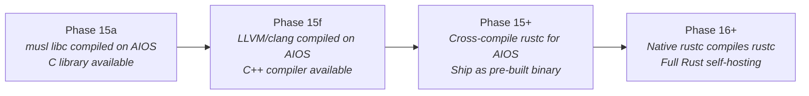
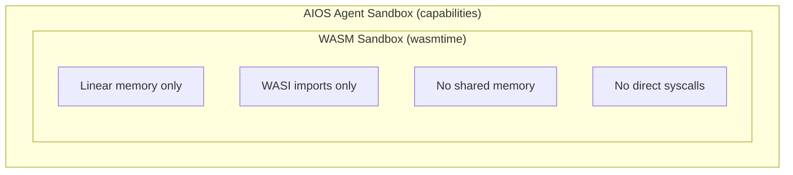

# AIOS Language Ecosystem: Runtime Deep Dives

Part of: [language-ecosystem.md](../language-ecosystem.md) — Language Ecosystem
**Related:** [integration.md](./language-ecosystem/integration.md) — Integration & build plan, [operations.md](./language-ecosystem/operations.md) — Operations & security, [ai.md](./language-ecosystem/ai.md) — AI-driven optimization

---

## 2. Rust — Native Performance, Zero Overhead

### How It Works

Rust agents compile to native aarch64 ELF binaries. The `aios-sdk` crate provides direct
syscall wrappers and IPC message builders. No interpreter, no VM, no runtime overhead.

```rust
use aios_sdk::prelude::*;

#[agent]
async fn my_agent(ctx: AgentContext) -> Result<()> {
    // Direct IPC to Space Service — compiles to syscall instructions
    let results = ctx.spaces().query("project notes").await?;

    // Direct IPC to AIRS — compiles to syscall instructions
    let summary = ctx.ai().complete("Summarize these notes", &results).await?;

    Ok(())
}
```

### What's Needed to Run on AIOS

| Component | Source | Phase |
|---|---|---|
| `aios-sdk` crate | Built with AIOS | Phase 10 |
| `#[agent]` proc macro | Generates entry point + manifest parsing | Phase 10 |
| Rust compiler (cross) | rustc on host, target aarch64-unknown-none | Phase 0+ |
| Rust compiler (native) | rustc running ON AIOS | Phase 15+ |

### Self-Hosting: When Can You Write Rust ON AIOS?

This is the hardest self-hosting problem because `rustc` depends on LLVM (C++):



**The blocker isn't Rust — it's LLVM.** Rust's compiler uses LLVM as its code generation backend.
Until LLVM runs natively on AIOS (Phase 15f), `rustc` can't run natively either. The practical
path: cross-compile `rustc` on the host and ship it as a pre-built AIOS binary, then later
achieve true self-hosting.

### Development Workflow (Phase 12+)

```bash
# On host (Mac/Linux) — primary development path
aios agent new my-agent --lang rust
aios agent dev                    # Hot-reload, < 2s incremental builds
aios agent test                   # Run tests against mock AIOS services
aios agent publish                # Package and deploy to AIOS

# On AIOS (Phase 15f+) — once rustc is available natively
cargo build --release             # Compile directly on AIOS
aios agent install ./target/      # Install from local build
```

---

## 3. Python — RustPython Embedded Interpreter

### How It Works

Python agents run inside an embedded **RustPython** interpreter (pure Rust, no C dependencies).
The interpreter lives inside the agent process sandbox. RustPython's embedding API exposes the
`AgentContext` to Python code.

```python
from aios_sdk import agent, spaces, ai

@agent
async def my_agent(ctx):
    # Same capability-gated API as Rust
    results = await ctx.spaces.query("project notes")
    summary = await ctx.ai.complete("Summarize these notes", results)
    return summary
```

### What's Needed to Run on AIOS

| Component | Source | License | Phase |
|---|---|---|---|
| RustPython interpreter | github.com/RustPython/RustPython | MIT | Phase 12 |
| RustPython embedding API | github.com/RustPython/RustPython | MIT | Phase 12 |
| `aios-sdk` pip package | Built with AIOS | BSD-2-Clause | Phase 12 |
| Agent-local `site-packages/` | Declared in manifest, installed at install time | — | Phase 12 |

### Security: Restricted Standard Library

Python's stdlib is powerful and dangerous. AIOS surgically restricts it:

**Removed entirely** (these bypass the sandbox):

- `subprocess` — arbitrary command execution
- `socket` — raw network access (must use SDK's capability-gated `fetch()`)
- `ctypes`, `cffi` — FFI to native code (escape the sandbox)
- `multiprocessing` — process spawning (must use agent spawning API)

**Redirected through Space API**:

- `open()` → reads/writes through the Space Service, capability-checked
- `os.path`, `os.getcwd` → operates on the agent's space view
- `importlib` → restricted to agent-local packages only

**Unchanged**: `json`, `re`, `datetime`, `collections`, `itertools`, `math`, `hashlib`,
`base64`, `urllib.parse`, `dataclasses`, `typing`, `asyncio` — safe pure-Python modules.

### Why RustPython, Not CPython?

| | RustPython | CPython |
|---|---|---|
| Language | Pure Rust | C |
| Dependencies | Zero C deps | Needs libc, libm, pthreads |
| Sandbox integration | Compiles into agent binary | Requires POSIX layer (Phase 15) |
| Available at | Phase 12 | Phase 15 (needs POSIX) |
| Performance | Slower (~2-10x vs CPython) | Baseline |
| Compatibility | ~95% of pure Python | 100% |
| C extensions | No | Yes |
| JIT support | Experimental (cargo feature `jit`) | No (CPython); PyPy has JIT |
| `no_std` | Not yet achieved (runs in userspace, not kernel) | N/A |

RustPython is available **3 phases earlier** than CPython because it doesn't need the POSIX layer.
For agents (which use the AIOS SDK, not C extensions), this tradeoff is worth it.

After Phase 15, CPython becomes available through the POSIX layer for workloads that need C
extension compatibility (numpy, etc.).

### Self-Hosting: When Can You Write Python ON AIOS?

**Phase 12.** RustPython ships with the OS. You can write and run Python agents directly on AIOS
from Phase 12 onward. No cross-compilation needed — Python is interpreted.

```bash
# On AIOS (Phase 12+)
aios agent new my-agent --lang python
# Edit .py files directly on AIOS
aios agent dev                    # Runs immediately via RustPython
```

This makes Python the **first self-hosting development language** on AIOS (alongside TypeScript),
arriving 3 phases before C/C++ (Phase 15) and ~4 phases before Rust (Phase 16+).

---

## 4. TypeScript — QuickJS-ng Embedded Runtime

### How It Works

TypeScript agents run inside an embedded **QuickJS-ng** JavaScript engine (small, embeddable, C).
QuickJS-ng is the actively maintained successor to the original QuickJS project, which became
unmaintained in 2023. The fork (github.com/quickjs-ng/quickjs) has been adopted by major
ecosystem projects including `rquickjs` (Rust bindings) and AWS `llrt` (Lambda Lite Runtime).

TypeScript is transpiled to JavaScript at install time. A napi-like bridge exposes `AgentContext`.

```typescript
import { agent, AgentContext } from '@aios/sdk';

export default agent(async (ctx: AgentContext) => {
    // Same capability-gated API as Rust and Python
    const results = await ctx.spaces.query("project notes");
    const summary = await ctx.ai.complete("Summarize these notes", results);
    return summary;
});
```

### What's Needed to Run on AIOS

| Component | Source | License | Phase |
|---|---|---|---|
| QuickJS-ng engine | github.com/quickjs-ng/quickjs | MIT | Phase 12 |
| napi-like bridge | Custom, built with AIOS | BSD-2-Clause | Phase 12 |
| `@aios/sdk` npm package | Built with AIOS | BSD-2-Clause | Phase 12 |
| TypeScript transpiler | Bundled (runs at install time) | Apache-2.0 | Phase 12 |

### Security: No Node.js Standard Library

TypeScript agents have **no access to Node.js APIs**. No `fs`, `net`, `child_process`, `http`,
`crypto` (Node's), `os`, `path`, `stream`, `buffer`, `worker_threads`.

All I/O goes through the AIOS SDK:

- `ctx.spaces.query()` instead of `fs.readFile()`
- `ctx.network.fetch()` instead of `http.request()` — capability-gated
- `ctx.ai.complete()` instead of calling an external API

`fetch()` is available but redirected through the Network Translation Module, which enforces
capability gates on which domains the agent can contact.

### Why QuickJS-ng?

| | QuickJS-ng | Boa | V8 |
|---|---|---|---|
| Language | C | Rust (pure) | C++ |
| ECMAScript conformance | ~85% test262 | >90% test262 | ~99% test262 |
| Binary size | ~700 KB | ~2-3 MB | ~30+ MB |
| Startup time | < 5 ms | ~10 ms | ~50-100 ms |
| JIT compilation | No (interpreter only) | No (interpreter only) | Yes |
| Peak performance | Baseline | ~3-5x slower than QJS-ng | ~10-50x faster than QJS-ng |
| Memory usage | < 1 MB base | ~2 MB base | ~10+ MB base |
| Dependencies | Minimal C | Zero (pure Rust) | Large C++ codebase |
| AIOS integration | Embeds easily | Embeds easily (Rust-native) | Requires POSIX layer |
| Maintenance status | Active (v0.9.0, March 2025) | Active | Active |
| Available at | Phase 12 | Phase 12 (alternative) | Phase 15 (via Node.js on POSIX) |

**QuickJS-ng** is chosen over Boa for Phase 12 because of its superior runtime performance
(~3-5x faster) and smaller memory footprint. Boa's pure-Rust nature is compelling for a
Rust-native OS and its ECMAScript conformance is excellent, but the performance gap makes
QuickJS-ng the pragmatic choice for production agent workloads.

**Boa as future alternative**: As Boa's performance improves, it becomes a strong candidate
to replace QuickJS-ng — eliminating the C dependency entirely. See
[Future Directions](./language-ecosystem/ai.md#141-boa-as-pure-rust-javascript-engine) §14.1.

For compute-heavy JavaScript (browser workloads), SpiderMonkey arrives in Phase 21 via Servo.

### Self-Hosting: When Can You Write TypeScript ON AIOS?

**Phase 12.** QuickJS-ng ships with the OS. TypeScript transpilation happens at install time.
You can write and run TypeScript agents directly on AIOS from Phase 12 onward.

---

## 5. WebAssembly — Universal Sandbox

### How It Works

WASM agents run in **wasmtime** (Rust-based WASM runtime). Modules are AOT-compiled to native
aarch64 at install time via Cranelift — no JIT at startup. Only WASI imports are available; no
direct syscall access and no shared memory.

```rust
// Any language that compiles to WASM works
// Rust example:
#[no_mangle]
pub fn agent_main() {
    let query = aios_wasi::spaces_query("project notes");
    let summary = aios_wasi::ai_complete("Summarize", &query);
    aios_wasi::output(summary);
}
```

### What's Needed to Run on AIOS

| Component | Source | License | Phase |
|---|---|---|---|
| wasmtime runtime | github.com/bytecodealliance/wasmtime | Apache-2.0/MIT | Phase 12 |
| WASI-to-AIOS bridge | Custom — maps WASI imports to AIOS IPC | BSD-2-Clause | Phase 12 |
| AOT compiler | wasmtime's Cranelift (compiles .wasm → native at install) | Apache-2.0 | Phase 12 |

### WASI Standards Timeline

| Standard | Status | Key Feature | AIOS Relevance |
|---|---|---|---|
| WASI 0.2.0 | Stable (January 2024) | Component Model foundation | Phase 12 baseline |
| WASI 0.3.0 | Preview (in development) | Async support via Component Model | Agent event loops |
| WASI 1.0 | Expected ~late 2026 | Stable, production-grade | Long-term target |
| WebAssembly 2.0+ | W3C ongoing | GC, tail calls, relaxed SIMD | Performance features |

### Two WASM Paths

**Agent WASM (Phase 12):** WASM modules run in wasmtime inside the agent sandbox. Double-sandboxed:
WASM's linear memory sandbox inside AIOS's capability sandbox.



**Browser WASM (Phase 21):** WASM runs inside SpiderMonkey (via Servo) within Tab Agents.
Web API imports are capability-checked at the OS level — more secure than traditional browser
WASM because enforcement is hardware-backed (MMU), not just browser-logic.

### WASM Runtime Alternatives

wasmtime is the primary runtime. For resource-constrained deployments, WAMR (WebAssembly Micro
Runtime) is a viable alternative:

| Dimension | wasmtime | WAMR |
|---|---|---|
| Binary size | ~15 MB | ~50 KB (AOT-only) — **300x smaller** |
| Min RAM | ~5 MB | 340 KB |
| Language | Rust (pure) | C |
| AOT compiler | Cranelift (high quality) | Built-in (smaller, faster) |
| JIT | Yes (Cranelift) | Optional |
| Component Model | Best support (reference impl) | Partial — catching up |
| WASI 0.2/0.3 | First to implement | Follows wasmtime's lead |
| Production users | Fastly, Fermyon, Shopify | Amazon Prime Video, Xiaomi, Intel |
| License | Apache-2.0/MIT | Apache-2.0 |

**AIOS chooses wasmtime as the default** because:

1. **Pure Rust** — aligns with AIOS's "no C in kernel" principle (agents are userspace, but Rust consistency matters)
2. **Best Component Model support** — critical for cross-language interop via WIT (see [Runtime Interoperability](./language-ecosystem/operations.md#9-runtime-interoperability))
3. **Reference WASI implementation** — first to support new WASI specs

WAMR remains a candidate for future optimization if wasmtime's 15MB footprint becomes a concern
for devices with limited storage. Both are Bytecode Alliance projects, so migration is feasible.

### Why WASM Matters for AIOS

WASM is the **untrusted code** runtime. For agents from unknown authors or third-party plugins:

| Property | WASM | Native (Rust) | Interpreted (Python/TS) |
|---|---|---|---|
| Memory safety | Guaranteed (linear memory) | Developer's responsibility | Runtime-enforced |
| Syscall access | None (WASI only) | Direct | SDK-mediated |
| Language support | Any (Rust, C, Go, Zig, etc.) | Rust only | Python or TS only |
| Performance | Near-native (AOT compiled) | Native | 10-50x slower |
| Trust level | Untrusted OK | Trusted only | Semi-trusted |
| Binary portability | Universal | aarch64 only | Source-portable |

### Self-Hosting: WASM Development on AIOS

WASM modules are compiled on the host and deployed as `.wasm` files. The AOT compilation
(`.wasm` → native aarch64) happens at install time on AIOS via wasmtime's Cranelift backend.

To compile WASM **on** AIOS, you'd need a compiler targeting WASM running natively:

- **Rust → WASM**: Needs `rustc` with `wasm32-wasi` target (Phase 16+)
- **C → WASM**: Needs clang with `wasm32-wasi` target (Phase 15f)
- **AssemblyScript → WASM**: Needs Node.js or QuickJS-ng-compatible tooling (Phase 12+)
