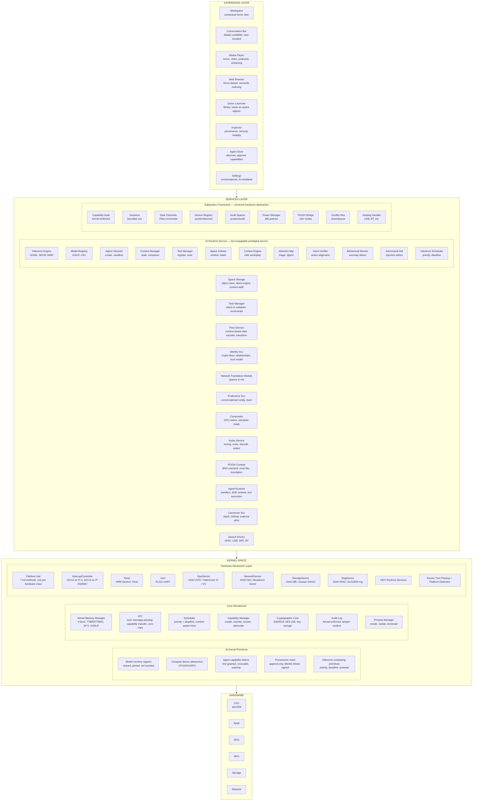
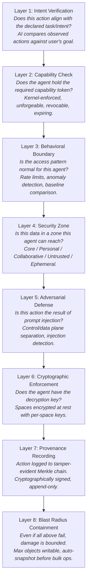
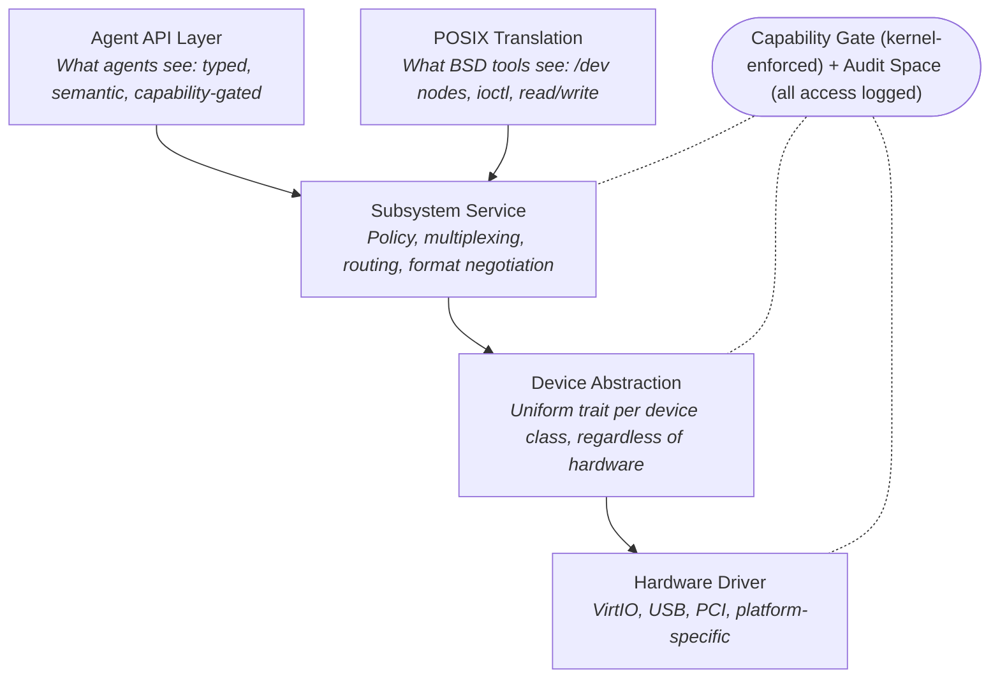
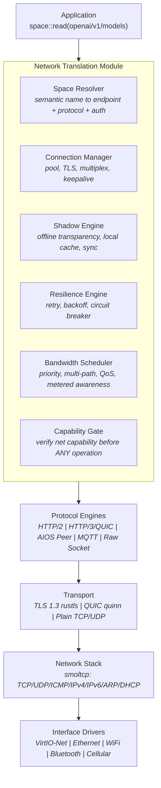

# AIOS: AI-First Operating System — Architecture Overview
## Master Reference Document
**Version:** 2.0
**Target:** aarch64 (ARM64)
**Language:** Rust (kernel + userspace)
**License:** BSD-2-Clause (kernel, tools, SDK)
**Timeline:** 28 phases across ~130 weeks (~2.5 years)
---
## 1. Vision
AIOS is a clean-sheet microkernel operating system written in Rust for aarch64 where every subsystem is designed assuming AI exists. AI is not an application running on the OS — it is the infrastructure that makes every abstraction work better than on any other operating system.
The user never has to interact with AI to use the computer. AI enhances silently — performance, organization, security, search. When the user wants AI help, a conversation bar is always one gesture away. The system works perfectly without AI engagement and becomes extraordinary with it.
### 1.1 Design Principles
1. **AI is infrastructure, not interface.** The user never has to interact with AI to use the computer. AI enhances silently — performance, organization, security, search. When the user wants AI help, the conversation bar is always one gesture away.
2. **No legacy tax.** Every abstraction is designed for 2026, not inherited from 1970. Spaces instead of files. Tasks instead of processes. Flow instead of clipboard. Capabilities instead of permissions.
3. **The computer is one continuous experience.** Work, leisure, communication, creation — these aren't separate app silos. They're activities that share context through spaces, connected by relationships the AI maintains.
4. **Security through depth, not walls.** Eight layers of security, each designed for a world where autonomous agents act on your behalf. No single layer failing compromises the system.
5. **Developers build capabilities, not apps.** The SDK provides context, persistence, inference, security, and tool interop as system services. Developers write the interesting part.
6. **Portable where it matters.** The UI toolkit and developer tools run on Linux, macOS, and AIOS. Developers build on familiar platforms, deploy to AIOS. The OS earns adoption, it doesn't demand it.
7. **BSD-licensed ecosystem.** FreeBSD userland, musl libc, permissive licensing throughout. No GPL copyleft constraints on the OS or its users.
8. **One framework, every subsystem.** All hardware — networking, audio, USB, display, cameras, Bluetooth, printers — implements the same traits: capability gate, sessions, data channels, audit, power management, POSIX bridge. Adding new hardware is formulaic, not architectural.
### 1.2 What Makes AIOS Different From Every Other OS
| Traditional OS Concept | AIOS Concept | Why It's Better |
|---|---|---|
| Files & directories | Spaces & objects with relationships | AI maintains semantic index — find by meaning, not path |
| Processes | Tasks & agents | Users think about goals, not programs |
| Clipboard | Flow (context-aware data transfer) | Data transforms based on destination context |
| Notifications | Attention management (AI-triaged) | AI filters noise, surfaces what matters |
| Config files | Conversational preferences | Say what you want, AI translates to system parameters |
| Package manager | Capability-gated agents | No traditional installation — agents are signed, capability-scoped, and hot-swappable (see architecture.md §6.4) |
| Terminal shell | Conversation bar + POSIX terminal | Natural language primary interface, full terminal still available (architecture.md §2.10) |
| User accounts | Identity & relationships | Cryptographic identity, graduated trust |
| Window manager | Semantic compositor (GPU-native) | AI understands window content, mediates interactions |
| Filesystem permissions | 8-layer security model | Intent verification, behavioral boundaries, adversarial AI defense |
| Sockets & HTTP libraries | Network Translation Module | Apps see spaces, OS handles networking transparently |
| Application-level device APIs | Subsystem Framework | Universal hardware abstraction with capability gates |
---
## 2. System Architecture
### 2.1 Full Stack Overview


### 2.2 Core Abstractions
**Spaces** replace the traditional filesystem. Objects instead of files. Semantic relationships instead of directory trees. Content-addressed storage with AI-maintained indexes.
**Tasks** replace the process model for user-facing work. Users think about goals, not programs. Processes still exist underneath for isolation, but users see tasks.
**Flow** replaces the clipboard. Context-aware data transfer with transformation, history, and provenance tracking.
**Context Engine** replaces explicit modes. Continuously infers user context from signals — active spaces, running agents, input patterns, time of day, media state. Adjusts AI engagement and notification thresholds automatically.
**Attention Management** replaces notifications. AI-triaged, context-aware, never interruptive during leisure unless genuinely urgent.
**Identity & Relationships** replaces user accounts. Cryptographic identity (Ed25519), graduated trust, relationship-aware sharing.
**Preferences** replaces config files. Conversational configuration, AI-mediated, evolves through observed behavior.
**Network Translation Module** replaces application-level networking. Applications see space operations; the OS handles DNS, TLS, connection pooling, retry logic, offline caching, bandwidth scheduling.
**Subsystem Framework** replaces ad-hoc hardware abstraction. Every hardware subsystem (network, audio, USB, display, camera, Bluetooth, GPS, print) implements the same five-layer architecture with capability gates, sessions, data channels, audit, and POSIX bridges.
### 2.3 Data Model
```rust
pub struct Space {
    id: SpaceId,
    name: String,
    parent: Option<SpaceId>,
    security_zone: SecurityZone,
    encryption: EncryptionState,
    quota: SpaceQuota,
    created_at: Timestamp,
    modified_at: Timestamp,
    object_count: u64,
    total_size: u64,
}
pub struct Object {
    id: ObjectId,
    /// Human-readable name (last path component)
    name: String,
    content_hash: Hash,              // content stored separately (content-addressed)
    content_type: ContentType,
    content_size: u64,
    semantic: SemanticMetadata,
    relations: Vec<Relation>,
    created_at: Timestamp,
    modified_at: Timestamp,
    created_by: AgentId,
    modified_by: AgentId,
    provenance: ProvenanceChain,
}

/// Simplified; see spaces.md §3.3 for the canonical ContentType definition.
pub enum ContentType {
    Document, Code, Image, Audio, Video, Data,
    Conversation, Config, Agent, GameSave,
    WebPage, MediaReference, Task, Note,
    CacheEntry, SessionToken, Cookie,
}

pub struct Relation {
    source: ObjectId,
    target: ObjectId,
    kind: RelationKind,
    confidence: f32,
    explanation: Option<String>,
    created_by: RelationSource,
}

pub enum RelationKind {
    DerivedFrom, References, DependsOn,
    RelatedTo, CreatedBy, InputTo,
    OutputOf, ConversationContext,
    VersionOf, SiblingOf,
    ChildOf, Attachment,
}

/// Simplified; see spaces.md §3.4 for the canonical RelationSource definition
/// (Explicit/AiInferred/SystemGenerated).
pub enum RelationSource {
    Ai,               // created by AIRS during indexing
    User,             // created explicitly by user action
    Agent(AgentId),   // created by an agent during operation
}
pub struct SemanticMetadata {
    summary: Option<String>,          // set by creator or AIRS (see spaces.md §3.3)
    tags: Vec<String>,
    auto_tags: Vec<String>,           // AIRS-generated tags
    embedding: Option<Vec<f32>>,      // AIRS-generated embedding
    entities: Vec<Entity>,
    description: Option<String>,
    auto_summary: Option<String>,
    text_content: Option<String>,     // extracted text for indexing
    indexed_at: Option<Timestamp>,
}
pub struct Task {
    id: TaskId,
    intent: Intent,
    state: TaskState,
    agents: Vec<AgentId>,
    capabilities: CapabilitySet,
    activity_log: Vec<ActivityEntry>,
    children: Vec<TaskId>,
    persistence: Persistence,
    context: ContextLink,
}
/// Links a task to its surrounding context (space, identity, context snapshot).
/// Full definition: architecture.md §2.3 (Task & Agent Model).
pub struct ContextLink {
    space_id: SpaceId,
    identity_id: IdentityId,
    snapshot_id: ObjectId,
}
/// Simplified; see agents.md §2.4 for full definition.
pub struct AgentManifest {
    name: String,
    author: Identity,
    requested_capabilities: Vec<CapabilityRequest>,
    code: ContentHash,
    dependencies: Vec<Dependency>,
    ai_analysis: Option<SecurityAnalysis>,
}

/// Set of kernel-managed capability tokens held by a task or agent.
/// Full definition: architecture.md §2.3 (Task & Agent Model).
pub struct CapabilitySet {
    tokens: HashMap<CapabilityType, Vec<CapabilityToken>>,
}

/// Entry in a task's activity log. Records what an agent did and when.
/// Used by Intent Verification (Layer 1). Full definition: architecture.md §2.3.
pub struct ActivityEntry {
    timestamp: Timestamp,
    agent: AgentId,
    action: ActivityAction,
    capability: CapabilityType,
    duration: Option<Duration>,
}

/// Append-only Merkle-linked provenance chain for an object. Aggregates
/// per-version ProvenanceEntry records (spaces.md §5.1) for quick inspection.
/// Full definition: architecture.md §2.3 (Task & Agent Model).
pub struct ProvenanceChain {
    head: Hash,
    length: u64,
    origin: ProvenanceOrigin,
}
```
---
## 3. Security Architecture
### 3.1 Eight-Layer Security Model
Every action by every agent passes through all eight layers. No single layer failing compromises the system.


### 3.2 ARM Hardware Security Integration
| Feature | Purpose | Phase |
|---|---|---|
| PAC (Pointer Authentication) | Sign return addresses, mitigate ROP | Phase 2 (kernel), Phase 13 (enforce) |
| BTI (Branch Target Identification) | Mitigate JOP attacks | Phase 2 (kernel), Phase 13 (enforce) |
| MTE (Memory Tagging Extension) | Hardware use-after-free detection | Phase 13 |
| TrustZone (EL3) | Isolated secure world for key storage | Phase 24 (Secure Boot) |
| TTBR0/TTBR1 separation | User/kernel address space isolation | Phase 2 |
| W^X enforcement | Prevent code injection | Phase 2 |
| KASLR | Randomize kernel base address | Phase 2 |
---
## 4. Subsystem Framework
Every hardware subsystem implements the same five-layer architecture:


All subsystems at a glance:
| Subsystem | Channel Format | Conflict Policy | POSIX Interface | Phase |
|---|---|---|---|---|
| Network | ByteStream | Share (multiplex) | socket API | 7, 16 |
| Audio | Audio samples | Output: Share (mixer), Input: Prompt | /dev/audio* | 22 |
| Display | RenderSurface | Share (compositor) | /dev/fb*, DRM | 5 |
| Input | Events | Share (broadcast to focus) | /dev/input/event* | 7 |
| Camera | Video frames | Prompt user | /dev/video* | 22 |
| Storage | ByteStream | Share (filesystem layer) | /dev/sd*, block | 4 |
| USB | Varies by class | Varies by class | /dev/usb* | 17 |
| Bluetooth | ByteStream/Events | Per-profile | /dev/bluetooth* | 18 |
| Print | Frames (pages) | Queue (FIFO) | /dev/lp*, CUPS | 22 |
| GPS | Events (location) | Share (read-only) | — | 22 |
| Power | Control commands | Exclusive (kernel) | /sys/power/* | 19 |
---
## 5. Network Translation Module
Applications never see the network. There are only space operations — some of which happen to involve remote spaces — and the OS handles everything else.


---
## 6. Browser Architecture
The browser is a constellation of agents, not a monolithic application:
- **Browser Shell Agent** — tab management, URL bar, bookmarks, history (all stored in spaces)
- **Tab Agents** — one per site, each a literal AIOS agent with capabilities derived from URL origin
- **Service Worker Agents** — persistent Tab Agents with constrained capabilities
Same-origin policy becomes kernel-enforced capability isolation. Web APIs bridge to OS subsystem services. Web storage maps to spaces (searchable, syncable, inspectable).
---
## 7. Developer Experience
Developers build six things on AIOS (see architecture.md §4.3 for full details):
| Type | Description | Example |
|---|---|---|
| **Agents** | Autonomous domain-specific programs | Research assistant, file organizer |
| **Tools** | Single-purpose functions agents can call | PDF parser, image classifier |
| **Workflows** | Orchestrate agents for a use case | Sales pipeline, academic research |
| **Connectors** | Bridge external services into spaces | Slack, GitHub, Google Workspace |
| **Space templates** | Pre-structured spaces for common needs | Project management, client onboarding |
| **Experience plugins** | Custom compositor UI components (views, widgets) | Chart widget, domain-specific data visualization |
The SDK provides inference, storage, security, networking, and context as system services. Developers write the domain-specific part.
---
## 8. App Ecosystem Strategy
**Tier 1: BSD Command-Line Tools** — Developers can work immediately via POSIX layer.
**Tier 2: Web Applications** — Through Servo browser, users access Gmail, Slack, YouTube, etc.
**Tier 3: Native AIOS Agents** — Purpose-built, using the SDK.
**Tier 4: Linux Binary Compatibility** — Compatibility layer runs unmodified Linux ELF binaries.
**Tier 5: Wayland Applications** — Existing Linux GUI apps via Wayland/XWayland compatibility.
---
## 9. Hardware Strategy
| Stage | Target | Purpose |
|---|---|---|
| Phase 0-15 | QEMU aarch64 (HVF on macOS) | All development and testing |
| Phase 16-19 | Raspberry Pi 4/5 | First real hardware validation (Tier 5 milestone) |
| Phase 20-23 | QEMU + Raspberry Pi | Rich experience development on both targets |
| Phase 24-27 | VM images (UTM/QEMU) | Low-barrier adoption path |
| Post-MVP | Pine64, Framework Laptop | Open-hardware partners |
| Maturity | Own hardware | Only if platform achieves critical mass |
---
## 10. Phase Plan Overview
### Tier 1: Hardware Foundation — Phases 0–3 (Weeks 1–16)
Boot, memory, IPC. Pure OS fundamentals that don't change regardless of what's built on top.
| Phase | Name | Duration | Deliverable |
|---|---|---|---|
| 0 | Foundation & Tooling | 2 weeks | Project scaffold, CI, `just build && just run` |
| 1 | Boot & First Pixels | 4 weeks | UEFI boot, framebuffer console, timer, exceptions |
| 2 | Memory Management | 4 weeks | Virtual memory, heap, W^X, KASLR |
| 3 | IPC & Capability System | 6 weeks | Process isolation, capabilities, service manager |
### Tier 2: Core System Services — Phases 4–7 (Weeks 17–34)
Storage, GPU, compositor, input, networking. The plumbing everything above depends on.
| Phase | Name | Duration | Deliverable |
|---|---|---|---|
| 4 | Block Storage & Object Store | 5 weeks | Persistent spaces, content-addressing, versioning |
| 5 | GPU & Display | 4 weeks | GPU-accelerated rendering, font rendering |
| 6 | Window Compositor & Shell | 5 weeks | Boot to GUI desktop with window management |
| 7 | Input, Terminal & Basic Networking | 4 weeks | Keyboard/mouse, terminal emulator, TCP/IP |
### Tier 3: AI & Intelligence — Phases 8–11 (Weeks 35–54)
This is where AIOS becomes what no other OS is.
| Phase | Name | Duration | Deliverable |
|---|---|---|---|
| 8 | AIRS Core (Inference Engine) | 5 weeks | Local LLM inference with streaming responses |
| 9 | Space Intelligence & Conversation | 5 weeks | Semantic search, Conversation Bar, conversational config |
| 10 | Agent Framework | 5 weeks | Capability-gated agents with intent verification |
| 11 | Tasks, Flow & Attention | 5 weeks | Task decomposition, smart clipboard, triaged notifications |
### Tier 4: Platform Maturity — Phases 12–15 (Weeks 55–74)
Developer ecosystem, security hardening, performance, POSIX compatibility. Includes 3 weeks buffer for integration testing across phases.
| Phase | Name | Duration | Deliverable |
|---|---|---|---|
| 12 | Developer Experience & SDK | 5 weeks | Multi-language SDK, CLI toolchain, documentation |
| 13 | Security Hardening | 4 weeks | Fuzzing, ARM PAC/BTI/MTE, encrypted spaces |
| 14 | Performance & Optimization | 3 weeks | Boot <3s, 60fps compositor, <500ms inference |
| 15 | POSIX Compatibility & BSD Userland | 5 weeks | FreeBSD tools, musl libc, self-hosting capability |
### Tier 5: Hardware & Connectivity — Phases 16–19 (Weeks 75–92)
Full networking, USB, wireless, power management. Required for real hardware.
| Phase | Name | Duration | Deliverable |
|---|---|---|---|
| 16 | Network Translation Module | 5 weeks | Full NTM: space resolver, shadow engine, protocols |
| 17 | USB Stack & Hotplug | 4 weeks | xHCI, HID, mass storage, device hotplug |
| 18 | WiFi, Bluetooth & Wireless | 5 weeks | WPA2/WPA3, BT audio/HID, firmware loading |
| 19 | Power Management & Thermal | 4 weeks | DVFS, sleep/hibernate, thermal throttling |
### Tier 6: Rich Experience — Phases 20–23 (Weeks 93–112)
Portable UI toolkit, web browser, media, accessibility.
| Phase | Name | Duration | Deliverable |
|---|---|---|---|
| 20 | Portable UI Toolkit | 5 weeks | Cross-platform toolkit (AIOS/Linux/macOS/Web) |
| 21 | Web Browser (Servo) | 5 weeks | Decomposed browser with tab-per-agent isolation |
| 22 | Media, Audio & Camera Subsystems | 5 weeks | Audio mixing, media player, camera subsystem |
| 23 | Accessibility & Internationalization | 5 weeks | Screen reader, keyboard nav, Unicode, i18n |
### Tier 7: Production OS — Phases 24–27 (Weeks 113–130)
Secure boot, Linux compatibility, enterprise features, hardware certification, launch.
| Phase | Name | Duration | Deliverable |
|---|---|---|---|
| 24 | Secure Boot & Update System | 5 weeks | Verified boot chain, A/B updates, rollback |
| 25 | Linux Binary & Wayland Compatibility | 5 weeks | Run unmodified Linux apps and GUI programs |
| 26 | Enterprise & Multi-Device | 4 weeks | MDM, fleet management, cross-device sync |
| 27 | Real Hardware, Certification & Launch | 4 weeks | Pi 4/5, Pine64, VM images, documentation site |
### Timeline Summary
```
Year 1 (Weeks 1-54):    Tiers 1-3 — Functioning AI-first OS on QEMU
Year 2 (Weeks 55-92):   Tiers 4-5 — Developer platform with real hardware support
Year 2.5 (Weeks 93-130): Tiers 6-7 — Production OS ready for daily use
```
---
## 11. Document Index

### Architecture Documents

```
docs/
├── project/
│   ├── overview.md                    ← This document
│   ├── architecture.md               System architecture deep dive
│   └── development-plan.md           Timeline, risks, dependencies
│
├── kernel/
│   ├── boot.md                       Boot sequence and service startup
│   ├── boot-lifecycle.md             Boot lifecycle deep analysis
│   ├── hal.md                        Hardware Abstraction Layer
│   ├── ipc.md                        IPC and syscall interface
│   ├── memory.md                     Memory management
│   └── scheduler.md                  Process scheduler
│
├── intelligence/
│   ├── airs.md                       AI Runtime Service
│   ├── attention.md                  Attention Manager
│   ├── context-engine.md             Context Engine
│   ├── preferences.md                Preference Service
│   └── task-manager.md               Task decomposition and orchestration
│
├── storage/
│   ├── spaces.md                     Space Storage system
│   └── flow.md                       Data flow patterns
│
├── platform/
│   ├── compositor.md                 Compositor and display
│   ├── subsystem-framework.md        Universal hardware abstraction
│   ├── networking.md                 Network Translation Module
│   ├── audio.md                      Audio subsystem
│   ├── posix.md                      POSIX compatibility layer
│   └── power-management.md           Power management and thermal
│
├── experience/
│   ├── experience.md                 GUI experience and surfaces
│   ├── identity.md                   Identity service
│   └── accessibility.md              Accessibility features
│
├── applications/
│   ├── agents.md                     Agent framework
│   ├── browser.md                    Decomposed web browser
│   └── ui-toolkit.md                 Portable UI toolkit
│
├── security/
│   └── security.md                   Security architecture
│
└── phases/                           Implementation milestones per phase
    ├── 00-foundation-and-tooling.md  Phase 0: project scaffold, CI, build
    ├── 01-boot-and-first-pixels.md   Phase 1: boot flow and first pixels
    └── ...                           (28 phases total, created as work begins)
```

### Phase Implementation Documents

Each phase has a single implementation doc in `docs/phases/` with milestone steps, acceptance criteria, and references to architecture docs. Architecture lives in the domain directories above; phase docs define the build sequence. See [development-plan.md](./development-plan.md) §8 for the full list.
---
## 12. Related Architecture Documents
These companion documents provide deep-dive technical specifications:
| Document | Scope |
|---|---|
| [architecture.md](./architecture.md) | Comprehensive system architecture with full data models, code examples, boot sequence, agent sandbox, graceful degradation, performance targets |
| [airs.md](../intelligence/airs.md) | AI Runtime Service — inference engine, model registry, Space Indexer, Context Engine, Attention Manager, intent verification, adversarial defense |
| [spaces.md](../storage/spaces.md) | Space Storage — block engine, content-addressing, version store, encryption, query engine, POSIX compatibility, sync protocol |
| [compositor.md](../platform/compositor.md) | Compositor and Display — render pipeline, semantic hints, layout engine, GPU abstraction, input routing, accessibility, multi-monitor |
| [ipc.md](../kernel/ipc.md) | IPC and Syscall interface — syscall table, channel-based IPC, zero-copy shared memory, capability transfer, service protocols, POSIX translation |
| [subsystem-framework.md](../platform/subsystem-framework.md) | Universal hardware abstraction — traits, types, patterns for every subsystem |
| [networking.md](../platform/networking.md) | Network Translation Module — Space Resolver, Shadow Engine, Resilience Engine, Bandwidth Scheduler, AIOS Peer Protocol |
| [browser.md](../applications/browser.md) | Decomposed web browser — Servo integration, tab-per-agent, Web API bridging, service workers, web storage as spaces |
| [experience.md](../experience/experience.md) | Experience Layer — five surfaces (Workspace, Activity Windows, Conversation Bar, Flow Tray, Status Strip), Space Navigator, Attention Panel, context transitions, design language |
| [development-plan.md](./development-plan.md) | Development plan — timeline, tier milestones, dependency graph, risk register, decision gates, staffing model |
---
## 13. Success Criteria (Full Production OS)
**Core OS:**
- Boots on QEMU and real hardware (Pi 4/5, Pine64) in under 3 seconds
- GUI desktop with window management, taskbar, app switching
- Keyboard, mouse, touchpad, USB peripherals all functional
- WiFi and Bluetooth connectivity
- Power management (sleep, hibernate, thermal throttling)
**Spaces & Storage:**
- Objects persist with full version history and provenance
- Semantic search returns relevant results from natural language
- Content deduplication and integrity verification
- Encrypted spaces for personal security zone
**AI:**
- Local LLM inference with streaming responses
- Conversation Bar for natural language interaction
- AI-generated metadata on all space objects
- Intent verification and behavioral monitoring
**Agents & Ecosystem:**
- Agent Store with capability-gated installation
- Multi-language SDK (Rust, Python, TypeScript)
- Testing harness works without QEMU
- Four demo applications, comprehensive documentation
**Compatibility:**
- BSD userland (FreeBSD tools, musl libc)
- Linux binary compatibility for unmodified ELF binaries
- Wayland compatibility for Linux GUI apps
- Servo-based web browser for web applications
**Security:**
- 8-layer model implemented and tested
- All syscalls fuzzed, ARM PAC/BTI/MTE enabled
- Secure boot chain with A/B updates
- All kernel unsafe blocks documented
**Enterprise:**
- MDM support, fleet management, remote wipe
- Cross-device sync and collaborative spaces
- Compliance reporting and centralized policy
