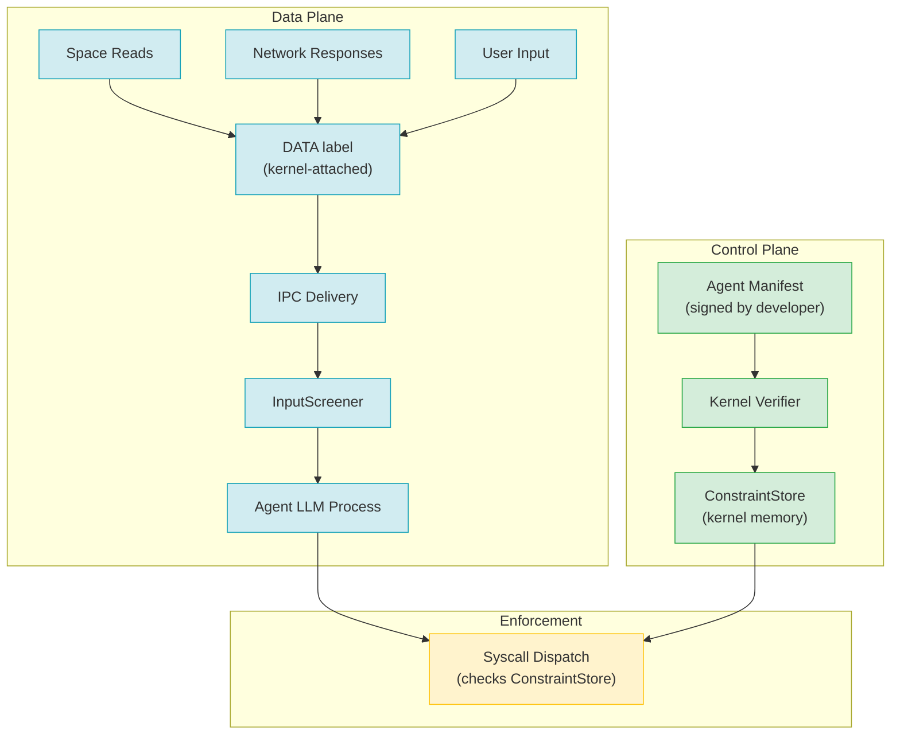
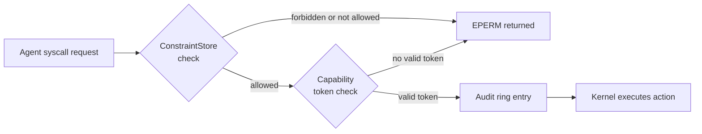

# AIOS Control/Data Plane Separation
Part of: [adversarial-defense.md](../adversarial-defense.md) — Adversarial Defense

**Related:**
[screening.md](./screening.md) |
[../model/layers.md](../model/layers.md) |
[../../intelligence/airs/intelligence-services.md](../../intelligence/airs/intelligence-services.md)

---

## §4 Control/Data Plane Separation

Control/data plane separation is the core architectural mechanism in AIOS adversarial defense. Where other defenses detect or filter, this mechanism enforces a structural invariant: agent instructions are kernel objects, and data is labeled and cannot become instructions at the OS level.

The fundamental insight is that prompt injection is not a bug in any particular model or agent — it is a consequence of architectures that allow untrusted data to arrive in the same channel as trusted instructions. Classifiers and input filters can raise the cost of injection, but they cannot eliminate it as long as instructions and data share the same representation and trust domain. As summarized by recent research consensus: "The only reliable defense against prompt injection is architectural separation of instruction and data planes."

Microsoft's FIDES (2025) information flow control research formalizes similar properties in a system-level context, demonstrating that dynamic taint tracking with provable secrecy and safety properties can be implemented at OS boundaries without requiring changes to the LLM itself. AIOS draws on this work to define its own separation model.

The two planes are:

- **Control plane** — agent instructions that the kernel executes. Sources are the agent manifest (signed by the developer), capability tokens (issued by the kernel), and user constraints (stored in kernel-managed ConstraintStore). The kernel holds the ground truth for what an agent is permitted to do.
- **Data plane** — content that agents process. Sources are Space reads, network responses, and user-typed input. Every message on the data plane carries a `DataLabel` that the kernel attaches at the IPC boundary. Agents receive labeled data; they cannot strip or modify those labels.

The key invariant: these two planes never merge at the OS level. An agent's LLM processes both in its context window, but the kernel enforces constraints based on the control plane regardless of what the LLM decides. Even if the LLM is convinced by injected content to request a forbidden action, the constraint check at syscall dispatch will deny it.



The diagram shows the structural separation: control plane objects flow downward through kernel verification into `ConstraintStore`. Data plane objects flow through the labeling and screening pipeline to the agent. The two streams join only at `SyscallDispatch`, where the kernel uses the control plane (not the data plane) to decide what is permitted.

---

## §4.1 Instruction Sources

AIOS recognizes exactly three trusted instruction sources. Instructions arriving through any other channel — including agent-generated text, network content, and Space objects — are data, not instructions.

**1. Agent manifest (signed by developer, verified by kernel at install time)**

The manifest is the primary declaration of an agent's intended behavior. It is signed with the developer's private key at build time and verified by the kernel's secure boot chain at install time. The manifest declares:

- Actions the agent is allowed to perform
- Actions explicitly forbidden (used for defense in depth — deny patterns take precedence)
- Resource limits (memory, CPU time, network bandwidth, Space access quotas)

Once installed, the manifest's constraints are loaded into the `ConstraintStore` and remain resident in kernel memory for the lifetime of the agent. The agent process cannot read or modify its own manifest constraints.

**2. Capability tokens (issued by kernel, stored in capability table)**

Capability tokens grant access to specific kernel objects: channels, shared memory regions, Space handles, network sockets. Tokens are issued by the kernel at agent launch based on the manifest, or granted at runtime by user action (e.g., "Allow this agent to access the Photos space"). The capability table is in kernel memory. The agent holds handles to tokens, but the actual token objects — and the rights they encode — are not in agent-accessible memory.

**3. User constraints (set via Settings/Conversation Bar, stored in ConstraintStore)**

Users can impose additional runtime constraints on agents: "do not send any data to external servers," "require confirmation before writing to any Space," "only operate on files matching this pattern." These are translated into `UserConstraint` objects and stored in the `ConstraintStore` alongside manifest constraints. User constraints can restrict but cannot expand manifest-granted permissions.

The `ConstraintStore` structures that hold all three instruction sources:

```rust
pub struct ConstraintStore {
    constraints: HashMap<AgentId, AgentConstraints>,
}

pub struct AgentConstraints {
    manifest_constraints: ManifestConstraints,
    capability_constraints: Vec<CapabilityToken>,
    user_constraints: Vec<UserConstraint>,
}

pub struct ManifestConstraints {
    allowed_actions: Vec<ActionPattern>,
    forbidden_actions: Vec<ActionPattern>,
    resource_limits: ResourceLimits,
}
```

These structures live in kernel memory. The agent process cannot read or modify them directly. Every syscall that would execute an action on behalf of the agent passes through a check against this store before the kernel proceeds. If the requested action matches a `forbidden_action` pattern or falls outside the `allowed_actions` set, the syscall returns `EPERM` regardless of what the LLM requested.

---

## §4.2 Data Labeling Protocol

Every piece of data that enters the data plane is labeled at the IPC boundary by the kernel. Labels are not applied by the sender — they are applied by the kernel based on the message's verified origin. An agent cannot forge a label on outbound data, nor can it strip a label from inbound data.

**DataLabel structure**

```rust
pub struct DataLabel {
    origin: DataOrigin,
    trust_level: TrustLevel,
    timestamp: Timestamp,
    taint_chain: Vec<DataOrigin>, // tracks all origins that influenced this data
}

pub enum DataOrigin {
    Space { space_id: SpaceId, object_id: ObjectId },
    Network { endpoint: NetworkEndpoint, protocol: Protocol },
    UserInput { session_id: SessionId },
    AgentOutput { agent_id: AgentId, labels: Vec<DataLabel> },
    Tool { tool_id: ToolId },
}

pub enum TrustLevel {
    Kernel,     // manifest, capabilities — fully trusted
    User,       // explicit user input — trusted but screened
    Agent,      // output from another agent — partially trusted
    External,   // network, web content — untrusted
}
```

**Label assignment at IPC delivery**

When the kernel delivers a message to an agent, it constructs the `DataLabel` from the message's verified source before the message is placed in the agent's receive buffer. The trust level assignment rules are:

- Space read → trust level from the Space's security zone (typically `Agent` or `External` depending on how the object was created)
- Network receive → always `External`
- User keyboard/voice input → `User`
- Message from another agent → `Agent`, with the originating agent's output labels preserved in `taint_chain`

**Taint propagation**

When an agent reads labeled data and writes an output, the output inherits the minimum trust level of all input labels. This is dynamic taint tracking: if an agent processes one `External`-labeled document and one `User`-labeled document and writes a combined output, the output is labeled `External` (the lower trust level). The `taint_chain` records all contributing origins, enabling auditability.

FIDES (Microsoft, 2025) demonstrates that this approach achieves provable secrecy and safety properties — secrecy meaning that `External`-tainted data cannot flow to high-trust outputs without explicit declassification, and safety meaning that `External`-tainted data cannot cause capability-expanding actions. AIOS implements the same properties: a syscall request is evaluated against the agent's `ConstraintStore`, and the `DataLabel` of the data that prompted the request is recorded in the audit trail.

**Taint propagation logic (illustrative)**

```rust
/// Compute the output label for data derived from a set of input labels.
/// The result trust level is the minimum across all inputs.
/// All contributing origins are collected into the taint_chain.
pub fn propagate_taint(inputs: &[DataLabel]) -> DataLabel {
    let min_trust = inputs
        .iter()
        .map(|l| l.trust_level)
        .min()
        .unwrap_or(TrustLevel::External);

    let mut taint_chain = Vec::new();
    for label in inputs {
        taint_chain.push(label.origin.clone());
        taint_chain.extend_from_slice(&label.taint_chain);
    }
    taint_chain.dedup();

    DataLabel {
        origin: DataOrigin::AgentOutput {
            agent_id: current_agent_id(),
            labels: inputs.to_vec(),
        },
        trust_level: min_trust,
        timestamp: current_timestamp(),
        taint_chain,
    }
}
```

The `taint_chain` field is append-only from the agent's perspective. An agent can add its own `AgentOutput` origin to a derived message, but it cannot remove origins from the chain that the kernel recorded on delivery. Attempts to modify the `DataLabel` header of an IPC message are rejected by the kernel; the agent can only write the payload bytes.

---

## §4.3 Enforcement Points

The control/data separation invariant is enforced at five points in the kernel. Each point is a place where the kernel independently verifies that a data-plane event does not cause a control-plane violation.

**1. IPC receive path**

When an IPC message is delivered to an agent, the kernel attaches the `DataLabel` before copying the message into the agent's receive buffer. The agent cannot intercept this step — the label is written by the kernel into the message header, which is mapped read-only in the agent's address space.

**2. Space read path**

When an agent calls the Space Storage syscall to read an object, the kernel attaches the object's origin label to the returned data buffer. The Space tracks the security zone and trust level of each stored object. Objects imported from external sources (web fetches, email attachments, files from other users) carry `External` trust. Objects created by the user directly carry `User` trust.

**3. Network receive path**

The network stack assigns `TrustLevel::External` to all inbound data at the socket boundary. There is no mechanism by which an agent can receive network data without the `External` label — the label assignment happens in the kernel network driver, before data is placed in the socket receive buffer.

**4. Syscall dispatch**

Every syscall that would cause the kernel to act on behalf of an agent — file I/O, network send, IPC to other agents, tool invocations — passes through the constraint check. The kernel:

1. Identifies the requesting agent by its process ID
2. Loads the agent's `AgentConstraints` from `ConstraintStore`
3. Matches the requested action against `forbidden_actions` (deny-first)
4. Matches the requested action against `allowed_actions`
5. Checks that the agent holds a valid capability token for the target object
6. Records the request and result in the audit ring with the `DataLabel` of the data that prompted the request (as reported by the agent in the syscall arguments)

If any check fails, the syscall returns `EPERM`. The agent's LLM has no visibility into why the syscall failed beyond the error code.

**5. Output path**

The `OutputValidator` (see [screening.md](./screening.md)) checks agent outputs before they are delivered to the compositor, sent over the network, or written to a Space. The output's `DataLabel` is available to the validator; outputs with `External`-tainted content destined for high-trust sinks (e.g., writing to a system Space, sending an authenticated email) trigger an additional confirmation flow.



The enforcement is synchronous and inline with each syscall. There is no asynchronous policy evaluation path that could be bypassed by a fast sequence of calls. Each call is independently checked.

---

## §4.4 Label Integrity

The security of the data labeling protocol depends on labels being unforgeable by agents. AIOS achieves this through memory layout and kernel ownership of IPC headers.

**Labels are kernel metadata in IPC message headers**

IPC messages consist of a kernel-managed header and an agent-written payload. The header contains the `DataLabel`, routing information, and sequence numbers. The header region of the shared IPC buffer is mapped read-only in the agent's address space. The agent writes its payload to the payload region; the kernel writes the header fields including the `DataLabel`. An agent attempting to write to the header region receives a data abort (permission fault).

**Labels survive serialization**

When a message is forwarded through multiple IPC hops — agent A sends to agent B, which forwards to agent C — the kernel reconstructs the label on each delivery. Agent B cannot strip A's label from the message before forwarding; the kernel reads A's label from the received message and derives the forwarded label (applying taint propagation) before writing it into B's outbound message header.

**Taint chain is append-only from agent perspective**

An agent can report its own `AgentOutput` origin when making a syscall that produces derived data (e.g., writing a Space object derived from multiple inputs). The kernel records this claim in the new label's taint chain. However, the kernel also independently records the labels of all data that the agent read during its current execution window (tracked via the capability system). If the agent omits origins from its report, the kernel's independent taint record fills in the gaps. The final taint chain in the audit record reflects the kernel's view, not the agent's self-report.

**Label generation is deterministic given kernel state**

Because labels are assigned by the kernel based on verified origin (socket identity, Space object ID, user session ID), labels are reproducible from the audit log. An auditor can reconstruct the data lineage of any output by replaying the audit trail. This property enables post-hoc forensic analysis of adversarial injection attempts even when the attack was not detected in real time.

---

## §4.5 Limitations

Control/data plane separation is the most fundamental defense in AIOS, but it does not make agents immune to adversarial inputs. Understanding the limitations is necessary for correctly reasoning about the threat model.

**The LLM itself processes both planes in its context window**

The OS-level separation prevents injected instructions from directly executing as kernel-level commands. However, the LLM's context window contains both the agent's system prompt (derived from the manifest, translated to natural language) and the data it is processing. At the neural network level, there is no separation between these. A sufficiently adversarial prompt in the data may cause the LLM to generate a request that aligns with the injected instructions — not because the OS allowed it, but because the LLM chose to request it.

This is precisely why Layers 2-8 exist in the security model (see [../model/layers.md](../model/layers.md)). The constraint checks at syscall dispatch enforce limits regardless of what the LLM decides. If injected content causes an LLM to request a forbidden action, the kernel denies it. The LLM-level bypass changes the request pattern the LLM generates — it does not change the kernel's enforcement of constraints. An agent that has been injected into requesting `forbidden_actions` will generate syscalls that return `EPERM`. The injected content succeeds at changing the agent's output, but fails to cause the capability-expanding action the attacker intended.

This residual risk — the LLM behaving unexpectedly in response to injected content, even while the kernel blocks the capability-expanding action — is addressed by the remaining security layers:

- Layer 2 (Capability enforcement) prevents the agent from performing actions outside its granted capabilities
- Layer 3 (Behavioral monitoring) tracks anomalous request patterns over time
- Layer 5 (Adversarial defense — InputScreener, OutputValidator) attempts to detect and filter injected instructions before they reach the LLM, and reviews output for policy violations before delivery
- Layers 4, 6, 7, 8 provide zone isolation, cryptographic enforcement, provenance recording, and blast radius containment

**Side channels**

Control/data separation does not protect against timing-based side channels. An adversarial document may encode information in patterns that cause measurable differences in the agent's response latency, memory allocation behavior, or network traffic patterns. These side channels can leak information about system state even when the kernel blocks all direct data flows from sensitive sources to the adversary's observable outputs.

AIOS does not currently implement systematic side-channel mitigations at the architectural level. Constant-time cryptographic operations (used in the capability system and key management) partially address timing side channels in security-critical paths, but the LLM inference engine itself is not constant-time and is a significant source of timing variation.

**The architectural paradigm**

The broader context is important: prompt injection continues to be ranked #1 in the OWASP LLM Top 10 because it is not merely a bug, but a consequence of the dominant architectural paradigm itself — systems that deliver untrusted data in the same channel as trusted instructions, relying on the model to distinguish them. AIOS's OS-level separation is an improvement over that paradigm, but it does not change the fact that a language model processes text from both planes. The defense shifts the failure mode: instead of an injection causing direct capability expansion, it causes a denied syscall. The LLM's behavior may still be influenced; only the kernel action is blocked.

This is a defensible security posture for a deployed system, but it is not a proof of safety against all adversarial inputs. The combination of architectural separation (§4), input screening (§5, [screening.md](./screening.md)), behavioral monitoring (Layer 3), and audit (§9) provides defense in depth — no single layer is sufficient, and each layer addresses failure modes that the others cannot.
