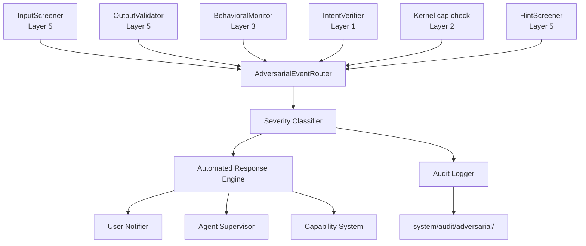
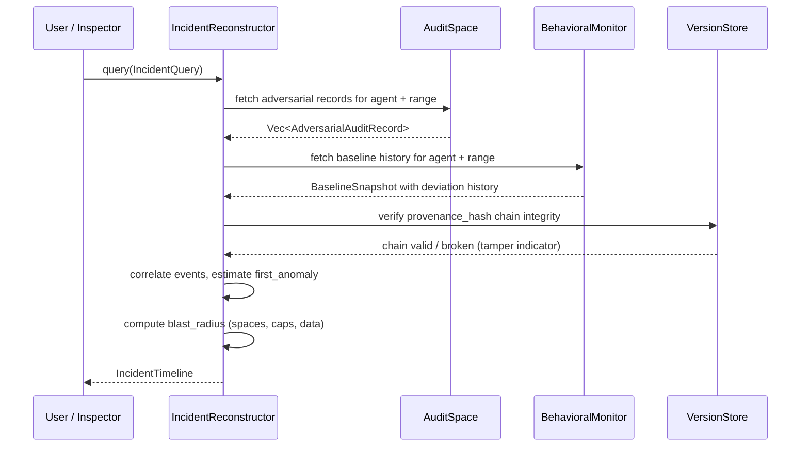

# AIOS Adversarial Detection and Response

Part of: [adversarial-defense.md](../adversarial-defense.md) — Adversarial Defense

Related:
[screening.md](./screening.md) |
[../model/operations.md](../model/operations.md) |
[../../intelligence/airs/intelligence-services.md](../../intelligence/airs/intelligence-services.md)

---

## §8 Detection and Response

This section describes how adversarial events are detected, classified, escalated, and
responded to within AIOS. It expands on the security event summary in `operations.md §6`
with detail specific to the adversarial defense pipeline: the detection sources that feed
it, how events are classified by severity, the automated response actions taken at each
severity level, and how the user is kept informed.

### §8.1 Detection Sources

Six components feed the adversarial event pipeline. Each monitors a distinct attack surface
and operates independently so that a compromised or bypassed component cannot silence the
others.

| Source | Detects | Layer | AIRS Required? |
|---|---|---|---|
| InputScreener | Injection patterns, structural anomalies | 5 | Tier 1: No, Tier 2: Yes |
| OutputValidator | Exfiltration, schema violations | 5 | No |
| BehavioralMonitor | Action pattern anomalies (z > 3σ) | 3 | Fallback: static rules |
| IntentVerifier | Intent-action misalignment | 1 | Yes |
| Kernel capability check | Unauthorized syscalls (EPERM) | 2 | No |
| HintScreener | Hint abuse, probing patterns | 5 | No |

All six sources emit `AdversarialEvent` records into a central router. The router
deduplicates correlated events (e.g., an injection attempt that simultaneously triggers
InputScreener and BehavioralMonitor), assigns a canonical severity, and dispatches the
event to the response and audit subsystems.



**InputScreener** operates at two tiers. Tier 1 uses deterministic pattern matching
(structural injection fingerprints, known prompt injection signatures) and runs with no
AIRS dependency. Tier 2 applies a kernel-internal ML classifier for semantic anomaly
detection; if AIRS is unavailable it degrades to Tier 1 only.

**OutputValidator** inspects agent outputs before they reach the Flow subsystem or any
external channel. It checks schema conformance, detects potential exfiltration payloads
(large binary blobs, credential-shaped strings), and flags outputs that contain content
inconsistent with the agent's declared intent. No AIRS dependency: all checks are
deterministic or use lightweight kernel-internal models.

**BehavioralMonitor** maintains per-agent statistical baselines (request rate, capability
invocation frequency, data volume, action distribution). An event is emitted when any
metric exceeds three standard deviations from the baseline. When AIRS is unavailable the
monitor falls back to static rate-limit thresholds rather than statistical baselines.

**IntentVerifier** compares the semantic intent declared at conversation start with the
actions an agent is actually attempting. Significant intent-action divergence — especially
for destructive or exfiltrating actions — produces a High or Critical event. Requires AIRS
for semantic comparison; without it the verifier cannot operate and logs a degraded-mode
warning.

**Kernel capability check** is the lowest-layer source: any `EPERM` returned to an agent
attempting an unauthorized syscall is forwarded to the router as a Low or Medium event,
depending on the capability type attempted.

**HintScreener** monitors agent-to-agent hint traffic for patterns that suggest one agent
is attempting to manipulate another (probing for allowed actions, injecting fabricated
context, or amplifying permissions).

### §8.2 Severity Classification

Each event is assigned one of four severity levels. The severity determines which automated
response is taken and how the user is notified.

```rust
pub enum AdversarialSeverity {
    /// Successful exfiltration, chain integrity violation, or agent state compromise.
    Critical,
    /// Injection detected and blocked, intent mismatch on a destructive action,
    /// or repeated High events within a short window.
    High,
    /// Suspicious pattern flagged, rate limit reached, or behavioral anomaly detected.
    Medium,
    /// Probing attempt, hint abuse, minor pattern match, single unauthorized cap check.
    Low,
}

pub struct AdversarialEvent {
    id: EventId,
    timestamp: Timestamp,
    agent_id: AgentId,
    severity: AdversarialSeverity,
    source: DetectionSource,
    details: EventDetails,
    quarantined_content: Option<QuarantinedContent>,
    response_taken: ResponseAction,
}
```

The mapping from specific events to severity levels:

| Event | Severity | Notes |
|---|---|---|
| Confirmed data exfiltration to external channel | Critical | OutputValidator + cap audit confirm data left |
| Space Merkle chain integrity failure | Critical | Detected by Version Store on read |
| Prompt injection blocked (destructive action target) | High | InputScreener Tier 1 or 2 match |
| Intent-action mismatch on write/delete/send | High | IntentVerifier with AIRS |
| Three or more Medium events within 5 minutes | High | Escalation by router |
| Behavioral anomaly z > 3σ (first occurrence) | Medium | BehavioralMonitor baseline |
| Rate limit threshold reached | Medium | Any source |
| Suspicious pattern match (non-destructive target) | Medium | InputScreener Tier 1 |
| Unauthorized capability check (EPERM) | Low–Medium | Medium if sensitive cap type |
| Hint abuse or probing pattern | Low | HintScreener |
| Minor structural anomaly, no action taken | Low | InputScreener Tier 1 |

Severity can escalate: a sustained pattern of Low events for the same agent within a
rolling window promotes to Medium; sustained Medium events promote to High.

### §8.3 Automated Response

The response engine selects an action based on event severity and applies it before
returning control to any other subsystem. Responses are layered: a Critical event triggers
all applicable actions for every lower severity as well.

| Severity | Immediate Action | Agent Impact | User Involvement |
|---|---|---|---|
| Critical | Terminate agent, lock affected spaces, revoke all capabilities | Agent killed | Immediate interrupt notification |
| High | Block action, pause agent, quarantine input | Agent paused pending review | Next-break notification with context |
| Medium | Apply rate limit, continue monitoring | Agent throttled | Batched security digest |
| Low | Log only | None | Inspector dashboard only |

```rust
pub enum ResponseAction {
    LogOnly,
    RateLimit { factor: f32, duration: Duration },
    BlockAction { action: ActionType },
    PauseAgent { notify_user: bool },
    QuarantineInput { content_id: ContentId },
    RevokeCapability { token_id: TokenId },
    TerminateAgent { reason: String },
    LockSpace { space_id: SpaceId },
}
```

Multiple `ResponseAction` values can be combined for a single event. A Critical event
typically results in `[TerminateAgent, LockSpace, RevokeCapability, QuarantineInput]`
applied in that order: the agent is stopped before any further capability exercise is
possible, the affected spaces are locked so no other agent can modify them while the
incident is under review, all tokens held by the terminated agent are revoked, and the
triggering content is quarantined.

**Escalation timeline** for a persistent low-grade threat:

1. First anomaly → `RateLimit` applied; event logged at Low or Medium.
2. Sustained anomaly (5 minutes of continuous Medium events) → `PauseAgent` with
   `notify_user: true`; user receives next-break notification.
3. Repeated violations after resume, or automatic escalation to High →
   `TerminateAgent`; security incident record opened; user receives interrupt
   notification.

The escalation timeline is per-agent and resets after a clean period (default: 30 minutes
without any adverse events at Medium or above).

### §8.4 User Notification

All adversarial events above Low severity produce a user notification. Notifications are
routed through the attention system (`docs/intelligence/attention.md`) using the urgency
level that matches the event severity. The Inspector application
(`docs/applications/inspector.md`) provides full drill-down detail for every event
regardless of severity.

| Severity | Urgency | Delivery |
|---|---|---|
| Critical | `Urgency::Interrupt` | Immediate interruption, displayed above all other content |
| High | `Urgency::NextBreak` | Queued for next natural pause in user activity |
| Medium | (batched) | Included in periodic security digest (default: daily) |
| Low | (none) | Visible only in Inspector security dashboard |

Every notification presented to the user includes:

- **What happened** — a plain-language description of the adversarial event.
- **Which agent** — the agent name, version, and install source.
- **What data was involved** — which spaces or capability types were targeted.
- **What action was taken** — the automated response applied (e.g., "agent paused",
  "action blocked").
- **User options** — context-appropriate actions presented as buttons:
  - High events: Resume agent / Revoke agent capabilities / Uninstall agent
  - Critical events: Review incident / Keep agent uninstalled / Export evidence

The attention system ensures Critical notifications are never silenced by Do Not Disturb
or focus modes: they use the `bypass_focus: true` flag reserved for safety-critical events.

---

## §9 Forensics and Incident Reconstruction

When an adversarial event occurs, the ability to understand exactly what happened — and
what data was exposed or at risk — is as important as blocking the attack. This section
describes the audit trail maintained for every adversarial event, the tools available to
reconstruct a full incident timeline, and the mechanisms that preserve evidence for later
review.

### §9.1 Audit Trail

Every adversarial event produces an `AdversarialAuditRecord` that captures the full
context at the moment of detection. This record is richer than a standard provenance entry
because forensic value depends on preserving the exact classifier state, the capability
context of the agent, and the triggering content itself.

```rust
pub struct AdversarialAuditRecord {
    /// The classified event including severity and response taken.
    event: AdversarialEvent,
    /// Raw triggering content, encrypted at rest with the system key.
    /// Present for InputScreener, OutputValidator, and HintScreener events.
    full_input: Option<Vec<u8>>,
    /// Confidence scores from every classifier that evaluated this event.
    classifier_scores: ClassifierScores,
    /// The screening decision that produced or forwarded this event.
    screening_decision: ScreeningResponse,
    /// The response action applied.
    response_action: ResponseAction,
    /// Spaces that were locked, quarantined, or accessed at event time.
    affected_spaces: Vec<SpaceId>,
    /// Full capability token set held by the agent at event time.
    capability_context: Vec<CapabilityToken>,
    /// Hash linking this record into the Space Merkle provenance chain.
    provenance_hash: Hash,
}

pub struct ClassifierScores {
    /// Pattern match result from Tier 1 deterministic screening, if triggered.
    pattern_match: Option<(String, Severity)>,
    /// Kernel-internal ML anomaly score (0.0 = benign, 1.0 = certain threat).
    kernel_ml_score: f32,
    /// AIRS ML score, if AIRS was available and consulted.
    airs_ml_score: Option<f32>,
    /// Structural anomaly score from schema/format validation.
    structural_score: f32,
}
```

Audit records are stored in the `system/audit/adversarial/` Space, which has two
properties that distinguish it from normal provenance storage:

- **Append-only**: records can never be modified or deleted through normal Space APIs.
  Only an administrative operation with explicit user authorization can remove a record,
  and that operation itself is audited.
- **No compaction**: normal provenance entries can be summarized after a retention period
  to reclaim storage. Adversarial audit records are never compacted. The full record,
  including quarantined content, is retained until the user explicitly disposes of it or
  a legal hold expires.

The `provenance_hash` field chains each adversarial record into the same Merkle DAG used
by the Version Store. This means any tampering with an audit record breaks the chain
integrity check that the Version Store performs on every read, making silent modification
detectable.

### §9.2 Incident Reconstruction

The incident reconstruction capability allows a user or security reviewer to build a
complete timeline of what happened during an adversarial incident: when hostile content
entered the system, which agents processed it, what actions resulted, and the full blast
radius.

Reconstruction queries are exposed through the Inspector application and through a typed
API accessible to security agents with the `AuditRead` capability:

```rust
pub struct IncidentQuery {
    pub agent_id: Option<AgentId>,
    pub time_range: Range<Timestamp>,
    pub min_severity: AdversarialSeverity,
    pub space_filter: Option<Vec<SpaceId>>,
}

pub struct IncidentTimeline {
    pub events: Vec<AdversarialAuditRecord>,
    pub behavioral_baseline_snapshot: BaselineSnapshot,
    pub first_anomaly_estimate: Option<Timestamp>,
    pub affected_agents: Vec<AgentId>,
    pub affected_spaces: Vec<SpaceId>,
    pub blast_radius_summary: BlastRadiusSummary,
}
```

The reconstruction engine cross-correlates adversarial audit records with behavioral
monitor baseline history. Because the BehavioralMonitor records rolling statistics, it is
possible to identify when an agent's behavior first diverged from its established baseline
— even if that divergence did not immediately cross the detection threshold. This
`first_anomaly_estimate` may precede the first formal adversarial event by minutes or
hours, narrowing the window of potential exposure.



The blast radius summary identifies every Space that the agent read from or wrote to
during the incident window, every capability that was exercised, and every other agent
that received output from the compromised agent. This last point is important: if a
compromised agent forwarded hostile content to a second agent via the hint or IPC
subsystems, the second agent's activity during the same window is included in the blast
radius even if it did not itself trigger an adversarial event.

### §9.3 Evidence Preservation

Forensic value depends on evidence integrity. Three mechanisms protect adversarial audit
records from loss or tampering after an incident.

**Encryption at rest.** Quarantined content stored in `full_input` is encrypted using the
system AES-256-GCM key managed by `DeviceKeyManager`. The encryption uses a dedicated
nonce series for adversarial records, separate from the nonce counter used by the Block
Engine for normal data, so nonce exhaustion in one domain cannot compromise the other.

**Chain of custody.** Every `AdversarialAuditRecord` carries a `provenance_hash` that
links it into the Space Merkle DAG. The chain is:

```text
adversarial_record[N].provenance_hash
    = SHA-256(adversarial_record[N-1].provenance_hash || record_content_hash)
```

Any deletion or modification of a record breaks all subsequent hashes. Because the Version
Store verifies the chain on every read operation, tampering is detected automatically
during normal system operation — not only during an explicit audit.

**Export format.** For integration with external security tools (SIEM platforms, legal
review systems), the Inspector can export incident timelines as structured JSON. The export
includes all `AdversarialAuditRecord` fields except the raw `full_input` bytes, which are
exported as a separate encrypted attachment with a separate transfer key established by
the user. This allows the timeline metadata to be shared with a security team without
exposing the quarantined content to a broader audience.

```rust
pub struct IncidentExport {
    pub schema_version: u32,
    pub export_timestamp: Timestamp,
    pub timeline: IncidentTimeline,
    /// Audit records with full_input replaced by a content_id reference.
    pub records: Vec<SerializableAuditRecord>,
    /// Content_id → encrypted blob, decryptable with transfer_key.
    pub quarantined_content: BTreeMap<ContentId, EncryptedBlob>,
    pub transfer_key_hint: String,   // instructions for key retrieval
    pub chain_integrity_valid: bool,
}
```

**Legal hold.** A user can place a legal hold on any incident through the Inspector. A
held incident:

- Is excluded from all automated cleanup policies.
- Cannot be compacted or summarized, even if storage pressure is severe.
- Produces a hold record in the audit space that is itself part of the provenance chain,
  so release of the hold is also auditable.
- Remains retained until the user explicitly releases the hold, even across OS reinstalls
  (hold metadata is stored in the user's personal Space and synced to other devices).

Legal hold is intentionally a user-level control, not an agent-level one: no agent can
place or release a hold on its own incident records.
