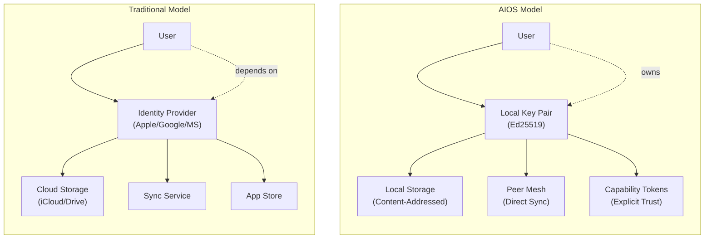
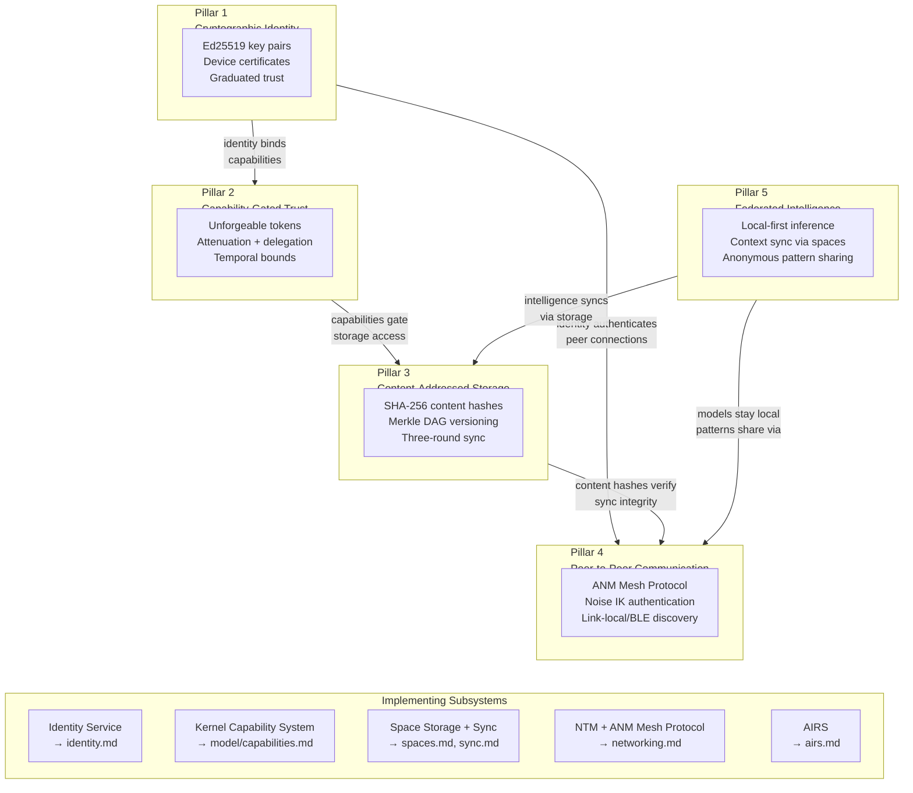
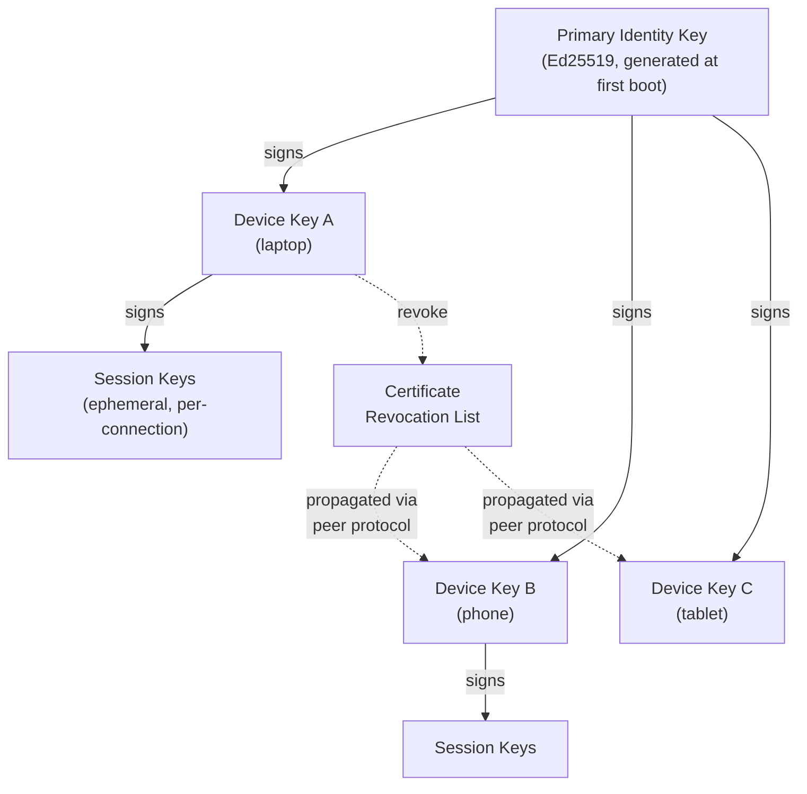
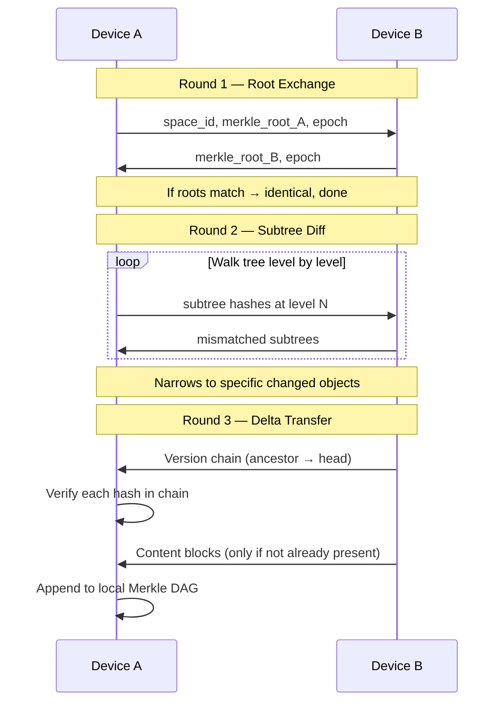
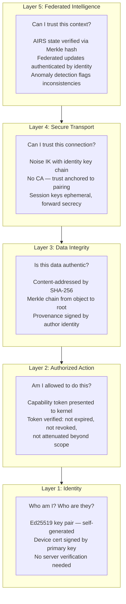

# AIOS Decentralisation Architecture

**Audience:** All developers (kernel, platform, application, security)
**Scope:** Cross-cutting — identity, storage, networking, intelligence, security, agents
**Related:** [identity.md](../experience/identity.md) — Cryptographic identity, [multi-device.md](../platform/multi-device.md) — Device mesh and enterprise, [sync.md](../storage/spaces/sync.md) — Merkle exchange protocol, [model.md](./model.md) — Capability system and security layers, [networking.md](../platform/networking.md) — Network Translation Module, [anm.md](../platform/networking/anm.md) — AI Network Model, [airs.md](../intelligence/airs.md) — AI Runtime Service, [agents.md](../applications/agents.md) — Agent model, [inspector.md](../applications/inspector.md) — Security dashboard

---

## §1 Core Insight

Every mainstream operating system depends on servers you don't control. Your identity is an Apple ID, a Google Account, a Microsoft Account — a row in someone else's database. Your files live in iCloud, Google Drive, OneDrive — on someone else's disks. Your device syncs through someone else's infrastructure. If that infrastructure goes down, changes policy, or gets compromised, your digital life is held hostage.

AIOS eliminates this dependency. Not by being offline-only or anti-cloud, but by making **cryptographic proof** the foundation of trust instead of **institutional authority**. Your identity is an Ed25519 key pair that you generate, on your device, with no server involved. Your data is content-addressed and Merkle-verified — two devices can prove they have identical data without trusting each other or any third party. Your devices find and authenticate each other directly, using the ANM Mesh Protocol with Noise IK handshakes verified by your Ed25519 identity key chain (no external CA).

The result: everything works without a server. Everything works offline. Everything works if a company goes bankrupt, changes its terms of service, or gets acquired. And when you do want cloud services — a hosted LLM, a web API, a collaborative workspace — AIOS connects to them as a peer with explicit, revocable capability tokens, not as a dependent with implicit trust.

**The user never needs to understand any of this.** They experience it as: "my stuff syncs across my devices", "everything works offline", "I don't need to create an account", "I can see exactly what every app can access." The decentralisation is invisible infrastructure that produces visible benefits.



**Core thesis:** Trust should be *computed from cryptographic proofs*, not *granted by institutions*. When trust is computable, it can be verified by anyone, revoked precisely, delegated with attenuation, and exercised offline. When trust is institutional, it can be withdrawn unilaterally, surveilled silently, and lost to infrastructure failures.

---

## §2 Architecture Overview

AIOS decentralisation rests on five pillars. Each pillar is implemented by one or more subsystems documented elsewhere. This document explains how the pillars compose into a coherent system — the individual subsystem docs contain the implementation details.



| Pillar | What users experience | What the OS does | Authoritative docs |
|---|---|---|---|
| Cryptographic Identity | No accounts, no passwords. Scan QR to add a device. | Ed25519 key hierarchy, device certificates, peer CRL | [core.md §3-4](../experience/identity/core.md), [relationships.md §5](../experience/identity/relationships.md) |
| Capability-Gated Trust | Apps ask for what they need. Revoke anytime. | Unforgeable tokens, attenuation, cross-device delegation | [capabilities.md §3](./model/capabilities.md) |
| Content-Addressed Storage | Files sync across devices automatically. No conflicts lost. | SHA-256 hashes, Merkle DAG, three-round exchange | [sync.md §8](../storage/spaces/sync.md) |
| Peer-to-Peer Communication | Devices find each other. No cloud account needed. | ANM Mesh Protocol (Noise IK), link-local + BLE discovery, Shadow Engine | [protocols.md §5.1](../platform/networking/protocols.md), [anm.md](../platform/networking/anm.md) |
| Federated Intelligence | AI knows your preferences everywhere. Data stays on device. | AIRS context sync, federated learning, local inference | [airs.md §1-2](../intelligence/airs.md) |

The pillars have a dependency order: Identity (1) must exist before capabilities (2) can be identity-bound. Capabilities (2) must exist before storage (3) can be access-controlled. Identity (1) and storage (3) must exist before peer communication (4) can authenticate and verify. All four must exist before intelligence (5) can sync across devices. This dependency chain determines the implementation order (see §13).

---

## §3 Pillar 1: Cryptographic Identity

### What users see

Turn on a new AIOS device. There is no "create account" screen. There is no email address field. There is no password. The device generates a cryptographic identity automatically during first boot.

To add a second device: open Settings on both devices, scan a QR code, confirm a 6-digit code matches on both screens. Done. Both devices now share the same identity. Files sync. Preferences sync. Conversations continue where you left off.

To share a space with a friend: they hold their device near yours. Both confirm the pairing. You select which spaces to share and what access level (view, edit, or full). The friend's device now syncs those spaces directly with yours — no server mediates the relationship.

If you lose a device: open Inspector on any remaining device, tap "Remove device", confirm. The lost device's access is revoked immediately across all your other devices. It can no longer sync, authenticate, or access any shared spaces.

### How it works

AIOS identity is an **Ed25519 key pair** — 32 bytes public, 32 bytes private. The private key never leaves the kernel's Crypto Core. Identity is not a username; it is a cryptographic proof that requires no external verification.

**Key hierarchy:**



- **Primary key**: Generated once, stored in TPM/Secure Enclave where available. Signs device keys. Recovery via threshold secret sharing across trusted devices (see [privacy.md §14](../experience/identity/privacy.md)).
- **Device keys**: One per device, signed by the primary key. Used for Noise IK authentication in mesh peer connections. Can be revoked individually without affecting other devices.
- **Session keys**: Ephemeral, derived per-connection. Compromise of a session key does not compromise the device key.
- **Graduated trust**: Relationships aren't binary. Trust is a spectrum: Family → Friend → Colleague → Acquaintance → Service → Unknown. Trust level affects sync defaults, capability delegation limits, and attention priority (see [relationships.md §5](../experience/identity/relationships.md)).

**Why Ed25519:** Small keys (32 bytes), fast verification (~70μs), no patents, deterministic signatures (no random number generator dependency — critical for reproducibility in a kernel context), strong security (128-bit equivalent). See [hardening.md §4](./model/hardening.md) for the full cryptographic foundations.

**No server dependency:** Identity verification is a local operation — check the signature chain from session key → device key → primary key. No network request to an identity provider. No token refresh endpoint. No OAuth dance. This is what makes AIOS identity work offline, on air-gapped devices, and across jurisdictional boundaries.

---

## §4 Pillar 2: Capability-Gated Trust

### What users see

When you install an agent (app), you see exactly what it can access: "This agent wants to read your research space and use the camera." Not a wall of permissions at install time — capabilities are requested when needed and can be time-limited ("allow camera access for this session only").

Open Inspector at any time to see every active capability for every agent. Tap any capability to revoke it instantly. If an agent behaves suspiciously (the behavioral monitor flags it), the system can automatically suspend its capabilities pending your review.

When you share a capability with a friend's device — say, letting their photo editor access your shared album — the capability is automatically *attenuated*: they get read-only access to that specific album, not your entire photo space. And the capability expires after 7 days unless you renew it.

### How it works

Traditional operating systems use **ambient authority**: a process inherits the permissions of the user who launched it. If the user can read `/etc/passwd`, so can every process they run. This model fails catastrophically with autonomous agents that act on the user's behalf — an agent should only access what it needs, not everything the user can access.

AIOS uses **capability-based security**: every access requires presenting an unforgeable token to the kernel. No token, no access. Tokens can be:

- **Attenuated** — restricted to a narrower scope (e.g., "research/" → "research/papers/", read-write → read-only)
- **Delegated** — transferred to another agent, but only with equal or fewer permissions (monotonic restriction)
- **Temporally bounded** — every token has a mandatory expiry (see [capabilities.md §3.1](./model/capabilities.md))
- **Revoked** — by the user, by timeout, or by the system. Revocation cascades to all delegated children.

**Cross-device delegation:** When a capability is delegated to an agent on another device, it travels via the ANM Mesh Protocol as an encrypted, signed token (protected by the Noise IK session). The receiving device's kernel verifies the signature chain (token → granting identity → primary key) before installing the token in the agent's capability table. No central capability server is needed — the cryptographic chain is self-verifying.

See [capabilities.md §3.1-§3.6](./model/capabilities.md) for the full token lifecycle, and [layers.md §2](./model/layers.md) for how capability checks integrate with the eight defense layers.

---

## §5 Pillar 3: Content-Addressed Storage & Merkle Sync

### What users see

Edit a document on your laptop. Pick up your phone — the document is there, with your latest changes. No "sync" button. No "uploading..." spinner. No "conflict detected" dialogs that lose your work.

If you edit the same document on two devices while offline, AIOS shows you both versions when they reconnect. You pick which to keep, or keep both. Your data is never silently overwritten.

Every version of every document is preserved. Scroll back through the version history to any point in time. Restore any previous version with one tap. This history syncs across all your devices automatically.

### How it works

Traditional file systems identify files by *path* — a name in a directory hierarchy. This creates fundamental problems for sync: two devices can have different files at the same path, and there is no efficient way to determine what changed without comparing every file.

AIOS identifies content by *hash* — the SHA-256 digest of the content itself. This is **content addressing**: identical content always has the same identifier, regardless of which device stores it. Content addressing enables three critical properties:

1. **Deduplication**: Identical content is stored once, even across different objects or spaces.
2. **Integrity verification**: Any device can verify content by recomputing the hash. Tampering is detectable without trusting the source.
3. **Efficient sync**: Two devices compare Merkle tree roots (a single hash) to determine whether their spaces are identical. If not, they walk the tree to find exactly which objects differ — in `O(changed × depth)` time, not `O(total)`.

**Three-round Merkle exchange:**



**No server participates** in this exchange. The two devices communicate directly via the ANM Mesh Protocol (§6). The Merkle tree structure guarantees that a malicious peer cannot inject false data — every hash is verifiable.

**Conflict resolution** without a central arbiter: each security zone has a default policy (Personal → manual user choice, Collaborative → three-way merge with fork fallback, Core → last-writer-wins, Ephemeral → not synced). See [sync.md §8.1-§8.2](../storage/spaces/sync.md) for the full protocol and [versioning.md §5](../storage/spaces/versioning.md) for the Merkle DAG structure.

---

## §6 Pillar 4: Peer-to-Peer Communication

### What users see

Devices find each other automatically when they're on the same WiFi network. Send a file to your tablet by selecting it in the share menu — no app to install, no account to create, no QR code to scan (after initial pairing). Transfer speeds are limited only by your local network, not by a cloud upload/download round trip.

When you're away from home, your devices sync over the internet — still directly between your devices, not through a cloud relay. If your internet goes down, everything you've been working on is available locally. When connectivity returns, sync resumes automatically.

### How it works

When two AIOS devices communicate, they speak the **ANM Mesh Protocol** — the native ANM Layer 2 protocol that operates over raw Ethernet (Direct Link for LAN), relay peers, or QUIC tunnels (for WAN). The Mesh Protocol carries the full richness of spaces, capabilities, and identity.

**Why not HTTP?** HTTP lives in the Bridge Module as a translation layer for legacy internet services — web APIs, cloud endpoints, CDNs. The native AIOS network is the mesh. Device-to-device communication is symmetric: both devices are peers speaking the same protocol. The Mesh Protocol supports bidirectional streaming, multiplexed space operations, and capability exchange natively. HTTP/2 and HTTP/3 are available only for connecting to TCP/IP services via the Bridge Module. See [anm.md](../platform/networking/anm.md) for the full ANM specification.

**Connection establishment:**

1. **Discovery**: Link-local multicast (EtherType `0x4149`) for LAN, BLE for proximity, stored peers for WAN. No central directory.
2. **Authentication**: Noise IK handshake — both devices verify each other's Ed25519 key chain (session key → device key → primary identity key). Previously paired peers establish sessions with 0-RTT.
3. **Capability exchange**: After Noise handshake, devices exchange their sync capability sets — which spaces they're authorized to sync, what operations are permitted.
4. **Space operations**: Sync proceeds via the Merkle exchange protocol (§5). Application-level space operations (`space::read()`, `space::write()`) are transparently routed to the peer when the target space is remote.

**Offline-first via Shadow Engine**: The NTM's Shadow Engine maintains local copies of remote spaces. All operations target the shadow first. When the peer is reachable, the Shadow Engine reconciles via Merkle exchange. The Shadow Engine caches content-addressed space objects (SHA-256 hashes), not HTTP responses. This means applications never need to handle "offline" as a special case — they always operate on local data, and sync is an OS-level concern.

### Servers as Mesh Peers

In ANM, there is no structural distinction between "client" and "server." Relay servers, backup servers, discovery servers, and compute servers are mesh peers with role capabilities — they run the same Mesh Protocol, authenticate with the same Noise IK handshake, and are subject to the same audit trail. A relay peer is simply a peer that holds a `Relay` capability and forwards `MeshPacket`s on behalf of others. This uniformity means the security model applies identically to all participants. See [anm.md §A4 Principle 5](../platform/networking/anm.md) for the "Servers ARE Peers" design principle.

See [protocols.md §5.1](../platform/networking/protocols.md) for protocol wire format, [components.md §3.1, §3.3](../platform/networking/components.md) for Space Resolver and Shadow Engine, and [pairing.md §3.1](../platform/multi-device/pairing.md) for discovery mechanisms.

---

## §7 Pillar 5: Federated Intelligence

### What users see

Your AI assistant knows your preferences on every device. Start a conversation on your phone during your commute, continue it on your laptop when you arrive at your desk — the conversation picks up exactly where you left off, with full context.

The AI gets better at understanding your patterns over time — which documents you'll want when you open a project, which notifications actually matter, how you organize your work. This learning happens entirely on your devices. Your personal data is never uploaded to a cloud AI service.

### How it works

AIOS runs inference locally via the AIRS inference engine (GGML runtime with NEON SIMD acceleration). Models are stored locally in the AIRS model registry. No inference request ever leaves the device unless the user explicitly connects to a hosted model provider — and even then, the connection is capability-gated with an explicit token.

**Intelligence continuity across devices**: AIRS state — conversation history, user preferences, behavioral baselines, context signals — is stored in AIRS-internal spaces. These spaces sync across devices via the same Merkle exchange protocol used for all spaces (§5). When you switch from phone to laptop, the laptop's AIRS instance has your latest context because its AIRS spaces were synced.

**Federated learning**: Some intelligence improvements benefit from patterns observed across multiple devices (or anonymously across users). AIOS uses federated learning for these cases:

- Raw data never leaves the device.
- Only derived patterns (anonymized, aggregated) participate in federated updates.
- The user can opt out of federated learning entirely without losing local intelligence.
- Federated updates are verified via the same Merkle integrity checks used for all space sync.

**Privacy boundary**: The architecture enforces a hard line — raw user data (documents, conversations, browsing history, preferences) stays local. Only statistical derivatives (model weight deltas, anonymized behavioral patterns) can cross device boundaries for federated learning. This is structural enforcement via the capability system, not a policy that could be changed by a software update.

See [airs.md §1-2](../intelligence/airs.md) for the AIRS architecture, [experience.md §4.4](../platform/multi-device/experience.md) for intelligence continuity, [intelligence.md §13-14](../platform/multi-device/intelligence.md) for kernel-internal ML and AIRS-dependent intelligence patterns, and [preferences.md §11](../intelligence/preferences.md) for cross-device preference sync.

---

## §8 Composed Trust Model

The five pillars are not independent — they compose into a trust chain where each layer builds on the one below.



### Trust bootstrapping

When a brand-new device joins the mesh:

1. **Identity generation**: Device generates its own Ed25519 key pair.
2. **Pairing ceremony**: User physically scans QR code on existing device. Both devices perform SPAKE2+ key agreement and verify via Short Authentication String (6-digit code displayed on both screens).
3. **Certificate issuance**: Primary device signs the new device's public key with the primary identity key, creating a device certificate.
4. **Space catalog exchange**: New device receives the list of spaces and their sync policies.
5. **Initial sync**: Merkle exchange brings the new device up to date.

**No server participates.** The trust anchor is the physical pairing ceremony — the user confirms that the two devices in front of them are the correct ones. This is resistant to man-in-the-middle attacks because the SAS verification happens on a channel the attacker cannot intercept (the user's eyes comparing two screens).

### Trust delegation across devices

When an agent on Device A needs a capability scoped to a space that lives on Device B:

1. Agent on A requests the capability via IPC.
2. A's AIRS evaluates the request against the agent's behavioral profile and trust level.
3. If approved, A's kernel creates an attenuated capability token (narrowed to the specific space and operation, time-bounded).
4. The token is signed by A's device key and transmitted to B via the ANM Mesh Protocol.
5. B's kernel verifies the signature chain: token → A's device key → primary identity key.
6. B installs the token in a proxy capability table. Agent operations from A are mediated by B's kernel using this proxy token.

### Trust revocation

Revocation cascades through all layers:

1. **Device revocation**: User removes a device via Inspector. The primary key signs a CRL entry. The CRL propagates to all remaining devices via the ANM Mesh Protocol.
2. **Capability cascade**: All tokens held by the revoked device are invalidated. All tokens delegated *from* the revoked device are invalidated (cascade revocation — see [capabilities.md §3.6](./model/capabilities.md)).
3. **Sync termination**: The revoked device is removed from all space sync relationships. Its Shadow Engine copies become stale.
4. **Key rotation**: Shared space encryption keys that the revoked device possessed are rotated. New keys are distributed only to remaining devices.

---

## §9 Threat Model for Decentralised Systems

Decentralised systems face a distinct threat landscape compared to centralised ones. The absence of a central authority eliminates single points of failure but introduces new attack vectors.

| Threat | Description | AIOS Mitigation | Pillar |
|---|---|---|---|
| **Sybil attack** | Attacker creates many fake device identities to influence federated learning or overwhelm discovery | Device pairing requires physical proximity (QR + SAS). Hardware attestation verifies genuine devices. Federated learning uses contribution-weighted aggregation. | 1, 5 |
| **Eclipse attack** | Isolating a device from its legitimate peers to feed it false sync data | Merkle root pinning — devices remember the last known-good root hash of each peer. Multi-path verification — sync via multiple peers to detect inconsistency. | 3, 4 |
| **Network partition** | Mesh splits due to connectivity loss, devices diverge | Shadow Engine queues all operations locally. Merkle exchange reconciles upon reconnection. Conflict resolution is deterministic and offline-capable. | 3, 4 |
| **Key compromise** | Device key or primary key is stolen | Device keys: revoke the specific device via CRL propagation. Primary key: threshold recovery + key rotation across all devices. Temporal capabilities auto-expire even without revocation. | 1, 2 |
| **Rogue peer** | Compromised device injects malicious data into shared spaces | Content-hash verification (data must match declared hash). Provenance tracking (all changes signed by author identity). Behavioral monitoring flags anomalous sync patterns. | 1, 3, 5 |
| **Metadata leakage** | Peer-to-peer discovery reveals device presence and identity to network observers | Passive discovery by default — devices only respond to known peers. Link-local/BLE advertisements use rotating identifiers, not raw public keys. | 4 |
| **Replay attack** | Attacker replays a captured mesh protocol session | Session keys are ephemeral with forward secrecy. Noise IK nonces are monotonic. Merkle roots include monotonic epoch counters. | 4 |
| **Capability theft** | Attacker intercepts a capability token in transit | Tokens are encrypted in the Noise IK session. Tokens are identity-bound — they cannot be used by a different device even if intercepted. Token binding is verified by the kernel at use time. | 2, 4 |

For the broader AIOS threat model covering malicious agents, prompt injection, privilege escalation, and supply chain attacks, see [model.md §1](./model.md) and [adversarial-defense.md](./adversarial-defense.md).

---

## §10 Opt-In Visibility: The Inspector Layer

### What users see by default

Nothing. The decentralisation machinery is invisible. Devices sync, capabilities are enforced, identity is verified — all automatically. Users experience the benefits without understanding the mechanism.

### What power users see

The [Inspector](../applications/inspector.md) provides full visibility into the decentralised infrastructure for users who want it:

| Inspector Panel | What it shows | Decentralisation context |
|---|---|---|
| **Peer Mesh** | Topology of connected devices, connection quality, last sync time per device | Visualizes the P2P mesh without requiring the user to understand mesh networking |
| **Sync Status** | Per-space sync state: converged, syncing, pending, conflict | Shows which spaces are up-to-date across devices |
| **Trust Chain** | Certificate chain from session key → device key → primary key | Verifies that a device is authentically part of the user's mesh |
| **Active Capabilities** | All capability tokens held by all agents, with delegation chains | Shows cross-device capability delegations and their attenuation |
| **Merkle Explorer** | Space version history as a navigable DAG | Allows inspection of sync state at the data structure level |

### What developers see

The agent SDK exposes decentralisation primitives for agents that need to interact with them:

```rust
// Peer mesh inspection
let peers = mesh.connected_peers().await;
for peer in &peers {
    let status = peer.sync_status(space_id).await;
    // SyncStatus::Converged | Syncing { progress } | Pending | Conflict { .. }
}

// Capability inspection
let caps = capability_table.list_active();
for cap in &caps {
    let chain = cap.delegation_chain(); // full chain from root to this token
    let remaining = cap.time_remaining(); // until expiry
}

// Trust verification
let chain = identity.verify_trust_chain(peer_device_id).await;
// TrustChain::Valid { primary_key, device_key, trust_level }
// TrustChain::Revoked { reason, revoked_at }
// TrustChain::Unknown
```

### Why opt-in visibility matters

**For users**: Trust without understanding. The system earns trust by working reliably. When something unexpected happens (a sync conflict, a capability denial, a device going offline), the Inspector provides an explanation without requiring the user to learn cryptography.

**For developers**: Debuggability. When a cross-device feature doesn't work, developers can inspect the exact state of the Merkle trees, capability chains, and peer connections — not just "sync failed."

**For auditors**: Verifiability. The Inspector, combined with the audit ring ([operations.md §7](./model/operations.md)), provides a complete trail of every decentralised operation: every sync, every capability delegation, every device pairing or revocation.

---

## §11 Offline-First & Partition Tolerance

Decentralisation means there is no server to be "offline from." But devices can still be disconnected from each other. AIOS treats offline operation as the **default mode**, not a degraded fallback.

**Design philosophy**: Every feature must work on a single device with no network connectivity. Sync is an optimization that brings other devices up to date — it is not required for any feature to function. This inverts the typical cloud model, where offline is a special case that needs explicit handling.

**How it works:**

1. **All operations target local state first.** `space::write()` writes to the local Space Storage engine. The NTM's Shadow Engine replicates changes to peers asynchronously.
2. **Shadow Engine queuing.** When a peer is unreachable, operations queue locally. The queue is bounded and persistent — it survives device restarts. When the peer becomes reachable, the Shadow Engine initiates Merkle exchange to reconcile.
3. **Deterministic conflict resolution.** When two devices diverge and later reconnect, the Merkle exchange identifies all divergent objects. Conflict resolution is deterministic — the same inputs always produce the same resolution, regardless of which device initiates the sync.
4. **No "sync in progress" blocking.** Applications are never blocked waiting for sync. They always see their local state. Updates from remote devices are merged in the background and become visible atomically.

**CAP theorem position**: AIOS prioritizes **Availability** and **Partition tolerance** (AP). Every device is always available for local operations. Partitions (disconnected devices) are expected and handled gracefully. Consistency is eventual — the system converges to identical state across all devices once connectivity is restored, but individual devices may show different states during a partition.

See [components.md §3.3](../platform/networking/components.md) for Shadow Engine design, [sync.md §8.2](../storage/spaces/sync.md) for conflict resolution policies, and [versioning.md §5.4](../storage/spaces/versioning.md) for branching during divergent timelines.

---

## §12 Comparison with Existing Approaches

| | AIOS | Apple (iCloud) | Matrix | Signal | IPFS | Solid | Urbit |
|---|---|---|---|---|---|---|---|
| **Identity model** | Ed25519 key pair, local-first | Apple ID (server account) | Matrix ID on homeserver | Phone number + server-registered key | None (content-addressed only) | WebID (HTTP-based, server-hosted) | @p address (blockchain) |
| **Trust model** | Capability tokens, cryptographic delegation | Institutional (Apple controls) | Federation (trust homeserver) | Trust-on-first-use (TOFU) | None (data is public) | WAC (Web Access Control) | Urbit ID NFT ownership |
| **Sync model** | Merkle exchange, P2P direct | Server-mediated (iCloud) | Federation (homeserver relays) | Server relay (Signal server) | DHT (global, public) | HTTP (pod server) | Ames (P2P, encrypted) |
| **Offline capability** | Full (offline-first by design) | Partial (recent files cached) | Partial (homeserver stores) | Partial (messages queue) | None (requires network) | None (requires server) | Full (local pier) |
| **OS integration** | Deep (kernel-level, capability system) | Deep (Apple only) | None (protocol only) | None (app only) | None (library only) | None (browser-based) | Full (own OS, Nock VM) |
| **User visibility** | Invisible default, Inspector opt-in | Invisible default, limited inspection | Visible (technical UI) | Invisible | Visible (technical) | Visible (developer-oriented) | Visible (very technical) |
| **Privacy model** | Structural (capability-enforced, data never leaves device) | Policy (Apple can access with warrant) | Varies by homeserver | Strong (E2E encrypted) | None (public by default) | Owner-controlled | Strong (encrypted at rest) |

**Key differentiators for AIOS:**

1. **OS-level integration**: Decentralisation is not an app or protocol bolted onto an existing OS — it is how the OS works. The kernel enforces capabilities. Storage is natively content-addressed. Networking is natively peer-to-peer.
2. **Invisible to users**: Unlike Matrix, IPFS, Solid, and Urbit, which require users to understand technical concepts (homeservers, CIDs, pods, planets), AIOS hides the decentralisation entirely behind familiar UX patterns.
3. **Capability-gated, not all-or-nothing**: Unlike iCloud (Apple controls everything) or IPFS (everything is public), AIOS provides fine-grained, revocable, time-bounded, delegatable access control that works without a server.

---

## §13 Implementation Roadmap

Decentralisation is not a single phase — it emerges from the composition of capabilities built across many phases. The pillars activate incrementally:

```mermaid
gantt
    title Decentralisation Pillar Activation
    dateFormat X
    axisFormat Phase %s

    section Pillar 1: Identity
    Ed25519 key generation           :p3, 3, 5
    Device certificates              :p17, 17, 21

    section Pillar 2: Capabilities
    Capability token system           :p3b, 3, 5
    Cross-device delegation           :p37a, 37, 41

    section Pillar 3: Storage
    Content-addressed objects         :p4, 4, 8
    Merkle DAG versioning             :p4b, 4, 8
    Space Sync protocol               :p8, 8, 12

    section Pillar 4: Communication
    ANM Mesh + Bridge Layer            :p9, 9, 12
    Full ANM stack + Shadow Engine    :p28, 28, 32

    section Pillar 5: Intelligence
    Local AIRS inference              :p10, 10, 14
    Intelligence continuity           :p37b, 37, 41
    Federated learning                :p37c, 37, 41
```



| Phase | Pillar(s) | What activates |
|---|---|---|
| 3 | 1, 2 | Ed25519 identity + capability token system (single device) |
| 4 | 3 | Content-addressed objects, Merkle DAG versioning (single device) |
| 9 | 4 | Basic networking: ANM Mesh Layer + VirtIO-Net (Direct Link), Bridge Layer for TCP/IP |
| 9 | 3, 4 | Space Sync protocol (Merkle exchange between devices), ANM Mesh Layer |
| 10 | 5 | Local AIRS inference engine |
| 17 | 1, 3 | Per-space encryption, device certificates, sync key management |
| 28 | 4 | Full ANM stack, Shadow Engine, Connection Manager, WAN mesh |
| 37 | All | Multi-device mesh, cross-device delegation, intelligence continuity, federated learning |

**Phase 38 is where full decentralisation activates** — all five pillars are present and composing. But each pillar delivers value independently before Phase 38. Content-addressed storage (Phase 4) works on a single device. Local inference (Phase 11) works without sync. The ANM Mesh Protocol (Phase 9/28) works without full multi-device management.

See [development-plan.md §8](../project/development-plan.md) for the full phase table.

---

## §14 Future Directions

### Cross-user mesh

Extend the personal device mesh to trusted contacts. Two users who have established a relationship (§3, graduated trust) can form a cross-user mesh where selected spaces sync directly between their devices. This enables collaborative workspaces without a server — a research group, a family photo album, a band's shared recording space.

### Decentralised agent distribution

Agents are currently installed from an Agent Store (centralised). A future model distributes agents via peer protocol: agents are signed by their developer's Ed25519 identity, content-addressed by their hash, and discovered via the Space Resolver. Any device in the mesh can serve as a distribution point. The Agent Store becomes an optional convenience, not a requirement.

### Space Resolver as DNS alternative

The NTM's Space Resolver already maps semantic names to endpoints. Extending it with a distributed hash table (DHT) could replace DNS for AIOS-to-AIOS communication — no centralised DNS servers, no domain registrars, no DNS poisoning attacks. Human-readable space names would resolve via the DHT, with cryptographic verification of the binding.

### Decentralised attestation

Hardware attestation currently verifies against a manufacturer's server (TPM attestation uses the manufacturer's root certificate). A future model uses peer consensus: a device presents its attestation evidence to multiple peers in the mesh, who collectively verify it against known-good measurements. This removes the dependency on the manufacturer's infrastructure for trust verification.

### Formal verification of trust composition

Prove mathematically that the composed trust model (§8) satisfies stated security properties: that capability attenuation is monotonic, that revocation is complete, that Merkle verification is sound, that the SPAKE2+ pairing ceremony prevents MITM. Tools: Lean 4 or Coq for the proof, applied to the formal specification of each pillar.

### AI-native decentralisation

- **Federated anomaly detection**: Train GNN models across the device mesh to detect lateral movement patterns, without sharing raw network data. Each device contributes gradient updates; no device sees another's traffic.
- **Decentralised model sharding**: Split large models across devices in the mesh for inference. A laptop with a GPU handles the compute-intensive layers; a phone contributes its NPU for specific operations. The model never exists in full on any single device that lacks sufficient resources.
- **Predictive sync**: AIRS predicts which spaces the user will need next (based on time-of-day, location, activity patterns) and pre-syncs them before the user switches devices. This makes device transitions feel instantaneous.

---

## §15 Design Principles

These principles govern all decentralisation-related design decisions across AIOS:

1. **No feature may require a central server to function.** Every capability must work on a single device with no network connectivity. Cloud services are optional enhancements, not dependencies.

2. **All trust must be computable from cryptographic proofs.** Trust verification must be a local computation — check signature chains, verify Merkle hashes, validate capability tokens. No network request to an authority.

3. **Offline operation is the default; network is an optimization.** Applications always operate on local state. Sync brings other devices up to date asynchronously. No feature blocks on network availability.

4. **Data ownership is non-negotiable.** The user's private key means the user owns their data. No update, no terms-of-service change, no corporate acquisition can revoke this ownership.

5. **Privacy is structural, not policy-based.** Raw data stays on-device by architectural enforcement (capability system), not by a promise in a privacy policy. The capability system physically prevents data exfiltration — there is no token for "send all user data to server."

6. **Graceful degradation over hard failure.** If a peer is unreachable, the system works locally. If a device is revoked, remaining devices continue unaffected. If a key is compromised, the blast radius is contained to that key's scope.

7. **Decentralisation must be invisible.** Users experience the benefits (sync, offline, ownership, privacy) without needing to understand the mechanism (Merkle trees, Ed25519, capabilities, Noise IK). The Inspector provides opt-in visibility for those who want it.

---

## §16 Cross-Reference Index

| Topic | This doc | Authoritative document(s) |
|---|---|---|
| Ed25519 identity, key hierarchy | §3 | [core.md §3-4](../experience/identity/core.md), [relationships.md §5](../experience/identity/relationships.md) |
| Device pairing (SPAKE2+, SAS) | §3, §8 | [pairing.md §3.2](../platform/multi-device/pairing.md) |
| Graduated trust model | §3 | [relationships.md §5](../experience/identity/relationships.md) |
| Capability token lifecycle | §4 | [capabilities.md §3.1-3.6](./model/capabilities.md) |
| Capability delegation | §4, §8 | [capabilities.md §3.5](./model/capabilities.md) |
| Eight defense layers | §4 | [layers.md §2](./model/layers.md) |
| Content-addressed objects | §5 | [data-structures.md §3.0-3.4](../storage/spaces/data-structures.md) |
| Merkle DAG versioning | §5 | [versioning.md §5.1-5.5](../storage/spaces/versioning.md) |
| Space Sync (Merkle exchange) | §5, §8, §11 | [sync.md §8.1-8.2](../storage/spaces/sync.md) |
| Conflict resolution | §5, §11 | [sync.md §8.2](../storage/spaces/sync.md) |
| Encryption zones | §5 | [encryption.md §6.1-6.3](../storage/spaces/encryption.md) |
| ANM Mesh Protocol | §6 | [anm.md](../platform/networking/anm.md), [protocols.md §5.1](../platform/networking/protocols.md) |
| Space Resolver | §6 | [components.md §3.1](../platform/networking/components.md) |
| Shadow Engine | §6, §11 | [components.md §3.3](../platform/networking/components.md) |
| Discovery (mDNS, BLE) | §6 | [pairing.md §3.1](../platform/multi-device/pairing.md) |
| Network security (Noise IK, TLS for Bridge) | §6, §9 | [security.md §6.1-6.5](../platform/networking/security.md), [anm.md](../platform/networking/anm.md) |
| AIRS architecture | §7 | [airs.md §1-2](../intelligence/airs.md) |
| Intelligence continuity | §7 | [experience.md §4.4](../platform/multi-device/experience.md) |
| Federated learning | §7 | [intelligence.md §13-14](../platform/multi-device/intelligence.md) |
| Cross-device preferences | §7 | [preferences.md §11](../intelligence/preferences.md) |
| Trust boundaries | §8 | [model.md §1.2](./model.md) |
| Device revocation | §8, §9 | [pairing.md §3.5](../platform/multi-device/pairing.md) |
| General threat model | §9 | [model.md §1](./model.md) |
| Adversarial defense | §9 | [adversarial-defense.md](./adversarial-defense.md) |
| Behavioral monitoring | §9 | [behavioral-monitor.md](../intelligence/behavioral-monitor.md) |
| Inspector dashboard | §10 | [inspector.md](../applications/inspector.md) |
| Audit ring | §10 | [operations.md §7](./model/operations.md) |
| Multi-device architecture | §8, §13 | [multi-device.md](../platform/multi-device.md) |
| Development phases | §13 | [development-plan.md §8](../project/development-plan.md) |
| Cryptographic foundations | §3 | [hardening.md §4](./model/hardening.md) |
