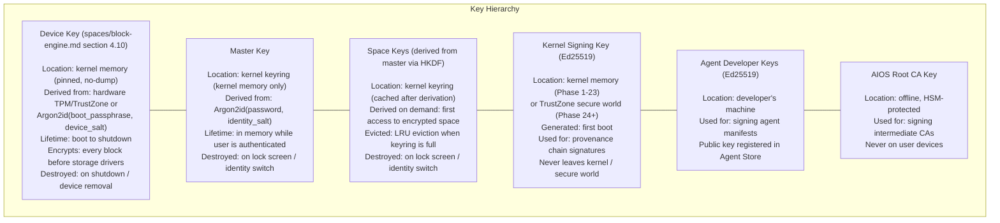
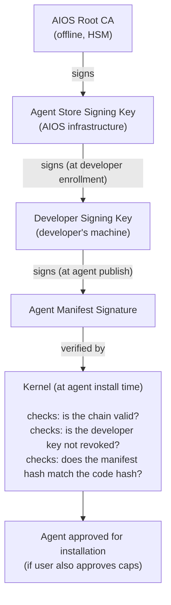
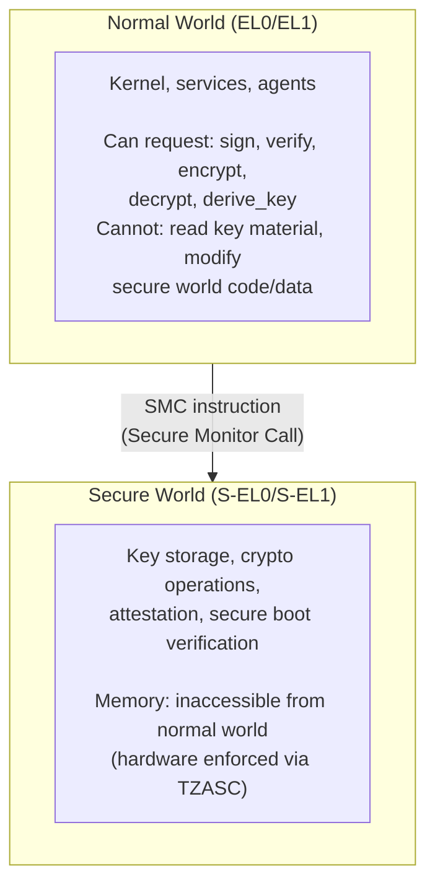

# AIOS Security Model — Cryptography, Hardware Security & Testing

Part of: [security.md](./security.md) — AIOS Security Model
**Related:** [layers.md](./layers.md) — Layer 6 (cryptographic enforcement), [capabilities.md](./capabilities.md) — Capability system, [operations.md](./operations.md) — Event response, audit
**See also:** [hardening.md](../kernel/memory/hardening.md) — W^X/PAC/BTI/MTE kernel implementation, [fuzzing.md](./fuzzing.md) — Fuzzing deep-dive, [static-analysis.md](./static-analysis.md) — Static analysis and formal verification deep-dive

-----

## 4. Cryptographic Foundations

### 4.1 Algorithms

| Algorithm | Use | Implementation | Hardware Acceleration |
|---|---|---|---|
| Ed25519 | Signing (provenance chain, agent manifests, capability signatures) | `ed25519-dalek` (pure Rust) | None needed (fast in software) |
| AES-256-GCM | Space encryption at rest, object encryption | `aes-gcm` crate + ARM intrinsics | ARM Cryptography Extensions (CE) |
| ChaCha20-Poly1305 | Fallback encryption (no ARM CE), TLS cipher | `chacha20poly1305` crate | NEON SIMD |
| Argon2id | Master key derivation from password | `argon2` crate | None (designed to be slow) |
| HKDF-SHA256 | Per-space key derivation from master key | `hkdf` crate | ARM CE for SHA-256 |
| SHA-256 | Content addressing, Merkle chain hashing | `sha2` crate + ARM intrinsics | ARM CE |
| BLAKE3 | Fast checksums (block engine, IPC integrity) | `blake3` crate | NEON SIMD |

**Why two encryption algorithms:** AES-256-GCM is the primary choice because ARM CE provides hardware acceleration, making it ~10x faster than software. ChaCha20-Poly1305 is the fallback for devices without ARM CE (rare on modern ARM, but possible in QEMU without KVM). Both provide authenticated encryption (AEAD) — tampering is detected.

### 4.2 Key Storage

The key hierarchy has two independent layers. **Space keys** protect cross-zone isolation within a running system (per-space encryption, [spaces/encryption.md §6](../storage/spaces/encryption.md)). **The device key** encrypts every block before it reaches storage drivers, protecting against physical access to the storage medium ([spaces/block-engine.md §4.10](../storage/spaces/block-engine.md)). These layers are independent — compromising the device key does not reveal space keys, and vice versa. On devices without a secure element, both keys can be derived from a single user passphrase using different Argon2id salts (spaces/block-engine.md §4.10 single-passphrase mode).



### 4.3 Certificate Chain



**Certificate revocation:** A compromised developer key can be revoked via the Agent Store. The OS periodically checks revocation lists (via NTM, background sync). If a developer key is revoked, all agents signed by that key are flagged. The user is notified and can choose to uninstall or continue at their own risk.

### 4.4 Cryptographic Operations API

Agents never hold raw key material. All cryptographic operations happen in the kernel (or TrustZone in Phase 24+). The kernel exposes a small set of crypto syscalls:

```rust
pub enum CryptoSyscall {
    /// Sign data with the agent's identity key
    /// Agent provides data, kernel returns signature
    Sign {
        data: *const u8,
        data_len: usize,
        signature_buf: *mut u8,         // Ed25519: 64 bytes
    },

    /// Verify a signature
    Verify {
        data: *const u8,
        data_len: usize,
        signature: *const u8,
        public_key: *const u8,          // Ed25519: 32 bytes
    },

    /// Hash data (SHA-256)
    Hash {
        data: *const u8,
        data_len: usize,
        hash_buf: *mut u8,             // 32 bytes
    },

    /// Generate cryptographically secure random bytes
    Random {
        buf: *mut u8,
        len: usize,
    },

    /// Encrypt data for a specific identity (public key encryption)
    /// Used for secure agent-to-agent data transfer
    SealForIdentity {
        data: *const u8,
        data_len: usize,
        recipient: IdentityId,
        sealed_buf: *mut u8,
        sealed_len: *mut usize,
    },

    /// Decrypt data sealed for this agent's identity
    Unseal {
        sealed: *const u8,
        sealed_len: usize,
        data_buf: *mut u8,
        data_len: *mut usize,
    },
}
```

**Why agents don't hold keys:** If an agent is compromised (supply chain attack, memory corruption, logic bug), any keys it holds are also compromised. By keeping keys in the kernel, a compromised agent cannot exfiltrate key material. The agent can perform crypto operations (sign, verify, encrypt, decrypt) but never possesses the keys themselves. This is the same principle as credential isolation in the Network Translation Module — agents use keys without possessing them.

-----

## 5. ARM Hardware Security Integration

### 5.1 PAC (Pointer Authentication Codes)

ARM's Pointer Authentication adds a cryptographic signature to pointer values, making ROP (Return-Oriented Programming) and JOP (Jump-Oriented Programming) attacks detectable.

**How it works:**
- Each process has a unique PAC key (loaded into `APIAKey_EL1` during context switch)
- The `PACIA` instruction signs a pointer with the key and a context value (typically the stack pointer)
- The `AUTIA` instruction verifies the signature before use
- If the signature doesn't match (pointer was modified by attacker), the CPU traps

**AIOS usage:**
- All kernel functions use PAC-signed return addresses (`PACIASP` / `RETAA`)
- All userspace code compiled with `-mbranch-protection=pac-ret` (LLVM flag)
- Per-process PAC keys rotated on each process creation
- Context switch saves/restores PAC keys alongside general registers

```text
Without PAC:
  Attacker overwrites return address on stack → ROP chain executes

With PAC:
  Attacker overwrites return address on stack
  → AUTIASP fails (PAC mismatch)
  → CPU traps to kernel
  → Kernel terminates process, logs security event
  → Provenance chain records: (agent, security_event, pac_violation)
```

### 5.2 BTI (Branch Target Identification)

BTI marks valid indirect branch targets. Any indirect branch (function pointer call, vtable dispatch, computed jump) that lands on an instruction without a BTI marker causes a fault.

**AIOS usage:**
- All code compiled with `-mbranch-protection=bti` (LLVM flag)
- The kernel enforces BTI via page table entries (`GP` bit in PTE — guarded pages)
- Combined with PAC: `-mbranch-protection=pac-ret+bti`
- Prevents JOP attacks (attacker cannot jump to arbitrary gadgets)

### 5.3 MTE (Memory Tagging Extension)

MTE assigns 4-bit tags to both pointers and memory regions. On every memory access, the hardware compares the pointer tag to the memory tag. A mismatch indicates a bug (use-after-free, buffer overflow, type confusion).

**How it works:**
- Memory is divided into 16-byte granules. Each granule has a 4-bit tag (stored in dedicated tag memory).
- Pointers use the top 4 bits (bits 59:56) to store a tag.
- `IRG` instruction generates a random tag for a pointer.
- `STG` instruction sets the tag on a memory granule.
- On access: hardware checks `pointer_tag == memory_tag`. Mismatch → fault.

**AIOS usage:**

```text
Sync mode (kernel, security-critical services):
  → Fault immediately on tag mismatch
  → Deterministic, debuggable
  → ~5% performance overhead

Async mode (agents, non-critical services):
  → Report mismatch asynchronously (at next context switch)
  → Near-zero performance overhead
  → Used for detection, not prevention
```

```rust
pub struct MtePolicy {
    /// Kernel code: always sync mode
    kernel: MteMode,
    /// System services: sync mode for security services, async for others
    system_services: MteMode,
    /// Agents: async mode by default
    agents: MteMode,
}

pub enum MteMode {
    /// Immediate fault on tag mismatch
    Sync,
    /// Asynchronous reporting (near-zero overhead)
    Async,
    /// MTE disabled (fallback for early development)
    Disabled,
}
```

**What MTE catches:** Use-after-free (freed memory gets new tag, dangling pointer has old tag → mismatch). Buffer overflow (adjacent allocation has different tag → mismatch). Type confusion (reinterpreted pointer may have wrong tag). These are the three most common classes of memory safety vulnerabilities in C/C++ — relevant for GGML, Servo components, and any `unsafe` Rust code.

### 5.4 TrustZone Integration (Phase 24)

ARM TrustZone provides a hardware-isolated "secure world" that the normal world (where the OS runs) cannot access.

**Phase 24 plan:**
- **Secure world services:** Key storage, cryptographic operations, attestation
- **Master key storage:** The master key (derived from user password) moves from kernel memory to TrustZone secure world. Normal-world kernel can request crypto operations but cannot read the key itself.
- **Attestation:** The secure world can attest to the boot chain integrity — proving to a remote party that the device is running genuine AIOS with a valid kernel.
- **Sealed storage:** Sensitive data (like the kernel signing key) is encrypted with a TrustZone-derived key that is only available when the secure world is intact.



### 5.5 W^X Enforcement

No memory page is ever both writable and executable simultaneously. This is the most fundamental code injection defense — even if an attacker can write to memory, they cannot execute that memory as code.

**Kernel enforcement:**
- Page table entries (PTEs) have separate `AP` (access permission) and `XN` (execute never) bits
- The kernel's `MemoryMap` syscall enforces: if `flags` contains `Write`, `Execute` is forbidden. If `flags` contains `Execute`, `Write` is forbidden.
- Attempting to mmap with both `Write` and `Execute` returns `EPERM`

**JIT workflow (for JavaScript in browser tab agents):**

```text
1. JIT compiler generates code into a WRITABLE, non-executable buffer
2. JIT calls MemoryMap to remap the buffer as EXECUTABLE, non-writable
   (kernel flushes instruction cache, sets PTE flags)
3. Code runs from the executable mapping
4. To modify JIT code: remap as writable, modify, remap as executable
5. At no point is the same page both writable and executable
```

### 5.6 KASLR (Kernel Address Space Layout Randomization)

The kernel's base address is randomized at each boot, making it harder for attackers to locate kernel functions and data structures for exploitation.

**Implementation:**
- UEFI firmware provides entropy via `EFI_RNG_PROTOCOL` (hardware RNG)
- Bootloader generates a random slide: `kernel_base = 0xFFFF000000000000 + (random % SLIDE_RANGE)`
- `SLIDE_RANGE`: 128 MB, giving 64 positions at 2 MB alignment (sufficient to make brute-forcing impractical)
- All kernel code is position-independent (compiled with `-fPIC` equivalent for kernel)
- Kernel virtual addresses are randomized; physical addresses are not (hardware constraint)
- KASLR slide is never leaked to userspace (no `/proc/kallsyms` equivalent)

-----

## 8. Security Testing

### 8.1 Agent Audit Tool

> For a comprehensive deep-dive on static analysis strategies, tooling, and the phased adoption roadmap for both kernel development and agent auditing, see [Static Analysis and Formal Verification](static-analysis.md).

The `aios agent audit` command runs a comprehensive security analysis on an agent before publication:

```text
$ aios agent audit ./research-assistant/

=== AIOS Agent Security Audit ===

Manifest Analysis:
  ✓ All requested capabilities have rationale strings
  ✓ No overly broad capabilities (no ReadSpace("*"))
  ✓ Network destinations are specific (not wildcards)
  ✓ No raw socket capability requested
  ✓ Capability set is consistent with declared purpose

Static Analysis:
  ✓ No direct syscall invocations (uses SDK only)
  ✓ No unsafe blocks in agent code
  ✓ No filesystem path manipulation (uses Space API)
  ✓ No environment variable reads
  ✓ No dynamic library loading

Dependency Analysis:
  ✓ All dependencies pinned to exact versions
  ✓ No known vulnerabilities in dependency tree
  ⚠ Dependency 'http-client' v0.3.2 has 1 advisory (low severity)

Capability Usage Analysis:
  ✓ ReadSpace("research/") used in 3 code paths (expected)
  ✓ WriteSpace("research/papers/") used in 1 code path (expected)
  ✓ Network used in 2 code paths (API calls to declared services)
  ✗ InferenceCpu requested but never used in code — remove from manifest?

AIRS Code Review:
  ✓ No data exfiltration patterns detected
  ✓ Input validation present for all external data
  ✓ Error handling does not leak sensitive information
  ⚠ Consider adding rate limiting for API calls (best practice)

Overall: PASS (2 warnings, 0 errors)
```

### 8.2 Fuzzing

> For a comprehensive deep-dive on fuzzing strategies, hardening mechanisms, tooling, and the phased adoption roadmap, see [Fuzzing and Input Hardening](fuzzing.md).

**Kernel syscall fuzzing:** Every syscall is fuzzed with random, malformed, and adversarial inputs. The fuzzer targets:
- Invalid capability handles (out of bounds, negative, MAX_INT)
- Null pointers, unaligned pointers, kernel-space pointers
- Buffer overflows (length > buffer, length = 0, length = MAX)
- Invalid IPC channel IDs
- Race conditions (concurrent syscalls on same capability)
- All 31 syscalls, all parameter combinations

**IPC message fuzzing:** Malformed messages sent to every system service:
- Invalid message types
- Truncated messages
- Messages with wrong capability references
- Messages exceeding maximum size
- Messages with invalid serialization

**Manifest fuzzing:** Malformed agent manifests to test the install/approval pipeline:
- Invalid capability declarations
- Circular delegation chains
- Manifests with mismatched signatures
- Manifests with expired certificates

### 8.3 Formal Verification Targets

> For the full formal verification approach (TLA+, Coq, Kani, Verus) and phased adoption roadmap, see [Static Analysis and Formal Verification](static-analysis.md) §4.5–4.7.

Formal verification provides mathematical guarantees about security properties. Not all code can be formally verified (the cost is too high), so AIOS targets the most critical components:

**Target 1: Capability system — no forge, no escalate.**
- Property: An agent can never hold a capability token that was not explicitly created by the kernel and granted through the approval flow.
- Property: `CapabilityAttenuate` can only produce tokens that are equal to or more restricted than the source.
- Approach: TLA+ model of the capability state machine → Coq proofs of the core invariants.

**Target 2: IPC — no cross-address-space leaks.**
- Property: Data in process A's address space is never readable by process B except through explicit shared memory regions with appropriate capability grants.
- Property: Capability transfer through IPC maintains the delegation chain invariant.
- Approach: TLA+ model of IPC message passing → verify absence of information flow violations.

**Target 3: Provenance chain integrity.**
- Property: The Merkle chain is append-only. No record can be modified or deleted after creation.
- Property: A gap in the chain (missing record) is detectable.
- Property: The chain's integrity can be verified by any holder of the kernel's public signing key.
- Approach: Coq proof of the Merkle chain append/verify operations.

**Target 4: W^X enforcement.**
- Property: No page table entry ever has both write and execute permissions simultaneously.
- Approach: Exhaustive analysis of all `MemoryMap` code paths to verify PTE flag setting.

**Timeline:** TLA+ models begin in Phase 13 (Security Hardening). Coq proofs for capability system and provenance chain target Phase 24. Full formal verification of W^X and IPC also targeting Phase 24.

-----
