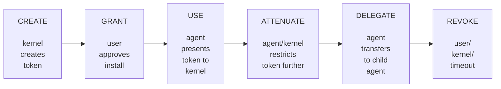

# AIOS Security Model — Capability System Internals

Part of: [model.md](../model.md) — AIOS Security Model
**Related:** [layers.md](./layers.md) — Defense layers (Layer 2 is capability check), [hardening.md](./hardening.md) — Formal verification targets, [operations.md](./operations.md) — Zero trust gap analysis

-----

## 3. Capability System Internals

### 3.1 Capability Token Lifecycle



**Step by step:**

```rust
// 1. CREATE: kernel creates token during agent installation.
//    Expiry is MANDATORY — the kernel enforces a maximum TTL per trust level
//    (see [§10.3](./operations.md) Gap 2). capability_create() rejects expires: None.
//
//    Maximum TTL by trust level:
//      Level 0 (Kernel):      N/A (kernel does not hold capability tokens)
//      Level 1 (System):      365 days (renewed at boot)
//      Level 2 (Native):      365 days (renewed at boot)
//      Level 3 (Third-party): 90 days  (re-requested from Service Manager)
//      Level 4 (Web content): 24 hours (re-requested per session)
let token = kernel.capability_create(CapabilityToken {
    id: TokenId::new(),
    capability: Capability::ReadSpace(SpaceId("research")),
    holder: agent_id,
    granted_by: user_identity,
    created_at: now(),
    expires: now() + Duration::days(90),  // mandatory; agent is Trust Level 3
    delegatable: true,
    attenuations: vec![],
    revoked: false,
    parent_token: None,
    usage_count: 0,
    last_used: Timestamp::ZERO,
});

// 2. GRANT: token placed in agent's CapabilityTable
agent_table.tokens.push(Some(token));
let handle = CapabilityHandle(agent_table.tokens.len() - 1);

// 3. USE: agent presents handle in syscall
let result = syscall(Syscall::IpcCall {
    channel: space_service_channel,
    // message includes the handle; kernel validates before delivery
    ..
});

// 4. ATTENUATE: create a more restricted version
let restricted = syscall(Syscall::CapabilityAttenuate {
    source: handle,
    restrictions: AttenuationSpec {
        narrow_path: Some("research/papers/"),  // was "research/"
        reduce_expiry: Some(now() + Duration::hours(1)),
        remove_write: true,                     // read-only now
    },
});

// 5. DELEGATE: transfer attenuated token to child agent
syscall(Syscall::CapabilityTransfer {
    channel: child_agent_channel,
    capability: restricted,
});

// 6. REVOKE: user revokes via Settings/Conversation Bar/Inspector
kernel.capability_revoke(token.id);
// Immediately: token.revoked = true
// All delegated children also revoked (cascade)
```

### 3.2 Kernel Capability Table

```rust
pub struct CapabilityTable {
    agent: AgentId,
    /// Fixed-size array. Handle is index. O(1) lookup.
    /// Maximum 256 capabilities per agent (configurable).
    tokens: [Option<CapabilityToken>; MAX_CAPS_PER_PROCESS],
    /// Next free slot (for O(1) insertion)
    next_free: u32,
    /// Delegation records: tokens this agent delegated to others
    delegated: Vec<DelegationRecord>,
}

pub struct DelegationRecord {
    original_token: TokenId,
    delegated_token: TokenId,
    delegated_to: AgentId,
    delegated_at: Timestamp,
}

const MAX_CAPS_PER_PROCESS: usize = 256;

impl CapabilityTable {
    /// O(1) lookup by handle
    pub fn get(&self, handle: CapabilityHandle) -> Result<&CapabilityToken> {
        if handle.0 as usize >= MAX_CAPS_PER_PROCESS {
            audit_log(self.agent, "INVALID_HANDLE", handle);
            return Err(Error::EPERM);
        }
        match &self.tokens[handle.0 as usize] {
            Some(token) if !token.revoked => Ok(token),
            Some(_) => {
                audit_log(self.agent, "REVOKED_TOKEN", handle);
                Err(Error::EPERM)
            }
            None => {
                audit_log(self.agent, "EMPTY_SLOT", handle);
                Err(Error::EPERM)
            }
        }
    }

    /// O(1) insertion at next free slot
    pub fn insert(&mut self, token: CapabilityToken) -> Result<CapabilityHandle> {
        if self.next_free as usize >= MAX_CAPS_PER_PROCESS {
            return Err(Error::ENOSPC); // capability table full
        }
        let handle = CapabilityHandle(self.next_free);
        self.tokens[self.next_free as usize] = Some(token);
        // Find next free slot
        self.next_free = self.find_next_free(self.next_free + 1);
        Ok(handle)
    }

    /// Revoke cascades to all delegates AND invalidates channels.
    /// Zero trust invariant: a revoked capability must immediately lose
    /// all access, including cached channel access (see [§10.3](./operations.md) Gap 1).
    pub fn revoke(&mut self, token_id: TokenId) {
        for slot in self.tokens.iter_mut() {
            if let Some(token) = slot {
                if token.id == token_id {
                    token.revoked = true;
                }
            }
        }
        // Cascade: revoke all tokens delegated from this one
        for delegation in &self.delegated {
            if delegation.original_token == token_id {
                kernel.revoke_in_agent(
                    delegation.delegated_to,
                    delegation.delegated_token,
                );
            }
        }
        // Zero trust: invalidate all channels created with this capability.
        // Without this, a revoked token could still be used on a cached channel.
        kernel.invalidate_channels_for_capability(token_id);
    }
}
```

### 3.3 Attenuation

Attenuation is one-way restriction. A capability can be made narrower, shorter-lived, or more constrained. It can never be expanded. The kernel enforces monotonic reduction.

```rust
pub struct AttenuationSpec {
    /// Narrow the space path (must be a sub-path of original)
    narrow_path: Option<String>,
    /// Reduce the expiry (must be earlier than original)
    reduce_expiry: Option<Timestamp>,
    /// Remove write permission (cannot add if original is read-only)
    remove_write: bool,
    /// Add rate limit (cannot increase if original has one)
    add_rate_limit: Option<RateLimit>,
    /// Restrict to specific operations
    restrict_operations: Option<Vec<OperationType>>,
}

impl CapabilityToken {
    pub fn attenuate(&self, spec: &AttenuationSpec) -> Result<CapabilityToken> {
        let mut new_token = self.clone();
        new_token.id = TokenId::new();
        new_token.parent_token = Some(self.id);

        // Path narrowing: "research/" → "research/papers/" is OK
        //                  "research/" → "documents/" is DENIED
        if let Some(new_path) = &spec.narrow_path {
            match &new_token.capability {
                Capability::ReadSpace(space_id) => {
                    if !new_path.starts_with(space_id.path()) {
                        return Err(AttenuationViolation::PathExpansion);
                    }
                    new_token.capability = Capability::ReadSpace(
                        SpaceId::with_path(space_id.root(), new_path)
                    );
                }
                _ => return Err(AttenuationViolation::NotApplicable),
            }
        }

        // Expiry reduction: 1 year → 1 hour is OK
        //                    1 hour → 1 year is DENIED
        if let Some(new_expiry) = spec.reduce_expiry {
            if new_expiry > self.expires {
                return Err(AttenuationViolation::ExpiryExpansion);
            }
            new_token.expires = new_expiry;
        }

        // Write removal: ReadWrite → Read is OK
        //                Read → ReadWrite is DENIED (not possible by construction)
        if spec.remove_write {
            new_token.capability = new_token.capability.to_read_only()?;
        }

        new_token.attenuations.push(Attenuation::from(spec));
        Ok(new_token)
    }
}
```

**Examples:**

```text
Original:  WriteSpace("research/*")
Attenuate: WriteSpace("research/papers/")     ← narrower path, OK
Attenuate: ReadSpace("research/*")            ← read-only, OK
Attenuate: WriteSpace("documents/*")          ← different path, DENIED

Original:  Network(services=["api.openai.com"], methods=["GET","POST"])
Attenuate: Network(services=["api.openai.com"], methods=["GET"])  ← fewer methods, OK
Attenuate: Network(services=["api.openai.com","evil.com"])        ← more services, DENIED

Original:  expires in 365 days
Attenuate: expires in 1 hour                  ← shorter, OK
Attenuate: expires in 730 days                ← longer, DENIED
```

### 3.4 Capability Request and Approval Flow

```mermaid
flowchart TD
    A["Developer declares capabilities in agent manifest"] --> B

    subgraph B["Agent Manifest (signed by developer key)"]
        B_desc["[capabilities]\nspaces.read = [research/*]\nspaces.write = [research/papers/]\nnetwork = [api.anthropic.com, arxiv.org]\ninference = priority: normal\n\n[rationale]\nspaces.read = Search existing research for context\nnetwork = Query Anthropic API and fetch arXiv papers"]
    end

    B -- "User installs agent" --> C

    subgraph C["Approval UI (human-readable)"]
        C_desc["Research Assistant wants to:\n\nRead your research space\nWhy: Search existing research for context\n\nWrite to research/papers/ in your research space\nWhy: Save discovered papers\n\nConnect to api.anthropic.com and arxiv.org\nWhy: Query Anthropic API and fetch arXiv papers\n\nUse AI inference (normal priority)\nWhy: Analyze and summarize papers\n\n[Approve] [Deny] [Customize]"]
    end

    C -- "User clicks Approve" --> D

    subgraph D["Kernel creates CapabilityTokens"]
        D_desc["Token 1: ReadSpace(research/*)\nToken 2: WriteSpace(research/papers/)\nToken 3: Network([api.anthropic.com, arxiv.org])\nToken 4: InferenceCpu(Priority::Normal)\n\nAll tokens:\nholder = research_assistant_agent\ngranted_by = user_identity\nexpires = 1 year from now\ndelegatable = false (default)\n\nTokens placed in agent's CapabilityTable"]
    end

    D --> E["Agent runs, uses tokens"]
    E --> F["User can revoke anytime via:\n- Inspector (per-token revocation)\n- Settings (per-agent revocation)\n- Conversation Bar"]
```



### 3.5 Capability Delegation

An agent can grant a subset of its capabilities to a child agent. The delegation chain is tracked, and revoking a parent token cascades to all children.

```rust
/// Agent A delegates to child Agent B
fn delegate_capability(
    parent: AgentId,
    child: AgentId,
    parent_handle: CapabilityHandle,
    attenuation: Option<AttenuationSpec>,
) -> Result<()> {
    // 1. Validate parent holds the capability
    let parent_table = kernel.get_cap_table(parent)?;
    let parent_token = parent_table.get(parent_handle)?;

    // 2. Verify capability is delegatable
    if !parent_token.delegatable {
        return Err(Error::NotDelegatable);
    }

    // 3. Create child token (always equal or more restricted)
    let child_token = match attenuation {
        Some(spec) => parent_token.attenuate(&spec)?,
        None => parent_token.clone_for_delegate(),
    };

    // 4. Assign to child's table
    let child_table = kernel.get_cap_table_mut(child)?;
    let child_handle = child_table.insert(child_token.clone())?;

    // 5. Record delegation in parent's table
    parent_table.delegated.push(DelegationRecord {
        original_token: parent_token.id,
        delegated_token: child_token.id,
        delegated_to: child,
        delegated_at: now(),
    });

    // 6. Audit
    provenance.record(ProvenanceAction::CapabilityGrant {
        token: child_token.id,
        to: child,
    });

    Ok(())
}
```

**Cascade revocation:**

```text
Agent A (holds token T1)
  │
  ├─ delegates to Agent B (holds token T2, derived from T1)
  │    │
  │    └─ delegates to Agent C (holds token T3, derived from T2)
  │
  └─ delegates to Agent D (holds token T4, derived from T1)

User revokes T1:
  → T1 revoked (A loses capability)
  → T2 revoked (B loses capability — derived from T1)
  → T3 revoked (C loses capability — derived from T2, transitively T1)
  → T4 revoked (D loses capability — derived from T1)

User revokes T2 only:
  → T2 revoked (B loses capability)
  → T3 revoked (C loses capability — derived from T2)
  → T1 NOT revoked (A retains capability)
  → T4 NOT revoked (D retains capability — derived from T1, not T2)
```

### 3.6 Temporal Capabilities

Some operations need time-bounded access — a one-time file export, a temporary elevated privilege for a maintenance task, a short-lived API call.

```rust
pub struct TemporalCapability {
    token: CapabilityToken,
    /// Auto-revoke after this deadline
    deadline: Timestamp,
    /// Auto-revoke after this many uses
    max_uses: Option<u32>,
    /// Auto-revoke after this many bytes transferred
    max_bytes: Option<u64>,
    /// Running total of bytes transferred under this capability
    bytes_transferred: u64,
}

impl TemporalCapability {
    /// Create a one-shot capability: expires after single use
    pub fn one_shot(capability: Capability, agent: AgentId) -> Self {
        Self {
            token: CapabilityToken::new(capability, agent),
            deadline: now() + Duration::minutes(5),
            max_uses: Some(1),
            max_bytes: None,
            bytes_transferred: 0,
        }
    }

    /// Check if still valid (called on every use)
    pub fn check(&self) -> Result<()> {
        if now() > self.deadline {
            return Err(Error::CapabilityExpired);
        }
        if let Some(max) = self.max_uses {
            if self.token.usage_count >= max as u64 {
                return Err(Error::CapabilityExhausted);
            }
        }
        if let Some(max) = self.max_bytes {
            if self.bytes_transferred >= max {
                return Err(Error::CapabilityExhausted);
            }
        }
        Ok(())
    }
}
```

**Use cases:**
- **File picker:** User selects a file for upload. OS creates a one-shot `ReadObject(file_id)` token for the requesting agent. Agent reads the file once, token auto-revokes.
- **Maintenance tasks:** Agent needs temporary elevated access to reorganize spaces. User approves a 30-minute `WriteSpace("user/documents/")` token. Expires automatically.
- **API key rotation:** Agent needs one-time access to credential store. One-shot `UseCredential(api_key_id)` token. Cannot be reused.

### 3.7 Composable Capability Profiles

The flat `requested_capabilities` list in `AgentManifest` ([agents.md §2.4](../../applications/agents.md)) works for simple agents but creates problems at scale: every Python agent duplicates the same interpreter capabilities, every network-capable agent copies the same access patterns, and each manifest must be audited individually even when the capability patterns are identical.

**Capability profiles** are pre-audited, named, versioned bundles of capabilities that compose in numbered layers. An agent's effective capability set is the composition of multiple profiles, resolved at install time into a flat `ResolvedCapabilitySet` whose capabilities are then minted as kernel-enforced tokens in the `CapabilityTable` (§3.2).

#### 3.7.1 Layer Architecture

Five layers, evaluated bottom-to-top. Layers 00–30 are additive (each adds grants for its domain). Layer 50 adds the agent's own one-off grants. Layer 90 is restriction-only (denials and attenuations, no new grants).

```text
Layer 00: OS Base           Ships with AIOS. Immutable. Every agent gets these.
Layer 10: Runtime           Per RuntimeType (Native, Python, TypeScript, Wasm). Ships with SDK.
Layer 30: Subsystem         Reusable access patterns (NetworkClient, AudioPlayback, etc.).
Layer 50: Agent-Specific    From the agent's manifest. One-off capabilities not covered by profiles.
Layer 90: User Override     User adds attenuations or denials at install time or later via Settings.
```

**Layer 00 — OS Base** (non-removable):

```rust
// Every agent receives these capabilities. Cannot be denied by any layer.
const OS_BASE_GRANTS: &[Capability] = &[
    Capability::IpcConnect(ServiceId::AgentRuntime),  // lifecycle management
    Capability::ReadSpace(SpaceId::new("system/config/agent-defaults")),
    Capability::AttentionPost(Urgency::Low),          // basic attention posting
];
```

**Layer 10 — Runtime** (per `RuntimeType`, pre-audited by AIOS team):

| Profile | Grants | Rationale |
|---|---|---|
| `runtime.native.v1` | Stack/heap memory budget | Minimal — native code needs no interpreter |
| `runtime.python.v1` | Interpreter memory, temp space for `.pyc`, `IpcConnect(PythonRuntime)` | Python interpreter requirements |
| `runtime.typescript.v1` | JS heap budget, temp space, `IpcConnect(JsRuntime)` | V8/QuickJS requirements |
| `runtime.wasm.v1` | Linear memory budget, WASI mapping | WebAssembly sandbox requirements |

**Layer 30 — Subsystem profiles** (reusable patterns):

| Profile | Grants | Use case |
|---|---|---|
| `subsystem.network-client.v1` | `Network(*)` with outbound-only, rate-limited | Agents that access remote services (mesh peers or Bridge Module HTTP) |
| `subsystem.space-reader.v1` | `ReadSpace(pattern)` with common attenuations | Read-only data access |
| `subsystem.audio-playback.v1` | `Audio(Playback, default_device)` | Audio output only |
| `subsystem.inference-user.v1` | `InferenceCpu(Normal)` with token budget | Agents using AIRS inference |
| `subsystem.display-surface.v1` | `Display(SurfaceOnly)` | UI rendering without raw GPU |

**Layer 50 — Agent-Specific**: The manifest's own `requested_capabilities`, unchanged from current design. Used for one-off capabilities not covered by any profile.

**Layer 90 — User Override**: Applied at install time or later via Settings. The user can:

- Remove capabilities from any *removable* layer via deny override — but OS Base (Layer 00) grants cannot be fully denied, only attenuated (e.g., rate-limited), since they are foundational security primitives
- Add attenuations to any capability from any layer (further restrict scope, rate, or target)
- Cannot add new capabilities not present in any lower layer (no escalation)

#### 3.7.2 Profile Type Definition

```rust
/// A named, versioned, pre-audited bundle of capabilities.
/// Stored in system/config/capability-profiles/.
pub struct CapabilityProfile {
    /// Unique identifier (e.g., "os.base.v1", "runtime.python.v1")
    id: ProfileId,
    /// Human-readable name
    name: String,
    /// Semantic version (profiles versioned independently of OS)
    version: Version,
    /// Which layer this profile belongs to
    layer: ProfileLayer,
    /// Capabilities this profile grants
    grants: Vec<ProfileGrant>,
    /// Capabilities this profile explicitly denies (deny-always-wins)
    denials: Vec<ProfileDenial>,
    /// Attenuations applied to capabilities matching a pattern
    attenuations: Vec<ProfileAttenuation>,
    /// Who authored this profile
    author: ProfileAuthor,
    /// Ed25519 signature (OS/runtime/subsystem/developer profiles).
    /// None for User Override profiles — validated via local user account boundary.
    signature: Option<Signature>,
    /// AIRS security analysis of this profile (see agents.md §2.4 and airs.md §5.9)
    analysis: Option<SecurityAnalysis>,
    /// Minimum OS version required
    min_os_version: Version,
}

#[repr(u8)]
pub enum ProfileLayer {
    OsBase = 0,
    Runtime = 10,
    Subsystem = 30,
    AgentSpecific = 50,
    UserOverride = 90,
}

pub struct ProfileGrant {
    /// The capability being granted
    capability: Capability,
    /// Human-readable justification
    justification: String,
    /// Default attenuations shipped with this grant
    default_attenuations: Vec<AttenuationSpec>,
}

pub struct ProfileDenial {
    /// Pattern matching capabilities to deny
    pattern: CapabilityPattern,
    /// Human-readable reason for the denial
    reason: String,
}

pub struct ProfileAttenuation {
    /// Which capabilities this attenuation applies to
    target: CapabilityPattern,
    /// The attenuation to apply
    spec: AttenuationSpec,
}

/// A pattern that matches one or more Capability variants.
/// Used for deny rules and attenuation application.
pub enum CapabilityPattern {
    /// Matches a specific capability exactly
    Exact(Capability),
    /// Matches all capabilities of a given type (e.g., all Network caps)
    TypeMatch(CapabilityTypeDiscriminant),
    /// Matches capabilities with a space path prefix (e.g., ReadSpace("user/*"))
    PathPrefix {
        cap_type: CapabilityTypeDiscriminant,
        prefix: String,
    },
    /// Matches all capabilities (used in user deny-all override)
    All,
}

pub enum ProfileAuthor {
    /// Signed by AIOS root key (OS-shipped profiles)
    System,
    /// Signed by SDK team (runtime profiles)
    Sdk,
    /// Signed by subsystem maintainer
    SubsystemMaintainer(Identity),
    /// Signed by agent developer (agent-specific layer)
    Developer(Identity),
    /// Applied by the user (user override layer)
    User,
}
```

#### 3.7.3 Manifest Integration

The `AgentManifest` gains a `profiles` field alongside the existing `requested_capabilities`. See [agents.md §2.4](../../applications/agents.md) for the full manifest definition.

```rust
pub struct ProfileReference {
    /// Profile ID (e.g., "runtime.python.v1", "subsystem.network-client.v1")
    profile_id: ProfileId,
    /// Semantic version requirement (e.g., "^1.0")
    version_req: String,
    /// Whether the agent requires this profile to start
    required: bool,
}
```

**Backward compatibility**: An agent with no `profiles` field works exactly as today — `requested_capabilities` are resolved as Layer 50 with only the immutable OS Base layer applied.

#### 3.7.3a Example: Python Research Agent Profile Composition

A Python-based research agent that fetches papers and uses AIRS inference would declare:

```toml
[agent]
name = "research-assistant"
runtime = "python"

[profiles]
# Layer 10: Python runtime requirements (interpreter, temp space, IPC)
runtime = { id = "runtime.python.v1", version = "^1.0", required = true }
# Layer 30: HTTP client (outbound-only, rate-limited network)
network = { id = "subsystem.network-client.v1", version = "^1.0", required = true }
# Layer 30: AIRS inference access (normal priority, token budget)
inference = { id = "subsystem.inference-user.v1", version = "^1.0", required = true }

[capabilities]
# Layer 50: Agent-specific capabilities not covered by profiles
spaces.read = ["research/*"]
spaces.write = ["research/papers/"]
network.destinations = ["api.anthropic.com", "arxiv.org"]

[rationale]
spaces.read = "Search existing research for context"
spaces.write = "Save discovered papers"
network.destinations = "Query Anthropic API and fetch arXiv papers"
```

**Resolved capability set** (what the kernel actually enforces):

| Source | Layer | Capability | Attenuations |
|---|---|---|---|
| `os.base.v1` | 00 | `IpcConnect(AgentRuntime)` | — |
| `os.base.v1` | 00 | `ReadSpace("system/config/agent-defaults")` | — |
| `os.base.v1` | 00 | `AttentionPost(Low)` | — |
| `runtime.python.v1` | 10 | `IpcConnect(PythonRuntime)` | — |
| `runtime.python.v1` | 10 | `WriteSpace("tmp/python-cache/")` | max_bytes: 50 MB |
| `subsystem.network-client.v1` | 30 | `Network(*)` | outbound_only, rate_limit: 1000 req/min |
| `subsystem.inference-user.v1` | 30 | `InferenceCpu(Normal)` | token_budget: 100K/day |
| manifest | 50 | `ReadSpace("research/*")` | — |
| manifest | 50 | `WriteSpace("research/papers/")` | — |
| manifest | 50 | `Network(["api.anthropic.com", "arxiv.org"])` | — |

The Layer 30 `Network(*)` grant and the Layer 50 specific destinations are deduplicated: the agent receives `Network(["api.anthropic.com", "arxiv.org"])` with `outbound_only` and `rate_limit: 1000 req/min` applied from the subsystem profile. The wildcard is narrowed to the manifest's declared destinations.

#### 3.7.4 Resolution Algorithm

Profile resolution is a **userspace operation** performed by the Agent Runtime at install/launch time. The kernel's `CapabilityTable` (§3.2) remains flat and unchanged — it never sees profiles.

```rust
/// Resolve a layered profile stack into a flat CapabilitySet
/// suitable for kernel enforcement.
///
/// Composition: union with deny-always-wins.
/// 1. Collect all grants from all layers (union).
/// 2. Apply attenuations from all layers (cumulative, monotonic).
/// 3. Remove any capability matching a denial from ANY layer.
/// 4. Deduplicate: same capability from multiple profiles
///    → keep the most attenuated version.
/// 5. Produce the final flat CapabilitySet.
pub fn resolve_capability_set(
    profiles: &[CapabilityProfile],   // sorted by layer ascending
    agent_caps: &[CapabilityRequest], // Layer 50 from manifest
    user_overrides: &UserOverrides,   // Layer 90
) -> Result<ResolvedCapabilitySet, ResolutionError> {
    let mut grants: Vec<ResolvedGrant> = Vec::new();
    let mut denials: Vec<ProfileDenial> = Vec::new();
    let mut attenuations: Vec<ProfileAttenuation> = Vec::new();

    // Phase 1: Collect from all profile layers
    for profile in profiles {
        for grant in &profile.grants {
            grants.push(ResolvedGrant {
                capability: grant.capability.clone(),
                source_profile: profile.id.clone(),
                source_layer: profile.layer,
                attenuations: grant.default_attenuations.clone(),
            });
        }
        denials.extend(profile.denials.iter().cloned());
        attenuations.extend(profile.attenuations.iter().cloned());
    }

    // Phase 2: Add agent-specific caps (Layer 50)
    for req in agent_caps {
        grants.push(ResolvedGrant {
            capability: req.capability.clone(),
            source_profile: ProfileId::AGENT_MANIFEST,
            source_layer: ProfileLayer::AgentSpecific,
            attenuations: Vec::new(),
        });
    }

    // Phase 3: Add user overrides (Layer 90 — denials and attenuations only)
    denials.extend(user_overrides.denials.iter().cloned());
    attenuations.extend(user_overrides.attenuations.iter().cloned());

    // Phase 4: Apply attenuations (monotonic — only makes stricter)
    for grant in &mut grants {
        for attenuation in &attenuations {
            if attenuation.target.matches(&grant.capability) {
                grant.attenuations.push(attenuation.spec.clone());
            }
        }
    }

    // Phase 6: Remove denied capabilities (deny-always-wins, except OS Base)
    grants.retain(|grant| {
        // OS Base capabilities are foundational and cannot be denied by any higher layer.
        // They can only be attenuated (Phase 4 above) — never fully removed.
        if grant.source_layer == ProfileLayer::OsBase {
            return true;
        }
        !denials.iter().any(|d| d.pattern.matches(&grant.capability))
    });

    // Phase 7: Deduplicate
    let deduped = deduplicate_grants(grants);

    Ok(ResolvedCapabilitySet {
        capabilities: deduped,
        resolution_log: /* full audit trail */,
    })
}

pub struct ResolvedCapabilitySet {
    /// Final flat capability list for kernel token minting
    capabilities: Vec<ResolvedGrant>,
    /// Audit trail: which profile contributed what, what was attenuated/denied.
    /// Stored in the agent's provenance chain (Layer 7).
    resolution_log: Vec<ResolutionLogEntry>,
}

pub struct ResolvedGrant {
    capability: Capability,
    source_profile: ProfileId,
    source_layer: ProfileLayer,
    attenuations: Vec<AttenuationSpec>,
}

pub enum ResolutionLogEntry {
    Granted {
        capability: Capability,
        from: ProfileId,
        layer: ProfileLayer,
    },
    Attenuated {
        capability: Capability,
        by: ProfileId,
        spec: AttenuationSpec,
    },
    Denied {
        capability: Capability,
        by: ProfileId,
        reason: String,
    },
    Deduplicated {
        capability: Capability,
        kept: ProfileId,
        removed: Vec<ProfileId>,
    },
}
```

**Kernel interaction**: After resolution, the Agent Runtime calls `Syscall::CapabilityCreate` for each entry in `ResolvedCapabilitySet.capabilities`. The kernel mints individual `CapabilityToken` instances (§3.1) and inserts them into the agent's `CapabilityTable` (§3.2). The kernel performs its standard 7-step validation ([§2.2](./layers.md)) on every subsequent syscall. The profile system adds zero overhead to syscall validation.

#### 3.7.5 Attenuation Interaction with Layers

Attenuations from all layers are cumulative and monotonic — each dimension independently takes the tightest restriction:

```text
Layer 00 attenuates: Network(*) with rate_limit: 1000 req/min
Layer 10 attenuates: Network(*) with outbound_only: true
Layer 50 declares:   Network("api.example.com") with methods: [GET, POST]
Layer 90 attenuates: Network(*) with rate_limit: 100 req/min (user tightened it)

Final capability:
  Network("api.example.com")
    outbound_only: true
    methods: [GET, POST]
    rate_limit: 100 req/min    ← tightest of 1000 (Layer 00) and 100 (Layer 90)
```

This follows the attenuation semantics defined in §3.3 — attenuation is monotonic (stricter only). No layer can loosen what a lower layer restricted.

#### 3.7.6 Security Benefits

1. **Reduced audit burden.** AIRS analyzes each profile once. Agents referencing `subsystem.network-client.v1` inherit that analysis. AIRS only audits the agent's Layer 50 additions (see [airs.md §5.9](../../intelligence/airs.md) for the analysis pipeline).
2. **Deny-always-wins prevents escalation.** A denial from ANY layer is absolute. No profile at any layer can override it. User denials (Layer 90) are final.
3. **Progressive hardening.** OS updates can ship increasingly restrictive base profiles, tightening all agents simultaneously without per-agent manifest changes.
4. **Full audit trail.** The `resolution_log` records exactly which profile contributed which capability, enabling post-incident forensic analysis via the provenance chain (Layer 7, [§2.7](./layers.md)).
5. **Backward compatible.** Agents without `profiles` work unchanged — their `requested_capabilities` resolve as Layer 50 with OS Base only.

#### 3.7.7 Storage

| Profile type | Storage path | Authored by | Signed by / validated via |
|---|---|---|---|
| OS Base | `system/config/capability-profiles/00-base/` | AIOS team | AIOS root key |
| Runtime | `system/config/capability-profiles/10-runtime/` | SDK team | AIOS SDK key |
| Subsystem | `system/config/capability-profiles/30-subsystem/` | Subsystem maintainers | Subsystem key |
| Agent-specific | Inside `.aios-agent` package | Agent developer | Developer key |
| User Override | `user/preferences/capability-overrides/` | User | Local user account & secure profile store (no separate signing key) |

User Override profiles are not individually signed with a separate cryptographic key; their authenticity and integrity are enforced by the local OS user account boundary and the secure storage semantics of the user profile store.

Profiles are space objects — content-addressed, versioned, and distributed through the same update channel as OS updates (Phase 35). Runtime and subsystem profiles can be updated independently of the OS version.

-----
