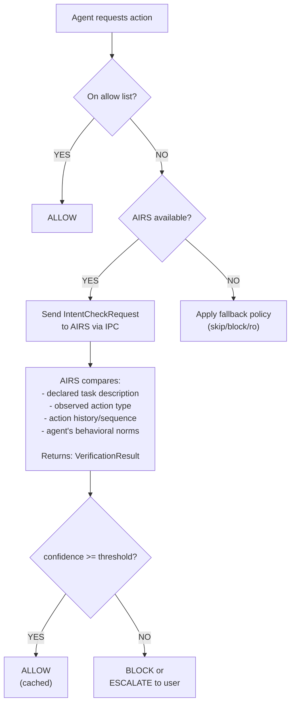
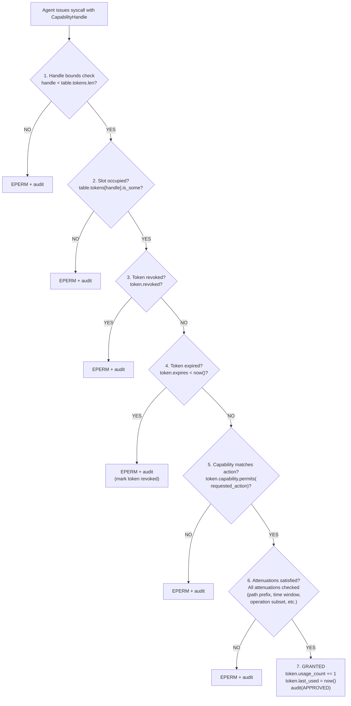
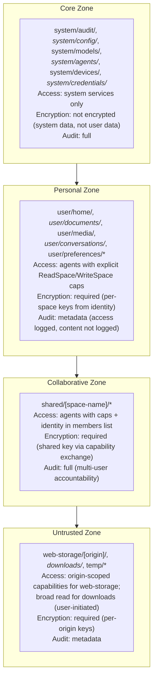
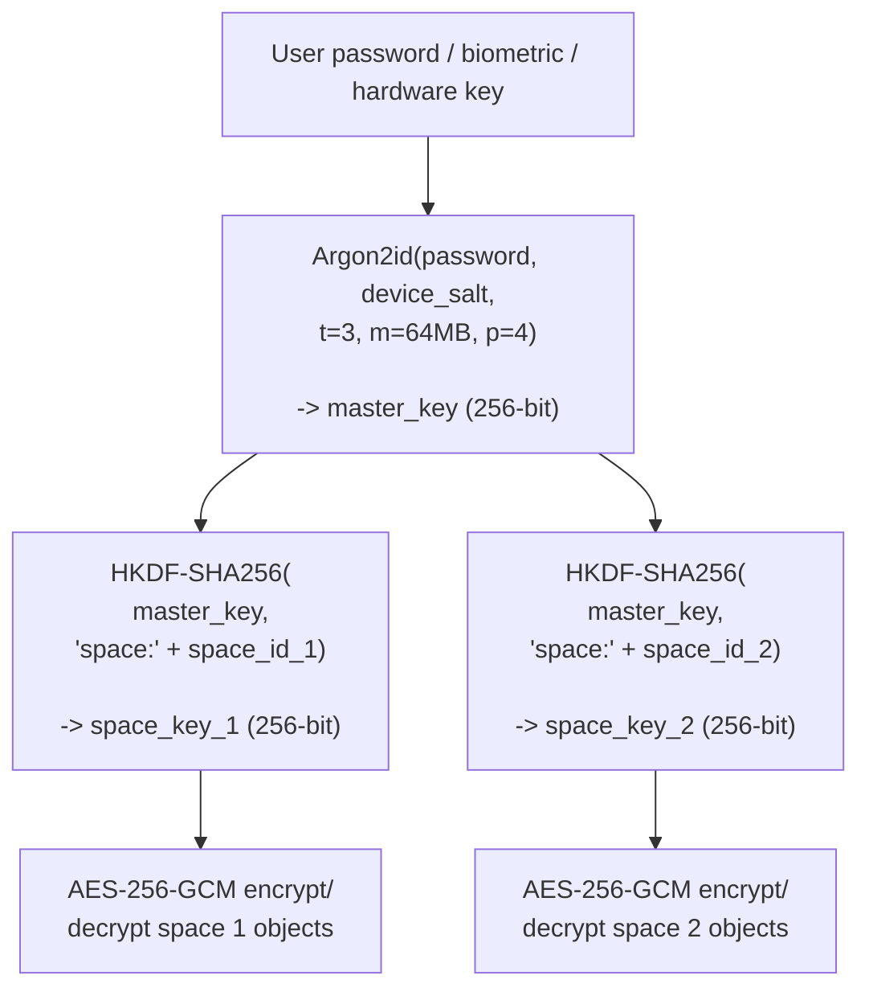
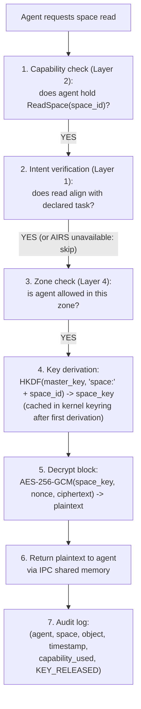

# AIOS Security Defense Layers

Part of: [model.md](../model.md) — AIOS Security Model
**Related:** [capabilities.md](./capabilities.md) — Capability system internals, [hardening.md](./hardening.md) — Crypto and ARM hardware, [operations.md](./operations.md) — Event response and zero trust

-----

## 2. The Eight Security Layers (Deep Dive)

### 2.1 Layer 1: Intent Verification

Intent verification answers: "Is this action consistent with what the agent is supposed to be doing?" This is the AI-powered layer — it uses AIRS to compare observed actions against the agent's declared task.

**Why this layer exists:** Capabilities alone are insufficient. An agent with `ReadSpace("email/")` and `Network(smtp.gmail.com)` has legitimate capabilities for an email agent. But if the user asked "summarize my unread emails" and the agent starts deleting emails and forwarding them to an external address, the capabilities permit it but the intent doesn't. Layer 1 catches this.

```rust
pub struct IntentVerifier {
    airs_channel: ChannelId,
    policy: IntentPolicy,
    cache: LruCache<ActionSignature, VerificationResult>,
}

pub struct IntentPolicy {
    /// How strictly to enforce intent matching
    mode: VerificationMode,
    /// Minimum confidence score to allow action
    threshold: f32,
    /// Actions that always require verification (never cached)
    always_verify: Vec<ActionPattern>,
    /// Actions that are always allowed without verification
    allow_list: Vec<ActionPattern>,
    /// What to do when AIRS is unavailable
    fallback: IntentFallback,
}

pub enum VerificationMode {
    /// Block action until AIRS confirms alignment (synchronous)
    /// Used for: destructive actions, cross-space writes, network sends
    Synchronous,
    /// Allow action, verify in background, revoke if misaligned (async)
    /// Used for: reads, non-destructive operations
    Asynchronous,
    /// Log only, don't block (used during baseline-building period)
    AuditOnly,
}

pub enum IntentFallback {
    /// Skip intent verification, rely on Layer 2+ (default)
    Skip,
    /// Block all non-allowlisted actions
    BlockAll,
    /// Allow reads, block writes
    ReadOnly,
}

pub struct IntentCheckRequest {
    agent: AgentId,
    declared_task: TaskDescription,
    observed_action: ObservedAction,
    context: ActionContext,
}

pub struct ObservedAction {
    action_type: ActionType,
    target: ActionTarget,
    data_volume: u64,
    frequency: f32,         // actions per minute
    sequence: Vec<ActionType>, // recent action history
}

pub enum ActionType {
    SpaceRead, SpaceWrite, SpaceDelete,
    NetworkSend, NetworkReceive,
    InferenceRequest,
    AgentSpawn,
    CredentialUse,
    HardwareAccess(SubsystemId),
}

pub struct VerificationResult {
    allowed: bool,
    confidence: f32,
    reasoning: String,
    recommended_action: RecommendedAction,
}

pub enum RecommendedAction {
    Allow,
    Block,
    RateLimit(Duration),
    RequireUserConfirmation(String),
}
```

**Verification flow:**



**Caching:** High-frequency actions (repeated reads from the same space) are cached after the first verification. The cache key is `(agent_id, action_type, target)`. Cache entries expire after 5 minutes or when the agent's task changes. Destructive actions (writes, deletes, network sends) are never cached if `always_verify` includes them.

**Isolation from AIRS resource orchestration:** AIRS performs two distinct functions — security verification (Layers 1, 3, 5) and resource orchestration (memory pool directives, prefetching, compression scheduling). These operate on separate code paths with a strict priority fence:

```rust
pub enum AirsRequestPriority {
    /// Security checks (intent verification, behavioral analysis, injection detection)
    /// ALWAYS preempt resource operations. Never delayed, never queued behind them.
    Security,
    /// Resource orchestration (pool resize, prefetch, compress)
    /// Yields to security. If AIRS compute is saturated, resource directives
    /// are dropped — the system falls back to static heuristics. Security
    /// checks are never dropped.
    Resource,
}
```

The security path and resource path share no mutable state. A resource decision (e.g., "prefetch this object") never influences an intent verification result, and vice versa. If the resource path is under load — handling memory pressure, processing telemetry — the security path must still respond within its SLA (< 10 ms for synchronous intent checks). The kernel enforces this by routing security IPC on a dedicated high-priority channel separate from the resource directive channel.

### 2.2 Layer 2: Capability Check

The kernel validates capability tokens on every syscall. This is the hard enforcement layer — no AI, no heuristics, no configuration. Either the agent holds a valid token or the action is denied.

```rust
/// Per-process capability table, stored in kernel memory.
/// Agents cannot read or modify this structure.
pub struct CapabilityTable {
    /// Agent that owns this table
    agent: AgentId,
    /// Fixed-size array. Handle is index. O(1) lookup.
    /// Maximum 256 capabilities per agent (configurable).
    tokens: [Option<CapabilityToken>; MAX_CAPS_PER_PROCESS],
    /// Next free slot (for O(1) insertion)
    next_free: u32,
    /// Delegation tracking: which tokens were delegated from this agent
    delegated: Vec<DelegationRecord>,
}

/// Opaque handle that agents use to reference tokens.
/// The handle is an index into the kernel's CapabilityTable.
/// Invalid handle → EPERM + audit log entry.
pub struct CapabilityHandle(u32);

pub struct CapabilityToken {
    id: TokenId,
    capability: Capability,
    holder: AgentId,
    granted_by: Identity,
    created_at: Timestamp,
    expires: Timestamp,
    delegatable: bool,
    attenuations: Vec<Attenuation>,
    revoked: bool,
    parent_token: Option<TokenId>,  // for delegation chains
    usage_count: u64,
    last_used: Timestamp,
}
```

**Token properties:**
- **Unforgeable.** Tokens exist only in kernel memory. Agents hold handles (indices), not tokens. There is no byte sequence an agent can construct that would be accepted as a valid token.
- **Revocable.** The user or kernel can revoke any token at any time. Revocation is immediate — the next syscall using that handle returns EPERM.
- **Transferable (if delegatable).** An agent can delegate a capability to another agent via IPC capability transfer. The delegate's token is always equal to or more restricted than the original.
- **Attenuatable (never expandable).** A token can be restricted further (narrower space path, shorter expiry, fewer operations). It can never be expanded. This is enforced by the kernel — `CapabilityAttenuate` syscall verifies monotonic restriction.
- **Expiring.** Tokens can have a deadline. The kernel checks expiry on every use. Expired tokens are equivalent to revoked tokens.

**Validation flow:**



All seven steps execute in kernel space. No IPC, no context switch, no service call. This is O(1) per check — a table index lookup followed by field comparisons. The audit log write is asynchronous (ring buffer append).

### 2.3 Layer 3: Behavioral Boundary

Even with valid capabilities, an agent's behavior can be anomalous. A compromised email agent with legitimate `ReadSpace("email/")` capability reading every email in the archive at 3 AM is technically permitted by Layer 2 but behaviorally abnormal. Layer 3 catches this.

```rust
pub struct BehavioralMonitor {
    baselines: HashMap<AgentId, BehavioralBaseline>,
    policies: HashMap<AgentId, BehavioralPolicy>,
    airs_channel: ChannelId,
}

pub struct BehavioralBaseline {
    agent: AgentId,
    /// Time-bucketed action frequencies (hourly)
    hourly_profile: [ActionProfile; 24],
    /// Typical targets (spaces, network endpoints)
    usual_targets: HashSet<ActionTarget>,
    /// Typical data volumes per action
    volume_stats: RunningStats,
    /// Typical action sequences
    common_sequences: Vec<ActionSequence>,
    /// Baseline maturity (days of observation)
    observation_days: u32,
    /// Last updated
    updated_at: Timestamp,
}

pub struct ActionProfile {
    read_count: RunningStats,
    write_count: RunningStats,
    network_bytes: RunningStats,
    inference_calls: RunningStats,
    spawn_count: RunningStats,
}

pub struct RunningStats {
    mean: f64,
    variance: f64,
    count: u64,
    min: f64,
    max: f64,
}

pub struct BehavioralPolicy {
    /// Absolute limits (never exceeded regardless of baseline)
    hard_limits: HardLimits,
    /// Statistical detection thresholds
    anomaly_threshold: f64,     // z-score, default 3.0
    /// Response escalation
    response: EscalationPolicy,
}

pub struct HardLimits {
    max_reads_per_minute: u32,
    max_writes_per_minute: u32,
    max_network_bytes_per_minute: u64,
    max_inference_calls_per_minute: u32,
    max_children: u32,
}

pub enum AnomalyType {
    /// Action frequency exceeds baseline by > threshold σ
    FrequencySpike {
        action: ActionType,
        observed: f64,
        baseline_mean: f64,
        z_score: f64,
    },
    /// Data volume exceeds baseline
    VolumeSpike {
        observed_bytes: u64,
        baseline_mean: f64,
        z_score: f64,
    },
    /// Action at unusual time
    TemporalAnomaly {
        hour: u8,
        action: ActionType,
        baseline_frequency: f64,
    },
    /// Access to target never seen before
    NewTarget {
        target: ActionTarget,
        observation_days: u32,
    },
    /// Unusual action sequence
    SequenceAnomaly {
        observed: Vec<ActionType>,
        nearest_known: Vec<ActionType>,
        edit_distance: u32,
    },
}

pub struct EscalationPolicy {
    /// First response: slow down the agent
    level_1: EscalationAction,     // default: RateLimit
    /// Second response: pause the agent
    level_2: EscalationAction,     // default: Pause
    /// Third response: notify the user
    level_3: EscalationAction,     // default: NotifyUser
    /// Escalation timing
    escalate_after: Duration,      // default: 5 minutes at each level
}

pub enum EscalationAction {
    RateLimit { factor: f32 },     // reduce allowed rate by factor
    Pause,                         // suspend agent execution
    NotifyUser { message: String },
    PauseAndNotify { message: String },
    Terminate,
}
```

**Detection methods:**

| Method | What It Catches | How It Works |
|---|---|---|
| Statistical (z-score) | Frequency spikes, volume spikes | Compare current rate to baseline mean/σ. Flag if z > 3.0 |
| Threshold (hard limits) | DoS attempts, resource abuse | Absolute ceiling regardless of baseline. Cannot be exceeded |
| Pattern (sequences) | Unusual workflows, new behaviors | Compare action sequences to known patterns. Flag novel sequences |
| Temporal | Off-hours activity | Compare current-hour activity to same-hour baseline. Flag anomalies |
| Target novelty | New access patterns | Flag access to spaces/endpoints never accessed in observation period |

**Baseline building:** A new agent starts with no baseline. For the first `observation_days` (default: 7), the monitor operates in `AuditOnly` mode — logging behavior but not blocking. Hard limits are still enforced. After the baseline period, statistical detection activates.

#### 2.3.1 AIRS Self-Monitoring (Who Watches the Watcher)

AIRS issues resource orchestration directives (memory pool resizing, prefetch requests, compression scheduling). These directives are themselves actions that can be anomalous — a compromised or confused AIRS could issue pathological directives that degrade system performance. The behavioral monitoring of AIRS itself is handled by the **kernel**, not by AIRS:

```rust
/// Kernel-side monitor for AIRS resource directive behavior.
/// This is NOT part of AIRS — it runs in kernel context.
/// Simple statistical checks, no AI, no LLM inference.
pub struct AirsDirectiveMonitor {
    /// Baseline for AIRS directive rates (built during first 24 hours)
    baseline: AirsDirectiveBaseline,
    /// Hard limits (never exceeded regardless of baseline)
    hard_limits: AirsDirectiveLimits,
    /// Current state
    state: AirsMonitorState,
}

pub struct AirsDirectiveBaseline {
    /// Directives per second by type
    prefetch_rate: RunningStats,
    pool_resize_rate: RunningStats,
    compress_rate: RunningStats,
    /// Total directives per minute
    total_rate: RunningStats,
    /// Typical directive sizes (bytes requested for prefetch, pool delta)
    typical_sizes: RunningStats,
    observation_hours: u32,
}

pub struct AirsDirectiveLimits {
    /// Maximum directives per second (all types combined)
    max_directives_per_second: u32,         // default: 100
    /// Maximum single pool resize delta
    max_pool_resize_bytes: usize,           // default: 64 MB
    /// Maximum prefetch batch size
    max_prefetch_objects: u32,              // default: 50
    /// Maximum fraction of user pool AIRS can direct
    max_user_pool_fraction: f32,           // default: 0.5
}

pub enum AirsMonitorState {
    /// Normal operation — AIRS directives accepted
    Normal,
    /// AIRS directives are rate-limited (mild anomaly detected)
    RateLimited { factor: f32 },
    /// AIRS resource orchestration disabled — kernel uses static heuristics
    /// (plain LRU eviction, no prefetch, fixed pool boundaries)
    Fallback { reason: String, since: Timestamp },
}
```

**Fallback mode:** When the kernel detects anomalous AIRS directive patterns (z-score > 3σ for directive rate, or any hard limit exceeded), it transitions to `Fallback` mode. In fallback:
- Memory management uses plain LRU page eviction (no AI-driven prefetch)
- Pool boundaries remain at their last known-good sizes (no dynamic resizing)
- Compression uses fixed policies (age-based, no AI prioritization)
- AIRS security functions (intent verification, behavioral monitoring, adversarial defense) continue operating — only resource orchestration is disabled
- The system is slower but equally secure

The kernel logs the fallback transition as a security event in the provenance chain and notifies the user: "AIRS resource orchestration paused due to anomalous behavior. Security services remain active."

**Recovery:** AIRS exits fallback mode when its directive rates return to within 2σ of baseline for 10 consecutive minutes. The kernel re-enables resource directives incrementally — first prefetch (lowest risk), then compression scheduling, then pool resizing (highest risk).

### 2.4 Layer 4: Security Zone

Spaces are organized into security zones that determine the base level of protection applied to their contents. Zones create concentric rings of trust — data flows inward (from Untrusted to Core) only through explicit promotion, never automatically.

```rust
pub enum SecurityZone {
    /// System-critical data. Kernel and system services only.
    /// Agent manifests, audit logs, model storage, device registry.
    Core,

    /// User's personal data. Encrypted at rest.
    /// Documents, conversations, preferences, credentials.
    Personal,

    /// Data shared with specific identities.
    /// Collaborative projects, shared spaces.
    Collaborative { members: Vec<IdentityId> },

    /// Data from untrusted sources.
    /// Web storage, downloaded files, data from unknown agents.
    Untrusted,

    /// Ephemeral data (/tmp), auto-cleaned on shutdown.
    Ephemeral,
}

pub struct ZonePolicy {
    zone: SecurityZone,
    /// Who can read data in this zone
    read_access: ZoneAccessRule,
    /// Who can write data in this zone
    write_access: ZoneAccessRule,
    /// Whether data can be promoted to a higher zone
    promotion: PromotionPolicy,
    /// Whether data can be demoted to a lower zone
    demotion: DemotionPolicy,
    /// Encryption requirement
    encryption: EncryptionRequirement,
    /// Audit level
    audit_level: AuditLevel,
}

pub enum ZoneAccessRule {
    /// Only kernel and system services
    SystemOnly,
    /// System services + agents with explicit capability
    CapabilityRequired,
    /// System + agents with cap + specific identities
    IdentityRestricted(Vec<IdentityId>),
}

pub enum PromotionPolicy {
    /// Never promote automatically (Untrusted → Personal)
    RequiresUserApproval,
    /// System services can promote (e.g., verified download → Personal)
    SystemCanPromote,
    /// No promotion possible (Core zone is the top)
    NotApplicable,
}

pub enum EncryptionRequirement {
    Required,
    Optional,
    Forbidden,   // ephemeral/temp data
}

pub enum AuditLevel {
    /// Every access logged with full detail
    Full,
    /// Access logged with metadata only
    Metadata,
    /// Only denials logged
    DenialsOnly,
}
```

**Zone assignment rules:**



**Cross-zone access:** An agent in the Untrusted zone (e.g., a tab agent) cannot read Personal zone data. If a user wants to upload a personal document to a web form, the Flow system mediates: user explicitly selects the file through the OS file picker (not the web page), the file is copied from Personal to a temporary Untrusted-zone object, and the tab agent reads the temporary copy. The tab agent never receives a capability for the Personal zone.

**Promotion:** Moving data from Untrusted to Personal requires user action. A downloaded file starts in `downloads/` (Untrusted). When the user says "save this to my documents," the OS copies the object to `user/documents/` (Personal) — a zone promotion. AIRS can scan the content first (virus/malware check, content classification).

### 2.5 Layer 5: Adversarial Defense

The core principle: **agent instructions come from the kernel, never from data.** This is the control/data plane separation that prevents prompt injection from escalating to system compromise.

```rust
pub struct AdversarialDefense {
    input_screener: InputScreener,
    output_validator: OutputValidator,
    constraint_store: ConstraintStore,
    injection_detector: InjectionDetector,
}

/// Instructions that define agent behavior. Stored in kernel memory.
/// Cannot be modified by the agent itself or by any data the agent processes.
pub struct ConstraintStore {
    /// Per-agent immutable constraints
    constraints: HashMap<AgentId, AgentConstraints>,
}

pub struct AgentConstraints {
    /// From the agent manifest (signed by developer)
    manifest_constraints: ManifestConstraints,
    /// From the capability system (set by kernel at grant time)
    capability_constraints: Vec<CapabilityToken>,
    /// From user preferences (set via Settings/Conversation Bar)
    user_constraints: Vec<UserConstraint>,
}

pub struct ManifestConstraints {
    /// What the agent is allowed to do (positive list)
    allowed_actions: Vec<ActionPattern>,
    /// What the agent must never do (negative list, takes precedence)
    forbidden_actions: Vec<ActionPattern>,
    /// Maximum resource usage
    resource_limits: ResourceLimits,
}

/// Screens data flowing INTO an agent for adversarial content
pub struct InputScreener {
    /// Pattern-based detection (regex, keyword matching)
    patterns: Vec<InjectionPattern>,
    /// ML-based detection (via AIRS, when available)
    ml_detector: Option<ChannelId>,
    /// Action on detection
    response: ScreeningResponse,
}

pub struct InjectionPattern {
    name: String,
    pattern: Regex,
    severity: Severity,
    examples: Vec<String>,
}

pub enum ScreeningResponse {
    /// Strip the detected injection and pass clean data
    Sanitize,
    /// Block the entire input
    Block,
    /// Flag the input and let the agent process it with a warning tag
    Flag,
    /// Log and allow (monitoring mode)
    LogOnly,
}

/// Validates data flowing OUT of an agent
pub struct OutputValidator {
    /// Does the output contain data the agent shouldn't be exfiltrating?
    exfiltration_detector: ExfiltrationDetector,
    /// Does the output match expected format/schema?
    schema_validator: Option<SchemaValidator>,
}

pub struct ExfiltrationDetector {
    /// Known sensitive patterns (credit card numbers, API keys, etc.)
    sensitive_patterns: Vec<SensitivePattern>,
    /// Cross-reference: is this output data that came from a different
    /// space than the agent's declared output space?
    cross_space_check: bool,
}

pub struct InjectionDetector {
    /// Common injection patterns
    patterns: Vec<InjectionPattern>,
    /// Structural analysis: does this data contain instruction-like content?
    structural_analyzer: StructuralAnalyzer,
}
```

**Key design decisions:**

1. **Constraints are in kernel memory.** An agent cannot modify its own constraints. Even a fully "jailbroken" agent (one whose LLM has been convinced to ignore its system prompt) cannot change its capability tokens, its manifest constraints, or its resource limits. Those are kernel objects.

2. **Input screening is defense in depth.** The primary defense against injection is the control/data plane separation — data never becomes instructions at the OS level. Input screening is a secondary defense that catches obvious patterns before they reach the agent's processing logic.

3. **Output validation catches exfiltration.** Even if an agent is tricked into wanting to exfiltrate data, the output validator can detect sensitive patterns (credit card numbers, API key formats) in outbound network data.

4. **Even a jailbroken agent is bounded.** If adversarial input convinces the agent's LLM to "comply with the attacker's instructions," the agent still cannot:
   - Access spaces it has no token for (Layer 2)
   - Exceed its behavioral baseline by much (Layer 3)
   - Read data in zones it can't reach (Layer 4)
   - Decrypt spaces it has no key for (Layer 6)
   - Avoid being logged (Layer 7)
   - Write more than the blast radius limit (Layer 8)

#### 2.5.1 Agent Hint Screening

AIRS resource orchestration accepts optional **hints** from agents — lightweight signals about anticipated resource needs (e.g., "I'm about to process a large batch" or "I need embedding model access soon"). These hints are a new input vector from untrusted agents into a privileged system service. They receive the same adversarial screening as web content:

```rust
/// Screens resource hints before AIRS considers them.
/// Part of the InputScreener pipeline (Layer 5).
pub struct HintScreener {
    /// Rate limit: max hints per agent per minute
    max_hints_per_minute: u32,              // default: 10
    /// Consistency checker: does the hint match the agent's capabilities?
    capability_validator: CapabilityValidator,
    /// Anomaly checker: is the hint consistent with the agent's history?
    history_checker: HintHistoryChecker,
}

pub struct HintValidation {
    /// Is the requested resource within the agent's blast radius limits?
    within_blast_radius: bool,
    /// Does the agent hold capabilities for the resources it's hinting about?
    capabilities_match: bool,
    /// Is the hint volume/rate consistent with the agent's behavioral baseline?
    baseline_consistent: bool,
    /// Is the hint structurally valid (no injection patterns, no probing)?
    structurally_valid: bool,
}

pub enum HintScreeningResult {
    /// Hint is valid — AIRS may consider it for resource optimization
    Accept,
    /// Hint exceeds agent's limits — silently ignored, logged
    Ignore { reason: String },
    /// Hint pattern is suspicious — agent flagged for monitoring
    Flag { reason: String },
    /// Hint rate exceeded — agent's hint channel throttled
    Throttle { until: Timestamp },
}
```

**Screening rules:**

1. **Blast radius ceiling.** A hint requesting more resources than the agent's `BlastRadiusPolicy` allows is silently ignored. The agent doesn't learn whether its hint was rejected — it just doesn't observe any change (resource allocation opacity).

2. **Capability consistency.** A hint about space objects the agent has no `ReadSpace` token for is rejected and logged as a security event. This pattern (hinting about resources you can't access) suggests probing.

3. **Rate limiting.** More than `max_hints_per_minute` hints triggers throttling. An agent submitting 50 hints/second is either broken or probing AIRS's response behavior.

4. **No feedback channel.** Agents submit hints via a fire-and-forget IPC message. There is no response — AIRS never confirms or denies that a hint was acted upon. This prevents agents from using hints as a side channel to probe system state.

### 2.6 Layer 6: Cryptographic Enforcement

Even if an agent somehow bypasses capability checks (kernel bug), it still cannot read encrypted space data without the decryption key. Keys are managed by the kernel and released only after authentication, intent verification, and capability checks all pass.

**Key derivation chain:**



**Encryption details:**

```rust
pub struct CryptoCore {
    /// Master key — lives only in kernel keyring, never leaves kernel memory
    master_key: MasterKey,
    /// Derived space keys — cached in kernel keyring after first derivation
    space_keys: HashMap<SpaceId, SpaceKey>,
    /// Signing key — Ed25519, generated at first boot
    signing_key: Ed25519SigningKey,
}

pub struct SpaceKey {
    key: [u8; 32],              // AES-256 key
    space: SpaceId,
    version: u32,               // for key rotation
    derived_at: Timestamp,
}

pub enum EncryptionAlgorithm {
    /// Primary: hardware-accelerated on ARM via Cryptography Extensions
    Aes256Gcm,
    /// Fallback: pure software, constant-time
    ChaCha20Poly1305,
}

pub struct EncryptedBlock {
    algorithm: EncryptionAlgorithm,
    nonce: [u8; 12],            // unique per block
    ciphertext: Vec<u8>,
    tag: [u8; 16],              // authentication tag (GCM or Poly1305)
    key_version: u32,
}
```

**Key release protocol:**



**Key release is logged.** The audit chain records every time a space key is used to decrypt data, linking it to the agent, capability, and intent that authorized the decryption.

**Re-encryption on access revocation:** When a user revokes an agent's access to a space, the space key is rotated. All data in the space is re-encrypted with the new key in the background. The revoked agent's cached copy of the old key (if it somehow retained one — it shouldn't, since keys never leave the kernel) becomes useless.

### 2.7 Layer 7: Provenance Recording

Every action by every agent is recorded in a tamper-evident, append-only chain. This is not optional logging — it is a kernel-enforced invariant. An agent cannot perform an action without that action being recorded.

```rust
pub struct ProvenanceRecord {
    /// Unique record identifier
    id: RecordId,
    /// Who performed the action
    agent_id: AgentId,
    /// What action was performed
    action: ProvenanceAction,
    /// What was the target
    target: ProvenanceTarget,
    /// When
    timestamp: Timestamp,
    /// What was the result
    result: ActionResult,
    /// Which capability authorized this action
    capability_used: Option<TokenId>,
    /// Hash of the previous record (Merkle chain link)
    prev_hash: Hash,
    /// Hash of this record (SHA-256 of all above fields + prev_hash)
    record_hash: Hash,
    /// Kernel signature (Ed25519)
    signature: Signature,
}

pub enum ProvenanceAction {
    SpaceRead { space: SpaceId, object: ObjectId },
    SpaceWrite { space: SpaceId, object: ObjectId, content_hash: Hash },
    SpaceDelete { space: SpaceId, object: ObjectId },
    SpaceCreate { space: SpaceId, name: String, zone: SecurityZone },
    NetworkConnect { destination: String, protocol: Protocol },
    NetworkSend { destination: String, bytes: u64 },
    InferenceRequest { model: ModelId, tokens: u32 },
    AgentSpawn { child: AgentId, manifest_hash: Hash },
    CapabilityGrant { token: TokenId, to: AgentId },
    CapabilityRevoke { token: TokenId },
    CapabilityUse { token: TokenId, action: String },
    HardwareAccess { subsystem: SubsystemId, device: DeviceId },
    AuthenticationAttempt { method: AuthMethod, success: bool },
    SecurityEvent { event_type: SecurityEventType, details: String },
}

pub enum ProvenanceTarget {
    Space(SpaceId),
    Object(ObjectId),
    Agent(AgentId),
    Network(String),
    Device(DeviceId),
    System,
}

pub enum ActionResult {
    Success,
    Denied { reason: DenialReason },
    Error { code: ErrorCode },
}

pub struct MerkleChain {
    /// The chain itself — append-only, stored in system/audit/provenance/
    records: Vec<ProvenanceRecord>,
    /// Current chain head hash
    head_hash: Hash,
    /// Chain length
    length: u64,
    /// Kernel signing key for chain integrity (Ed25519).
    /// Loaded from secure storage at boot; private key never leaves kernel.
    signing_key: Ed25519SigningKey,
}

impl MerkleChain {
    pub fn append(&mut self, record: &mut ProvenanceRecord) -> Result<()> {
        // 1. Set prev_hash to current head
        record.prev_hash = self.head_hash;

        // 2. Compute record hash
        record.record_hash = sha256(
            &record.agent_id,
            &record.action,
            &record.target,
            &record.timestamp,
            &record.result,
            &record.capability_used,
            &record.prev_hash,
        );

        // 3. Sign with kernel key
        record.signature = self.signing_key.sign(&record.record_hash);

        // 4. Update head
        self.head_hash = record.record_hash;
        self.length += 1;

        // 5. Persist to audit space
        self.records.push(record.clone());
        Ok(())
    }

    pub fn verify_integrity(&self) -> Result<()> {
        let mut expected_prev = Hash::zero(); // genesis
        for record in &self.records {
            if record.prev_hash != expected_prev {
                return Err(ChainIntegrityViolation {
                    record: record.id,
                    expected: expected_prev,
                    found: record.prev_hash,
                });
            }
            let computed = sha256(/* fields */);
            if record.record_hash != computed {
                return Err(RecordTampered { record: record.id });
            }
            if !self.signing_key.verify(&record.record_hash, &record.signature) {
                return Err(SignatureInvalid { record: record.id });
            }
            expected_prev = record.record_hash;
        }
        Ok(())
    }
}

/// Query API for the provenance chain
pub struct AuditQuery {
    agent: Option<AgentId>,
    action_type: Option<ProvenanceAction>,
    target: Option<ProvenanceTarget>,
    time_range: Option<(Timestamp, Timestamp)>,
    result: Option<ActionResult>,
    limit: u32,
}
```

**Tamper detection:** The Merkle chain makes tampering evident. Modifying any record changes its hash, which invalidates the next record's `prev_hash`, breaking the chain. The kernel runs periodic integrity checks (configurable, default: every 6 hours). Any break in the chain triggers a critical security alert.

**Storage:** The provenance chain lives in `system/audit/provenance/` (Core zone). Only the kernel can write to it. Agents can read it via `AuditRead` capability. The Inspector queries it via the `AuditQuery` API.

**Performance:** Provenance records are written to a kernel ring buffer first (non-blocking, ~100ns), then flushed to the audit space asynchronously. The ring buffer holds 10,000 records. If the flush falls behind, the oldest unflushed records are prioritized. Provenance recording never blocks the critical path of an agent's syscall.

#### 2.7.1 AIRS Resource Directive Provenance

AIRS resource orchestration directives — prefetch requests, pool resize commands, compression scheduling decisions — are logged in the provenance chain alongside agent actions. Every directive that AIRS issues is a `ProvenanceAction`:

```rust
/// Additional ProvenanceAction variants for resource orchestration directives,
/// logged in the provenance chain. The agent_id field is set to AIRS's service AgentId.
/// (See §2.7 above for the base ProvenanceAction enum definition.)

    /// AIRS directed a prefetch of space objects into memory
    ResourcePrefetch {
        objects: Vec<ObjectId>,
        reason: PrefetchReason,
        triggered_by: Option<AgentId>,      // which agent's activity triggered this
    },
    /// AIRS resized a memory pool boundary
    ResourcePoolResize {
        pool: PoolId,
        old_size: usize,
        new_size: usize,
        reason: ResizeReason,
    },
    /// AIRS scheduled compression of space blocks
    ResourceCompress {
        space: SpaceId,
        blocks: u32,
        algorithm: CompressionAlgorithm,
        reason: CompressReason,
    },
    /// AIRS entered or exited kernel-imposed fallback mode
    ResourceFallbackTransition {
        entered: bool,
        reason: String,
    },
    /// AIRS processed an agent resource hint
    ResourceHintReceived {
        from_agent: AgentId,
        hint_summary: String,
        screening_result: HintScreeningResult,
    },
}
```

**Why log resource directives:** If the system behaves unexpectedly — an agent runs slower than usual, a space object takes longer to load, memory pressure increases without obvious cause — the provenance chain shows exactly what AIRS decided and when. The Inspector displays resource directive history alongside agent action history, making it possible to correlate "Research Assistant slowed down" with "AIRS resized Model Pool +512 MB at the same time."

**Directive provenance is compactable.** Unlike security events (which are never compacted), resource directives follow the standard tiered retention: full detail for 7 days, summarized for 90 days, hash-only after that. Resource directives are high-volume, low-severity events — useful for debugging but not forensically critical.

#### 2.7.2 Audit Retention and Chain Compaction

The append-only Merkle chain grows without bound — a busy system with many agents can generate millions of records per day. On a Pi with a 32 GB SD card, unbounded audit storage would eventually consume all available space. AIOS uses **tiered retention** to manage audit storage while preserving the chain's tamper-evidence guarantees.

```rust
pub enum AuditRetentionTier {
    /// Full detail — every field of every record preserved
    /// Default: 7 days
    Full { window: Duration },

    /// Summarized — records grouped by agent and hour, individual records
    /// replaced with aggregate summaries. Chain hashes preserved.
    /// Default: 90 days
    Summarized { window: Duration },

    /// Hash-only — only the chain of record_hash + prev_hash + signature
    /// is kept. Record payloads (agent_id, action, target, result) are dropped.
    /// Tamper-evidence is preserved: the hash chain can still be verified.
    /// Default: indefinite
    HashOnly,
}

pub struct AuditRetentionPolicy {
    full_window: Duration,              // default: 7 days
    summary_window: Duration,           // default: 90 days
    /// Security events are NEVER compacted (capability violations, injection
    /// attempts, PAC/BTI faults, chain integrity violations)
    exempt_events: Vec<SecurityEventType>,
    /// Maximum total audit storage (triggers emergency compaction)
    max_storage: u64,                   // default: 500 MB
}

pub struct AuditSummary {
    /// Time range covered
    time_range: (Timestamp, Timestamp),
    /// Agent → action counts
    agent_activity: HashMap<AgentId, ActionCounts>,
    /// Security events (kept in full, never summarized)
    security_events: Vec<ProvenanceRecord>,
    /// Chain anchor: hash of the first record in this summary range
    chain_start_hash: Hash,
    /// Chain anchor: hash of the last record in this summary range
    chain_end_hash: Hash,
    /// Signature over the summary (kernel Ed25519)
    signature: Signature,
}

pub struct ActionCounts {
    space_reads: u64,
    space_writes: u64,
    space_deletes: u64,
    network_connects: u64,
    network_bytes_sent: u64,
    inference_requests: u64,
    capability_uses: u64,
    denied_actions: u64,
}
```

**How compaction preserves chain integrity:**

```text
Full chain (Day 1-7):
  R1 ← R2 ← R3 ← R4 ← R5 ← R6 ← R7 ← ... ← R_n
  (all fields present, all verifiable)

After compaction (Day 8+, records from Day 1 summarized):
  [Summary(R1..R1000)] → H1 ← H2 ← H3 ← ... ← H1000
  (summary has aggregate counts + security events in full)
  (hash chain H1..H1000 still verifiable — prev_hash links intact)
  (individual record payloads dropped — agent_id, action details gone)

After deep compaction (Day 91+):
  [chain_start_hash] → [chain_end_hash]
  (only the hash chain endpoints are kept as anchors)
  (tamper-evidence: any modification to records in the full or
   summarized tiers would break the chain to these anchor points)
```

**Security events are exempt.** Capability violations, injection detections, PAC/BTI faults, authentication failures, and chain integrity alerts are never compacted — they remain in full detail indefinitely. These are the records most likely to be needed for forensic investigation.

**Emergency compaction:** If audit storage exceeds `max_storage` (default 500 MB), the retention windows are compressed (full: 3 days, summary: 30 days) until storage drops below 80% of the limit. A notification is sent to the user: "Audit storage limit reached. Older audit records have been compacted."

### 2.8 Layer 8: Blast Radius Containment

The last line of defense. Even if every other layer fails — if the agent has valid capabilities, passes intent verification, has a normal behavioral profile, is in the right zone, isn't injection-affected, has the decryption key, and its actions are being logged — the damage it can do in a given time window is still bounded.

```rust
pub struct BlastRadiusPolicy {
    agent: AgentId,

    // --- Write limits ---
    /// Maximum objects writable per time window
    max_writes_per_window: u32,         // default: 1000
    /// Time window for write limit
    write_window: Duration,             // default: 1 hour
    /// Maximum total bytes writable per window
    max_write_bytes_per_window: u64,    // default: 100 MB

    // --- Delete limits ---
    /// Maximum objects deletable per window
    max_deletes_per_window: u32,        // default: 10
    /// Bulk delete threshold (triggers auto-snapshot)
    bulk_delete_threshold: u32,         // default: 5

    // --- Network limits ---
    /// Maximum outbound bytes per window
    max_outbound_bytes_per_window: u64, // default: 50 MB
    /// Maximum unique destinations per window
    max_destinations_per_window: u32,   // default: 10

    // --- Resource limits ---
    /// Maximum memory (RSS) for this agent + children
    max_memory: usize,                  // default: 256 MB
    /// Maximum CPU usage (percentage of one core)
    max_cpu_percent: u32,               // default: 50%
    /// Maximum child agents
    max_children: u32,                  // default: 4
    /// Maximum IPC messages per second
    max_ipc_rate: u32,                  // default: 1000

    // --- Recovery ---
    /// Auto-snapshot before bulk operations
    auto_snapshot: bool,                // default: true
    /// Rollback window — how long changes are reversible
    rollback_window: Duration,          // default: 24 hours
}

pub struct BlastRadiusTracker {
    policy: BlastRadiusPolicy,

    /// Sliding window counters
    writes_in_window: SlidingCounter,
    write_bytes_in_window: SlidingCounter,
    deletes_in_window: SlidingCounter,
    outbound_bytes_in_window: SlidingCounter,
    destinations_in_window: SlidingSet<String>,

    /// Current resource usage
    current_memory: usize,
    current_cpu: f32,
    child_count: u32,

    /// Handle to the Space Service for auto-snapshot requests via IPC.
    space_service: SpaceServiceHandle,
}

impl BlastRadiusTracker {
    pub fn check_write(&mut self, bytes: u64) -> Result<()> {
        if self.writes_in_window.count() >= self.policy.max_writes_per_window {
            return Err(BlastRadiusExceeded::WriteCount);
        }
        if self.write_bytes_in_window.total() + bytes
            > self.policy.max_write_bytes_per_window {
            return Err(BlastRadiusExceeded::WriteBytes);
        }
        self.writes_in_window.increment();
        self.write_bytes_in_window.add(bytes);
        Ok(())
    }

    pub fn check_delete(&mut self, count: u32) -> Result<()> {
        if count >= self.policy.bulk_delete_threshold && self.policy.auto_snapshot {
            // Trigger auto-snapshot before bulk delete
            self.space_service.create_snapshot(SnapshotTrigger::PreBulkOperation)?;
        }
        if self.deletes_in_window.count() + count
            > self.policy.max_deletes_per_window {
            return Err(BlastRadiusExceeded::DeleteCount);
        }
        self.deletes_in_window.add(count);
        Ok(())
    }
}
```

**Auto-snapshot:** Before any operation that touches more than `bulk_delete_threshold` objects, the system automatically creates a space snapshot. If the operation is malicious, the user can roll back to the pre-operation state within the rollback window (default: 24 hours).

**Rollback:** All modifications within the rollback window are stored in the Version Store. Rolling back means reverting each modified object to its pre-operation version. The provenance chain records the rollback itself, so there's a full audit trail.
