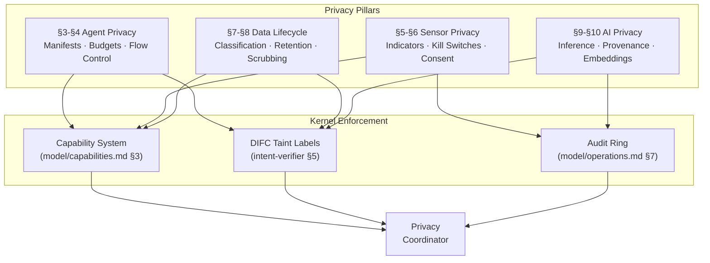

# AIOS Privacy Architecture

**Audience:** Kernel developers, platform developers, security reviewers
**Scope:** Cross-system privacy coordination — consent, indicators, data lifecycle, agent containment, AI privacy
**Related:** [model.md](./model.md) — Security model (8 layers, trust levels), [adversarial-defense.md](./adversarial-defense.md) — Adversarial defense, [model/capabilities.md](./model/capabilities.md) — Capability system

---

## Document Map

| Document | Sections | Content |
|---|---|---|
| **This file** | §1, §2, §15, §16 | Core insight, architecture overview, implementation order, design principles |
| [agent-privacy.md](./privacy/agent-privacy.md) | §3, §4 | Privacy manifests, budgets, cross-agent data flow, collusion detection |
| [sensor-privacy.md](./privacy/sensor-privacy.md) | §5, §6 | Sensor indicator coordination, hardware privacy, consent flow |
| [data-lifecycle.md](./privacy/data-lifecycle.md) | §7, §8 | Data classification, retention, scrubbing, encryption zones, DLP |
| [ai-privacy.md](./privacy/ai-privacy.md) | §9, §10 | Inference privacy, model provenance, embedding privacy, prompt injection |
| [intelligence.md](./privacy/intelligence.md) | §11, §12 | Kernel-internal ML, AIRS-dependent privacy intelligence |
| [testing.md](./privacy/testing.md) | §13, §14 | Privacy property testing, POSIX compatibility, cross-reference index |

---

## §1 Core Insight

Traditional operating systems treat privacy as an application-layer concern: apps request permissions, the OS grants or denies. AIOS inverts this. Privacy enforcement is **structural** — distributed across the kernel (capability system, IPC taint labels, hardware indicator control), the intelligence layer (behavioral monitoring, intent verification), and the storage layer (encryption zones, data classification). No single component "owns" privacy. Every subsystem enforces its own privacy invariants independently, providing defense in depth even when individual layers fail.

AIOS privacy rests on four independent pillars:

1. **Agent Privacy** — What agents can access, how much, and for what purpose. Enforced through privacy manifests, privacy budgets, and cross-agent data flow control via DIFC taint labels.
2. **Sensor Privacy** — Hardware indicators as hard gates. Camera LEDs, microphone indicators, and kill switches are kernel-controlled and non-overridable. Consent is explicit, scoped, and revocable.
3. **Data Lifecycle Privacy** — How long data exists and in what form. Classification, retention policies, scrubbing pipelines, and encryption zones ensure data does not outlive its purpose.
4. **AI Privacy** — On-device inference, model provenance, embedding isolation, and defense against prompt injection as a privacy threat. No user data leaves the device for inference or training.

Any three pillars can fail while the fourth still provides meaningful protection. An agent that bypasses its privacy budget still cannot capture sensor data without the hardware indicator activating. A compromised sensor path still cannot exfiltrate data if the taint labels block network egress. A sophisticated prompt injection attack still cannot access data outside the agent's encrypted space.



---

## §2 Architecture Overview

### §2.1 Privacy Domains

The four privacy pillars map to four `PrivacyDomain` values. Each domain operates independently with its own enforcement mechanisms, but the `PrivacyCoordinator` synchronizes cross-domain state when privacy-relevant events span multiple subsystems.

```rust
/// Privacy domain classification.
/// Each domain has independent enforcement but cross-domain
/// coordination occurs through PrivacyCoordinator.
#[repr(u8)]
pub enum PrivacyDomain {
    /// Agent data access control: manifests, budgets, flow control.
    Agent = 0,
    /// Sensor hardware privacy: indicators, kill switches, consent.
    Sensor = 1,
    /// Data lifecycle: classification, retention, scrubbing.
    DataLifecycle = 2,
    /// AI/ML privacy: inference isolation, model provenance, embeddings.
    AiPrivacy = 3,
}
```

### §2.2 Privacy Coordinator

The `PrivacyCoordinator` is a kernel-space service that synchronizes privacy state across subsystems. It does not make policy decisions — those belong to individual subsystems and the capability system. Instead, it ensures consistency when a privacy-relevant event affects multiple domains.

Examples of cross-domain coordination:
- When a camera session starts, the coordinator notifies the audio subsystem to check if microphone consent is also needed (multi-sensor capture scenarios).
- When a user revokes an agent's privacy consent, the coordinator triggers budget reset, active sensor session termination, and data scrubbing for that agent across all subsystems.
- When the Context Engine detects a public WiFi environment, the coordinator tightens network-bound privacy budgets system-wide.

```rust
/// Cross-domain privacy coordination.
/// Runs as a kernel service; does not make policy decisions.
pub struct PrivacyCoordinator {
    /// Active sensor sessions by domain.
    active_sensors: [SensorState; MAX_SENSOR_TYPES],
    /// Per-agent privacy budget state.
    agent_budgets: BTreeMap<AgentId, PrivacyBudgetState>,
    /// Consent state cache (source of truth is Preferences service).
    consent_cache: ConsentCache,
    /// Event subscribers for privacy state changes.
    subscribers: Vec<PrivacySubscriber>,
}
```

### §2.3 Privacy Events

Every privacy-relevant action produces a `PrivacyEvent` that flows through the audit ring (see [model/operations.md](./model/operations.md) §7). Privacy events are non-suppressible — even a compromised agent cannot prevent its privacy actions from being logged.

```rust
/// Audit event for privacy-relevant actions.
/// Logged to system/audit/privacy/ space.
pub struct PrivacyEvent {
    pub timestamp: Timestamp,
    pub domain: PrivacyDomain,
    pub agent_id: AgentId,
    pub event_type: PrivacyEventType,
    pub details: [u8; 128],
}

pub enum PrivacyEventType {
    /// Agent privacy events
    ManifestRegistered,
    BudgetExhausted,
    BudgetOverrideRequested,
    TaintLabelBlocked,
    CollusionSuspected,

    /// Sensor privacy events
    SensorSessionStarted,
    SensorSessionDenied,
    ConsentGranted,
    ConsentRevoked,
    KillSwitchEngaged,
    IndicatorActivated,

    /// Data lifecycle events
    DataClassified,
    RetentionExpired,
    ScrubCompleted,
    ErasureRequested,
    CrossZoneBlocked,

    /// AI privacy events
    InferenceSessionIsolated,
    ModelProvenanceVerified,
    EmbeddingAccessAudited,
    InjectionPrivacyThreat,
}
```

### §2.4 Mapping to Security Layers

Privacy enforcement maps onto the eight security layers from [model/layers.md](./model/layers.md) §2:

| Security Layer | Privacy Role | Enforcement |
|---|---|---|
| Layer 1: Hardware | Kill switches, LED indicators | GPIO kernel control, non-overridable |
| Layer 2: Capability System | Privacy budgets, consent tokens | `CapabilityToken` with privacy attenuation |
| Layer 3: IPC + Taint Labels | Cross-agent flow control | `PrivacyTaintLabel` on `LabelSet` |
| Layer 4: Security Zones | Cross-zone data boundaries | Zone crossing rules in taint system |
| Layer 5: Adversarial Defense | Prompt injection as privacy threat | Privacy-aware screening rules |
| Layer 6: Behavioral Monitor | Privacy anomaly detection | Budget spikes, access pattern deviations |
| Layer 7: Intent Verification | Manifest compliance checking | Declared vs. observed data flows |
| Layer 8: AIRS Intelligence | Contextual privacy adaptation | Dynamic budget, agent scoring |

### §2.5 Trust Levels and Privacy

Privacy enforcement varies by trust level (see [model.md](./model.md) §1.2):

| Trust Level | Privacy Posture | Budget | Consent |
|---|---|---|---|
| TL0 (Kernel) | No restrictions | Unlimited | N/A |
| TL1 (System Services) | Audit-only | Large, audited | Implicit (system purpose) |
| TL2 (Native Agents) | Standard enforcement | Default budgets | One-time explicit consent |
| TL3 (Third-Party Agents) | Strict enforcement | Restrictive budgets | Per-session or temporal consent |
| TL4 (Web Content) | Maximum restriction | Minimal budgets | Per-action consent |

---

## §15 Implementation Order

Privacy features are distributed across multiple phases, following the subsystem dependencies:

| Phase | Privacy Component | Dependency | Observable Result |
|---|---|---|---|
| Phase 3 | Capability-gated access control | Phase 2 (memory) | Agents cannot access resources without tokens |
| Phase 6 | Framebuffer privacy indicators | Phase 4 (storage) | Privacy dot rendered in framebuffer |
| Phase 7 | Compositor indicator bar | Phase 6 (GPU) | Non-obscurable privacy indicator overlay |
| Phase 9 | Network taint enforcement | Phase 9 (networking) | Tainted IPC blocked at NTM egress (mesh and bridge) |
| Phase 13 | Conversational consent UI | Phase 12 (preferences) | User prompted for sensor consent |
| Phase 14 | Privacy manifests + budgets | Phase 13 (agents) | Agent install shows privacy declaration |
| Phase 15 | AIRS privacy intelligence | Phase 14 (AIRS) | Contextual budget adaptation |
| Phase 18 | Intent verification + DIFC | Phase 17 (intent verifier) | Cross-agent flow blocked by taint labels |
| Phase 28 | Power-aware privacy | Phase 27 (power mgmt) | Kill switch detection via GPIO |
| Phase 33 | Camera/audio hardware privacy | Phase 32 (camera) | Hardware LED before first frame |
| Phase 34 | Accessibility privacy | Phase 33 (accessibility) | Screen reader announces active sensors |
| Phase 35 | Model provenance attestation | Phase 34 (secure boot) | Boot-time model integrity check |
| Phase 38 | Cross-device privacy sync | Phase 37 (multi-device) | Privacy consent synced across devices |
| Phase 39 | Enterprise DLP + compliance | Phase 38 (enterprise) | GDPR erasure across fleet |

---

## §16 Design Principles

1. **Hardware over software.** Hardware indicators (LEDs, kill switches) are preferred over software indicators. Software indicators supplement but never replace hardware. No software path can bypass a hardware kill switch.

2. **Structural over heuristic.** Privacy enforcement through architectural invariants (capability checks, taint labels, encryption zones) rather than pattern matching that can be evaded. Heuristic detection (behavioral anomaly, ML classifiers) supplements but never replaces structural enforcement.

3. **Local by default.** All data stays on-device unless the user explicitly consents to transfer. All inference is on-device. No cloud dependency for privacy enforcement. The privacy system operates at full capability with no network connection.

4. **Defense in depth.** Four independent privacy pillars (Agent, Sensor, Data, AI), each providing protection even if the other three fail. No privacy guarantee depends on a single mechanism.

5. **Auditable.** Every privacy-relevant action produces a non-suppressible audit entry. Users can inspect and query their privacy history through natural language ("What data has agent X accessed this week?").

6. **User sovereignty.** The user can always override, inspect, and revoke privacy decisions. No agent, service, or enterprise policy can silently reduce privacy below the user's configured floor. Enterprise policies can raise the floor (more restrictive) but never lower it.

7. **Fail closed.** When privacy state is uncertain (AIRS unavailable, indicator status unknown, consent cache stale), default to maximum restriction. Grant access only when all privacy checks pass positively.

8. **Minimal exposure.** Agents receive only the data they need at the precision they need. Location is coarsened to the declared precision. Sensor access is scoped to the declared purpose and duration. Privacy budgets limit the volume of sensitive data an agent can access.

9. **Compositional.** Privacy guarantees compose across subsystems. If subsystem A guarantees property X and subsystem B guarantees property Y, the combined system guarantees both X and Y. Privacy is not an emergent property that can be weakened by composition.

10. **Transparent.** Users always know which sensors are active, which agents are accessing their data, and what data has been shared. The system never hides privacy-relevant state from the user.

---

## Cross-Reference Index

| Section | Sub-Document | Topic |
|---|---|---|
| §1 | This file | Core insight: four-pillar privacy |
| §2 | This file | Architecture overview, coordinator, events |
| §3.1–§3.3 | [agent-privacy.md](./privacy/agent-privacy.md) | Privacy manifests, budgets, flow control |
| §4.1–§4.3 | [agent-privacy.md](./privacy/agent-privacy.md) | Agent collusion detection |
| §5.1–§5.4 | [sensor-privacy.md](./privacy/sensor-privacy.md) | Sensor indicator coordination |
| §6.1–§6.3 | [sensor-privacy.md](./privacy/sensor-privacy.md) | Hardware privacy, consent flow |
| §7.1–§7.4 | [data-lifecycle.md](./privacy/data-lifecycle.md) | Classification, retention, scrubbing, erasure |
| §8.1–§8.3 | [data-lifecycle.md](./privacy/data-lifecycle.md) | Encryption zones, DLP, cross-zone boundaries |
| §9.1–§9.4 | [ai-privacy.md](./privacy/ai-privacy.md) | Inference, provenance, ML, embeddings |
| §10.1–§10.2 | [ai-privacy.md](./privacy/ai-privacy.md) | Prompt injection as privacy threat |
| §11.1–§11.3 | [intelligence.md](./privacy/intelligence.md) | Kernel-internal ML for privacy |
| §12.1–§12.4 | [intelligence.md](./privacy/intelligence.md) | AIRS-dependent privacy intelligence |
| §13.1–§13.3 | [testing.md](./privacy/testing.md) | Privacy property and regression testing |
| §14.1–§14.2 | [testing.md](./privacy/testing.md) | POSIX compatibility, cross-reference index |
| §15 | This file | Implementation order |
| §16 | This file | Design principles |
