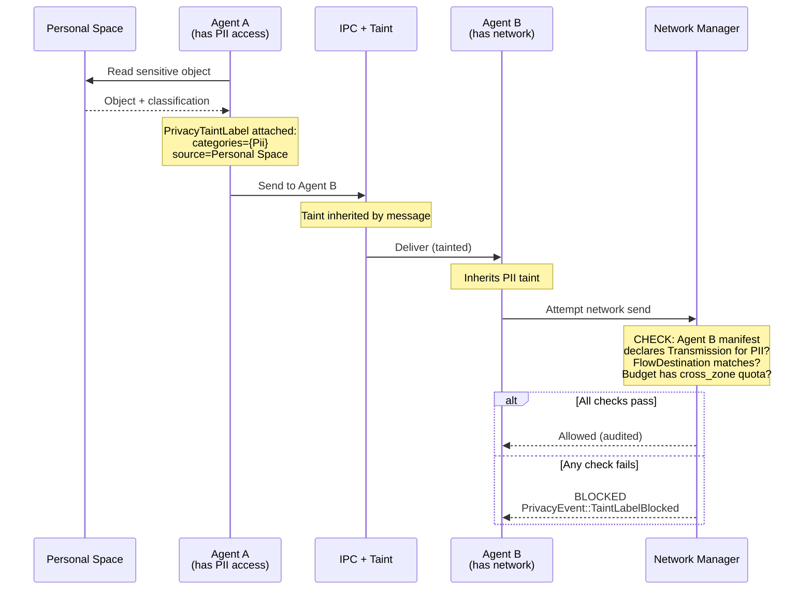

# AIOS Agent Privacy

Part of: [privacy.md](../privacy.md) — Privacy Architecture
**Related:** [sensor-privacy.md](./sensor-privacy.md) — Sensor & hardware privacy, [data-lifecycle.md](./data-lifecycle.md) — Data lifecycle privacy

---

## §3 Agent Privacy Model

Every agent in AIOS operates within a privacy boundary defined by three mechanisms: a **privacy manifest** (what the agent declares it will access), a **privacy budget** (quantitative limits on data access), and **cross-agent flow control** (taint labels that prevent data exfiltration through agent cooperation). These mechanisms compose with the capability system ([model/capabilities.md](../model/capabilities.md) §3) — privacy restrictions are layered on top of capability checks, never instead of them.

### §3.1 Privacy Manifests

Every agent must declare a `PrivacyManifest` at installation time. The manifest is the privacy counterpart to the capability manifest — it declares what sensitive data categories the agent will access, for what purpose, with what retention policy, and to what destinations. Unlike advisory systems (Android Data Safety, Apple Privacy Nutrition Labels), AIOS privacy manifests are **kernel-enforced**: the Intent Verifier ([intent-verifier/specification.md](../../intelligence/intent-verifier/specification.md) §3) cross-checks observed data flows against the manifest at runtime. Violations trigger escalation.

```rust
/// Privacy manifest declared by every agent at installation.
/// Kernel-enforced — observed data flows are cross-checked against declarations.
pub struct PrivacyManifest {
    /// Agent identifier.
    pub agent_id: AgentId,
    /// Data categories this agent accesses.
    pub data_access: Vec<DataAccessDeclaration>,
    /// Maximum retention tier for any data this agent handles.
    pub max_retention: RetentionTier,
    /// Network destinations this agent may contact (empty = local-only).
    pub flow_destinations: Vec<FlowDestination>,
    /// Privacy manifest version (for upgrade tracking).
    pub manifest_version: u32,
    /// Cryptographic signature from agent developer.
    pub signature: [u8; 64],
}

/// Declaration of a single data access category.
pub struct DataAccessDeclaration {
    /// What category of data is accessed.
    pub category: DataCategory,
    /// Why this data is needed.
    pub purpose: DataPurpose,
    /// How long data is retained.
    pub retention: RetentionTier,
    /// Whether data leaves the device.
    pub network_bound: bool,
}

/// Sensitive data categories tracked by the privacy system.
/// Extends SensitivityLevel from multi-device/data-protection.md §9.1
/// with agent-specific categories.
#[repr(u8)]
pub enum DataCategory {
    /// Personally identifiable information (name, email, phone).
    Pii = 0,
    /// Financial data (accounts, transactions, payment methods).
    Financial = 1,
    /// Health and medical records.
    Health = 2,
    /// Location data (GPS, WiFi, IP-derived).
    Location = 3,
    /// Biometric data (face, voice, fingerprint).
    Biometric = 4,
    /// Credentials and authentication tokens.
    Credentials = 5,
    /// Conversation history and messages.
    ConversationHistory = 6,
    /// Source code and intellectual property.
    SourceCode = 7,
    /// General personal content (photos, documents, notes).
    PersonalContent = 8,
}

/// Declared purpose for data access.
/// Aligned with StructuredIntent purposes from
/// intent-verifier/specification.md §3.2.
#[repr(u8)]
pub enum DataPurpose {
    /// Data is retrieved and displayed to the user.
    Retrieval = 0,
    /// Data is transformed (summarized, reformatted, translated).
    Transformation = 1,
    /// Data is used for on-device analysis or inference.
    Analysis = 2,
    /// Data is transmitted to an external endpoint.
    Transmission = 3,
    /// Data is stored persistently by the agent.
    Storage = 4,
}

/// Data retention tier.
/// Matches retention model from data-lifecycle.md §7.2.
#[repr(u8)]
pub enum RetentionTier {
    /// Deleted when the task/session ends.
    Ephemeral = 0,
    /// Retained for hours (configurable, default 24h).
    ShortTerm = 1,
    /// Retained for days to weeks (configurable, default 90 days).
    LongTerm = 2,
    /// Retained indefinitely until user deletes.
    Permanent = 3,
}

/// Where data may flow beyond the device.
pub enum FlowDestination {
    /// Data stays on-device only.
    LocalOnly,
    /// Data sent to a specific endpoint (domain + path pattern).
    SpecificEndpoint { domain: [u8; 64], path_pattern: [u8; 64] },
    /// Data synced to user's other devices (via Space Sync).
    DeviceSync,
}
```

**Manifest lifecycle:**

1. **Declaration** — Agent developer includes `PrivacyManifest` in the agent package.
2. **Verification** — At install time, the kernel verifies the manifest signature and validates internal consistency (e.g., `Transmission` purpose requires non-empty `flow_destinations`).
3. **Presentation** — The installer UI shows the user a human-readable privacy summary derived from the manifest. The user accepts or rejects.
4. **Enforcement** — At runtime, the Intent Verifier compares observed data flows against the manifest. Undeclared access triggers the escalation protocol (warn → throttle → suspend).
5. **Update** — Manifest changes require user re-approval. The system highlights what changed.

### §3.2 Privacy Budgets

Privacy manifests declare *what* an agent may access. Privacy budgets limit *how much*. Each agent receives a `PrivacyBudget` that quantitatively limits data access within a time window. Budgets are enforced at the capability layer — every capability check that touches privacy-relevant data deducts from the budget, and exhausted budgets cause capability denial.

```rust
/// Quantitative privacy budget for an agent.
/// Enforced at the capability layer — exhaustion causes capability denial.
pub struct PrivacyBudget {
    /// Per-category access limits within the budget window.
    pub category_limits: [CategoryBudget; 9],
    /// Total bytes readable from sensitive spaces.
    pub total_bytes_limit: u64,
    /// Total sensor access duration (microseconds).
    pub sensor_duration_limit: u64,
    /// Cross-zone transfer quota (bytes).
    pub cross_zone_bytes_limit: u64,
    /// Budget window duration (microseconds).
    pub window_duration: u64,
    /// Current window start timestamp.
    pub window_start: Timestamp,
}

/// Per-category budget dimensions.
pub struct CategoryBudget {
    /// Maximum read operations in this window.
    pub max_reads: u32,
    /// Maximum bytes read in this window.
    pub max_bytes: u64,
    /// Current reads consumed.
    pub reads_consumed: u32,
    /// Current bytes consumed.
    pub bytes_consumed: u64,
}
```

**Budget assignment by trust level:**

| Trust Level | Budget Size | Window | Override |
|---|---|---|---|
| TL1 (System) | Large (10K reads/hr) | 1 hour, rolling | Audit-only (no denial) |
| TL2 (Native) | Standard (1K reads/hr) | 1 hour, rolling | User override via Settings |
| TL3 (Third-Party) | Restrictive (100 reads/hr) | 1 hour, rolling | Per-request user approval |
| TL4 (Web Content) | Minimal (10 reads/hr) | 15 minutes, rolling | Per-action user approval |

**Budget exhaustion flow:**

1. Agent attempts a capability check that touches privacy-relevant data.
2. Capability system checks budget before granting access.
3. If budget exhausted: capability denied with `PrivacyBudgetExhausted` error.
4. User notification: "Agent X has used its privacy allowance for [category]. Allow more?"
5. User can: extend budget (one-time), increase budget (persistent), or deny.
6. `PrivacyEvent::BudgetExhausted` logged to audit ring.

**Budget replenishment:** Budgets reset at the start of each window. The window is rolling — each access timestamps the current window. If `now - window_start > window_duration`, the budget resets and `window_start` advances.

### §3.3 Cross-Agent Data Flow Control

The DIFC taint label system from [intent-verifier/information-flow.md](../../intelligence/intent-verifier/information-flow.md) §5 enforces information flow control at the IPC level. This section defines **privacy-specific extensions** to that system — it does not duplicate the base DIFC mechanism.

When an agent reads from a space containing sensitive data, the IPC taint system propagates a `PrivacyTaintLabel` that tracks the data category and source space. Downstream agents that receive tainted IPC messages inherit the privacy constraints of the original data.

```rust
/// Privacy-specific extension to the base LabelSet
/// (intent-verifier/information-flow.md §5.1).
/// Attached to IPC messages that carry privacy-sensitive data.
pub struct PrivacyTaintLabel {
    /// Data categories present in this message.
    pub categories: DataCategorySet,
    /// Source space(s) where the data originated.
    pub source_spaces: [SpaceId; 4],
    /// Source agent that first read the data.
    pub originator: AgentId,
    /// Whether this data has been declassified by an approved gate.
    pub declassified: bool,
    /// Declassification method (if declassified).
    pub declassification_method: Option<DeclassificationMethod>,
}

/// Approved declassification methods.
/// Each method reduces data sensitivity through a defined transformation.
pub enum DeclassificationMethod {
    /// Data was summarized (PII removed, only aggregate insights remain).
    Summarization,
    /// Data was anonymized (identifying details replaced with tokens).
    Anonymization,
    /// Data was aggregated (individual records merged into statistics).
    Aggregation { min_k: u32 },
    /// User explicitly approved the flow (consent-based declassification).
    UserConsent { consent_id: ConsentId },
}
```

**Taint propagation rules:**

1. **Acquisition** — When an agent reads an object classified as sensitive (see [data-lifecycle.md](./data-lifecycle.md) §7.1), the IPC message carrying that data is tagged with a `PrivacyTaintLabel`.
2. **Inheritance** — When agent B receives a tainted IPC message from agent A, agent B's outgoing messages inherit A's taint labels (union of categories).
3. **Flow restriction** — Tainted messages cannot be sent to network-bound channels unless:
   - The agent's `PrivacyManifest` declares `Transmission` purpose for those categories, AND
   - The `FlowDestination` matches the network target, AND
   - The privacy budget has sufficient `cross_zone_bytes_limit`.
4. **Declassification** — Taint labels can be removed through approved gates (summarization, anonymization, aggregation, or explicit user consent). Declassification is audited and the method is recorded.
5. **Merge** — When a message combines data from multiple tainted sources, the resulting label is the union of all source labels.



---

## §4 Agent Collusion Detection

### §4.1 Threat Model

Two or more agents coordinate to bypass per-agent privacy controls. The canonical scenario: Agent A has access to sensitive data (PII-capable, declared in manifest) but no network access. Agent B has network access but no sensitive data access. Through IPC, A passes data to B for exfiltration. Each agent individually operates within its declared intent — only their coordination violates privacy.

**Collusion taxonomy:**

| Type | Mechanism | Detection Difficulty |
|---|---|---|
| **Direct** | Explicit IPC between colluding agents | Low — taint labels propagate across IPC |
| **Indirect** | Shared space used as dead drop (A writes, B reads) | Medium — requires space access correlation |
| **Temporal** | Correlated timing patterns without direct communication | High — requires behavioral analysis |
| **Capability relay** | A delegates attenuated capability to B | Medium — delegation chain tracking |

Direct collusion is caught by the taint label system (§3.3) — when Agent A sends PII-tainted data to Agent B, Agent B inherits the taint and cannot send it to the network. The remaining three types require additional detection mechanisms.

### §4.2 Detection Mechanisms

Three-tier detection, from kernel (structural, always-on) to AIRS (heuristic, when available):

**Tier 1: Kernel-level taint tracking (structural)**

The DIFC taint system from §3.3 catches direct collusion by propagating privacy labels across IPC boundaries. No agent can launder taint labels — the labels are kernel-managed and cannot be modified by user-space agents. This tier is always active and has zero false positives for direct IPC transfers.

For indirect collusion via shared spaces: when Agent A writes tainted data to a space, the `SpaceId` is recorded in the taint label's `source_spaces` field. When Agent B reads from that space, it acquires the same taint labels. This covers the dead-drop scenario.

**Tier 2: Behavioral Monitor correlation (statistical)**

The Behavioral Monitor ([behavioral-monitor/detection.md](../../intelligence/behavioral-monitor/detection.md) §4) detects temporal collusion by correlating access patterns across agents. Signals:

- **Temporal correlation** — Agent A accesses sensitive data, and within a short window, Agent B makes an unusual network request. The monitor tracks `(agent, timestamp, action)` tuples and flags statistically unlikely coincidences.
- **Volume correlation** — Agent A reads N bytes of PII data, and Agent B sends approximately N bytes to the network shortly after. Volume correlation catches data exfiltration even through indirect channels.
- **Behavioral deviation** — Agent B historically makes K network requests per hour. After Agent A starts accessing PII, Agent B's network activity increases to 5K. The deviation is flagged even without direct IPC evidence.

**Tier 3: AIRS graph analysis (semantic, when available)**

When AIRS is active, it maintains a graph of agent interactions (IPC channels, shared spaces, capability delegations). Graph-based anomaly detection identifies collusion patterns that span multiple agents:

- **Community detection** — Agents that form unusual communication clusters.
- **Path analysis** — Data flow paths from sensitive sources to network egress that transit through multiple agents.
- **Developer correlation** — Agents from the same developer or signing key that exhibit coordinated behavior.

See [intelligence.md](./intelligence.md) §12.2 for the AIRS-dependent privacy scoring system.

**Escalation protocol:**

| Severity | Response | Reversible |
|---|---|---|
| Low (single signal) | Audit log + increased monitoring | Yes |
| Medium (correlated signals) | User notification + IPC throttling | Yes (user override) |
| High (confirmed exfiltration) | Agent suspension + taint quarantine | Requires user review |
| Critical (active data breach) | Agent termination + data scrub | Admin review required |

### §4.3 Privacy Budget Aggregation

To prevent budget-splitting attacks (a developer deploys 10 agents each with a small budget to collectively exceed what a single agent would be allowed), the privacy system aggregates budgets by **developer identity**.

```rust
/// Aggregated privacy budget across agents from the same developer.
pub struct DeveloperBudgetGroup {
    /// Developer signing key (identity).
    pub developer_key: [u8; 32],
    /// All agent IDs in this group.
    pub agents: Vec<AgentId>,
    /// Aggregate budget (shared across all agents in group).
    pub aggregate_budget: PrivacyBudget,
    /// Per-agent sub-budgets (must sum to ≤ aggregate).
    pub per_agent_budgets: BTreeMap<AgentId, PrivacyBudget>,
}
```

**Aggregation rules:**

1. All agents signed by the same developer key share an aggregate budget.
2. The aggregate budget equals a single agent's budget for that trust level — not N times the budget.
3. Individual agent budgets are sub-allocations of the aggregate. An agent cannot exceed its sub-allocation even if the aggregate has headroom.
4. Budget exhaustion in the aggregate triggers notification for all agents in the group.
5. The user can override aggregation for specific developers ("I trust this developer's agents to coordinate").
