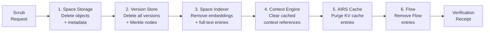

# AIOS Data Lifecycle Privacy

Part of: [privacy.md](../privacy.md) — Privacy Architecture
**Related:** [agent-privacy.md](./agent-privacy.md) — Agent privacy model, [ai-privacy.md](./ai-privacy.md) — AI privacy

---

## §7 Data Lifecycle Privacy

Data lifecycle privacy ensures that sensitive data does not outlive its purpose. Every object in AIOS has a classification, a retention policy, and a defined path to deletion. When data reaches its retention limit or when a user requests erasure, a cross-subsystem scrubbing pipeline ensures complete removal from all subsystems — storage, indexes, caches, and inference contexts.

### §7.1 Sensitive Data Classification

AIOS classifies data objects by sensitivity level. On a personal device (non-enterprise), classification is **advisory and user-configurable** — the system suggests classifications and the user can override. On enterprise-managed devices, classification is **policy-enforced** and cannot be reduced below the enterprise floor.

Classification extends the DLP content classification system from [multi-device/data-protection.md](../../platform/multi-device/data-protection.md) §9.1 to the single-device privacy context. The same `SensitivityLevel` and `ClassificationLabel` types are reused, with additional privacy-specific labels.

```rust
/// Sensitivity levels (from multi-device/data-protection.md §9.1).
/// Reused for single-device privacy classification.
#[repr(u8)]
pub enum SensitivityLevel {
    /// No special handling required.
    Public = 0,
    /// Organization-internal; no external sharing.
    Internal = 1,
    /// Limited access; requires explicit authorization.
    Confidential = 2,
    /// Strictest controls; audit all access.
    Restricted = 3,
}

/// Classification labels (extended for privacy).
/// Base labels from multi-device/data-protection.md §9.1;
/// privacy-specific additions marked below.
pub enum ClassificationLabel {
    // --- Base DLP labels ---
    Pii,
    Financial,
    SourceCode,
    Credentials,
    HealthRecord,
    Legal,
    Executive,

    // --- Privacy-specific additions ---
    /// Biometric data (face geometry, voice print, fingerprint template).
    Biometric,
    /// Location history (GPS traces, WiFi location logs).
    LocationHistory,
    /// Conversation transcripts and chat history.
    ConversationHistory,
    /// Behavioral data (app usage patterns, preferences history).
    BehavioralData,
    /// Media containing identifiable individuals.
    IdentifiableMedia,
}
```

**Classification sources:**

1. **Space Indexer** — During indexing (see [space-indexer/pipeline.md](../../intelligence/space-indexer/pipeline.md) §3.6), the pipeline extracts `SemanticMetadata` including a suggested classification. For text objects, this uses keyword detection and pattern matching (PII patterns like SSN, credit card, email). For media, this uses content analysis when AIRS is available.
2. **Agent declaration** — When an agent creates an object, it can declare the classification in the object metadata. This is cross-checked against the agent's privacy manifest — an agent that doesn't declare PII access cannot create PII-classified objects.
3. **User override** — Users can manually classify or reclassify objects through the Inspector app.
4. **Enterprise policy** — MDM policies can set minimum classification levels for content matching specific patterns (see [multi-device/policy.md](../../platform/multi-device/policy.md) §7).

**Classification propagation:** When an object is derived from other objects (summarized, transformed, copied), the derived object inherits the maximum classification of its sources. Classification can only be reduced through approved declassification gates (see [agent-privacy.md](./agent-privacy.md) §3.3).

### §7.2 Retention Policies

Every space has a default retention policy, and individual objects can override it. Retention policies define how long data persists and what happens when it expires.

```rust
/// Retention policy for a space or object.
pub struct RetentionPolicy {
    /// Retention tier (determines default duration).
    pub tier: RetentionTier,
    /// Explicit duration override (if set, overrides tier default).
    pub explicit_duration: Option<u64>,
    /// What happens when retention expires.
    pub expiry_action: ExpiryAction,
    /// Whether the user has locked this object against automatic deletion.
    pub user_locked: bool,
}

/// Action taken when retention expires.
pub enum ExpiryAction {
    /// Delete the object and all versions (default for Ephemeral/ShortTerm).
    Delete,
    /// Archive to cold storage with reduced accessibility.
    Archive,
    /// Notify the user and wait for decision.
    NotifyAndWait,
    /// Move to a quarantine space for review before deletion.
    Quarantine,
}
```

**Default retention by space type:**

| Space Type | Default Tier | Default Duration | Expiry Action |
|---|---|---|---|
| Ephemeral (`ephemeral/`) | Ephemeral | Session end or 1 hour | Delete |
| Personal (`user/`) | Permanent | Indefinite | User-initiated deletion |
| Collaborative | LongTerm | 90 days after last access | NotifyAndWait |
| System (`system/`) | Permanent | Indefinite | Admin-only deletion |
| Conversation history | LongTerm | 90 days after completion | Archive |
| Inference cache | Ephemeral | Session end | Delete |

**Retention enforcement:** The `RetentionEnforcer` runs as a kernel background task, scanning object metadata for expired retention and executing the configured `ExpiryAction`. It runs on a configurable schedule (default: every hour). Objects with `user_locked: true` are never automatically deleted regardless of retention policy.

Retention policies for conversation history are also defined in [conversation-manager/sessions.md](../../intelligence/conversation-manager/sessions.md) §4 — the privacy system and conversation manager share the same retention tiers but the conversation manager adds conversation-specific metadata to the retention decision (e.g., conversations with starred messages have extended retention).

### §7.3 Data Scrubbing

When data reaches its retention limit, or when a user explicitly deletes sensitive data, the scrubbing pipeline ensures **complete removal** across all subsystems. Partial deletion is a privacy risk — a deleted photo still findable through its embedding is a privacy failure.

```rust
/// Cross-subsystem scrub request.
pub struct ScrubRequest {
    /// Object(s) to scrub (specific ID or query).
    pub target: ScrubTarget,
    /// Reason for scrubbing (retention expiry, user request, policy).
    pub reason: ScrubReason,
    /// Whether to scrub all versions or only current.
    pub include_versions: bool,
    /// Request timestamp.
    pub timestamp: Timestamp,
    /// Requesting entity (user, retention enforcer, DLP policy).
    pub requestor: ScrubRequestor,
}

/// What to scrub.
pub enum ScrubTarget {
    /// Specific object by ID.
    Object(ObjectId),
    /// All objects matching a query (semantic erasure).
    Query { query: [u8; 256], space: SpaceId },
    /// All objects created by a specific agent.
    AgentData(AgentId),
    /// All objects in a specific space.
    Space(SpaceId),
}

/// Scrub verification receipt.
/// Proves that scrubbing completed across all subsystems.
pub struct ScrubVerification {
    /// Scrub request that initiated this.
    pub request_id: ScrubRequestId,
    /// Per-subsystem completion status.
    pub subsystem_status: [SubsystemScrubStatus; 6],
    /// Overall completion timestamp.
    pub completed_at: Timestamp,
    /// Cryptographic hash of the verification record.
    pub verification_hash: [u8; 32],
}
```

**Scrubbing pipeline:**

The scrub request propagates through six subsystems in dependency order. Each subsystem confirms completion before the next proceeds:



**Per-subsystem scrubbing details:**

| Step | Subsystem | What Is Scrubbed | Verification |
|---|---|---|---|
| 1 | Space Storage | Object data, metadata, `CompactObject` entries | Object ID no longer resolvable |
| 2 | Version Store | All `Version` entries, parent chain, content hashes | Version list for object returns empty |
| 3 | Space Indexer | HNSW embeddings, full-text inverted index entries, entity graph edges | Semantic search no longer returns the object |
| 4 | Context Engine | Cached context references, feature vectors | Object absent from context signals |
| 5 | AIRS Inference | KV cache entries referencing the object, any in-flight inference context | No inference session contains object data |
| 6 | Flow | `FlowEntry` records referencing the object | Flow history no longer shows the object |

**Scrubbing guarantees:**

- **Atomicity** — If any subsystem fails to scrub, the entire request is retried. Partial scrubs are not accepted.
- **Verification** — The `ScrubVerification` receipt is stored in the audit space as proof of deletion. This is required for GDPR compliance.
- **Timeliness** — User-initiated scrubs complete within 30 seconds. Retention-triggered scrubs complete within the enforcement cycle (default 1 hour).
- **Cascade** — Scrubbing an object also scrubs derived objects (if derivation provenance is tracked). The Space Indexer's relationship graph ([space-indexer/relationship-graph.md](../../intelligence/space-indexer/relationship-graph.md) §7) identifies derived objects.

### §7.4 Right to Erasure

The right to erasure ("delete everything about topic X" or "delete all data from agent Y") requires **semantic understanding** to find all related objects, not just exact ID matches.

**Erasure flow:**

1. **User request** — Via natural language ("Delete everything related to [topic]") or structured command (Inspector app, Settings agent).
2. **Semantic search** — The Space Indexer performs a semantic query to find all objects related to the request. This uses embedding similarity, full-text search, and relationship graph traversal.
3. **Review** — The system presents the list of objects that will be deleted. The user confirms or adjusts the scope.
4. **Scrub** — The scrubbing pipeline (§7.3) processes all confirmed objects.
5. **Verification** — A consolidated `ScrubVerification` receipt is generated covering all objects.
6. **Audit** — `PrivacyEvent::ErasureRequested` and `PrivacyEvent::ScrubCompleted` logged.

**Limitations:**

- Semantic search depends on the Space Indexer — if indexing is incomplete, some related objects may not be found. The system warns the user: "N objects found. Some content may not be indexed yet."
- Objects in encrypted spaces that the current session cannot decrypt are listed but cannot be verified as scrubbed until the decryption key is available.
- Backup media (external drives, synced devices) are not covered by the on-device scrub. The system notifies the user of known sync targets that may retain copies.

---

## §8 Encryption Zones & DLP

### §8.1 Per-Space Encryption

Every space in AIOS can have its own encryption zone with an independent key. From a privacy perspective, encryption zones are **privacy boundaries** — data encrypted with a space key is unreadable to agents that lack the capability to decrypt that space, providing defense in depth even if capability checks have a bug.

The full encryption architecture is defined in [storage/spaces/encryption.md](../../storage/spaces/encryption.md) §6:

| Encryption Feature | Section | Privacy Relevance |
|---|---|---|
| Key management | §6.1 | Per-space keys derived from device master key |
| Nonce management | §6.2 | Crash-safe nonce counter prevents reuse |
| Encryption zones | §6.3 | Privacy boundaries — data stays encrypted at rest |

**Privacy-specific properties:**

- **Default encryption** — Personal spaces (`user/`) are encrypted by default. Ephemeral spaces use ephemeral keys that are destroyed on session end.
- **Key isolation** — An agent's capability token includes the space key only for spaces the agent is authorized to access. Key material never appears in IPC messages — the kernel performs encryption/decryption on behalf of agents.
- **Cross-space privacy** — Even if an agent has capabilities for spaces A and B, data from space A cannot be decrypted using space B's key. There is no master key accessible to agents.

### §8.2 DLP Enforcement

Data Loss Prevention enforcement points prevent sensitive data from leaving the device through unauthorized channels. The full DLP architecture is in [multi-device/data-protection.md](../../platform/multi-device/data-protection.md) §9.2.

**Privacy-specific enforcement extensions** (beyond the base DLP system):

| Enforcement Point | Privacy Extension |
|---|---|
| Clipboard | Restricted-classified content is stripped on copy. Confidential content copies with a warning notification. |
| Screenshot/recording | Compositor refuses capture when Restricted content is visible on screen. Confidential content triggers a watermark overlay. |
| Network egress | Tainted IPC messages (§3.3) with Restricted classification are blocked at the Network Manager (NTM). |
| Print | Restricted content cannot be printed. Confidential content prints with a watermark and audit entry. |
| Flow export | Flow entries with Restricted classification cannot be exported or shared. |

**DLP and privacy budgets:** DLP enforcement is independent of privacy budgets. Even if an agent has remaining budget, DLP rules can block data transfer. DLP operates on data classification; budgets operate on access volume. Both must permit the action.

### §8.3 Cross-Zone Privacy Boundaries

Security zones (Core, Personal, Collaborative, Ephemeral, Untrusted) from [intent-verifier/information-flow.md](../../intelligence/intent-verifier/information-flow.md) §5.1 define privacy boundaries for data flow. The taint label system (§3.3) enforces these boundaries at the IPC level.

**Zone crossing rules:**

| From → To | Rule | Enforcement |
|---|---|---|
| Core → Any | **Blocked** | Kernel-enforced; no exceptions |
| Personal → Collaborative | **Consent required** | User must approve sharing |
| Personal → Untrusted | **Blocked by default** | Requires explicit user consent + DLP check |
| Personal → Ephemeral | **Allowed** (same user) | Taint labels propagate |
| Collaborative → Untrusted | **DLP policy** | Enterprise policy governs |
| Ephemeral → Any | **Allowed** (reduced sensitivity) | Taint labels may be reduced |
| Untrusted → Personal | **Sanitized** | Content screening before promotion |

**Cross-zone consent:** When an agent attempts to move data from Personal to Collaborative or Untrusted, the privacy system prompts the user: "Agent X wants to share [object] from your personal space to [destination]. Allow?" This consent is separate from sensor consent (§6.2) and uses the same consent infrastructure but with different scope.

**Taint label interaction:** Cross-zone transfers update the taint label's `zone` field. A Personal-to-Collaborative transfer changes the label's sensitivity from 4 (Personal) to 3 (Collaborative), but the `source_spaces` field retains the original Personal space ID for provenance tracking. Downstream agents can see where the data originated even after zone crossing.
