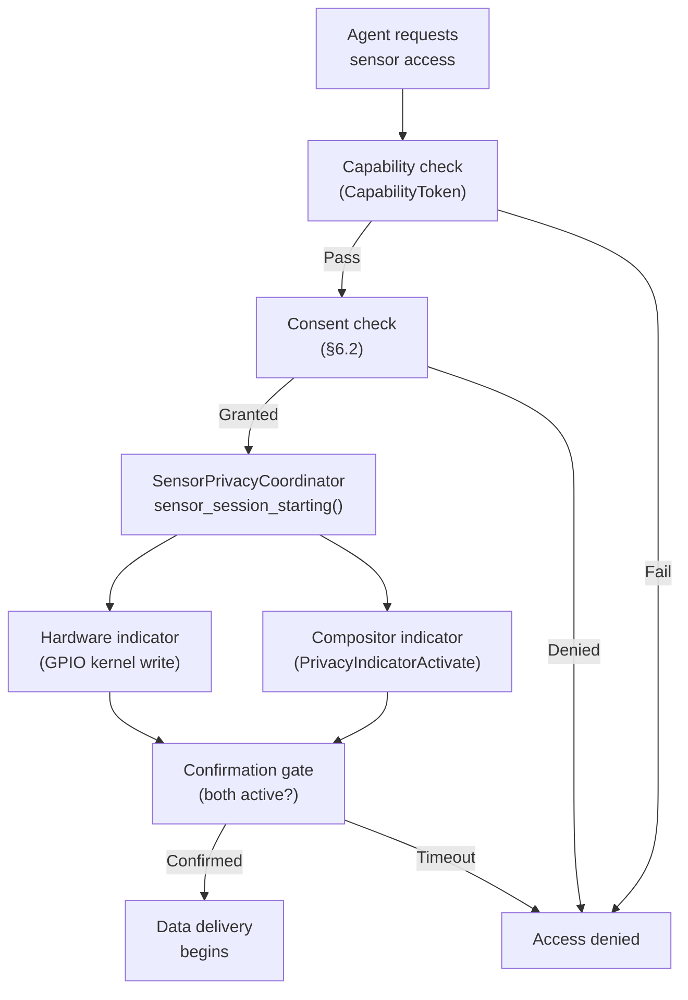
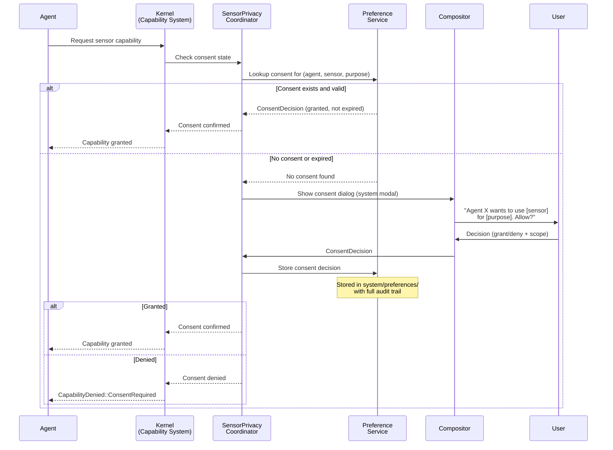

# AIOS Sensor & Hardware Privacy

Part of: [privacy.md](../privacy.md) — Privacy Architecture
**Related:** [agent-privacy.md](./agent-privacy.md) — Agent privacy model, [data-lifecycle.md](./data-lifecycle.md) — Data lifecycle privacy

---

## §5 Sensor & Hardware Privacy

AIOS coordinates privacy indicators across all sensor subsystems — camera, microphone, location, and screen recording — through a unified kernel service. Individual subsystem privacy (camera LED enforcement, microphone indicators) is defined in subsystem-specific docs. This section defines the **cross-subsystem coordination** that ensures consistent privacy behavior when multiple sensors are active simultaneously.

### §5.1 Unified Sensor Indicator Coordination

The `SensorPrivacyCoordinator` runs in kernel space and synchronizes indicator state across all sensor subsystems. When any sensor session starts, the coordinator ensures the appropriate indicators are active before the first data frame is delivered. When multiple sensors are active simultaneously, all indicators are visible and the compositor reserves a privacy indicator bar that agents cannot obscure.

```rust
/// Sensor types tracked by the privacy coordinator.
#[repr(u8)]
pub enum SensorType {
    Camera = 0,
    Microphone = 1,
    Location = 2,
    ScreenCapture = 3,
}

/// Indicator state for a single sensor type.
pub struct SensorIndicatorState {
    /// Whether a hardware indicator is available and active.
    pub hardware_active: bool,
    /// Whether a software indicator is displayed.
    pub software_active: bool,
    /// Number of active sessions using this sensor.
    pub session_count: u32,
    /// Agents currently using this sensor.
    pub active_agents: Vec<AgentId>,
    /// Whether a hardware kill switch has disabled this sensor.
    pub kill_switch_engaged: bool,
}

/// Cross-subsystem sensor privacy coordination.
/// Ensures all indicators are active before data delivery
/// and coordinates multi-sensor scenarios.
pub struct SensorPrivacyCoordinator {
    /// Per-sensor indicator state.
    pub sensors: [SensorIndicatorState; 4],
    /// Compositor channel for indicator surface management.
    pub compositor_channel: ChannelId,
    /// Callback for kill switch GPIO events.
    pub kill_switch_handler: Option<KillSwitchHandler>,
}
```

**Coordination protocol:**

1. **Session request** — A subsystem (e.g., camera) receives a session start request from an agent.
2. **Coordinator check** — Before starting the session, the subsystem calls `coordinator.sensor_session_starting(sensor_type, agent_id)`.
3. **Indicator activation** — The coordinator activates the appropriate indicators:
   - Hardware indicator (if available): kernel GPIO write, no userspace involvement.
   - Software indicator: sends `PrivacyIndicatorActivate` message to compositor.
4. **Confirmation gate** — The coordinator does not return until both indicators are confirmed active. The subsystem blocks session start until this gate passes.
5. **First frame** — Only after the gate passes does the subsystem deliver data.
6. **Session end** — Subsystem calls `coordinator.sensor_session_ending(sensor_type, agent_id)`. If `session_count` drops to zero, indicators are deactivated.



**Multi-sensor scenarios:**

When multiple sensors are active simultaneously (e.g., video call using camera + microphone), the coordinator ensures:

- All active sensor indicators are visible simultaneously in the compositor indicator bar.
- The indicator bar shows which agents are using which sensors.
- The user can tap the indicator bar to see details and revoke individual sensor access.
- If any sensor's indicator fails to activate, all sensors for that session are denied (fail closed).

**Compositor indicator bar properties:**

The privacy indicator bar is rendered by the compositor with special properties (see [compositor/security.md](../../platform/compositor/security.md) §10):

- `SurfaceType::PrivacyIndicator` — highest z-order, cannot be obscured by any agent surface.
- HMAC-protected — agents cannot forge or modify indicator surfaces.
- Excluded from screen capture — the indicator bar is not captured in screenshots or recordings.
- Always visible — even in fullscreen mode, the indicator bar remains visible (compositor reserves space).

### §5.2 Camera Privacy

Camera privacy is the **reference implementation** for the sensor privacy pattern. All other sensors follow the same architectural approach: kernel-controlled indicators, anti-silent-capture validation, and non-suppressible audit.

The full camera privacy architecture is defined in [camera/security.md](../../platform/camera/security.md) §8–§9:

| Camera Privacy Feature | Section | Key Mechanism |
|---|---|---|
| Hardware LED enforcement | §8.1 | `IndicatorController` with GPIO, kernel-only control |
| Anti-silent-capture validation | §8.2 | Hard gate before frame delivery; checks indicator + session + capability |
| `CameraCapability` token | §8.3 | Resolution, FPS, duration, purpose scoping; monotonic attenuation |
| Recording consent | §8.4 | Local consent + multi-party consent for remote participants |
| Content screening | §8.5 | Face detection, document detection, NSFW classification |
| Audit trail | §8.6 | Every frame delivery logged with session, agent, timestamp |
| Physical privacy shutter | §8.7 | GPIO detection, immediate session termination |
| Software privacy indicator | §9.1 | Compositor `PrivacyIndicator` surface, max z-order, HMAC-protected |

The privacy architecture generalizes these patterns to all sensors. New subsystems implementing sensor access should follow the camera privacy pattern as their template.

### §5.3 Audio Privacy

Audio privacy follows the camera pattern but with key differences due to hardware constraints. Most microphone hardware lacks a dedicated LED indicator, making the software compositor indicator the primary privacy signal.

The audio privacy architecture is defined in [audio/drivers.md](../../platform/audio/drivers.md) §5.7 and [audio/integration.md](../../platform/audio/integration.md) §11:

| Audio Privacy Feature | Section | Key Mechanism |
|---|---|---|
| Privacy-first hardware drivers | drivers.md §5.7 | Hardware mute GPIO, driver-level privacy enforcement |
| Visual microphone indicator | integration.md §11.4 | `AudioCaptureIndicator` with agent list, hw_mute distinction |
| Audit events | integration.md §11.2 | `AudioAuditEvent` covering sessions, mic access, device changes |
| Audit space | integration.md §11.3 | `system/audit/audio/` with session and microphone sub-spaces |

**Differences from camera pattern:**

- **No hardware LED** — Software compositor indicator is the primary privacy signal. The coordinator treats the software indicator as the confirmation gate (not optional).
- **Hardware kill switch** — Many devices support a hardware microphone kill switch (GPIO-connected). The audio driver detects kill switch state and reports to the coordinator.
- **Background capture** — Audio capture is more commonly requested in the background (voice assistants, dictation). The indicator bar distinguishes active foreground capture from background listening.
- **Privacy-sensitive content** — Audio may capture ambient conversations involving non-consenting parties. The content screening pipeline (when AIRS is available) can detect multiple speakers and flag potential privacy concerns.

### §5.4 Location Privacy

Location data is inferred from multiple sources with varying accuracy and privacy cost: GPS (high accuracy, high cost), WiFi SSID mapping (medium accuracy, medium cost), Bluetooth beacons (low accuracy, low cost), and IP geolocation (very low accuracy, low cost). The location privacy model uses a **precision-budget system** where agents declare the precision they need and the system provides only that level.

```rust
/// Location precision levels.
/// Lower precision = lower privacy cost = larger budget allocation.
#[repr(u8)]
pub enum LocationPrecision {
    /// Country-level (from IP geolocation or timezone). ~100km accuracy.
    Country = 0,
    /// City-level (from IP or coarse WiFi). ~10km accuracy.
    City = 1,
    /// Neighborhood-level (from WiFi SSID mapping). ~1km accuracy.
    Neighborhood = 2,
    /// Street-level (from fine WiFi + Bluetooth). ~100m accuracy.
    Street = 3,
    /// Exact (from GPS). ~10m accuracy.
    Exact = 4,
}

/// Location privacy gate.
/// Coarsens location data to the declared precision level.
pub struct LocationPrivacyGate {
    /// Maximum precision this agent is allowed.
    pub max_precision: LocationPrecision,
    /// Budget cost multiplier per precision level.
    pub precision_costs: [u32; 5],
    /// Whether continuous location tracking is allowed.
    pub continuous_allowed: bool,
    /// Maximum tracking duration (if continuous).
    pub max_duration: Option<u64>,
}
```

**Coarsening algorithm:**

When an agent requests location at precision P, but is only allowed precision Q (where Q < P):

1. Obtain the full-precision location from the location service.
2. Quantize to the allowed precision: round coordinates to the grid size for precision Q.
3. Add uniform noise within the precision Q cell (prevents exact position inference from repeated queries at the cell boundary).
4. Return the coarsened location with a `precision` field indicating the actual precision provided.

**Location indicator:** Location access triggers a compositor indicator (location pin icon) in the privacy indicator bar. Unlike camera/microphone, location does not have a hardware indicator. The indicator distinguishes one-time lookup from continuous tracking.

---

## §6 Physical Privacy & Consent

### §6.1 Hardware Kill Switches

AIOS detects and respects hardware privacy switches for sensors. Kill switches provide the ultimate privacy guarantee — no software can override a physical disconnect.

**Supported kill switch types:**

| Switch Type | Detection | Scope | Examples |
|---|---|---|---|
| Camera shutter | GPIO input, USB disconnect event | Single camera | Laptop slider, Librem 5 |
| Microphone kill | GPIO input | All microphones | Librem 5, PinePhone, Framework |
| WiFi/Bluetooth | GPIO input, RFKILL subsystem | All wireless | Librem 5, PinePhone |
| All sensors | GPIO input | Camera + mic + location | Hardware privacy mode button |

**Kill switch protocol:**

1. **Detection** — The kernel polls GPIO inputs for kill switch state changes (interrupt-driven on supported hardware, polling at 100ms on others).
2. **Immediate termination** — When a kill switch is engaged, the coordinator immediately:
   - Terminates all active sessions for the affected sensor(s).
   - Sends `SensorSessionKilled` to all affected agents via IPC.
   - Updates the compositor indicator to show the kill switch state.
   - Logs `PrivacyEvent::KillSwitchEngaged` to the audit ring.
3. **Non-overridable** — No software path can bypass a hardware kill switch. The kernel does not provide a "debug mode" or "test mode" that overrides kill switches. Even TL0 (kernel) code respects kill switch state.
4. **Re-enable** — When the kill switch is disengaged, the sensor becomes available again but all sessions must be re-established. No session auto-resumes after a kill switch toggle.

### §6.2 Consent Flow Architecture

First-time sensor access requires explicit user consent via a system modal rendered by the compositor (not by the requesting agent — agents cannot forge consent dialogs). Consent is scoped to agent, sensor type, purpose, and duration.

```rust
/// Consent request generated when an agent first accesses a sensor.
pub struct ConsentRequest {
    /// Agent requesting access.
    pub agent_id: AgentId,
    /// Sensor type being requested.
    pub sensor_type: SensorType,
    /// Declared purpose from the agent's privacy manifest.
    pub purpose: DataPurpose,
    /// Requested duration.
    pub duration: ConsentDuration,
    /// Human-readable explanation from the agent.
    pub explanation: [u8; 256],
    /// Request timestamp.
    pub timestamp: Timestamp,
}

/// Consent duration options.
pub enum ConsentDuration {
    /// Single use — consent expires after one session.
    OneTime,
    /// Session — consent expires when the agent's task ends.
    Session,
    /// Temporal — consent expires after a fixed duration.
    Temporal { duration_secs: u64 },
    /// Persistent — consent remains until explicitly revoked.
    Persistent,
}

/// User's consent decision.
pub struct ConsentDecision {
    /// Unique identifier for this consent decision.
    pub consent_id: ConsentId,
    /// Whether access was granted.
    pub granted: bool,
    /// Scope of the consent (may be narrower than requested).
    pub scope: ConsentScope,
    /// When this consent expires.
    pub expires: Option<Timestamp>,
    /// Timestamp of the decision.
    pub decided_at: Timestamp,
}

/// Consent scope (can be narrower than requested).
pub struct ConsentScope {
    /// Agent this consent applies to.
    pub agent_id: AgentId,
    /// Sensor type.
    pub sensor_type: SensorType,
    /// Allowed purpose (may be narrower than agent requested).
    pub purpose: DataPurpose,
    /// Maximum precision for location (if applicable).
    pub max_precision: Option<LocationPrecision>,
    /// Maximum duration per session.
    pub max_session_duration: Option<u64>,
}
```

**Consent flow:**



**Consent dialog properties:**

- Rendered by the compositor as a system modal (highest priority, cannot be dismissed by agents).
- Shows the agent's name, icon, verified developer identity, and the specific sensor + purpose.
- Offers duration options: One-time, This session, [Time period], Always.
- Offers scope narrowing: "Allow camera but not microphone" when multi-sensor is requested.
- Cannot be programmatically dismissed or auto-accepted. User interaction is required.
- Anti-fatigue: if the same agent requests consent for the same sensor more than 3 times in 24 hours after denial, subsequent prompts are suppressed and the denial stands. The agent is notified that repeated requests are not allowed.

### §6.3 Consent Revocation & Temporal Consent

Users can revoke consent at any time through the Settings agent, the privacy indicator bar (tap to manage), or voice command ("Stop agent X from using my camera").

**Revocation protocol:**

1. User initiates revocation (any method).
2. Preference Service updates consent state to `revoked`.
3. `PrivacyCoordinator` is notified of revocation.
4. Coordinator immediately terminates all active sensor sessions for the affected (agent, sensor) pair.
5. Coordinator sends `SensorSessionRevoked` to the affected agent via IPC.
6. Compositor updates indicator bar (sensor indicator removed if no other sessions active).
7. `PrivacyEvent::ConsentRevoked` logged to audit ring.

Revocation takes effect within one timer tick (1ms on QEMU). No data frames are delivered after revocation is processed.

**Temporal consent:**

For `ConsentDuration::Temporal`, the kernel's timer subsystem schedules automatic revocation. When the duration expires:

1. The timer fires and calls `coordinator.consent_expired(consent_id)`.
2. The same revocation protocol executes (steps 2-7 above).
3. If the agent needs to continue, it must request consent again.

The user is notified when temporal consent expires: "Agent X's camera access has expired. [Extend] [Deny]."

**Consent audit:**

All consent decisions are stored in the Preference Service with full audit trail (see [preferences/security.md](../../intelligence/preferences/security.md) §15.4). Users can query their consent history through the Inspector app or natural language: "When did I give agent X camera access?"
