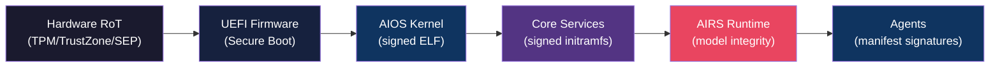

# AIOS Secure Boot & Update System

**Audience:** Kernel developers, platform engineers, application developers
**Phase:** 24 (Secure Boot & Update System) — depends on Phase 19 (Power Management)
**Related:** [model.md](./model.md) — Security model and capability system,
[model/hardening.md](./model/hardening.md) — Cryptographic foundations and key hierarchy,
[boot.md](../kernel/boot.md) — Boot sequence and firmware handoff,
[boot/recovery.md](../kernel/boot/recovery.md) — Recovery mode and A/B rollback,
[agents.md](../applications/agents.md) — Agent manifest signing and lifecycle,
[airs.md](../intelligence/airs.md) — AI Runtime Service and model registry,
[spaces/versioning.md](../storage/spaces/versioning.md) — Version Store and snapshots

---

## §1 Core Insight

Secure boot in AIOS extends the chain of trust beyond firmware and kernel to encompass AI models and autonomous agents. Traditional verified boot stops at "the kernel is authentic." AIOS must verify that the AI runtime making security decisions on behalf of the user — intent verification, behavioral monitoring, capability recommendations — is itself trustworthy and untampered.

This creates a **six-link trust chain**:

**Why this matters for an AI-first OS:**

- **Traditional OS:** If the kernel boots clean, the system is trusted. Applications are sandboxed but not verified at boot.
- **AIOS:** The kernel delegates security-critical decisions (intent verification, behavioral baseline comparison, capability recommendations) to AIRS. A compromised AIRS model could approve malicious agent behavior, suppress security alerts, or recommend excessive capabilities. The boot chain must verify AIRS integrity before it gains decision-making authority.

**Design philosophy:**

- **Defense in depth** — each link in the chain independently verifies the next. Compromise of one link does not silently compromise downstream links.
- **Graceful degradation** — verification failure at any link triggers a well-defined fallback (safe mode, recovery shell, degraded operation) rather than a hard failure that bricks the device.
- **Separate update channels** — kernel updates, service updates, model updates, and agent updates travel through independent channels with independent signing keys. Compromising one channel does not compromise the others.
- **Anti-rollback by default** — monotonic counters prevent downgrade attacks. An attacker who obtains an old, vulnerable kernel image cannot force the device to boot it.
- **Offline-first** — all verification is local. No network connectivity is required to boot securely. Remote attestation is available for enterprise deployments but never blocks boot.

---

## Document Map

| Document | Sections | Content |
|---|---|---|
| **This file** | §1, §14–§15 | Core insight, implementation order, design principles |
| [trust-chain.md](./secure-boot/trust-chain.md) | §2–§3 | Threat model, six-link chain of trust, measured boot, remote attestation |
| [uefi.md](./secure-boot/uefi.md) | §4–§5 | UEFI Secure Boot integration, TrustZone/secure element, platform differences |
| [updates.md](./secure-boot/updates.md) | §6–§9 | A/B scheme, delta updates, update channels, rollback protection |
| [operations.md](./secure-boot/operations.md) | §10–§11 | Update security operations, POSIX compatibility |
| [intelligence.md](./secure-boot/intelligence.md) | §12–§13, §16 | AI-native boot/update intelligence, kernel-internal ML, future directions |

---

## Cross-Reference Index

| Section | Sub-file | Related external doc |
|---|---|---|
| §2.1 Boot-time threats | [trust-chain.md](./secure-boot/trust-chain.md) | [model.md §1](./model.md) — threat model |
| §2.2 Update-time threats | [trust-chain.md](./secure-boot/trust-chain.md) | [model/operations.md §6](./model/operations.md) — incident response |
| §2.3 AI-specific threats | [trust-chain.md](./secure-boot/trust-chain.md) | [airs.md §4](../intelligence/airs.md) — model registry |
| §3.1 Hardware root of trust | [trust-chain.md](./secure-boot/trust-chain.md) | [model/hardening.md §5](./model/hardening.md) — ARM HW security |
| §3.2 Firmware verification | [trust-chain.md](./secure-boot/trust-chain.md) | [boot/firmware.md §2](../kernel/boot/firmware.md) — UEFI handoff |
| §3.7 Measured boot | [trust-chain.md](./secure-boot/trust-chain.md) | — |
| §3.8 Remote attestation | [trust-chain.md](./secure-boot/trust-chain.md) | [model/operations.md §10](./model/operations.md) — zero trust |
| §4.1 Key enrollment | [uefi.md](./secure-boot/uefi.md) | [model/hardening.md §4](./model/hardening.md) — key hierarchy |
| §4.4 Stub verification | [uefi.md](./secure-boot/uefi.md) | [boot/firmware.md §2.3](../kernel/boot/firmware.md) — UEFI stub |
| §5.1 Key migration | [uefi.md](./secure-boot/uefi.md) | [model/hardening.md §4.2](./model/hardening.md) — key storage |
| §6.1 Partition layout | [updates.md](./secure-boot/updates.md) | [boot/recovery.md §9](../kernel/boot/recovery.md) — A/B rollback |
| §8.2 Agent updates | [updates.md](./secure-boot/updates.md) | [agents.md §3](../applications/agents.md) — agent lifecycle |
| §8.3 Model updates | [updates.md](./secure-boot/updates.md) | [airs.md §4](../intelligence/airs.md) — model registry |
| §9.2 Version Store | [updates.md](./secure-boot/updates.md) | [spaces/versioning.md §5](../storage/spaces/versioning.md) |
| §10.1 Update capabilities | [operations.md](./secure-boot/operations.md) | [model/capabilities.md §3](./model/capabilities.md) — token system |
| §10.3 Audit trail | [operations.md](./secure-boot/operations.md) | [model/operations.md §7](./model/operations.md) — audit |
| §12.1 Model integrity | [intelligence.md](./secure-boot/intelligence.md) | [airs.md §4.1](../intelligence/airs.md) — model verification |
| §12.6 Model provenance | [intelligence.md](./secure-boot/intelligence.md) | [model/operations.md §7](./model/operations.md) — provenance chain |

---

## §14 Implementation Order

### Preparatory Work (Phases 1–23)

| Phase | Secure Boot Preparatory | Dependency |
|---|---|---|
| 1 | UEFI stub loads kernel from ESP; BootInfo handoff | UEFI firmware |
| 3 | Capability system; Ed25519 signing in security model | IPC, scheduler |
| 4 | AES-256-GCM block encryption; content-addressed storage | Storage layer |
| 9 | A/B ESP rollback; boot failure counter; recovery shell | Boot sequence |
| 10 | Agent manifest signing; AIRS model integrity (SHA-256) | Agent framework, AIRS |
| 13 | Formal verification of capability system | Security model |

### Phase 24: Secure Boot & Update System (Weeks 93–96)

| Milestone | Steps | Target | Observable Result |
|---|---|---|---|
| M73 | Chain of trust + UEFI Secure Boot | Week 93–94 | Kernel ELF signature verified by UEFI stub; boot fails on tampered image |
| M74 | TrustZone + A/B updates + rollback protection | Week 94–95 | Keys sealed in secure world; monotonic counter prevents rollback; delta updates work |
| M75 | Update channels + AI-native intelligence | Week 95–96 | Separate kernel/agent/model update channels; AIRS-aware scheduling; boot anomaly detection |

### Post-Phase 24

| Phase | Enhancement |
|---|---|
| 25 | Linux binary compatibility layer with dm-verity bridge |
| 26 | Enterprise fleet attestation; MDM integration |
| 27 | Hardware certification; real TPM 2.0 testing |
| 28 | Composable security profiles for update agents |
| 29 | AIRS-driven adaptive update policy; GNN anomaly detection |

---

## §15 Design Principles

1. **Verify before execute** — no code runs until its integrity is confirmed by the preceding link in the trust chain. The UEFI stub verifies the kernel before jumping to it; the kernel verifies the initramfs before unpacking services; AIRS verifies models before loading them for inference.

2. **Fail open to recovery, not to operation** — when verification fails, the system enters a well-defined recovery state (recovery shell, safe mode, degraded AIRS). It never silently continues with unverified components. The user is always informed.

3. **Separate signing authorities** — the kernel signing key, the service signing key, the model signing key, and the agent developer keys are independent. Compromising the agent developer key does not allow signing a malicious kernel. The AIOS Root CA signs intermediate authorities, but leaf keys are scoped to their domain.

4. **Monotonic progress** — version numbers only increase. The anti-rollback counter in TrustZone (or TPM) ensures that an attacker cannot force the device to run an older, vulnerable version of any signed component.

5. **Offline verification** — all boot-time verification uses locally stored public keys and signatures. No network roundtrip is required. Remote attestation is an optional post-boot capability for enterprise deployments.

6. **Update atomicity** — every update is atomic. Either the new version is fully installed and verified, or the old version remains active. No partial updates, no inconsistent states. A/B partitioning and content-addressed storage provide this guarantee at different layers.

7. **Capability-gated updates** — only agents with explicit `SystemUpdate` or `EspWriteAccess` capabilities can stage updates. The update agent itself is verified and capability-constrained. No agent can silently modify the boot chain.

8. **AI models are first-class update targets** — model updates have dedicated channels, signatures, and rollback mechanisms. A poisoned model is as dangerous as a compromised kernel in an AI-first OS, and the update system treats it accordingly.
