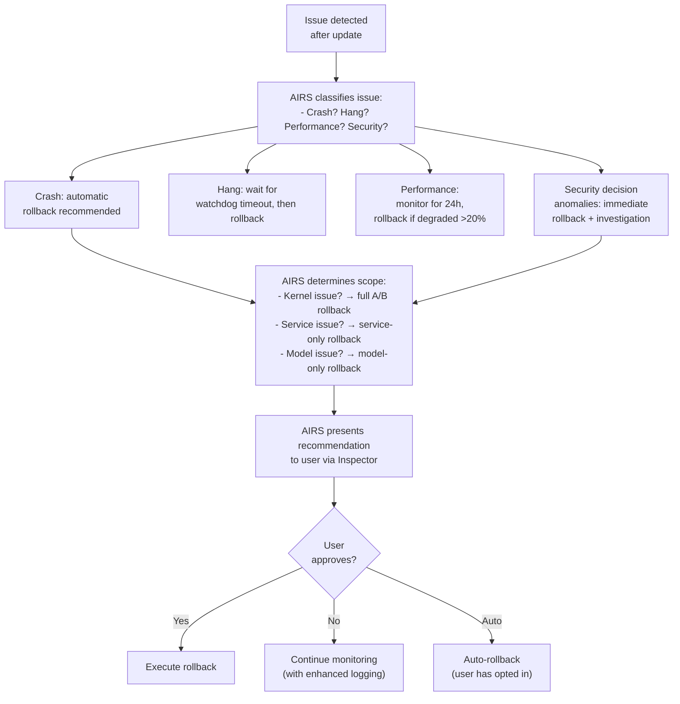

# AIOS Secure Boot — AI-Native Intelligence & Future Directions

Part of: [secure-boot.md](../secure-boot.md) — Secure Boot & Update System
**Related:** [trust-chain.md](./trust-chain.md) — Chain of trust (§3.5 model verification),
[uefi.md](./uefi.md) — TrustZone integration,
[updates.md](./updates.md) — Update channels and model updates (§8.3),
[operations.md](./operations.md) — Security operations

**See also:** [airs.md](../../intelligence/airs.md) — AI Runtime Service architecture,
[agents.md](../../applications/agents.md) — Agent lifecycle and security analysis,
[model/operations.md](../model/operations.md) — AIRS resource security (§9)

-----

## §12 AI-Native Secure Boot & Updates

AIOS is an AI-first OS where the AI runtime (AIRS) makes security-critical decisions on behalf of the user. This creates unique requirements for the secure boot and update system that traditional OSes do not face. This section covers AIRS-dependent intelligence features that require semantic understanding and are only active when AIRS is operational.

### §12.1 Model Integrity Verification

Beyond hash-based integrity (SHA-256 comparison, implemented in [airs.md §4.1](../../intelligence/airs.md)), Phase 24 introduces **signed model manifests** that provide provenance, safety evaluation results, and anti-rollback protection for AI models.

**Why SHA-256 alone is insufficient:**

- SHA-256 verifies that the model file hasn't been modified since it was hashed — but it does not verify **who** created the model or **when**
- An attacker who compromises the model registry can replace both the model and its hash simultaneously
- SHA-256 does not protect against rollback: an attacker can replace a model with an older, vulnerable version that has a valid hash

**Signed model manifest** (defined in [trust-chain.md §3.5](./trust-chain.md)):

The `ModelManifest` structure binds model identity, hash, version, safety evaluation, and training provenance into a single signed artifact. The signature uses the AIOS Model Signing Key (Ed25519), which is distinct from the kernel and service signing keys.

**Model behavioral validation:**

After signature and hash verification, AIRS performs a lightweight behavioral validation:

```rust
/// Behavioral validation checks for a newly loaded model
pub struct ModelValidation {
    /// Run a fixed set of safety prompts and verify outputs
    /// are within expected bounds (no toxic/harmful outputs)
    safety_prompts: Vec<(String, ExpectedRange)>,

    /// Run calibration prompts and verify inference latency
    /// is within acceptable bounds for this hardware tier
    latency_calibration: Vec<(String, Duration)>,

    /// Run capability-recommendation prompts and verify
    /// the model doesn't recommend excessive capabilities
    security_calibration: Vec<(CapabilityScenario, ExpectedRecommendation)>,
}
```

This catches subtle model poisoning that passes hash/signature checks but produces anomalous outputs. The validation prompts are embedded in the AIRS binary (not the model), so a poisoned model cannot modify the validation criteria.

### §12.2 AIRS-Aware Update Scheduling

AIRS provides intelligent update scheduling that considers the user's context, device state, and workload patterns.

**Scheduling signals from AIRS:**

```rust
pub struct UpdateSchedulingContext {
    /// Is the user actively interacting with the device?
    user_active: bool,
    /// Is AIRS processing an inference request?
    inference_active: bool,
    /// Current user task type (creative, analytical, communication, idle)
    task_type: Option<TaskType>,
    /// Predicted next idle window (duration + start time)
    predicted_idle: Option<(Timestamp, Duration)>,
    /// Battery level and charging status
    power_state: PowerState,
    /// Thermal headroom for CPU-intensive operations
    thermal_headroom: ThermalHeadroom,
    /// Network quality and metered status
    network_quality: NetworkQuality,
    /// Storage pressure level
    storage_pressure: StoragePressure,
}
```

**AIRS-driven scheduling decisions:**

| Signal | Decision |
|---|---|
| User writing a document | Defer reboot-requiring updates; allow background model download |
| Active video call | Defer all updates (bandwidth + CPU contention) |
| Device idle for >5 minutes | Optimal window for model hot-swap |
| Device charging overnight | Best window for system update + reboot |
| Low battery (<30%) | Defer all downloads; allow staged update installation |
| High thermal state | Defer hash verification (CPU-intensive) |
| Metered network | Defer large downloads (models); allow small patches |

**Predictive scheduling:**

AIRS learns the user's usage patterns over time and predicts optimal update windows:

- **Daily pattern:** User typically stops using the device at 11 PM and charges overnight → schedule system updates for 2 AM
- **Weekly pattern:** User is less active on weekends → schedule model updates for Saturday night
- **Workload pattern:** User has intensive work sessions (many inference requests) on Monday mornings → never schedule updates for Monday 8-10 AM

### §12.3 Predictive Update Fetching

AIRS can predict when updates will be needed and pre-fetch them before the user's device encounters a situation requiring the update.

**Pre-fetch triggers:**

- **Security advisory monitoring:** AIRS monitors security feeds (via NTM) for CVEs affecting AIOS components. When a critical CVE is published, AIRS immediately triggers a background update check, even if the normal check interval hasn't elapsed.

- **Usage-based model prediction:** If the user starts using a new feature that requires a specialized model (e.g., vision processing for camera), AIRS pre-fetches the recommended model before the user explicitly requests it.

- **Peer-informed updates:** When AIOS Peer Protocol exchanges attestation tokens between devices, a device running a newer version can hint to an older device that an update is available, triggering an early check.

### §12.4 Anomaly Detection for Update Behavior

AIRS monitors the update agent's behavior for anomalies that might indicate compromise or malfunction.

**Monitored behaviors:**

```rust
pub struct UpdateBehaviorBaseline {
    /// Normal update check frequency (derived from configured interval)
    expected_check_interval: Duration,
    /// Normal download sizes for each channel
    expected_download_sizes: BTreeMap<UpdateChannel, (u64, u64)>, // (min, max)
    /// Normal verification success rate
    expected_verification_success_rate: f32,
    /// Normal staging duration
    expected_staging_duration: Duration,
    /// Normal post-update stability (time to boot success confirmation)
    expected_confirmation_time: Duration,
}
```

**Anomaly indicators:**

| Anomaly | Possible Cause | Response |
|---|---|---|
| Update checks 10x more frequent than configured | Update agent compromised or misconfigured | Alert user, throttle checks |
| Download from unexpected host | DNS hijacking or server compromise | Block download, alert user |
| Update package 5x larger than historical norm | Bundled malware or corrupted package | Extra verification, alert user |
| Verification failures spike | Server compromise or MITM attack | Pause updates, alert user |
| Rapid update-rollback cycles | Unstable update or targeted attack | Lock current version, require manual intervention |
| Update agent requesting unusual capabilities | Privilege escalation attempt | Deny request, alert user, log security event |

### §12.5 AI-Driven Rollback Decisions

When an update causes issues, AIRS assists in the rollback decision by analyzing the nature and severity of the problem.

**AIRS rollback analysis:**



**Scope analysis:**

AIRS examines crash logs, system metrics, and timing correlation to determine which component is responsible:

- **Crash in kernel address range** → kernel issue → full A/B rollback
- **Crash in service process** → service issue → service-only rollback
- **AIRS inference errors** → model issue → model-only rollback
- **Ambiguous** → present options to user with AIRS recommendation

### §12.6 Model Provenance Chain

AIOS tracks the full provenance of AI models — from training data through fine-tuning to deployment — enabling users and administrators to understand exactly what went into a model running on their device.

**Model provenance structure:**

```rust
pub struct ModelProvenance {
    /// Who trained/fine-tuned this model
    author: ModelAuthor,
    /// Base model this was derived from (if fine-tuned)
    base_model: Option<ModelId>,
    /// Training dataset attestation
    /// Hash of the dataset manifest (not the data itself)
    dataset_attestation: Option<[u8; 32]>,
    /// Training configuration hash
    /// Enables reproducible training verification
    training_config_hash: Option<[u8; 32]>,
    /// Evaluation results on standard benchmarks
    eval_results: Vec<BenchmarkResult>,
    /// Safety evaluation (bias, toxicity, harmful content)
    safety_eval: SafetyEvaluation,
    /// Timestamp of model creation
    created_at: Timestamp,
    /// Chain of custody (who handled the model between creation and publication)
    custody_chain: Vec<CustodyEntry>,
}

pub struct SafetyEvaluation {
    /// Toxicity score (0.0 = safe, 1.0 = toxic) on standard benchmarks
    toxicity_score: f32,
    /// Bias detection results
    bias_scores: BTreeMap<String, f32>,
    /// Harmful content generation rate
    harmful_content_rate: f32,
    /// Security decision accuracy on AIOS-specific benchmarks
    security_decision_accuracy: f32,
    /// Evaluator identity (who performed the evaluation)
    evaluator: Identity,
    /// Evaluation timestamp
    evaluated_at: Timestamp,
}
```

**Provenance display in Inspector:**

Users can view model provenance in the Inspector security dashboard:
- Who created the model and when
- What base model it derives from
- Safety evaluation scores
- Chain of custody
- Whether the model is signed by a trusted authority

**Enterprise provenance requirements:**
- Enterprise MDM policies can require specific provenance attributes (e.g., "only models from AIOS-certified providers" or "toxicity score < 0.1")
- Models that don't meet provenance requirements are blocked from loading
- Provenance is included in attestation tokens for remote verification

-----

## §13 Kernel-Internal ML for Boot & Updates

This section covers purely statistical ML features that run in the kernel without AIRS dependency. These use frozen decision trees or simple statistical models that execute in microseconds and require no inference engine.

### §13.1 Boot Anomaly Detection

A lightweight decision tree monitors boot timing and metrics to detect anomalous boot behavior that might indicate tampering or hardware degradation.

**Features monitored:**

```rust
pub struct BootMetrics {
    /// Time from power-on to kernel_main (ms)
    firmware_to_kernel_ms: u32,
    /// Time from kernel_main to Phase 3 (core services) (ms)
    kernel_to_services_ms: u32,
    /// Time from Phase 3 to Phase 5 (AIRS ready) (ms)
    services_to_airs_ms: u32,
    /// Number of memory regions from UEFI map
    uefi_memory_regions: u32,
    /// Total available RAM (pages)
    total_pages: u32,
    /// Number of PCI/VirtIO devices detected
    device_count: u32,
    /// Number of boot phases that logged warnings
    warning_count: u32,
    /// Verification status flags
    verification_passed: bool,
}
```

**Decision tree logic (frozen, compiled into kernel):**

```text
IF firmware_to_kernel_ms > historical_p99 * 2.0 THEN
    anomaly: "firmware delay" (severity: medium)
    — possible cause: firmware update, hardware change, or tampering
IF kernel_to_services_ms > historical_p99 * 3.0 THEN
    anomaly: "kernel boot delay" (severity: high)
    — possible cause: storage degradation, kernel bug, or modified initramfs
IF device_count != historical_mode THEN
    anomaly: "device count change" (severity: low)
    — possible cause: hardware change, USB device, or device injection
IF warning_count > historical_max THEN
    anomaly: "excessive boot warnings" (severity: medium)
    — review boot log for new issues
```

**Historical baseline:**
- The kernel maintains a rolling window of the last 30 boot metric snapshots
- Baseline statistics (mean, p99, mode, max) are computed and stored in `system/config/boot-baseline`
- The baseline updates slowly (exponential moving average, alpha=0.1) to adapt to legitimate changes
- A major change (e.g., hardware upgrade) resets the baseline

**Response to anomalies:**
- Low severity: log to `system/audit/boot/` (informational)
- Medium severity: log + Inspector notification after boot completes
- High severity: log + extend boot success timer from 30s to 120s (more time to detect issues)
- No automatic rollback from kernel-internal ML alone — AIRS (§12.5) makes rollback decisions

### §13.2 Update Success Prediction

A simple logistic regression model predicts the probability that a staged update will boot successfully, based on historical update outcomes.

**Features:**

```rust
pub struct UpdatePredictionFeatures {
    /// Version distance (how many versions between current and target)
    version_distance: u32,
    /// Is this a delta update or full update?
    is_delta: bool,
    /// Historical success rate for this update channel
    channel_success_rate: f32,
    /// Historical success rate for updates of similar size
    size_bucket_success_rate: f32,
    /// Storage health score (0.0 = failing, 1.0 = healthy)
    storage_health: f32,
    /// Battery level at staging time
    battery_level: f32,
    /// Thermal state at staging time
    thermal_state: u32,
    /// Time since last successful update (hours)
    hours_since_last_update: u32,
}
```

**Model output:**
- `P(success)` — probability of successful boot after update
- If `P(success) < 0.8`: warn user before applying update
- If `P(success) < 0.5`: recommend deferring update until conditions improve
- If `P(success) < 0.3`: block automatic update, require manual override

**Model training:**
- The logistic regression coefficients are trained offline on aggregated (anonymized) update outcomes from the AIOS fleet
- Coefficients are distributed as part of system updates (small: ~100 bytes)
- On-device: inference only (no training, no data collection without consent)

### §13.3 Storage Health Correlation

Boot and update failures often correlate with storage degradation. A simple statistical monitor tracks storage health indicators and flags when updates should be deferred.

**Monitored indicators:**

| Indicator | Source | Concern |
|---|---|---|
| Read error rate | Block Engine error counter | Rising errors indicate media degradation |
| Write latency p99 | Block Engine timing | Spike suggests wear leveling or fragmentation |
| CRC-32C mismatch rate | Block Engine integrity checks | Non-zero indicates data corruption |
| Free space percentage | Space Storage budget | Low space may prevent update staging |
| WAL replay duration | Block Engine init | Long replay indicates many uncommitted writes |

**Correlation with update safety:**

```text
IF crc_mismatch_rate > 0.001 THEN
    risk: "storage integrity degradation"
    recommendation: "run fsck before applying update"
IF write_latency_p99 > historical_p99 * 5.0 THEN
    risk: "storage performance degradation"
    recommendation: "defer update until storage health improves"
IF free_space_percent < 15% THEN
    risk: "insufficient space for update staging"
    recommendation: "free storage before updating"
IF wal_replay_entries > 1000 THEN
    risk: "many uncommitted writes at last boot"
    recommendation: "investigate unclean shutdown pattern"
```

-----

## §16 Future Directions

### §16.1 Hardware Attestation at Scale

Enterprise fleet management requires efficient attestation of hundreds or thousands of devices. Future work:

- **Batch attestation:** devices attest to a central MDM server at configurable intervals (hourly/daily)
- **Attestation caching:** server caches attestation results; only re-verifies devices with changed measurements
- **Fleet health dashboard:** administrators see at-a-glance boot integrity status across all managed devices
- **Compliance rules engine:** define policies like "all devices must run kernel version ≥ 24.1.0" and automatically flag non-compliant devices

### §16.2 Formal Verification of Boot Chain

The boot chain logic (manifest parsing, signature verification, hash comparison, rollback check) is small enough to be formally verified using tools like Kani (for Rust) or Isabelle/HOL.

**Verification targets:**
- Boot manifest parsing: no buffer overflows, no integer overflows, all fields validated
- Signature verification: correct Ed25519 implementation (link to verified library)
- Hash comparison: constant-time comparison, no timing side channels
- Rollback check: counter monotonicity invariant holds under all code paths
- State machine correctness: the boot state machine (§6.3) reaches exactly one of {boot, rollback, recovery}

### §16.3 Post-Quantum Signing Algorithms

Current signing uses Ed25519 (elliptic curve, 128-bit security). Future quantum computers could break elliptic curve cryptography. Migration plan:

- **Phase 27+:** Add ML-DSA (CRYSTALS-Dilithium) as an alternative signature algorithm
- **Hybrid signatures:** sign with both Ed25519 and ML-DSA during transition period
- **Key size impact:** ML-DSA-65 signatures are ~3.3 KB (vs. 64 bytes for Ed25519); boot manifest grows but remains small
- **Performance:** ML-DSA verification is ~2-5x slower than Ed25519 on ARM; acceptable for boot (verified once)
- **Standard:** NIST FIPS 204 (finalized August 2024)

### §16.4 Confidential Computing Integration (ARM CCA)

ARM Confidential Compute Architecture (CCA) provides hardware-enforced isolation between the normal world, secure world, and realms. Future AIOS integration:

- **Realm-based agent isolation:** each agent runs in its own CCA realm, with hardware-enforced memory isolation that even the kernel cannot bypass
- **Realm attestation:** each realm produces its own attestation token, proving the agent's code integrity independently of the OS
- **Realm measurement:** realm creation measures the agent binary into the realm's measurement registers, creating a per-agent chain of trust
- **AIRS in a realm:** the AIRS runtime could run in a dedicated realm, protecting model weights from kernel-level attacks

### §16.5 Reproducible Builds for Verification

Reproducible builds allow anyone to verify that a distributed binary was built from a specific source code commit. This closes the supply chain gap between "source code is audited" and "binary is trustworthy."

**Implementation plan:**

- **Deterministic build environment:** Nix or Docker-based build, pinned toolchain, deterministic timestamps
- **Build attestation:** CI produces a signed build attestation linking source commit → binary hash
- **Verification service:** public service where anyone can submit a binary and receive verification that it matches a specific source commit
- **Transparency log:** all builds published to a transparency log (similar to Certificate Transparency) — monitors can detect unauthorized builds

### §16.6 Differential Privacy for Update Telemetry

Update success/failure telemetry is valuable for improving the update system but must protect user privacy:

- **Local differential privacy:** add calibrated noise to telemetry before upload
- **Aggregation only:** server receives noisy aggregates, never individual device data
- **Opt-in:** telemetry is off by default; user explicitly enables it
- **Transparency:** user can view exactly what data is collected (in Inspector)

### §16.7 AI Model Watermarking

Model watermarking embeds an invisible, robust identifier in model weights that survives fine-tuning, quantization, and partial extraction:

- **Ownership verification:** prove that a model deployed on a device is an authorized copy
- **Leak detection:** if a user's fine-tuned model appears in the wild, watermarking traces it to the source
- **Integrity signal:** watermark degradation indicates model tampering (complementary to hash verification)

### §16.8 Secure Multi-Party Model Updates

For federated learning scenarios where model updates are aggregated from multiple devices:

- **Secure aggregation:** device contributions are encrypted so the aggregation server never sees individual updates
- **Verifiable aggregation:** cryptographic proof that the server correctly aggregated contributions
- **Byzantine-robust:** tolerate a fraction of malicious devices submitting poisoned updates
