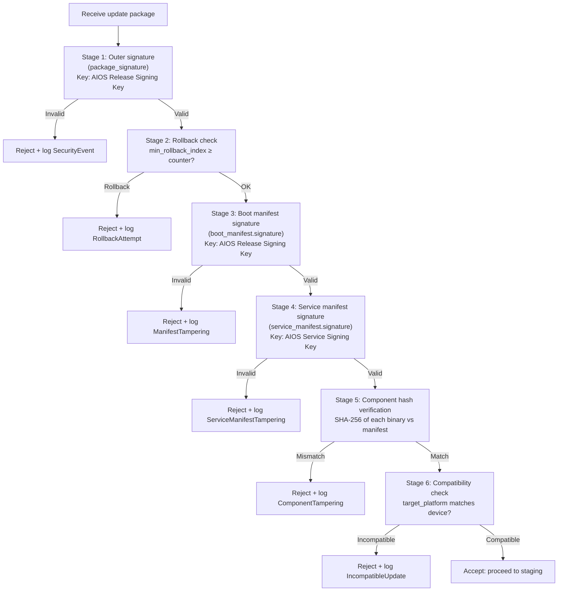
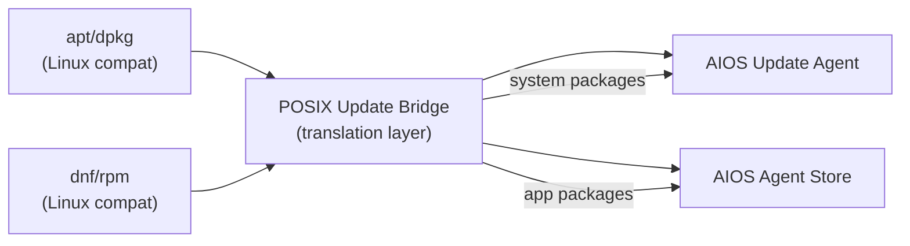

# AIOS Secure Boot — Update Security Operations & POSIX Compatibility

Part of: [secure-boot.md](../secure-boot.md) — Secure Boot & Update System
**Related:** [trust-chain.md](./trust-chain.md) — Chain of trust and verification,
[uefi.md](./uefi.md) — UEFI Secure Boot and TrustZone,
[updates.md](./updates.md) — A/B updates and rollback protection,
[intelligence.md](./intelligence.md) — AI-native update intelligence

**See also:** [model/operations.md](../model/operations.md) — Security event response and audit (§6–§7),
[model/capabilities.md](../model/capabilities.md) — Capability token system (§3),
[posix.md](../../platform/posix.md) — POSIX compatibility layer

-----

## §10 Update Security Operations

Update operations are among the most security-sensitive actions in the system — they modify the boot chain, service binaries, and AI models that all other security guarantees depend on. This section defines the capability requirements, verification pipeline, audit trail, and incident response for updates.

### §10.1 Update Agent Capabilities

The update agent is a system agent running at Trust Level 1 (system services) with a carefully scoped set of capabilities. It has more privilege than any third-party agent but less than the kernel.

**Required capabilities** (pseudocode — actual capability types defined in [model/capabilities.md §3](../model/capabilities.md); this listing shows the logical permissions, not the exact enum variants):

```rust
/// Logical capabilities granted to the system update agent
/// (illustrative — see model/capabilities.md §3 for actual Capability enum)
pub const UPDATE_AGENT_CAPS: &[Capability] = &[
    /// Read/write the ESP (FAT32 boot partition)
    /// Most sensitive: allows modifying boot components
    Capability::EspWriteAccess,

    /// Stage system updates in system/ space
    Capability::WriteSpace { space: SpaceId::SYSTEM },

    /// Read update packages from ephemeral/ space
    Capability::ReadSpace { space: SpaceId::EPHEMERAL },

    /// Network access to update servers
    Capability::NetworkAccess {
        hosts: &["updates.aios.dev", "models.aios.dev", "store.aios.dev"],
        protocols: &[Protocol::Https],
    },

    /// Read device information for update targeting
    Capability::DeviceInfo,

    /// Request reboot (after staging)
    Capability::SystemReboot,

    /// Read anti-rollback counter (via TrustZone SMC)
    Capability::SecureElementRead,

    /// Write audit events
    Capability::AuditWrite,
];
```

**Capability constraints:**
- The update agent **cannot** write to user spaces, ephemeral spaces (except downloads), or agent-owned spaces
- The update agent **cannot** access agent developer keys or modify the Agent Store trust database
- The update agent **cannot** advance the anti-rollback counter directly — only the boot success path does this
- The update agent **cannot** disable Secure Boot or modify UEFI Secure Boot variables (firmware-protected)

**Agent isolation:**
- The update agent runs in its own process with its own address space (TTBR0)
- It cannot access kernel memory or other agents' memory
- IPC with the kernel is limited to well-defined syscalls (capability-checked)
- If the update agent crashes, it is restarted by the service manager (with exponential backoff)

### §10.2 Signature Verification Pipeline

Every update package passes through a multi-stage verification pipeline before any component is modified on disk.

**Pipeline stages:**



**Certificate chain validation (for agent updates):**

Agent updates have an additional certificate chain check (the agent developer's signing key must chain back to the AIOS Root CA):

1. Root CA certificate → Agent Store Signing Key certificate → Developer certificate → Manifest signature
2. Each link in the chain is verified: certificate expiry, key revocation status (CRL check), signature validity
3. CRL (Certificate Revocation List) is cached locally and updated periodically via network
4. If CRL is stale (>30 days old) and network is unavailable: warn but allow updates from non-revoked keys

### §10.3 Update Integrity Audit Trail

Every update operation is recorded in the provenance chain, creating an immutable audit trail.

**Audit events for updates:**

```rust
pub enum UpdateAuditEvent {
    /// Update check started
    CheckStarted {
        channel: UpdateChannel,
        current_version: Version,
    },
    /// Update available
    UpdateAvailable {
        channel: UpdateChannel,
        target_version: Version,
        delta_available: bool,
    },
    /// Download started
    DownloadStarted {
        channel: UpdateChannel,
        target_version: Version,
        download_size: u64,
        is_delta: bool,
    },
    /// Download completed
    DownloadCompleted {
        channel: UpdateChannel,
        target_version: Version,
        duration_ms: u64,
    },
    /// Signature verification result
    VerificationResult {
        channel: UpdateChannel,
        target_version: Version,
        stage: VerificationStage,
        result: VerificationOutcome,
    },
    /// Update staged (ready for reboot/hot-swap)
    UpdateStaged {
        channel: UpdateChannel,
        target_version: Version,
    },
    /// Update applied (after reboot or hot-swap)
    UpdateApplied {
        channel: UpdateChannel,
        new_version: Version,
        previous_version: Version,
    },
    /// Update confirmed (boot success criteria met)
    UpdateConfirmed {
        channel: UpdateChannel,
        version: Version,
        rollback_counter_advanced_to: u64,
    },
    /// Rollback occurred
    Rollback {
        channel: UpdateChannel,
        from_version: Version,
        to_version: Version,
        reason: RollbackReason,
    },
}
```

**Audit storage:**
- Events stored in `system/audit/updates/` space as content-addressed objects
- Each event is signed by the update agent's identity (Ed25519)
- Events are appended to the Merkle chain — they cannot be modified or deleted
- Enterprise MDM can query the audit trail for compliance reporting

### §10.4 Incident Response

When the verification pipeline detects a tampering attempt, the system escalates through a graduated response:

**Severity levels:**

| Severity | Trigger | Automated Response | User Notification |
|---|---|---|---|
| Info | Update available, download started | Log event | None |
| Warning | Stale CRL, dev-mode build detected | Log event + Inspector badge | Inspector notification |
| High | Signature invalid, hash mismatch | Reject update, log event | Inspector alert + persistent banner |
| Critical | Rollback attack detected, ESP tampered | Reject + enter safe mode | Full-screen alert, Inspector auto-opens |

**Safe mode entry on critical events:**

When a critical update security event is detected:

1. Current update operation is aborted immediately
2. All pending update downloads are discarded
3. Security event logged to `system/audit/security/` with full context
4. Inspector opens automatically, showing the security event details
5. User is guided through:
   - What happened (e.g., "A system update failed signature verification")
   - What this means (e.g., "Someone may have tried to install unauthorized software")
   - What to do (e.g., "Check your network connection, contact support if this recurs")
6. The system continues running in current (known-good) state — no update is applied

**Incident forensics:**
- The rejected update package is preserved in `ephemeral/quarantine/` for analysis
- All verification stage results are logged (which stage failed, what hash was expected vs. found)
- Network metadata is recorded (source IP, TLS certificate, download timestamps)
- If TrustZone is available: measurement log at time of incident is snapshot to secure world

### §10.5 Revocation

When a signing key is compromised, AIOS has multiple revocation mechanisms:

**Key compromise response by key type:**

| Compromised Key | Revocation Mechanism | Time to Effect |
|---|---|---|
| Agent developer key | Add to CRL via Agent Store; push CRL to all devices | Hours (next CRL sync) |
| AIOS Service Signing Key | Rotate key; new updates signed with new key; old key added to embedded revocation list | Days (next system update) |
| AIOS Release Signing Key | Emergency update signed with backup key; old key added to firmware dbx | Days to weeks |
| UEFI KEK/db key | UEFI dbx update via firmware capsule | Days to weeks |
| AIOS Root CA | Nuclear option: re-enroll all developer keys, rotate all infrastructure keys | Weeks |

**Embedded revocation list:**
- The kernel binary contains a compiled-in list of revoked key fingerprints
- Checked at every signature verification (boot, service, agent, model)
- Updated with each system update
- Provides offline revocation (no network needed)

**CRL distribution:**
- Certificate Revocation Lists are distributed via the update server (`updates.aios.dev/crl/`)
- Default sync interval: every 24 hours
- Maximum CRL staleness: 30 days (after which, unverified agent updates are blocked until CRL refreshes)
- CRL itself is signed by the AIOS Root CA

-----

## §11 POSIX & Compatibility

AIOS provides compatibility interfaces for tools and workflows that expect traditional Linux-style update and version mechanisms.

### §11.1 Package Manager Bridge

AIOS does not use traditional package managers (apt, dnf, pacman) internally, but provides a bridge for compatibility with tools that expect them.

**Bridge architecture:**



**Translation rules:**
- `apt update` → triggers update check on all channels
- `apt upgrade` → stages available system updates (with user approval)
- `apt install <package>` → searches Agent Store for matching agent
- `dpkg -l` → lists installed system services and agents with version numbers
- `apt-cache search <query>` → searches Agent Store catalog

**Limitations:**
- The bridge provides **read-mostly** compatibility — querying versions and triggering updates works
- Direct `.deb`/`.rpm` installation is not supported (agents must come from the Agent Store or be sideloaded via `aios agent dev`)
- Package dependency resolution follows AIOS rules, not dpkg/rpm rules

### §11.2 Version Information

Standard POSIX interfaces for version information are supported:

**`/proc/version` (via POSIX bridge):**

```text
AIOS version 24.1.0 (aios@build.aios.dev) (rustc 1.82.0-nightly) #1 SMP PREEMPT 2026-03-15
```

**`uname -a` output:**

```text
AIOS aios-hostname 24.1.0 #1 SMP PREEMPT aarch64 AIOS
```

**Field mapping:**

| uname field | POSIX value | AIOS source |
|---|---|---|
| sysname | `AIOS` | Constant |
| nodename | `aios-hostname` | System configuration |
| release | `24.1.0` | Boot manifest `os_version` |
| version | `#1 SMP PREEMPT` | Build configuration |
| machine | `aarch64` | Architecture constant |

### §11.3 dm-verity Compatibility Layer

Linux applications and containers that expect dm-verity (device-mapper verity) for verified block device access are supported through a compatibility layer.

**dm-verity bridge:**

- AIOS does not use dm-verity internally (the Block Engine provides its own integrity via CRC-32C and content-addressing)
- For Linux binary compatibility (Phase 36), a dm-verity translation layer maps dm-verity ioctls to Block Engine integrity verification
- Container runtimes (if supported) can use dm-verity-protected root filesystems through this bridge
- The bridge provides **read-only** verified block access — write operations go through the normal Block Engine path

**Verification mapping:**

| dm-verity concept | AIOS equivalent |
|---|---|
| Hash tree | Block Engine CRC-32C + content-addressed SHA-256 |
| Root hash | Space root hash (Version Store Merkle root) |
| Salt | Block Engine nonce (per-block, in encrypted mode) |
| Data blocks | Block Engine sectors |
| Corruption detection | CRC-32C mismatch on read |
