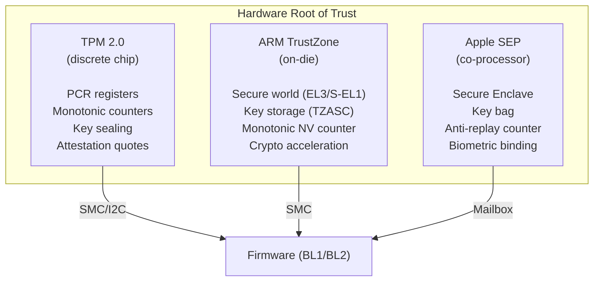
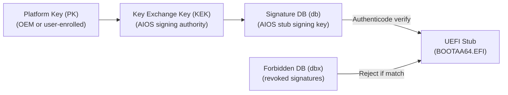
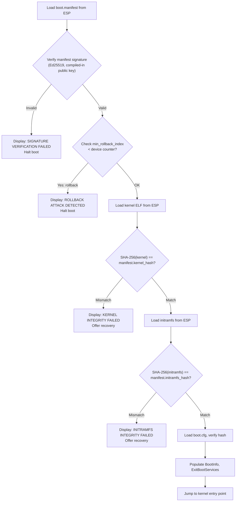
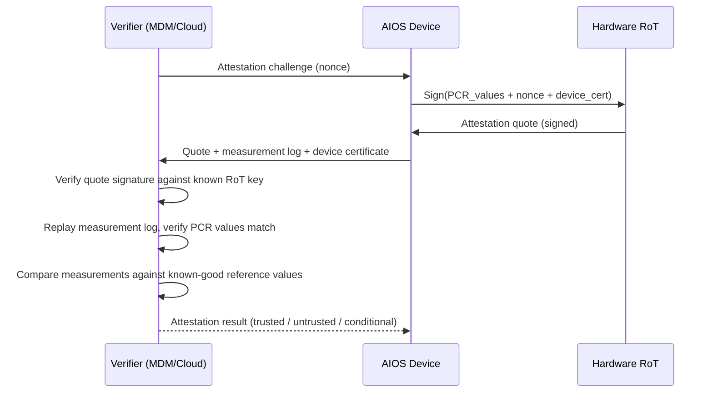

# AIOS Secure Boot — Threat Model & Chain of Trust

Part of: [secure-boot.md](../secure-boot.md) — Secure Boot & Update System
**Related:** [uefi.md](./uefi.md) — UEFI Secure Boot & TrustZone integration,
[updates.md](./updates.md) — A/B updates & rollback protection,
[operations.md](./operations.md) — Update security operations

**See also:** [model.md](../model.md) — Security model threat model (§1),
[model/hardening.md](../model/hardening.md) — Cryptographic foundations (§4),
[boot/firmware.md](../../kernel/boot/firmware.md) — UEFI firmware handoff (§2),
[airs.md](../../intelligence/airs.md) — AI Runtime Service model registry (§4),
[agents.md](../../applications/agents.md) — Agent manifest signing (§2.4)

-----

## §2 Threat Model

The boot and update threat model extends the system-wide threat model (model.md §1) with threats specific to the boot process, firmware integrity, and software update pipeline. These threats are distinct because they target the system before security services are fully operational — a compromised boot chain undermines all higher-level protections.

### §2.1 Boot-Time Threats

**Evil Maid attack.** An adversary with physical access modifies the ESP (FAT32 partition on the boot device) to replace the kernel image, UEFI stub, or boot configuration with a malicious version. Since FAT32 has no access controls or integrity protection, this requires only brief physical access and a USB drive.

**Firmware tampering.** An adversary modifies UEFI firmware (edk2 or platform firmware) to bypass Secure Boot checks, inject rootkit code that persists across OS reinstalls, or modify the BootInfo structure passed to the kernel. This is the most severe boot-time threat because firmware runs before any OS security measures.

**ESP modification via OS compromise.** A compromised agent or service with unexpected filesystem access modifies ESP contents. Unlike the Evil Maid scenario, this attack vector comes from within the running system. Mitigation: `EspWriteAccess` capability gates all ESP modifications ([operations.md §10.1](./operations.md)); only the update agent holds this capability, enforced by the kernel capability system ([model/capabilities.md §3](../model/capabilities.md)).

**Boot configuration manipulation.** The `boot.cfg` file on the ESP controls boot parameters (kernel command line, boot options). An attacker modifying this file could disable security features, change memory layout, or redirect boot to a malicious kernel. Current state: `boot.cfg` is unsigned.

**DTB/ACPI table injection.** On platforms where the device tree or ACPI tables are loaded from storage (rather than firmware-provided), an attacker could substitute malicious tables that remap memory regions, hide hardware, or redirect interrupts.

**Cold boot / DMA attack.** An adversary with physical access extracts encryption keys from RAM (cold boot) or uses a DMA-capable peripheral (Thunderbolt, FireWire) to read kernel memory. Relevant for device key and master key extraction.

### §2.2 Update-Time Threats

**Man-in-the-middle on update channel.** An attacker intercepts update traffic and substitutes a malicious update package. Mitigation: Ed25519 signature verification of all update packages; TLS for transport ([networking/security.md §6](../../platform/networking/security.md)).

**Rollback / downgrade attack.** An attacker forces the device to install an older, vulnerable version of the kernel, services, or models. This is particularly dangerous because the old version may have known exploits. Mitigation: monotonic anti-rollback counter in TrustZone/TPM (§9.1).

**Supply chain compromise.** An attacker compromises the build system, CI/CD pipeline, or developer signing key to inject malicious code into a legitimate update. The update appears validly signed. Mitigation: reproducible builds, multi-party signing, certificate transparency ([intelligence.md §16.5](./intelligence.md)).

**Partial update / interrupted update.** Power loss or crash during update leaves the system in an inconsistent state — new kernel with old services, or half-written files. Mitigation: atomic A/B scheme (§6), content-addressed storage for services.

**Update server compromise.** An attacker gains control of the update distribution infrastructure and serves malicious updates to all connected devices. Mitigation: updates are signed by offline keys, not server keys. The server authenticates and distributes but cannot forge signatures.

**Replay attack.** An attacker replays a previously valid (but now superseded) update package. Mitigation: monotonic version numbers checked against anti-rollback counter.

### §2.3 AI-Specific Threats

**Model poisoning via update.** An attacker replaces a legitimate AIRS model with a poisoned version that subtly alters security decisions — approving malicious capabilities, suppressing anomaly alerts, or biasing intent verification. This is the most dangerous AI-specific threat because AIRS makes kernel-delegated security decisions.

**Adversarial model injection.** An attacker uploads a model to the model registry that appears legitimate but contains backdoor triggers — specific input patterns that cause the model to produce attacker-desired outputs. Distinct from poisoning in that the model may perform normally on standard benchmarks.

**Agent impersonation via model.** A poisoned model causes AIRS to misidentify agent provenance — attributing a malicious agent's actions to a trusted agent, or vice versa. This undermines the provenance chain (model/operations.md §7).

**Training data exfiltration.** A model trained on user data (fine-tuned locally) is extracted via the model update channel, leaking private information embedded in model weights. Mitigation: model update channel does not upload user-trained models without explicit consent.

**Model supply chain attack.** The model registry itself is compromised, and new models distributed through it contain backdoors. Unlike code supply chain attacks, model backdoors are extremely difficult to detect through static analysis. Mitigation: model signing, curated registry, anomaly detection on model behavior after update.

### §2.4 What We Don't Defend Against

**Compromised SoC.** A malicious system-on-chip with hardware backdoors can read all memory, bypass all software protections, and forge any signature. There is no software defense against compromised hardware. AIOS assumes the SoC is trustworthy.

**Side-channel attacks during boot.** Timing, power, or electromagnetic side channels during the boot process could leak key material or bypass verification. Formal side-channel resistance is out of scope; ARM hardware features (DIT, SBSS) mitigate some vectors.

**Compromised TrustZone.** If the TrustZone secure world (BL31/OP-TEE) is compromised, all sealed keys and monotonic counters are under attacker control. AIOS trusts TrustZone as the hardware root of trust. Firmware updates for TrustZone follow the same signing requirements as kernel updates.

**Nation-state level attacks.** Attacks with unlimited resources (custom silicon, supply chain interception at the factory) are beyond the threat model. AIOS focuses on practical security against motivated attackers with physical or network access.

-----

## §3 Chain of Trust

The AIOS chain of trust is a six-link verification chain where each component verifies the integrity and authenticity of the next before transferring control. Every link uses cryptographic signatures — there are no "trust because it's already in memory" assumptions.

### §3.1 Hardware Root of Trust

The chain starts with immutable hardware that provides three capabilities:

1. **Secure key storage** — keys that cannot be read by software, only used for signing/verification operations
2. **Monotonic counters** — counters that can only increment, never reset, preventing rollback attacks
3. **Attestation** — cryptographic proof that the device booted with specific firmware and software



**Platform mapping:**

| Platform | Hardware RoT | Key Storage | Anti-Rollback | Communication |
|---|---|---|---|---|
| QEMU (dev) | Software emulated | Kernel memory | UEFI variable (NV) | Direct memory |
| Raspberry Pi 4 | ARM TrustZone (Cortex-A72) | TZASC-protected SRAM | TrustZone NV counter | SMC |
| Raspberry Pi 5 | ARM TrustZone (Cortex-A76) | TZASC-protected SRAM | TrustZone NV counter | SMC |
| Apple Silicon | Apple SEP | Secure Enclave | SEP anti-replay | Mailbox protocol |
| Server/Desktop | TPM 2.0 (discrete or fTPM) | TPM NV storage | TPM monotonic counter | I2C/SPI or SMC |

**QEMU development mode:** Since QEMU does not provide a hardware root of trust, development mode uses a software fallback:
- Keys stored in kernel memory (pinned, no-dump pages)
- Anti-rollback counter stored in UEFI Runtime Variables (non-volatile, but not tamper-resistant)
- Attestation returns synthetic tokens marked `DevMode: true`
- All verification still runs — only the key storage and counter backends differ

### §3.2 Firmware Verification

Firmware verification is the first link in the chain. It uses UEFI Secure Boot (industry standard, widely deployed, firmware-enforced) to verify the AIOS UEFI stub before execution.

**UEFI Secure Boot chain:**



The UEFI stub (`uefi-stub/src/main.rs`) is a PE/COFF binary signed with Authenticode (RSA-2048 or higher). The firmware verifies this signature against the `db` database before loading the stub into memory. If the signature is invalid or the hash appears in `dbx`, the firmware refuses to load the stub.

**Key enrollment scenarios:**

| Scenario | PK Owner | KEK | db Entry |
|---|---|---|---|
| AIOS-only device | AIOS manufacturer | AIOS Root CA | AIOS stub signing key |
| Dual-boot with Linux | User-enrolled | AIOS + distro keys | AIOS + distro signing keys |
| Dual-boot with Windows | Microsoft | Microsoft + AIOS UEFI CA | AIOS stub via UEFI CA, Windows via MS key |
| Developer mode | User-generated | User key | User's self-signed stub |
| QEMU | edk2 default (no enforcement) | N/A | Secure Boot disabled by default |

For detailed UEFI stub signing and key enrollment procedures, see [uefi.md §4](./uefi.md).

### §3.3 Bootloader → Kernel Verification

After the UEFI stub passes firmware verification, it loads the AIOS kernel ELF from the ESP and verifies it independently using Ed25519 — a second, AIOS-controlled verification layer.

**Boot manifest format:**

```rust
/// Stored at /EFI/AIOS/boot.manifest on the ESP
/// Signed with the AIOS Release Signing Key (Ed25519)
pub struct BootManifest {
    /// Manifest format version
    version: u32,
    /// Minimum anti-rollback counter value
    /// If device counter > this value, reject (downgrade)
    min_rollback_index: u64,
    /// SHA-256 hash of the kernel ELF binary
    kernel_hash: [u8; 32],
    /// SHA-256 hash of the initramfs archive
    initramfs_hash: [u8; 32],
    /// SHA-256 hash of the boot command line
    /// Integrity protected by the manifest's Ed25519 signature
    cmdline_hash: [u8; 32],
    /// Build timestamp (for audit trail)
    build_timestamp: u64,
    /// Target hardware platform (for cross-flash detection)
    target_platform: PlatformId,
    /// Ed25519 signature of all above fields
    signature: [u8; 64],
}
```

**Verification flow in the UEFI stub:**



**Key storage for verification:**
- The AIOS Release Signing Key (Ed25519 public key, 32 bytes) is **compiled into the UEFI stub binary** at build time
- The corresponding private key is held offline (HSM-protected, never on build servers)
- The stub binary itself is Authenticode-signed (§3.2), so the compiled-in key cannot be replaced without breaking the Authenticode signature
- This creates a two-layer binding: Authenticode protects the stub; the stub protects the kernel

### §3.4 Kernel → Services Verification

After the kernel boots, it verifies core services loaded from the initramfs before granting them system-level capabilities.

**Initramfs integrity:**
- The UEFI stub already verified the initramfs hash against the boot manifest (§3.3)
- The kernel trusts the initramfs contents because it was verified pre-boot
- Individual service binaries within the initramfs are content-addressed (SHA-256) in the service manifest

**Service manifest:**

```rust
/// Embedded in the initramfs archive
/// Signed with the AIOS Service Signing Key (Ed25519)
pub struct ServiceManifest {
    /// List of core services and their expected hashes
    services: Vec<ServiceEntry>,
    /// Minimum OS version for this service set
    min_os_version: Version,
    /// Ed25519 signature
    signature: [u8; 64],
}

pub struct ServiceEntry {
    /// Service name (e.g., "compositor", "storage-manager")
    name: ServiceName,
    /// SHA-256 hash of the service binary
    binary_hash: [u8; 32],
    /// Capabilities this service is authorized to receive
    authorized_caps: Vec<Capability>,
    /// Trust level for this service (model.md §1.2)
    trust_level: TrustLevel,
}
```

**Verification sequence:**
1. Kernel unpacks initramfs to a temporary in-memory filesystem
2. Kernel verifies the service manifest signature (AIOS Service Signing Key)
3. For each service to launch:
   a. Compute SHA-256 of the binary
   b. Compare against `ServiceEntry.binary_hash`
   c. If match: grant `authorized_caps` capabilities
   d. If mismatch: log security event, skip service, continue boot in degraded mode

### §3.5 Services → AIRS Verification

The AIRS runtime loads AI models from `system/models/` space. Model integrity verification ensures that the models making security decisions are authentic and untampered.

**Current model verification** (as designed in [airs.md §4.1](../../intelligence/airs.md)):
- SHA-256 hash of model file compared against hash stored in `ModelEntry` space object
- Corrupted models are skipped; degraded mode if all models fail

**Phase 35 enhancement — signed model manifests:**

```rust
/// Stored alongside each model in system/models/
/// Signed with the AIOS Model Signing Key (Ed25519)
pub struct ModelManifest {
    /// Model identifier (unique across registry)
    model_id: ModelId,
    /// Model version (semver)
    version: Version,
    /// SHA-256 hash of the model file (GGUF format)
    model_hash: [u8; 32],
    /// Model task profile (general, embedding, vision, etc.)
    task_profile: TaskProfile,
    /// Minimum anti-rollback index for this model
    min_rollback_index: u64,
    /// Safety evaluation results (bias, toxicity benchmarks)
    safety_eval: SafetyEvaluation,
    /// Training provenance (dataset attestation, training config hash)
    provenance: ModelProvenance,
    /// Ed25519 signature by AIOS Model Signing Authority
    signature: [u8; 64],
}
```

**Verification at model load time:**
1. Read `ModelManifest` from `system/models/{model_id}/manifest`
2. Verify Ed25519 signature (AIOS Model Signing Key, distinct from kernel/service keys)
3. Check `min_rollback_index` against model-specific anti-rollback counter
4. Compute SHA-256 of model file, compare against `model_hash`
5. If all checks pass: model is loaded for inference
6. If any check fails: model is quarantined, next candidate model attempted, security event logged

### §3.6 AIRS → Agents Verification

Agent verification is already designed in detail ([agents.md §2.4, §3.1](../../applications/agents.md)). The chain of trust for agents:

1. **Developer enrollment** — developer's Ed25519 public key registered in Agent Store, signed by AIOS Agent Store Signing Key
2. **Agent publish** — developer signs agent manifest (including code hash) with their Ed25519 key
3. **Agent install** — kernel verifies full certificate chain: Root CA → Agent Store → Developer → Manifest
4. **AIRS analysis** — static code analysis for suspicious patterns, unused capabilities
5. **User approval** — manifest, capabilities, and AIRS analysis summary presented to user
6. **Runtime enforcement** — capabilities from manifest enforced by kernel at runtime

See [agents.md §2.4](../../applications/agents.md) for the `AgentManifest` structure and [model/hardening.md §4.3](../model/hardening.md) for the certificate chain.

### §3.7 Measured Boot

Measured boot creates a tamper-evident log of every component loaded during boot. Unlike verified boot (which halts on failure), measured boot **records** what was loaded and allows post-boot verification — enabling remote attestation and forensic analysis.

**Measurement log:**

```rust
/// Each boot component is measured (hashed) and recorded
pub struct BootMeasurement {
    /// Index in the measurement log (monotonically increasing)
    index: u32,
    /// What was measured
    component: MeasuredComponent,
    /// SHA-256 hash of the component
    digest: [u8; 32],
    /// Timestamp (from firmware or kernel timer)
    timestamp: u64,
}

pub enum MeasuredComponent {
    /// UEFI firmware (measured by hardware RoT)
    Firmware,
    /// UEFI Secure Boot configuration (PK, KEK, db, dbx)
    SecureBootConfig,
    /// UEFI stub binary
    UefiStub,
    /// Boot manifest
    BootManifest,
    /// Kernel ELF
    Kernel,
    /// Kernel command line
    CommandLine,
    /// Device tree / ACPI tables
    DeviceTree,
    /// Initramfs archive
    Initramfs,
    /// Individual service binary
    Service(ServiceName),
    /// AI model file
    Model(ModelId),
}
```

**Measurement storage:**

| Platform | Storage | Mechanism |
|---|---|---|
| TPM 2.0 | PCR registers (Platform Configuration Registers) | `TPM2_PCR_Extend` — hash chaining into PCR banks |
| ARM TrustZone | Secure world measurement log | SMC call to BL31 measurement service |
| Apple SEP | SEP attestation record | Mailbox measurement API |
| QEMU (dev) | In-memory measurement log | Kernel-maintained ring buffer (not tamper-resistant) |

**PCR allocation (TPM 2.0 platforms):**

| PCR | Component | Extended by |
|---|---|---|
| 0 | UEFI firmware | Platform reset |
| 1 | UEFI configuration (Secure Boot state) | Firmware |
| 4 | UEFI stub | Firmware (IPL) |
| 7 | Secure Boot policy | Firmware |
| 8 | Boot manifest | UEFI stub |
| 9 | Kernel ELF | UEFI stub |
| 10 | Command line + DTB | UEFI stub |
| 11 | Initramfs | UEFI stub |
| 12 | Service binaries (cumulative) | Kernel |
| 13 | AI models (cumulative) | AIRS |

**Hash chain semantics:** Each `PCR_Extend` operation computes `PCR_new = SHA-256(PCR_old || measurement)`. This creates a hash chain — the final PCR value is a unique fingerprint of every component loaded in that slot. Any change to any component produces a different PCR value, without revealing which specific component changed.

### §3.8 Remote Attestation

Remote attestation allows a third party (enterprise MDM server, cloud service, another AIOS device) to verify that this device booted with known-good software. This is essential for enterprise deployments and cross-device trust.

**Attestation flow:**



**Attestation token format:**

```rust
pub struct AttestationToken {
    /// Device identity certificate (bound to hardware RoT)
    device_cert: Certificate,
    /// PCR values at time of attestation
    pcr_values: BTreeMap<u32, [u8; 32]>,
    /// Full measurement log (for verifier replay)
    measurement_log: Vec<BootMeasurement>,
    /// Challenge nonce from verifier (prevents replay)
    nonce: [u8; 32],
    /// Timestamp of attestation
    timestamp: u64,
    /// Signature by hardware RoT over all above fields
    signature: AttestationSignature,
}

pub enum AttestationSignature {
    /// TPM 2.0 quote (RSA or ECC)
    Tpm2Quote(Vec<u8>),
    /// ARM CCA realm attestation token (COSE_Sign1)
    CcaToken(Vec<u8>),
    /// Apple SEP attestation
    SepAttestation(Vec<u8>),
    /// Development mode (software-generated, marked untrusted)
    DevMode(Vec<u8>),
}
```

**ARM CCA integration:** On ARM v9 platforms with Confidential Compute Architecture (CCA), attestation extends to the realm level. Each agent running in a CCA realm can produce its own attestation token, proving that the agent's code and data are protected from the kernel and other agents. This provides the strongest isolation guarantee available on ARM.

**Enterprise use cases:**

- **MDM enrollment** — device proves it booted with approved firmware/kernel before accessing corporate resources
- **Zero-trust network** — attestation token presented with every connection to corporate services
- **Cross-device trust** — AIOS Peer Protocol includes attestation exchange for capability delegation between devices
- **Compliance reporting** — attestation logs stored in `system/audit/attestation/` with provenance chain entries
