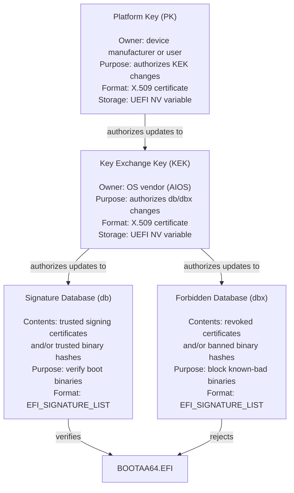
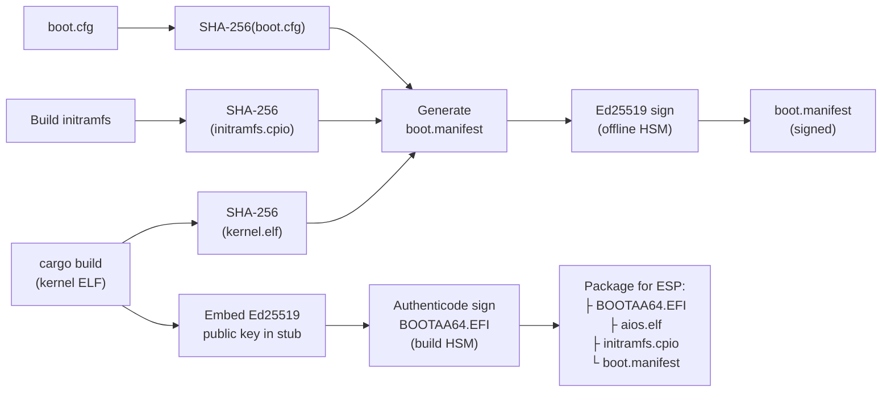
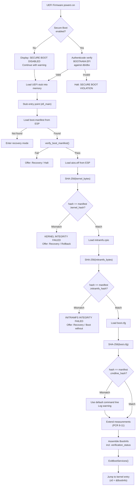
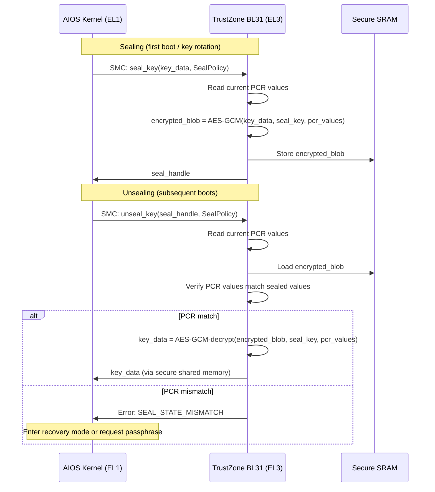

# AIOS Secure Boot — UEFI Integration & Secure Element

Part of: [secure-boot.md](../secure-boot.md) — Secure Boot & Update System
**Related:** [trust-chain.md](./trust-chain.md) — Chain of trust and threat model,
[updates.md](./updates.md) — A/B updates and rollback protection,
[operations.md](./operations.md) — Update security operations

**See also:** [boot/firmware.md](../../kernel/boot/firmware.md) — UEFI firmware handoff (§2),
[model/hardening.md](../model/hardening.md) — Cryptographic foundations (§4–§5),
[boot/recovery.md](../../kernel/boot/recovery.md) — Recovery mode (§9)

-----

## §4 UEFI Secure Boot Integration

AIOS uses two independent verification layers at boot: UEFI Secure Boot (firmware-enforced, Authenticode) verifies the UEFI stub, and the stub verifies the kernel ELF (AIOS-controlled, Ed25519). This defense-in-depth approach means that compromise of either layer alone does not allow booting a malicious kernel.

### §4.1 AIOS Signing Key Enrollment

UEFI Secure Boot uses a hierarchy of key databases stored in firmware non-volatile storage:



**Enrollment procedures:**

**Factory-provisioned AIOS device:**

1. PK: AIOS manufacturer certificate (or user can replace during setup)
2. KEK: AIOS OS Signing Authority certificate
3. db: AIOS UEFI Stub Signing Key certificate
4. dbx: empty (updated via OS updates for revoked keys)

**User-managed device (Raspberry Pi, custom build):**

1. User generates PK with `aios-keytool generate-pk`
2. User enrolls AIOS KEK: `aios-keytool enroll-kek --key aios-kek.cer`
3. AIOS KEK signs db update containing AIOS stub signing certificate
4. User enters firmware setup to enable Secure Boot with user keys

**Dual-boot with other OSes:**

1. Multiple KEKs enrolled (one per OS vendor)
2. Each OS vendor's signing certificate added to db
3. AIOS update agent only modifies AIOS-related db entries (scoped by KEK)

**Key generation and storage:**

| Key | Algorithm | Lifecycle | Storage |
|---|---|---|---|
| PK | RSA-2048+ or ECC P-256 | Device lifetime | UEFI NV (firmware-protected) |
| KEK | RSA-2048+ or ECC P-256 | Rotated annually | UEFI NV; private key in HSM |
| db signing cert | RSA-2048+ or ECC P-256 | Per-release or per-year | UEFI NV; private key in build HSM |
| Stub Authenticode | RSA-2048 SHA-256 | Per-build | Embedded in PE; private key in HSM |
| Kernel Ed25519 | Ed25519 | Per-release | Compiled into stub; private key offline HSM |

### §4.2 Kernel ELF Signing Workflow

The kernel ELF is signed at build time with Ed25519. The signature is stored in the boot manifest alongside the kernel hash.

**Build-time signing pipeline:**



**Offline signing ceremony:**

The Ed25519 private key for kernel signing is stored in an HSM (Hardware Security Module) that is **air-gapped** — never connected to the internet or build network. The signing ceremony:

1. Build system produces unsigned `boot.manifest` (hashes only, no signature)
2. Manifest transferred to HSM workstation via USB
3. HSM signs manifest with Ed25519 private key
4. Signed manifest transferred back to build system
5. Build system packages signed manifest with kernel and initramfs

For development builds, a development signing key (stored locally, marked as `dev` in the manifest) is used. Development-signed builds display a warning banner at boot: `⚠ DEVELOPMENT BUILD — NOT PRODUCTION SIGNED`.

### §4.3 Boot Manifest Format

The boot manifest is the central trust anchor for the stub-to-kernel verification. It binds together all boot components into a single signed unit.

**On-disk format** (stored at `/EFI/AIOS/boot.manifest` on ESP):

```rust
/// 256 bytes, fixed-size, repr(C) for cross-platform compatibility
/// Field layout (offsets in bytes):
///   [0..8)     magic
///   [8..12)    format_version
///   [12..16)   flags
///   [16..24)   min_rollback_index
///   [24..56)   kernel_hash
///   [56..88)   initramfs_hash
///   [88..120)  cmdline_hash
///   [120..128) build_timestamp
///   [128..132) target_platform
///   [132..136) os_version
///   [136..192) _reserved (56 bytes)
///   [192..256) signature (64 bytes)
#[repr(C)]
pub struct BootManifest {
    /// Magic: "AIOSMNFT" (0x41494F53_4D4E4654)
    magic: u64,                     // offset 0, 8 bytes
    /// Format version (currently 1)
    format_version: u32,            // offset 8, 4 bytes
    /// Manifest flags
    flags: ManifestFlags,           // offset 12, 4 bytes (u32)
    /// Minimum anti-rollback counter value for this release
    min_rollback_index: u64,        // offset 16, 8 bytes
    /// SHA-256 hash of kernel ELF binary
    kernel_hash: [u8; 32],          // offset 24, 32 bytes
    /// SHA-256 hash of initramfs archive
    initramfs_hash: [u8; 32],       // offset 56, 32 bytes
    /// SHA-256 hash of boot command line (boot.cfg contents)
    /// Stored in the signed manifest; verified by comparing against
    /// SHA-256(boot.cfg) at boot. No secret key needed — the manifest
    /// signature protects the hash's integrity.
    cmdline_hash: [u8; 32],         // offset 88, 32 bytes
    /// Build timestamp (Unix epoch seconds)
    build_timestamp: u64,           // offset 120, 8 bytes
    /// Target platform identifier
    target_platform: u32,           // offset 128, 4 bytes
    /// OS version (major.minor.patch packed as u32)
    os_version: u32,                // offset 132, 4 bytes
    /// Reserved for future fields
    _reserved: [u8; 56],            // offset 136, 56 bytes
    /// Ed25519 signature over bytes [0..192) (everything before signature)
    signature: [u8; 64],            // offset 192, 64 bytes
}
// Total: 256 bytes (compile-time assert: size_of::<BootManifest>() == 256)

bitflags! {
    pub struct ManifestFlags: u32 {
        /// Development build (show warning banner)
        const DEV_BUILD = 1 << 0;
        /// Initramfs is optional (boot without if missing)
        const INITRAMFS_OPTIONAL = 1 << 1;
        /// Command line is unsigned (skip hash check)
        const CMDLINE_UNSIGNED = 1 << 2;
        /// Contains supplementary DTB
        const HAS_DTB = 1 << 3;
    }
}
```

**Manifest verification in UEFI stub** (pseudocode):

```rust
fn verify_boot_manifest(manifest: &BootManifest) -> Result<(), BootError> {
    // 1. Check magic
    if manifest.magic != BOOT_MANIFEST_MAGIC {
        return Err(BootError::InvalidManifest);
    }

    // 2. Verify Ed25519 signature (public key compiled into stub)
    let signed_bytes = &manifest_bytes[..192];
    if !ed25519_verify(AIOS_RELEASE_KEY, signed_bytes, &manifest.signature) {
        display_error("BOOT MANIFEST SIGNATURE INVALID");
        return Err(BootError::SignatureInvalid);
    }

    // 3. Check anti-rollback counter
    let device_counter = read_rollback_counter()?;
    if manifest.min_rollback_index < device_counter {
        display_error("ROLLBACK ATTACK DETECTED");
        return Err(BootError::RollbackDetected);
    }

    // NOTE: The anti-rollback counter is NOT advanced here.
    // Counter advancement happens only after the new version
    // confirms boot success (§9.1 in updates.md). This ensures
    // the previous version remains bootable if the new version
    // fails to reach the health confirmation stage.

    Ok(())
}
```

### §4.4 UEFI Stub Verification Flow

The complete boot verification flow from firmware to kernel entry:



**Verification status in BootInfo:**

```rust
/// Proposed addition to BootInfo (shared/src/boot.rs) — implemented in Phase 34
pub struct VerificationStatus {
    /// Was Secure Boot enabled in firmware?
    secure_boot_enabled: bool,
    /// Did UEFI Secure Boot verification pass?
    stub_authenticode_valid: bool,
    /// Did boot manifest Ed25519 verification pass?
    manifest_signature_valid: bool,
    /// Did kernel hash match manifest?
    kernel_integrity_valid: bool,
    /// Did initramfs hash match manifest?
    initramfs_integrity_valid: bool,
    /// Did command line hash match?
    cmdline_integrity_valid: bool,
    /// Anti-rollback counter value after update
    rollback_counter: u64,
    /// Measurement log (for PCR extension by kernel)
    measurement_count: u32,
}
```

The kernel uses `VerificationStatus` to:
- Log boot integrity to `system/audit/boot/`
- Decide whether to enter degraded mode (if any verification failed)
- Pass measurement data to the attestation subsystem
- Display boot integrity status in Inspector (applications/inspector.md)

### §4.5 Secure Boot Policy

When verification fails at any stage, the system follows a graduated response policy:

| Failure | Severity | Response |
|---|---|---|
| Secure Boot disabled in firmware | Warning | Boot normally, display persistent warning, log to audit |
| Authenticode signature invalid | Critical | Firmware refuses to load stub (firmware-enforced, AIOS cannot override) |
| Boot manifest missing | High | Enter recovery mode; offer: download manifest, boot unsigned (dev only), halt |
| Manifest signature invalid | Critical | Display error, offer: recovery shell, halt |
| Rollback detected | Critical | Display error, halt (no bypass — downgrade is never acceptable) |
| Kernel hash mismatch | Critical | Display error, offer: rollback to .prev, recovery shell, halt |
| Initramfs hash mismatch | High | Display error, offer: boot without initramfs (degraded), rollback, recovery |
| Command line hash mismatch | Medium | Use default command line, log warning, continue boot |

**Developer mode override:** When the boot manifest has `DEV_BUILD` flag set:
- Hash mismatches produce warnings instead of halting
- Anti-rollback check is skipped
- A prominent `⚠ DEV MODE` banner is displayed throughout the boot process
- Developer mode cannot be enabled on production-signed manifests (flag is covered by signature)

### §4.6 Platform Differences

Each target platform has unique firmware behavior that affects secure boot implementation:

**QEMU (edk2):**
- UEFI Secure Boot available but disabled by default
- No hardware root of trust — software fallback for all key storage
- Anti-rollback counter in UEFI Runtime Variable `AiosRollbackCounter`
- edk2 provides standard UEFI Secure Boot variable interface
- Measurement log stored in kernel memory (not tamper-resistant)

**Raspberry Pi 4 (Cortex-A72):**
- VideoCore bootloader runs first (proprietary, closed-source)
- VideoCore loads UEFI from SD card / USB (no Secure Boot on VideoCore stage)
- UEFI (TianoCore/edk2 for RPi4) provides standard Secure Boot
- TrustZone available: Cortex-A72 supports EL3/S-EL1
- ARM Trusted Firmware (TF-A) in BL31 provides SMC services
- TZASC protects dedicated SRAM for key storage

**Raspberry Pi 5 (Cortex-A76):**
- RP1 south bridge + BCM2712 SoC
- Boot ROM → VideoCore → UEFI chain
- TrustZone with improved TZASC
- Dedicated OTP (one-time programmable) fuses for secure boot hash
- Platform can be locked: OTP hash of authorized boot signing key burned into fuses

**Apple Silicon (M-series, via Asahi Linux):**
- Apple boot chain: iBoot → m1n1 → U-Boot → UEFI
- Apple SEP provides hardware root of trust (separate co-processor)
- SEP key bag for sealed storage
- SEP anti-replay counter for rollback protection
- UEFI provided by U-Boot (limited Secure Boot support — AIOS stub verification is primary)
- m1n1 hypervisor may intercept EL2 — AIOS runs in EL1 under m1n1

**Server/Desktop (generic ARM server):**
- Standard UEFI Secure Boot with TPM 2.0
- TPM provides PCR registers, monotonic counters, attestation quotes
- Most mature secure boot path — follows industry-standard specifications
- SBAT (Secure Boot Advanced Targeting) for fine-grained revocation

-----

## §5 TrustZone & Secure Element Integration

ARM TrustZone provides a hardware-isolated secure world for key storage, cryptographic operations, and anti-rollback counters. Phase 34 implements an SMC-based interface to ARM Trusted Firmware (BL31); Phase 39+ provides a migration path to OP-TEE Trusted Applications for complex operations.

### §5.1 Key Migration

Before Phase 34, all cryptographic keys reside in kernel memory (pinned, no-dump pages). This protects against software-only attackers but not physical access (cold boot, DMA attacks). Phase 34 migrates critical keys to the TrustZone secure world.

**Keys migrated to secure world:**

| Key | Pre-Phase 34 Location | Phase 34 Location | Purpose |
|---|---|---|---|
| Device encryption key | Kernel memory | TrustZone secure SRAM | Block encryption (AES-256-GCM) |
| Master key | Kernel memory | TrustZone secure SRAM | Space key derivation |
| Kernel signing key (verify) | Compiled into stub | TrustZone secure SRAM + stub | Boot manifest verification |
| Provenance signing key | Kernel memory | TrustZone secure SRAM | Audit chain signatures |

**Keys remaining in kernel memory:**

| Key | Reason |
|---|---|
| Space keys (derived) | Short-lived, derived on demand via HKDF; too frequent for SMC overhead |
| Agent session keys | Per-session, ephemeral; SMC latency unacceptable for IPC-speed operations |
| AIRS model signing key (verify) | Public key only; no secrecy requirement |

**Migration process (Phase 34 M74):**

1. At first boot after Phase 34 update, kernel detects TrustZone availability via SMCCC (SMC Calling Convention) probing
2. If TrustZone available: kernel derives device key from passphrase (Argon2id), sends it to secure world via SMC, requests sealing
3. TrustZone seals the key to the current boot state (PCR values / platform measurements)
4. On subsequent boots: kernel requests unsealing via SMC; TrustZone verifies boot state matches before releasing key
5. If TrustZone unavailable: fallback to kernel-memory keys (current behavior) with audit log warning

### §5.2 Sealed Storage

Sealed storage binds key material to a specific boot configuration. If the firmware, kernel, or any measured boot component changes, sealed keys cannot be unsealed — preventing a modified boot chain from accessing encrypted data.

**Sealing policy:**

```rust
/// SMC interface to TrustZone sealed storage
pub enum SealPolicy {
    /// Seal to current firmware + kernel measurements
    /// Unseals only if exact same firmware + kernel boots
    BootState {
        /// Which measurements to bind (bitmask of PCR indices)
        pcr_mask: u32,
    },
    /// Seal to firmware only (allows kernel updates)
    /// Requires anti-rollback counter ≥ sealed value
    FirmwareOnly {
        min_rollback_index: u64,
    },
    /// Seal to passphrase + boot state (two-factor)
    /// Requires both correct boot state AND user passphrase
    PassphraseAndBoot {
        pcr_mask: u32,
        passphrase_hash: [u8; 32],
    },
}
```

**Sealing/unsealing flow:**



**Update-aware sealing:** When a kernel update changes the kernel hash (and thus PCR 9), sealed keys would normally become inaccessible. To handle this:

1. Before applying an update, the update agent requests TrustZone to **re-seal** the device key to the new expected PCR values (computed from the new boot manifest)
2. TrustZone stores both old and new sealed blobs temporarily
3. After successful boot with the new kernel, the old sealed blob is deleted
4. If the new kernel fails to boot (rollback), the old sealed blob is still available

### §5.3 Monotonic Counter

The anti-rollback counter is the foundation of rollback protection. It can only increment, never reset — an attacker who obtains an old kernel image cannot boot it because the counter has already advanced past the old manifest's `min_rollback_index`.

**Counter semantics:**

```rust
/// TrustZone monotonic counter interface (via SMC)
pub trait MonotonicCounter {
    /// Read current counter value
    /// Returns: current counter (u64)
    fn read(&self) -> u64;

    /// Increment counter to new_value
    /// Fails if new_value <= current value
    /// This operation is IRREVERSIBLE
    fn advance(&mut self, new_value: u64) -> Result<(), CounterError>;
}
```

**Counter allocation:**

| Counter ID | Purpose | Advanced by | Checked by |
|---|---|---|---|
| 0 | Kernel/boot rollback | UEFI stub (on successful manifest verify) | UEFI stub |
| 1 | Service rollback | Kernel (on successful service manifest verify) | Kernel |
| 2 | Model rollback | AIRS (on successful model manifest verify) | AIRS |
| 3 | TrustZone firmware rollback | BL31 self-update | BL1 (platform reset) |

**QEMU fallback:** UEFI Runtime Variable `AiosRollbackCounter-{id}` (non-volatile but not tamper-resistant). Sufficient for development and testing; not secure against an attacker with UEFI variable access.

### §5.4 Crypto Operations in Secure World

The kernel delegates sensitive cryptographic operations to TrustZone rather than holding key material in normal-world memory.

**SMC interface (Phase 34):**

```rust
/// SMC function IDs for AIOS TrustZone services
/// Following SMCCC (SMC Calling Convention) OEM range
pub mod smc {
    /// Base function ID (OEM range, aarch64)
    pub const AIOS_BASE: u32 = 0xC200_0000;

    /// Seal key material to boot state
    pub const SEAL_KEY: u32 = AIOS_BASE + 0x01;
    /// Unseal key material (verify boot state)
    pub const UNSEAL_KEY: u32 = AIOS_BASE + 0x02;
    /// Read monotonic counter
    pub const READ_COUNTER: u32 = AIOS_BASE + 0x03;
    /// Advance monotonic counter
    pub const ADVANCE_COUNTER: u32 = AIOS_BASE + 0x04;
    /// Sign data with sealed signing key
    pub const SIGN_DATA: u32 = AIOS_BASE + 0x05;
    /// Verify signature with sealed verification key
    pub const VERIFY_SIGNATURE: u32 = AIOS_BASE + 0x06;
    /// Encrypt data with sealed encryption key
    pub const ENCRYPT_DATA: u32 = AIOS_BASE + 0x07;
    /// Decrypt data with sealed encryption key
    pub const DECRYPT_DATA: u32 = AIOS_BASE + 0x08;
    /// Extend measurement into secure log
    pub const EXTEND_MEASUREMENT: u32 = AIOS_BASE + 0x09;
    /// Generate random bytes from hardware RNG
    pub const GET_RANDOM: u32 = AIOS_BASE + 0x0A;
    /// Query TrustZone capabilities
    pub const QUERY_CAPS: u32 = AIOS_BASE + 0x0B;
}
```

**Data passing convention:**
- Small data (≤ 256 bytes): passed in registers x1-x7 (SMCCC fast call)
- Large data (> 256 bytes): passed via shared memory region (TZASC-protected, mapped in both worlds)
- Shared memory region: 4 KiB page at a fixed physical address, agreed during platform init

### §5.5 TrustZone Communication Protocol

**SMC calling flow:**

```rust
/// Kernel-side TrustZone interface
pub struct TrustZoneService {
    /// Physical address of shared memory region
    shared_mem: PhysAddr,
}

impl TrustZoneService {
    /// Make an SMC call to TrustZone
    fn smc_call(&self, func_id: u32, args: &[u64; 6]) -> SmcResult {
        let mut result: [u64; 4] = [0; 4];
        // SAFETY: SMC call transfers control to EL3 secure monitor.
        // The secure monitor validates all arguments and returns to EL1.
        // Shared memory region is pre-allocated and TZASC-protected.
        unsafe {
            core::arch::asm!(
                "smc #0",
                inout("x0") func_id as u64 => result[0],
                inout("x1") args[0] => result[1],
                inout("x2") args[1] => result[2],
                inout("x3") args[2] => result[3],
                in("x4") args[3],
                in("x5") args[4],
                in("x6") args[5],
                clobber_abi("C"),
            );
        }
        SmcResult::from_regs(result)
    }
}
```

**Error handling:**

| SMC Return Code | Meaning | Kernel Response |
|---|---|---|
| 0 | Success | Continue |
| -1 | Not supported | Fall back to software implementation |
| -2 | Invalid parameters | Bug in kernel — panic in debug, log in release |
| -3 | Denied (policy violation) | Log security event, enter degraded mode |
| -4 | Busy (concurrent SMC) | Retry with backoff (max 3 attempts) |
| -5 | Seal state mismatch | Boot state changed — request passphrase or recovery |

### §5.6 Fallback Without TrustZone

Not all platforms provide TrustZone (QEMU without KVM, some emulators, very old hardware). The kernel detects TrustZone availability at boot and selects the appropriate backend.

**Detection (early boot):**

```rust
fn detect_secure_element() -> SecureElementType {
    // 1. Probe SMCCC version
    let smccc_version = smc_call(SMCCC_VERSION, &[0; 6]);
    if smccc_version.is_err() {
        return SecureElementType::None;
    }

    // 2. Query AIOS TrustZone service
    let caps = smc_call(smc::QUERY_CAPS, &[0; 6]);
    if caps.is_ok() {
        return SecureElementType::TrustZone {
            has_sealed_storage: caps.has_flag(CAP_SEALED_STORAGE),
            has_monotonic_counter: caps.has_flag(CAP_MONOTONIC_COUNTER),
            has_crypto: caps.has_flag(CAP_CRYPTO_OPS),
        };
    }

    // 3. Check for TPM 2.0 via ACPI/DTB
    if let Some(tpm) = detect_tpm2() {
        return SecureElementType::Tpm2(tpm);
    }

    SecureElementType::None
}
```

**Fallback behavior:**

| Capability | With TrustZone | Without TrustZone |
|---|---|---|
| Key storage | Sealed in secure world | Kernel memory (pinned, no-dump) |
| Anti-rollback counter | TrustZone NV counter (tamper-resistant) | UEFI variable (not tamper-resistant) |
| Crypto operations | Delegated to secure world | In-kernel (key in memory) |
| Measurement log | Secure world log (tamper-evident) | Kernel ring buffer (not tamper-evident) |
| Attestation | Hardware-backed quotes | Software-generated tokens (marked `DevMode`) |

**Audit logging:** When TrustZone is unavailable, the kernel logs a warning at boot:
- `klog!(Warn, Security, "No hardware root of trust detected — using software fallback")`
- This warning appears in Inspector and is included in attestation tokens
- Enterprise MDM can enforce a policy that rejects devices without hardware RoT

-----

## §5.7 OP-TEE Migration Path (Phase 39+)

Phase 34 implements a minimal SMC-based interface to ARM Trusted Firmware (BL31). For Phase 39 (hardware certification) and beyond, a migration path to OP-TEE Trusted Applications (TAs) enables more complex secure-world operations.

**Why migrate to OP-TEE:**

| Capability | BL31 SMC (Phase 34) | OP-TEE TA (Phase 39+) |
|---|---|---|
| Complexity | ~500 lines of BL31 service code | Full trusted OS with TA framework |
| Dynamic TAs | No — all services built into BL31 | Yes — load TAs on demand |
| Multi-client | Single-threaded SMC handler | Concurrent TA sessions |
| Storage API | Custom NV storage | TEE Internal API (GP TEE) |
| Crypto API | Custom SMC interface | TEE Cryptographic Operations API |
| Certification | Custom audit | GlobalPlatform TEE certification |
| File system | None | Secure storage (encrypted, integrity-protected) |

**Migration strategy:**

1. **Phase 34:** SMC interface to BL31 (seal, unseal, counter, sign, verify, encrypt, decrypt)
2. **Phase 39:** Deploy OP-TEE alongside BL31; wrap existing SMC services as OP-TEE TAs
3. **Phase 39+:** New features implemented as OP-TEE TAs:
   - Secure biometric template storage
   - DRM key management
   - Secure payment processing
   - Remote attestation with GlobalPlatform certification

**Backward compatibility:** The kernel's `TrustZoneService` interface abstracts over the backend. Migration from BL31 to OP-TEE is transparent to kernel code — only the SMC dispatch layer changes.

```rust
/// Kernel abstraction over secure element backend
pub enum SecureBackend {
    /// Direct SMC to BL31 (Phase 34)
    Bl31Smc(TrustZoneService),
    /// OP-TEE session (Phase 39+)
    OpTee(OpTeeSession),
    /// TPM 2.0 via MMIO/I2C
    Tpm2(Tpm2Device),
    /// Software fallback (QEMU, no hardware RoT)
    Software(SoftwareKeyStore),
}

impl SecureBackend {
    pub fn seal_key(&self, key: &[u8], policy: SealPolicy) -> Result<SealHandle, SecureError> {
        match self {
            Self::Bl31Smc(tz) => tz.smc_seal(key, policy),
            Self::OpTee(session) => session.invoke_seal(key, policy),
            Self::Tpm2(tpm) => tpm.nv_define_seal(key, policy),
            Self::Software(sw) => sw.memory_seal(key, policy),
        }
    }
}
```
