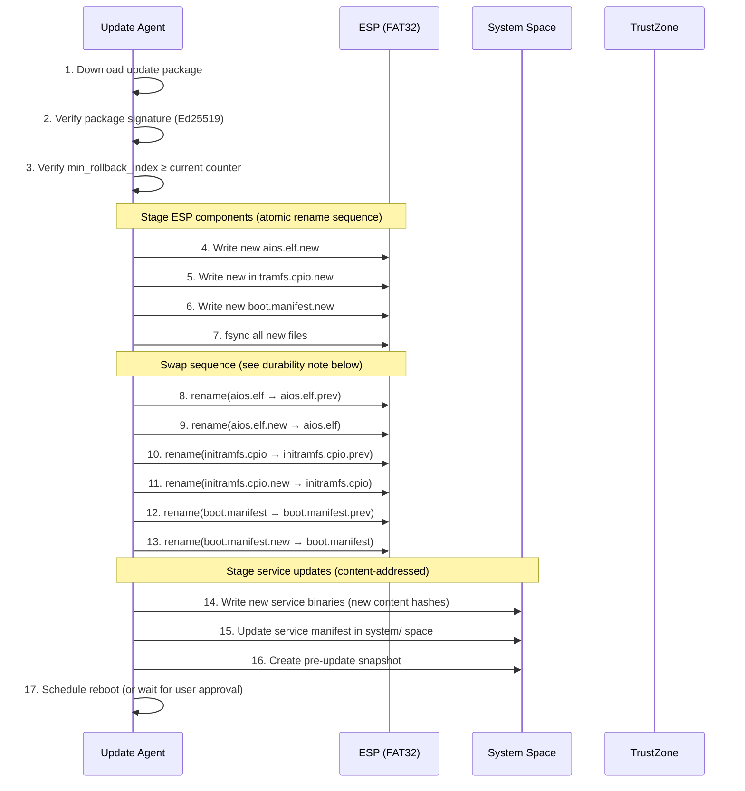
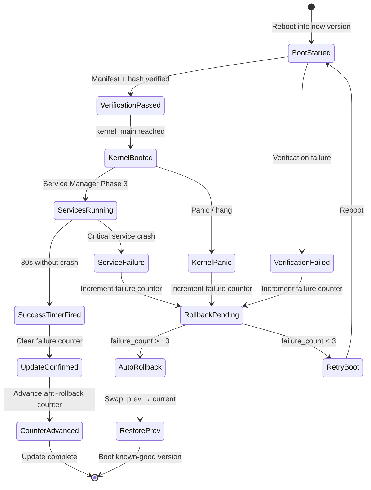
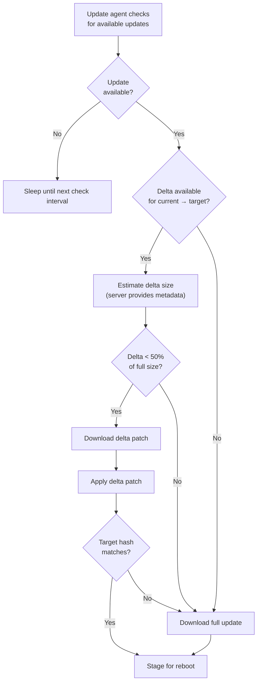
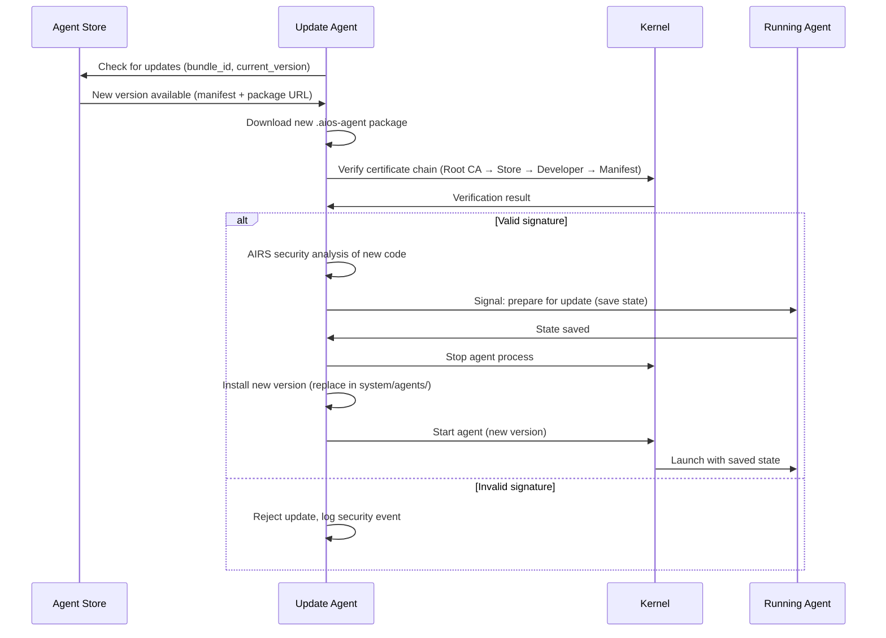
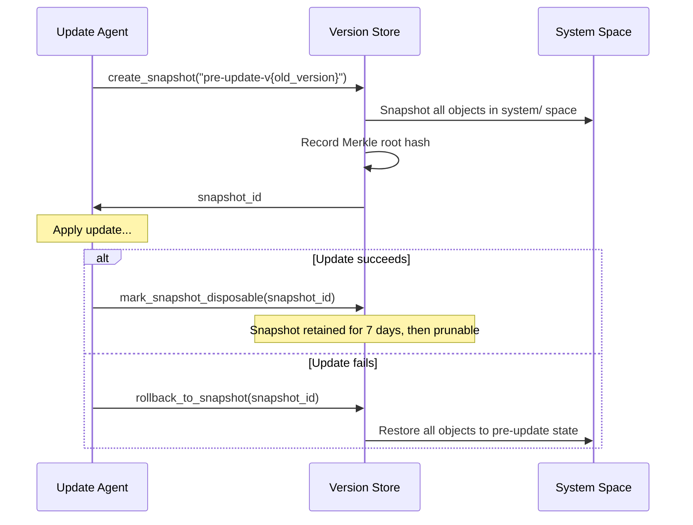

# AIOS Secure Boot — A/B Updates, Delta Updates, Channels & Rollback Protection

Part of: [secure-boot.md](../secure-boot.md) — Secure Boot & Update System
**Related:** [trust-chain.md](./trust-chain.md) — Chain of trust and verification,
[uefi.md](./uefi.md) — UEFI Secure Boot and TrustZone,
[operations.md](./operations.md) — Update security operations,
[intelligence.md](./intelligence.md) — AI-native update intelligence

**See also:** [boot/recovery.md](../../kernel/boot/recovery.md) — Recovery mode and existing A/B rollback (§9),
[spaces/versioning.md](../../storage/spaces/versioning.md) — Version Store and snapshots (§5),
[agents.md](../../applications/agents.md) — Agent lifecycle and manifest (§3),
[airs.md](../../intelligence/airs.md) — Model registry (§4),
[networking/protocols.md](../../platform/networking/protocols.md) — Network transport

-----

## §6 A/B Update Scheme

AIOS uses an A/B partition scheme for atomic system updates. At any time, the ESP contains both the current and previous versions of all boot-critical components. Updates are staged while the system is running and activated on reboot. If the new version fails to boot, automatic rollback restores the previous working version.

### §6.1 Partition Layout

The ESP (EFI System Partition, FAT32) contains the A/B boot components:

```text
ESP (64 MiB FAT32)
├── EFI/
│   ├── BOOT/
│   │   └── BOOTAA64.EFI          ← UEFI stub (current, Authenticode-signed)
│   └── AIOS/
│       ├── BOOTAA64.EFI          ← UEFI stub (current, copy)
│       ├── BOOTAA64.EFI.prev     ← UEFI stub (previous, known-good)
│       ├── aios.elf              ← Kernel ELF (current)
│       ├── aios.elf.prev         ← Kernel ELF (previous, known-good)
│       ├── initramfs.cpio        ← Initramfs (current)
│       ├── initramfs.cpio.prev   ← Initramfs (previous, known-good)
│       ├── boot.manifest         ← Boot manifest (current, Ed25519-signed)
│       ├── boot.manifest.prev    ← Boot manifest (previous, known-good)
│       ├── boot.cfg              ← Boot configuration
│       └── boot.cfg.prev         ← Boot configuration (previous)
```

Beyond the ESP, the system space on the main storage contains versioned service binaries:

```text
system/ space (Block Engine, content-addressed)
├── services/
│   ├── compositor           ← Latest version (content-addressed object)
│   ├── storage-manager
│   ├── network-manager
│   └── ...
├── models/
│   ├── general-8b/          ← AI model + manifest
│   ├── embedding/
│   └── ...
└── agents/
    ├── installed/           ← Agent packages + manifests
    └── running.manifest     ← Auto-relaunch list
```

Service binaries use the Object Store's content-addressing: old versions are retained in storage (referenced by the Version Store's Merkle DAG) and can be rolled back to without re-downloading. See [spaces/versioning.md §5](../../storage/spaces/versioning.md).

### §6.2 Update Staging

Updates are downloaded and staged while the system is running. The staging process is designed to be crash-safe — a power loss at any point leaves the system in a bootable state.

**Staging sequence for system updates (kernel + initramfs + services):**



**Crash safety analysis:**

| Crash point | System state | Recovery |
|---|---|---|
| Steps 1-7 | Old system intact, `.new` files partial/complete | Boot old system; re-download on next check |
| Step 8 | `aios.elf` gone, `.prev` exists, `.new` exists | Recovery: rename `.new` → `aios.elf` |
| Steps 9-13 | Mix of old and new components | Boot manifest `.prev` still valid; recovery shell can restore |
| Steps 14-16 | ESP updated, services partially staged | Boot new kernel + old services (compatible by design) |
| Step 17 | Fully staged, reboot pending | Normal boot with new components |

**FAT32 durability note:** FAT32 lacks journaling, so individual rename operations are not guaranteed to be atomic across power loss — a crash mid-rename could leave a directory entry in an inconsistent state. To mitigate this, the update agent performs `fsync` on the directory after each rename pair, and the crash safety analysis above assumes that each rename + fsync pair completes atomically. If a directory entry is found corrupt at boot, the recovery shell falls back to `.prev` files (which are only renamed away in a later step). The A/B scheme's primary safety property is that the `.prev` files remain untouched until the final cleanup (after boot success confirmation), providing a reliable rollback target regardless of FAT32 limitations.

**Compatibility guarantee:** New kernels are backward-compatible with old service binaries for at least one version. This allows the system to boot with a new kernel + old services if service staging is interrupted.

### §6.3 Boot Success Criteria

After staging, the system reboots into the new version. The new version must prove it works before the update is considered successful.

**Success criteria:**

1. UEFI stub verifies boot manifest (Ed25519 signature valid)
2. Kernel hash matches manifest
3. Kernel boots to `EarlyBootPhase::Complete` (Phase 18 of 18 boot phases)
4. Service Manager reaches Phase 3 (core services running)
5. AIRS loads at least one model successfully
6. Boot success timer fires (30 seconds after Phase 3 without crash)

**Boot success flow:**



**Boot failure counter:**

The UEFI stub maintains a non-volatile counter (`AiosBootFailures`) in UEFI Runtime Variables:

- Incremented by the stub at every boot attempt
- Cleared by the kernel after reaching `UpdateConfirmed` state (30s success timer)
- If counter reaches 3 at stub entry: automatic rollback before loading the new kernel

### §6.4 Automatic Rollback

When 3 consecutive boot attempts fail, the UEFI stub automatically rolls back to the previous version.

**Rollback procedure (in UEFI stub):**

```rust
fn check_automatic_rollback(failures: u32) -> bool {
    if failures >= MAX_BOOT_FAILURES {
        // Swap current ↔ prev for all boot components
        rename("aios.elf", "aios.elf.bad");
        rename("aios.elf.prev", "aios.elf");
        rename("initramfs.cpio", "initramfs.cpio.bad");
        rename("initramfs.cpio.prev", "initramfs.cpio");
        rename("boot.manifest", "boot.manifest.bad");
        rename("boot.manifest.prev", "boot.manifest");

        // Reset failure counter
        set_uefi_variable("AiosBootFailures", 0);

        // Log rollback event (UEFI RT variable for kernel to read)
        set_uefi_variable("AiosLastRollback", current_timestamp());

        true // Signal: we rolled back
    } else {
        false
    }
}
```

**Post-rollback behavior:**
- Kernel reads `AiosLastRollback` variable and logs to `system/audit/boot/`
- Inspector displays notification: "System update failed. Rolled back to previous version."
- Update agent marks the failed update package and does not retry automatically
- `.bad` files preserved for forensic analysis (update agent can upload crash logs)

### §6.5 Manual Recovery

When automatic rollback is insufficient (both current and previous versions fail), the user can access the recovery shell.

**Recovery shell access:**
- Hold Volume Down (or designated key) during boot → recovery menu
- 3+ boot failures → recovery menu offered automatically
- Serial console (UART) always available for headless recovery

**Recovery commands:**

| Command | Action |
|---|---|
| `rollback` | Rename `.prev` → current, reboot from known-good |
| `safe-boot` | Boot without AIRS, without agents, minimal service set |
| `fsck` | Storage integrity check and repair |
| `factory-reset` | Wipe user and ephemeral spaces; preserve system and models |
| `netboot` | Download recovery image via DHCP/TFTP |
| `shell` | Minimal UART shell for manual ESP manipulation |

See [boot/recovery.md §9](../../kernel/boot/recovery.md) for the complete recovery shell design.

### §6.6 ESP Integrity Protection

FAT32 has no access controls, no journaling, and no integrity protection. An attacker with filesystem access (physical or via OS compromise) can modify any file. AIOS mitigates this limitation through multiple layers.

**Protection layers:**

1. **Capability-gated access:** Only agents with `EspWriteAccess` capability can write to the ESP. This capability is granted only to the update agent and recovery shell. No third-party agent can obtain it.

2. **Signed boot manifest:** Even if an attacker modifies `aios.elf`, the hash won't match the boot manifest signature, and boot verification fails. The manifest itself is Ed25519-signed — modifying it invalidates the signature.

3. **`.prev` file signing:** Both current and `.prev` files have corresponding manifests. Rolling back to `.prev` still requires valid manifest verification.

4. **ESP integrity check at boot:** The UEFI stub computes hashes of all ESP files and compares against expected values in the boot manifest. Any unexpected file triggers a warning.

5. **ESP monitoring at runtime:** The storage manager periodically (every 60 seconds) scans the ESP for unexpected modifications. If detected:
   - Log security event to `system/audit/security/`
   - Alert user via Inspector notification
   - Offer to restore ESP from known-good backup in `system/recovery/`

**Limitations:**
- An attacker who replaces both the manifest and the kernel can bypass ESP-level checks — but the Authenticode signature on the UEFI stub prevents this if Secure Boot is enabled
- Without Secure Boot, the ESP is effectively unprotected against physical attacks
- FAT32 timestamp granularity (2 seconds) limits change detection precision

-----

## §7 Delta Updates

Full system updates (kernel + initramfs + services) can be large (50-200 MB). Delta updates transmit only the differences between the installed version and the target version, reducing download size by 60-90%.

### §7.1 Binary Diff Format

AIOS uses a two-tier delta strategy:

**Tier 1 — Binary diff for boot components (kernel ELF, initramfs, UEFI stub):**

```rust
/// Delta patch format for binary files
pub struct BinaryDelta {
    /// Magic: "AIOSDELT" (0x41494F53_44454C54)
    magic: u64,
    /// Delta format version
    format_version: u32,
    /// Source version hash (SHA-256 of the base file)
    source_hash: [u8; 32],
    /// Target version hash (SHA-256 of the expected output)
    target_hash: [u8; 32],
    /// Compressed delta payload (zstd-compressed bsdiff)
    /// bsdiff produces efficient patches for binary executables
    payload: Vec<u8>,
    /// Uncompressed target size (for pre-allocation)
    target_size: u64,
    /// Ed25519 signature over all above fields
    signature: [u8; 64],
}
```

**Algorithm choice — bsdiff + zstd:**
- **bsdiff** (Colin Percival, 2003): produces small patches for binary executables by exploiting the structure of compiled code. Typical kernel ELF delta: 5-15% of full size.
- **zstd** compression on the bsdiff output: additional 30-50% reduction.
- **Alternative considered: courgette** (Google, used in Chrome updates): better for PE/ELF but more complex. Deferred to future optimization.

**Tier 2 — Content-addressed deduplication for service binaries:**

Service binaries are stored as content-addressed objects in the Block Engine. When a service is updated, only new content blocks are written — existing blocks (identified by SHA-256 hash) are shared. This provides delta-like efficiency without explicit patching.

### §7.2 Delta Verification

Delta patches are verified at multiple stages to prevent attacks:

**Pre-application verification:**

1. Verify Ed25519 signature on the `BinaryDelta` structure
2. Verify `source_hash` matches the currently installed version
3. Check `min_rollback_index` (embedded in the update package, not the delta itself)

**Post-application verification:**

1. Apply bsdiff patch: `new_binary = bsdiff_apply(old_binary, delta.payload)`
2. Compute `SHA-256(new_binary)`
3. Verify `hash == delta.target_hash`
4. If mismatch: delete patched file, fall back to full download

**Why verify after patching:** A corrupt delta payload (bit flip in transit, storage error) would produce an incorrect output binary. The target hash catches this. If the hash mismatches, the update agent discards the result and downloads the full update instead.

### §7.3 Bandwidth Optimization



**Delta size estimation:**
- The update server provides `delta_size` metadata in the update manifest
- The update agent compares `delta_size` against `full_size * 0.5`
- If the delta is less than 50% of the full size: download delta
- If larger (e.g., major version with extensive changes): download full
- Threshold is configurable via system settings

**Resumable downloads:**
- Update downloads use HTTP range requests for resumability
- Partial downloads stored in `ephemeral/updates/` (wiped on boot)
- Download integrity: each chunk verified with SHA-256 hash tree
- Network interruption: resume from last verified chunk

### §7.4 Resumable Downloads

The update agent uses the Network Translation Module (NTM, [networking/protocols.md §5](../../platform/networking/protocols.md)) for update downloads.

**Download resilience:**

```rust
/// Update download state (persisted in ephemeral/ space)
pub struct DownloadState {
    /// Update package URL
    url: String,
    /// Total expected size
    total_size: u64,
    /// Bytes downloaded so far
    downloaded: u64,
    /// SHA-256 hash tree for chunk verification
    chunk_hashes: Vec<[u8; 32]>,
    /// Size of each chunk (default: 1 MiB)
    chunk_size: u32,
    /// Bitmap of completed chunks
    completed_chunks: BitVec,
    /// Download started timestamp
    started_at: Timestamp,
    /// Last activity timestamp
    last_activity: Timestamp,
}
```

**Retry strategy:**
- Network loss: retry with exponential backoff (1s, 2s, 4s, 8s, max 60s)
- Server error (5xx): retry up to 5 times, then wait 1 hour
- Client error (4xx): abort, report to user
- Incomplete download at boot: resume automatically after network is available
- Stale download (>7 days inactive): discard and restart

-----

## §8 Update Channels

AIOS separates updates into independent channels, each with its own signing authority, version numbering, and delivery schedule. This isolation ensures that a compromise of one channel does not affect others.

### §8.1 System Update Channel

The system update channel delivers kernel, UEFI stub, initramfs, and core service binaries.

**Properties:**

| Property | Value |
|---|---|
| Signing authority | AIOS Release Signing Key (Ed25519, offline HSM) |
| Version format | `major.minor.patch` (semver) |
| Anti-rollback counter | Counter 0 (kernel) + Counter 1 (services) |
| Delivery | HTTPS from `updates.aios.dev/system/` |
| Check interval | Every 24 hours (configurable) |
| Download policy | WiFi-only by default; cellular opt-in |
| Install policy | User approval required; auto-install in maintenance window (opt-in) |
| Rollback | A/B ESP swap + service version rollback via Object Store |

**Update package format:**

```rust
/// System update package (.aios-update)
pub struct SystemUpdatePackage {
    /// Package header
    header: UpdatePackageHeader,
    /// Boot components (kernel, initramfs, stub) — full or delta
    boot_components: Vec<BootComponent>,
    /// Service binaries (content-addressed)
    service_components: Vec<ServiceComponent>,
    /// New boot manifest (signed)
    boot_manifest: BootManifest,
    /// New service manifest (signed)
    service_manifest: ServiceManifest,
    /// Package signature (covers entire package)
    package_signature: [u8; 64],
}

pub struct UpdatePackageHeader {
    /// Magic: "AIOSUPDT"
    magic: u64,
    /// Source version (what this update applies to)
    source_version: Version,
    /// Target version (what this update produces)
    target_version: Version,
    /// Minimum anti-rollback index
    min_rollback_index: u64,
    /// Total uncompressed size
    total_size: u64,
    /// Release notes (UTF-8, max 4 KiB)
    release_notes: String,
}
```

### §8.2 Agent Update Channel

Agent updates are independent of system updates. Each agent developer manages their own update cadence.

**Properties:**

| Property | Value |
|---|---|
| Signing authority | Developer's Ed25519 key (registered in Agent Store) |
| Version format | Per-agent semver |
| Anti-rollback | Per-agent version stored in agent manifest |
| Delivery | Agent Store (`store.aios.dev/agents/{bundle_id}/`) |
| Check interval | Every 6 hours (configurable per-agent) |
| Install policy | Auto-update if user has enabled it; otherwise notification |
| Rollback | Previous agent version retained in `system/agents/` |

**Agent update flow:**



**Agent version coexistence:** During update, the old agent binary is retained as `.prev`. If the new version crashes within 60 seconds of launch, automatic rollback to the previous version occurs.

### §8.3 Model Update Channel

AI model updates are the most bandwidth-intensive update type (models are 2-8 GB). The model update channel is optimized for large files and has unique integrity requirements.

**Properties:**

| Property | Value |
|---|---|
| Signing authority | AIOS Model Signing Key (Ed25519, separate from kernel key) |
| Version format | `model_id@version` (e.g., `general-8b@2.1.0`) |
| Anti-rollback counter | Counter 2 (model-specific) |
| Delivery | Model registry (`models.aios.dev/{model_id}/`) |
| Check interval | Every 7 days (configurable) |
| Download policy | WiFi-only; never cellular without explicit opt-in |
| Install policy | Background download; hot-swap at next idle period |
| Rollback | Previous model retained until new model verified |

**Model update process:**

1. Model registry check: is a newer model available for this hardware tier?
2. Download model file (GGUF format) with resumable chunked transfer
3. Verify `ModelManifest` signature (AIOS Model Signing Key)
4. Verify SHA-256 hash of model file against manifest
5. Check `min_rollback_index` against Counter 2
6. Store new model in `system/models/{model_id}/`
7. Notify AIRS of new model availability
8. AIRS hot-swaps to new model at next inference boundary (no reboot required)
9. Previous model retained in storage until new model verified in production (7-day grace period)
10. After grace period: old model eligible for eviction by LRU policy

**Hot-swap semantics:** Model hot-swap occurs between inference requests. AIRS finishes any in-progress inference with the old model, then loads the new model for the next request. There is no user-visible interruption. If the new model fails to load (corrupt, incompatible, out of memory), AIRS falls back to the previous model and logs a warning.

### §8.4 Channel Priority & Scheduling

When multiple updates are available simultaneously, the update agent schedules them to minimize disruption and avoid conflicts.

**Priority order:**

| Priority | Channel | Reason |
|---|---|---|
| 1 (highest) | System — security fix | Security patches override all scheduling |
| 2 | System — regular update | Kernel/service updates require reboot |
| 3 | Agent — critical update | Agent with known vulnerability |
| 4 | Model — new version | Large download, no reboot needed |
| 5 (lowest) | Agent — feature update | Non-critical, can wait |

**Scheduling constraints:**

- **Never during active inference:** If AIRS is processing a user request, defer model updates until idle
- **Never during active user interaction:** If the user is actively using the device, defer reboot-requiring updates
- **Prefer maintenance windows:** If configured, schedule updates during user-defined maintenance windows (e.g., 2:00-4:00 AM)
- **Battery threshold:** Do not start updates below 30% battery (configurable)
- **Storage threshold:** Do not download updates if storage pressure is High or Critical ([spaces/budget.md §10](../../storage/spaces/budget.md))
- **Thermal threshold:** Do not apply updates (CPU-intensive hash verification) if thermal state is Hot or Critical ([thermal/zones.md §3](../../platform/thermal/zones.md))

### §8.5 Update Notification & User Consent

AIOS respects user autonomy in update decisions while ensuring security updates are not indefinitely deferred.

**Notification tiers:**

| Update type | Notification | User action required |
|---|---|---|
| Critical security fix | Persistent banner + Inspector alert | Reboot within 72 hours (enforced) |
| Regular system update | Inspector notification | User chooses when to reboot |
| Agent update (auto-update on) | Silent | None (auto-installed) |
| Agent update (auto-update off) | Inspector notification | User approves |
| Model update | Silent download; notification on ready | User approves hot-swap (or auto) |

**72-hour security update policy:**
- Security patches are mandatory within 72 hours of availability
- User is reminded at 24h, 48h, and 72h intervals
- At 72 hours: system schedules automatic reboot at next idle period
- User can defer twice more (24h each) with explicit acknowledgment
- After 120 hours: forced reboot with 15-minute countdown warning
- This policy can be overridden by enterprise MDM settings

-----

## §9 Rollback Protection

Rollback protection prevents an attacker from forcing the device to run a previous, potentially vulnerable version of any signed component. AIOS uses multiple complementary mechanisms at different layers.

### §9.1 Anti-Rollback via Monotonic Counter

The primary anti-rollback mechanism is a monotonic counter stored in the hardware root of trust (TrustZone NV counter, TPM monotonic counter, or UEFI variable as fallback).

**How it works:**

1. Each signed component (kernel, services, models) includes a `min_rollback_index` in its manifest
2. At verification time, the stub/kernel/AIRS checks: `manifest.min_rollback_index >= device_counter`
3. If the manifest's index is less than the device counter: **rollback detected, reject**
4. If the manifest's index is equal: normal boot (same version or re-install)
5. If the manifest's index is greater: advance the device counter to the new value after successful boot

**Counter advancement timing:**
- The counter is advanced **after** the boot success criteria are met (§6.3), not at boot time
- This ensures that a failing new version does not advance the counter and lock out the previous version
- Sequence: boot → verify → reach success criteria → advance counter → update confirmed

**Rollback window:**
- Between staging a new update and confirming boot success, both versions are bootable
- This is the "rollback window" — a brief period where the previous version can still boot
- The window closes when the counter advances
- An attacker who can modify ESP during this window could force a rollback — mitigated by ESP integrity monitoring (§6.6)

### §9.2 Version Store Integration

Beyond boot components, AIOS leverages the storage layer's Version Store ([spaces/versioning.md §5](../../storage/spaces/versioning.md)) for system-level snapshots before updates.

**Pre-update snapshot flow:**



**What the snapshot covers:**
- Service binaries in `system/services/`
- System configuration in `system/config/`
- Agent manifests in `system/agents/installed/`
- Service manifest and capability grants

**What the snapshot does NOT cover:**
- ESP contents (handled by A/B swap, §6)
- User data (never modified by system updates)
- Ephemeral space (by definition, not preserved)
- AI models (handled by model-specific rollback, §9.4)

### §9.3 Service Rollback

Individual services can be rolled back without rolling back the entire system. This is useful when a service update causes issues but the kernel and other services are fine.

**Service version history:**
- Each service binary is stored as a content-addressed object in the Object Store
- The Version Store maintains a history of service versions (Merkle DAG)
- Rolling back a service: `version_store.rollback(service_object_id, target_version_hash)`
- The rollback creates a new version node pointing to the old content — history is preserved

**Service compatibility matrix:**
- Services declare their minimum kernel version and minimum dependency versions
- The service manager checks compatibility before applying a rollback
- If a rollback would break compatibility (e.g., old service incompatible with new kernel), the rollback is rejected with an explanation

### §9.4 Model Rollback

AI model rollback follows a "retain previous until proven" strategy:

1. New model downloaded and verified (signature + hash)
2. New model stored alongside previous model (both in `system/models/`)
3. AIRS hot-swaps to new model
4. AIRS monitors new model's inference quality for 7 days (grace period):
   - Latency within acceptable bounds?
   - Output quality (measured by user corrections, explicit feedback) acceptable?
   - No anomalous security decisions (unexpected capability approvals/denials)?
5. After grace period with no issues: previous model marked for eviction
6. If issues detected during grace period: automatic rollback to previous model

**Anomaly detection during grace period:**

```rust
pub struct ModelQualityMetrics {
    /// Average inference latency (ms)
    avg_latency_ms: f32,
    /// p99 inference latency (ms)
    p99_latency_ms: f32,
    /// User correction rate (0.0 = no corrections, 1.0 = always corrected)
    user_correction_rate: f32,
    /// Security decision flip rate vs. previous model
    security_decision_flip_rate: f32,
    /// Number of capability recommendations overridden by user
    capability_overrides: u32,
    /// Measurement period
    period: Duration,
}
```

If `security_decision_flip_rate` exceeds a threshold (default: 0.15 — the new model disagrees with the old model on 15%+ of security decisions), the model is flagged for human review before auto-rollback.

### §9.5 Configuration Rollback

System configuration changes are tracked in the Version Store and can be rolled back independently.

**Tracked configuration:**
- Boot parameters (`boot.cfg`)
- Service configurations (each in `system/config/{service}/`)
- Security policies (capability profiles, trust level overrides)
- Update policies (check intervals, download policies, maintenance windows)
- Display and input settings (stored in user space, but system defaults in system space)

**Configuration snapshot triggers:**
- Before any system update (automatic)
- Before any security policy change (automatic)
- User-initiated snapshot ("save current settings")

**Rollback granularity:**
- Full configuration rollback (restore all settings to a snapshot)
- Per-service configuration rollback (restore one service's config)
- Per-setting rollback (restore a single setting to its value at a specific time)
