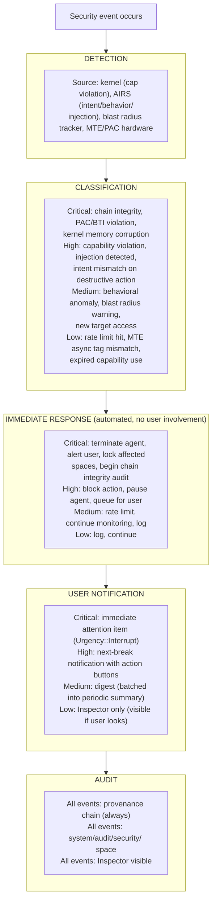
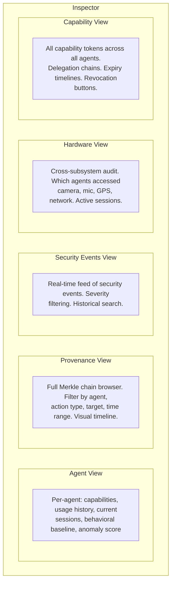
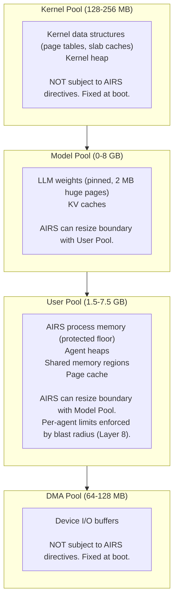
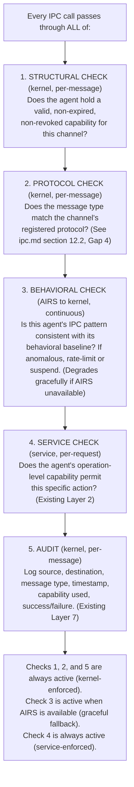

# AIOS Security Operations

Part of: [security.md](./security.md) — AIOS Security Model
**Related:** [security-layers.md](./security-layers.md) — Eight defense layers, [security-capabilities.md](./security-capabilities.md) — Capability system internals, [security-hardening.md](./security-hardening.md) — Crypto and ARM hardware

-----

## 6. Security Event Response

### 6.1 Detection → Response Pipeline



### 6.2 Incident Types and Responses

| Incident Type | Severity | Immediate Response | User Notification | Recovery Action |
|---|---|---|---|---|
| Capability violation (EPERM) | High | Block action, log | Next-break notification | None needed — action was prevented |
| Behavioral anomaly (z > 3σ) | Medium | Rate limit → pause if persists | Digest summary | User reviews in Inspector, approves or revokes |
| Intent mismatch (AIRS) | High | Block action, pause agent | Next-break with explanation | User reviews agent's recent actions |
| Injection detected | High | Quarantine input, notify | Next-break with source info | User reviews quarantined content |
| Chain integrity violation | Critical | Alert, begin audit | Immediate interrupt | Full chain verification, identify tampered range |
| Resource exhaustion (blast radius) | Medium | Throttle → pause → kill | Next-break with usage stats | Rollback if data affected |
| PAC/BTI violation | Critical | Terminate process | Immediate interrupt | Investigate — indicates code corruption or exploit |
| MTE tag mismatch | Medium (async) / Critical (sync) | Log (async) / terminate (sync) | Digest (async) / interrupt (sync) | Bug report with tag context |
| Expired capability use | Low | Block, log | Inspector only | Token auto-cleaned |
| Invalid IPC message | High | Block, log, close channel | Next-break if repeated | Investigate agent behavior |

### 6.3 Escalation Policy

When automated response is insufficient:

**Level 1 — Automated containment.** Rate limiting, pausing, resource throttling. No user involvement. Resolves most transient issues (agent burst, temporary anomaly).

**Level 2 — User notification.** Agent is paused, user is asked to review. User can: resume agent, revoke specific capabilities, uninstall agent, or ignore. Most incidents are resolved here.

**Level 3 — Emergency measures.** For Critical incidents: agent is terminated, affected spaces are locked (read-only until user reviews), all of the agent's capabilities are revoked, and the incident is prominently displayed in the Workspace. User must explicitly acknowledge before the agent can be restarted.

**Level 4 — System-level response.** For chain integrity violations or suspected kernel compromise: the OS enters a "reduced trust" mode. All third-party agents are suspended. The Inspector is automatically opened. The user is guided through an integrity check. This level should never be reached in normal operation.

-----

## 7. Security Audit and Transparency

### 7.1 Inspector

The Inspector is a native experience agent (Trust Level 2) that provides full visibility into the security system. Every security event, every capability, every provenance record is queryable.

**Inspector views:**



The Inspector uses `AuditRead` capability to query the provenance chain and audit spaces. It runs as a regular agent — no special kernel backdoors. Its elevated visibility comes from having `AuditRead(Scope::All)` capability, granted because it is a system-shipped agent signed by the AIOS root key.

### 7.2 Conversation Bar Integration

Security management through natural language:

```text
User: "What permissions does the Research Assistant have?"
→ AIRS queries CapabilityTable for research_assistant_agent
→ Returns: "Research Assistant can read your research space,
   write to research/papers/, connect to api.anthropic.com
   and arxiv.org, and use AI inference at normal priority.
   It has used 47 reads and 12 writes today."

User: "What has the Budget Tracker been doing?"
→ AIRS queries provenance chain filtered by budget_tracker_agent
→ Returns: "Budget Tracker read 15 objects from finances/budget
   today. It made 3 API calls to plaid.com. No anomalies detected.
   Last active 2 hours ago."

User: "Revoke network access for Budget Tracker."
→ AIRS identifies Network capability tokens for budget_tracker_agent
→ OS presents confirmation: "Remove Budget Tracker's access to
   plaid.com and mint.com? The agent won't be able to sync
   financial data."
→ User confirms
→ Kernel revokes Network tokens
→ Provenance records: (system, capability_revoke, budget_tracker_net_token)

User: "Something feels wrong with my email agent."
→ AIRS queries behavioral baseline and recent activity
→ Returns: "Your email agent has read 340 emails today (normal
   average: 45). It accessed emails from 2019 (usually only
   reads recent mail). Its network usage is 12x normal. I've
   paused the agent. Would you like to review its activity
   in the Inspector?"
```

### 7.3 Audit Export

For enterprise compliance and personal record-keeping:

```rust
pub struct AuditExport {
    /// Time range of export
    range: (Timestamp, Timestamp),
    /// Agents included
    agents: Vec<AgentId>,
    /// Event types included
    event_types: Vec<ProvenanceAction>,
    /// Format
    format: ExportFormat,
}

pub enum ExportFormat {
    /// Structured JSON (machine-readable)
    Json,
    /// CSV (spreadsheet-compatible)
    Csv,
    /// Human-readable report with summaries
    Report,
    /// Raw provenance chain with Merkle proofs
    MerkleExport,
}
```

**Periodic activity reports:** The system can generate automatic summaries:
- "Weekly security digest: 3 capability violations (all blocked), 1 behavioral anomaly (resolved), 12 agents active, 0 injection attempts detected."
- Per-agent summaries: capabilities used, data accessed, network connections, hardware sessions.
- Anomaly trends: is this agent's resource usage increasing over time?

-----

## 9. AIRS Resource Orchestration Security

AIRS acts as the central resource orchestrator — directing memory pool boundaries, prefetching space objects, scheduling compression, and accepting agent hints about anticipated needs. This section documents how the security model absorbs this additional responsibility without weakening any existing layer.

### 9.1 Security Impact Summary

| Layer | Impact | Change Required |
|---|---|---|
| Layer 1: Intent Verification | Medium | Priority fence isolates security path from resource path ([§2.1](./security-layers.md)) |
| Layer 2: Capability Check | None | Every AIRS directive still passes kernel capability validation |
| Layer 3: Behavioral Monitoring | Medium | Kernel monitors AIRS directive behavior ([§2.3.1](./security-layers.md)) |
| Layer 4: Security Zones | None | Zone boundaries are structural — directives cannot cross zones |
| Layer 5: Adversarial Defense | Medium | Agent hints screened as untrusted input ([§2.5.1](./security-layers.md)) |
| Layer 6: Cryptographic Enforcement | None | AIRS never touches encryption keys or crypto operations |
| Layer 7: Provenance Recording | Low | Resource directives added to provenance chain ([§2.7.1](./security-layers.md)) |
| Layer 8: Blast Radius | None | AIRS cannot exceed per-agent blast radius limits |
| Hardware (PAC/BTI/MTE/W^X) | None | Hardware enforcement is orthogonal to AIRS |

Four layers are completely unchanged (2, 4, 6, 8). Four layers receive targeted extensions (1, 3, 5, 7). No layer is weakened.

### 9.2 Design Principle: Resource Intelligence as Optimization, Not Security

AIRS resource orchestration is an **optimization layer** — it makes the system faster, not safer. If AIRS resource orchestration is completely disabled, the system falls back to:

- **Memory:** Plain LRU page eviction, no prefetching, fixed pool boundaries
- **Storage:** Age-based compression, no semantic priority
- **Agents:** No hint processing, static resource limits only

The system is slower in this mode but **equally secure**. Security never depends on AIRS making correct resource decisions. This is enforced by the kernel fallback mechanism ([§2.3.1](./security-layers.md)): the kernel can unilaterally disable AIRS resource orchestration while keeping all security layers active.

### 9.3 AIRS Resource Privilege Boundaries

AIRS is a Trust Level 1 system service. Its resource orchestration capabilities are bounded:

```text
AIRS resource orchestration CAN:
  ├── Direct memory pool boundary adjustments
  │   (kernel validates: within global limits, within pool min/max)
  ├── Request prefetch of space objects
  │   (kernel validates: AIRS holds ReadSpace cap for the target space)
  │   (prefetch uses the NORMAL Space Storage read path — see spaces-block-engine.md §4.3.1)
  │   (AIRS never touches decryption keys — Space Storage decrypts)
  ├── Schedule block compression
  │   (kernel validates: compression doesn't exceed CPU quota)
  └── Accept and process agent hints
      (screened by Layer 5 before consideration)

AIRS resource orchestration CANNOT:
  ├── Allocate more memory than an agent's blast radius allows
  │   (Layer 8 enforced by kernel, not AIRS)
  ├── Prefetch objects from spaces AIRS has no capability for
  │   (Layer 2 enforced by kernel)
  ├── Access encrypted data without key release
  │   (Layer 6 — AIRS operates on decrypted pages already in memory)
  ├── Evict its own process memory via pool resizing
  │   (AIRS process memory has a kernel-enforced floor in the user pool — §9.5)
  ├── Override page table isolation between agents
  │   (TTBR0 per-process — hardware-enforced, not software)
  └── Suppress provenance logging of its own directives
      (Layer 7 records all directives — kernel-enforced, append-only)
```

### 9.4 Resource Allocation Opacity

Agents must not be able to observe resource allocation changes made by AIRS, as these could leak information about other agents' activity.

**What agents can observe:**
- Their own memory allocation limits (set by blast radius policy — static, not dynamic)
- Page faults when they exceed their allocation (normal OS behavior)
- Their own IPC latency (affected by system load, but not attributable to specific agents)

**What agents cannot observe:**
- Physical memory pool boundaries or their changes
- Which pages are being prefetched for other agents
- Other agents' resource consumption or hint patterns
- AIRS directive rates or types
- Pool resize events (kernel-internal operation on physical page ranges)

This opacity is achieved through standard OS memory isolation: each agent has its own page table (TTBR0) and sees only its virtual address space. The kernel's physical page allocator, pool boundary manager, and AIRS directive handler are kernel-internal — invisible to userspace.

**Timing side channels.** An agent could theoretically measure page fault latency variations to infer memory pressure caused by other agents. On SD card media (~100 μs per page fault with high variance), this signal is extremely noisy. On NVMe (~5 μs with lower variance), the signal is cleaner but still requires sustained measurement that would trigger Layer 3 behavioral anomaly detection (unusual access patterns). This is acknowledged as a residual risk in §1.3 (side-channel attacks).

### 9.5 Circular Dependency Resolution

AIRS needs memory to run. AIRS controls memory allocation. This creates a potential circular dependency.

**Resolution:** AIRS is a Trust Level 1 userspace service, so its process memory lives in the **user pool**. However, the AIRS resource directives can only resize the boundary between the model pool and user pool — they cannot evict AIRS's own pages. The kernel enforces a per-agent memory floor for AIRS (configured at boot), ensuring AIRS always has enough memory to run. The circular dependency is broken by this structural separation: AIRS can resize pools but cannot evict itself.



AIRS controls the boundary between Model Pool and User Pool. It does not control the Kernel Pool or DMA Pool boundaries. This limits AIRS's resource authority to a well-defined surface area: the tradeoff between model memory and agent memory.

### 9.6 Damage Ceiling Analysis

If AIRS resource orchestration is fully compromised (worst case), what is the maximum damage?

| Attack | Damage Ceiling | Why It's Bounded |
|---|---|---|
| Pathological prefetching (prefetch everything, thrash memory) | **Performance degradation** | Kernel fallback mode disables prefetching ([§2.3.1](./security-layers.md)). No data breach. |
| Starving one agent's pool to favor another | **Unfairness** | Per-agent blast radius limits are kernel-enforced. Agent still gets its minimum. |
| Issuing no directives (neglect attack) | **Slower system** | Static heuristics work without AIRS. System degrades to plain LRU. |
| Leaking resource telemetry to agents | **Information leak** | Allocation opacity prevents agents from observing pool state. AIRS doesn't respond to hints — fire-and-forget only. |
| Corrupting compression scheduling | **Wasted CPU/storage** | Compression operates on already-capability-checked data. Cannot access data it shouldn't. |

**The damage ceiling is denial of service, not data breach.** A compromised AIRS resource orchestrator can waste resources, slow things down, or make suboptimal allocation decisions. It cannot break capability isolation, forge tokens, cross security zones, decrypt data, or avoid being logged. The kernel's hardware-enforced boundaries (page tables, capabilities, crypto) are independent of AIRS.

-----

## 10. Zero Trust as Foundational Kernel Principle

### 10.1 Core Thesis

Zero trust is a security model that assumes no implicit trust — every access request must be verified regardless of origin. In network security, this means "never trust, always verify" instead of trusting traffic inside the corporate perimeter. In AIOS, zero trust is not a bolt-on overlay; it is the kernel's native operating model. The capability system, IPC mediation, and memory isolation together implement zero trust at the syscall boundary — every operation is verified, every boundary is enforced, and no ambient authority exists.

This section documents zero trust as a formal design principle, maps it to AIOS's existing architecture, identifies where the implementation falls short, and specifies the changes needed to close the gaps.

### 10.2 Zero Trust Principles Mapped to AIOS

| Zero Trust Principle | Network Security Equivalent | AIOS Kernel Equivalent |
|---|---|---|
| **Never trust, always verify** | Every request authenticated at API gateway | Every IPC call checked against capability token |
| **Least privilege** | Scoped API tokens, role-based access | Capability attenuation — narrow path, reduce expiry, remove write |
| **Microsegmentation** | Network segments with firewall rules between them | Security zones (Core, Personal, Collaborative, Untrusted, Ephemeral) with capability gates |
| **Assume breach** | Logging, monitoring, anomaly detection | Audit system (all IPC logged), provenance chain, MTE tagging |
| **Short-lived credentials** | JWT with 15-minute expiry, rotating API keys | Capability expiry (`expires` field), temporal capabilities |
| **Continuous verification** | Re-authenticate on every request, not just session start | Capability checked per-IPC (but see §10.3 — caching gap) |
| **Behavioral analytics** | UEBA (User and Entity Behavior Analytics) | AIRS behavioral monitoring (Layer 3) |
| **Mutual authentication** | mTLS — both client and server present certificates | Channel endpoints established by Service Manager at boot |

**Why AIOS is naturally zero trust.** In Linux, if a process runs as root, it can do anything — that is implicit trust based on identity. There is no equivalent in AIOS. There is no `root`, no `sudo`, no ambient authority. An agent can only perform operations that its explicit capability tokens permit. Every IPC call passes through kernel-mediated capability validation. Every memory access is bounded by the agent's page table (TTBR0). Every space access requires a capability scoped to that space. The kernel is the universal policy enforcement point — there is no "inside the perimeter" where checks are relaxed.

### 10.3 Gap Analysis (Resolved)

The following gaps were identified and have been addressed in the design specs. Each gap lists the resolution and the locations where the fix is integrated.

#### Gap 1: Capability caching relaxes continuous verification — RESOLVED

**Problem.** Capability validation was cached per-channel (checked at creation, not per-message). A revoked capability could continue to grant access on cached channels.

**Resolution.** Capability revocation now invalidates all channels created with the revoked capability. Integrated at:
- **security-capabilities.md [§3.2](./security-capabilities.md)**: `revoke()` calls `kernel.invalidate_channels_for_capability(token_id)`
- **ipc.md §4.1**: `Channel` struct now tracks `creation_capability: CapabilityTokenId`
- **ipc.md §4.2**: Latency target notes revocation propagation
- **ipc.md §8.3**: Five-level enforcement stack documents the structural check

```rust
impl CapabilityTable {
    pub fn revoke(&mut self, token_id: TokenId) {
        // ... existing revocation logic ...

        // NEW: Invalidate channels created with this capability
        kernel.invalidate_channels_for_capability(token_id);
    }
}
```

The per-message capability check can remain cached (it's a valid performance optimization) as long as revocation propagates to channels. This is analogous to network zero trust systems that cache authentication for a session but invalidate the session when the token is revoked.

#### Gap 2: No mandatory capability rotation — RESOLVED

**Problem.** Capability `expires` field was optional. A capability created with `expires: None` lived forever.

**Resolution.** Expiry is now mandatory. `capability_create()` rejects `expires: None`. Integrated at:
- **security-capabilities.md [§3.1](./security-capabilities.md)**: Token creation example uses mandatory expiry (`expires: now() + Duration::days(90)`) with trust-level TTL comment
- **security-capabilities.md [§3.1](./security-capabilities.md)**: `capability_create()` documented as rejecting missing expiry

Maximum TTL per trust level:

```rust
pub const MAX_CAPABILITY_TTL: [Duration; 5] = [
    Duration::MAX,              // Trust Level 0: Kernel (not applicable)
    Duration::days(365),        // Trust Level 1: System services (renewed at boot)
    Duration::days(365),        // Trust Level 2: Native experience agents (renewed at boot)
    Duration::days(90),         // Trust Level 3: Third-party agents
    Duration::hours(24),        // Trust Level 4: Web content / tab agents
];
```

When a capability approaches expiry, the agent must re-request it from the Service Manager. The Service Manager re-evaluates the grant (checking whether the user has changed permissions, whether the agent's behavioral profile has changed, etc.) before issuing a new token. This is the kernel equivalent of OAuth token refresh.

For system services (Trust Level 1), capabilities are renewed at every boot — the boot sequence is the rotation event.

#### Gap 3: No behavioral gating on IPC — RESOLVED

**Problem.** Layer 3 (Behavioral Monitoring) was reactive only — flagging anomalies after the fact. No active enforcement at the IPC boundary based on behavioral context.

**Resolution.** AIRS behavioral state now feeds into the IPC fast path as a per-process gate. Integrated at:
- **ipc.md §9.1**: Fast path step 3 checks `behavioral_state` byte (NORMAL/ELEVATED/RATE_LIMITED/SUSPENDED)
- **ipc.md §8.3**: Five-level enforcement stack includes behavioral check as Level 3
- Degrades gracefully: all agents default to NORMAL when AIRS is unavailable

Example flow:

```text
Normal behavior:
  Agent reads 5-10 objects/minute from "research" space → IPC proceeds

Anomalous behavior:
  Agent reads 500 objects/minute from "research" space →
    1. AIRS flags anomaly (Layer 3)
    2. Kernel receives behavioral alert via lightweight notification
    3. Kernel applies rate limit to agent's IPC channels
    4. If anomaly persists, kernel suspends agent's capabilities (soft revoke)
    5. User notified via Attention system
```

This is not just logging — it is active enforcement based on behavioral context. The capability token is still valid, but the behavioral signal modulates whether the kernel honors it. This is the kernel equivalent of adaptive authentication.

**Implementation note.** Behavioral gating must be optional and degradable. If AIRS is unavailable (fallback mode), the kernel falls back to structural capability checks only. Behavioral gating is an optimization for security, not a dependency. This is consistent with the principle in Section 9.2: "Resource Intelligence as Optimization, Not Security."

#### Gap 4: Kernel resource quotas as zero trust for the kernel itself — RESOLVED

**Problem.** No per-process limits on kernel object creation. The kernel implicitly trusted userspace not to exhaust kernel resources.

**Resolution.** Per-process `KernelResourceLimits` are now mandatory at process creation. Integrated at:
- **ipc.md §3.1**: `ProcessCreate` syscall requires `resource_limits: KernelResourceLimits`
- **ipc.md §3.3**: `KernelResourceLimits` struct with defaults per trust level
- **ipc.md §4.1**: `Channel.shared_regions` changed from `Vec` to fixed-size array
- Kernel heap bounded by `sum(per-process limits) * per-object size`

### 10.4 Zero Trust Enforcement Architecture



### 10.5 Comparison: AIOS Zero Trust vs. Network Zero Trust

| Aspect | Network Zero Trust (BeyondCorp, ZTNA) | AIOS Kernel Zero Trust |
|---|---|---|
| Trust boundary | Network perimeter → eliminated | Process address space (TTBR0) — hardware-enforced |
| Identity | mTLS certificate, SAML assertion | Capability token (unforgeable, kernel-managed) |
| Policy enforcement point | API gateway / proxy | Kernel syscall handler |
| Credential lifetime | Short (minutes to hours) | Mandatory expiry per trust level (§10.3) |
| Credential rotation | Automatic via OAuth refresh | Agent re-requests from Service Manager |
| Behavioral analytics | UEBA (cloud-based, minutes latency) | AIRS Layer 3 (on-device, milliseconds latency) |
| Microsegmentation | VLANs, firewalls, SDN | Security zones on spaces, capability scoping |
| Breach containment | Lateral movement prevention | Blast radius policy (Layer 8), no ambient authority |
| Mutual auth | mTLS (both sides present certs) | Channel endpoints established by trusted Service Manager |
| Logging | SIEM, centralized log analysis | Provenance chain (Merkle-chain, tamper-evident, on-device) |

**AIOS's advantage.** Network zero trust is a software overlay on hardware that doesn't enforce it — packets can still be spoofed, firewalls can be misconfigured, proxies can be bypassed. AIOS zero trust is enforced by hardware (page tables, ARM PAC/BTI/MTE) and a minimal kernel (31 syscalls). There is no way to bypass it without compromising the kernel itself — and the kernel is Rust, with formal verification beginning in Phase 13 (TLA+ models) and Coq proofs in Phase 24, and fuzz-tested.

**AIOS's unique contribution.** No existing kernel implements behavioral gating — the idea that a structurally valid capability can be modulated by behavioral context. This is the intersection of zero trust and AI-native security. Traditional kernels check "do you have permission?" AIOS checks "do you have permission AND is this consistent with how you normally behave?" The second check is only possible because AIRS has a behavioral model of every agent.

### 10.6 Implementation Order

Zero trust is not a separate phase — it emerges from capabilities, IPC mediation, and behavioral monitoring working together. But the gaps identified above require targeted work:

```text
Phase 3:   Capability revocation propagates to channels (Gap 1)
Phase 3:   Per-process kernel resource limits (Gap 4)
Phase 8:   Mandatory capability expiry per trust level (Gap 2)
Phase 8:   Behavioral gating integration: AIRS → kernel rate limiting (Gap 3)
Phase 13:  Formal verification that revocation fully propagates
Phase 13:  Formal verification that resource limits bound kernel heap
```

-----

## 11. Comparison to Existing Security Models

| Model | Strengths | Weaknesses | What AIOS Adds |
|---|---|---|---|
| **Unix DAC** (files have owner/group/other permissions) | Simple, well-understood | Too coarse for agent world. Root bypasses all. No delegation, no expiry, no audit trail | Fine-grained capabilities, no superuser, delegation with attenuation, provenance chain |
| **SELinux / AppArmor** (mandatory access control) | Strong enforcement, flexible policies | Complex policy language, hard to configure correctly, no AI-aware layers | Capabilities instead of policy files, intent verification, behavioral monitoring |
| **iOS App Sandbox** (per-app container) | Good isolation, user-prompted permissions | No agent cooperation model, no delegation, no semantic zones, no behavioral monitoring | Agent delegation, cross-agent Flow, security zones, behavioral baselines |
| **Android Permissions** (install-time + runtime) | User-visible, per-API permissions | All-or-nothing (no attenuation), no intent verification, no provenance, permissions are coarse | Attenuation, temporal caps, intent layer, Merkle-chain audit |
| **seL4 / Fuchsia Capabilities** (kernel-enforced, unforgeable) | Proven correct (seL4), strong isolation | No AI layers — no intent verification, no behavioral monitoring, no adversarial defense, no provenance chain | Layers 1, 3, 5, 7 — the AI-specific security layers that address agent threats |
| **Browser Same-Origin Policy** (per-origin isolation) | Prevents cross-site attacks | Only for web content, no OS integration, bypassable through browser bugs | Kernel-enforced origin isolation (not browser logic), extends to all agents not just web |

**AIOS's unique contribution is Layers 1, 3, 5, and 7** — the layers that address threats specific to autonomous AI agents. Capability systems (Layer 2) exist in seL4 and Fuchsia. Encryption (Layer 6) exists everywhere. Security zones (Layer 4) resemble SELinux domains. Blast radius containment (Layer 8) is novel but straightforward. The AI-specific layers — intent verification, behavioral monitoring, adversarial defense, and provenance recording — are what make the security model appropriate for a world where autonomous agents act on your behalf.

-----

## 13. Future Directions

### 13.1 Post-Quantum Cryptography Migration

AIOS currently uses Ed25519 for capability token signatures and X25519 for key exchange. NIST finalized ML-DSA (CRYSTALS-Dilithium, FIPS 204) in August 2024 as the primary post-quantum digital signature standard, and selected HQC in March 2025 as a backup KEM alongside ML-KEM (CRYSTALS-Kyber, FIPS 203).

Migration path:
- Phase 1: Hybrid signatures — Ed25519 + ML-DSA-65 dual signatures on capability tokens (backward compatible)
- Phase 2: ML-DSA-65 primary with Ed25519 fallback for legacy peer devices
- Phase 3: Pure ML-DSA-65 once ecosystem migration is complete
- Signature size impact: Ed25519 = 64 bytes → ML-DSA-65 = 3,309 bytes (capability token size budget increase)
- Key exchange: X25519 → ML-KEM-768 for AIOS Peer Protocol handshakes

### 13.2 ARM Confidential Compute Architecture (CCA) Integration

ARM CCA introduces a fourth exception world — the Realm world — managed by a Realm Management Monitor (RMM) at EL2. This enables hardware-isolated execution environments with cryptographic memory integrity.

AIOS integration opportunities:
- **AIRS model isolation**: Run inference engines in Realm VMs, protecting model weights and KV caches from kernel-level attacks
- **Agent sandboxing**: High-risk agents (untrusted Store agents, web-facing agents) execute in Realms with hardware-enforced memory encryption
- **Attestation chain**: CCA attestation tokens extend AIOS's provenance chain to hardware root of trust
- **Memory Encryption Engine**: Transparent encryption of Realm memory pages, complementing AIOS's software encryption zones ([spaces-encryption.md §6](../storage/spaces-encryption.md))

Requires: ARMv9.2+ silicon (Cortex-X4/A720 or later). QEMU CCA support is experimental.

### 13.3 Formal Verification Roadmap

Recent advances make formal verification of AIOS's security-critical paths feasible:

- **Verus** (2 of 3 OSDI 2024 best papers): Automated verification of Rust code with SMT-backed proofs. Applicable to capability token validation, IPC message passing invariants, and page table entry construction. Asterinas OS has demonstrated Verus verification of Rust page table code.
- **Kani** (AWS): Bounded model checking for Rust — verify absence of panics, overflows, and undefined behavior in unsafe blocks. Target: all `unsafe` blocks in kernel/src/cap/ and kernel/src/mm/.
- **coq-of-rust**: Translate Rust to Coq for theorem proving. Target: capability attenuation monotonicity proof ([§3.3](./security-capabilities.md)).
- **TLA+**: Model check IPC protocol state machines, deadlock freedom, and liveness properties.

Verification priority:
1. Capability enforcement path (check → grant → attenuate → revoke) — highest security impact
2. Page table construction and W^X invariant — memory safety foundation
3. IPC channel state machine — correctness of blocking/waking transitions
4. Scheduler priority inheritance — bounded chain depth, no inversion

### 13.4 Hardware Capability Support (CHERI)

CHERI (Capability Hardware Enhanced RISC Instructions) provides hardware-enforced capability pointers with spatial and temporal memory safety. The CHERI Alliance (launched 2024) includes ARM, Microsoft, and Google. The Morello evaluation board demonstrated mixed results — performance overhead ~20% but near-complete spatial safety. The WARP chip (2025) aims to reduce this overhead.

AIOS on CHERI:
- Software capability tokens ([§3](./security-capabilities.md)) gain hardware enforcement — forgery becomes architecturally impossible
- Pointer capabilities replace MMU-only isolation for intra-process compartmentalization
- Agent memory regions bounded by hardware capabilities, not just page table permissions
- Requires: CHERI-enabled AArch64 silicon (post-Morello production chips)

### 13.5 AI-Driven Security Improvements

**AIRS-dependent (requires semantic understanding):**
- Intent-aware anomaly detection: AIRS analyzes agent task descriptions against observed syscall patterns to detect confused deputy attacks
- Adaptive capability profiles: AIRS learns per-agent capability usage patterns and recommends tighter profiles
- Natural language security policies: Users describe security preferences ("never let any agent access my photos without asking") → AIRS translates to capability constraints

**Kernel-internal ML (statistical, no AIRS dependency):**
- RL-GNN fusion for syscall anomaly detection: Research shows 15.7% detection increase and 33% lower false positive rates vs. traditional IDS. Frozen decision trees in kernel, trained offline.
- Learned index structures for capability table lookup: Replace linear scan with learned model for O(1) amortized lookup
- Predictive resource throttling: Statistical model predicts resource exhaustion from syscall rate patterns, triggers preemptive throttling before DoS impact

### 13.6 Speculative Execution Mitigation Evolution

Current mitigations (SSBS, CSV2, branch prediction hardening) address known Spectre variants. Future work:
- **Spectre-BHB**: Branch History Buffer attacks require per-privilege-level BHB clearing on context switch (BHB_CLEARBHB instruction on ARMv9.4+)
- **Transient execution fuzzing**: Integrate speculative execution testing into the security test harness ([§8](./security-hardening.md))
- **Microarchitectural side channels**: Monitor cache timing via performance counters to detect covert channels between agents

### 13.7 LionsOS-Inspired Static Architecture Verification

LionsOS (seL4-based, arxiv 2501.06234) demonstrates that a statically-configured, formally verifiable OS architecture achieves strong security guarantees with minimal runtime overhead. AIOS can adopt:
- Static capability graph verification: At build time, verify that the agent manifest dependency graph has no privilege escalation paths
- Compile-time IPC channel topology checking: Verify that declared communication patterns match actual channel creation at deployment
- Formal information flow analysis: Prove that high-security Spaces cannot leak data to low-security agents through any IPC path

### 13.8 Summary

| Direction | Timeline | Dependency | Impact |
|---|---|---|---|
| Post-quantum crypto | Phase 16+ | ML-DSA library (no_std) | Token signature size, peer protocol |
| ARM CCA integration | Phase 20+ | ARMv9.2+ hardware | Model/agent hardware isolation |
| Formal verification (Verus/Kani) | Phase 12+ | Toolchain maturity | Provable security properties |
| CHERI hardware caps | Phase 25+ | CHERI AArch64 silicon | Hardware-enforced capabilities |
| AI-driven security (AIRS) | Phase 10+ | AIRS runtime | Adaptive threat detection |
| AI-driven security (kernel) | Phase 8+ | Offline training pipeline | Syscall anomaly detection |
| Spectre-BHB mitigations | Phase 6+ | ARMv9.4+ | Side channel defense |
| Static verification (LionsOS) | Phase 14+ | Build tooling | Compile-time security proofs |
