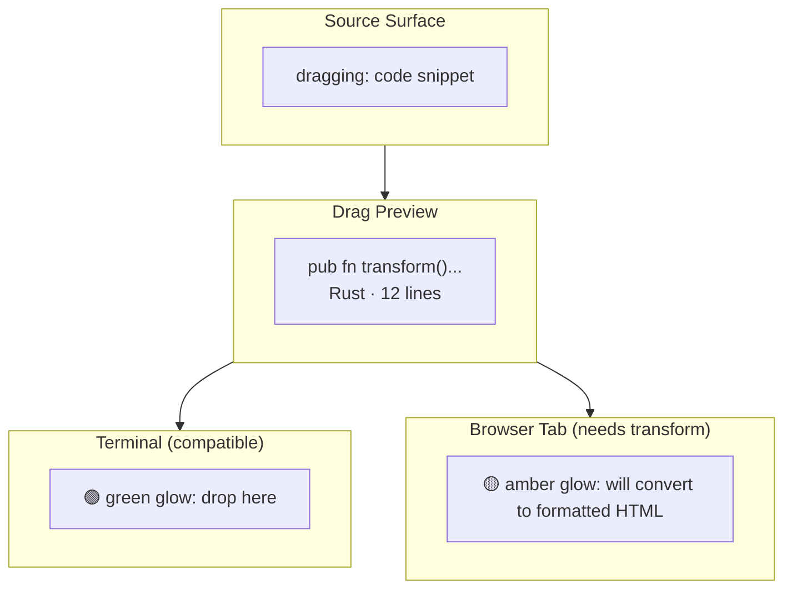
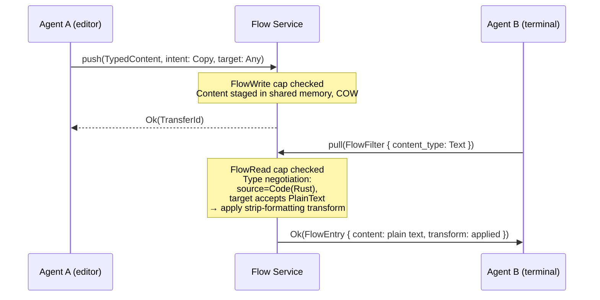

# AIOS Flow Integration

Part of: [flow.md](./flow.md) — Flow System
**Related:** [flow-data-model.md](./flow-data-model.md) — TypedContent, [flow-transforms.md](./flow-transforms.md) — Type negotiation, [flow-security.md](./flow-security.md) — Capability enforcement, [compositor.md](../platform/compositor.md) — Compositor protocol, [subsystem-framework.md](../platform/subsystem-framework.md) — DataChannel trait

-----

## 6. Compositor Integration (Drag and Drop)

### 6.1 Semantic Drag and Drop

Traditional drag and drop is a brittle protocol. The source application serializes data into one or more clipboard formats. The target application advertises which formats it accepts. The window manager mediates the format negotiation but has no understanding of the content. The result: drag and drop between applications is unreliable, type-lossy, and context-free.

Flow drag and drop is different. The compositor initiates a Flow transfer on drag start. The source agent provides TypedContent with its full type information and alternatives. As the cursor moves over potential drop targets, Flow negotiates type compatibility in real time. The drop target receives semantic content, not raw bytes.

**Detailed drag/drop protocol:**

```text
1. USER STARTS DRAG
   Compositor detects drag gesture (pointer down + movement threshold)
   Compositor sends DragStarted event to source surface's agent
   Source agent responds with:
     TypedContent { primary, mime_type, semantic_type, alternatives, metadata }

2. FLOW TRANSFER INITIATED
   Compositor calls Flow Service: initiate_drag(content, source_agent, source_surface)
   Flow Service creates Transfer(state: Staged, target: Surface(cursor_position))
   Content staged in Flow's shared memory (COW from source agent's buffer)

3. CURSOR MOVES OVER TARGETS
   For each surface the cursor enters:
     Compositor queries Flow: can_accept(target_agent, content_type)?
     Flow checks:
       a. Does target agent have FlowRead capability?
       b. Does target agent accept this content type?
       c. If not directly: can Transform Engine convert it?
     Flow returns: Compatible | NeedsTransform(transform_name) | Incompatible

4. VISUAL FEEDBACK (see §6.2)
   Compositor updates cursor and target surface appearance based on compatibility

5. USER DROPS
   Compositor sends DropReceived event to target surface's agent
   Flow Service: negotiate and transform if needed
   Content delivered to target agent's address space
   Transfer state → Delivered → Recorded

6. DRAG CANCELLED
   User releases outside any valid target, or presses Escape
   Transfer state → Cancelled
   Content region freed
```

```rust
/// Compositor → Flow Service messages during drag/drop
pub enum DragFlowRequest {
    /// Drag started: source provides content.
    /// The compositor's `has_focus()` state is used by the Flow Service
    /// to enforce focus-gated clipboard access (§15.7 in flow-extensions.md).
    DragStarted {
        source_agent: AgentId,
        source_surface: SurfaceId,
        content: TypedContent,
    },

    /// Cursor entered a potential drop target
    DragEntered {
        target_agent: AgentId,
        target_surface: SurfaceId,
    },

    /// Cursor left a potential drop target
    DragLeft {
        target_surface: SurfaceId,
    },

    /// User dropped on a target
    Drop {
        target_agent: AgentId,
        target_surface: SurfaceId,
        position: (f32, f32),
    },

    /// Drag cancelled (escape, dropped outside targets)
    DragCancelled,
}

/// Flow Service → Compositor responses
pub enum DragFlowResponse {
    /// Transfer initiated, drag may proceed
    DragAccepted { transfer_id: TransferId },

    /// Target compatibility result
    TargetCompatibility {
        surface: SurfaceId,
        result: DropCompatibility,
    },

    /// Drop completed
    DropCompleted { transform_applied: Option<String> },

    /// Drop failed
    DropFailed { reason: String },
}

pub enum DropCompatibility {
    /// Target accepts this content directly
    Compatible,
    /// Target can accept after transformation
    NeedsTransform { transform_name: String, lossy: bool },
    /// Target cannot accept this content
    Incompatible,
}
```

### 6.2 Visual Feedback

The compositor provides visual cues during drag operations, informed by Flow's type negotiation:



**Visual states:**

| State | Appearance |
|---|---|
| Drag preview | Content-aware thumbnail attached to cursor (text: first few lines; image: scaled preview; file: icon + name) |
| Compatible target | Subtle green glow on drop zone, cursor changes to "drop" icon |
| Needs transform | Amber glow on drop zone, label shows what conversion will happen ("will convert to plain text") |
| Incompatible target | No glow, cursor remains "drag" icon, target surface is visually neutral |
| Drag over non-target area | No feedback, standard cursor |

The drag preview is generated from `ContentMetadata.thumbnail` if available, or synthesized by the compositor (first 5 lines of text, scaled-down image, icon for documents).

-----

## 7. Subsystem Data Channels

### 7.1 How Subsystems Connect to Flow

Every subsystem's DataChannel (see [subsystem-framework.md](../platform/subsystem-framework.md)) has a `connect_flow()` method. This is the bridge between hardware data streams and the Flow system:

```rust
/// From the subsystem framework DataChannel trait
fn connect_flow(&self, flow: FlowPipe) -> Result<()>;
```

A `FlowPipe` is a unidirectional connection between a DataChannel and the Flow Service:

```rust
pub struct FlowPipe {
    /// Direction: hardware → Flow, or Flow → hardware
    direction: FlowPipeDirection,

    /// The content type flowing through this pipe
    content_type: TypedContentSpec,

    /// Back-pressure control: maximum bytes to buffer before applying
    /// back-pressure to the source. This is a Flow-internal staging buffer
    /// between the DataChannel and the Flow Service; it is separate from
    /// the kernel's ring buffer used by the DataChannel itself.
    buffer_size: usize,

    /// The IPC channel to the Flow Service
    channel: ChannelId,
}

pub enum FlowPipeDirection {
    /// Data flows from hardware/subsystem into Flow
    Source,
    /// Data flows from Flow into hardware/subsystem
    Sink,
}

pub struct TypedContentSpec {
    mime_type: String,
    semantic_type: SemanticType,
    streaming: bool,
}
```

**Example pipelines:**

```rust
// Microphone → Flow → Speech-to-text agent
let mic_session = audio.open_session(agent, mic_cap, &intent)?;
let speech_pipe = flow.create_pipe(FlowPipeDirection::Source, FlowTarget::Agent(speech_agent))?;
mic_session.channel().connect_flow(speech_pipe)?;
// Audio samples flow from hardware → Flow Service → speech agent
// Zero-copy if both are on the same device (shared memory)

// Camera → Flow → Image analysis agent
let cam_session = camera.open_session(agent, cam_cap, &intent)?;
let analysis_pipe = flow.create_pipe(FlowPipeDirection::Source, FlowTarget::Agent(analysis_agent))?;
cam_session.channel().connect_flow(analysis_pipe)?;

// Clipboard (POSIX tools) → Flow → native agent
// (handled by the POSIX clipboard bridge — see §10)
```

### 7.2 Streaming Flow

One-shot transfers (copy/paste) are the common case. But Flow also supports streaming transfers for continuous data — audio, video, sensor feeds:

```rust
pub struct StreamingTransfer {
    /// Base transfer metadata
    transfer: Transfer,

    /// Stream state
    stream_state: StreamState,

    /// Chunks delivered so far
    chunks_delivered: u64,

    /// Total bytes delivered
    bytes_delivered: u64,

    /// Back-pressure: receiver's buffer fullness (0.0 = empty, 1.0 = full)
    receiver_pressure: f32,

    /// Transform applied per-chunk (if any)
    chunk_transform: Option<TransformId>,
}

pub enum StreamState {
    /// Stream is active, data flowing
    Active,
    /// Stream paused (back-pressure or user action)
    Paused,
    /// Stream completed (source has no more data)
    Completed,
    /// Stream aborted (error or cancellation)
    Aborted,
}
```

**Back-pressure:** The receiver controls the data rate. When the receiver's buffer fills (pressure approaches 1.0), Flow signals the source to slow down. For subsystem DataChannels, this maps to the existing `pressure()` method on the DataChannel trait. Hardware that cannot be slowed (e.g., a live microphone) buffers in the kernel's ring buffer; if that fills, samples are dropped and the drop is logged.

**History recording for streams:** When a stream reaches `Completed` state, the Flow Service records a single `FlowEntry` with aggregated metadata: total `bytes_delivered`, `chunks_delivered`, stream duration (first chunk timestamp to last), and the `chunk_transform` applied (if any). The entry's `content` field is set to `None` — the raw stream data is not persisted (it is typically too large and ephemeral). The FlowEntry metadata is sufficient for history search ("that audio stream from the meeting at 3pm") and provenance tracking. Streams that are `Aborted` before delivering any chunks are not recorded. Streams aborted after at least one chunk record a FlowEntry with a note in the metadata indicating partial delivery. Streaming transfers are device-local and are not replicated to other devices (see §9.1).

**Per-chunk transforms:** For streaming data, transforms can be applied incrementally. Real-time transcription: each audio chunk is sent to AIRS for speech-to-text, and the text result is delivered to the receiver. The receiver sees a stream of text chunks, not audio. The transform overhead is amortized across the stream.

-----

## 8. Cross-Agent Flow

### 8.1 Agent-to-Agent Transfer

The most common Flow pattern: one agent pushes content, another pulls it.



**Targeted transfers:** When Agent A knows the destination, it can target specifically:

```rust
// Agent A pushes content to Agent B specifically
ctx.flow().push(content, FlowOptions {
    intent: TransferIntent::Copy,
    target: FlowTarget::Agent(agent_b_id),
    ephemeral: false,
}).await?;
```

Only Agent B (or an agent with elevated FlowRead that covers this transfer) can pull this content. Other agents calling `flow.pull()` will not see it.

### 8.2 Capability Requirements

Flow access is governed by two capabilities defined in the system capability enum:

```rust
// From architecture.md §3.2
pub enum Capability {
    // ...
    FlowRead,
    FlowWrite,
    // ...
}
```

**FlowWrite** allows an agent to push content into Flow. Without this capability, an agent cannot initiate transfers. Most agents request this — it is the equivalent of "can put things on the clipboard."

**FlowRead** allows an agent to pull content from Flow. Without this capability, an agent cannot receive transfers. This prevents malicious agents from snooping on clipboard content.

**Capability enforcement rules:**

| Operation | Required Capability | Additional Check |
|---|---|---|
| Push content (any target) | FlowWrite | None |
| Push content (specific agent) | FlowWrite | Target agent must have FlowRead |
| Pull content (any) | FlowRead | Only sees transfers targeted to this agent or to Any |
| Pull content (targeted) | FlowRead | Only if transfer is targeted to this agent |
| Browse history | FlowRead | Only sees entries where this agent was source or destination |
| Search history | FlowRead | AIRS search returns only entries visible to this agent |
| Register transform | FlowWrite | Transform becomes available system-wide |
| Pull with target: Any | FlowRead + compositor focus | Background agents without focus are blocked; see §15.7 in [flow-extensions.md](./flow-extensions.md) |
| Handle action content | FlowActionHandle + user confirmation | Required when receiving `SemanticType::Action`; see §15.8 in [flow-extensions.md](./flow-extensions.md) |

**Inspector visibility:** The Inspector agent (system diagnostic tool) can see the full Flow audit trail regardless of targeting. This is a system agent privilege, not available to third-party agents. The Inspector shows all transfers with source, destination, type, intent, and timestamp — but not content, unless the user explicitly requests it.

-----

## 10. POSIX Compatibility

### 10.1 Clipboard Bridge

BSD tools and POSIX applications expect a clipboard. They use `pbcopy`/`pbpaste` (macOS convention), X11 selections, or Wayland clipboard protocols. The Flow POSIX bridge translates these into Flow operations.

```rust
pub struct PosixClipboardBridge {
    /// The Flow Service IPC channel
    flow_channel: ChannelId,

    /// X11 selection protocol handler (for X11 compat layer)
    x11_selections: Option<X11SelectionHandler>,

    /// Wayland clipboard protocol handler (for Wayland compat layer)
    wayland_clipboard: Option<WaylandClipboardHandler>,
}

impl PosixClipboardBridge {
    /// Called when a POSIX tool writes to the clipboard
    /// (e.g., `echo "hello" | pbcopy`)
    fn clipboard_write(&self, data: &[u8], mime_type: &str) -> Result<()> {
        let content = TypedContent {
            primary: ContentPayload::from_bytes(data, mime_type),
            mime_type: mime_type.to_string(),
            semantic_type: SemanticType::infer_from_mime(mime_type),
            alternatives: vec![],
            metadata: ContentMetadata::default(),
        };

        self.flow_push(content, TransferIntent::Copy, FlowTarget::Any)
    }

    /// Called when a POSIX tool reads from the clipboard
    /// (e.g., `pbpaste > file.txt`)
    fn clipboard_read(&self, requested_mime: &str) -> Result<Vec<u8>> {
        let entry = self.flow_pull(FlowFilter {
            content_type: Some(requested_mime.to_string()),
            ..Default::default()
        })?;

        let content = entry.content.ok_or(FlowError::ContentPruned)?;
        Ok(content.primary.as_bytes().to_vec())
    }
}
```

**POSIX clipboard commands:**

| Command | Equivalent Flow Operation |
|---|---|
| `pbcopy` (stdin → clipboard) | `flow.push(stdin_content, Copy, Any)` |
| `pbpaste` (clipboard → stdout) | `flow.pull(text/plain)` → stdout |
| `xclip -selection clipboard` | Same as pbcopy/pbpaste via X11 selection protocol |
| `wl-copy` / `wl-paste` | Same via Wayland clipboard protocol |
| `xdotool` (X11 drag/drop simulation) | Translated to compositor drag/drop events |

**X11 selection protocol:** The X11 compatibility layer (Phase 15) translates X11's three selections (PRIMARY, SECONDARY, CLIPBOARD) into Flow operations. PRIMARY (select-to-copy) maps to `flow.push(intent: Copy)`. CLIPBOARD (explicit copy) maps to the same. SECONDARY is rarely used and maps to a targeted transfer.

**Wayland clipboard protocol:** The Wayland compatibility layer translates `wl_data_offer` / `wl_data_source` into Flow push/pull. MIME type negotiation in Wayland maps to Flow's type negotiation.

POSIX tools never know they are talking to Flow. They see a standard clipboard interface. But the data they put on the "clipboard" gets full Flow treatment — typed, recorded in history, available across devices, searchable.
