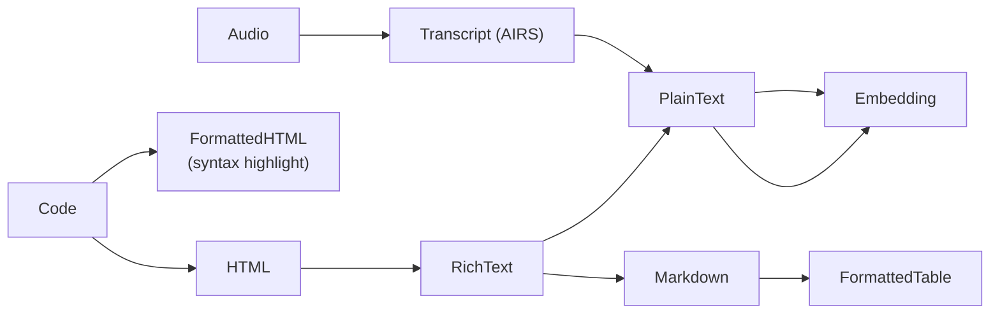

# AIOS Flow Transform Engine

Part of: [flow.md](./flow.md) — Flow System
**Related:** [flow-data-model.md](./flow-data-model.md) — TypedContent definitions, [flow-integration.md](./flow-integration.md) — Compositor type negotiation, [airs.md](../intelligence/airs.md) — AIRS-powered transforms

-----

## 4. Transform Engine

### 4.1 What Transforms Do

Transforms convert content between types so that data can flow between agents that speak different formats. Without transforms, a terminal agent could not receive rich text, and a browser agent could not receive raw code. Transforms make Flow universal.

Core transform categories:

| Source Type | Target Type | Transform | Requires AIRS? |
|---|---|---|---|
| Rich text (HTML) | Plain text | Strip tags, preserve structure | No |
| Plain text | Rich text (HTML) | Wrap in `<pre>`, escape entities | No |
| Code | Formatted HTML | Syntax highlighting | No |
| Image (any) | Image (PNG/JPEG) | Format conversion, resize | No |
| Image | Thumbnail (64KB max) | Downscale, compress | No |
| PDF | Plain text | Text extraction | No |
| Audio | Text transcript | Speech-to-text | Yes |
| Document | Summary | Summarization | Yes |
| Any text | Translation | Language translation | Yes |
| Any | Embedding (Vec<f32>) | Embedding generation | Yes |
| Rich text | Markdown | HTML-to-Markdown conversion | No |
| Structured data (JSON) | Formatted table (HTML) | Table rendering | No |
| URL | Page content (HTML) | Fetch and extract | No (network) |

### 4.2 Transform Pipeline

When a receiver accepts a transfer, the Transform Engine determines if conversion is needed and executes it:

```text
Source content (TypedContent)
  │
  ▼
Type Negotiation
  What types can the receiver accept?
  Does the source provide any of those types (primary or alternatives)?
  ├── YES → deliver directly, no transform needed
  └── NO  → continue to transform selection
  │
  ▼
Transform Selection
  Find conversion path from source type to accepted target type
  Multiple paths may exist — select the cheapest:
    cost = execution_time_estimate + resource_estimate
  ├── System transform available → use it (fast, always available)
  ├── AIRS transform needed → check AIRS availability
  │     ├── AIRS running → use it
  │     └── AIRS not running → fall back to system transform or fail
  └── Agent transform registered → route through agent
  │
  ▼
Transform Execution
  Execute the selected transform
  Input: source ContentPayload (shared memory)
  Output: new ContentPayload (new shared memory region)
  Record: TransformRecord (what, when, cost)
  │
  ▼
Delivery to receiver
  Map transformed content into receiver's address space
```

### 4.3 Transform Registry

Transforms are registered with the Flow Service. System transforms ship with the OS. AIRS transforms become available when AIRS is running. Third-party agents can contribute transforms.

```rust
pub struct Transform {
    /// Unique identifier
    id: TransformId,

    /// Human-readable name
    name: String,

    /// Source types this transform accepts
    input_types: Vec<TypeMatcher>,

    /// Target type this transform produces
    output_type: TypeSpec,

    /// Estimated cost (lower is preferred)
    cost: TransformCost,

    /// Who provides this transform
    provider: TransformProvider,
}

pub struct TypeMatcher {
    /// MIME type pattern (supports wildcards: "text/*", "image/*")
    mime_pattern: String,
    /// Optional semantic type constraint
    semantic_type: Option<SemanticType>,
}

pub struct TypeSpec {
    mime_type: String,
    semantic_type: SemanticType,
}

pub struct TransformCost {
    /// Estimated time in milliseconds
    time_ms: u32,
    /// Estimated memory in bytes
    memory: u64,
    /// Whether this transform requires AIRS
    requires_airs: bool,
    /// Whether this is lossy (information may be lost)
    lossy: bool,
}

impl TransformCost {
    /// Reduce to a scalar for shortest-path computation in ConversionGraph.
    /// Formula: time_ms + (memory / 1MB) + (50 if requires_airs) + (10 if lossy).
    /// The AIRS and lossy penalties ensure the graph prefers local, lossless
    /// transforms when multiple paths have similar time/memory costs.
    pub fn as_scalar(&self) -> u32 {
        self.time_ms
            + (self.memory / (1024 * 1024)) as u32
            + if self.requires_airs { 50 } else { 0 }
            + if self.lossy { 10 } else { 0 }
    }
}

pub enum TransformProvider {
    /// Built-in system transform (always available)
    System,
    /// AIRS-powered transform (available when AIRS is running)
    Airs,
    /// Agent-provided transform (available when agent is running)
    Agent(AgentId),
}

/// Directed graph where nodes are content types and edges are transforms.
/// Used by the Transform Engine to find cheapest conversion paths.
/// Recomputed when transforms are added or removed.
pub struct ConversionGraph {
    /// Content type nodes (MIME types)
    nodes: Vec<String>,
    /// Edges: (source_index, target_index, transform_id, scalar_cost).
    /// scalar_cost is computed via TransformCost::as_scalar().
    edges: Vec<(usize, usize, TransformId, u32)>,
}

pub struct TransformRegistry {
    /// All registered transforms, indexed by input type
    transforms: HashMap<String, Vec<Transform>>,  // mime pattern → transforms

    /// Precomputed shortest-path conversion graph
    /// Updated when transforms are registered/unregistered
    conversion_graph: ConversionGraph,
}

/// Transform selection tiebreaker rules (applied in order):
///
/// When multiple transforms match the same input → output type conversion:
/// 1. **Lowest cost wins.** Compare TransformCost.time_ms first, then memory.
/// 2. **Provider priority.** If costs are equal: System > Airs > Agent.
///    System transforms are always preferred because they are deterministic,
///    always available, and have no inference overhead.
/// 3. **Agent tiebreaker.** If two Agent providers have equal cost:
///    the agent with the longer runtime (more established) wins.
///    This is a stable sort — the first registered agent wins if both
///    started at the same time. No randomness.
/// 4. **Lossless preferred.** If costs and providers are equal, prefer
///    the non-lossy transform.

pub struct TransformRecord {
    /// Which transform was applied
    transform: TransformId,
    /// Input type
    input_type: String,
    /// Output type
    output_type: String,
    /// Execution time
    duration: Duration,
    /// Whether information was lost
    lossy: bool,
    /// Timestamp
    executed_at: Timestamp,
}
```

**Conversion graph:** The registry maintains a directed graph where nodes are content types and edges are transforms. When a conversion is needed, the engine finds the shortest (cheapest) path. The graph is recomputed when transforms are added or removed.



> **Note:** This graph is simplified for illustration. It omits several transform paths listed in the §4.1 table (e.g., PDF → PlainText, Image → Thumbnail, StructuredData → FormattedTable as a standalone path, URL → PageContent). See §4.1 for the full transform matrix.

If a receiver needs Markdown but the source provides HTML, the engine walks: HTML → RichText → Markdown (two system transforms, no AIRS needed, fast).

If a receiver needs an embedding but the source provides Audio, the engine walks: Audio → Transcript (AIRS) → PlainText → Embedding (AIRS). The engine checks AIRS availability before committing to this path.

Code → FormattedHTML uses syntax highlighting (a system transform, no AIRS needed). This is distinct from the HTML node, which represents generic HTML content — FormattedHTML is specifically syntax-highlighted markup.
