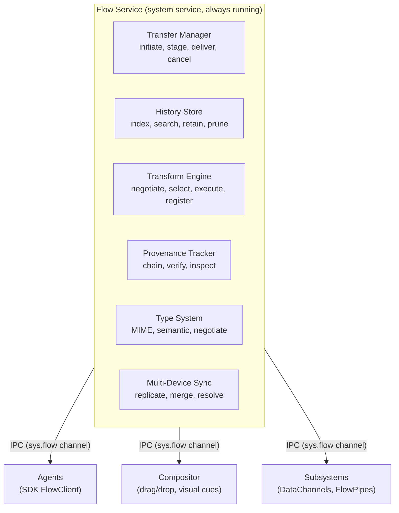

# AIOS Flow System

## Deep Technical Architecture

**Parent document:** [architecture.md](../project/architecture.md)
**Related:** [compositor.md](../platform/compositor.md) — Drag/drop integration, [subsystem-framework.md](../platform/subsystem-framework.md) — DataChannel/Flow pipes, [agents.md](../applications/agents.md) — SDK FlowClient, [spaces.md](./spaces.md) — History storage, [experience.md](../experience/experience.md) — Flow Tray UI, [flow-data-model.md](./flow-data-model.md) — Data model, [flow-transforms.md](./flow-transforms.md) — Transform engine, [flow-history.md](./flow-history.md) — History & sync, [flow-integration.md](./flow-integration.md) — Compositor & subsystem integration, [flow-security.md](./flow-security.md) — Security, [flow-sdk.md](./flow-sdk.md) — SDK APIs, [flow-extensions.md](./flow-extensions.md) — Extensions

-----

## 1. Overview

The clipboard is the worst abstraction in modern computing. It is a single global buffer with no type information, no history, no provenance, no transformations, no multi-device awareness, and no context. You copy something, you paste something. If you copy again, the first thing is gone. You cannot see what is on the clipboard. You cannot search it. You cannot trace where data came from or where it went. Every application implements its own internal clipboard for rich content because the OS clipboard is useless for anything beyond plain text.

Flow replaces the clipboard entirely. Every copy, paste, drag, drop, and share action in AIOS goes through Flow. Flow is a system service that provides:

- **Typed content.** Flow knows it is carrying a PDF, a code snippet, an image, a URL — not just bytes. Content carries its MIME type, its AIOS semantic type, and alternative representations.
- **History.** Every transfer is recorded. You can search your Flow history by content, by agent, by time, by type. "Find that thing I copied last week about transformer architectures" is a real query.
- **Provenance.** Every transfer records where the data came from, who sent it, what transformations were applied, and where it went. The full chain is inspectable.
- **Transformations.** When the receiver cannot handle the source format, Flow transforms the content automatically. Rich text becomes plain text for a terminal. An image becomes a thumbnail for a preview. Audio becomes a transcript via AIRS.
- **Intent.** A transfer is not just "copy." It can be a copy, a move, a reference, a quote (with attribution), or a derivation (new object linked to source). Each intent has different semantics.
- **Multi-device.** Copy on your laptop, paste on your tablet. Flow syncs between AIOS devices sharing an identity.
- **Context awareness.** Flow knows what agent is sending, what agent is receiving, and what the user is doing. It adapts behavior accordingly.

No other operating system has this. macOS has Universal Clipboard (multi-device copy/paste) but no types, no history, no transforms, no provenance. Windows has clipboard history but no types, no transforms, no provenance. Linux has three separate clipboard buffers (PRIMARY, SECONDARY, CLIPBOARD) and none of them do anything useful beyond raw byte transfer.

Flow is the connective tissue of AIOS. It is how data moves between agents, between subsystems, between devices. It is how the user's work stays connected.

-----

## 2. Architecture



The Flow Service runs as a system service registered at `sys.flow`. The core service lands in dev Phase 11 (Tasks, Flow & Attention), with compositor drag/drop protocol scaffolded in Phase 6 and AIRS transform scaffolding in Phase 8 (see §13 for full implementation order). At runtime, it starts during boot Phase 4 (user services), after Space Storage (boot Phase 1) and IPC (boot Phase 2) are available. AIRS-powered transforms become available when AIRS completes boot Phase 3 initialization. Agents connect via IPC channels with `FlowRead` and/or `FlowWrite` capabilities.

The six internal components:

| Component | Responsibility |
|---|---|
| Transfer Manager | Active transfer lifecycle: initiation, staging, delivery, cancellation |
| History Store | Persistent record of all completed transfers, stored in `system/flow/` space |
| Transform Engine | Content type negotiation and conversion between source and target formats |
| Provenance Tracker | Append-only chain linking each transfer to its source, transformations, and destination |
| Type System | MIME type registry, semantic type registry, compatibility matrix |
| Multi-Device Sync | Replication of active transfers and history across devices sharing an identity |

-----

## Document Map

This document is the hub for the Flow system. Detailed content has been split into focused sub-documents for navigability:

| Document | Sections | Content |
|---|---|---|
| **This file** | §1, §2, §13, §14 | Overview, architecture, implementation order, design principles |
| [flow-data-model.md](./flow-data-model.md) | §3.0–§3.4 | External types, FlowEntry, transfer lifecycle, TypedContent |
| [flow-transforms.md](./flow-transforms.md) | §4.1–§4.3 | Transform engine, pipeline, registry, conversion graph |
| [flow-history.md](./flow-history.md) | §5.1–§5.3, §9.1–§9.2 | History storage, UI, retention, multi-device sync |
| [flow-integration.md](./flow-integration.md) | §6.1–§6.2, §7.1–§7.2, §8.1–§8.2, §10.1 | Compositor drag/drop, subsystem channels, cross-agent, POSIX bridge |
| [flow-security.md](./flow-security.md) | §11.1–§11.3 | Capability enforcement, content screening, rate limiting |
| [flow-sdk.md](./flow-sdk.md) | §12.1–§12.3 | Rust API, Python API, TypeScript API, PWA web API |
| [flow-extensions.md](./flow-extensions.md) | §15.1–§15.8, §16.1–§16.11 | Near-term extensions, future directions |

-----

## 13. Implementation Order

Phases reference the canonical project-wide phase numbers from [development-plan.md](../project/development-plan.md). The dependency chain for Flow is: Phase 6 (compositor scaffolds drag/drop protocol) → Phase 8 (AIRS scaffolds transform engine) → Phase 11 (Flow service lands, connects to compositor and AIRS) → later phases extend.

```text
Phase 6:   Compositor drag/drop protocol scaffold
             DragFlowRequest/DragFlowResponse message types defined
             Drag preview generation and visual feedback framework
             Drop target type query API (stubbed — real Flow negotiation
             connects in Phase 11 when the Flow Service exists)

Phase 8:   AIRS transform scaffold
             Transform Engine data structures and ConversionGraph
             AIRS-powered transforms registered: summarize, transcribe,
             translate, embed
             TransformRegistry with system + AIRS providers
             Conversion graph shortest-path selection algorithm

Phase 11:  Flow Service (core phase — most Flow work lands here)
             Flow Service process, sys.flow IPC channel, boot Phase 4
             FlowWrite/FlowRead capability enforcement
             Push/pull with full TypedContent and type negotiation
             Transfer lifecycle (Initiated → Staged → Delivered → Recorded)
             In-memory transfer staging with COW shared memory
             Connect to compositor: live drag/drop type negotiation,
               visual feedback (compatible/incompatible/needs-transform)
             Connect to AIRS: transform execution during type negotiation
             System transforms (text conversion, image resize, format conversion)
             Agent-contributed transforms via TransformHandler trait
             Flow History Store (system/flow/ space, content-addressed)
             Flow History UI (Ctrl+Shift+V, search, re-send)
             Provenance chain (append-only, linked to space provenance)
             Retention policy and content pruning
             Semantic search over history (via AIRS)
             FlowEntry as space object with full metadata
             Content screening for sensitive data (§11.2)
             Rate limiting and per-agent transfer quotas (§11.3)

Phase 15:  POSIX clipboard bridge
             pbcopy/pbpaste equivalents
             X11 selection protocol translation
             Wayland clipboard protocol translation
             POSIX tools see a standard clipboard, Flow sees typed transfers

Phase 21:  Browser Flow integration
             aios.flow() Web API for PWAs
             Browser tab ↔ native agent transfers
             Cross-tab Flow (tab agents share clipboard through Flow)

Phase 26:  Multi-device sync
             Cross-device transfer via AIOS Peer Protocol
             History merge (CRDT-style, grow-only set)
             Conflict resolution (latest-write-wins for active transfers)
             Encrypted transit (identity keys)
             Large content on-demand sync
             Content screening for cross-device transfers
```

-----

## 14. Design Principles

1. **Typed, not raw.** Content always carries its type. No more "text/plain and pray." Agents declare what they produce and what they accept. Flow bridges the gap.
2. **History is free.** Every transfer is recorded. Storage is content-addressed, so duplicates cost nothing. Users should never lose something they copied.
3. **Provenance is mandatory.** Every transfer records where the data came from. This is not optional. Provenance is how the user (and the Inspector) understands data lineage.
4. **Transform, don't reject.** When the receiver cannot handle the source format, Flow converts. The user should never see "incompatible format" — they should see their data, perhaps in a different representation.
5. **Intent matters.** Copy, move, reference, quote, derive — these are fundamentally different operations. The clipboard treats them all as "copy." Flow distinguishes them because the distinction affects provenance, storage, and user expectations.
6. **Ephemeral when needed.** Passwords, tokens, and sensitive credentials can flow between agents without persisting in history. The transfer happens; the content vanishes.
7. **POSIX is a view.** The clipboard bridge makes BSD tools work. But the clipboard is a translation layer over Flow, not the other way around. Flow is the truth; the clipboard is a compatibility shim.
