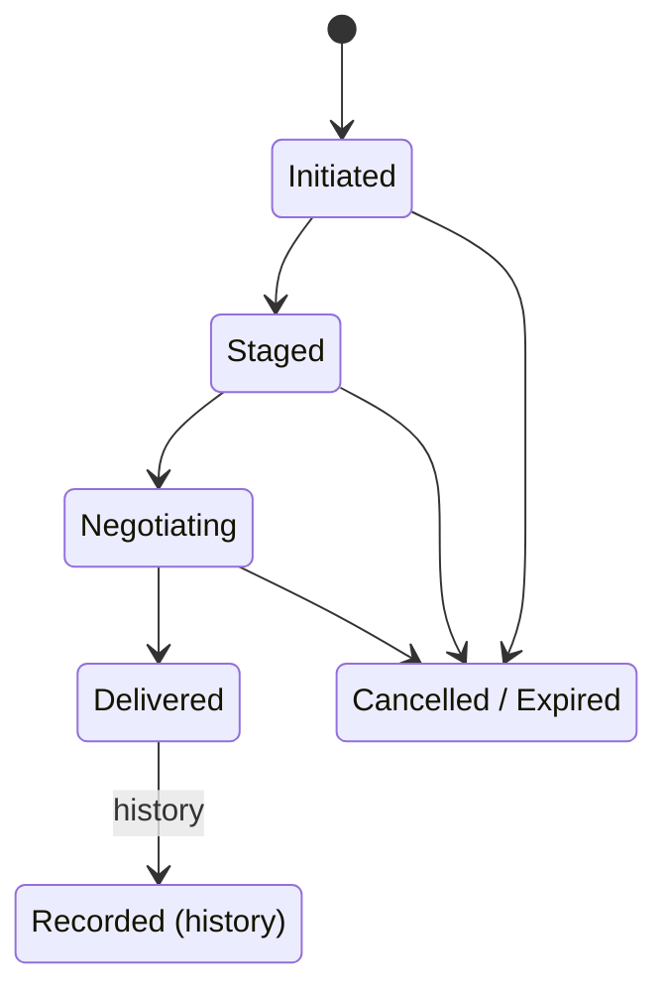

# AIOS Flow Data Model

Part of: [flow.md](../flow.md) — Flow System
**Related:** [transforms.md](./transforms.md) — Transform engine, [history.md](./history.md) — History storage, [data-structures.md](../../storage/spaces/data-structures.md) — Space types referenced by Flow

-----

## 3. Core Data Model

### 3.0 External Types

Flow uses types defined in other documents. Canonical definitions:

| Type | Defined In | Description |
|---|---|---|
| `AgentId` | [spaces.md §3.0](./spaces.md) | Agent identity (Ed25519 public key, 32 bytes) |
| `ObjectId` | [spaces.md §3.0](./spaces.md) | Object identifier (UUID v4, 16 bytes) |
| `SpaceId` | [spaces.md §3.0](./spaces.md) | Space identifier (UUID v4, 16 bytes) |
| `Hash` | [spaces.md §3.0](./spaces.md) | SHA-256 hash (32 bytes) |
| `Timestamp` | [spaces.md §3.0](./spaces.md) | Milliseconds since Unix epoch |
| `Signature` | [spaces.md §3.0](./spaces.md) | Ed25519 signature (64 bytes) |
| `ObjectRef` | [spaces.md §3.0](./spaces.md) | Reference to a space object (SpaceId + ObjectId + optional version Hash) |
| `SharedMemoryId` | [memory.md §7](../kernel/memory.md) | Kernel-issued handle for a shared memory region |
| `ChannelId` | [ipc.md §3.1](../kernel/ipc.md) | IPC channel identifier |
| `SurfaceId` | [compositor.md §3](../platform/compositor.md) | Compositor surface identifier |
| `DeviceId` | [subsystem-framework.md §4](../platform/subsystem-framework.md) | Device identifier within the subsystem framework |
| `IdentityId` | [spaces.md §3.0](./spaces.md) | Identity identifier (Ed25519 public key); shared across a user's devices |
| `TrustLevel` | [identity.md §5](../experience/identity.md) | Trust classification for identities (Trusted/Verified/Known/Unknown) |
| `KeyId` | [spaces.md §3.0](./spaces.md) | Cryptographic key identifier (`u32`); used by §15.3 FlowEncryptionPolicy |
| `Duration` | Rust `core::time::Duration` | Time span; used for expiration, retention, and streaming durations |

Types defined locally in this document: `FlowEntryId` (§3.1), `TransferId` (§3.1), `TransformId` (§3.1).

### 3.1 FlowEntry

Every completed transfer becomes a `FlowEntry` stored in the history:

```rust
pub struct FlowEntry {
    /// Unique identifier for this entry
    id: FlowEntryId,

    /// The agent that initiated the transfer
    source_agent: AgentId,

    /// The agent that received the content (None if still in clipboard/unclaimed)
    destination_agent: Option<AgentId>,

    /// The content that was transferred. None when content has been pruned
    /// by the retention policy (large content >10 MB under storage pressure,
    /// or ephemeral transfers after delivery). The FlowEntry metadata
    /// (type, agents, timestamps, provenance) is always retained even when
    /// content is pruned. See §5.3 for retention rules.
    content: Option<TypedContent>,

    /// What the sender intended (Copy, Move, Reference, Quote, Derive)
    intent: TransferIntent,

    /// Transformations applied during delivery
    transformations: Vec<TransformRecord>,

    /// When the transfer was initiated
    initiated_at: Timestamp,

    /// When the transfer was delivered (None if cancelled or expired)
    delivered_at: Option<Timestamp>,

    /// Link to the provenance chain
    provenance: ProvenanceLink,

    /// Object references — source object, destination object (if created)
    source_object: Option<ObjectRef>,
    destination_object: Option<ObjectRef>,

    /// Device that originated this entry (for multi-device sync).
    /// DeviceId is a per-device hardware identifier (see subsystem-framework.md §4).
    /// Each physical device has a unique DeviceId even when multiple devices share
    /// the same user IdentityId. This allows the sync protocol to distinguish
    /// entries per device and track per-device watermarks.
    origin_device: DeviceId,
}

pub struct FlowEntryId(u128);

/// Unique identifier for an active transfer (in-flight, not yet recorded).
/// Distinct from FlowEntryId which identifies completed/recorded transfers.
pub struct TransferId(u128);

/// Unique identifier for a registered content transform.
pub struct TransformId(u64);

/// Error type for Flow operations. Used by push(), pull(), transfer
/// lifecycle management, and POSIX clipboard bridge.
pub enum FlowError {
    /// Agent does not hold the required FlowRead or FlowWrite capability.
    PermissionDenied,
    /// Source content type cannot be converted to any type the receiver accepts.
    IncompatibleType,
    /// The referenced TransferId does not exist or has already completed.
    TransferNotFound,
    /// A content transform failed during execution.
    TransformFailed(String),
    /// The transfer expired before a receiver claimed it.
    Expired,
    /// The agent's capability was revoked mid-transfer.
    CapabilityRevoked,
    /// The FlowEntry exists but its content was removed by retention policy.
    /// Unlike TransferNotFound, retrying will not help — the content is
    /// permanently gone. The FlowEntry metadata is still available.
    ContentPruned,
    /// The agent has exceeded its rate limit (see §11.3).
    RateLimited,
    /// The transfer options are logically invalid (e.g., ephemeral=true
    /// with Move intent, which is disallowed because Move implies persistence).
    /// Distinct from PermissionDenied — this is a logic error, not a capability issue.
    InvalidOptions(String),
    /// Underlying I/O or IPC error.
    IoError(String),
    /// Content sanitization failed and reject_unsanitizable is true
    /// (see §15.6 in extensions.md). The content was not staged.
    SanitizationFailed(String),
}

/// Links a Flow transfer to the provenance chain in the Version Store
/// (see spaces.md §5.1). When a transfer creates or modifies a space object,
/// a ProvenanceEntry is recorded in the object's Version node. This
/// ProvenanceLink stores the hash of that entry, connecting the Flow history
/// to the space's Merkle DAG. The `parent` field links to the previous
/// FlowEntry's provenance (if the content was derived from a prior transfer),
/// forming a separate Flow-level chain alongside the per-object Version chain.
pub struct ProvenanceLink {
    /// Hash of the ProvenanceEntry recorded in the space Version Store
    hash: Hash,
    /// Previous link in the Flow provenance chain (if this content was
    /// derived from another transfer — e.g., Quote or Derive intent)
    parent: Option<Hash>,
}
```

FlowEntry is stored as a space object in `system/flow/history/`. The object's semantic metadata includes the entry's content type, source agent name, and a text summary for full-text search. The entry's content is stored as a content-addressed block — if the same content is transferred ten times, it is stored once.

### 3.2 Transfer Lifecycle

A transfer moves through a defined set of states:



```rust
pub struct Transfer {
    /// Unique transfer identifier
    id: TransferId,

    /// Current state.
    /// Future: progressive delivery (§16.8 in extensions.md) adds a
    /// Streaming sub-state where large transfers (>10 MB) deliver segments
    /// before staging completes.
    state: TransferState,

    /// The source agent and object reference
    source: TransferEndpoint,

    /// The content being transferred
    content: TypedContent,

    /// What the sender intends
    intent: TransferIntent,

    /// Target: specific agent, any agent, or global clipboard
    target: FlowTarget,

    /// Transformations that have been applied or are pending
    transformations: Vec<Transform>,

    /// Whether the content should be purged after delivery
    ephemeral: bool,

    /// Expiration time (for unclaimed transfers)
    expires_at: Option<Timestamp>,

    /// Flow Service's internal COW staging region for the transfer.
    /// This is the service-side copy; the agent-facing handle is
    /// content.primary.data (the SharedMemoryId inside TypedContent).
    /// They start as the same physical pages (COW), but content_region
    /// is owned by the Flow Service and survives even if the source
    /// agent unmaps its side. The agent never sees this field — it is
    /// internal to the Transfer Manager.
    content_region: SharedMemoryId,
}

pub enum TransferState {
    /// Source has initiated, content not yet staged
    Initiated,
    /// Content staged in Flow's shared memory, ready for receiver
    Staged,
    /// Receiver has accepted, type negotiation in progress
    Negotiating,
    /// Content delivered to receiver
    Delivered,
    /// Transfer cancelled by source or system
    Cancelled,
    /// Transfer expired (no receiver claimed it)
    Expired,
    /// Transfer recorded in history (final state). Separate from Delivered
    /// because history persistence is async and may fail or be skipped for
    /// ephemeral transfers. See lifecycle step 7 for details.
    Recorded,
}

pub struct TransferEndpoint {
    agent: AgentId,
    object: Option<ObjectRef>,
    surface: Option<SurfaceId>,  // for drag/drop: which surface
}

pub enum FlowTarget {
    /// Any agent can pull this (global clipboard behavior)
    Any,
    /// Specific agent only
    Agent(AgentId),
    /// Specific surface (for drag/drop targeting)
    Surface(SurfaceId),
}
```

**Detailed lifecycle walkthrough:**

```text
1. INITIATE
   Source agent calls flow.push(content, options)
   Flow Service: check FlowWrite capability → create Transfer(state: Initiated)

2. STAGE
   Content copied into Flow's shared memory region (copy-on-write)
   If content is an ObjectRef and intent is Reference: no copy, just store the ref
   Transfer state → Staged
   Transfer visible in Flow Tray

3. ACCEPT
   Receiver calls flow.pull() or user drops onto target
   Flow Service: check FlowRead capability on receiver
   Transfer state → Negotiating

4. NEGOTIATE
   Flow compares source content type with receiver's accepted types
   If compatible: proceed directly
   If incompatible: Transform Engine finds conversion path
   If no path exists: transfer fails with IncompatibleType error

5. TRANSFORM (if needed)
   Transform Engine executes the cheapest conversion path
   Transformation recorded in TransformRecord
   Transformed content staged in new shared memory region

6. DELIVER
   Content (original or transformed) mapped into receiver's address space
   For Move intent: source object archived/deleted
   For Reference intent: receiver gets an ObjectRef, not content
   For Quote intent: DerivedFrom relation created in space
   Transfer state → Delivered

7. RECORD
   FlowEntry created in history store
   Provenance chain appended
   Content deduplicated in history (content-addressed)
   Transfer state → Recorded (final)

   Note: Delivered and Recorded are separate states because recording
   may fail (storage full, I/O error) or be skipped (ephemeral transfers
   with ephemeral_retention=0 go directly to content pruning after
   delivery). The separation also allows the Transfer Manager to release
   the receiver immediately at Delivered without blocking on the
   potentially slower history write. If recording fails, the transfer
   remains in Delivered state and is retried on the next history flush.
```

### 3.3 TransferIntent

Each intent carries different semantics for how the content relates to its source:

```rust
pub enum TransferIntent {
    /// Duplicate content. New independent object, no link to original.
    /// This is the default clipboard behavior. Receiver gets a full copy.
    /// Source is unaffected.
    Copy,

    /// Transfer ownership. Content moves from source to destination.
    /// After delivery, the source object is archived (versioned, then removed
    /// from active space). The destination object is the canonical copy.
    Move,

    /// Share a reference, not the content. Receiver gets an ObjectRef.
    /// The receiver sees the live object — changes to the original are visible.
    /// No content duplication. Efficient for large objects.
    Reference,

    /// Copy with attribution. Creates a new object with a DerivedFrom
    /// relation linking it to the source. Used for quoting, citing, or
    /// pasting with context. The receiver can trace back to the original.
    Quote,

    /// Transform and create a new object with a provenance link.
    /// The content is modified (summarized, translated, reformatted)
    /// and the resulting object records its derivation.
    Derive,
}
```

**Intent behavior matrix:**

| Intent | Content copied? | Source affected? | Relation created? | Provenance link? | Ephemeral interaction |
|---|---|---|---|---|---|
| Copy | Yes (full copy) | No | No | Yes (FlowEntry recorded, source/dest tracked for history search — no Relation object in the space) | If ephemeral=true, content is set to None after delivery; FlowEntry metadata remains for audit |
| Move | Yes (transferred) | Archived (source object's state set to Archived) | No | Yes (full chain: source → transfer → destination) | ephemeral=true is disallowed for Move (Move implies persistence) |
| Reference | No (ObjectRef only) | No | References (Relation created in destination space) | Yes (lightweight — only ObjectRef is tracked) | If source object is deleted, ObjectRef becomes dangling; receiver gets `ObjectNotFound` on access |
| Quote | Yes (full copy) | No | DerivedFrom (Relation with attribution metadata) | Yes (includes source quote context) | Ephemeral=true allowed; DerivedFrom relation persists even after content is purged |
| Derive | Yes (transformed copy) | No | DerivedFrom (Relation linking to original) | Yes (includes transform chain) | Ephemeral=true allowed; behaves like ephemeral Copy but with the DerivedFrom relation |

**Key distinction — Copy vs Quote:** Copy creates no Relation between objects. Quote creates a `DerivedFrom` relation with attribution, linking the new object to its source. Use Copy for "I want this data." Use Quote for "I'm citing this data."

### 3.4 TypedContent

Content in Flow is never raw bytes. It always carries type information and alternative representations:

```rust
pub struct TypedContent {
    /// The primary content payload
    primary: ContentPayload,

    /// Standard MIME type (e.g., "text/html", "image/png", "application/pdf")
    mime_type: String,

    /// AIOS semantic type — richer than MIME, used for type negotiation
    semantic_type: SemanticType,

    /// Same content in alternative formats, pre-computed by source
    /// e.g., rich text agent provides both text/html and text/plain.
    /// Future: lazy materialization (§16.7 in extensions.md) replaces
    /// this eager Vec with deferred AlternativeOffer futures.
    alternatives: Vec<ContentPayload>,

    /// Metadata about the content
    metadata: ContentMetadata,
}

pub struct ContentPayload {
    /// Shared memory region containing the data.
    /// SharedMemoryId is a kernel-issued opaque handle (see memory.md §7)
    /// identifying a reference-counted shared memory region. The region is
    /// COW (copy-on-write): the source agent's content is not duplicated
    /// until the receiver modifies it. The region's lifetime is managed by
    /// the kernel — it is freed when all mapping agents unmap it AND the
    /// Flow Service releases its reference (after the transfer completes
    /// or the history entry is pruned). Maximum lifetime for unclaimed
    /// transfers is controlled by Transfer.expires_at (default: 5 minutes).
    /// Future: scatter-gather delivery (§16.10 in extensions.md) may
    /// inline small payloads (<4 KB) in the IPC message instead of mapping
    /// a shared memory region.
    data: SharedMemoryId,
    /// Size in bytes
    size: u64,
    /// MIME type of this specific payload
    mime_type: String,
}

impl ContentPayload {
    /// Create a ContentPayload from raw bytes (allocates a shared memory region).
    /// Used by the POSIX clipboard bridge (§10) and SDK convenience methods.
    pub fn from_bytes(data: &[u8], mime_type: &str) -> Self;

    /// Read the content as a byte slice (maps the shared memory region).
    pub fn as_bytes(&self) -> &[u8];
}

pub enum SemanticType {
    /// Plain text (terminal output, notes, logs)
    PlainText,
    /// Rich text (formatted document content)
    RichText,
    /// Source code with language info
    Code { language: String },
    /// URL or URI
    Link { title: Option<String> },
    /// Image (photograph, screenshot, diagram)
    Image { width: u32, height: u32 },
    /// Audio (recording, music, podcast clip)
    Audio { duration: Duration },
    /// Video (clip, recording, screen capture)
    Video { duration: Duration, width: u32, height: u32 },
    /// Document (PDF, office document, ebook)
    Document { page_count: Option<u32> },
    /// Structured data (JSON, CSV, table)
    StructuredData { schema: Option<String> },
    /// Space object reference
    ObjectReference,
    /// File (generic, for POSIX compat)
    File { extension: String },
    /// Agent-defined custom type
    Custom { type_id: String },
    /// Dispatchable action (see §15.8 in extensions.md).
    /// Pasting dispatches to a registered action handler rather than
    /// inserting content. Requires FlowActionHandle capability + user
    /// confirmation. Falls back to fallback_content if no handler.
    Action { action_id: String, params: HashMap<String, String> },
}

pub struct ContentMetadata {
    /// Human-readable title or summary of the content
    title: Option<String>,
    /// Source description (e.g., "Copied from arxiv.org/abs/2026.12345")
    source_description: Option<String>,
    /// Content hash (SHA-256) for deduplication
    content_hash: Hash,
    /// When the content was originally created (not when it was transferred)
    created_at: Option<Timestamp>,
    /// Thumbnail (small preview image, ≤ 64KB)
    thumbnail: Option<Vec<u8>>,
    /// Whether this content has been sanitized by the Flow Service.
    /// Set to true for system semantic types after the sanitization pipeline
    /// runs (see §15.6 in extensions.md). Custom types have this set
    /// to false — receivers should validate custom content independently.
    sanitized: bool,
}
```

**Convenience constructors and defaults:**

```rust
impl TypedContent {
    /// Create a TypedContent wrapping a plain text string.
    /// Used by the SDK for simple copy/paste (see §12 usage examples).
    pub fn plain_text(text: &str) -> Self;

    /// Create a TypedContent wrapping rich text (HTML) with an optional source URL.
    /// The source URL is recorded in ContentMetadata.source_description.
    pub fn rich_text(html: &str, source_url: Option<&str>) -> Self;
}

impl SemanticType {
    /// Infer a SemanticType from a MIME type string.
    /// "text/plain" → PlainText, "text/html" → RichText, "image/*" → Image,
    /// "audio/*" → Audio, "application/pdf" → Document, etc.
    /// Falls back to File { extension } for unrecognized MIME types.
    pub fn infer_from_mime(mime: &str) -> Self;
}

/// ContentMetadata, FlowFilter, and FlowQuery derive Default.
/// ContentMetadata::default() sets content_hash to a zeroed Hash,
/// all Option fields to None, thumbnail to None, and sanitized to false.
/// FlowFilter::default() and FlowQuery::default() set all filter
/// fields to None / 0, matching all entries with no pagination offset.
```

When a source agent pushes content, it provides the primary payload and optionally pre-computed alternatives. If the receiver cannot handle the primary type and no pre-computed alternative matches, the Transform Engine generates one on the fly.

**Copy-on-write semantics:** Content in Flow uses shared memory regions with COW (copy-on-write) page mappings. When Agent A pushes content into Flow, the kernel maps the same physical pages into Flow's address space. No copy occurs until someone modifies the data. For read-only transfers (the common case), the content is never copied at all — just the page table entries.
