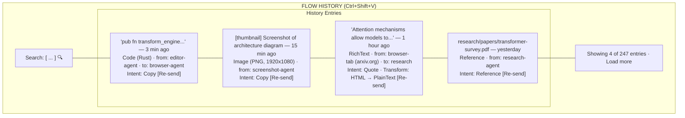
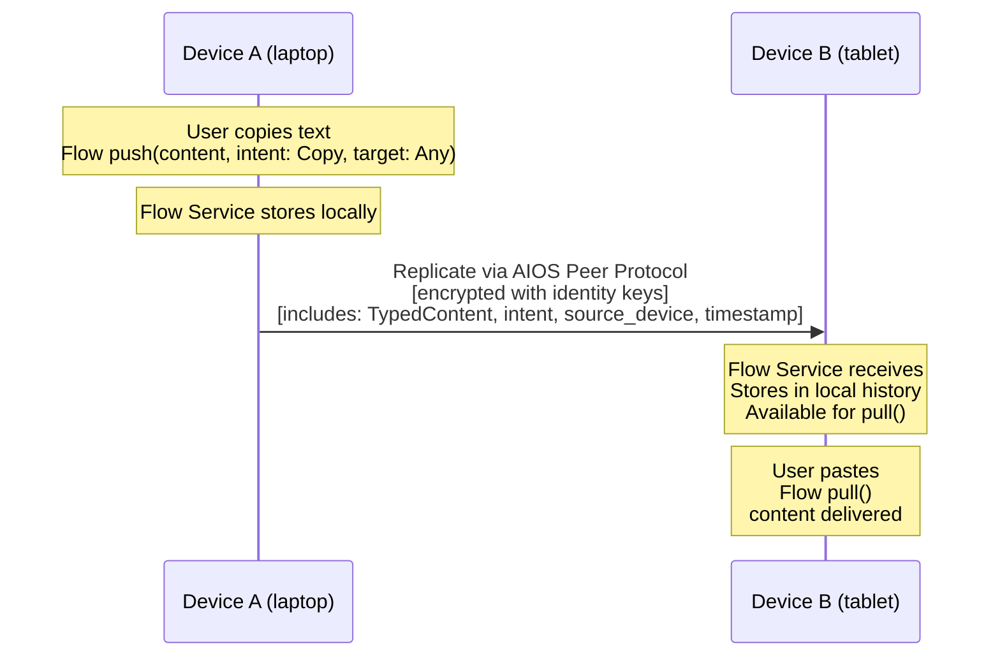

# AIOS Flow History & Multi-Device Sync

Part of: [flow.md](../flow.md) — Flow System
**Related:** [data-model.md](./data-model.md) — FlowEntry structure, [security.md](./security.md) — Content screening, [spaces.md](./spaces.md) — History storage backend, [networking.md](../platform/networking.md) — Peer Protocol transport

-----

## 5. Flow History

### 5.1 Storage

Flow history is stored in the `system/flow/` space:

```text
system/flow/
  history/            ← FlowEntry objects, content-addressed
  index/              ← Full-text index of entry metadata
  transforms/         ← Transform registry (persistent transforms)
  config/             ← Retention policy, user preferences
```

Each FlowEntry is a space object. The content payload is stored as a content-addressed block, so identical content shared ten times occupies storage once. The object's semantic metadata includes:

- Content type and semantic type (for filtering)
- Source agent name and destination agent name (for searching)
- Content title or first 200 characters (for full-text search)
- Timestamp (for temporal queries)

AIRS indexes Flow history like any other space. Users can search semantically: "that code snippet I copied from the browser yesterday" routes through AIRS to the Flow history space and returns matching entries.

### 5.2 History UI

The Flow Tray (see [experience.md](../experience/experience.md)) provides the user-facing history interface:



**Features:**
- Keyboard shortcut (Ctrl+Shift+V) opens Flow History as a compositor overlay
- Each entry shows: content preview, content type, source agent, destination agent (if known), timestamp, intent
- Text search filters entries by content, agent name, or type
- Re-send button pushes a historical entry back into active Flow as a new transfer
- AIRS semantic search available: type a natural language query, AIRS finds matching entries
- Entries are grouped by time (now, minutes ago, hours ago, yesterday, older)

### 5.3 Retention Policy

```rust
pub struct FlowRetentionPolicy {
    /// Maximum number of entries to keep
    max_entries: u64,                    // default: 1000

    /// Maximum age of entries
    max_age: Duration,                   // default: 30 days

    /// Maximum total storage for Flow history
    max_storage: u64,                    // default: 500 MB

    /// Threshold above which content is stored as reference only
    /// (the FlowEntry metadata is kept, but the content block may be pruned)
    large_content_threshold: u64,        // default: 10 MB

    /// How long to keep ephemeral entries after delivery
    ephemeral_retention: Duration,       // default: 0 (purge immediately)
}
```

**Retention rules:**

1. **Default:** Keep the last 1000 entries or 30 days, whichever is more restrictive.
2. **Large content (>10 MB):** The FlowEntry metadata and a thumbnail are kept. The full content block may be pruned if storage pressure exists (`content` set to `None`). The entry shows "[Content pruned — original in source space]" with a link to the source object if it still exists.
3. **Ephemeral transfers:** Content marked `ephemeral: true` is purged from history immediately after delivery. The FlowEntry metadata record remains (for audit trail) but the `content` field is set to `None` and the shared memory region is zeroed and freed. Use case: password manager copying credentials into a form.
4. **User override:** Users can pin specific entries (never pruned), delete entries manually, or adjust the retention policy through preferences.
5. **Pruning order:** When the limit is reached, oldest unpinned entries are pruned first. Entries with `content: None` (already pruned) are fully removed before entries with live content.

-----

## 9. Multi-Device Flow

### 9.1 Cross-Device Transfer

AIOS devices sharing an identity can sync Flow. Copy on your laptop, paste on your tablet.



**Transport:** Cross-device Flow uses the AIOS Peer Protocol (defined in [networking.md](../platform/networking.md)). Content is encrypted in transit using the shared identity's keys. The Peer Protocol handles device discovery, connection establishment, and reliable delivery.

**What syncs:**
- Active transfers (target: Any) are replicated to all devices
- Active transfers (target: specific agent) are replicated only if that agent exists on the remote device
- History entries are replicated for unified history across devices
- Large content (>10 MB) syncs metadata first; full content syncs on demand (when user pulls)

**What does not sync:**
- Ephemeral transfers (ephemeral: true) are never replicated
- Streaming transfers are not replicated (they are device-local)
- Transfers between agents on the same device with target: Agent(id) are not replicated

### 9.2 Conflict Resolution

Flow uses a simple conflict resolution model:

**Active transfers:** Latest-write-wins. If both devices push content to the global clipboard (target: Any) simultaneously, the most recent push wins. The older push remains in history but is no longer the active transfer. Timestamps are synchronized via NTP; in case of exact tie, the device with the lower DeviceId wins (deterministic).

**History merge:** History entries from all devices are merged into a unified timeline. Each entry carries its `origin_device` field (a DeviceId). Entries are uniquely identified by `(FlowEntryId, origin_device)`, so there are no conflicts — just union. This is equivalent to a grow-only CRDT (each device's history is append-only, merge is union). Future: upgrading to an OR-Set CRDT (§16.9 in [extensions.md](./extensions.md)) would propagate deletions across devices with tombstone compaction.

```rust
pub struct FlowHistorySync {
    /// Local history watermark per remote device
    /// "I have seen all entries from device X up to this timestamp"
    watermarks: HashMap<DeviceId, Timestamp>,

    /// Pending entries to send to each device.
    /// FlowEntryId is a UUIDv4, globally unique across devices, so bare
    /// FlowEntryId is sufficient for routing. The (FlowEntryId, origin_device)
    /// composite key is used only at the receiver for deduplication — not
    /// needed in the outbound queue because each entry already carries its
    /// origin_device inside the FlowEntry.
    outbound: HashMap<DeviceId, Vec<FlowEntryId>>,

    /// Entries received but not yet integrated
    inbound: Vec<FlowEntry>,
}
```

**Sync protocol:**

```text
1. Device A connects to Device B via Peer Protocol
2. Exchange watermarks: "I have your entries up to timestamp T"
3. Each device sends entries the other hasn't seen (delta sync)
4. Entries are merged into local history (append, deduplicate by content_hash)
5. Watermarks updated
```
