# AIOS Space Storage System

## Deep Technical Architecture

**Parent document:** [architecture.md](../project/architecture.md)
**Kit overview:** [Storage Kit](../kits/platform/storage.md) — Block store, space management, object/version operations
**Related:** [airs.md](../intelligence/airs.md) — AI Runtime Service (Space Indexer), [ipc.md](../kernel/ipc.md) — Syscall interface

-----

## 1. Core Insight

Every operating system has a storage abstraction. Unix has files in directories. Windows has files in folders. Both are hierarchical path-based systems designed in the 1970s for humans who navigate by remembering where they put things.

AIOS replaces this with **spaces** — collections of typed objects with semantic relationships, content-addressed storage, full version history, and AI-maintained indexes. Users find things by meaning, not by path. The AI maintains the organization. The storage system provides integrity, versioning, and encryption as primitives, not afterthoughts.

-----

## 2. Architecture

```mermaid
flowchart TD
    subgraph API["Space API"]
        A1["`query() create() relate() version() search()
similar_to() traverse() subscribe() import() export()
(what agents and the POSIX bridge see)`"]
    end

    subgraph QE["Query Engine"]
        Q1["`SpaceQuery dispatch: Filter, TextSearch, Semantic, Traverse
Full-text index (inverted, BM25) -- available from Phase 13a
Embedding index (HNSW) -- requires AIRS
Relationship graph (adjacency lists, bidirectional)
Temporal index (B-tree on timestamps)`"]
    end

    subgraph OS["Object Store"]
        O1["`Object metadata (ObjectId -> content_hash, type, semantic)
Relation store (ObjectId -> Vec of Relation)
Content-addressed blocks (SHA-256 hash -> data)
Reference counting (hash -> ref_count)
Deduplication (automatic, transparent)`"]
    end

    subgraph VS["Version Store"]
        V1["`Merkle DAG (git-like)
Per-object version chains (ObjectId -> Vec of Version)
Per-space snapshots (SpaceId -> Vec of Snapshot)
Provenance chain per version (who, when, why)`"]
    end

    subgraph EL["Encryption Layer"]
        E1["`Per-space encryption keys (AES-256-GCM)
Key derivation from identity (Argon2id)
No key escrow -- prevention-based recovery design (section 6.3)
Transparent encrypt/decrypt on read/write`"]
    end

    subgraph BE["Block Engine"]
        B1["`LSM-tree indexed blocks on raw storage device
Write-ahead log (WAL) for crash consistency
Flash-aware zone allocation (hot/warm/cold separation)
Device-level transparent encryption (AES-256-GCM)
Sub-block dedup (Rabin rolling hash, content-defined chunks)
Block-level checksums (CRC-32C), WAF tracking
No intermediate filesystem -- AIOS owns the device`"]
    end

    subgraph SD["Storage Drivers"]
        S1["`Core: VirtIO-Blk (QEMU) | SD/eMMC | Apple ANS
Extension: NVMe (via PCIe) | USB Mass Storage (via USB)`"]
    end

    API --> QE --> OS --> VS --> EL --> BE --> SD
```



-----

## Document Map

This document is the hub for the Space Storage system. Detailed content has been split into focused sub-documents for navigability:

| Document | Sections | Content |
|---|---|---|
| **This file** | §1, §2, §11, §12 | Overview, architecture, design principles, implementation order |
| [data-structures.md](./spaces/data-structures.md) | §3.0–§3.4 | Primitive types, Spaces, Objects, CompactObject, Relations |
| [block-engine.md](./spaces/block-engine.md) | §4.1–§4.10 | On-disk layout, LSM-tree, WAL, write/read paths, compression, zones, device encryption, WAF |
| [versioning.md](./spaces/versioning.md) | §5.1–§5.5 | Merkle DAG, snapshots, DAG operations, retention, branching |
| [encryption.md](./spaces/encryption.md) | §6.1–§6.3 | Key management, nonces, encryption zones, key recovery |
| [query-engine.md](./spaces/query-engine.md) | §7.1–§7.6 | Query dispatch, full-text, embeddings, relationships, learned indexes |
| [sync.md](./spaces/sync.md) | §8.1–§8.4 | Merkle exchange, conflict resolution, sync security |
| [posix.md](./spaces/posix.md) | §9.1–§9.6 | Path mapping, translation layer, write path, fd lifecycle, change notification |
| [budget.md](./spaces/budget.md) | §10.1–§10.9 | Device profiles, budgets, quotas, pressure, AI-driven storage |

-----

## 11. Design Principles

1. **Find by meaning, not by path.** Semantic search, relationship traversal, and entity queries replace directory navigation.
2. **Never lose data silently.** Version history, content-addressing, and WAL ensure no data loss from crashes, bugs, or user mistakes. Under storage pressure, version retention is reduced transparently — the user is always informed.
3. **Encryption is structural.** Device-level encryption (§4.10) ensures nothing is stored as plaintext on the physical medium — starting with Phase 4b, the system is encrypted at rest. Per-space encryption (§6) adds cross-zone isolation within the running system. Screen lock or logout zeroizes per-space keys; shutdown or device removal zeroizes the device key. No data survives physical access.
4. **Deduplication is deep.** Content-addressing deduplicates identical blocks. Sub-block deduplication (Rabin rolling hash) deduplicates shared regions within near-duplicate content — capturing 60-80% savings from typical document edits.
5. **Indexes are always current.** Full-text index updates synchronously. Embedding index updates asynchronously but as fast as compute allows.
6. **POSIX is a view.** The filesystem is a compatibility layer over spaces, not the other way around. Spaces are the truth; paths are a translation.
7. **Spaces belong to users.** Agents access spaces via capabilities. Removing an agent never removes user data.
8. **Storage-aware by default.** CompactObjects minimize metadata overhead. Adaptive block compression (entropy-based selection) extends capacity. Flash-aware writes (LSM-tree, zone separation, append-preferred allocation) minimize device wear. Write amplification is tracked and bounded. Adaptive retention responds to storage pressure. AI models are reproducible and evictable — user data is not. Device profiles adapt the system from laptop SSDs (256 GB - 2 TB, initial target) to future constrained devices (phones, TVs, SBCs).
9. **Reproducible data yields first.** Under storage pressure, reproducible data (model files, embeddings, web caches) is reclaimed before user data. Downloaded models can be re-fetched. Embeddings can be regenerated. Version history is compressed. User files are never touched without explicit user action.

-----

## 12. Implementation Order

Phase numbering follows the AIOS-wide phase plan ([development-plan.md](../project/development-plan.md)). Phases 1-3 cover kernel initialization and basic services. Phase 4 is the storage system (this document). Phases 5-8 cover other system layers (Phase 6: GPU & Display, Phase 7: Window Compositor & Shell, Phase 8: Input & Terminal, Phase 9: Basic Networking — see development-plan.md for details). "Single-device operation" refers to the Phase 4a-4l sub-phases below. Multi-device features begin in Phase 13c.

```text
Phase 4a:  Block engine + WAL + LSM-tree index      → raw persistent storage with flash-friendly index
Phase 4b:  Device-level transparent encryption (§4.10) → every block encrypted before hitting disk
           + device key derivation (passphrase mode) → no plaintext on the physical medium from day one
Phase 4c:  Object store + content addressing        → objects with whole-block deduplication
Phase 4d:  Space API + basic queries (Filter)       → spaces usable by services
Phase 4e:  Version store + Merkle DAG               → full version history
Phase 4f:  POSIX bridge + path mapping              → BSD tools work
Phase 4g:  CompactObject + promotion policy           → storage-efficient default objects
Phase 4h:  Block-level compression (LZ4/zstd)         → 2-4x storage savings
           + adaptive entropy-based selection          → skip incompressible content
Phase 4i:  Flash-aware zone allocation (hot/warm/cold) → write-time zone placement, reduced WAF
Phase 4j:  Storage budget + quotas + pressure levels  → bounded storage per category
Phase 4k:  Adaptive version retention                 → pressure-responsive history pruning
Phase 4l:  Write amplification tracking (§4.8)        → continuous WAF monitoring + alerts
Phase 13a: Full-text index + text search              → keyword search
Phase 13b: Embedding index + selective embedding      → semantic search (promoted objects only)
Phase 13c: Space Sync protocol                        → cross-device sync
Phase 18a: Per-space encryption layer + key management → encrypted Personal/Collaborative/Untrusted zones
Phase 22a: Tiered storage (hot/warm/cold)             → background TierManager daemon + automatic tier migration + recompression
Phase 22b: Audit retention + chain compaction         → bounded audit storage growth
Phase 22c: Model disk eviction + streaming download   → reclaim model storage under pressure
Phase 22d: Storage monitoring dashboard (Inspector)   → user-visible storage analytics
Phase 22e: Sub-block deduplication (§4.9)             → Rabin rolling hash for near-duplicate savings
Phase 35a: Secure Boot integration + hardware key binding → TPM/TrustZone-sealed device keys
           + session persistence hardening            → hardware-bound device key auto-unlock
```

-----

## Cross-Reference Index

| Section | Sub-Document | Topic |
|---|---|---|
| §3.0 | [data-structures.md](./spaces/data-structures.md) | Primitive types (Hash, ObjectId, SpaceId, etc.) |
| §3.1 | [data-structures.md](./spaces/data-structures.md) | Spaces (Space struct, SecurityZone, SpaceQuota) |
| §3.2 | [data-structures.md](./spaces/data-structures.md) | System Spaces (system/, user/, shared/, web-storage/) |
| §3.3 | [data-structures.md](./spaces/data-structures.md) | Objects, CompactObject and promotion (§3.3.1) |
| §3.4 | [data-structures.md](./spaces/data-structures.md) | Relations (RelationKind, confidence, provenance) |
| §4.1 | [block-engine.md](./spaces/block-engine.md) | On-disk layout, LSM-tree index |
| §4.2 | [block-engine.md](./spaces/block-engine.md) | Write path (flash-aware) |
| §4.3 | [block-engine.md](./spaces/block-engine.md) | Read path |
| §4.4 | [block-engine.md](./spaces/block-engine.md) | Crash recovery |
| §4.5 | [block-engine.md](./spaces/block-engine.md) | Garbage collection |
| §4.6 | [block-engine.md](./spaces/block-engine.md) | Block-level compression (LZ4/zstd) |
| §4.7 | [block-engine.md](./spaces/block-engine.md) | Tiered storage |
| §4.8 | [block-engine.md](./spaces/block-engine.md) | Write amplification tracking |
| §4.9 | [block-engine.md](./spaces/block-engine.md) | Sub-block deduplication (Rabin) |
| §4.10 | [block-engine.md](./spaces/block-engine.md) | Device-level encryption |
| §5.1 | [versioning.md](./spaces/versioning.md) | Merkle DAG |
| §5.2 | [versioning.md](./spaces/versioning.md) | Space snapshots |
| §5.3 | [versioning.md](./spaces/versioning.md) | DAG operations (rollback, diff, merge) |
| §5.4 | [versioning.md](./spaces/versioning.md) | Retention policies |
| §5.5 | [versioning.md](./spaces/versioning.md) | Branching (fork/merge) |
| §6.1 | [encryption.md](./spaces/encryption.md) | Key management (master key, per-space keys) |
| §6.2 | [encryption.md](./spaces/encryption.md) | Encryption zones |
| §6.3 | [encryption.md](./spaces/encryption.md) | Key recovery (prevention-based) |
| §7.1 | [query-engine.md](./spaces/query-engine.md) | Query dispatch |
| §7.2 | [query-engine.md](./spaces/query-engine.md) | Full-text index |
| §7.3 | [query-engine.md](./spaces/query-engine.md) | Embedding index (HNSW) |
| §7.4 | [query-engine.md](./spaces/query-engine.md) | Relationship graph |
| §7.5 | [query-engine.md](./spaces/query-engine.md) | Query composition and latency |
| §7.6 | [query-engine.md](./spaces/query-engine.md) | Future: Learned indexes |
| §8.1 | [sync.md](./spaces/sync.md) | Merkle exchange protocol |
| §8.2 | [sync.md](./spaces/sync.md) | Conflict resolution |
| §8.3 | [sync.md](./spaces/sync.md) | Sync security |
| §8.4 | [sync.md](./spaces/sync.md) | Transport failure handling |
| §9.1 | [posix.md](./spaces/posix.md) | Path → Space mapping |
| §9.2 | [posix.md](./spaces/posix.md) | POSIX translation layer |
| §9.3 | [posix.md](./spaces/posix.md) | Write path |
| §9.4 | [posix.md](./spaces/posix.md) | File descriptor lifecycle |
| §9.5 | [posix.md](./spaces/posix.md) | Error mapping (errno) |
| §9.6 | [posix.md](./spaces/posix.md) | Change notification |
| §10.1 | [budget.md](./spaces/budget.md) | Device profiles |
| §10.2 | [budget.md](./spaces/budget.md) | Storage budget — Laptop/PC |
| §10.3 | [budget.md](./spaces/budget.md) | Storage budget — future devices |
| §10.4 | [budget.md](./spaces/budget.md) | Storage quotas by category |
| §10.5 | [budget.md](./spaces/budget.md) | Storage pressure response |
| §10.6 | [budget.md](./spaces/budget.md) | Model storage strategy |
| §10.7 | [budget.md](./spaces/budget.md) | Version history budget |
| §10.8 | [budget.md](./spaces/budget.md) | Storage monitoring |
| §10.9 | [budget.md](./spaces/budget.md) | Future: AI-driven storage management |
