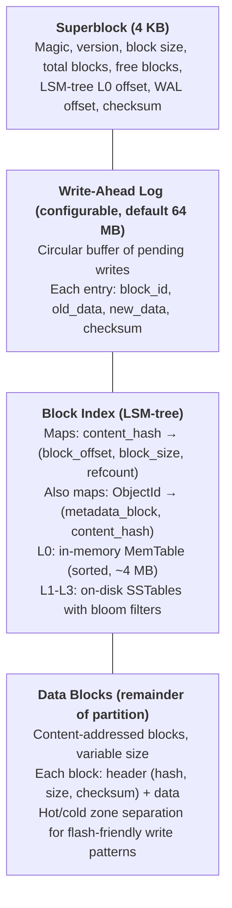
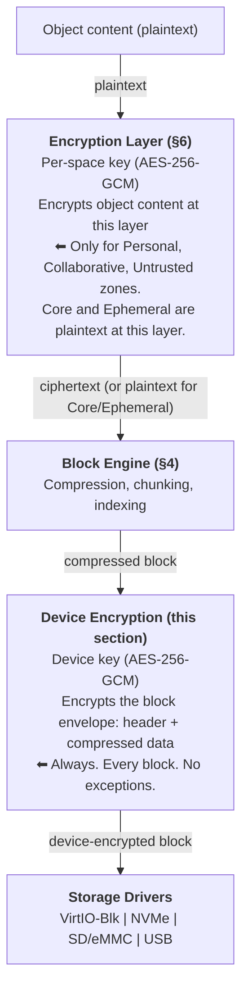

# AIOS Space Storage — Block Engine

Part of: [spaces.md](../spaces.md) — Space Storage System
**Related:** [data-structures.md](./data-structures.md) — Core Data Structures, [encryption.md](./encryption.md) — Per-Space Encryption, [versioning.md](./versioning.md) — Version Store

-----

## 4. Block Engine

### 4.1 On-Disk Layout

The Block Engine manages raw storage directly — no ext4, no ZFS, no intermediate filesystem. AIOS owns the partition.



**Why LSM-tree instead of B-tree?** Flash storage refers to NAND-based devices (SD cards, eMMC, SSDs, NVMe) with erase-before-write constraints. Traditional write patterns (random, in-place updates) cause high write amplification on flash. The Block Engine's index was originally designed as a B-tree. B-trees are excellent for read-heavy workloads with random access, but on flash storage, B-tree updates cause **random writes** — each index update modifies an arbitrary node in the tree, requiring a read-modify-write cycle on the flash translation layer. This causes write amplification (WAF 10-30x on SD cards) and accelerates flash wear.

An LSM-tree (Log-Structured Merge-tree) converts random writes into sequential writes:

```rust
/// LSM-tree block index: all writes go to an in-memory MemTable,
/// which is periodically flushed as an immutable SSTable to disk.
/// Sequential writes only — no in-place updates on flash.
pub struct LsmBlockIndex {
    /// Active MemTable (sorted in-memory tree, receives all writes)
    memtable: MemTable,
    /// Immutable MemTable being flushed to disk (if any)
    immutable_memtable: Option<MemTable>,
    /// On-disk levels of sorted SSTables
    levels: [Vec<SSTable>; LSM_MAX_LEVELS],
    /// Bloom filters per SSTable (avoid unnecessary disk reads).
    /// Standard probabilistic structure: 10 bits per key, ~1% false positive rate.
    /// Implementation: `bloom` crate (or equivalent).
    bloom_filters: HashMap<SsTableId, BloomFilter>,
    /// Write amplification tracker (§4.8)
    waf_tracker: WriteAmplificationTracker,
}

const LSM_MAX_LEVELS: usize = 4; // L0 (flushed MemTables, unsorted) + L1-L3 (sorted, compacted)
const MEMTABLE_SIZE: usize = 4 * MB; // Flush to disk when full

pub struct MemTable {
    /// Sorted key-value pairs (content_hash → BlockLocation)
    entries: BTreeMap<Hash, BlockLocation>,
    /// Current size in bytes
    size: usize,
}
```

> **Implementation note:** The Phase 4a implementation (`kernel/src/storage/lsm.rs`) uses a sorted `Vec<MemTableEntry>` with binary search instead of `BTreeMap`. This provides equivalent O(log n) lookup performance with better cache locality and predictable memory usage. Both approaches satisfy the design requirements. The `BlockId` type used throughout is equivalent to `ContentHash` — a SHA-256 content hash — consistent with the data-structures doc.

> **Future optimization (WiscKey KV-separation):** WiscKey (FAST '16) demonstrated that separating keys from values in LSM-trees reduces write amplification 2.5-111x on SSDs by avoiding value movement during compaction. AIOS could adopt this approach in Phase 14 by storing block content hashes (keys) in the LSM-tree while keeping block data (values) in the append-only data region — which is already AIOS's natural layout. The key insight is that AIOS's content-addressed design naturally separates keys (hashes) from values (data blocks), making this optimization straightforward to adopt.

```rust
pub struct SSTable {
    /// On-disk sorted table of key-value pairs
    id: SsTableId,
    /// Level in the LSM-tree (0-3)
    level: u8,
    /// Key range [min_key, max_key] for binary search across SSTables
    key_range: (Hash, Hash),
    /// Disk offset and size
    offset: u64,
    size: u64,
    /// Number of entries
    entry_count: u64,
}
```

**LSM-tree write path:**

```text
Index update (e.g., new block stored):
  1. Insert (content_hash, block_location) into MemTable (in-memory, O(log n))
  2. If MemTable size >= 4 MB:
     a. Freeze current MemTable → immutable_memtable
     b. Create new empty MemTable for incoming writes
     c. Background: flush immutable_memtable to disk as L0 SSTable
        → single sequential write (flash-friendly)
  3. If L0 has too many SSTables (> 4):
     a. Background: merge L0 SSTables into L1 (compaction)
     b. Compaction produces sorted, deduplicated SSTables
     c. Old L0 SSTables deleted after compaction completes
  4. Same compaction process for L1 → L2, L2 → L3 when threshold exceeded
```

**LSM-tree read path:**

```text
Index lookup (e.g., find block for content_hash):
  1. Check MemTable (in-memory, O(log n)) → found? return
  2. Check immutable_memtable (if exists) → found? return
  3. For each L0 SSTable (unsorted, may overlap):
     a. Check bloom filter → skip or binary search within SSTable
     b. Found? return
  4. For each level L1, L2, L3:
     a. Check bloom filter: is key possibly in this SSTable?
        → NO (~99% of non-matches): skip SSTable entirely
        → YES: binary search within SSTable
     b. Found? return
  5. Key not found (block doesn't exist)
```

**Read performance:** Bloom filters (10 bits per key, ~1% false positive rate) ensure that reads rarely touch disk unnecessarily. A typical lookup checks the MemTable (microseconds), then 1-2 bloom filters (microseconds), and at most one SSTable disk read. On average, LSM-tree reads are within 2x of B-tree reads — a small price for 10-30x write amplification reduction.

**Compaction scheduling:** Compaction runs at the Block Engine's lowest internal I/O priority (distinct from CPU scheduling classes — see scheduler.md §3.1) and is paused during active inference (when SD card bandwidth is needed for model loading). On battery-powered future devices, compaction can be deferred to charging periods.

**SSTable manifest for crash safety:** Production LSM-trees (LevelDB, RocksDB) use a manifest file to track which SSTables are live. AIOS maintains an `SsTableManifest` that records the current set of valid SSTables per level:

```rust
pub struct SsTableManifest {
    /// Current live SSTables per level
    levels: [Vec<SsTableId>; LSM_MAX_LEVELS],
    /// Manifest version (incremented on every compaction)
    version: u64,
    /// Written atomically to a dedicated manifest block on disk.
    /// On crash recovery, the manifest identifies which SSTables are
    /// live and which are orphaned (partially-written compaction output).
    /// Orphaned SSTables are deleted during recovery.
}
```

A crash during compaction (between writing new SSTables and updating the manifest) leaves orphaned SSTable files on disk. Recovery detects these by comparing on-disk SSTables against the manifest and deletes any not listed. The old SSTables (compaction inputs) remain valid until the manifest atomically switches to the new set.

**WAL captures index entries:** The WAL entry format includes both data block writes and their corresponding LSM-tree index entries. On crash recovery, the WAL replay re-inserts any index entries that were in the MemTable at crash time but not yet flushed to an SSTable:

```text
WAL entry format (extended for LSM-tree):
  block_id | new_data | content_hash | block_location | checksum
                        ^^^^^^^^^^^^^^^^^^^^^^^^^^^^^^
                        These fields reconstruct the MemTable entry
                        during crash recovery.
```

**Tombstone handling for block deletion:** When a block is deleted (refcount reaches 0), the LSM-tree writes a tombstone marker instead of immediately removing the entry:

```rust
pub enum IndexEntry {
    /// Live block: content_hash maps to a block location
    Live(BlockLocation),
    /// Tombstone: block was deleted. Shadows any Live entry in lower levels.
    /// Removed during compaction when no lower level contains the key.
    Tombstone,
}
```

Without tombstones, a deleted key in L1 would still be found in L2 or L3 during reads, returning a block that should have been garbage collected. Tombstones are written to the MemTable and flushed to SSTables like normal entries. Compaction removes tombstones when no lower level contains the corresponding key.

**Write stall for compaction backlog:** If compaction falls behind (e.g., paused during inference, or sustained burst of writes), L0 accumulates unbounded SSTables. AIOS implements write stalling to prevent this:

```rust
impl LsmBlockIndex {
    const L0_SLOWDOWN_THRESHOLD: usize = 8;  // 8 SSTables in L0: slow writes
    const L0_STOP_THRESHOLD: usize = 12;     // 12 SSTables in L0: stall writes

    fn check_write_stall(&self) -> WriteStallAction {
        let l0_count = self.levels[0].len();
        if l0_count >= Self::L0_STOP_THRESHOLD {
            WriteStallAction::Stall  // block writes until compaction catches up
        } else if l0_count >= Self::L0_SLOWDOWN_THRESHOLD {
            WriteStallAction::Slowdown  // rate-limit writes to compaction throughput
        } else {
            WriteStallAction::None
        }
    }
}
```

```rust
pub enum WriteStallAction {
    /// Proceed normally — compaction is keeping up.
    None,
    /// Rate-limit writes to match compaction throughput.
    Slowdown,
    /// Block all writes until compaction reduces L0 below threshold.
    Stall,
}

pub enum AllocError {
    /// Target zone and all overflow zones are full.
    ZoneFull,
    /// Entire device is full (even after zone compaction).
    DeviceFull,
    /// Requested allocation exceeds maximum block size.
    InvalidSize,
}

pub enum StorageError {
    /// Block not found at expected location.
    BlockNotFound,
    /// CRC-32C checksum failed on read.
    ChecksumFailed,
    /// AES-256-GCM authentication tag verification failed.
    DecryptionFailed,
    /// Block Engine I/O error (driver-level).
    IoError(String),
    /// Space or category quota exceeded.
    QuotaExceeded,
}

/// Version Store error enum. Used by rollback, merge, and version queries.
pub enum VersionError {
    /// Requested version hash not found in the DAG.
    VersionNotFound,
    /// Target version belongs to a different object than expected.
    ObjectMismatch { expected: ObjectId, found: ObjectId },
    /// Merge conflict cannot be auto-resolved.
    MergeConflict,
    /// Underlying storage failure.
    IoError(StorageError),
}

/// Integrity verification error. Used by GC, compaction, and audit scans.
pub enum IntegrityError {
    /// Block content does not match its content-addressed hash.
    HashMismatch { block: BlockId, expected: Hash, actual: Hash },
    /// Merkle DAG parent reference points to a missing version node.
    BrokenChain { object: ObjectId, missing_hash: Hash },
    /// Reference count is negative or exceeds plausible bounds.
    InvalidRefCount { block: BlockId, count: i64 },
}

/// Space-level error enum. Used by Object Store, Version Store, POSIX bridge,
/// and device key manager. Maps to POSIX errno via §9.5.
pub enum Error {
    ObjectNotFound,
    SpaceNotFound,
    CapabilityDenied,
    ReadOnlySpace,
    SpaceFull,
    DeviceFull,
    ObjectLocked,
    InvalidPath,
    NameExists,
    TooManyOpenFiles,
    VersionConflict,
    EncryptionKeyUnavailable,
    UnknownKeyEpoch(u64),
    IoError(StorageError),
    VersionError(VersionError),
    IntegrityError(IntegrityError),
}
```

When stalled, the Block Engine queues incoming writes in the WAL (which is sequential and low-WAF) and returns to the caller once the WAL entry is fsynced. The writes are applied to the MemTable when compaction reduces L0 below the threshold. Agents see slightly increased write latency during stalls but never lose data.

### 4.1.1 Related Systems: LSM-Tree Storage Engines

AIOS's Block Engine shares architectural DNA with several production and research storage systems:

**Fuchsia Fxfs** — Google's filesystem for the Fuchsia OS uses LSM-trees for metadata indexing, copy-on-write semantics with immutable layer files, per-volume stream cipher encryption, and a logical journal for crash consistency. The architectural parallels with AIOS's Block Engine are striking: both chose LSM-trees over B-trees for flash-friendly sequential writes, both use copy-on-write to avoid in-place mutation, and both integrate encryption at the storage layer rather than as an afterthought. Fxfs validates AIOS's core design choices in a production OS context. Key differences: Fxfs targets a full POSIX filesystem with directories and hard links, while AIOS's Block Engine is a content-addressed block store with the POSIX layer as a translation view (§9). Fxfs uses stream ciphers (XChaCha20) for performance; AIOS uses AES-256-GCM for authenticated encryption with hardware acceleration on ARM (§4.10).

**WiscKey (FAST '16)** — Separates keys from values in the LSM-tree, storing only keys in the sorted structure and values in a separate append-only value log. This reduces write amplification by 2.5–111x compared to LevelDB because compaction only moves small keys, not large values. AIOS's content-addressed design naturally achieves a similar separation: the LSM-tree index maps `ContentHash → BlockLocation` (small key-value pairs), while actual data blocks live in the data region. This means AIOS's compaction overhead is inherently low — it only reorganizes index entries, not data blocks.

**RocksDB** — Facebook's LSM-tree engine (used in CockroachDB, TiKV, and many others) provides the reference implementation for write stalling, compaction scheduling, and bloom filter optimization that AIOS's design draws from. AIOS's L0 slowdown/stop thresholds (§4.1) follow the same pattern as RocksDB's `level0_slowdown_writes_trigger` and `level0_stop_writes_trigger`.

**RedoxFS** — Redox OS's filesystem is written in Rust, uses copy-on-write with a ZFS-inspired design, and includes native AES encryption. Like AIOS, it targets a Rust-native OS and prioritizes data integrity. RedoxFS validates that a Rust `no_std` storage engine with encryption is practical for OS-level storage.

### 4.2 Write Path (Flash-Aware)

The write path is designed with **F2FS-style flash awareness** — writes are append-preferred and zone-separated to minimize flash wear and write amplification. Traditional filesystems scatter writes randomly across the device, causing the flash translation layer (FTL) to perform expensive read-modify-erase cycles. AIOS structures writes to work *with* the flash, not against it.

```text
Agent writes object:
  1. Content hashed (SHA-256) → content_hash
  2. Check block index (LSM-tree): does content_hash already exist?
     YES → increment refcount, skip write (deduplication)
     NO  → continue to step 3
  3. Classify write temperature (hot/warm/cold) based on content type and access prediction
  4. WAL entry written: (new_block_id, content, metadata)
     → WAL is append-only circular buffer (sequential writes only)
  5. WAL entry fsynced to disk (crash-safe point)
  6. Data block written to temperature-appropriate zone:
     → Hot zone: recently created objects, frequently modified metadata
     → Warm zone: user data, recent version history, KV cache blocks
     → Cold zone: old version history, audit archives, model files
     → Append-preferred: new blocks written to the end of the zone's free region
  7. Block index updated via LSM-tree MemTable insertion (in-memory, no disk I/O)
  8. Object metadata updated: ObjectId → content_hash
  9. Version store appended: (ObjectId, content_hash, timestamp, agent_id)
 10. WAL entry marked committed
```

**Hot/cold zone separation:**

Flash storage wears unevenly when hot data (frequently modified) and cold data (rarely modified) share the same erase blocks. The FTL must copy cold data out of the way every time it erases a block to make room for hot writes. F2FS-style zone separation places hot and cold data on different regions of the device, reducing this unnecessary copying:

```rust
/// Zone allocation for flash-aware write placement
pub struct FlashZoneAllocator {
    /// Hot zone: metadata, recently written objects, active space indexes
    /// Expect high rewrite rate — placed on fresh erase blocks
    hot_zone: Zone,
    /// Warm zone: user data, version history < 30 days, KV cache blocks
    /// Moderate rewrite rate
    warm_zone: Zone,
    /// Cold zone: old versions, audit archives, model files, backups
    /// Rarely rewritten — placed on worn erase blocks (flash wear leveling)
    cold_zone: Zone,
    /// WAL zone: dedicated sequential write region
    wal_zone: Zone,
    /// Number of times a block was placed in an overflow zone
    /// (allocated to a different tier than requested because the target zone was full)
    overflow_count: u64,
}

pub struct Zone {
    /// Start and end offsets on the block device
    start: u64,
    end: u64,
    /// Next write position (append pointer)
    write_head: u64,
    /// Free space in this zone
    free_bytes: u64,
    /// Write count for WAF tracking
    bytes_written: u64,
}

impl Zone {
    /// Compact live blocks within this zone: walk from start to write_head,
    /// copy live blocks to the front, update write_head. Dead blocks (unreferenced
    /// by the LSM-tree index) are reclaimed. Called when zone free space is low.
    fn compact_live_blocks(&mut self) -> usize { /* implementation omitted */ 0 }
}

impl FlashZoneAllocator {
    /// Classify a write into a temperature zone
    fn zone_for_tier(&mut self, tier: StorageTier) -> &mut Zone {
        match tier {
            StorageTier::Hot => &mut self.hot_zone,
            StorageTier::Warm => &mut self.warm_zone,
            StorageTier::Cold => &mut self.cold_zone,
        }
    }

    /// Allocate space for a new block — always append-preferred.
    /// Returns the write offset within the appropriate zone.
    /// If the target zone is full, attempts zone overflow (steal from
    /// a colder zone with available space).
    /// Thread safety: the Block Engine serializes all writes through the WAL
    /// append lock, so allocate() is always called from a single writer thread.
    fn allocate(&mut self, size: usize, tier: StorageTier) -> Result<u64, AllocError> {
        // Try the target zone first
        let zone = self.zone_for_tier(tier);
        if zone.free_bytes >= size as u64 {
            let offset = zone.write_head;
            zone.write_head += size as u64;
            zone.free_bytes -= size as u64;
            zone.bytes_written += size as u64;
            return Ok(offset);
        }

        // Target zone full — attempt overflow allocation.
        // Hot can overflow into Warm; Warm can overflow into Cold.
        // Cold zone full is a true disk-full condition.
        let overflow_tier = match tier {
            StorageTier::Hot => Some(StorageTier::Warm),
            StorageTier::Warm => Some(StorageTier::Cold),
            StorageTier::Cold => None,
        };

        if let Some(fallback) = overflow_tier {
            let zone = self.zone_for_tier(fallback);
            if zone.free_bytes >= size as u64 {
                let offset = zone.write_head;
                zone.write_head += size as u64;
                zone.free_bytes -= size as u64;
                zone.bytes_written += size as u64;
                // Track overflow writes for zone rebalancing
                self.overflow_count += 1;
                return Ok(offset);
            }
        }

        // All zones exhausted — trigger zone-aware GC before failing
        Err(AllocError::ZoneFull)
    }

    /// Rebalance zones: compact live blocks within each zone to reclaim
    /// fragmented space from deleted blocks. Run by the GC (§4.5).
    fn compact_zone(&mut self, tier: StorageTier) -> usize {
        let zone = self.zone_for_tier(tier);
        // Walk the zone from start to write_head.
        // Live blocks (refcount > 0) are compacted toward the start.
        // Dead blocks (refcount == 0) are reclaimed.
        // Returns bytes reclaimed.
        // After compaction, write_head is reset to end of live data.
        zone.compact_live_blocks()
    }
}
```

**Why append-preferred writes matter for SD cards:**

```text
Random write (B-tree index update, traditional filesystem):
  1. FTL reads entire erase block (128-512 KB) into buffer
  2. FTL modifies the target 4 KB page in buffer
  3. FTL erases the block (~2 ms, wears one P/E cycle)
  4. FTL writes back entire buffer (~1 ms)
  Total: ~3 ms, 128-512 KB written for a 4 KB change (WAF: 32-128x)

Append-preferred write (LSM-tree + zone allocation):
  1. New data appended to zone's write head (sequential)
  2. FTL writes directly to fresh page in current erase block
  3. No erase needed until block is full
  Total: ~0.1 ms, 4 KB written for a 4 KB change (WAF: ~1x)

On a consumer SD card (TLC, ~1000 P/E cycles):
  Random writes: card degradation in weeks of heavy use
  Append-preferred: card lasts years under same workload
```

### 4.3 Read Path

```text
Agent reads object:
  1. Object metadata lookup: ObjectId → content_hash
  2. Block index lookup: content_hash → block location
  3. Read encrypted block from disk
  4. Verify CRC-32C checksum against the stored checksum in the block header.
     Return `StorageError::ChecksumFailed` if verification fails.
  5. Decrypt block envelope with device key (§4.10) — always, every block
  6. If space-encrypted (Personal, Collaborative, Untrusted): decrypt content with space key
  7. Return content to agent
```

#### 4.3.1 AIRS Prefetch Path

AIRS resource orchestration can direct Space Storage to prefetch objects into the page cache before an agent requests them. Prefetch uses the **same read path** as normal agent reads — there is no shortcut that bypasses decryption, capability checks, or checksum verification.

```text
AIRS prefetch directive:
  1. AIRS sends ResourcePrefetch { objects, reason, triggered_by } to kernel
  2. Kernel validates: AIRS holds ReadSpace capability for the target space
  3. Kernel forwards prefetch request to Space Storage
  4. Space Storage executes the NORMAL read path for each object:
     a. Object metadata lookup: ObjectId → content_hash
     b. Block index lookup: content_hash → block location
     c. Read encrypted block from disk
     d. Decrypt block envelope with device key (§4.10)
     e. Verify checksum (CRC-32C)
     f. If space-encrypted: decrypt content with space key (Space Storage holds key)
     g. Decrypted content sits in page cache (user pool)
  5. Error handling: if checksum verification fails at step (e):
     - The corrupted block is NOT placed in the page cache
     - An integrity error is logged to system/audit/ (CRC mismatch event)
     - The prefetch for this specific object is silently dropped
     - No error is propagated to AIRS (prefetch is advisory)
     - If the agent later reads this object, the normal read path will
       encounter the same corruption and return Err(IntegrityError) to the agent
  6. No content is returned to AIRS — prefetch is fire-and-forget
  7. When agent later reads the object, step 4 hits page cache → fast
  8. Provenance chain records: ResourcePrefetch event (logged by kernel)
```

**Why AIRS never touches keys:** AIRS does not hold space decryption keys. It does not need them. AIRS sends a directive to the kernel, which forwards it to Space Storage. Space Storage holds the space keys (released by the kernel after authentication + capability verification) and performs the decryption. The decrypted content enters the page cache, where it is accessible to any agent that holds the appropriate `ReadSpace` capability. AIRS's role is purely advisory — "this object will likely be needed soon" — not operational.

**Why no shortcut:** A prefetch shortcut that bypasses the normal read path would be a security regression:
- Skipping checksum verification would allow corrupted blocks into the page cache
- Skipping decryption would place encrypted blocks in the cache, useless to agents
- Skipping capability validation would allow AIRS to prefetch objects from spaces it shouldn't access
- Skipping provenance logging would hide AIRS's prefetch activity from the audit trail

The normal read path is the only read path. Prefetch is just "read it now instead of later."

### 4.4 Crash Recovery

On boot, the Block Engine replays the WAL:

```text
1. Read superblock, verify integrity
2. Scan WAL from oldest uncommitted entry
3. For each uncommitted entry:
   - If data block was written but index not updated → update index
   - If data block was NOT written → discard entry
4. WAL is now clean
5. Verify block index consistency (background, non-blocking)
```

The WAL guarantees that the storage is always in a consistent state. A crash during any step of the write path is recoverable.

### 4.5 Garbage Collection

Content-addressed blocks are reference-counted. When an object is modified (content_hash changes) or deleted, the old block's refcount decreases. When refcount reaches zero, the block is eligible for GC:

```rust
pub struct GarbageCollector {
    /// Blocks with refcount 0, organized by zone for targeted reclamation
    pending_by_zone: [Vec<BlockId>; 3],  // [hot, warm, cold]
    /// Grace period before reclaiming (allows version history to reference old blocks)
    grace_period: Duration,
    /// Run GC when free space drops below threshold
    trigger_threshold: f64,         // fraction of total space
    /// Per-zone trigger: run zone-specific GC when a zone's free space is low
    zone_trigger_threshold: f64,    // default: 0.10 (10% free in any zone)
}
```

**Zone-aware GC:** When a specific zone runs low on space (e.g., the hot zone fills up from frequent metadata writes), GC targets that zone specifically — it reclaims dead blocks in the hot zone and optionally compacts live blocks to defragment the zone's append region. This is more efficient than global GC because:
- Only the affected zone is scanned (less I/O)
- Zone compaction restores the append-preferred write pattern for that zone
- Other zones are undisturbed (no unnecessary I/O on cold data)

GC runs in the background and never blocks reads or writes. When the zone allocator returns `AllocError::ZoneFull` (§4.2), the Block Engine triggers zone-specific GC before failing the write. If zone compaction cannot free enough space (all blocks in the zone are live), the write fails with `StorageError::QuotaExceeded` and the system raises a `StorageEvent::PressureChanged` (§10.5) to trigger emergency reclamation. Interactive writes (user-initiated actions) always take priority over background operations, so at least one write path remains available. The grace period (default: 24 hours) prevents GC from reclaiming blocks that old versions or open file descriptors (§9.4) may still reference. Under Critical/Emergency storage pressure (§10.5), the grace period is shortened to 1 hour/0 respectively — open file descriptors pinning old versions receive `EIO` on subsequent reads if their underlying blocks are reclaimed.

### 4.6 Block-Level Compression

AIOS compresses data blocks on disk to extend storage lifetime on capacity-constrained devices (SD cards, small SSDs). Compression operates at the block level — transparent to the Object Store and everything above it.

```rust
pub enum CompressionStrategy {
    /// No compression (already-compressed content: images, video, encrypted data)
    None,
    /// LZ4 — fast compression/decompression, moderate ratio (~2:1)
    /// Used for recently written and frequently accessed blocks
    Lz4,
    /// Zstd — slower compression, better ratio (~3-4:1)
    /// Used for cold data (old versions, inactive spaces, audit archives)
    Zstd { level: u8 },                // 1-19, default 3 for warm, 9 for cold
}

pub struct BlockHeader {
    content_hash: Hash,
    uncompressed_size: u32,
    compressed_size: u32,
    compression: CompressionStrategy,
    checksum: u32,                      // CRC-32C of compressed data (integrity for non-encrypted blocks)
    /// Per-space AES-256-GCM nonce (96 bits). Unique per block write under the same key.
    /// Stored alongside ciphertext — nonces are not secret.
    /// Only present for blocks in encrypted spaces (Personal, Collaborative, Untrusted).
    space_nonce: Option<[u8; 12]>,
    /// Per-space AES-256-GCM authentication tag (128 bits). Verifies both ciphertext
    /// integrity and authenticity. Replaces CRC-32C for encrypted blocks —
    /// CRC-32C is retained as a secondary check for storage-level corruption.
    space_auth_tag: Option<[u8; 16]>,
    /// Device key epoch under which this block was encrypted (§4.10).
    /// Used during reads to select the correct device key after key rotation.
    device_epoch: u64,
    /// Device-level encryption nonce (96 bits). Always present — every block
    /// on disk is encrypted with the device key (§4.10). This is the outer
    /// encryption layer; space encryption (above) is the inner layer.
    device_nonce: [u8; 12],
    /// Device-level authentication tag (128 bits). Authenticates the block
    /// envelope (header + data) under the device key.
    device_auth_tag: [u8; 16],
}

/// Content-addressed block storage engine. Manages compression, encryption,
/// deduplication, and tiered storage across backing devices.
pub struct BlockEngine { /* internal state: WAL, LSM-tree, device handles, compression config */ }

impl BlockEngine {
    fn write_block(&self, data: &[u8], tier: StorageTier) -> Result<BlockId, StorageError> {
        let strategy = self.select_compression(data, tier);
        let compressed = match strategy {
            CompressionStrategy::None => data.to_vec(),
            CompressionStrategy::Lz4 => lz4::compress(data),
            CompressionStrategy::Zstd { level } => zstd::compress(data, level),
        };

        // Only use compression if it actually saves space
        let (stored, used_strategy) = if compressed.len() < data.len() {
            (compressed, strategy)
        } else {
            (data.to_vec(), CompressionStrategy::None)
        };

        self.write_raw_block(stored, used_strategy)
    }

    /// Adaptive compression selection: detects already-compressed,
    /// encrypted, or random data and skips compression to avoid
    /// wasting CPU. Uses byte entropy estimation on a 4 KB sample.
    fn select_compression(&self, data: &[u8], tier: StorageTier) -> CompressionStrategy {
        // Fast entropy check: sample first 4 KB and estimate Shannon entropy.
        // High entropy (> 7.5 bits/byte) indicates encrypted, compressed, or
        // random data — compression will not help.
        let sample = &data[..data.len().min(4096)];
        let entropy = self.estimate_entropy(sample);

        if entropy > 7.5 {
            // Already compressed, encrypted, or random — skip entirely
            return CompressionStrategy::None;
        }

        if entropy > 6.5 {
            // Moderately complex data — only use fast LZ4 (low CPU cost)
            // Zstd won't achieve meaningfully better ratio on high-entropy data
            return CompressionStrategy::Lz4;
        }

        // Low-entropy data: full compression benefit available
        match tier {
            StorageTier::Hot => CompressionStrategy::Lz4,
            StorageTier::Warm => CompressionStrategy::Zstd { level: 3 },
            StorageTier::Cold => CompressionStrategy::Zstd { level: 9 },
        }
    }

    /// Estimate Shannon entropy of a byte sample.
    /// Returns bits per byte (0.0 = all identical, 8.0 = perfectly random).
    fn estimate_entropy(&self, sample: &[u8]) -> f32 {
        let mut counts = [0u32; 256];
        for &byte in sample {
            counts[byte as usize] += 1;
        }
        let len = sample.len() as f32;
        let mut entropy: f32 = 0.0;
        for &count in &counts {
            if count > 0 {
                let p = count as f32 / len;
                entropy -= p * p.log2();
            }
        }
        entropy
    }
}
```

**Why block-level:** Content-addressed blocks are immutable after write — ideal for compression. The decompression cost is paid once on read and amortized across multiple accesses by the page cache. On a laptop SSD, LZ4 decompresses at ~4 GB/s (faster than most SATA SSD read speeds), so compression is effectively free on the read path.

**Adaptive compression — why entropy estimation matters:**

Encrypted blocks and already-compressed media (JPEG, MP4, FLAC) have high byte entropy (> 7.5 bits/byte). Attempting to compress them wastes CPU and may actually *increase* the stored size (compression overhead > savings). The entropy check takes ~2 microseconds on a 4 KB sample — negligible compared to the 50-500 microsecond cost of running LZ4/Zstd on incompressible data that produces no savings.

```text
Content Type         Entropy (bits/byte)   Compression Action        Savings
────────────         ───────────────────   ──────────────────        ───────
Text / JSON          3.0 - 5.0             Zstd (tier-appropriate)   60-80%
Code / markup        4.0 - 5.5             Zstd (tier-appropriate)   50-70%
Structured data      4.5 - 6.0             LZ4 or Zstd              40-60%
Already-LZ4'd data   6.5 - 7.5             LZ4 only (fast check)    5-15%
Encrypted data       7.8 - 8.0             None (skip)              0%
JPEG / MP4           7.5 - 7.9             None (skip)              0%
Random bytes         ~8.0                  None (skip)              0%
```

**Entropy sampling for large files:** The entropy check samples the first 4 KB, which is representative for most objects (documents, config files, code). For objects > 1 MB where the first 4 KB may be a low-entropy header with high-entropy payload, the Block Engine additionally samples a 4 KB region at the midpoint. If the two samples disagree by > 2 bits/byte, the higher entropy wins (conservative — avoids wasting CPU on incompressible data). For objects < 100 bytes, compression is skipped entirely (overhead exceeds savings). Entropy estimation is O(sample_size) = O(4 KB) = negligible compared to the 50-500 μs cost of running LZ4/Zstd on data that produces no savings.

The `CompressionStrategy::None` fast path means that spaces storing encrypted data (Personal zone) or media-heavy content (photos, video) pay zero compression CPU. Only spaces with compressible content (documents, code, conversations, config) invest CPU in compression.

**Security: compress before encrypt.** The Block Engine compresses data before either encryption layer acts on it: per-space encryption (§6) encrypts object content above the Block Engine, and device encryption (§4.10) encrypts the block envelope below it. Compression operates on plaintext content (for non-space-encrypted zones) or per-space ciphertext (which is high-entropy and skipped by the adaptive entropy check). This ordering is critical — compressing ciphertext is useless (encrypted data is indistinguishable from random), and encrypting compressed data avoids CRIME/BREACH-style attacks where compression ratio changes leak information about plaintext. Since AIOS uses content-addressed blocks (each block has a unique content_hash), an attacker cannot perform the chosen-plaintext injection required for CRIME-style attacks. The compress-then-encrypt ordering is safe.

### 4.7 Tiered Storage

Blocks are classified into temperature tiers based on access patterns. The tier determines compression strategy, and on systems with multiple storage devices, placement:

```rust
pub enum StorageTier {
    /// Recently written or frequently accessed — LZ4 or uncompressed
    Hot,
    /// Older versions, inactive spaces — zstd level 3
    Warm,
    /// Audit archives >30 days, old version history, cold spaces — zstd level 9
    Cold,
}

pub struct TierPolicy {
    /// Objects accessed in the last N hours are Hot
    hot_window: Duration,               // default: 24 hours
    /// Objects accessed in the last N days are Warm
    warm_window: Duration,              // default: 30 days
    /// Everything else is Cold
    /// Minimum time before an object can be demoted from Hot → Warm
    demotion_grace: Duration,           // default: 6 hours
}

pub struct TierManager {
    policy: TierPolicy,
    /// Background thread that recompresses blocks when demoted
    recompressor: RecompressorThread,
    /// Statistics for monitoring
    stats: TierStats,
}

pub struct TierStats {
    hot_blocks: u64,
    hot_bytes: u64,
    warm_blocks: u64,
    warm_bytes: u64,
    cold_blocks: u64,
    cold_bytes: u64,
    bytes_saved_by_compression: u64,
}
```

**Tier transitions:** A background thread scans block access timestamps. When a Hot block hasn't been accessed within `hot_window` (24 hours), it is recompressed with zstd and demoted to Warm. When a Warm block hasn't been accessed within `warm_window` (30 days), it is recompressed at a higher zstd level and demoted to Cold. Promotion (Cold → Hot) happens automatically on access — the block is decompressed and rewritten with LZ4.

**Recompression is lazy.** The recompressor runs at lowest I/O priority and yields to any foreground read or write. On a Pi with an SD card, recompression is throttled to avoid wearing the card. Tier transitions are batched — the recompressor processes blocks in groups during idle periods.

> **Future optimization (ML-based tiering):** Recent research in AI-driven storage tiering uses streaming machine learning models to predict access patterns and automatically classify blocks as hot/warm/cold. AIOS's AIRS subsystem could drive tiering decisions using learned access pattern models, replacing static heuristics with adaptive prediction (Phase 14a+).

#### 4.7.1 AIRS-Directed Compression Scheduling

Compression scheduling can be initiated by two sources:

1. **Automatic tier demotion** (TierManager, independent of AIRS) — the normal background recompressor described above. Runs on access-time heuristics, no AI involvement. Always operational.

2. **AIRS resource directives** (during storage pressure or semantic prioritization) — AIRS can request that specific blocks be recompressed at a different level, or that compression be prioritized for blocks that AIRS predicts won't be accessed soon.

```text
AIRS compression directive:
  1. AIRS sends ResourceCompress { space, blocks, algorithm, reason }
     to kernel via resource directive channel
  2. Kernel validates:
     a. AIRS holds ReadSpace capability for the target space
     b. Compression CPU quota not exceeded (blast radius for AIRS)
     c. Directive rate within AirsDirectiveMonitor baseline ([model.md §2.3.1](../security/model.md))
  3. Kernel forwards directive to Space Storage
  4. Space Storage executes compression through the NORMAL Block Engine path:
     a. Read block from disk
     b. Verify checksum (CRC-32C) — reject if corrupted
     c. Decompress existing content
     d. Recompress with requested algorithm
     e. Verify round-trip: decompress(recompressed) == original
     f. Write new block (new checksum computed)
     g. Update block index atomically (WAL-protected)
  5. Provenance chain records: ResourceCompress event
```

**Why AIRS cannot corrupt data:** Compression operates through the Block Engine, which verifies checksums on read and computes new checksums on write. The round-trip verification (step 4e) catches any compression error before the block is committed. If verification fails, the original block is retained unchanged and a storage integrity event is logged. AIRS never touches raw block data — it only specifies *which* blocks to compress and *with what algorithm*. The Block Engine does the actual I/O.

**Why no shortcut:** As with prefetch (§4.3.1), there is no bypass path. AIRS compression directives are advisory — "compress this block at zstd level 9" — not operational. Space Storage does the work through its existing, checksum-verified, WAL-protected write path.

**Multi-device tiering (future):** On systems with both NVMe and SD storage, Hot data lives on NVMe and Cold data on SD. The tier manager handles migration transparently. This is a Phase 14 optimization — single-device tiering via compression is the Phase 4 implementation.

### 4.8 Write Amplification Tracking

Write amplification factor (WAF) is the ratio of data written to the flash device versus data written by the application. A WAF of 10x means the device writes 10 bytes of flash for every byte the application intended to write — the other 9 bytes are overhead from the FTL's garbage collection, index updates, and journaling. On consumer SD cards with ~1000 P/E cycles per cell, high WAF directly shortens device lifetime.

AIOS tracks WAF continuously to validate that the flash-aware write strategies (LSM-tree, zone separation, append-preferred allocation) are actually working:

```rust
pub struct WriteAmplificationTracker {
    /// Bytes logically written by the application (object data + metadata)
    app_bytes_written: AtomicU64,
    /// Bytes physically written to the device (from device SMART data or
    /// kernel block layer accounting). Includes FTL overhead.
    device_bytes_written: AtomicU64,
    /// WAF history (rolling window, last 24 hours, hourly samples)
    history: [WafSample; 24],
    /// Alert threshold: warn if WAF exceeds this value
    alert_threshold: f32,           // default: 5.0 (WAF > 5x triggers alert)
}

pub struct WafSample {
    /// Timestamp of this sample
    timestamp: Timestamp,
    /// Application bytes in this interval
    app_bytes: u64,
    /// Device bytes in this interval
    device_bytes: u64,
}

impl WriteAmplificationTracker {
    /// Current instantaneous WAF
    pub fn current_waf(&self) -> f32 {
        let app = self.app_bytes_written.load(Ordering::Relaxed) as f32;
        let device = self.device_bytes_written.load(Ordering::Relaxed) as f32;
        if app == 0.0 { return 1.0; }
        device / app
    }

    /// Record an application-level write
    pub fn record_app_write(&self, bytes: u64) {
        self.app_bytes_written.fetch_add(bytes, Ordering::Relaxed);
    }

    /// Record a device-level write (from block layer or SMART)
    pub fn record_device_write(&self, bytes: u64) {
        self.device_bytes_written.fetch_add(bytes, Ordering::Relaxed);
    }

    /// Check if WAF exceeds threshold and emit warning
    pub fn check_alert(&self) -> Option<WafAlert> {
        let waf = self.current_waf();
        if waf > self.alert_threshold {
            Some(WafAlert {
                current_waf: waf,
                threshold: self.alert_threshold,
                recommendation: if waf > 15.0 {
                    "WAF critically high. Check for non-AIOS writes or compaction storms."
                } else {
                    "WAF elevated. Consider reducing compaction frequency."
                },
                timestamp: Timestamp::now(),
            })
        } else {
            None
        }
    }
}
```

**Target WAF by device class:**

```text
Device              Target WAF   Max Acceptable   Notes
──────              ──────────   ──────────────   ─────
Laptop SSD (NVMe)   1.5 - 3x     5x              NVMe has built-in wear leveling
Laptop SSD (SATA)   2 - 4x       8x              SATA FTL less efficient
SD card (consumer)   1.5 - 3x     5x              Critical — low P/E endurance
SD card (industrial) 2 - 5x      10x              Higher endurance tolerates more
eMMC                 2 - 4x       8x              Similar to SATA SSD
```

The LSM-tree block index (§4.1), append-preferred write allocation (§4.2), and hot/cold zone separation together target a WAF of 1.5-3x — a 5-20x improvement over the B-tree random-write approach. The WAF tracker validates this in production and alerts if unexpected write patterns (e.g., a compaction storm, or a misbehaving agent writing excessive small updates) push WAF above the threshold.

```rust
pub struct WafAlert {
    current_waf: f32,
    threshold: f32,
    recommendation: &'static str,
    timestamp: Timestamp,
}
```

**Device write accounting:** Device-level bytes written are measured via kernel block layer hooks — the Block Engine instruments all I/O requests to the storage driver, counting bytes submitted to the device. This captures both application writes and internal overhead (WAL, compaction, index flushes). On devices with SMART support (NVMe, enterprise SSDs), the Block Engine cross-references its count against the device's internal write counter for validation.

**Inspector integration:** WAF data is exposed in the Storage Dashboard ([Inspector](../project/architecture.md), §5.6) alongside per-zone write statistics, enabling users and developers to understand flash wear patterns.

### 4.9 Sub-Block Deduplication

> **Implementation status:** Phase 14e. This section describes the design for sub-block deduplication. Phase 4 uses whole-block SHA-256 deduplication only. Near-duplicate content (e.g., edited documents) is stored in full until Phase 14e adds Rabin rolling hash chunk-level savings.

Standard content-addressed deduplication (§4.2) identifies identical blocks via SHA-256 hash comparison. This works perfectly when two objects contain the same content — the block is stored once and referenced by both objects. But it fails for **near-duplicate content**: if a user edits one paragraph in a 100 KB document, the entire block is stored again because the SHA-256 hash changed, even though 99% of the content is identical.

Sub-block deduplication uses a **rolling hash (Rabin fingerprint)** to identify shared sub-block regions between near-duplicate objects, reducing storage for common edit patterns by 60-80%:

```rust
/// Sub-block deduplication using content-defined chunking.
/// Splits objects into variable-size chunks at content-defined boundaries,
/// then deduplicates individual chunks via SHA-256.
pub struct SubBlockDedup {
    /// Rolling hash window size (bytes)
    window_size: usize,             // default: 48 bytes
    /// Target chunk size (bytes) — average, actual varies 50-200% of target
    target_chunk_size: usize,       // default: 4 KB
    /// Minimum chunk size (never split below this)
    min_chunk_size: usize,          // default: 2 KB
    /// Maximum chunk size (force split above this)
    max_chunk_size: usize,          // default: 16 KB
    /// Bitmask for Rabin fingerprint boundary detection
    /// When (fingerprint & mask) == 0, this is a chunk boundary
    boundary_mask: u64,             // tuned for target_chunk_size
}

pub struct Chunk {
    /// SHA-256 of chunk content
    hash: Hash,
    /// Offset within the original object
    offset: u64,
    /// Size of this chunk
    size: u32,
}

impl SubBlockDedup {
    /// Split an object into content-defined chunks using Rabin rolling hash.
    /// Chunk boundaries are determined by content, not position — so if content
    /// is inserted in the middle, only the surrounding chunks change. Chunks
    /// before and after the edit remain identical and deduplicate.
    pub fn chunk(&self, data: &[u8]) -> Vec<Chunk> {
        let mut chunks = Vec::new();
        let mut chunk_start = 0;
        let mut hasher = RabinHasher::new(self.window_size);  // Rabin fingerprint rolling hash (custom AIOS impl)

        // Bytes 0..min_chunk_size are included in the first chunk but not checked
        // for boundaries (by design — prevents tiny chunks). The rolling hash window
        // fills during bytes min_chunk_size..min_chunk_size+window_size.
        for i in self.min_chunk_size..data.len() {
            hasher.slide(data[i]);

            let chunk_len = i - chunk_start;
            let at_boundary = (hasher.fingerprint() & self.boundary_mask) == 0
                && chunk_len >= self.min_chunk_size;
            let at_max = chunk_len >= self.max_chunk_size;

            if at_boundary || at_max {
                let chunk_data = &data[chunk_start..=i];
                chunks.push(Chunk {
                    hash: sha256(chunk_data),
                    offset: chunk_start as u64,
                    size: chunk_data.len() as u32,
                });
                chunk_start = i + 1;
                hasher.reset();
            }
        }

        // Final chunk
        if chunk_start < data.len() {
            let chunk_data = &data[chunk_start..];
            chunks.push(Chunk {
                hash: sha256(chunk_data),
                offset: chunk_start as u64,
                size: chunk_data.len() as u32,
            });
        }

        chunks
    }
}
```

**How it works with content-addressed storage:**

```text
Original document (100 KB, target_chunk_size = 4 KB):
  Chunked into: [A, B, C, ..., Y] — ~25 chunks, ~4 KB each
  Each chunk stored once, addressed by SHA-256 hash
  Object metadata: ObjectId → [hash_A, hash_B, ..., hash_Y]

User edits paragraph in chunk D (new version):
  Chunked into: [A, B, C, D', E, ..., Y] — chunks A-C, E-Y unchanged
  New chunks stored: only D' (~4 KB)
  Old version: ObjectId_v1 → [hash_A, ..., hash_D, ..., hash_Y]
  New version: ObjectId_v2 → [hash_A, ..., hash_D', ..., hash_Y]

Storage used: 100 KB (original) + 4 KB (changed chunk) = 104 KB
Without sub-block dedup: 100 KB + 100 KB = 200 KB
Savings: 96 KB (48%)
```

**When sub-block dedup is applied:**

| Object Size | Dedup Strategy | Rationale |
|---|---|---|
| < 4 KB | Whole-block SHA-256 only | Too small to benefit from chunking overhead |
| 4 KB - 1 MB | Sub-block chunking | Sweet spot for document edits, code changes |
| > 1 MB | Sub-block chunking | Large files benefit the most from partial dedup |
| Binary blobs (JPEG, MP4) | Whole-block only | Compressed/encrypted content has no shared chunks after edits |

**Content-defined boundaries vs fixed-size blocks:** The Rabin rolling hash creates chunk boundaries based on content, not position. This is critical: if a user inserts 10 bytes at the beginning of a file, fixed-size chunking would shift every chunk boundary, making all chunks "new" and defeating dedup. Content-defined boundaries remain stable — only chunks near the insertion point change, while distant chunks stay identical and deduplicate.

**Integration with version history (§5):** Sub-block dedup multiplies the effectiveness of version history storage. Where whole-block dedup saves storage only when entire blocks are identical across versions, sub-block dedup captures partial overlaps — the common case for document editing, code modification, and configuration changes. Combined with the Merkle DAG (§5.1), each version stores only its unique chunk hashes.

### 4.10 Device-Level Transparent Encryption

Every block written to the storage device is encrypted with a device-bound key before it reaches the storage drivers. This is not per-space encryption (§6) — it is a lower layer. Per-space encryption protects cross-zone isolation within a running system. Device-level encryption protects against physical access to the storage medium: someone pulling the SD card, imaging the SSD, or analyzing flash chips.



Encryption layering (data flows top to bottom on writes, bottom to top on reads).

**What this means for each security zone:**

| Zone | Per-space encryption (§6) | Device encryption (§4.10) | On disk |
|---|---|---|---|
| Core (system/) | No | Yes | Single-layer ciphertext. Readable by the running system after boot unlock, unreadable to physical access. |
| Personal (user/) | Yes (user key) | Yes (device key) | Double-layer ciphertext. Even with the device key, an attacker cannot read Personal data without the user's passphrase. |
| Collaborative (shared/) | Yes (shared key) | Yes (device key) | Double-layer ciphertext. |
| Untrusted (web-storage/) | Yes (per-origin key) | Yes (device key) | Double-layer ciphertext. |
| Ephemeral (/tmp) | No | Yes | Single-layer ciphertext. Temporary data is still encrypted on the physical medium. |

**Why this matters:** Without device-level encryption, `system/credentials/`, `system/identity/` (which contains the encrypted master key blob), `system/audit/`, and `system/session/` are plaintext on disk. An attacker with physical access to the storage device can read all Core zone data — including the encrypted-master-key blob that, combined with a brute-forced passphrase, unlocks everything. Device encryption eliminates this: the encrypted master key blob is encrypted under the device key, which is derived from hardware-bound secrets (TPM, TrustZone) or the user's boot passphrase. Physical access to the raw medium yields only ciphertext.

#### 4.10.1 Device Key Hierarchy

```rust
/// Device-level encryption key management.
/// The device key encrypts every block before it reaches storage drivers.
/// It is derived from hardware-bound secrets when available, or from the
/// user's boot passphrase on devices without a secure element.
pub struct DeviceKeyManager {
    /// The active device encryption key. Loaded at boot, zeroized at shutdown.
    active_key: DecryptedDeviceKey,
    /// Previous device key (retained during key rotation until all blocks
    /// are re-encrypted during compaction).
    previous_key: Option<DecryptedDeviceKey>,
    /// Key derivation source — determines how the device key is unlocked at boot.
    key_source: DeviceKeySource,
    /// Epoch counter — incremented on each key rotation. Stored in the
    /// superblock so the Block Engine knows which key version each block uses.
    epoch: u64,
}

pub enum DeviceKeySource {
    /// Hardware-bound key derivation via platform secure element.
    /// The device key is sealed to the hardware — only this specific device
    /// can unseal it. Unlocked automatically at boot (no user interaction).
    /// Available on: ARM TrustZone (RPi 4/5), TPM 2.0 (laptops), Apple SEP.
    HardwareBound {
        /// Platform-specific handle to the sealed key blob.
        sealed_blob: Vec<u8>,
    },
    /// Passphrase-derived device key. Used on devices without a secure element.
    /// User enters a boot passphrase at startup; the device key is derived via
    /// Argon2id. This is distinct from the identity passphrase (§6.1) —
    /// the boot passphrase unlocks the device, the identity passphrase unlocks
    /// per-space keys. They CAN be the same passphrase (single-passphrase mode)
    /// but are derived independently with different salts.
    PassphraseDerived {
        salt: [u8; 32],
        argon2_params: Argon2Params,
    },
    /// Combined: hardware-bound with passphrase fallback.
    /// The device key is sealed to hardware AND encrypted with a passphrase.
    /// Either can unlock it. Hardware binding provides convenience (auto-unlock
    /// on the enrolled device); passphrase provides recovery if the secure
    /// element fails or the storage is moved to a new device.
    HardwareWithPassphraseFallback {
        sealed_blob: Vec<u8>,
        passphrase_salt: [u8; 32],
        argon2_params: Argon2Params,
    },
}

/// The decrypted device key. Stored on a pinned kernel page, zeroized on drop.
pub struct DecryptedDeviceKey {
    key_bytes: ZeroizeBox<[u8; 32]>,
    epoch: u64,
}

/// CPU feature detection for cipher selection. Wraps aarch64 ID_AA64ISAR0_EL1
/// register fields. Populated by HAL during early boot (hal.md §3 init_rng path).
pub struct CpuFeatures {
    has_aes: bool,      // ID_AA64ISAR0_EL1.AES >= 1
    has_sha2: bool,     // ID_AA64ISAR0_EL1.SHA2 >= 1
}

impl CpuFeatures {
    pub fn has_aes_ni(&self) -> bool { self.has_aes }      // x86 naming convention
    pub fn has_arm_crypto(&self) -> bool { self.has_aes }   // ARM naming convention
}

/// Cipher selection for device-level encryption.
/// Chosen at boot time based on CPU feature detection.
pub enum DeviceCipher {
    Aes256Gcm,
    ChaCha20Poly1305,
}

impl DeviceKeyManager {
    /// Return the device key for a given epoch. During key rotation, both
    /// active_key and previous_key are available. Blocks encrypted under
    /// the previous epoch can still be read until compaction re-encrypts them.
    fn key_for_epoch(&self, epoch: u64) -> Result<&DecryptedDeviceKey> {
        if self.active_key.epoch == epoch {
            Ok(&self.active_key)
        } else if let Some(ref prev) = self.previous_key {
            if prev.epoch == epoch {
                return Ok(prev);
            }
            Err(Error::UnknownKeyEpoch(epoch))
        } else {
            Err(Error::UnknownKeyEpoch(epoch))
        }
    }
}
```

**Boot sequence with device encryption:**

```text
Cold boot:
  1. Superblock read (first 4 KB — the ONLY plaintext on disk)
     Contains: magic, version, device key source type, epoch, WAL offset
  2. Device key unlock:
     a. HardwareBound → unseal from TPM/TrustZone (automatic, no user input)
     b. PassphraseDerived → prompt user for boot passphrase → Argon2id derive
     c. HardwareWithPassphraseFallback → try hardware first, fall back to prompt
  3. Device key loaded into kernel memory (pinned page, VmFlags::PINNED | VmFlags::NO_DUMP)
  4. WAL replay (§4.4): WAL entries are device-encrypted; decrypt each during replay
  5. Block Engine operational — all subsequent reads decrypt transparently
  6. User authenticates (identity passphrase) → per-space keys unlocked (§6.1)
  7. Encrypted spaces (Personal, Collaborative, Untrusted) become accessible
```

**Single-passphrase mode:** Most users don't want two passphrases. When the identity passphrase and device passphrase are the same, AIOS derives both keys from a single user input using different Argon2id salts:

```rust
// Single-passphrase derivation: one input, two independent keys
let device_key = argon2id(passphrase, device_salt, device_params);  // unlocks the device
let master_key = argon2id(passphrase, identity_salt, identity_params);  // unlocks spaces
// Different salts → different keys. Compromising one does not reveal the other.
```

The user enters one passphrase at boot. Steps 2 and 6 of the boot sequence happen together. This is the default for devices without a secure element.

#### 4.10.2 Encryption in the Write Path

Device encryption integrates into the existing write path (§4.2) at the final step before I/O:

```text
Agent writes object (updated write path with device encryption):
  1-9. [Same logical operations as §4.2 — content hashing, dedup, WAL,
        compression, zone allocation, LSM-tree index update, version store
        append. Note: WAL entries (step 4-5) are device-encrypted before
        being written to disk; data blocks (step 6) are device-encrypted
        below. Encryption is transparent to the logical operation sequence.]
 10.   Device encryption:
       a. Generate device nonce (counter-based, same scheme as §6.1.1)
       b. Encrypt block envelope (header + compressed data) with device key
       c. Compute device auth tag over ciphertext
       d. Write device_nonce and device_auth_tag into BlockHeader
 11.   Encrypted block written to storage driver
 12.   WAL entry marked committed
```

**Why encrypt after compression:** Compression operates on plaintext (or per-space ciphertext, which is already high-entropy and skipped by the entropy check — §4.6). Device encryption is the last transform before disk. This ordering preserves compression effectiveness: compressing after device encryption would be useless (encrypted data is incompressible).

**WAL entries are also device-encrypted.** The WAL sits on the raw device and must not contain plaintext. Each WAL entry is encrypted with the device key before being appended. On crash recovery, the device key is unlocked first (boot step 2), then WAL replay proceeds normally (boot step 4).

#### 4.10.3 Key Rotation via Compaction

Traditional full-disk encryption (LUKS, dm-crypt) requires re-encrypting the entire device to rotate the master key — a multi-hour operation on large disks. AIOS avoids this by piggybacking on LSM compaction:

```text
Device key rotation:
  1. Generate new device key (epoch N+1)
  2. Store new key alongside old key in DeviceKeyManager
  3. Update superblock: epoch = N+1
  4. All NEW writes use epoch N+1 key
  5. Compaction naturally rewrites existing SSTables:
     a. Read SSTable blocks → decrypt with epoch N key
     b. Merge/compact as normal
     c. Re-encrypt output blocks with epoch N+1 key
     d. Write new SSTable
  6. When all SSTables from epoch N have been compacted away:
     a. Zeroize epoch N key
     b. Rotation complete — only epoch N+1 key exists
```

**Cost:** Zero additional I/O. Compaction already reads and rewrites every block. Re-encrypting during compaction adds only the AES-256-GCM cost (~1 GB/s on ARMv8 crypto extensions, ~3+ GB/s on x86 AES-NI), which is negligible compared to disk I/O.

**Time to complete:** A full key rotation completes when every SSTable has been compacted at least once. Under normal write load, this happens within days. The system can accelerate rotation by scheduling compaction of remaining old-epoch SSTables during idle periods.

**Epoch tracking:** Each `BlockHeader` stores the epoch it was encrypted under. The Block Engine maintains a small map of `epoch → key` (at most 2 entries: current and previous). On read, the epoch in the block header selects the correct decryption key.

```rust
impl BlockEngine {
    fn read_block_raw(&self, location: BlockLocation) -> Result<Vec<u8>, StorageError> {
        let encrypted = self.storage_driver.read(location.offset, location.size)?;
        let header = BlockHeader::parse(&encrypted)?;

        // Select device key by epoch
        let device_key = self.device_keys.key_for_epoch(header.device_epoch)?;

        // Decrypt block envelope
        let decrypted = aes_256_gcm_decrypt(
            device_key,
            &header.device_nonce,
            &encrypted[BlockHeader::SIZE..],
            &header.device_auth_tag,
        )?;

        // Verify CRC-32C (defense in depth — catches storage-level bit rot
        // that GCM auth tag might not catch if corruption hits the nonce or tag itself)
        verify_crc32c(&decrypted, header.checksum)?;

        Ok(decrypted)
    }
}
```

#### 4.10.4 Crypto-Shredding

When data must be irrecoverably destroyed — a space is deleted, old versions are garbage collected, or the user factory-resets the device — AIOS uses **crypto-shredding**: delete the key, not the data.

```text
Why crypto-shredding is necessary on flash storage:

  Traditional secure erase (overwrite with zeros):
    1. Write zeros to block at logical address X
    2. FTL maps logical X to NEW physical page (flash is write-once-per-erase)
    3. OLD physical page still contains the original data
    4. FTL may eventually erase the old page... or may not (wear leveling)
    5. Data recoverable with flash chip imaging (academic attacks, forensics)

  Crypto-shredding (AIOS approach):
    1. All data was encrypted with a key
    2. Zeroize the key (volatile write, immediate)
    3. Ciphertext remains on flash — but without the key, it is computationally
       indistinguishable from random data
    4. No need to physically erase — the data is already destroyed
    5. Flash wear: zero (no write operations required)
```

**Crash recovery during device key rotation:** If the device crashes mid-rotation (some SSTables re-encrypted with the new key, others still under the old key), the `epoch` field in each `BlockHeader` identifies which key to use for decryption. The `DeviceKeyManager` retains both `active_key` (new epoch) and `previous_key` (old epoch) until rotation completes. On recovery, compaction resumes from where it left off, re-encrypting remaining old-epoch blocks. Both keys remain loaded in kernel memory until all blocks are under the new epoch. In the emergency case where rotation must be aborted, the superblock epoch is rolled back and any new-epoch blocks are re-encrypted to the old epoch during the next compaction pass.

**Epoch-based forward secrecy:** Device key rotation creates epoch boundaries. Once all data from epoch N has been compacted to epoch N+1 and the epoch N key is zeroized, all deleted data from epoch N is permanently unrecoverable — even if the device is later compromised and the epoch N+1 key is extracted, it cannot decrypt blocks that were encrypted under epoch N and never re-encrypted (because they were garbage collected before compaction reached them).

```text
Timeline:
  Epoch 1: blocks [A, B, C, D, E] encrypted with key_1
  User deletes object containing blocks [B, D] → GC marks them dead
  Key rotation → epoch 2, key_2 generated
  Compaction rewrites live blocks: [A, C, E] re-encrypted with key_2
  Dead blocks [B, D] were never re-encrypted — still under key_1
  key_1 zeroized → [B, D] permanently unrecoverable
  Even if key_2 is later compromised: [B, D] remain safe
```

This gives AIOS **forward secrecy for deleted data** — a property that traditional FDE and per-space encryption alone cannot provide.

#### 4.10.5 Performance

Device encryption adds one AES-256-GCM operation per block read and per block write. On modern hardware:

```text
Platform             AES-256-GCM throughput   Impact on Block Engine
──────────           ─────────────────────    ─────────────────────
x86-64 (AES-NI)     3-6 GB/s                 Negligible (<1% overhead)
ARMv8 (crypto ext)   0.8-1.5 GB/s            Negligible — faster than SD/eMMC I/O
ARMv8 (no crypto)    150-300 MB/s             Measurable on NVMe; unnoticed on SD

Fallback: ChaCha20-Poly1305 (software-friendly)
ARMv8 (no crypto)    400-600 MB/s            Better than AES without hardware support
```

On devices without AES hardware extensions, the Block Engine automatically selects ChaCha20-Poly1305 (same security level, faster in software on ARM):

```rust
pub fn select_device_cipher(cpu_features: &CpuFeatures) -> DeviceCipher {
    if cpu_features.has_aes_ni() || cpu_features.has_arm_crypto() {
        DeviceCipher::Aes256Gcm
    } else {
        DeviceCipher::ChaCha20Poly1305
    }
}
```

**Storage overhead:** Each block gains 36 bytes (8-byte epoch + 12-byte nonce + 16-byte auth tag) from device encryption. For the average 4 KB block, this is 0.9% overhead. For the system overall (assuming 200,000 blocks on a 256 GB device), the total overhead is ~6.9 MB — negligible.

**The superblock is the only plaintext on disk.** It contains: magic number, format version, device key source type, current epoch, WAL offset, and a checksum. No user data, no keys, no sensitive metadata. It is 4 KB. Everything else — WAL entries, LSM-tree SSTables, data blocks, index blocks — is device-encrypted.

-----
